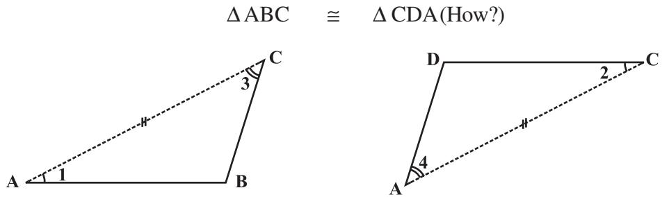

# Understanding Quadrilaterals

# 3.1 Introduction

You know that the paper is a model for a **plane surface**. When you join a number of points without lifting a pencil from the paper (and without retracing any portion of the drawing other than single points), you get a **plane curve**.

#### 3.1.1 Convex and concave polygons

A simple closed curve made up of only line segments is called a **polygon**.

**Curves that are polygons Curves that are not polygons**

Here are some convex polygons and some concave polygons. (Fig 3.1)

**Fig 3.1**

Can you find how these types of polygons differ from one another? Polygons that are convex have no portions of their diagonals in their exteriors or any line segment joining any two different points, in the interior of the polygon, lies wholly in the interior of it . Is this true with concave polygons? Study the figures given. Then try to describe in your own words what we mean by a convex polygon and what we mean by a concave polygon. Give two rough sketches of each kind.

In our work in this class, we will be dealing with convex polygons only.

#### 3.1.2 Regular and irregular polygons

A regular polygon is both 'equiangular' and 'equilateral'. For example, a square has sides of equal length and angles of equal measure. Hence it is a regular polygon. A rectangle is

CHAPTER 3

UNDERSTANDING QUADRILATERALS 21

equiangular but not equilateral. Is a rectangle a regular polygon? Is an equilateral triangle a regular polygon? Why?

[**Note:** Use of or indicates segments of equal length].

In the previous classes, have you come across any quadrilateral that is equilateral but not equiangular? Recall the quadrilateral shapes you saw in earlier classes – Rectangle, Square, Rhombus etc.

Is there a triangle that is equilateral but not equiangular?

## 3.2 Sum of the Measures of the Exterior Angles of a Polygon

On many occasions a knowledge of exterior angles may throw light on the nature of interior angles and sides.

#### DO THIS

Draw a polygon on the floor, using a piece of chalk. (In the figure, a pentagon ABCDE is shown) (Fig 3.2).

We want to know the total measure of angles, i.e, *m*∠1 + *m*∠2 + *m*∠3 + *m*∠4 + *m*∠5. Start at A. Walk along AB. On reaching B, you need to turn through an angle of *m*∠1, to walk along. BC When you reach at C, you need to turn through an angle of *m*∠2 to walk along CD. You continue to move in this manner, until you return to side AB. You would have in fact made one complete turn.

**Fig 3.4**

Therefore, *m*∠1 + *m*∠2 + *m*∠3 + *m*∠4 + *m*∠5 = 360°. This is true whatever be the number of sides of the polygon.

Therefore, *the sum of the measures of the external angles of any polygon is 360°*.

Example 2: Find the number of sides of a regular polygon whose each exterior angle has a measure of 45°.

Solution: Total measure of all exterior angles = 360° Measure of each exterior angle = 45°

(i) a regular octagon (ii) a regular 20-gon

Therefore, the number of exterior angles = 360 45 = 8

The polygon has 8 sides.

- **2.** Find the measure of each exterior angle of a regular polygon of
	- (i) 9 sides (ii) 15 sides
- **3.** How many sides does a regular polygon have if the measure of an exterior angle is 24°?
- **4.** How many sides does a regular polygon have if each of its interior angles is 165°?
- **5.** (a) Is it possible to have a regular polygon with measure of each exterior angle as 22°? (b) Can it be an interior angle of a regular polygon? Why?
- **6.** (a) What is the minimum interior angle possible for a regular polygon? Why?
	- (b) What is the maximum exterior angle possible for a regular polygon?

# 3.3 Kinds of Quadrilaterals

Based on the nature of the sides or angles of a quadrilateral, it gets special names.

#### 3.3.1 Trapezium

Trapezium is a quadrilateral with a pair of parallel sides.

**These are trapeziums These are not trapeziums**

Study the above figures and discuss with your friends why some of them are trapeziums while some are not. (**Note:** *The arrow marks indicate parallel lines*).

## DO THIS

1. Take identical cut-outs of congruent triangles of sides 3 cm, 4 cm, 5 cm. Arrange them as shown (Fig 3.5).

You get a trapezium. (Check it!) Which are the parallel sides here? Should the non-parallel sides be equal?

You can get two more trapeziums using the same set of triangles. Find them out and discuss their shapes.

- 2. Take four set-squares from your and your friend's instrument boxes. Use different numbers of them to place side-by-side and obtain different trapeziums. If the non-parallel sides of a trapezium are of equal length, we call it an *isosceles trapezium*. Did you get an isoceles trapezium in any of your investigations given above?
#### 3.3.2 Kite

Kite is a special type of a quadrilateral. The sides with the same markings in each figure are equal. For example AB = AD and BC = CD.

**These are kites These are not kites**

Study these figures and try to describe what a kite is. Observe that

- (i) A kite has 4 sides (It is a quadrilateral).
- (ii) There are exactly two **distinct consecutive pairs** of sides of equal length. Check whether a square is a kite.

## DO THIS

Take a thick white sheet.

Fold the paper once.

Draw two line segments of different lengths as shown in Fig 3.6.

Cut along the line segments and open up.

You have the shape of a kite (Fig 3.6).

Has the kite any line symmetry?

Fold both the diagonals of the kite. Use the set-square to check if they cut at right angles. Are the diagonals equal in length?

Verify (by paper-folding or measurement) if the diagonals bisect each other. By folding an angle of the kite on its opposite, check for angles of equal measure. Observe the diagonal folds; do they indicate any diagonal being an angle bisector?

Share your findings with others and list them. A summary of these results are given elsewhere in the chapter for your reference.

Show that ∆ABC and ∆ADC are congruent . What do we infer from this?

**Fig 3.6**

**Fig 3.7**

#### 3.3.3 Parallelogram

A parallelogram is a quadrilateral. As the name suggests, it has something to do with parallel lines.

**These are parallelograms**

 **These are not parallelograms**

Study these figures and try to describe in your own words what we mean by a parallelogram. Share your observations with your friends.

Check whether a rectangle is also a parallelogram.

#### DO THIS

Take two different rectangular cardboard strips of different widths (Fig 3.8).

its edge as drawn in the figure (Fig 3.9).

Now place the other strip in a slant position over the lines drawn and use this to draw two more lines as shown (Fig 3.10).

**Fig 3.9**

These four lines enclose a quadrilateral. This is made up of two pairs of parallel lines (Fig 3.11).

#### It is a parallelogram.

#### **A parallelogram is a quadrilateral whose opposite sides are parallel**.

#### 3.3.4 Elements of a parallelogram

There are four sides and four angles in a parallelogram. Some of these are equal. There are some terms associated with these elements that you need to remember.

**Fig 3.12**

Given a parallelogram ABCD (Fig 3.12).

AB and DC, are **opposite sides**. AD and BC form another pair of opposite sides.

∠A and ∠C are a pair of **opposite angles**; another pair of opposite angles would be ∠B and ∠D.

AB and BC are **adjacent sides**. This means, one of the sides starts where the other ends. Are BC and CD adjacent sides too? Try to find two more pairs of adjacent sides.

∠A and ∠B are **adjacent angles**. They are at the ends of the same side. ∠B and ∠C are also adjacent. Identify other pairs of adjacent angles of the parallelogram.

# DO THIS

Take cut-outs of two identical parallelograms, say ABCD and A′B′C′D′ (Fig 3.13).

Here AB is same as A B′ ′ except for the name. Similarly the other corresponding sides are equal too.

Place A B′ ′ over DC. Do they coincide? What can you now say about the lengths

AB and DC?

Similarly examine the lengths AD and BC . What do you find?

You may also arrive at this result by measuring AB and DC.

**Property:** *The opposite sides of a parallelogram are of equal length.*

#### TRY THESE

Looking at the angles,

$$\angle1=\angle2\quad\text{and}\quad\angle3=\angle4\quad\text{(Why?)}$$
  
  
Since in triangles ABC and ADC, $\angle1=\angle2$, $\angle3=\angle4$  
  
$\angle$A is common as by ASA, see now we can write 

and AC is common, so, by ASA congruency condition,

This gives  
  

$$\begin{array}{ccccc}\Delta\,\mbox{ABC}&\equiv&\Delta\,\mbox{CDA}&\mbox{(How is ASA used here?)}\\ \mbox{AB}=\mbox{DC}&\mbox{and}&\mbox{BC}=\mbox{AD}.\end{array}$$

Example 3: Find the perimeter of the parallelogram PQRS (Fig 3.16).

Solution: In a parallelogram, the opposite sides have same length.

#### 3.3.5 Angles of a parallelogram

We studied a property of parallelograms concerning the (opposite) sides. What can we say about the angles?

# DO THIS

Let ABCD be a parallelogram (Fig 3.17). Copy it on a tracing sheet. Name this copy as A′B′C′D′. Place A′B′C′D′ on ABCD. Pin them together at the point where the diagonals meet. Rotate the transparent sheet by 180°. The parallelograms still concide; but you now find A′ lying exactly on C and vice-versa; similarly B′ lies on D and vice-versa.

Does this tell you anything about the measures of the angles A and C? Examine the same for angles B and D. State your findings.

**Property:** *The opposite angles of a parallelogram are of equal measure.*

# TRY THESE

Take two identical 30° – 60° – 90° set-squares and form a parallelogram as before. Does the figure obtained help you to confirm the above property?

You can further justify this idea through logical arguments.

If AC and BD are the diagonals of the parallelogram, (Fig 3.18) you find that

∠1 =∠2 and ∠3 = ∠4 (Why?)

Studying ∆ABC and ∆ADC (Fig 3.19) separately, will help you to see that by ASA congruency condition,

This shows that ∠B and ∠D have same measure. In the same way you can get *m*∠A = *m* ∠C.

Alternatively, ∠1 = ∠2 and ∠3 = ∠4, we have, *m*∠A = ∠1+∠4 = ∠2+∠C *m*∠C

Example 4: In Fig 3.20, BEST is a parallelogram. Find the values *x*, *y* and *z*.

Solution: S is opposite to B.

So, *x* = 100° (opposite angles property)

*y* = 100° (measure of angle corresponding to ∠*x*)

*z* = 80° (since ∠*y*, ∠*z* is a linear pair)

We now turn our attention to adjacent angles of a parallelogram. In parallelogram ABCD, (Fig 3.21).

∠A and ∠D are supplementary since

DC AB and with transversal DA , these two angles are interior opposite.

∠A and ∠B are also supplementary. Can you say 'why'?

AD BC and BA is a transversal, making ∠A and ∠B interior opposite.

Identify two more pairs of supplementary angles from the figure.

**Property:** *The adjacent angles in a parallelogram are supplementary.*

Example 5: In a parallelogram RING, (Fig 3.22) if *m*∠R = 70°, find all the other angles.

Solution: Given *m*∠R = 70°

Then *m*∠N = 70°

because ∠R and ∠N are opposite angles of a parallelogram.

Since ∠R and ∠I are supplementary,

**Fig 3.20**

|  | m∠I = | 180° – 70° = 110° | Fig 3.22 |
| --- | --- | --- | --- |
| Also, | m∠G = | 110° since ∠G is opposite to ∠I |  |
| Thus, | m∠R = | m∠N = 70° and m∠I = m∠G = 110° |  |

**Fig 3.21**

# THINK, DISCUSS AND WRITE

After showing *m*∠R = *m*∠N = 70°, can you find *m*∠I and *m*∠G by any other method?

#### 3.3.6 Diagonals of a parallelogram

The diagonals of a parallelogram, in general, are not of equal length. (Did you check this in your earlier activity?) However, the diagonals of a parallelogram have an interesting property.

## DO THIS

Take a cut-out of a parallelogram, say,

ABCD (Fig 3.23). Let its diagonals AC and DB meet at O.

Find the mid point of AC by a fold, placing C on A. Is the

mid-point same as O?

 Does this show that diagonal DB bisects the diagonal AC at the point O? Discuss it with your friends. Repeat the activity to find where the mid point of DB could lie.

**Property:** *The diagonals of a parallelogram bisect each other (at the point of their intersection, of course!)*

To argue and justify this property is not very difficult. From Fig 3.24, applying ASA criterion, it is easy to see that

This gives AO = CO and BO = DO

**Fig 3.23**

∆ AOB ≅ ∆ COD (How is ASA used here?)

Example 6: In Fig 3.25 HELP is a parallelogram. (Lengths are in cms). Given that OE = 4 and HL is 5 more than PE? Find OH.

Solution : If OE = 4 then OP also is 4 (Why?) So PE = 8, (Why?) Therefore HL = 8 + 5 = 13

**Fig 3.25**

Hence OH =

$$\mathrm{OH}={\frac{1}{2}}\times13=6.5\,(\mathrm{cms})$$

# EXERCISE 3.3

- **1.** Given a parallelogram ABCD. Complete each statement along with the definition or property used.
	- (i) AD = ...... (ii) ∠ DCB = ......
	- (iii) OC = ...... (iv) *m* ∠DAB + *m* ∠CDA = ......

- **2.** Consider the following parallelograms. Find the values of the unknowns *x*, *y*, *z*.

- **3.** Can a quadrilateral ABCD be a parallelogram if
	- (i) ∠D + ∠B = 180°? (ii) AB = DC = 8 cm, AD = 4 cm and BC = 4.4 cm?
	- (iii) ∠A = 70° and ∠C = 65°?
- **4.** Draw a rough figure of a quadrilateral that is not a parallelogram but has exactly two opposite angles of equal measure.
- **5.** The measures of two adjacent angles of a parallelogram are in the ratio 3 : 2. Find the measure of each of the angles of the parallelogram.
- **6.** Two adjacent angles of a parallelogram have equal measure. Find the measure of each of the angles of the parallelogram.
- **7.** The adjacent figure HOPE is a parallelogram. Find the angle measures *x*, *y* and *z*. State the properties you use to find them.
- **8.** The following figures GUNS and RUNS are parallelograms. Find *x* and *y*. (Lengths are in cm)

In the above figure both RISK and CLUE are parallelograms. Find the value of *x*.

- **10.** Explain how this figure is a trapezium. Which of its two sides are parallel? (Fig 3.26)

## 3.4 Some Special Parallelograms

#### 3.4.1 Rhombus

We obtain a Rhombus (which, you will see, is a parallelogram) as a special case of kite (which is not a a parallelogram).

DO THIS

Recall the paper-cut kite you made earlier.

**Kite-cut Rhombus-cut**

When you cut along ABC and opened up, you got a kite. Here lengths AB and BC were different. If you draw AB = BC, then the kite you obtain is called a **rhombus**.

Note that the sides of rhombus are all of same length; this is not the case with the kite.

A rhombus is a quadrilateral with sides of equal length.

Since the opposite sides of a rhombus have the same length, it is also a parallelogram. So, *a rhombus has all the properties of a parallelogram and also that of a kite*. Try to list them out. You can then verify your list with the check list summarised in the book elsewhere.

The most useful property of a rhombus is that of its diagonals.

**Property:** *The diagonals of a rhombus are perpendicular bisectors of one another.*

# DO THIS

Take a copy of rhombus. By paper-folding verify if the point of intersection is the mid-point of each diagonal. You may also check if they intersect at right angles, using the corner of a set-square.

So, a rectangle is a parallelogram in which every angle is a right angle.

Being a parallelogram, the rectangle has opposite sides of equal length and its diagonals bisect each other.

In a parallelogram, the diagonals can be of different lengths. (Check this); but surprisingly the rectangle (being a special case) has diagonals of equal length.

**Property:** *The diagonals of a rectangle are of equal length.*

This is easy to justify. If ABCD is a rectangle (Fig 3.38), then looking at triangles ABC and ABD separately [(Fig 3.33) and (Fig 3.34) respectively], we have

|  | ∆ ABC ≅ | ∆ABD |  |  |
| --- | --- | --- | --- | --- |
| This is because | AB = | AB |  | (Common) |
|  | BC = | AD |  | (Why?) |
|  | m ∠A = | m | ∠B = 90° | (Why?) |

The congruency follows by SAS criterion.

Thus AC = BD

and *in a rectangle the diagonals, besides being equal in length bisect each other* (Why?)

Example 8: RENT is a rectangle (Fig 3.35). Its diagonals meet at O. Find *x*, if OR = 2*x* + 4 and OT = 3*x* + 1.

Solution: OT is half of the diagonal TE , OR is half of the diagonal RN . Diagonals are equal here. (Why?) So, their halves are also equal. Therefore 3*x* + 1 = 2*x* + 4 or *x* = 3

3.4.3 A square

A square is a rectangle with equal sides.

This means a square has all the properties of a rectangle with an additional requirement that all the sides have equal length.

The square, like the rectangle, has diagonals of equal length.

In a rectangle, there is no requirement for the diagonals to be perpendicular to one another, (Check this).

OB = OL and OE = OT.

In a square the diagonals.

- (i) bisect one another (square being a parallelogram)
- (ii) are of equal length (square being a rectangle) and
- (iii) are perpendicular to one another.

Hence, we get the following property.

**Property:** *The diagonals of a square are perpendicular bisectors of each other.*

## DO THIS

Take a square sheet, say PQRS (Fig 3.37).

Fold along both the diagonals. Are their mid-points the same?

Check if the angle at O is 90° by using a set-square.

This verifies the property stated above.

We can justify this also by arguing logically:

ABCD is a square whose diagonals meet at O (Fig 3.37).

OA = OC (Since the square is a parallelogram)

By SSS congruency condition, we now see that

∆ AOD ≅ ∆ COD (How?)

Therefore, *m*∠AOD = *m*∠COD

These angles being a linear pair, each is right angle.

# EXERCISE 3.4

- **1.** State whether True or False.
	- (a) All rectangles are squares (e) All kites are rhombuses.
	- (b) All rhombuses are parallelograms (f) All rhombuses are kites.
	- (c) All squares are rhombuses and also rectangles (g) All parallelograms are trapeziums.
	- (d) All squares are not parallelograms. (h) All squares are trapeziums.
- **2.** Identify all the quadrilaterals that have.
	- (a) four sides of equal length (b) four right angles
- **3.** Explain how a square is.
	- (i) a quadrilateral (ii) a parallelogram (iii) a rhombus (iv) a rectangle
- **4.** Name the quadrilaterals whose diagonals.

(i) bisect each other (ii) are perpendicular bisectors of each other (iii) are equal

- **5.** Explain why a rectangle is a convex quadrilateral.
- **6.** ABC is a right-angled triangle and O is the mid point of the side opposite to the right angle. Explain why O is equidistant from A, B and C. (The dotted lines are drawn additionally to help you).

- 
- 
- 
- -

# THINK, DISCUSS AND WRITE

- 1. A mason has made a concrete slab. He needs it to be rectangular. In what different ways can he make sure that it is rectangular?
- 2. A square was defined as a rectangle with all sides equal. Can we define it as rhombus with equal angles? Explore this idea.
- 3. Can a trapezium have all angles equal? Can it have all sides equal? Explain.

# WHAT HAVE WE DISCUSSED?

| Quadrilateral | Properties |
| --- | --- |
| Parallelogram: | (1) Opposite sides are equal. |
| A quadrilateral | (2) Opposite angles are equal. |
| with each pair of | (3) Diagonals bisect one another. |
| opposite sides |  |
| parallel. |  |
| Rhombus: | (1) All the properties of a parallelogram. |
| A parallelogram with sides | (2) Diagonals are perpendicular to each other. |
| of equal length. |  |
| Rectangle: | (1) All the properties of a parallelogram. |
| A parallelogram | (2) Each of the angles is a right angle. |
| with a right angle. | (3) Diagonals are equal. |
| Square: A rectangle |  |
| with sides of equal length. | All the properties of a parallelogram, rhombus and a rectangle. |
| Kite: A quadrilateral with exactly two pairs | (1) The diagonals are perpendicular |
| of equal consecutive | to one another |
| sides | (2) One of the diagonals bisects the other. |
|  | (3) In the figure m∠B = m∠D but |
|  | m∠A ≠ m∠C. |

