# 4.1 Looking for Information

In your day-to-day life, you might have come across information, such as:

- (a) Runs made by a batsman in the last 10 test matches.
- (b) Number of wickets taken by a bowler in the last 10 ODIs.
- (c) Marks scored by the students of your class in the Mathematics unit test.
- (d) Number of story books read by each of your friends etc.

The information collected in all such cases is called **data**. Data is usually collected in the context of a situation that we want to study. For example, a teacher may like to know the average height of students in her class. To find this, she will write the heights of all the students in her class, organise the data in a systematic manner and then interpret it accordingly.

Sometimes, data is represented **graphically** to give a clear idea of what it represents. Do you remember the different types of graphs which we have learnt in earlier classes?

- **1. A Pictograph:** Pictorial representation of data using symbols.

- (i) How many cars were produced in the month of July?
- (ii) In which month were maximum number of cars produced?
- **2. A bar graph:** A display of information using bars of uniform width, their heights being proportional to the respective values.

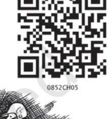

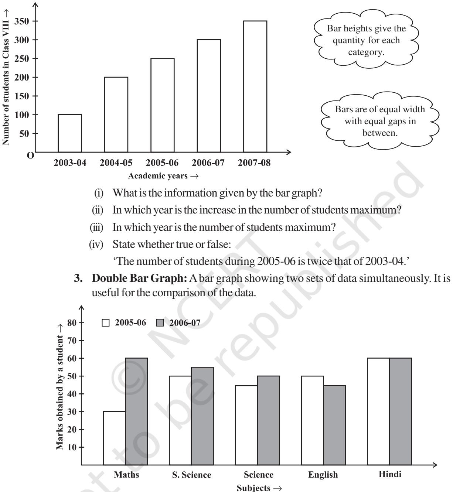

(i) What is the information given by the double bar graph?

(ii) In which subject has the performance improved the most?

(iii) In which subject has the performance deteriorated?

- (iv) In which subject is the performance at par?
# THINK, DISCUSS AND WRITE

If we change the position of any of the bars of a bar graph, would it change the information being conveyed? Why?

# TRY THESE

Draw an appropriate graph to represent the given information.

| Month | July | August | September | October | November | December |
| --- | --- | --- | --- | --- | --- | --- |
| Number of watches sold | 1000 | 1500 | 1500 | 2000 | 2500 | 1500 |
| 1. |  |  |  |  |  |  |

| 2. | Children who prefer | School A | School B | School C |
| --- | --- | --- | --- | --- |
|  | Walking | 40 | 55 | 15 |
|  | Cycling | 45 | 25 | 35 |

3. Percentage wins in ODI by 8 top cricket teams.

| Teams | From Champions | Last 10 |
| --- | --- | --- |
|  | Trophy to World Cup-06 | ODI in 07 |
| South Africa | 75% | 78% |
| Australia | 61% | 40% |
| Sri Lanka | 54% | 38% |
| New Zealand | 47% | 50% |
| England | 46% | 50% |
| Pakistan | 45% | 44% |
| West Indies | 44% | 30% |
| India | 43% | 56% |

## 4.2 Circle Graph or Pie Chart

Have you ever come across data represented in circular form as shown (Fig 4.1)?

The time spent by a child during a day Age groups of people in a town

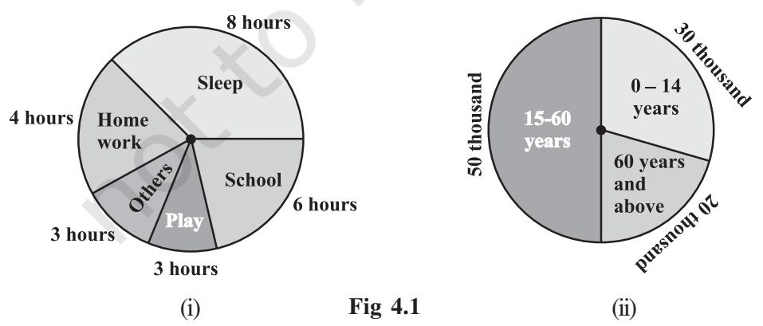

These are called **circle graphs**. A circle graph shows the relationship between a whole and its parts. Here, the whole circle is divided into sectors. The size of each sector is proportional to the activity or information it represents.

For example, in the above graph, the proportion of the sector for hours spent in sleeping

| = = | number of sleeping hours | 8 hours | 1 = |  |  |
| --- | --- | --- | --- | --- | --- |
| 24 hours whole day |  |  | 3 |  |  |
| So, this sector is drawn as 1 rd part of the circle. Similarly, the proportion of the sector |  |  |  |  |  |
| 3 number of school hours |  |  | 6 hours | = |  |
| for hours spent in school = = |  |  |  |  | 1 |
| whole day |  |  | 24 hours |  | 4 |
| So this sector is drawn 1 of the circle. Similarly, the size of other sectors can be found. th |  |  |  |  |  |
| 4 |  |  |  |  |  |
| Add up the fractions for all the activities. Do you get the total as one? |  |  |  |  |  |
| A circle graph is also called a pie chart. |  |  |  |  |  |

#### TRY THESE

- 1. Each of the following pie charts (Fig 4.2) gives you a different piece of information about your class. Find the fraction of the circle representing each of these information.
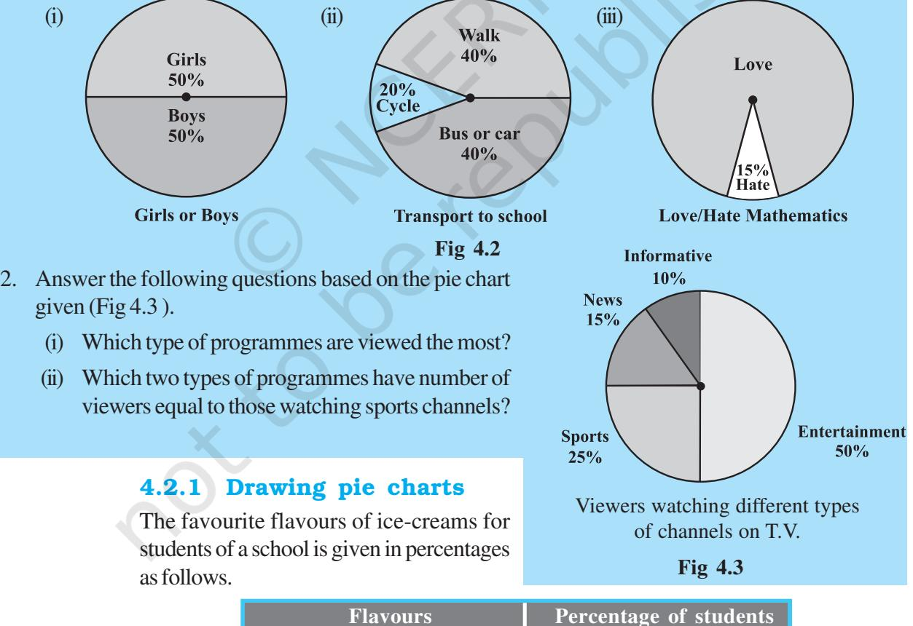

| Flavours | Percentage of students |
| --- | --- |
|  | Preferring the flavours |
| Chocolate | 50% |
| Vanilla | 25% |
| Other flavours | 25% |

Let us represent this data in a pie chart.

The total angle at the centre of a circle is 360°. The central angle of the sectors will be a fraction of 360°. We make a table to find the central angle of the sectors (Table 4.1).

| Flavours | Students in per cent preferring the flavours |  | In fractions | Fraction of 360° |
| --- | --- | --- | --- | --- |
| Chocolate | 50% | 50 | 1 = | 1 2 of 360° = 180° |
|  |  | 100 | 2 |  |
| Vanilla | 25% | 25 | 1 = 4 | 1 4 of 360° = 90° |
|  |  | 100 |  |  |
| Other flavours | 25% | 25 | 1 = | 1 4 of 360° = 90° |
|  |  | 100 | 4 |  |

| Table 4.1 |
| --- |

- 1. Draw a circle with any convenient radius. Mark its centre (O) and a radius (OA).
- 2. The angle of the sector for chocolate is 180°. Use the protractor to draw ∠AOB = 180°.
- 3. Continue marking the remaining sectors.

on various items and savings of a family during a month.

- (i) On which item, the expenditure was maximum?
- (ii) Expenditure on which item is equal to the total savings of the family?
- (iii) If the monthly savings of the family is 3000, what is the monthly expenditure on clothes?

#### Solution:

- (i) Expenditure is maximum on food.
- (ii) Expenditure on Education of children is the same (i.e., 15%) as the savings of the family.

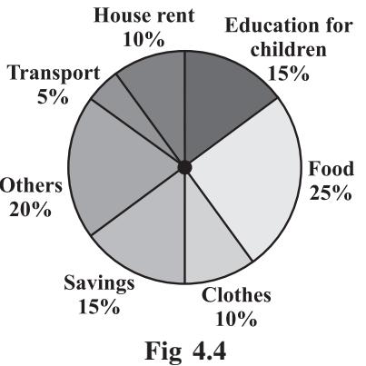

- (iii) 15% represents 3000
Therefore, 10% represents 3000 10 15 × = 2000

Example 2: On a particular day, the sales (in rupees) of different items of a baker's shop are given below.

| ordinary bread | : | 320 |  |
| --- | --- | --- | --- |
| fruit bread | : | 80 |  |
| cakes and pastries | : | 160 | Draw a pie chart for this data. |
| biscuits | : | 120 |  |
| others | : | 40 |  |
| Total | : | 720 |  |

Solution: We find the central angle of each sector. Here the total sale = 720. We thus have this table.

| Item | Sales (in ) |  | In Fraction |  | Central Angle |  |
| --- | --- | --- | --- | --- | --- | --- |
| Ordinary Bread | 320 | 320 | 4 = | 4 × | °= 360 | ° 160 |
|  |  | 720 | 9 | 9 |  |  |
| Biscuits | 120 | 120 | 1 = | 1 × | °= 360 | ° 60 |
|  |  | 720 | 6 | 6 |  |  |
| Cakes and pastries | 160 | 160 | 2 = | 2 × | °= 360 | ° 80 |
|  |  | 720 | 9 | 9 |  |  |
| Fruit Bread | 80 | 80 | 1 = | 1 × | °= 360 | ° 40 |
|  |  | 720 | 9 | 9 |  |  |
| Others | 40 | 40 | 1 = | 1 × | °= 360 | ° 20 |
|  |  | 720 | 18 | 18 |  |  |

### TRY THESE

Draw a pie chart of the data given below.

The time spent by a child during a day.

Sleep — 8 hours School — 6 hours Home work — 4 hours

Play — 4 hours

Others — 2 hours

# THINK, DISCUSS AND WRITE

Which form of graph would be appropriate to display the following data.

- **1. Production of food grains of a state.**

| Year | 2001 | 2002 | 2003 | 2004 | 2005 | 2006 |
| --- | --- | --- | --- | --- | --- | --- |
| Production | 60 | 50 | 70 | 55 | 80 | 85 |
| (in lakh tons) |  |  |  |  |  |  |

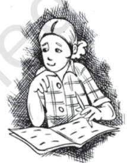

#### **2. Choice of food for a group of people.**

| Favourite food | Number of people |
| --- | --- |
| North Indian | 30 |
| South Indian | 40 |
| Chinese | 25 |
| Others | 25 |
| Total | 120 |

#### **3. The daily income of a group of a factory workers.**

| Daily Income | Number of workers |
| --- | --- |
| (in Rupees) | (in a factory) |
| 75-100 | 45 |
| 100-125 | 35 |
| 125-150 | 55 |
| 150-175 | 30 |
| 175-200 | 50 |
| 200-225 | 125 |
| 225-250 | 140 |
| Total | 480 |

# EXERCISE 4.1

- **1.** A survey was made to find the type of music that a certain group of young people liked in a city. Adjoining pie chart shows the findings of this survey.
From this pie chart answer the following:

- (i) If 20 people liked classical music, how many young people were surveyed?
- (ii) Which type of music is liked by the maximum number of people?
- (iii) If a cassette company were to make 1000 CD's, how many of each type would they make?
- **2.** A group of 360 people were asked to vote for their favourite season from the three seasons rainy, winter and summer.
	- (i) Which season got the most votes?
	- (ii) Find the central angle of each sector.
	- (iii) Draw a pie chart to show this information.

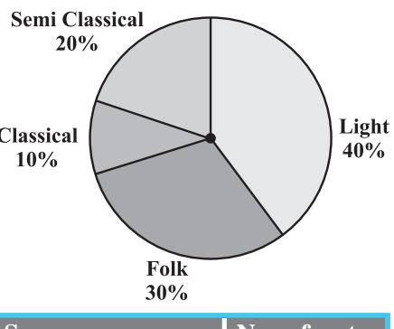

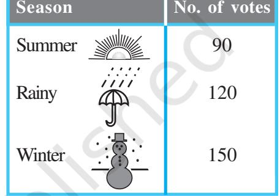

- **3.** Draw a pie chart showing the following information. The table shows the colours preferred by a group of people.

| Colours | Number of people | Find the proportion of each sector. For example, |
| --- | --- | --- |
|  |  | 18 1 9 1 = = Blue is ; Green is and so on. Use |
| Blue | 18 | 36 2 36 4 |
| Green | 9 | this to find the corresponding angles. |
| Red | 6 |  |
| Yellow | 3 |  |
| Total | 36 |  |

- **4.** The adjoining pie chart gives the marks scored in an examination by a student in Hindi, English, Mathematics, Social Science and Science. If the total marks obtained by the students were 540, answer the following questions.
	- (i) In which subject did the student score 105 marks?

(**Hint:** for 540 marks, the central angle = 360°. So, for 105 marks, what is the central angle?)

- (ii) How many more marks were obtained by the student in Mathematics than in Hindi?
- (iii) Examine whether the sum of the marks obtained in Social Science and Mathematics is more than that in Science and Hindi. (**Hint:** Just study the central angles).

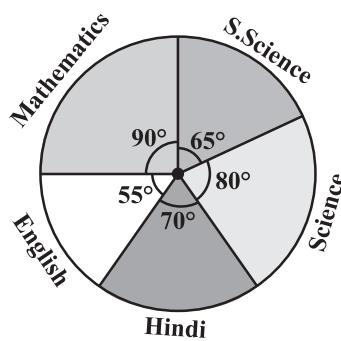

- **5.** The number of students in a hostel, speaking different languages is given below. Display the data in a pie chart.

| Language | Hindi | English | Marathi | Tamil | Bengali | Total |
| --- | --- | --- | --- | --- | --- | --- |
| Number | 40 | 12 | 9 | 7 | 4 | 72 |
| of students |  |  |  |  |  |  |

# 4.3 Chance and Probability

Sometimes it happens that during rainy season, you carry a raincoat every day and it does not rain for many days. However, by chance, one day you forget to take the raincoat and it rains heavily on that day.

Sometimes it so happens that a student prepares 4 chapters out of 5, very well for a test. But a major question is asked from the chapter that she left unprepared.

Everyone knows that a particular train runs in time but the day you reach well in time it is late!

You face a lot of situations such as these where you take a chance and it does not go the way you want it to. Can you give some more examples? These are examples where the chances of a certain thing happening or not happening are not equal. The chances of the train being in time or being late are not the same. When you buy a ticket which is wait listed, you do take a chance. You hope that it might get confirmed by the time you travel.

We however, consider here certain experiments whose results have an equal chance of occurring.

#### 4.3.1 Getting a result

You might have seen that before a cricket match starts, captains of the two teams go out to toss a coin to decide which team will bat first.

What are the possible results you get when a coin is tossed? Of course, Head or Tail.

Imagine that you are the captain of one team and your friend is the captain of the other team. You toss a coin and ask your friend to make the call. Can you control the result of the toss? Can you get a head if you want one? Or a tail if you want that? No, that is not possible. Such an experiment is called a **random experiment**. Head or Tail are the two **outcomes** of this experiment.

#### TRY THESE

- 1. If you try to start a scooter, what are the possible outcomes?
- 2. When a die is thrown, what are the six possible outcomes?

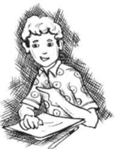

- 3. When you spin the wheel shown, what are the possible outcomes? (Fig 4.6) List them.
(Outcome here means the sector at which the pointer stops).

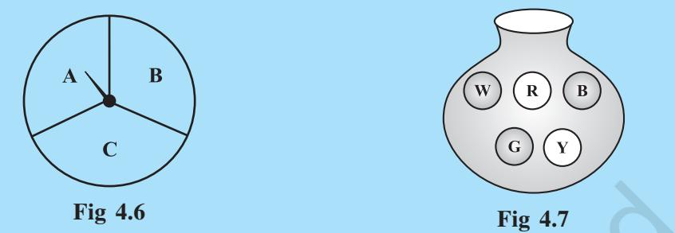

- 4. You have a bag with five identical balls of different colours and you are to pull out (draw) a ball without looking at it; list the outcomes you would get (Fig 4.7).
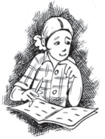

# THINK, DISCUSS AND WRITE

#### **In throwing a die:**

- Does the first player have a greater chance of getting a six?
- Would the player who played after him have a lesser chance of getting a six?
- Suppose the second player got a six. Does it mean that the third player would not have a chance of getting a six?

#### 4.3.2 Equally likely outcomes:

A coin is tossed several times and the number of times we get head or tail is noted. Let us look at the result sheet where we keep on increasing the tosses:

| Number of tosses | Tally marks (H) | Number of heads | Tally mark (T) | Number of tails |
| --- | --- | --- | --- | --- |
| 50 |  | 27 |  | 23 |
|  |  |  |  |  |
| 60 |  | 28 |  | 32 |
|  |  |  |  |  |
| 70 | ... | 33 | ... | 37 |
| 80 | ... | 38 | ... | 42 |
| 90 | ... | 44 | ... | 46 |
| 100 | ... | 48 | ... | 52 |

Observe that as you increase the number of tosses more and more, the number of heads and the number of tails come closer and closer to each other.

This could also be done with a die, when tossed a large number of times. Number of each of the six outcomes become almost equal to each other.

In such cases, we may say that the different outcomes of the experiment are equally likely. This means that each of the outcomes has the same chance of occurring.

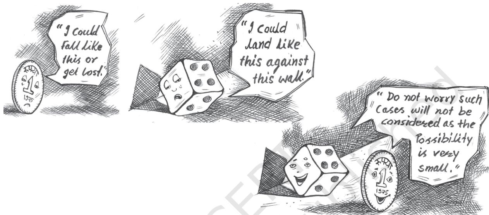

#### 4.3.3 Linking chances to probability

Consider the experiment of tossing a coin once. What are the outcomes? There are only two outcomes – Head or Tail. Both the outcomes are equally likely. Likelihood of getting a head is one out of two outcomes, i.e., 1 2 . In other words, we say that the probability of 1

getting a head = 2 . What is the probability of getting a tail?

Now take the example of throwing a die marked with 1, 2, 3, 4, 5, 6 on its faces (one number on one face). If you throw it once, what are the outcomes?

The outcomes are: 1, 2, 3, 4, 5, 6. Thus, there are six equally likely outcomes.

What is the probability of getting the outcome '2'?

← Number of outcomes giving 2 1

It is ← Number of equally likely outcomes. 6

What is the probability of getting the number 5? What is the probability of getting the number 7? What is the probability of getting a number 1 through 6?

#### 4.3.4 Outcomes as events

Each outcome of an experiment or a collection of outcomes make an **event**.

For example in the experiment of tossing a coin, getting a Head is an event and getting a Tail is also an event.

In case of throwing a die, getting each of the outcomes 1, 2, 3, 4, 5 or 6 is an event.

 Is getting an even number an event? Since an even number could be 2, 4 or 6, getting an even number is also an event. What will be the probability of getting an even number?

- It is ← Number of outcomes that make the event 3
← Total number of outcomes of the experiment. 6

Example 3: A bag has 4 red balls and 2 yellow balls. (The balls are identical in all respects other than colour). A ball is drawn from the bag without looking into the bag. What is probability of getting a red ball? Is it more or less than getting a yellow ball?

Solution: There are in all (4 + 2 =) 6 outcomes of the event. Getting a red ball consists of 4 outcomes. (Why?) Therefore, the probability of getting a red ball is 4 6 = 2 3 . In the same way the probability of getting a yellow ball = 2 1 6 3 = (Why?). Therefore, the probability of getting a red ball is more than that of getting a yellow ball.

#### TRY THESE

Suppose you spin the wheel

- 1. (i) List the number of outcomes of getting a green sector and not getting a green sector on this wheel (Fig 4.8).
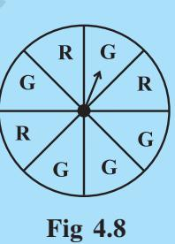

- (ii) Find the probability of getting a green sector.
- (iii) Find the probability of not getting a green sector.

#### 4.3.5 Chance and probability related to real life

We talked about the chance that it rains just on the day when we do not carry a rain coat.

What could you say about the chance in terms of probability? Could it be one in 10 days during a rainy season? The probability that it rains is then 1 10 . The probability that it does not rain = 9 10 . (Assuming raining or not raining on a day are equally likely)

The use of probability is made in various cases in real life.

- 1. To find characteristics of a large group by using a small part of the group.
For example, during elections 'an exit poll' is taken. This involves asking the people whom they have voted for, when they come out after voting at the centres which are chosen off hand and distributed over the whole area. This gives an idea of chance of winning of each candidate and predictions are made based on it accordingly.

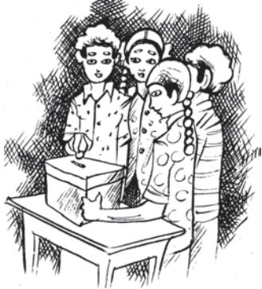

- 2. Meteorological Department predicts weather by observing trends from the data over many years in the past.
# EXERCISE 4.2

- **1.** List the outcomes you can see in these experiments.
	-

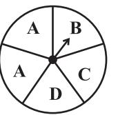

- (a) Spinning a wheel (b) Tossing two coins together
- **2.** When a die is thrown, list the outcomes of an event of getting
	- (i) (a) a prime number (b) not a prime number.
	- (ii) (a) a number greater than 5 (b) a number not greater than 5.
- **3.** Find the.
	- (a) Probability of the pointer stopping on D in (Question 1-(a))?
	- (b) Probability of getting an ace from a well shuffled deck of 52 playing cards?
	- (c) Probability of getting a red apple. (See figure below)

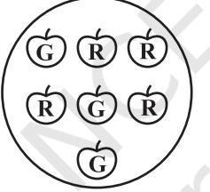

- **4.** Numbers 1 to 10 are written on ten separate slips (one number on one slip), kept in a box and mixed well. One slip is chosen from the box without looking into it. What is the probability of .
	- (i) getting a number 6?
	- (ii) getting a number less than 6?
	- (iii) getting a number greater than 6?
	- (iv) getting a 1-digit number?
- **5.** If you have a spinning wheel with 3 green sectors, 1 blue sector and 1 red sector, what is the probability of getting a green sector? What is the probability of getting a non blue sector?
- **6.** Find the probabilities of the events given in Question 2.

# WHAT HAVE WE DISCUSSED?

- **1.** In order to draw meaningful inferences from any data, we need to organise the data systematically.
- **2.** Data can also be presented using **circle graph** or **pie chart**. A circle graph shows the relationship between a whole and its part.
- **3.** There are certain experiments whose outcomes have an equal chance of occurring.
- **4.** A **random experiment** is one whose outcome cannot be predicted exactly in advance.
- **5.** Outcomes of an experiment are **equally likely** if each has the same chance of occurring.

Number of outcomes that make an event

- **6. Probability of an event** = Total number of outcomes of the experiment , when the outcomes are equally likely.
- **7.** One or more outcomes of an experiment make an **event**.
- **8**. Chances and probability are related to real life.

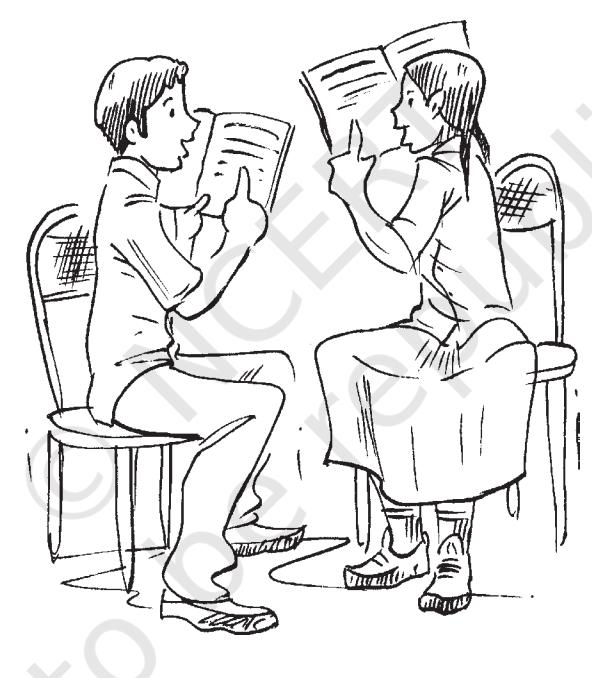

