# 5.1 Introduction

You know that the area of a square = side × side (where 'side' means 'the length of a side'). Study the following table.

| Side of a square (in cm) | Area of the square (in cm2 ) |
| --- | --- |
| 1 | 1 × 1 = 1 = 12 |
| 2 | 2 × 2 = 4 = 22 |
| 3 | 3 × 3 = 9 = 32 |
| 5 | 5 × 5 = 25 = 52 |
| 8 | 8 × 8 = 64 = 82 |
| a | a × a = a2 |

What is special about the numbers 4, 9, 25, 64 and other such numbers?

Since, 4 can be expressed as 2 × 2 = 22 , 9 can be expressed as 3 × 3 = 32 , all such numbers can be expressed as the product of the number with itself.

Such numbers like 1, 4, 9, 16, 25, ... are known as **square numbers**.

In general, if a natural number *m* can be expressed as *n*2 , where *n* is also a natural number, then *m* is a **square number**. Is 32 a square number?

We know that 52 = 25 and 62 = 36. If 32 is a square number, it must be the square of a natural number between 5 and 6. But there is no natural number between 5 and 6.

Therefore 32 is not a square number.

Consider the following numbers and their squares.

| Number | Square |
| --- | --- |
| 1 | 1 × 1 = 1 |
| 2 | 2 × 2 = 4 |

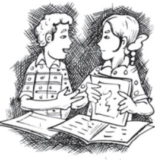

| 3 | 3 × 3 = 9 |  |
| --- | --- | --- |
| 4 | 4 × 4 = 16 | Can you |
| 5 | 5 × 5 = 25 | complete it? |
| 6 | ----------- |  |
| 7 | ----------- |  |
| 8 | ----------- |  |
| 9 | ----------- |  |
| 10 | ----------- |  |

From the above table, can we enlist the square numbers between 1 and 100? Are there any natural square numbers upto 100 left out?

You will find that the rest of the numbers are not square numbers.

The numbers 1, 4, 9, 16 ... are square numbers. These numbers are also called **perfect squares**.

# TRY THESE

1. Find the perfect square numbers between (i) 30 and 40 (ii) 50 and 60

# 5.2 Properties of Square Numbers

Following table shows the squares of numbers from 1 to 20.

| Number | Square | Number | Square |
| --- | --- | --- | --- |
| 1 | 1 | 11 | 121 |
| 2 | 4 | 12 | 144 |
| 3 | 9 | 13 | 169 |
| 4 | 16 | 14 | 196 |
| 5 | 25 | 15 | 225 |
| 6 | 36 | 16 | 256 |
| 7 | 49 | 17 | 289 |
| 8 | 64 | 18 | 324 |
| 9 | 81 | 19 | 361 |
| 10 | 100 | 20 | 400 |

Study the square numbers in the above table. What are the ending digits (that is, digits in the units place) of the square numbers? All these numbers end with 0, 1, 4, 5, 6 or 9 at units place. None of these end with 2, 3, 7 or 8 at unit's place.

Can we say that if a number ends in 0, 1, 4, 5, 6 or 9, then it must be a square number? Think about it.

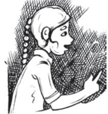

|  |  | TRY THESE |  |  |  |  |  |  |
| --- | --- | --- | --- | --- | --- | --- | --- | --- |
| 1. |  | Can we say whether the following numbers are perfect squares? How do we know? |  |  |  |  |  |  |
|  | (i) | 1057 | (ii) | 23453 | (iii) | 7928 | (iv) | 222222 |
|  | (v) | 1069 | (vi) | 2061 |  |  |  |  |

Write five numbers which you can decide by looking at their units digit that they are not square numbers.

- 2. Write five numbers which you cannot decide just by looking at their units digit (or units place) whether they are square numbers or not.
- Study the following table of some numbers and their squares and observe the one's place in both.

| Number | Square | Number | Square | Number | Square |
| --- | --- | --- | --- | --- | --- |
| 1 | 1 | 11 | 121 | 21 | 441 |
| 2 | 4 | 12 | 144 | 22 | 484 |
| 3 | 9 | 13 | 169 | 23 | 529 |
| 4 | 16 | 14 | 196 | 24 | 576 |
| 5 | 25 | 15 | 225 | 25 | 625 |
| 6 | 36 | 16 | 256 | 30 | 900 |
| 7 | 49 | 17 | 289 | 35 | 1225 |
| 8 | 64 | 18 | 324 | 40 | 1600 |
| 9 | 81 | 19 | 361 | 45 | 2025 |
| 10 | 100 | 20 | 400 | 50 | 2500 |

**Table 1**

The following square numbers end with digit 1.

| Square | Number |
| --- | --- |
| 1 | 1 |
| 81 | 9 |
| 121 | 11 |
| 361 | 19 |
| 441 | 21 |

# TRY THESE

Which of 1232 , 772, 822 , 1612 , 1092 would end with digit 1?

Write the next two square numbers which end in 1 and their corresponding numbers. *You will see that if a number has 1 or 9 in the units place, then it's square ends in 1.*

- Let us consider square numbers ending in 6.

| Square | Number | TRY THESE |  |  |  |  |  |
| --- | --- | --- | --- | --- | --- | --- | --- |
| 16 | 4 | Which of the following numbers would have digit |  |  |  |  |  |
| 36 | 6 | 6 at unit place. |  |  |  |  |  |
| 196 | 14 | (i) | 192 | (ii) | 242 | (iii) | 262 |
| 256 | 16 | (iv) | 362 | (v) | 342 |  |  |

We can see that *when a square number ends in 6, the number whose square it is, will have either 4 or 6 in unit's place*.

Can you find more such rules by observing the numbers and their squares (Table 1)?

# TRY THESE

What will be the "one's digit" in the square of the following numbers?

| (i) | 1234 | (ii) | 26387 | (iii) | 52698 | (iv) | 99880 |
| --- | --- | --- | --- | --- | --- | --- | --- |
| (v) | 21222 | (vi) | 9106 |  |  |  |  |

• Consider the following numbers and their squares.

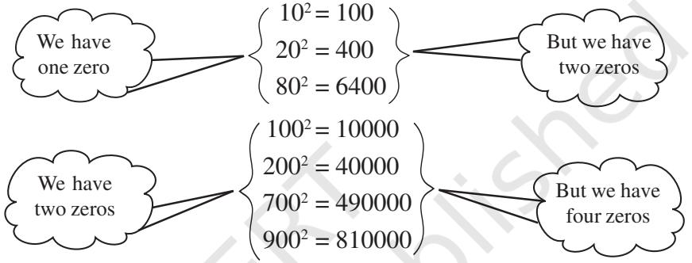

If a number contains 3 zeros at the end, how many zeros will its square have ? What do you notice about the number of zeros at the end of the number and the number of zeros at the end of its square?

- Can we say that square numbers can only have even number of zeros at the end? • See Table 1 with numbers and their squares.
	- What can you say about the squares of even numbers and squares of odd numbers?

# TRY THESE

- 1. The square of which of the following numbers would be an odd number/an even number? Why?
- (i) 727 (ii) 158 (iii) 269 (iv) 1980 2. What will be the number of zeros in the square of the following numbers? (i) 60 (ii) 400

# 5.3 Some More Interesting Patterns

#### **1. Adding triangular numbers.**

Do you remember triangular numbers (numbers whose dot patterns can be arranged as triangles)? *****

|  |  |  | * | * | * |
| --- | --- | --- | --- | --- | --- |
|  |  | * | ** | * | ** |
|  | * | ** | *** | * | *** |
| * | ** | *** | **** | * | **** |
| 1 | 3 | 6 | 10 |  | 15 |

If we combine two consecutive triangular numbers, we get a square number, like

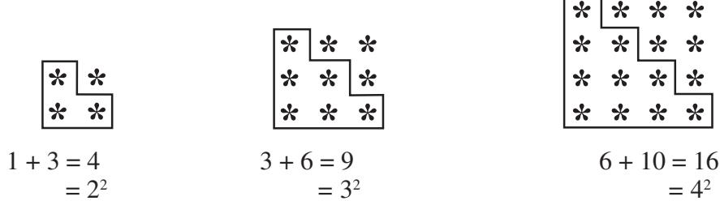

#### **2. Numbers between square numbers**

Let us now see if we can find some interesting pattern between two consecutive square numbers.

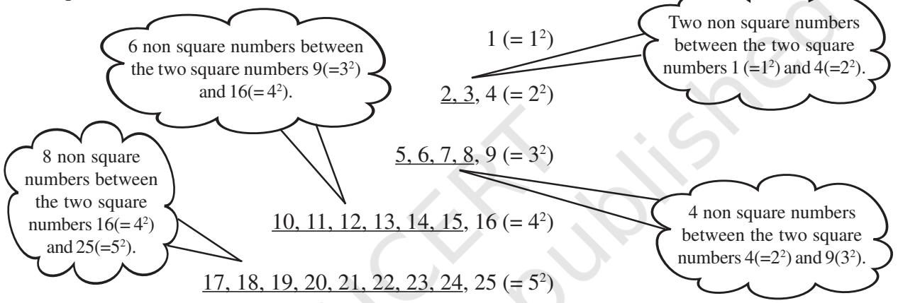

Between 12 (=1) and 22 (= 4) there are two (i.e., 2 × 1) non square numbers 2, 3.

Between 22 (= 4) and 32 (= 9) there are four (i.e., 2 × 2) non square numbers 5, 6, 7, 8.

Now, 32

$$=9,\qquad4^{2}=16$$

Therefore, 42 – 32 = 16 – 9 = 7

Between 9(=32 ) and 16(= 42 ) the numbers are 10, 11, 12, 13, 14, 15 that is, six non-square numbers which is 1 less than the difference of two squares.

We have 42 = 16 and 52 = 25

Therefore, 52 – 42 = 9

Between 16(= 42 ) and 25(= 52 ) the numbers are 17, 18, ... , 24 that is, eight non square numbers which is 1 less than the difference of two squares.

Consider 72 and 62 . Can you say how many numbers are there between 62 and 72 ? If we think of any natural number *n* and (*n* + 1), then,

$$(n+1)^{2}-n^{2}=(n^{2}+2n+1)-n^{2}=2n+1.$$

We find that between *n*2 and (*n* + 1)2 there are 2*n* numbers which is 1 less than the difference of two squares.

Thus, in general we can say that *there are 2n non perfect square numbers between the squares of the numbers n and* (*n* + 1). Check for *n* = 5, *n* = 6 etc., and verify.

# TRY THESE

- 1. How many natural numbers lie between 92 and 102 ? Between 112 and 122 ?
- 2. How many non square numbers lie between the following pairs of numbers
	- (i) 1002 and 1012 (ii) 902 and 912 (iii) 10002 and 10012

## **3. Adding odd numbers**

| Consider the following |  |  |
| --- | --- | --- |
| 1 [one odd number] | = | 1 = 12 |
| 1 + 3 [sum of first two odd numbers] | = | 4 = 22 |
| 1 + 3 + 5 [sum of first three odd numbers] | = | 9 = 32 |
| 1 + 3 + 5 + 7 [... ] | = | 16 = 42 |
| 1 + 3 + 5 + 7 + 9 [... ] | = | 25 = 52 |
| 1 + 3 + 5 + 7 + 9 + 11 [... ] | = | 36 = 62 |

So we can say that the *sum of first n odd natural numbers is n*2 .

Looking at it in a different way, we can say: 'If the number is a square number, it has to be the sum of successive **odd** numbers starting from 1.

Consider those numbers which are not perfect squares, say 2, 3, 5, 6, ... . Can you express these numbers as a sum of successive odd natural numbers beginning from 1? You will find that these numbers cannot be expressed in this form.

Consider the number 25. Successively subtract 1, 3, 5, 7, 9, ... from it

- (i) 25 1 = 24 (ii) 24 3 = 21 (iii) 21 5 = 16 (iv) 16 7 = 9 (v) 9 – 9 = 0
This means, 25 = 1 + 3 + 5 + 7 + 9. Also, 25 is a perfect square.

Now consider another number 38, and again do as above.

- (i) 38 1 = 37 (ii) 37 3 = 34 (iii) 34 5 = 29 (iv) 29 7 = 22
- (v) 22 9 = 13 (vi) 13 11 = 2 (vii) 2 13 = 11

#### TRY THESE

Find whether each of the following numbers is a perfect square or not?

| (i) | 121 | (ii) | 55 | (iii) | 81 |
| --- | --- | --- | --- | --- | --- |
| (iv) | 49 | (v) | 69 |  |  |

This shows that we are not able to express 38 as the sum of consecutive odd numbers starting with 1. Also, 38 is not a perfect square.

So we can also say that *if a natural number cannot be expressed as a sum of successive odd natural numbers starting with 1, then it is not a perfect square*.

We can use this result to find whether a number is a perfect square or not.

#### **4. A sum of consecutive natural numbers**

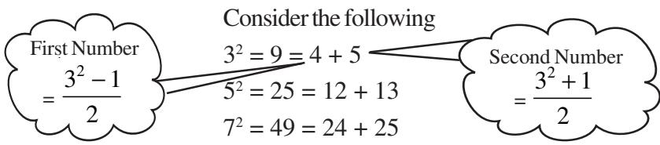

TRY THESE Vow! we can express the square of any odd number as the sum of two consecutive positive integers. 92 = 81 = 40 + 41 112 = 121 = 60 + 61 152 = 225 = 112 + 113 1. Express the following as the sum of two consecutive integers. (i) 212 (ii) 132 (iii) 112 (iv) 192 2. Do you think the reverse is also true, i.e., is the sum of any two consecutive positive integers is perfect square of a number? Give example to support your answer. **5. Product of two consecutive even or odd natural numbers** 11 × 13 = 143 = 122 – 1 Also 11 × 13 = (12 – 1) × (12 + 1) Therefore, 11 × 13 = (12 – 1) × (12 + 1) = 122 – 1 Similarly, 13 × 15 = (14 – 1) × (14 + 1) = 142 – 1 29 × 31 = (30 – 1) × (30 + 1) = 302 – 1 44 × 46 = (45 – 1) × (45 + 1) = 452 – 1 So in general we can say that (*a* + 1) × (*a* – 1) = *a*2 – 1. **6. Some more patterns in square numbers** Observe the squares of numbers; 1, 11, 111 ... etc. They give a beautiful pattern:

| 12 = |  |  |  |  |  |  |  | 1 |  |  |  |  |  |  |  |
| --- | --- | --- | --- | --- | --- | --- | --- | --- | --- | --- | --- | --- | --- | --- | --- |
| 112 = |  |  |  |  |  |  | 1 | 2 | 1 |  |  |  |  |  |  |
| 1112 = |  |  |  |  |  | 1 | 2 | 3 | 2 | 1 |  |  |  |  |  |
| 11112 | = |  |  |  | 1 | 2 | 3 | 4 | 3 | 2 | 1 |  |  |  |  |
| 111112 | = |  |  | 1 | 2 | 3 | 4 | 5 | 4 | 3 | 2 | 1 |  |  |  |
| 111111112 =1 |  | 2 | 3 | 4 | 5 | 6 | 7 | 8 | 7 | 6 | 5 | 4 | 3 | 2 | 1 |

Another interesting pattern.

| 72 = 49 |
| --- |
| 672 = 4489 |
| 6672 = 444889 |
| 66672 = 44448889 |
| 666672 = 4444488889 |
| 6666672 = 444444888889 |

The fun is in being able to find out why this happens. May be it would be interesting for you to explore and think about such questions even if the answers come some years later.

# TRY THESE

Write the square, making use of the above pattern. (i) 1111112 (ii) 11111112

# TRY THESE

Can you find the square of the following numbers using the above pattern?

(i) 66666672 (ii) 666666672

#### **1.** What will be the unit digit of the squares of the following numbers? (i) 81 (ii) 272 (iii) 799 (iv) 3853 (v) 1234 (vi) 26387 (vii) 52698 (viii) 99880 (ix) 12796 (x) 55555 **2.** The following numbers are obviously not perfect squares. Give reason. (i) 1057 (ii) 23453 (iii) 7928 (iv) 222222 (v) 64000 (vi) 89722 (vii) 222000 (viii) 505050 **3.** The squares of which of the following would be odd numbers? (i) 431 (ii) 2826 (iii) 7779 (iv) 82004 **4.** Observe the following pattern and find the missing digits. 112 = 121 1012 = 10201 10012 = 1002001 1000012 = 1 ......... 2 ......... 1 100000012 = ........................... **5.** Observe the following pattern and supply the missing numbers. 112 = 1 2 1 1012 = 1 0 2 0 1 101012 = 102030201

- 10101012 = ...........................
	- ............2 = 10203040504030201
- **6.** Using the given pattern, find the missing numbers.

EXERCISE 5.1

12 + 22 + 22 = 32 22 + 32 + 62 = 72 32 + 42 + 122 = 132 42 + 52 + _2 = 212 52 + _2 + 302 = 312 62 + 72 + _2 = __2

#### **To find pattern**

Third number is related to first and second number. How? Fourth number is related to third number. How?

- **7.** Without adding, find the sum.
	- (i) 1 + 3 + 5 + 7 + 9

(ii) 1 + 3 + 5 + 7 + 9 + 11 + 13 + 15 + 17 +19

- (iii) 1 + 3 + 5 + 7 + 9 + 11 + 13 + 15 + 17 + 19 + 21 + 23
- **8.** (i) Express 49 as the sum of 7 odd numbers.
	- (ii) Express 121 as the sum of 11 odd numbers.
- **9.** How many numbers lie between squares of the following numbers?
	- (i) 12 and 13 (ii) 25 and 26 (iii) 99 and 100

# 5.4 Finding the Square of a Number

Squares of small numbers like 3, 4, 5, 6, 7, ... etc. are easy to find. But can we find the square of 23 so quickly?

The answer is not so easy and we may need to multiply 23 by 23.

There is a way to find this without having to multiply 23 × 23.

We know 23 = 20 + 3 Therefore 232

 = (20 + 3)2 = 20(20 + 3) + 3(20 + 3) = 202 + 20 × 3 + 3 × 20 + 32 = 400 + 60 + 60 + 9 = 529

Example 1: Find the square of the following numbers without actual multiplication.

| (i) 39 |  |  | (ii) | 42 |
| --- | --- | --- | --- | --- |
| Solution: | (i) | 392 | = | (30 + 9)2 = 30(30 + 9) + 9(30 + 9) |
|  |  |  | = | 302 + 30 × 9 + 9 × 30 + 92 |
|  |  |  | = | 900 + 270 + 270 + 81 = 1521 |
|  | (ii) | 422 | = | (40 + 2)2 = 40(40 + 2) + 2(40 + 2) |
|  |  |  | = | 402 + 40 × 2 + 2 × 40 + 22 |
|  |  |  | = | 1600 + 80 + 80 + 4 = 1764 |

#### 5.4.1 Other patterns in squares

Consider the following pattern:

252 = 625 = (2 × 3) hundreds + 25 352 = 1225 = (3 × 4) hundreds + 25 752 = 5625 = (7 × 8) hundreds + 25

1252 = 15625 = (12 × 13) hundreds + 25

Now can you find the square of 95?

Consider a number with unit digit 5, i.e., *a*5 (*a*5)2 = (10*a* + 5)2 = 10*a*(10*a* + 5) + 5(10*a* + 5) = 100*a*2 + 50*a* + 50*a* + 25 = 100*a*(*a* + 1) + 25 = *a*(*a* + 1) hundred + 25

### TRY THESE

Find the squares of the following numbers containing 5 in unit's place. (i) 15 (ii) 95 (iii) 105 (iv) 205

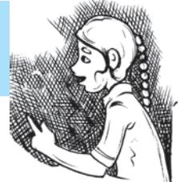

#### 5.4.2 Pythagorean triplets

Consider the following

$$3^{2}+4^{2}=9+16=25=5^{2}$$

The collection of numbers 3, 4 and 5 is known as **Pythagorean triplet**. 6, 8, 10 is also a Pythagorean triplet, since

$$6^{2}+8^{2}=36+64=100=10^{2}$$

Again, observe that

52 + 122 = 25 + 144 = 169 = 132 . The numbers 5, 12, 13 form another such triplet. Can you find more such triplets?

For any natural number *m* > 1, we have (2*m*)2 + (*m*2 – 1)2 = (*m*2 + 1)2 . So, 2*m*, *m*2 – 1 and *m*2 + 1 forms a Pythagorean triplet.

Try to find some more Pythagorean triplets using this form.

Example 2: Write a Pythagorean triplet whose smallest member is 8.

Solution: We can get Pythagorean triplets by using general form 2*m*, *m*2 – 1, *m*2 + 1.

| Let us first take | m2 – 1 = | 8 |  |
| --- | --- | --- | --- |
| So, | m2 | = 8 + 1 = 9 |  |
| which gives | m = | 3 |  |
| Therefore, | 2m = | 6 and | m2 + 1 = 10 |
|  | The triplet is thus 6, 8, 10. But 8 is not the smallest member of this. |  |  |
| So, let us try | 2m = | 8 |  |
| then | m = | 4 |  |
| We get | m2 – 1 = | 16 – 1 = 15 |  |
| and | m2 + 1 = | 16 + 1 = 17 |  |
| The triplet is 8, 15, 17 with 8 as the smallest member. |  |  |  |

Example 3: Find a Pythagorean triplet in which one member is 12.

| Solution: If we take m2 | – 1 = | 12 |  |  |
| --- | --- | --- | --- | --- |
| Then, | m2 = | 12 + 1 = 13 |  |  |
| Then the value of m will not be an integer. |  |  |  |  |
| So, we try to take m2 + 1 = 12. Again m2 |  |  | = 11 will not give an integer value for m. |  |
| So, let us take | 2m = | 12 |  |  |
| then | m = | 6 |  |  |
| Thus, m2 – 1 = 36 – 1 = |  | 35 | and m2 | + 1 = 36 + 1 = 37 |
| Therefore, the required triplet is 12, 35, 37. |  |  |  |  |
| Note:All Pythagorean triplets may not be obtained using this form. For example another |  |  |  |  |
| triplet 5, 12, 13 also has 12 as a member. |  |  |  |  |

# EXERCISE 5.2

| 1. |  |  | Find the square of the following numbers. |  |  |  |  |  |
| --- | --- | --- | --- | --- | --- | --- | --- | --- |
|  | (i) | 32 | (ii) | 35 | (iii) | 86 | (iv) | 93 |
|  | (v) | 71 | (vi) | 46 |  |  |  |  |
| 2. |  |  | Write a Pythagorean triplet whose one member is. |  |  |  |  |  |
|  | (i) | 6 | (ii) | 14 | (iii) | 16 | (iv) | 18 |

#### 5.5 Square Roots

Study the following situations.

(a) Area of a square is 144 cm2 . What could be the side of the square?

We know that the area of a square = side2 If we assume the length of the side to be '*a*', then 144 = *a*2 To find the length of side it is necessary to find a number whose square is 144. (b) What is the length of a diagonal of a square of side 8 cm (Fig 5.1)? Can we use Pythagoras theorem to solve this ? We have, AB2 + BC2 = AC2 i.e., 82 + 82 = AC2

or 128 = AC2

Again to get AC we need to think of a number whose square is 128.

(c) In a right triangle the length of the hypotenuse and a side are respectively 5 cm and 3 cm (Fig 5.2). Can you find the third side?

Let *x* cm be the length of the third side.

Using Pythagoras theorem 52

$$\begin{array}{r}{5^{2}=x^{2}+3^{2}}\\ {25-9=\ x^{2}}\\ {16=x^{2}}\end{array}$$

  
  
**Fig 5.1**  
  
**Fig 5.1**

$$\mathrm{Fig~5.2}$$

Again, to find *x* we need a number whose square is 16.

or 64 + 64 = AC2

In all the above cases, we need to find a number whose square is known. Finding the number with the known square is known as finding the square root.

### 5.5.1 Finding square roots

The inverse (opposite) operation of addition is subtraction and the inverse operation of multiplication is division. Similarly, finding the square root is the inverse operation of squaring.

We have, 12

= 1, therefore square root of 1 is 1

22 = 4, therefore square root of 4 is 2

32 = 9, therefore square root of 9 is 3

| Since | 92 | = | 81, |
| --- | --- | --- | --- |
| and | (–9)2 | = | 81 |
| We say that square |  |  |  |
| roots of 81 are 9 and –9. |  |  |  |

# TRY THESE

- (i) 112 = 121. What is the square root of 121?
- (ii) 142 = 196. What is the square root of 196?

# THINK, DISCUSS AND WRITE

(–1)2 = 1. Is –1, a square root of 1? (–2)2 = 4. Is –2, a square root of 4? (–9)2 = 81. Is –9 a square root of 81?

From the above, you may say that there are two integral square roots of a perfect square number. In this chapter, we shall take up only positive square root of a natural number. Positive square root of a number is denoted by the symbol .

For example: 4 = 2 (not –2); 9 = 3 (not –3) etc.

| Statement | Inference | Statement | Inference |
| --- | --- | --- | --- |
| 12 = 1 | 1 = 1 | 62 = 36 | 36 = 6 |
| 22 = 4 | 4 = 2 | 72 = 49 | 49 = 7 |
| 32 = 9 | 9 = 3 | 82 = 64 | 64 = 8 |
| 42 = 16 | 16 = 4 | 92 = 81 | 81 = 9 |
| 52 = 25 | 25 = 5 | 102 = 100 | 100 = 10 |

#### 5.5.2 Finding square root through repeated subtraction

Do you remember that the sum of the first *n* odd natural numbers is *n*2 ? That is, every square number can be expressed as a sum of successive odd natural numbers starting from 1.

Consider 81. Then,

| (i) | 81 – 1 = 80 | (ii) | 80 – 3 = 77 | (iii) | 77 – 5 = 72 | (iv) | 72 – 7 = 65 |
| --- | --- | --- | --- | --- | --- | --- | --- |
| (v) | 65 – 9 = 56 | (vi) | 56 – 11 = 45 | (vii) | 45 – 13 = 32 | (viii) | 32 – 15 = 17 |
| (ix) | 17 – 17 = 0 |  |  |  |  |  |  |

# TRY THESE

By repeated subtraction of odd numbers starting from 1, find whether the following numbers are perfect squares or not? If the number is a perfect square then find its square root.

From 81 we have subtracted successive odd numbers starting from 1 and obtained 0 at 9th step.

Therefore 81 = 9.

Can you find the square root of 729 using this method? Yes, but it will be time consuming. Let us try to find it in a simpler way.

- (i) 121
- (ii) 55
- (iii) 36
- (iv) 49
- (v) 90

| Consider the prime factorisation of the following numbers and their squares. |  |
| --- | --- |
| Prime factorisation of a Number | Prime factorisation of its Square |
| 6 = 2 × 3 | 36 = 2 × 2 × 3 × 3 |
| 8 = 2 × 2 × 2 | 64 = 2 × 2 × 2 × 2 × 2 × 2 |
| 12 = 2 × 2 × 3 | 144 = 2 × 2 × 2 × 2 × 3 × 3 |
| 15 = 3 × 5 | 225 = 3 × 3 × 5 × 5 |

5.5.3 Finding square root through prime factorisation

How many times does 2 occur in the prime factorisation of 6? Once. How many times does 2 occur in the prime factorisation of 36? Twice. Similarly, observe the occurrence of 3 in 6 and 36 of 2 in 8 and 64 etc.

You will find that each prime factor in the prime factorisation of the square of a number, occurs twice the number of times it occurs in the prime factorisation of the number itself. Let us use this to find the square root of a given square number, say 324.

We know that the prime factorisation of 324 is

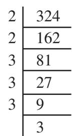

2

| By pairing the prime factors, we get |
| --- |

$$\frac{324=2\times2\times3\times3\times3\times3}{2}=2^{2}\times3^{2}\times3^{2}=(2\times3\times3)^{2}$$

So, 324 = 2 × 3 × 3 = 18

Similarly can you find the square root of 256? Prime factorisation of 256 is 256 = 2 × 2 × 2 × 2 × 2 × 2 × 2 × 2 By pairing the prime factors we get,

256 = 2 × 2 × 2 × 2 × 2 × 2 × 2 × 2 = (2 × 2 × 2 × 2)2

Therefore, 256 *=* 2 × 2 × 2 × 2 = 16

Is 48 a perfect square?

We know 48 = 2 × 2 × 2 × 2 × 3

Since all the factors are not in pairs so 48 is not a perfect square.

| Suppose we want to find the smallest multiple of 48 that is a perfect square, how |  |  |  |
| --- | --- | --- | --- |
| should we proceed? Making pairs of the prime factors of 48 we see that 3 is the only |  |  |  |
| factor that does not have a pair. So we need to multiply by 3 to complete the pair. |  |  |  |
| 2 Hence 48 × 3 = 144 is a perfect square. |  |  | 6400 |
| Can you tell by which number should we divide 48 to get a perfect square? 2 |  |  | 3200 |
| The factor 3 is not in pair, so if we divide 48 by 3 we get 48 ÷ 3 = 16 = 2 × 2 × 2 × 2 2 and this number 16 is a perfect square too. |  |  | 1600 |
| 2 |  |  | 800 |
| Find the square root of 6400. Example 4: 2 |  |  | 400 |
| 2 Solution: Write 6400 = 2 × 2 × 2 × 2 × 2 × 2 × 2 × 2 × 5 × 5 |  |  | 200 |
| 2 Therefore 6400 = 2 × 2 × 2 × 2 × 5 = 80 | 2 | 90 | 100 |
| 2 Example 5: Is 90 a perfect square? | 3 | 45 | 50 |
| 5 | 3 | 15 | 25 |
| Solution: We have 90 = 2 × 3 × 3 × 5 |  | 5 | 5 |

The prime factors 2 and 5 do not occur in pairs. Therefore, 90 is not a perfect square. That 90 is not a perfect square can also be seen from the fact that it has only one zero.

Example 6: Is 2352 a perfect square? If not, find the smallest multiple of 2352 which is a perfect square. Find the square root of the new number.

Solution: We have 2352 = 2 × 2 × 2 × 2 × 3 × 7 × 7

As the prime factor 3 has no pair, 2352 is not a perfect square.

If 3 gets a pair then the number will become perfect square. So, we multiply 2352 by 3 to get,

$$2352\times3=\underline{{{2\times2}}}\times\underline{{{2\times2}}}\times\underline{{{3\times3}}}\times\underline{{{7\times7}}}$$

Now each prime factor is in a pair. Therefore, 2352 × 3 = 7056 is a perfect square. Thus the required smallest multiple of 2352 is 7056 which is a perfect square.

And, 7056 = 2 × 2 × 3 × 7 = 84

Example 7: Find the smallest number by which 9408 must be divided so that the quotient is a perfect square. Find the square root of the quotient.

2 6, 9, 15 3 3, 9, 15 3 1, 3, 5 5 1, 1, 5

1, 1, 1

Solution: We have, 9408 = 2 × 2 × 2 × 2 × 2 × 2 × 3 × 7 × 7

If we divide 9408 by the factor 3, then 

9408 ÷ 3 = 3136 = 2 × 2 × 2 × 2 × 2 × 2 × 7 × 7 which is a perfect square. (Why?) Therefore, the required smallest number is 3.

And, 3136 = 2 × 2 × 2 × 7 = 56.

Example 8: Find the smallest square number which is divisible by each of the numbers 6, 9 and 15.

Solution: This has to be done in two steps. First find the smallest common multiple and then find the square number needed. The least number divisible by each one of 6, 9 and 15 is their LCM. The LCM of 6, 9 and 15 is 2 × 3 × 3 × 5 = 90.

Prime factorisation of 90 is 90 = 2 × 3 × 3 × 5.

We see that prime factors 2 and 5 are not in pairs. Therefore 90 is not a perfect square.

In order to get a perfect square, each factor of 90 must be paired. So we need to make pairs of 2 and 5. Therefore, 90 should be multiplied by 2 × 5, i.e., 10. Hence, the required square number is 90 × 10 = 900.

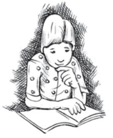

# EXERCISE 5.3

- **1.** What could be the possible 'one's' digits of the square root of each of the following numbers?

|
|  |

- (i) 153 (ii) 257 (iii) 408 (iv) 441
- **3.** Find the square roots of 100 and 169 by the method of repeated subtraction.
- **4.** Find the square roots of the following numbers by the Prime Factorisation Method.

| (i) | 729 | (ii) | 400 | (iii) | 1764 | (iv) | 4096 |
| --- | --- | --- | --- | --- | --- | --- | --- |
| (v) | 7744 | (vi) | 9604 | (vii) | 5929 | (viii) | 9216 |
| (ix) | 529 | (x) | 8100 |  |  |  |  |

- **5.** For each of the following numbers, find the smallest whole number by which it should be multiplied so as to get a perfect square number. Also find the square root of the square number so obtained.

| (i) | 252 | (ii) | 180 | (iii) | 1008 | (iv) | 2028 |
| --- | --- | --- | --- | --- | --- | --- | --- |
| (v) | 1458 | (vi) | 768 |  |  |  |  |

- **6.** For each of the following numbers, find the smallest whole number by which it should be divided so as to get a perfect square. Also find the square root of the square number so obtained.
	- (i) 252 (ii) 2925 (iii) 396 (iv) 2645
	- (v) 2800 (vi) 1620
- **7.** The students of Class VIII of a school donated 2401 in all, for Prime Minister's National Relief Fund. Each student donated as many rupees as the number of students in the class. Find the number of students in the class.
- **8.** 2025 plants are to be planted in a garden in such a way that each row contains as many plants as the number of rows. Find the number of rows and the number of plants in each row.
- **9.** Find the smallest square number that is divisible by each of the numbers 4, 9 and 10.
- **10.** Find the smallest square number that is divisible by each of the numbers 8, 15 and 20.

# 5.5.4 Finding square root by division method

When the numbers are large, even the method of finding square root by prime factorisation becomes lengthy and difficult. To overcome this problem we use Long Division Method.

For this we need to determine the number of digits in the square root. See the following table:

| Number | Square |  |
| --- | --- | --- |
| 10 | 100 | which is the smallest 3-digit perfect square |
| 31 | 961 | which is the greatest 3-digit perfect square |
| 32 | 1024 | which is the smallest 4-digit perfect square |
| 99 | 9801 | which is the greatest 4-digit perfect square |

So, what can we say about the number of digits in the square root if a perfect square is a 3-digit or a 4-digit number? We can say that, if a perfect square is a 3-digit or a 4-digit number, then its square root will have 2-digits.

Can you tell the number of digits in the square root of a 5-digit or a 6-digit perfect square?

The smallest 3-digit perfect square number is 100 which is the square of 10 and the greatest 3-digit perfect square number is 961 which is the square of 31. The smallest 4-digit square number is 1024 which is the square of 32 and the greatest 4-digit number is 9801 which is the square of 99.

# THINK, DISCUSS AND WRITE

Can we say that if a perfect square is of *n*-digits, then its square root will have 2 *n* digits if *n* is even or ( 1) 2 *n* + if *n* is odd?

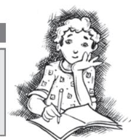

The use of the number of digits in square root of a number is useful in the following method:

- Consider the following steps to find the square root of 529.
Can you estimate the number of digits in the square root of this number?

- **Step 1** Place a bar over every pair of digits starting from the digit at one's place. If the number of digits in it is odd, then the left-most single digit too will have a bar. Thus we have, 529 .
- **Step 2** Find the largest number whose square is less than or equal to the number under the extreme left bar (22 < 5 < 32 ). Take this number as the divisor and the quotient with the number under the extreme left bar as the dividend (here 5). Divide and get the remainder (1 in this case).

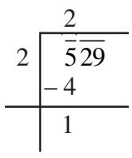

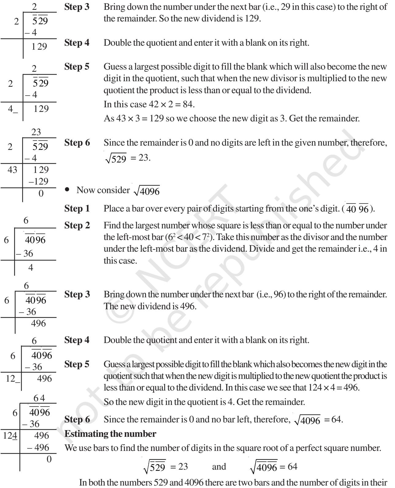

square root is 2. Can you tell the number of digits in the square root of 14400?

By placing bars we get 14400 . Since there are 3 bars, the square root will be of 3 digit.

# TRY THESE

Without calculating square roots, find the number of digits in the square root of the following numbers.

(i) 25600 (ii) 100000000 (iii) 36864

Example 9: Find the square root of : (i) 729 (ii) 1296

#### Solution:

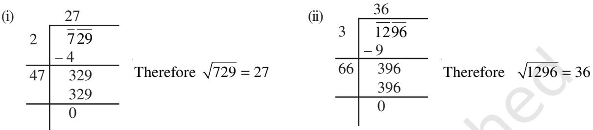

| Example 10: Find the least number that must be subtracted from 5607 so as to get |  | 74 |
| --- | --- | --- |
| a perfect square. Also find the square root of the perfect square. | 7 | 5607 |
| Solution: Let us try to find 5607 by long division method. We get the |  | – 49 |
| remainder 131. It shows that 742 is less than 5607 by 131. | 144 | 707 |
| This means if we subtract the remainder from the number, we get a perfect square. |  | –576 |
| Therefore, the required perfect square is 5607 – 131 = 5476. And, 5476 = 74. |  | 131 |
| Example 11: Find the greatest 4-digit number which is a perfect square. |  | 99 |
| Solution: Greatest number of 4-digits = 9999. We find 9999 by long division | 9 | 9999 |
| method. The remainder is 198. This shows 992 is less than 9999 by 198. |  | – 81 |
| This means if we subtract the remainder from the number, we get a perfect square. | 189 | 1899 |
| Therefore, the required perfect square is 9999 – 198 = 9801. |  | – 1701 |
| And, 9801 = 99 |  | 198 |
| Example 12: Find the least number that must be added to 1300 so as to get a |  | 36 |
| perfect square. Also find the square root of the perfect square. | 3 | 1300 |
| Solution: We find 1300 by long division method. The remainder is 4. |  | – 9 |
| This shows that 362 < 1300. | 66 | 400 |
| Next perfect square number is 372 = 1369. |  | – 396 |
| Hence, the number to be added is 372 – 1300 = 1369 – 1300 = 69. |  | 4 |

# 5.6 Square Roots of Decimals

Consider 17.64

**Step 1** To find the square root of a decimal number we put bars on the integral part (i.e., 17) of the number in the usual manner. And place bars on the decimal part

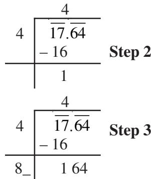

(i.e., 64) on every pair of digits beginning with the first decimal place. Proceed as usual. We get 17.64.

**Step 2** Now proceed in a similar manner. The left most bar is on 17 and 42 < 17 < 52 . Take this number as the divisor and the number under the left-most bar as the dividend, i.e., 17. Divide and get the remainder.

**Step 3** The remainder is 1. Write the number under the next bar (i.e., 64) to the right of this remainder, to get 164.

4.2

0

4 17.64 – 16

 82 164 – 164

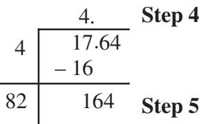

**Step 4** Double the divisor and enter it with a blank on its right. Since 64 is the decimal part so put a decimal point in the quotient.

**Step 5** We know 82 × 2 = 164, therefore, the new digit is 2. Divide and get the remainder.

**Step 6** Since the remainder is 0 and no bar left, therefore 17.64 4.2 = .

Example 13: Find the square root of 12.25.

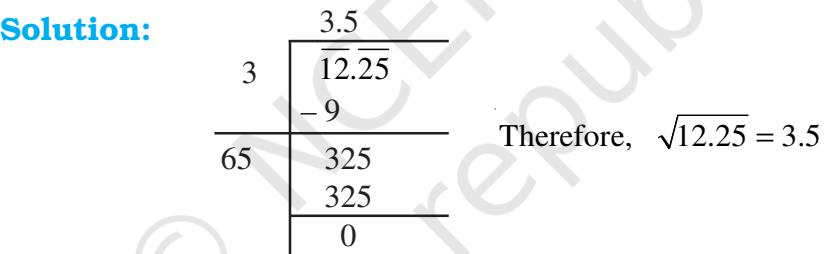

#### **Which way to move**

Consider a number 176.341. Put bars on both integral part and decimal part. In what way is putting bars on decimal part different from integral part? Notice for 176 we start from the unit's place close to the decimal and move towards left. The first bar is over 76 and the second bar over 1. For .341, we start from the decimal and move towards right. First bar is over 34 and for the second bar we put 0 after 1 and make .3410 .

- Example 14: Area of a square plot is 2304 m2 . Find the side of the square plot. 48

| 4 | 2304 | Solution: Area of square plot = 2304 m2 |  |  |
| --- | --- | --- | --- | --- |
|  | –16 | Therefore, side of the square plot = |  | m 2304 |
|  | 704 704 0 | We find that, 2304 = Thus, the side of the square plot is 48 m. | 48 |  |
| 88 |  |  |  |  |

Thus, the side of the square plot is 48 m.

Example 15: There are 2401 students in a school. P.T. teacher wants them to stand in rows and columns such that the number of rows is equal to the number of columns. Find the number of rows.

| Solution: Let the number of rows be x |  | 49 |
| --- | --- | --- |
| So, the number of columns = x | 4 | 24 01 |
| Therefore, number of students = x × x = x2 |  | –16 |
| Thus, x2 = 2401 gives x = 2401 = 49 | 89 | 801 |
| The number of rows = 49. |  | 801 |
|  |  | 0 |

# EXERCISE 5.4

- **1.** Find the square root of each of the following numbers by Division method.

| (i) | 2304 | (ii) | 4489 | (iii) | 3481 | (iv) | 529 |
| --- | --- | --- | --- | --- | --- | --- | --- |
| (v) | 3249 | (vi) | 1369 | (vii) | 5776 | (viii) | 7921 |
| (ix) | 576 | (x) | 1024 | (xi) | 3136 | (xii) | 900 |

**2.** Find the number of digits in the square root of each of the following numbers (without any calculation).

- (i) 64 (ii) 144 (iii) 4489 (iv) 27225
- (v) 390625
- **3.** Find the square root of the following decimal numbers.
	- (i) 2.56 (ii) 7.29 (iii) 51.84 (iv) 42.25
	- (v) 31.36

**4.** Find the least number which must be subtracted from each of the following numbers so as to get a perfect square. Also find the square root of the perfect square so obtained.

- (i) 402 (ii) 1989 (iii) 3250 (iv) 825
- (v) 4000

**5.** Find the least number which must be added to each of the following numbers so as to get a perfect square. Also find the square root of the perfect square so obtained.

- (i) 525 (ii) 1750 (iii) 252 (iv) 1825 (v) 6412
- **6.** Find the length of the side of a square whose area is 441 m2 .
- **7.** In a right triangle ABC, ∠B = 90°.

(a) If AB = 6 cm, BC = 8 cm, find AC (b) If AC = 13 cm, BC = 5 cm, find AB

- **8.** A gardener has 1000 plants. He wants to plant these in such a way that the number of rows and the number of columns remain same. Find the minimum number of plants he needs more for this.
- **9.** There are 500 children in a school. For a P.T. drill they have to stand in such a manner that the number of rows is equal to number of columns. How many children would be left out in this arrangement.

# WHAT HAVE WE DISCUSSED?

- **1.** If a natural number *m* can be expressed as *n*2 , where *n* is also a natural number, then *m* is a **square number**.
- **2.** All square numbers end with 0, 1, 4, 5, 6 or 9 at units place.
- **3.** Square numbers can only have even number of zeros at the end.
- **4. Square root** is the inverse operation of square.
- **5.** There are two integral square roots of a perfect square number.

Positive square root of a number is denoted by the symbol .

For example, 32 = 9 gives 9 3 =

