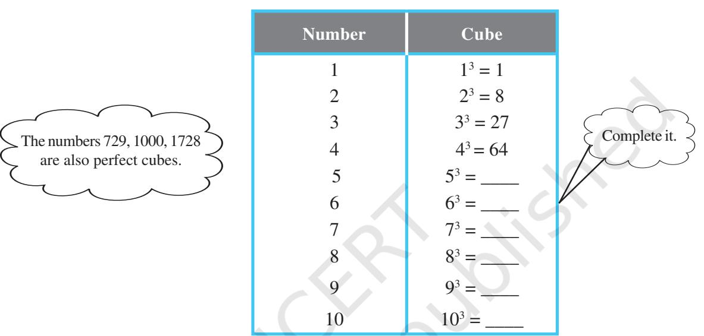
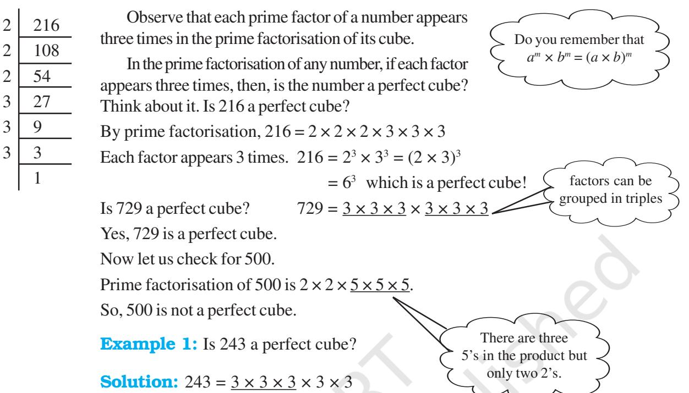
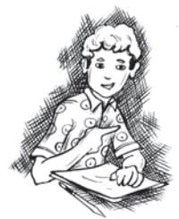
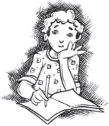
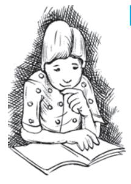

# 6.1 Introduction

This is a story about one of India's great mathematical geniuses, S. Ramanujan. Once another famous mathematician Prof. G.H. Hardy came to visit him in a taxi whose number

was 1729. While talking to Ramanujan, Hardy described this number "a dull number". Ramanujan quickly pointed out that 1729 was indeed interesting. He said it is the smallest number that can be expressed as a sum of two cubes in two different ways:

1729 = 1728 + 1 = 123 + 13  
  
1729 = 1000 + 729 = 103 + 93

1729 has since been known as the Hardy – Ramanujan Number, even though this feature of 1729 was known more than 300 years before Ramanujan.

How did Ramanujan know this? Well, he loved numbers. All through his life, he experimented with numbers. He probably found numbers that were expressed as the sum of two squares and sum of two cubes also.

There are many other interesting patterns of cubes. Let us learn about cubes, cube roots and many other interesting facts related to them.

# 6.2 Cubes

You know that the word 'cube' is used in geometry. A cube is a solid figure which has all its sides equal. How many cubes of side 1 cm will make a cube of side 2 cm?

How many cubes of side 1 cm will make a cube of side 3 cm?

Consider the numbers 1, 8, 27, ...

These are called **perfect cubes or cube numbers**. Can you say why they are named so? Each of them is obtained when a number is multiplied by taking it three times.

**Hardy – Ramanujan Number**

1729 is the smallest Hardy– Ramanujan Number. There are an infinitely many such numbers. Few are 4104 (2, 16; 9, 15), 13832 (18, 20; 2, 24), Check it with the numbers given in the brackets.


 

We note that 1 = 1 × 1 × 1 = 13 ; 8 = 2 × 2 × 2 = 23 ; 27 = 3 × 3 × 3 = 33 . Since 53 = 5 × 5 × 5 = 125, therefore 125 is a cube number.

Is 9 a cube number? No, as 9 = 3 × 3 and there is no natural number which multiplied by taking three times gives 9. We can see also that 2 × 2 × 2 = 8 and 3 × 3 × 3 = 27. This shows that 9 is not a perfect cube.

The following are the cubes of numbers from 1 to 10.



**Table 1**

There are only ten perfect cubes from 1 to 1000. (Check this). How many perfect cubes are there from 1 to 100?

Observe the cubes of even numbers. Are they all even? What can you say about the cubes of odd numbers?

Following are the cubes of the numbers from 11 to 20.

|  | Table 2 |  |
| --- | --- | --- |
| We are even, so | Number | Cube |
| are our cubes |  |  |
|  | 11 | 1331 |
|  | 12 | 1728 |
|  | 13 | 2197 |
|  | 14 | 2744 |
|  | 15 | 3375 |
|  | 16 | 4096 |
| We are odd so are | 17 | 4913 |
| our cubes | 18 | 5832 |
|  | 19 | 6859 |
|  | 20 | 8000 |

**Table 2**

Consider a few numbers having 1 as the one's digit (or unit's). Find the cube of each of them. What can you say about the one's digit of the cube of a number having 1 as the one's digit?

Similarly, explore the one's digit of cubes of numbers ending in 2, 3, 4, ... , etc.

|  |  | TRY THESE |  |  |  |  |  |
| --- | --- | --- | --- | --- | --- | --- | --- |
|  |  |  | Find the one's digit of the cube of each of the following numbers. |  |  |  |  |
| (i) | 3331 | (ii) | 8888 | (iii) | 149 | (iv) | 1005 |
| (v) | 1024 | (vi) | 77 | (vii) | 5022 | (viii) | 53 |

#### 6.2.1 Some interesting patterns

#### **1. Adding consecutive odd numbers**

Observe the following pattern of sums of odd numbers.

|  |  |  |  |  |  |  |  | 1 | = | 1 | = | 13 |
| --- | --- | --- | --- | --- | --- | --- | --- | --- | --- | --- | --- | --- |
|  |  |  |  |  |  | 3 | + | 5 | = | 8 | = | 23 |
|  |  |  |  | 7 | + | 9 | + | 11 | = | 27 | = | 33 |
|  |  | 13 | + | 15 | + | 17 | + | 19 | = | 64 | = | 43 |
| 21 | + | 23 | + | 25 | + | 27 | + | 29 | = | 125 | = | 53 |

Is it not interesting? How many consecutive odd numbers will be needed to obtain the sum as 103 ?

# TRY THESE

| Express the following numbers as the sum of odd numbers using the above pattern? |  |  |  |  |  |
| --- | --- | --- | --- | --- | --- |
| 63 83 73 (a) (b) |  |  | (c) |  |  |
| Consider the following pattern. |  |  |  |  |  |
| 23 – 13 = 1 + 2 × 1 × 3 |  |  |  |  |  |
| 33 – 23 = 1 + 3 × 2 × 3 |  |  |  |  |  |
| 43 – 33 = 1 + 4 × 3 × 3 |  |  |  |  |  |
| Using the above pattern, find the value of the following. |  |  |  |  |  |
| (i) 73 (ii) 123 – 113 203 – 193 | – 63 | (iii) | (iv) | 513 | – 503 |

#### **2. Cubes and their prime factors**

Consider the following prime factorisation of the numbers and their cubes.

| Prime factorisation | Prime factorisation |  | each prime factor |
| --- | --- | --- | --- |
| of a number | of its cube |  | appears three times |
| 4 = 2 × 2 | 43 = 64 = 2 × 2 × 2 × 2 × 2 × 2 = 23 | × 23 | in its cubes |
| 6 = 2 × 3 | 63 = 216 = 2 × 2 × 2 × 3 × 3 × 3 = 23 | × 33 |  |
| 15 = 3 × 5 | 153 = 3375 = 3 × 3 × 3 × 5 × 5 × 5 = 33 | × 53 |  |
| 12 = 2 × 2 × 3 | 123 = 1728 = 2 × 2 × 2 × 2 × 2 × 2 × 3 × 3 × 3 = 23 × 23 × 33 |  |  |



In the above factorisation 3 × 3 remains after grouping the 3's in triplets. Therefore, 243 is not a perfect cube.



| TRY THESE |  |  |  |  |  |  |
| --- | --- | --- | --- | --- | --- | --- |
| Which of the following are perfect cubes? |  |  |  |  |  |  |
| 1. 2. | 400 | 3375 | 3. | 8000 | 4. | 15625 |
| 5. 6. | 9000 | 6859 | 7. | 2025 | 8. | 10648 |

# 6.2.2 Smallest multiple that is a perfect cube

Raj made a cuboid of plasticine. Length, breadth and height of the cuboid are 15 cm, 30 cm, 15 cm respectively.

Anu asks how many such cuboids will she need to make a perfect cube? Can you tell? Raj said, Volume of cuboid is 15 × 30 × 15 = 3 × 5 × 2 × 3 × 5 × 3 × 5

```
 = 2 × 3 × 3 × 3 × 5 × 5 × 5
```
Since there is only one 2 in the prime factorisation. So we need 2 × 2, i.e., 4 to make it a perfect cube. Therefore, we need 4 such cuboids to make a cube.

Example 2: Is 392 a perfect cube? If not, find the smallest natural number by which 392 must be multiplied so that the product is a perfect cube.

#### Solution: 392 = 2 × 2 × 2 × 7 × 7

The prime factor 7 does not appear in a group of three. Therefore, 392 is not a perfect cube. To make its a cube, we need one more 7. In that case

392 × 7 = 2 × 2 × 2 × 7 × 7 × 7 = 2744 which is a perfect cube.

Hence the smallest natural number by which 392 should be multiplied to make a perfect cube is 7.

Example 3: Is 53240 a perfect cube? If not, then by which smallest natural number should 53240 be divided so that the quotient is a perfect cube?

Solution: 53240 = 2 × 2 × 2 × 11 × 11 × 11 × 5

The prime factor 5 does not appear in a group of three. So, 53240 is not a perfect cube. In the factorisation 5 appears only one time. If we divide the number by 5, then the prime factorisation of the quotient will not contain 5.

So, 53240 ÷ 5 = 2 × 2 × 2 × 11 × 11 × 11

Hence the smallest number by which 53240 should be divided to make it a perfect cube is 5.

The perfect cube in that case is = 10648.

Example 4: Is 1188 a perfect cube? If not, by which smallest natural number should 1188 be divided so that the quotient is a perfect cube?

Solution: 1188 = 2 × 2 × 3 × 3 × 3 × 11

The primes 2 and 11 do not appear in groups of three. So, 1188 is not a perfect cube. In the factorisation of 1188 the prime 2 appears only two times and the prime 11 appears once. So, if we divide 1188 by 2 × 2 × 11 = 44, then the prime factorisation of the quotient will not contain 2 and 11.

Hence the smallest natural number by which 1188 should be divided to make it a perfect cube is 44.

And the resulting perfect cube is 1188 ÷ 44 = 27 (=33 ).

Example 5: Is 68600 a perfect cube? If not, find the smallest number by which 68600 must be multiplied to get a perfect cube.

Solution: We have, 68600 = 2 × 2 × 2 × 5 × 5 × 7 × 7 × 7. In this factorisation, we find that there is no triplet of 5.

So, 68600 is not a perfect cube. To make ita perfect cube we multiply it by 5.

Thus, 68600 × 5 = 2 × 2 × 2 × 5 × 5 × 5 × 7 × 7 × 7

= 343000, which is a perfect cube.

Observe that 343 is a perfect cube. From Example 5 we know that 343000 is also perfect cube.

# THINK, DISCUSS AND WRITE

Check which of the following are perfect cubes. (i) 2700 (ii) 16000 (iii) 64000 (iv) 900 (v) 125000 (vi) 36000 (vii) 21600 (viii) 10,000 (ix) 27000000 (x) 1000. What pattern do you observe in these perfect cubes?





# EXERCISE 6.1

- **1.** Which of the following numbers are not perfect cubes?
	- (i) 216 (ii) 128 (iii) 1000 (iv) 100 (v) 46656
- **2.** Find the smallest number by which each of the following numbers must be multiplied to obtain a perfect cube.
	- (i) 243 (ii) 256 (iii) 72 (iv) 675
	- (v) 100
- **3.** Find the smallest number by which each of the following numbers must be divided to obtain a perfect cube.
	- (i) 81 (ii) 128 (iii) 135 (iv) 192 (v) 704
- **4.** Parikshit makes a cuboid of plasticine of sides 5 cm, 2 cm, 5 cm. How many such cuboids will he need to form a cube?

# 6.3 Cube Roots

If the volume of a cube is 125 cm3 , what would be the length of its side? To get the length of the side of the cube, we need to know a number whose cube is 125.

Finding the square root, as you know, is the inverse operation of squaring. Similarly, finding the cube root is the inverse operation of finding cube.

We know that 23 = 8; so we say that the cube root of 8 is 2.

We write 3 8 = 2. **The symbol 3 denotes 'cube-root.'**

Consider the following:

| Statement | Inference | Statement | Inference |
| --- | --- | --- | --- |
| 13 = 1 | 3 1 = 1 | 63 = 216 | 3 216 = 6 |
| 23 = 8 | 3 3 8 = = 2 3 2 | 73 = 343 | 3 343 = 7 |
| 33 = 27 | 3 3 27 = 3 3 = 3 | 83 = 512 | 8 3 512 = |
| 43 = 64 | 4 3 64 = | 93 = 729 | 9 3 729 = |
| 53 = 125 | 3 125 = 5 | 103 = 1000 | 3 1000 = 10 |

### 6.3.1 Cube root through prime factorisation method

Consider 3375. We find its cube root by prime factorisation:

$$3375=3\times3\times3\times5\times5\times5=3^{3}\times5^{3}=(3\times5)^{3}$$

Therefore, cube root of 3375 = 3 3375 = 3 × 5 = 15

Similarly, to find 3 74088 , we have,

$74088=2\times2\times2\times3\times3\times7\times7\times7=2^{3}\times3^{3}\times7^{3}=(2\times3\times7)^{3}$

Therefore, 3 74088 = 2 × 3 × 7 = 42

Example 6: Find the cube root of 8000.

Solution: Prime factorisation of 8000 is 2 × 2 × 2 × 2 × 2 × 2 × 5 × 5 × 5

So, 3 8000 = 2 × 2 × 5 = 20

Example 7: Find the cube root of 13824 by prime factorisation method.

# Solution:

13824 = 2 × 2 × 2 × 2 × 2 × 2 × 2 × 2 × 2 × 3 × 3 × 3 = 23 × 23 × 23 × 33 .

Therefore, 3 13824 = 2 × 2 × 2 × 3 = 24

# THINK, DISCUSS AND WRITE

State true or false: for any integer *m*, *m*2 < *m*3 . Why?

# EXERCISE 6.2

- **1.** Find the cube root of each of the following numbers by prime factorisation method.
	- (i) 64 (ii) 512 (iii) 10648 (iv) 27000 (v) 15625 (vi) 13824 (vii) 110592 (viii) 46656
	- (ix) 175616 (x) 91125
- **2.** State true or false.
	- (i) Cube of any odd number is even.
	- (ii) A perfect cube does not end with two zeros.
	- (iii) If square of a number ends with 5, then its cube ends with 25.
	- (iv) There is no perfect cube which ends with 8.
	- (v) The cube of a two digit number may be a three digit number.
	- (vi) The cube of a two digit number may have seven or more digits.
	- (vii) The cube of a single digit number may be a single digit number.

# WHAT HAVE WE DISCUSSED?

- **1.** Numbers like 1729, 4104, 13832, are known as Hardy Ramanujan Numbers. They can be expressed as sum of two cubes in two different ways.
- **2.** Numbers obtained when a number is multiplied by itself three times are known as **cube numbers**. For example 1, 8, 27, ... etc.
- **3.** If in the prime factorisation of any number each factor appears three times, then the number is a perfect cube.

**4.** The symbol 3 denotes cube root. For example 3 27 3 = .


