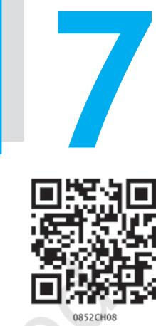

# 7.1 Recalling Ratios and Percentages

We know, ratio means comparing two quantities. A basket has two types of fruits, say, 20 apples and 5 oranges. Then, the ratio of the number of oranges to the number of apples = 5 : 20.

The comparison can be done by using fractions as, 5 20 = 1 4

The number of oranges is 1 4 th the number of apples. In terms of ratio, this is

- 1 : 4, read as, "1 is to 4"
Number of apples to number of oranges = 20 4 5 1 = which means, the number of apples is 4 times the number of oranges. This comparison can also be done using percentages.

OR

There are 5 oranges out of 25 fruits. So percentage of oranges is 5 4 20 20% 25 4 100 ×= = OR [Denominator made 100].

By unitary method: Out of 25 fruits, number of oranges are 5. So out of 100 fruits, number of oranges

= 5 100 25 × = 20.

Since contains only apples and oranges,

So, percentage of apples + percentage of oranges = 100

or percentage of apples + 20 = 100

or percentage of apples = 100 – 20 = 80

Thus the basket has 20% oranges and 80% apples.

Example 1: A picnic is being planned in a school for Class VII. Girls are 60% of the total number of students and are 18 in number.

The picnic site is 55 km from the school and the transport company is charging at the rate of 12 per km. The total cost of refreshments will be 4280.

Can you tell.

- 1. The ratio of the number of girls to the number of boys in the class?
- 2. The cost per head if two teachers are also going with the class?
- 3. If their first stop is at a place 22 km from the school, what per cent of the total distance of 55 km is this? What per cent of the distance is left to be covered?

### Solution:

- 1. To find the ratio of girls to boys.
Ashima and John came up with the following answers.

They needed to know the number of boys and also the total number of students.

be *x*. 60% of *x* is girls. There is one girl out of 60 100 × *x* = 18 OR Number of students = or*, x* = 18 100 60 × Number of students = 30.

**Ashima did this John used the unitary method** Let the total number of students There are 60 girls out of 100 students. 100 60 students. Therefore, 60% of *x* = 18 So, 18 girls are out of how many students? 100 18 60 × = 30 = 30

So, the number of boys = 30 – 18 = 12.

Hence, ratio of the number of girls to the number of boys is 18 : 12 or 18 12 = 3 2 . 3 2 is written as 3 : 2 and read as 3 is to 2.

2. To find the cost per person.

Transportation charge = Distance both ways × Rate

Total expenses = Refreshment charge

+ Transportation charge = 4280 + 1320

Total number of persons =18 girls + 12 boys + 2 teachers

#### = 32 persons

Ashima and John then used unitary method to find the cost per head. For 32 persons, amount spent would be 5600.

The amount spent for 1 person = 5600 32 = 175.

- 3. The distance of the place where first stop was made = 22 km.
To find the percentage of distance:

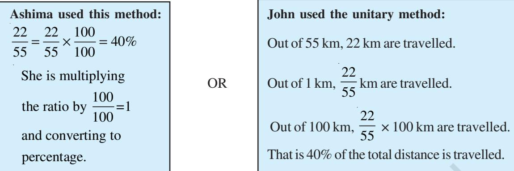

Both came out with the same answer that the distance from their school of the place where they stopped at was 40% of the total distance they had to travel.

Therefore, the percent distance left to be travelled = 100% – 40% = 60%.

### TRY THESE

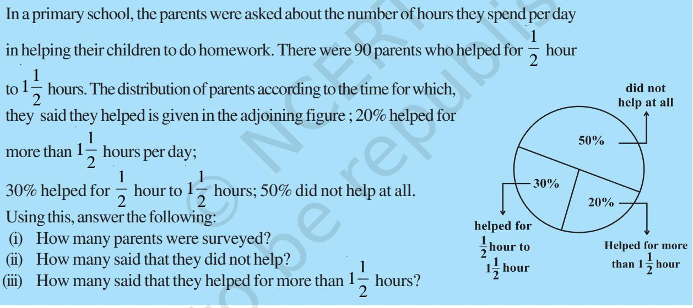

# EXERCISE 7.1

- **1.** Find the ratio of the following.
	- (a) Speed of a cycle 15 km per hour to the speed of scooter 30 km per hour. (b) 5 m to 10 km (c) 50 paise to 5
		-
- **2.** Convert the following ratios to percentages.

(a) 3 : 4 (b) 2 : 3

- **3.** 72% of 25 students are interested in mathematics. How many are not interested in mathematics?
- **4.** A football team won 10 matches out of the total number of matches they played. If their win percentage was 40, then how many matches did they play in all?
- **5.** If Chameli had 600 left after spending 75% of her money, how much did she have in the beginning?

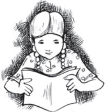

- **6.** If 60% people in a city like cricket, 30% like football and the remaining like other games, then what per cent of the people like other games? If the total number of people is 50 lakh, find the exact number who like each type of game.
### 7.2 Finding Discounts

**Discount** is a reduction given on the Marked Price (MP) of the article.

This is generally given to attract customers to buy goods or to promote sales of the goods. You can find the discount by subtracting its sale price from its marked price.

So, Discount = Marked price – Sale price

Example 2: An item marked at 840 is sold for 714. What is the discount and discount %?

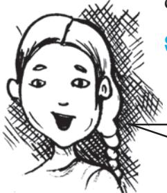

Solution: Discount = Marked Price – Sale Price = 840 – 714 = 126

Since discount is on marked price, we will have to use marked price as the base.

On marked price of 840, the discount is 126. On MP of 100, how much will the discount be?

Discount = 840 $\times$ 100% = 15%

### **You can also find discount when discount % is given.**

Example 3: The list price of a frock is 220. A discount of 20% is announced on sales. What is the amount of discount on it and its sale price.

Solution: Marked price is same as the list price. 20% discount means that on 100 (MP), the discount is 20.

By unitary method, on 1 the discount will be 20

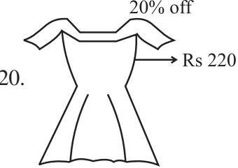

100 .

On 220, discount = 20 220 100 × = 44

The sale price = ( 220 – 44) or 176

Rehana found the sale price like this —

A discount of 20% means for a MP of 100, discount is 20. Hence the sale price is 80. Using unitary method, when MP is 100, sale price is 80;

When MP is 1, sale price is 80 100 . Hence when MP is 220, sale price = 80 220 100 × = 176.

Even though the discount was not found, I could find the sale price directly.

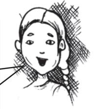

### TRY THESE

- 1. A shop gives 20% discount. What would the sale price of each of these be?
	- (a) A dress marked at 120 (b) A pair of shoes marked at 750
	- (c) A bag marked at 250
- 2. A table marked at 15,000 is available for 14,400. Find the discount given and the discount per cent.
- 3. An almirah is sold at 5,225 after allowing a discount of 5%. Find its marked price.

### 7.2.1 Estimation in percentages

Your bill in a shop is 577.80 and the shopkeeper gives a discount of 15%. How would you estimate the amount to be paid?

- (i) Round off the bill to the nearest tens of 577.80, i.e., to 580.

$$(ii) Find 10% of this, i.e., \tau\frac{10}{100}\times580=\tau58$$

(iii) Take half of this, i.e., $\frac{1}{2}\times58=\frac{1}{29}$.  
  

- (iv) Add the amounts in (ii) and (iii) to get 87. You could therefore reduce your bill amount by 87 or by about 85, which will be 495 approximately.
- 1. Try estimating 20% of the same bill amount. 2. Try finding 15% of 375.

### 7.3 Sales Tax/Value Added Tax/Goods and Ser vices Ta x

The teacher showed the class a bill in which the following heads were written.

| Bill No. |  | Date |  |
| --- | --- | --- | --- |
|  | Menu |  |  |
| S.No. Item | Quantity | Rate | Amount |
|  | Bill amount |  |  |
|  | + ST (5%) |  |  |
| Total |  |  |  |

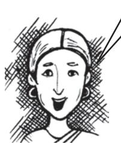

Sales tax (ST) is charged by the government on the sale of an item. It is collected by the shopkeeper from the customer and given to the government. This is, therefore, always on the selling price of an item and is added to the value of the bill. There is another type of tax which is included in the prices known as **Value Added Tax (VAT)**.

From July 1, 2017, Government of India introduced GST which stands for Goods and Services Tax which is levied on supply of goods or services or both.

Example 4: (**Finding Sales Tax**) The cost of a pair of roller skates at a shop was 450. The sales tax charged was 5%. Find the bill amount.

Solution: On 100, the tax paid was 5.

On 450, the tax paid would be = 5 450 100 ×

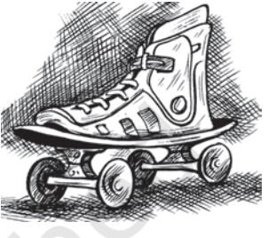

= 22.50 Bill amount = Cost of item + Sales tax = 450 + 22.50 = 472.50.

Example 5: (**Value Added Tax (VAT)**) Waheeda bought an air cooler for 3300 including a tax of 10%. Find the price of the air cooler before VAT was added.

Solution: The price includes the VAT, i.e., the value added tax. Thus, a 10% VAT means if the price without VAT is 100 then price including VAT is 110.

Now, when price including VAT is 110, original price is 100.

Hence when price including tax is 3300, the original price = 100 3300 3000. 110 × =

Example 6: Salim bought an article for 784 which included GST of 12% . What is the price of the article before GST was added?

Solution: Let original price of the article be 100. GST = 12%.

Price after GST is included = (100+12) = 112

When the selling price is 112 then original price = 100.

When the selling price is 784, then original price = 100 784 12 × = 700

# THINK, DISCUSS AND WRITE

- 1. Two times a number is a 100% increase in the number. If we take half the number what would be the decrease in per cent?
- 2. By what per cent is 2,000 less than 2,400? Is it the same as the per cent by which 2,400 is more than 2,000?

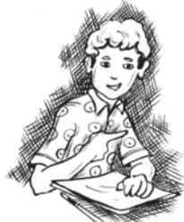

# EXERCISE 7.2

- **1.** During a sale, a shop offered a discount of 10% on the marked prices of all the items. What would a customer have to pay for a pair of jeans marked at 1450 and two shirts marked at 850 each?
- **2.** The price of a TV is 13,000. The sales tax charged on it is at the rate of 12%. Find the amount that Vinod will have to pay if he buys it.
- **3.** Arun bought a pair of skates at a sale where the discount given was 20%. If the amount he pays is 1,600, find the marked price.
- **4.** I purchased a hair-dryer for 5,400 including 8% VAT. Find the price before VAT was added.
- **5.** An article was purchased for 1239 including GST of 18%. Find the price of the article before GST was added?

## 7.4 Compound Interest

You might have come across statements like "one year interest for FD (fixed deposit) in the bank @ 9% per annum" or 'Savings account with interest @ 5% per annum'.

**Interest** is the extra money paid by institutions like banks or post offices on money deposited (kept) with them. Interest is also paid by people when they borrow money. We already know how to calculate **Simple Interest**.

So, on 10,000, interest charged = 15 10000 100 × = 1500

Interest for 2 years = 1500 × 2 = 3000

Amount to be paid at the end of 2 years = Principal + Interest = 10000 + 3000 = 13000

# TRY THESE

Find interest and amount to be paid on 15000 at 5% per annum after 2 years.

My father has kept some money in the post office for 3 years. Every year the money increases as more than the previous year.

We have some money in the bank. Every year some interest is added to it, which is shown in the passbook. This interest is not the same, each year it increases.

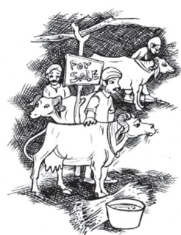

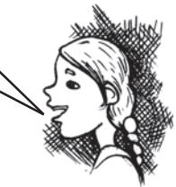

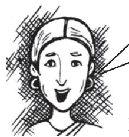

Normally, the interest paid or charged is never simple. The interest is calculated on the amount of the previous year. This is known as interest compounded or **Compound Interest** (C.I.).

Let us take an example and find the interest year by year. Each year our sum or principal changes.

#### **Calculating Compound Interest**

A sum of 20,000 is borrowed by Heena for 2 years at an interest of 8% compounded annually. Find the Compound Interest (C.I.) and the amount she has to pay at the end of 2 years.

Aslam asked the teacher whether this means that they should find the interest year by year. The teacher said 'yes', and asked him to use the following steps :

- 1. Find the Simple Interest (S.I.) for one year.
	- Let the principal for the first year be P1 . Here, P1 = 20,000

SI1 = SI at 8% p.a. for 1st year = 20000 8 100 × = 1600

- 2. Then find the amount which will be paid or received. This becomes principal for the next year.
Amount at the end of 1st year = P1 + SI1 = 20000 + 1600

* 21600 = P${}_{2}$ (Principal for 2nd year)

- 3. Again find the interest on this sum for another year.
SI2 = SI at 8% p.a.for 2nd year = 21600 8 100 ×

$$=\mathbb{X}\ 1728$$

- 4. Find the amount which has to be paid or received at the end of second year.
Amount at the end of 2nd year = P2 + SI2

$$=\Re\ 21600+\Re\ 1728$$

$$=\aleph23328$$
 
$$\text{I}_{\text{max}}=1.696\quad\text{m}$$

Total interest given = 1600 + 1728

$$=\mathbb{X}\ 3328$$

Reeta asked whether the amount would be different for simple interest. The teacher told her to find the interest for two years and see for herself.

SI for 2 years = $\frac{20000\times8\times2}{100}$ = $\frac{32000}{100}$

Reeta said that when compound interest was used Heena would pay 128 more.

Let us look at the difference between simple interest and compound interest. We start with 100. Try completing the chart.

|  |  | Under | Under |  |
| --- | --- | --- | --- | --- |
|  |  | Simple Interest | Compound Interest |  |
| First year | Principal |  100.00 |  100.00 |  |
|  | Interest at 10% |  10.00 |  10.00 |  |
|  | Year-end amount |  110.00 |  110.00 |  |
| Second year | Principal |  100.00 |  110.00 |  |
|  | Interest at 10% |  10.00 |  11.00 | Which |
|  |  |  |  | means you |
|  | Year-end amount | (110 + 10) =  120 |  121.00 | pay interest |
|  |  |  |  | on the |
|  | Principal | 100.00 | 121.00 | interest |
| Third year |  |  |  | accumulated |
|  | Interest at 10% |  10.00 |  12.10 | till then! |
|  | Year-end amount | (120 + 10) =  130 | 133.10  |  |

Note that in 3 years,

Interest earned by Simple Interest = (130 – 100) = 30, whereas,

Interest earned by Compound Interest = (133.10 – 100) = 33.10

Note also that the Principal remains the same under Simple Interest, while it changes year after year under compound interest.

### 7.5 Deducing a Formula for Compound Interest

Zubeda asked her teacher, 'Is there an easier way to find compound interest?' The teacher said 'There is a shorter way of finding compound interest. Let us try to find it.'

Suppose P1 is the sum on which interest is compounded annually at a rate of R% per annum.

Let P1 = 5000 and R = 5. Then by the steps mentioned above

1. SI1 = 5000 5 1 100 × × or SI1 = P R1 1 100 × × so, A1 = 5000 + 5000 5 1 100 × × or A1 = P1 + SI1 = 1 1 P R P 100 + = 5000 1 5 100 + = P2 = P R 1 P2 1 100 + =

2. SI2 = 5000 1 5 100 5 1 100 + × × or SI2 = P R1 2 100 × × = 5000 5 100 1 100 × + 5 = P R R 1 1 100 100 + × = PR R 1 100 1 100 + A2 = 5 5000 5 5 5000 1 1 100 100 100 × + + + A2 = P2 + SI2 = 5000 1 5 100 1 5 100 + + = P R P R R 1 1 1 100 100 1 100 + + + = 5000 1 5 100 2 + = P3 = P R R 1 1 100 1 100 + + = P R 1 P 2 3 1 100 + =

Proceeding in this way the amount at the end of *n* years will be

Or, we can say  
  

$$\begin{array}{c}\includegraphics[width=140.0pt]{28.45}\end{array}$$

So, Zubeda said, but using this we get only the formula for the amount to be paid at the end of *n* years, and not the formula for compound interest.

Aruna at once said that we know CI = A – P, so we can easily find the compound interest too.

Example 8: Find CI on 12600 for 2 years at 10% per annum compounded annually.

Solution: We have, A = P 1 100 + R *n* , where Principal (P) = 12600, Rate (R) = 10, Number of years (*n*) = 2

$$=\$$
12600\left(1+{\frac{10}{100}}\right)^{2}=\
$$12600\left({\frac{11}{10}}\right)^{2}$$

* [12600] **x** 11 **x** 11 **x** 15246  
* [12600] **x** 11 **x** 11 **x** 15246

CI = A - P = $15246-$ 12600 = $2646$

### TRY THESE

- 1. Find CI on a sum of 8000 for 2 years at 5% per annum compounded annually.
### 7.6 Applications of Compound Interest Formula

There are some situations where we could use the formula for calculation of amount in CI. Here are a few.

- (i) Increase (or decrease) in population.
- (ii) The growth of a bacteria if the rate of growth is known.
- (iii) The value of an item, if its price increases or decreases in the intermediate years.

Example 9: The population of a city was 20,000 in the year 1997. It increased at the rate of 5% p.a. Find the population at the end of the year 2000.

Solution:There is 5% increase in population every year, so every new year has new population. Thus, we can say it is increasing in compounded form.

Population in the beginning of 1998 = 20000 (we treat this as the principal for the 1st year)

Treat as the Principal for the 2nd year. Treat as the Principal for the 3rd year. Increase at 5% = 5 20000 1000 100 × = Population in 1999 = 20000 + 1000 = 21000 Increase at 5% = 5 21000 1050 100 × = Population in 2000 = 21000 + 1050 = 22050 Increase at 5% = 5 22050 100 × = 1102.5 At the end of 2000 the population = 22050 + 1102.5 = 23152.5 or, Population at the end of 2000 = 20000 1 5 100 3 + = 21 21 21 20000 20 20 20 ××× = 23152.5 So, the estimated population = 23153.

Aruna asked what is to be done if there is a decrease. The teacher then considered the following example.

Example 10: A TV was bought at a price of 21,000. After one year the value of the TV was depreciated by 5% (Depreciation means reduction of value due to use and age of the item). Find the value of the TV after one year.

#### Solution:

Principal = 21,000 Reduction = 5% of 21000 per year = 21000 5 1 100 × × = 1050 value at the end of 1 year = 21000 – 1050 = 19,950

**Alternately,** We may directly get this as follows:

value at the end of 1 year = $\tau$ 21000 (1 - 5 100)  
  
= $\tau$ 21000 $\times$ 19 = $\tau$ 19,950

### TRY THESE

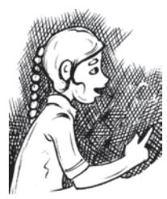

- 1. A machinery worth 10,500 depreciated by 5%. Find its value after one year.
- 2. Find the population of a city after 2 years, which is at present 12 lakh, if the rate of increase is 4%.

# EXERCISE 7.3

- **1.** The population of a place increased to 54,000 in 2003 at a rate of 5% per annum (i) find the population in 2001.
	- (ii) what would be its population in 2005?
- **2.** In a Laboratory, the count of bacteria in a certain experiment was increasing at the rate of 2.5% per hour. Find the bacteria at the end of 2 hours if the count was initially 5, 06,000.
- **3.** A scooter was bought at 42,000. Its value depreciated at the rate of 8% per annum. Find its value after one year.

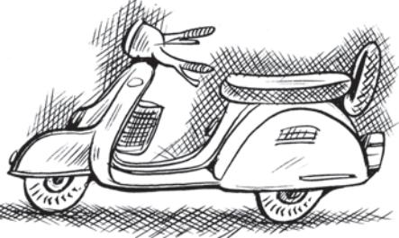

# WHAT HAVE WE DISCUSSED?

- **1. Discount** is a reduction given on marked price. Discount = Marked Price – Sale Price.
- **2.** Discount can be calculated when discount percentage is given. Discount = Discount % of Marked Price
- **3.** Additional expenses made after buying an article are included in the cost price and are known as **overhead expenses**.

CP = Buying price + Overhead expenses

- **4.** Sales tax is charged on the sale of an item by the government and is added to the Bill Amount. Sales tax = Tax% of Bill Amount
- **5.** GST stands for Goods and Services Tax and is levied on supply of goods or services or both.
- **6.** Compound interest is the interest calculated on the previous year's amount (A = P + I)

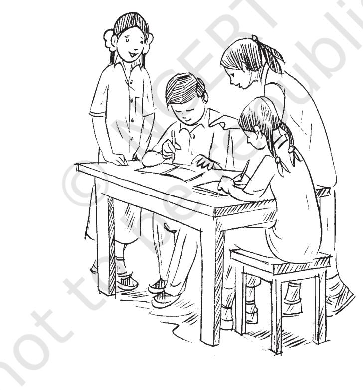

