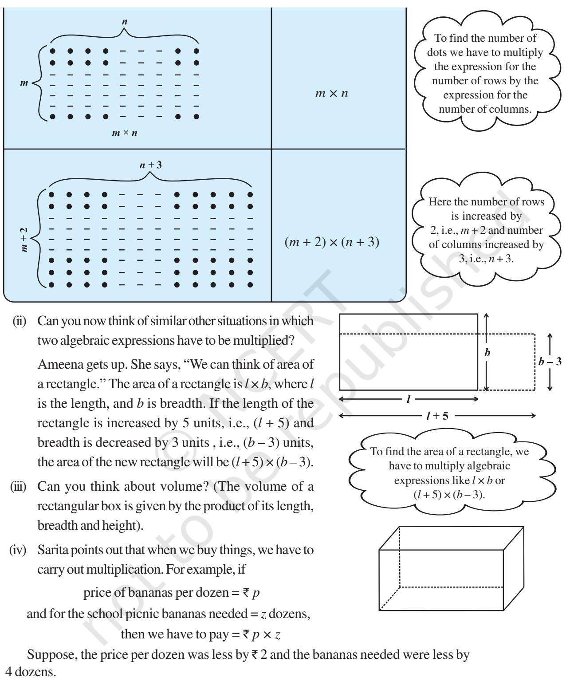
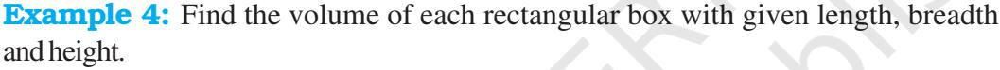
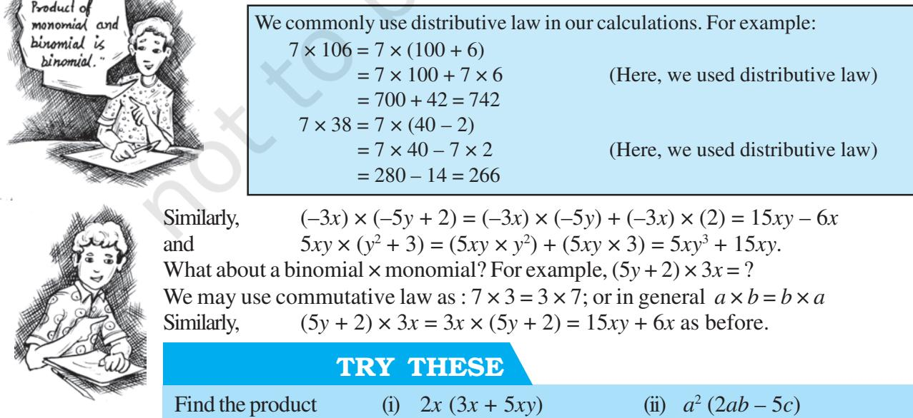

# Algebraic Expressions and Identities

CHAPTER

8

ALGEBRAIC EXPRESSIONS AND IDENTITIES 93

## 8.1 Addition and Subtraction of Algebraic Expressions

In earlier classes, we have already become familiar with what algebraic expressions (or simply expressions) are. Examples of expressions are:

$$x+3,\,2y-5,\,3x^{2},\,4x y+7\,\mathrm{etc.}$$

In the earlier classes, we have also learnt how to add and subtract algebraic expressions. For example, to add 7*x* 2 – 4*x* + 5 and 9*x* – 10, we do

$$\frac{7x^{2}-4x+5}{9x-10}$$

Observe how we do the addition. We write each expression to be added in a separate row. While doing so we write like terms one below the other, and add them, as shown. Thus 5 + (–10) = 5 –10 = –5. Similarly, – 4*x* + 9*x* = (– 4 + 9)*x* = 5*x*. Let us take some more examples.

Example 1: Add: 7*xy* + 5*yz* – 3*zx*, 4*yz* + 9*zx* – 4*y* , –3*xz* + 5*x* – 2*xy*.

Solution: Writing the three expressions in separate rows, with like terms one below the other, we have

$$7xy+5yz-3zx

4yz+9zx-4y

+-2xy-3zx+5x

(Note xz is same as zx)

5xy+9yz+3zx+5x-4y$$

Thus, the sum of the expressions is 5*xy* + 9*yz* + 3*zx* + 5*x* – 4*y*. Note how the terms, – 4*y* in the second expression and 5*x* in the third expression, are carried over as they are, since they have no like terms in the other expressions.

Example 2: Subtract 5*x* 2 – 4*y* 2 + 6*y* – 3 from 7*x* 2 – 4*xy* + 8*y* 2 + 5*x* – 3*y*. Solution:

$$\begin{array}{c c c}{{7x^{2}-4x y+8y^{2}+5x-3y}}\\ {{}}&{{}}\\ {{5x^{2}}}&{{-4y^{2}}}&{{+6y-3}}\\ {{}}&{{}}\\ {{(-)}}&{{}}\\ {{}}&{{}}\\ {{2x^{2}-4x y+12y^{2}+5x-9y+3}}\end{array}$$

Note that subtraction of a number is the same as addition of its additive inverse. Thus subtracting –3 is the same as adding +3. Similarly, subtracting 6*y* is the same as adding – 6*y*; subtracting – 4*y* 2 is the same as adding 4*y* 2 and so on. The signs in the third row written below each term in the second row help us in knowing which operation has to be performed.

## EXERCISE 8.1

- **1.** Add the following.
	-
	- (iii) 2*p* 2*q* 2 – 3*pq* + 4, 5 + 7*pq* – 3*p* 2*q* 2
	- (i) *ab bc*, *bc ca*, *ca ab* (ii) *a b* + *ab*, *b c* + *bc*, *c* – *a* + *ac* (iv) *l* 2 + *m*2 , *m*2 + *n* 2 , *n* 2 + *l* 2 , 2*lm* + 2*mn* + 2*nl*
- **2.** (a) Subtract 4*a* 7*ab* + 3*b* + 12 from 12*a* 9*ab* + 5*b* 3
	- (b) Subtract 3*xy* + 5*yz* 7*zx* from 5*xy* 2*yz* 2*zx* + 10*xyz*
	- (c) Subtract 4*p* 2*q* – 3*pq* + 5*pq*2 – 8*p* + 7*q* – 10 from 18 – 3*p* – 11*q* + 5*pq* – 2*pq*2 + 5*p* 2*q*

## 8.2 Multiplication of Algebraic Expressions: Introduction

- **Pattern of dots Total number of dots** 4 × 9 5 × 7
- (i) Look at the following patterns of dots.

Then, price of bananas per dozen = ` (*p* – 2) and bananas needed = (*z* – 4) dozens, Therefore, we would have to pay = ` (*p* – 2) × (*z* – 4)

## TRY THESE

Can you think of two more such situations, where we may need to multiply algebraic expressions?

- [**Hint:** Think of speed and time;
	- Think of interest to be paid, the principal and the rate of simple interest; etc.]

In all the above examples, we had to carry out multiplication of two or more quantities. If the quantities are given by algebraic expressions, we need to find their product. This means that we should know how to obtain this product. Let us do this systematically. To begin with we shall look at the multiplication of two monomials.

## 8.3 Multiplying a Monomial by a Monomial

Expression that contains only one term is called a **monomial**.

#### 8.3.1 Multiplying two monomials

We begin with

4 × *x* = *x* + *x* + *x* + *x* = 4*x* as seen earlier.

Similarly, 4 × (3*x*) = 3*x* + 3*x* + 3*x* + 3*x* = 12*x*

Now, observe the following products.

(i) $x\times3y=x\times3\times y=3\times x\times y=3xy$

(ii) $5x\times3y=5\times x\times3\times y=5\times3\times x\times y=15xy$.  
  

- (iii) 5*x* × (–3*y*) = 5 × *x* × (–3) × *y*
2 )

3

= 5 × (–3) × *x* × *y* = –15*xy*

Some more useful examples follow.

$$\begin{array}{r l}{{\mathrm{(iv)}}}&{{}}&{{}{\ }{\ }5x\times4x^{2}=}\end{array}$$

$$\begin{array}{r l}{{\mathrm{~}}4x^{2}=(5\times4)\times(x\times x)}\\ {{}}&{{}=\ 20\times x^{3}=20x^{3}}\end{array}$$

(v) $5x\times(-4xyz)=(5\times-4)\times(x\times xyz)$

$$=-20\times(x\times x\times y z)=-20x^{2}y z$$

Observe how we collect the powers of different variables in the algebraic parts of the two monomials. While doing so, we use the rules of exponents and powers.

Note that 5 × 4 = 20

i.e., coefficient of product = coefficient of first monomial × coefficient of second monomial;

$${\mathrm{and}}\qquad\qquad x\times x^{2}=x^{3}$$

i.e., algebraic factor of product = algebraic factor of first monomial × algebraic factor of second monomial.

#### 8.3.2 Multiplying three or more monomials

#### Observe the following examples.

(i) $2x\times5y\times7z=(2x\times5y)\times7z=10xy\times7z=70xyz$

- (ii) 4*xy* × 5*x* 2*y* 2 × 6*x* 3*y* 3 = (4*xy* × 5*x* 2*y* 2 ) × 6*x* 3*y* 3 = 20*x* 3*y* 3 × 6*x* 3*y* 3 = 120*x* 3*y* 3 × *x* 3*y* 3 = 120 (*x* 3 × *x* 3 ) × (*y* 3 × *y* 3 ) = 120*x* 6 × *y* 6 = 120*x* 6 *y* 6
It is clear that we first multiply the first two monomials and then multiply the resulting monomial by the third monomial. This method can be extended to the product of any number of monomials.

Notice that all the three products of monomials, 3*xy*, 15*xy*, –15*xy*, are also monomials.

## TRY THESE

Does the order in which you carry out the multiplication matter?

Find 4*x* × 5*y* × 7*z* First find 4*x* × 5*y* and multiply it by 7*z*; or first find 5*y* × 7*z* and multiply it by 4*x*. Is the result the same? What do you observe? We can find the product in other way also. 4*xy* × 5*x* 2*y* 2 × 6*x* 3 *y* 3 = (4 × 5 × 6) × (*x* × *x* 2 × *x* 3 ) × (*y* × *y* 2 × *y* 3 ) = 120 *x* 6*y* 6

Example 3: Complete the table for area of a rectangle with given length and breadth.

| Solution: | length | breadth | area |
| --- | --- | --- | --- |
|  | 3x | 5y | 3x × 5y = 15xy |
|  | 9y | 2 4y |  |
|  | 4ab | 5bc |  |
|  | 2l 2m | 3lm2 |  |

|  | length | breadth | height |
| --- | --- | --- | --- |
| (i) | 2ax | 3by | 5cz |
| (ii) | m2n | n 2p | p 2m |
| (iii) | 2q | 2 4q | 3 8q |

Solution: Volume = length × breadth × height

Hence, for (i) volume $=(2ax)\times(3by)\times(5cz)$  
  

$$=2\times3\times5\times(ax)\times(by)\times(cz)=30abcxyz$$
  
  
for (ii) volume $=m^{2}m\times n^{2}p\times p^{2}m$  
  

$$=(m^{2}\times m)\times(n\times n^{2})\times(p\times p^{2})=m^{3}n^{3}p^{3}$$
  
  
for (iii) volume $=2q\times4q^{2}\times8q^{3}$  
  

$$=2\times4\times8\times q\times q^{2}\times q^{3}=64q^{6}$$

## EXERCISE 8.2

- **1.** Find the product of the following pairs of monomials.
	- (i) 4, 7*p* (ii) 4*p*, 7*p* (iii) 4*p*, 7*pq* (iv) 4*p* 3 , – 3*p* (v) 4*p*, 0
- **2.** Find the areas of rectangles with the following pairs of monomials as their lengths and breadths respectively.

(*p*, *q*); (10*m*, 5*n*); (20*x* 2 , 5*y* 2 ); (4*x*, 3*x* 2 ); (3*mn*, 4*np*)

- First monomial → Second monomial ↓ 2*x* –5*y* 3*x* 2 – 4*xy* 7*x* 2 *y* –9*x* 2 *y* 2 2*x* 4*x* 2 . . . . . . . . . . . . . . . –5*y* . . . . . . –15*x* 2 *y* . . . . . . . . . 3*x* 2 . . . . . . . . . . . . . . . . . . – 4*xy* . . . . . . . . . . . . . . . . . . 7*x* 2 *y* . . . . . . . . . . . . . . . . . . –9*x* 2*y* 2 . . . . . . . . . . . . . . . . . .
- **3.** Complete the table of products.

- **4.** Obtain the volume of rectangular boxes with the following length, breadth and height respectively.
(i) 5*a*, 3*a* 2 , 7*a* 4 (ii) 2*p*, 4*q*, 8*r* (iii) *xy*, 2*x* 2 *y*, 2*xy*2 (iv) *a*, 2*b*, 3*c*

> 2 , 16*y* 3

- **5.** Obtain the product of
	- (i) *xy*, *yz*, *zx* (ii) *a*, *a* 2 , *a* 3 (iii) 2, 4*y*, 8*y*
	- (iv) *a*, 2*b*, 3*c*, 6*abc* (v) *m*, – *mn*, *mnp*

## 8.4 Multiplying a Monomial by a Polynomial

Expression that contains two terms is called a **binomial**. An expression containing three terms is a **trinomial** and so on. In general, an expression containing, one or more terms with non-zero coefficient (with variables having non negative integers as exponents) is called a **polynomial**.

### 8.4.1 Multiplying a monomial by a binomial

Let us multiply the monomial 3*x* by the binomial 5*y* + 2, i.e., find 3*x* × (5*y* + 2) = ? Recall that 3*x* and (5*y* + 2) represent numbers. Therefore, using the distributive law, 3*x* × (5*y* + 2) = (3*x* × 5*y*) + (3*x* × 2) = 15*xy* + 6*x*

#### 8.4.2 Multiplying a monomial by a trinomial

Consider 3*p* × (4*p* 2 + 5*p* + 7). As in the earlier case, we use distributive law;

$$3p\times(4p^{2}+5p+7)=(3p\times4p^{2})+(3p\times5p)+(3p\times7)$$

$$=12p^{3}+15p^{2}+21p^{3}$$

Multiply each term of the trinomial by the monomial and add products.

Observe, by using the distributive law, we are able to carry out the multiplication term by term.

TRY THESE

Find the product: (4*p* 2 + 5*p* + 7) × 3*p*

Example 5: Simplify the expressions and evaluate them as directed:

(i) $x\left(x-3\right)+2$ for $x=1$, (ii) $3y\left(2y-7\right)-3\left(y-4\right)-63$ for $y=-2$.  
  

#### Solution:

(i) $x\ (x-3)+2=x^{2}-3x+2$  
  
For $x=1$, $x^{2}-3x+2=(1)^{2}-3\ (1)+2$  
  
$=1-3+2=3-3=0$  
  
(ii) $3y\ (2y-7)-3\ (y-4)-63=6y^{2}-21y-3y+12-63$  
  
$=6y^{2}-24y-51$  
  
For $y=-2$, $6y^{2}-24y-51=6\ (-2)^{2}-24(-2)-51$  
  
$=6\times4+24\times2-51$  
  
$=24+48-51\equiv72-51=21$

#### Example 6: Add

(i) $5m$ ($3-m$) and $6m^{2}-13m$ (ii) $4y$ ($3y^{2}+5y$ -7) and $2$ ($y^{3}-4y^{2}+5$)

#### Solution:

- (i) First expression = 5*m* (3 *m*) = (5*m* × 3) (5*m* × *m*) = 15*m* 5*m*2 Now adding the second expression to it,15*m* – 5*m*2 + 6*m*2 – 13*m = m*2 + 2*m*
- (ii) The first expression = 4*y* (3*y* 2 + 5*y* – 7) = (4*y* × 3*y* 2 ) + (4*y* × 5*y*) + (4*y* × (–7)) = 12*y* 3 + 20*y* 2 – 28*y*

The second expression = 2 (*y* 3 – 4*y* 2 + 5) = 2*y* 3 + 2 × (– 4*y* 2 ) + 2 × 5 = 2*y* 3 – 8*y* 2 + 10

$$Adding the two expressions, 12y^{3}+20y^{2}-28y

+2y^{3}-8y^{2}+10

14y^{3}+12y^{2}-28y+10$$

Example 7: Subtract 3*pq* (*p* – *q*) from 2*pq* (*p* + *q*).

  
  
**Solution:** We have $3pq\ (p-q)=3p^{2}q-3pq^{2}$ and $2pq\ (p+q)=2p^{2}q+2pq^{2}$  
  
Subtracting, $2p^{2}q\ \ \ +\ \ \ 2pq^{2}$  
  
$3p^{2}q\ \ \ -\ \ \ 3pq^{2}$  
  
$-\ \ \ \ \ +$  
  
$-\ p^{2}q\ \ \ +\ \ \ 5pq^{2}$

## EXERCISE 8.3

- **1.** Carry out the multiplication of the expressions in each of the following pairs.
(i) $4p,\,q+r$ (ii) $ab,\,a-b$ (iii) $a+b,\,7a^{2}b^{2}$ (iv) $a^{2}-9,\,4a$ (v) $pq+qr+rp,\,0$

- **2.** Complete the table.

|  | First expression | Second expression | Product |
| --- | --- | --- | --- |
| (i) | a | b + c + d | . . . |
| (ii) | x + y – 5 | 5xy | . . . |
| (iii) | p | 2 6p – 7p + 5 | . . . |
| (iv) | 2 4p 2q | 2 2 p – q | . . . |
| (v) | a + b + c | abc | . . . |

- **3.** Find the product.
	- (i) (*a* 2 ) × (2*a* 22) × (4*a* 26) (ii) 2 3 9 10 2 2 *xy x y* × − (iii) − × 10 3 6 5 3 3 *pq p q* (iv) *x* × *x* 2 × *x* 3 × *x* 4

**4.** (a) Simplify 3*x* (4*x* – 5) + 3 and find its values for (i) *x* = 3 (ii) *x* = 1 2 .

- (b) Simplify *a* (*a* 2 + *a* + 1) + 5 and find its value for (i) *a* = 0, (ii) *a* = 1 (iii) *a* = – 1.
- **5.** (a) Add: *p* ( *p q*), *q* ( *q r*) and *r* ( *r p*)
	- (b) Add: 2*x* (*z x y*) and 2*y* (*z y x*)
	- (c) Subtract: 3*l* (*l* 4 *m* + 5 *n*) from 4*l* ( 10 *n* 3 *m* + 2 *l* )
	- (d) Subtract: 3*a* (*a* + *b* + *c* ) 2 *b* (*a b* + *c*) from 4*c* ( *a* + *b* + *c* )

## 8.5 Multiplying a Polynomial by a Polynomial 8.5.1 Multiplying a binomial by a binomial

Let us multiply one binomial (2*a* + 3*b*) by another binomial, say (3*a* + 4*b*). We do this step-by-step, as we did in earlier cases, following the distributive law of multiplication,

$$(3a+4b)\times(2a+3b)=3a\times(2a+3b)+4b\times(2a+3b)$$

| Observe, every term in one | = | (3a × 2a) + (3a × 3b) + (4b × 2a) + (4b × 3b) |  |
| --- | --- | --- | --- |
| binomial multiplies every | 2 = 6a | 2 + 9ab + 8ba + 12b |  |
| term in the other binomial. | 2 = 6a | 2 + 17ab + 12b | (Since ba = ab) |

When we carry out term by term multiplication, we expect 2 × 2 = 4 terms to be present. But two of these are like terms, which are combined, and hence we get 3 terms. **In multiplication of polynomials with polynomials, we should always look for like terms, if any, and combine them**.

#### Example 8: Multiply

(i) $(x-4)$ and $(2x+3)$ (ii) $(x-y)$ and $(3x+5y)$  
  
**Solution:**  
  
(i) $(x-4)\times(2x+3)=x\times(2x+3)-4\times(2x+3)$  
  
$=(x\times2x)+(x\times3)-(4\times2x)-(4\times3)=2x^{2}+3x-8x-12$  
  
$=2x^{2}-5x-12$  
  
(ii) $(x-y)\times(3x+5y)=x\times(3x+5y)-y\times(3x+5y)$  
  
$=(x\times3x)+(x\times5y)-(y\times3x)-(\ y\times5y)$  
  
$=3x^{2}+5xy-3yx-5y^{2}=3x^{2}+2xy-5y^{2}$ (Adding like terms)

#### Example 9: Multiply

(i) $(a+7)$ and $(b-5)$ (ii) $(a^{2}+2b^{2})$ and $(5a-3b)$

#### Solution:

(i) $(a+7)\times(b-5)=a\times(b-5)+7\times(b-5)$  
  
$=ab-5a+7b-35$

Note that there are no like terms involved in this multiplication.

(ii) $(a^{2}+2b^{2})\times(5a-3b)=a^{2}\,(5a-3b)+2b^{2}\times(5a-3b)$  
  
$=5a^{3}-3a^{2}b+10ab^{2}-6b^{3}$

#### 8.5.2 Multiplying a binomial by a trinomial

In this multiplication, we shall have to multiply each of the three terms in the trinomial by each of the two terms in the binomial. We shall get in all 3 × 2 = 6 terms, which may reduce to 5 or less, if the term by term multiplication results in like terms. Consider

$$\underbrace{(a+7)}_{\text{binomial}}\times\underbrace{(a^{2}+3a+5)}_{\text{trinomial}}=a\times\overbrace{(a^{2}+3a+5)}^{\text{tresight}}\times\overbrace{(a^{2}+3a+5)}^{\text{tresight}}$$
 
$$=a^{3}+3a^{2}\overbrace{5a}+7a^{2}+21a+35$$
 
$$=a^{3}+(3a^{2}+7a^{2})+(5a+21a)+35$$
 
$$=a^{3}+10a^{2}+26a+35$$
 (Why are there only 4 terms in the final result?)

Example 10: Simplify (*a* + *b*) (2*a* – 3*b* + *c*) – (2*a* – 3*b*) *c.*

Solution: We have

$$(a+b)(2a-3b+c)=a(2a-3b+c)+b(2a-3b+c)

=2a^{2}-3ab+ac+2ab-3b^{2}+bc

=2a^{2}-ab-3b^{2}+bc+ac

(Note, -3ab and 2ab are like terms)$$

and (2*a* – 3*b*) *c* = 2*ac* – 3*bc*

$${\mathrm{Therefore,}}$$

$(a+b)\,(2a-3b+c)-(2a-3b)\,c=2a^{2}-ab-3b^{2}+bc+ac-(2ac-3bc)$  
  

$$=2a^{2}-ab-3b^{2}+bc+ac-2ac+3bc$$
 
$$=2a^{2}-ab-3b^{2}+(bc+3bc)+(ac-2ac)$$
 
$$=2a^{2}-3b^{2}-ab+4bc-ac$$

#### EXERCISE 8.4 **1.** Multiply the binomials. (i) (2*x* + 5) and (4*x* – 3) (ii) (*y* – 8) and (3*y* – 4) (iii) (2.5*l* – 0.5*m*) and (2.5*l* + 0.5*m*) (iv) (*a* + 3*b*) and (*x* + 5) (v) (2*pq* + 3*q* 2 ) and (3*pq* – 2*q* 2 ) (vi) **2.** Find the product. (i) (5 – 2*x*) (3 + *x*) (ii) (*x* + 7*y*) (7*x* – *y*) (iii) (*a* 2 + *b*) (*a* + *b* 2 ) (iv) (*p* 2 – *q* 2 ) (2*p* + *q*) **3.** Simplify. (i) (*x* 2 – 5) (*x* + 5) + 25 (ii) (*a* 2 + 5) (*b* 3 + 3) + 5 (iii) (*t* + *s* 2 ) (*t* 2 – *s*) (iv) (*a* + *b*) (*c* – *d*) + (*a* – *b*) (*c* + *d*) + 2 (*ac* + *bd*) (v) (*x* + *y*)(2*x* + *y*) + (*x* + 2*y*)(*x* – *y*) (vi) (*x* + *y*)(*x* 2 – *xy* + *y* 2 )

- (vii) (1.5*x* 4*y*)(1.5*x* + 4*y* + 3) 4.5*x* + 12*y*
- (viii) (*a* + *b* + *c*)(*a* + *b c*)

## WHAT HAVE WE DISCUSSED?

- **1.** Expressions are formed from **variables** and **constants**.
- **2.** Terms are added to form **expressions**. Terms themselves are formed as product of **factors**.
- **3.** Expressions that contain exactly one, two and three terms are called **monomials**, **binomials** and **trinomials** respectively. In general, any expression containing one or more terms with non-zero coefficients (and with variables having non- negative integers as exponents) is called a **polynomial**.
- **4. Like** terms are formed from the same variables and the powers of these variables are the same, too. Coefficients of like terms need not be the same.
- **5.** While adding (or subtracting) polynomials, first look for like terms and add (or subtract) them; then handle the unlike terms.
- **6.** There are number of situations in which we need to multiply algebraic expressions: for example, in finding area of a rectangle, the sides of which are given as expressions.
- **7.** A monomial multiplied by a monomial always gives a monomial.
- **8.** While multiplying a polynomial by a monomial, we multiply every term in the polynomial by the monomial.
- **9.** In carrying out the multiplication of a polynomial by a binomial (or trinomial), we multiply term by term, i.e., every term of the polynomial is multiplied by every term in the binomial (or trinomial). Note that in such multiplication, we may get terms in the product which are like and have to be combined.

