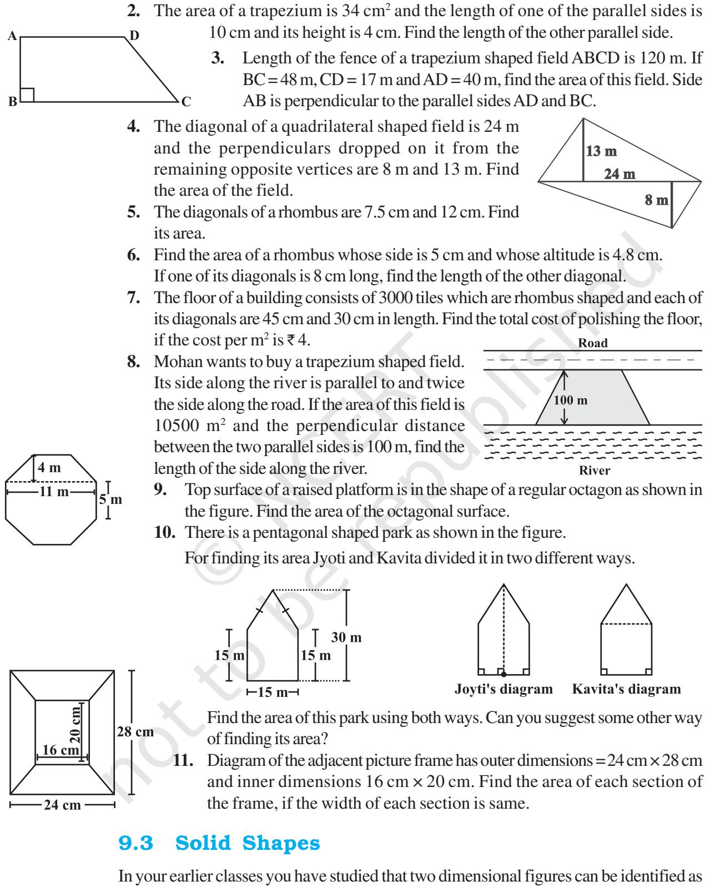
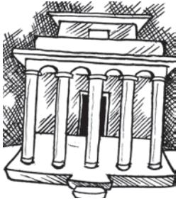
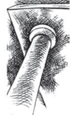

# **Mensuration**


MENSURATION **103**

CHAPTER

### **9.1 Introduction**

We have learnt that for a closed plane figure, the perimeter is the distance around its boundary and its area is the region covered by it. We found the area and perimeter of various plane figures such as triangles, rectangles, circles etc. We have also learnt to find the area of pathways or borders in rectangular shapes.

In this chapter, we will try to solve problems related to perimeter and area of other plane closed figures like quadrilaterals.

We will also learn about surface area and volume of solids such as cube, cuboid and cylinder.

#### **9.2 Area of a Polygon**

We split a quadrilateral into triangles and find its area. Similar methods can be used to find the area of a polygon. Observe the following for a pentagon: (Fig 9.1, 9.2)


By constructing two diagonals AC and AD the pentagon ABCDE is divided into three parts. So, area ABCDE = area of ∆ ABC + area of ∆ ACD + area of ∆ AED.

By constructing one diagonal AD and two perpendiculars BF and CG on it, pentagon ABCDE is divided into four parts. So, area of ABCDE = area of right angled ∆ AFB + area of trapezium BFGC + area of right angled ∆ CGD + area of ∆ AED. (Identify the parallel sides of trapezium BFGC.)


TRY THESE **Fig 9.3 Fig 9.4** (i) Divide the following polygons (Fig 9.3) into parts (triangles and trapezium) to find out its area. FI is a diagonal of polygon EFGHI NQ is a diagonal of polygon MNOPQR (ii) Polygon ABCDE is divided into parts as shown below (Fig 9.4). Find its area if CH = 3 cm, EG = 2.5 cm. Area of Polygon ABCDE = area of ∆AFB + .... Area of ∆ AFB = 1 2 × AF × BF = 1 2 × 3 × 2 = .... Area of trapezium FBCH = FH × (BF CH) 2 + = 3 × (2 3) 2 + [FH = AH – AF] Area of ∆CHD = 1 2 × HD× CH = ....; Area of ∆ADE = 1 2 So, the area of polygon ABCDE = .... (iii) Find the area of polygon MNOPQR (Fig 9.5) if MP = 9 cm, MD = 7 cm, MC = 6 cm, MB = 4 cm, MA = 2 cm NA, OC, QD and RB are perpendiculars to diagonal MP. **Fig 9.5**

Example 1: The area of a trapezium shaped field is 480 m2 , the distance between two parallel sides is 15 m and one of the parallel side is 20 m. Find the other parallel side.

Solution: One of the parallel sides of the trapezium is *a* = 20 m, let another parallel side be *b*, height *h* = 15 m.

The given area of trapezium = 480 m${}^{2}$.  
  
Area of a trapezium = $\frac{1}{2}\,h\,(a+b)$  
  
So $480=\frac{1}{2}\times15\times(20+b)$ or $\frac{480\times2}{15}=20+b$  
  
or $64=20+b$ or $b=44$ m  
  

Hence the other parallel side of the trapezium is 44 m.

- AD = 8 cm, AH = 6 cm, AG = 4 cm, AF = 3 cm and perpendiculars BF = 2 cm,
× AD × GE = ....

- 
Example 2: The area of a rhombus is 240 cm2 and one of the diagonals is 16 cm. Find the other diagonal.

Solution: Let length of one diagonal *d*1 = 16 cm

and length of the other diagonal = *d*2 Area of the rhombus = 1 2 *d*1 . *d*2 = 240

So,  
  

$$\frac{1}{2}16\cdot d_{2}=240$$
  
  
Therefore,  
  

$$d_{2}=30\,\mbox{cm}$$

Therefore, *d*2

Hence the length of the second diagonal is 30 cm.

Example 3: There is a hexagon MNOPQR of side 5 cm (Fig 9.6). Aman and Ridhima divided it in two different ways (Fig 9.7).

Find the area of this hexagon using both ways.


#### Solution: **Aman's method:**

Since it is a hexagon so NQ divides the hexagon into two congruent trapeziums. You can verify it by paper folding (Fig 9.8).

Now area of trapezium MNQR = (11 5) 4 2 + × = 2 × 16 = 32 cm2 .

So the area of hexagon MNOPQR = 2 × 32 = 64 cm2


#### **Ridhima's method:**

∆ MNO and ∆ RPQ are congruent triangles with altitude 3 cm (Fig 9.9).

You can verify this by cutting off these two triangles and placing them on one another.

Area of $\Delta$ MNO = $\frac{1}{2}\times8\times3=12$ cm${}^{2}$ = Area of $\Delta$ RPQ

Area of rectangle MOPR = 8 × 5 = 40 cm2 . Now, area of hexagon MNOPQR = 40 + 12 + 12 = 64 cm2 .

# EXERCISE 9.1

- **1.** The shape of the top surface of a table is a trapezium. Find its area if its parallel sides are 1 m and 1.2 m and perpendicular distance between them is 0.8 m.


**Fig 9.8**

.



(Fig 9.10).

the faces of three dimensional shapes. Observe the solids which we have discussed so far


Observe that some shapes have two or more than two identical (congruent) faces. Name them. Which solid has all congruent faces?

# DO THIS Soaps, toys, pastes, snacks etc. often come in the packing of cuboidal, cubical or cylindrical boxes. Collect, such boxes (Fig 9.11). **Fig 9.11** All six faces are rectangular, and opposites faces are identical. So there are three pairs of identical faces. **Cuboidal Box Cubical Box** All six faces are squares and identical. One curved surface and two circular faces which are identical. **Cylindrical Box**

Now take one type of box at a time. Cut out all the faces it has. Observe the shape of each face and find the number of faces of the box that are identical by placing them on each other. Write down your observations.


**Fig 9.12** (This is a right circular cylinder)

Did you notice the following:

The cylinder has congruent circular faces that are parallel to each other (Fig 9.12). Observe that the line segment joining the center of circular faces is perpendicular to the base. Such cylinders are known as **right circular cylinders**. We are only going to study this type of cylinders, though there are other types of cylinders as well (Fig 9.13).


**Fig 9.13** (This is not a right circular cylinder)

# THINK, DISCUSS AND WRITE


Why is it incorrect to call the solid shown here a cylinder?

### 9.4 Surface Area of Cube, Cuboid and Cylinder

Imran, Monica and Jaspal are painting a cuboidal, cubical and a cylindrical box respectively of same height (Fig 9.4).


**Fig 9.4**

They try to determine who has painted more area. Hari suggested that finding the surface area of each box would help them find it out.

To find the total surface area, find the area of each face and then add. The surface area of a solid is the sum of the areas of its faces. To clarify further, we take each shape one by one.

#### 9.4.1 Cuboid

Suppose you cut open a cuboidal box and lay it flat (Fig 9.15). We can see a net as shown below (Fig 9.16).

Write the dimension of each side. You know that a cuboid has three pairs of identical faces. What expression can you use to find the area of each face?


Find the total area of all the faces

of the box. We see that the total surface area of a cuboid is area I + area II + area III + area IV +area V + area VI

= *h* × *l* + *b* × *l* + *b* × *h* + *l* × *h* + *b* × *h* + *l* × *b*

So total surface area = 2 (*h* × *l* + *b* × *h* + *b* × *l*) = 2(*lb* + *bh* + *hl*)

where *h*, *l* and *b* are the height, length and width of the cuboid respectively.

Suppose the height, length and width of the box shown above are 20 cm, 15 cm and 10 cm respectively.

Then the total surface area = 2 (20 x 15 + 20 x 10 + 10 x 15)

= 2 ( 300 + 200 + 150) = 1300 m2 .

### TRY THESE

Find the total surface area of the following cuboids (Fig 9.17):


•The side walls (the faces excluding the top and bottom) make the lateral surface area of the cuboid. For example, the total area of all the four walls of the cuboidal room in which you are sitting is the lateral surface area of this room (Fig 9.18). Hence, the lateral surface area of a cuboid is given by 2(*h* × *l* + *b* × *h*) or 2*h* (*l* + *b*).


**Fig 9.17**

#### DO THIS

- (i) Cover the lateral surface of a cuboidal duster (which your teacher uses in the class room) using a strip of brown sheet of paper, such that it just fits around the surface. Remove the paper. Measure the area of the paper. Is it the lateral surface area of the duster?
- (ii) Measure length, width and height of your classroom and find
	- (a) the total surface area of the room, ignoring the area of windows and doors.
	- (b) the lateral surface area of this room.
	- (c) the total area of the room which is to be white washed.

# THINK, DISCUSS AND WRITE

- 1. Can we say that the total surface area of cuboid = lateral surface area + 2 × area of base?
- 2. If we interchange the lengths of the base and the height of a cuboid (Fig 9.19(i)) to get another cuboid (Fig 9.19(ii)), will its lateral surface area change? (i) **Fig 9.19**


#### 9.4.2 Cube

#### DO THIS

Draw the pattern shown on a squared paper and cut it out [Fig 9.20(i)]. (You know that this pattern is a net of a cube. Fold it along the lines [Fig 9.20(ii)] and tape the edges to form a cube [Fig 9.20(iii)].


- (a) What is the length, width and height of the cube? Observe that all the faces of a cube are square in shape. This makes length, height and width of a cube equal (Fig 9.21(i)).
- (b) Write the area of each of the faces. Are they equal?
- (c) Write the total surface area of this cube.
- (d) If each side of the cube is *l*, what will be the area of each face? (Fig 9.21(ii)).

Can we say that the total surface area of a cube of side *l* is 6*l* 2 ?


# THINK, DISCUSS AND WRITE

- (i) Two cubes each with side *b* are joined to form a cuboid (Fig 9.23). What is the surface area of this cuboid? Is it 12*b* 2 ? Is the surface area of cuboid formed by joining three such cubes, 18*b* 2 ? Why?


**Fig 9.24**

- cuboid of smallest surface area? (iii) After the surface area of a cube is painted, the cube is cut
- into 64 smaller cubes of same dimensions (Fig 9.24). How many have no face painted? 1 face painted? 2 faces painted? 3 faces painted?

# 9.4.3 Cylinders

Most of the cylinders we observe are right circular cylinders. For example, a tin, round pillars, tube lights, water pipes etc.

#### DO THIS

- (i) Take a cylindrical can or box and trace the base of the can on graph paper and cut it [Fig 9.25(i)]. Take another graph paper in such a way that its width is equal to the height of the can. Wrap the strip around the can such that it just fits around the can (remove the excess paper) [Fig 9.25(ii)].
Tape the pieces [Fig 9.25(iii)] together to form a cylinder [Fig 9.25(iv)]. What is the shape of the paper that goes around the can?


Of course it is rectangular in shape. When you tape the parts of this cylinder together, the length of the rectangular strip is equal to the circumference of the circle. Record the radius (*r*) of the circular base, length (*l*) and width (*h*) of the rectangular strip. Is 2π*r* = length of the strip. Check if the area of rectangular strip is 2π*rh*. Count how many square units of the squared paper are used to form the cylinder. Check if this count is approximately equal to 2π*r* (*r* + *h*).

- (ii) We can deduce the relation 2π*r* (*r* + *h*) as the surface area of a cylinder in another way. Imagine cutting up a cylinder as shown below (Fig 9.26).


**Note:** We take π to be 22 7 unless otherwise stated. The lateral (or curved) surface area of a cylinder is 2π*rh*. The total surface area of a cylinder = π*r* 2 + 2π*rh* + π*r* 2 = 2π*r* 2 + 2π*rh* or 2π*r* (*r* + *h*)

#### TRY THESE


Find total surface area of the following cylinders (Fig 9.27)


# THINK, DISCUSS AND WRITE

Note that lateral surface area of a cylinder is the circumference of base × height of cylinder. Can we write lateral surface area of a cuboid as perimeter of base × height of cuboid?

Example 4: An aquarium is in the form of a cuboid whose external measures are 80 cm × 30 cm × 40 cm. The base, side faces and back face are to be covered with a coloured paper. Find the area of the paper needed?

Solution: The length of the aquarium = *l* = 80 cm Width of the aquarium = *b* = 30 cm Height of the aquarium = *h* = 40 cm

Area of the base = *l* × *b* = 80 × 30 = 2400 cm2 Area of the side face = *b* × *h* = 30 × 40 = 1200 cm2 Area of the back face = *l* × *h* = 80 × 40 = 3200 cm2


Required area = Area of the base + area of the back face

+ (2 × area of a side face) = 2400 + 3200 + (2 × 1200) = 8000 cm2

Hence the area of the coloured paper required is 8000 cm2 .

Example 5: The internal measures of a cuboidal room are 12 m × 8 m × 4 m. Find the total cost of whitewashing all four walls of a room, if the cost of white washing is ` 5 per m2 . What will be the cost of white washing if the ceiling of the room is also whitewashed.

Solution: Let the length of the room = *l* = 12 m

Width of the room = *b* = 8 m

Height of the room = $h=4$ m 

Area of the four walls of the room = Perimeter of the base × Height of the room

= 2 (*l* + *b*) × *h* = 2 (12 + 8) × 4 = 2 × 20 × 4 = 160 m2 .

Cost of white washing per m2 = ` 5

Hence the total cost of white washing four walls of the room = ` (160 × 5) = ` 800

Area of ceiling is 12 × 8 = 96 m2

Cost of white washing the ceiling = ` (96 × 5) = ` 480 So the total cost of white washing = ` (800 + 480) = ` 1280

Example 6: In a building there are 24 cylindrical pillars. The radius of each pillar is 28 cm and height is 4 m. Find the total cost of painting the curved surface area of all pillars at the rate of ` 8 per m2 .

Solution: Radius of cylindrical pillar, *r* = 28 cm = 0.28 m

height, *h* = 4 m

curved surface area of a cylinder = 2π*rh*

curved surface area of a pillar = 22 2 0.28 4 7 × × × = 7.04 m2 curved surface area of 24 such pillar = 7.04 × 24 = 168.96 m2 cost of painting an area of 1 m2 = ` 8 Therefore, cost of painting 1689.6 m2 = 168.96 × 8 = ` 1351.68

Example 7: Find the height of a cylinder whose radius is 7 cm and the total surface area is 968 cm2 .

Solution: Let height of the cylinder = *h*, radius = *r* = 7cm Total surface area = 2π*r* (*h* + *r*)





i.e., $2\times\frac{22}{7}\times7\times(7+h)=968$

*h* = 15 cm

Hence, the height of the cylinder is 15 cm.

# EXERCISE 9.2

- **1.** There are two cuboidal boxes as shown in the adjoining figure. Which box requires the lesser amount of material to make?
- **2.** A suitcase with measures 80 cm × 48 cm × 24 cm is to be covered with

a tarpaulin cloth. How many metres of tarpaulin of width 96 cm is required to cover 100 such suitcases?

- **3.** Find the side of a cube whose surface area is 600 cm2 .
- **4.** Rukhsar painted the outside of the cabinet of measure 1 m × 2 m × 1.5 m. How much surface area did she cover if she painted all except the bottom of the cabinet.
- **5.** Daniel is painting the walls and ceiling of a cuboidal hall with length, breadth and height of 15 m, 10 m and 7 m respectively. From each can of paint 100 m2 of area is painted. How many cans of paint will she need to paint the room?
- **6.** Describe how the two figures at the right are alike and how they are different. Which box has larger lateral surface area?
- **7.** A closed cylindrical tank of radius 7 m and height 3 m is made from a sheet of metal. How much sheet of metal is required?
- **8.** The lateral surface area of a hollow cylinder is 4224 cm2 . It is cut along its height and formed a rectangular sheet of width 33 cm. Find the perimeter of rectangular sheet?
- **9.** A road roller takes 750 complete revolutions to move once over to level a road. Find the area of the road if the diameter of a road roller is 84 cm and length is 1 m.
- **10.** A company packages its milk powder in cylindrical container whose base has a diameter of 14 cm and height 20 cm. Company places a label around the surface of the container (as shown in the figure). If the label is placed 2 cm from top and bottom, what is the area of the label.


# 9.5 Volume of Cube, Cuboid and Cylinder

Amount of space occupied by a three dimensional object is called its **volume**. Try to compare the volume of objects surrounding you. For example, volume of a room is greater than the volume of an almirah kept inside it. Similarly, volume of your pencil box is greater than the volume of the pen and the eraser kept inside it.

Can you measure volume of either of these objects?

Remember, we use square units to find the area of a region. Here we will use cubic units to find the volume of a solid, as cube is the most convenient solid shape (just as square is the most convenient shape to measure area of a region).

For finding the area we divide the region into square units, similarly, to find the volume of a solid we need to divide it into cubical units.

Observe that the volume of each of the adjoining solids is 8 cubic units (Fig 9.28 ).

We can say that the volume of a solid is measured by

counting the number of unit cubes it contains. Cubic units which we generally use to measure volume are

1 cubic cm = 1 cm x 1 cm x 1 cm = 1 cm${}^{3}$

= 10 mm × 10 mm × 10 mm = ............... mm3

```
 1 cubic m = 1 m × 1 m × 1 m = 1 m3
```

```
= ............................... cm3
```

```
1 cubic mm = 1 mm × 1 mm × 1 mm = 1 mm3
```

```
= 0.1 cm × 0.1 cm × 0.1 cm = ...................... cm3
```
We now find some expressions to find volume of a cuboid, cube and cylinder. Let us take each solid one by one.

#### 9.5.1 Cuboid

Take 36 cubes of equal size (i.e., length of each cube is same). Arrange them to form a cuboid. You can arrange them in many ways. Observe the following table and fill in the blanks.

| cuboid | length | breadth | height | l × b × h = V |
| --- | --- | --- | --- | --- |
| (i) (ii) | 12 ... | 3 ... | 1 ... | 12 × 3 × 1 = 36 ... |


What do you observe?

Since we have used 36 cubes to form these cuboids, volume of each cuboid is 36 cubic units. Also volume of each cuboid is equal to the product of length, breadth and height of the cuboid. From the above example we can say volume of cuboid = *l* × *b* × *h*. Since *l* × *b* is the area of its base we can also say that, Volume of cuboid = area of the base × height

### DO THIS


Take a sheet of paper. Measure its area. Pile up such sheets of paper of same size to make a cuboid (Fig 9.29). Measure the height of this pile. Find the volume of the cuboid by finding the product of the area of the sheet and the height of this pile of sheets.

This activity illustrates the idea

**Fig 9.29**

that volume of a solid can be deduced by this method also (if the base and top of the solid are congruent and parallel to each other and its edges are perpendicular to the base). Can you think of such objects whose volume can be found by using this method?


#### 9.5.2 Cube

The cube is a special case of a cuboid, where *l* = *b* = *h*. Hence, volume of cube = *l* × *l* × *l* = *l* 3

# TRY THESE

Find the volume of the following cubes

- (a) with a side 4 cm (b) with a side 1.5 m
#### DO THIS

Arrange 64 cubes of equal size in as many ways as you can to form a cuboid. Find the surface area of each arrangement. Can solid shapes of same volume have same surface area?

# THINK, DISCUSS AND WRITE

A company sells biscuits. For packing purpose they are using cuboidal boxes: box A→3 cm × 8 cm × 20 cm, box B → 4 cm × 12 cm × 10 cm. What size of the box will be economical for the company? Why? Can you suggest any other size (dimensions) which has the same volume but is more economical than these?

#### 9.5.3 Cylinder

We know that volume of a cuboid can be found by finding the product of area of base and its height. Can we find the volume of a cylinder in the same way?

Just like cuboid, cylinder has got a top and a base which are congruent and parallel to each other. Its lateral surface is also perpendicular to the base, just like cuboid.

So the Volume of a cuboid = area of base × height

TRY THESE

$$=l\,\times b\times h=l b h$$

Volume of cylinder = area of base × height

$$=\pi r^{2}\times h=\pi r^{2}h$$

Find the volume of the following cylinders.


#### 9.6 Volume and Capacity

There is not much difference between these two words.

- (a) Volume refers to the amount of space occupied by an object.
- (b) Capacity refers to the quantity that a container holds.

**Note:** If a water tin holds 100 cm3 of water then the capacity of the water tin is 100 cm3 .

Capacity is also measured in terms of litres. The relation between litre and cm3 is, 1 mL = 1 cm3 ,1 L = 1000 cm3 . Thus, 1 m3 = 1000000 cm3 = 1000 L.

Example 8: Find the height of a cuboid whose volume is 275 cm3 and base area is 25 cm2 .

| Solution: | Volume of a cuboid = | Base area × Height |
| --- | --- | --- |
|  | Hence height of the cuboid = | Volume of cuboid |
|  |  | Base area |
|  |  | 275 |
|  |  | = 25 = 11 cm |

Height of the cuboid is 11 cm.

Example 9: A godown is in the form of a cuboid of measures 60 m × 40 m × 30 m. How many cuboidal boxes can be stored in it if the volume of one box is 0.8 m3 ?

| Solution: | Volume of one box = 0.8 m3 |  |
| --- | --- | --- |
| Volume of godown = | 60 × 40 × 30 = 72000 m3 |  |
| Number of boxes that can be stored in the godown = | Volume of the godown |  |
|  | Volume of one box |  |
| 60 × 40 × 30 |  |  |
| = |  | = 90,000 |
|  | 0.8 |  |

Hence the number of cuboidal boxes that can be stored in the godown is 90,000. Example 10: A rectangular paper of width 14 cm is rolled along its width and a cylinder of radius 20 cm is formed. Find the volume of the cylinder (Fig 9.31). (Take 22 7 for π) Solution: A cylinder is formed by rolling a rectangle about its width. Hence the width of the paper becomes height and radius of the cylinder is 20 cm.


**Fig 9.31** Height of the cylinder = *h* = 14 cm Radius = *r* = 20 cm

$$Volume of the cylinder = V = \pir^{2}h

= \frac{22}{7}\times20\times20\times14 = 17600 cm{}^{3}$$

Hence, the volume of the cylinder is 17600 cm3 .

Example 11: A rectangular piece of paper 11 cm × 4 cm is folded without overlapping to make a cylinder of height 4 cm. Find the volume of the cylinder.

Solution: Length of the paper becomes the perimeter of the base of the cylinder and width becomes height.

Let radius of the cylinder $=r$ and height $=h$

Perimeter of the base of the cylinder $=2\pi r=11$

or

or  
  

$$2\times\frac{22}{7}\times r=11$$
  
  
Therefore,  
  

$$r=\frac{7}{4}\ \rm cm$$

Volume of the cylinder = V = $\pi r^{2}h$

$\frac{22}{7}\times\frac{7}{4}\times\frac{7}{4}\times\frac{4}{4}\times\frac{1}{2}$.  
  

.

Hence the volume of the cylinder is 38.5 cm3 .

# EXERCISE 9.3

- **1.** Given a cylindrical tank, in which situation will you find surface area and in which situation volume.
	- (a) To find how much it can hold.
	- (b) Number of cement bags required to plaster it.
	- (c) To find the number of smaller tanks that can be filled with water from it.
- **2.** Diameter of cylinder A is 7 cm, and the height is 14 cm. Diameter of cylinder B is 14 cm and height is 7 cm. Without doing any calculations can you suggest whose volume is greater? Verify it by finding the volume of both the cylinders. Check whether the cylinder with greater volume also has greater surface area?
- **3.** Find the height of a cuboid whose base area is 180 cm2 and volume is 900 cm3 ?
- **4.** A cuboid is of dimensions 60 cm × 54 cm × 30 cm. How many small cubes with side 6 cm can be placed in the given cuboid?
- **5.** Find the height of the cylinder whose volume is 1.54 m3 and diameter of the base is 140 cm ?
- **6.** A milk tank is in the form of cylinder whose radius is 1.5 m and length is 7 m. Find the quantity of milk in litres that can be stored in the tank?
- **7.** If each edge of a cube is doubled,
	- (i) how many times will its surface area increase?
	- (ii) how many times will its volume increase?


- **8.** Water is pouring into a cubiodal reservoir at the rate of 60 litres per minute. If the volume of reservoir is 108 m3 , find the number of hours it will take to fill the reservoir.


# WHAT HAVE WE DISCUSSED?

- **1. Surface area** of a solid is the sum of the areas of its faces.
- **2.** Surface area of

a cuboid = 2(*lb* + *bh* + *hl*) a cube = 6*l* 2 a cylinder = 2π*r*(*r* + *h*)

- **3.** Amount of region occupied by a solid is called its **volume**.
- **4.** Volume of

```
a cuboid = l × b × h
a cube = l
           3
```

```
a cylinder = πr
                2h
```
- **5.** (i) 1 cm3 = 1 mL
	- (ii) 1L = 1000 cm3
	- (iii) 1 m3 = 1000000 cm3 = 1000L


