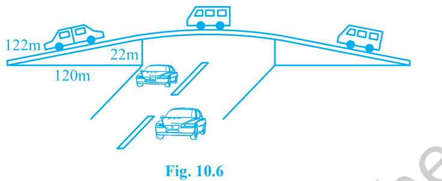
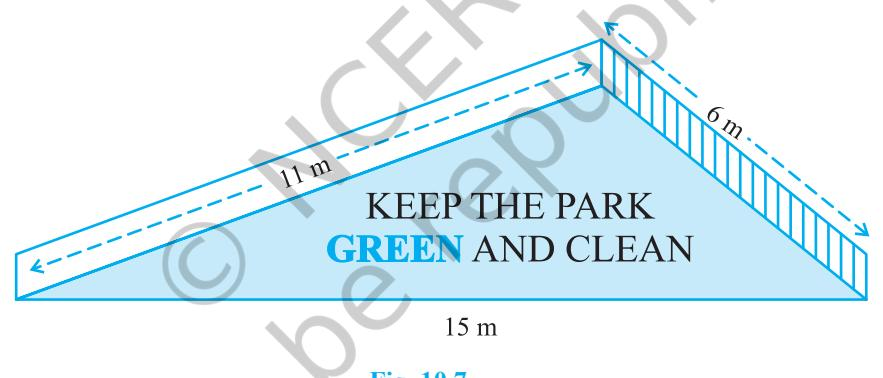

# **CHAPTER 10**

# **HERON'S FORMULA**

# **10.1Area of a Triangle — by Heron's Formula**

We know that the area of triangle when its height is given, is 1 2 × base × height. Now

suppose that we know the lengths of the sides of a scalene triangle and not the height. Can you still find its area? For instance, you have a triangular park whose sides are 40 m, 32 m, and 24 m. How will you calculate its area? Definitely if you want to apply the formula, you will have to calculate its height. But we do not have a clue to calculate the height. Try doing so. If you are not able to get it, then go to the next section.

Heron was born in about 10AD possibly in Alexandria in Egypt. He worked in applied mathematics. His works on mathematical and physical subjects are so numerous and varied that he is considered to be an encyclopedic writer in these fields. His geometrical works deal largely with problems on mensuration written in three books. Book I deals with the area of squares, rectangles, triangles, trapezoids (trapezia), various other specialised quadrilaterals, the regular polygons, circles, surfaces of cylinders, cones, spheres etc. In this book, Heron has derived the famous formula for the area of a triangle in terms of its three sides.

The formula given by Heron about the area of a triangle, is also known as *Hero's formula*. It is stated as:

Area of a triangle = $\sqrt{s(s-a)\left(s-b\right)\left(s-c\right)}$ (I)

**Fig. 10.2**

*where a, b and c are the sides of the triangle*, and *s* = *semi-perimeter, i.e., half the*

*perimeter of the triangle* = 2 *a b c* + + ,

This formula is helpful where it is not possible to find the height of the triangle easily. Let us apply it to calculate the area of the triangular park ABC, mentioned above (see Fig. 10.2).

Let us take *a* = 40 m, *b* = 24 m, *c* = 32 m,

so that we have $s=\frac{40+24+32}{2}$ m = 48 m.  
  
$s-a=(48-40)$ m = 8 m,  
  
$s-b=(48-24)$ m = 24 m,  
  
$s-c=(48-32)$ m = 16 m.  
  
$\alpha$\(\alpha

Therefore, area of the park ABC

$\sqrt{s(s-a)\,(s-b)\,(s-c)}$  
  
$\sqrt{48\times8\times24\times16\,\mathrm{m}^{2}}=384\,\mathrm{m}^{2}$

We see that 322 + 242 = 1024 + 576 = 1600 = 402 . Therefore, the sides of the park make a right triangle. The largest side, i.e., BC which is 40 m will be the hypotenuse and the angle between the sides AB and AC will be 90°.

We can check that the area of the park is 1 2 × 32 × 24 m2 = 384 m2 .

We find that the area we have got is the same as we found by using Heron's formula.

Now using Heron's formula, you verify this fact by finding the areas of other triangles discussed earlier *viz*.,

(i) equilateral triangle with side 10 cm.

(ii) isosceles triangle with unequal side as 8 cm and each equal side as 5 cm. You will see that

For (i), we have *s* = 10 10 10 2 + + cm = 15 cm. Area of triangle = 15(15 10) (15 10) (15 10) − − − cm2 = 2 2 15 5 5 5 cm 25 3 cm × × × = For (ii), we have *s* = 8 5 5 cm 9 cm 2 + + = Area of triangle = 9(9 8) (9 5) (9 5) − − − cm2 = 2 2 9 1 4 4 cm 12 cm . × × × = Let us now solve some more examples:

**Example 1 :** Find the area of a triangle, two sides of which are 8 cm and 11 cm and the perimeter is 32 cm (see Fig. 10.3).

**Solution :** Here we have perimeter of the triangle = 32 cm, *a* = 8 cm and *b* = 11 cm.

Third side *c* = 32 cm – (8 + 11) cm = 13 cm

So, $2s=32$, i.e., $s=16$ cm,  
  
$s-a=(16-8)$ cm = 8 cm,  
  
$s-b=(16-11)$ cm = 5 cm,  
  
$s-c=(16-13)$ cm = 3 cm.  
  

Therefore, area of the triangle = *s s a s b s c* ( ) ( ) ( ) − − −

$\sqrt{16\times8\times5\times3\,\rm cm^{2}}=8\sqrt{30}$ cm${}^{2}$

**Example 2 :** A triangular park ABC has sides 120m, 80m and 50m (see Fig. 10.4). A gardener *Dhania* has to put a fence all around it and also plant grass inside. How much area does she need to plant? Find the cost of fencing it with barbed wire at the rate of `20 per metre leaving a space 3m wide for a gate on one side.

**Solution :** For finding area of the park, we have

2*s* = 50 m + 80 m + 120 m = 250 m. i.e., *s* = 125 m Now, *s* – *a* = (125 – 120) m = 5 m, *s* – *b* = (125 – 80) m = 45 m,

*s* – *c* = (125 – 50) m = 75 m.

**Fig. 10.3**

Therefore, area of the park = *s s a s b s c* ( ) ( ) ( ) − − − = 125 5 45 75 × × × m2

$$={\overset{\cdot}{375}}{\sqrt{15}}\,{\mathrm{m}}^{2}$$

Also, perimeter of the park = AB + BC + CA = 250 m

Therefore, length of the wire needed for fencing = 250 m – 3 m (to be left for gate)

= 247 m

And so the cost of fencing = `20 × 247 = `4940

**Example 3 :** The sides of a triangular plot are in the ratio of 3 : 5 : 7 and its perimeter is 300 m. Find its area.

**Solution :** Suppose that the sides, in metres, are 3*x*, 5*x* and 7*x* (see Fig. 10.5).

Then, we know that 3*x* + 5*x* + 7*x* = 300 (perimeter of the triangle)

Therefore, 15*x* = 300, which gives *x* = 20.

So the sides of the triangle are 3 × 20 m, 5 × 20 m and 7 × 20 m

i.e., 60 m, 100 m and 140 m.

Can you now find the area [Using Heron's formula]?

We have *s* = 60 100 140 2 + + m = 150 m, and area will be 150(150 60) (150 100) (150 140) − − − m2 = 150 90 50 10 × × × m2 = 2 1500 3 m **Fig. 10.5**

### **EXERCISE 10.1**

- **1.** A traffic signal board, indicating 'SCHOOL AHEAD', is an equilateral triangle with side '*a*'. Find the area of the signal board, using Heron's formula. If its perimeter is 180 cm, what will be the area of the signal board?
#### HERON'S FORMULA 135

- **2.** The triangular side walls of a flyover have been used for advertisements. The sides of the walls are 122 m, 22 m and 120 m (see Fig. 10.6). The advertisements yield an earning of ` 5000 per m2 per year. A company hired one of its walls for 3 months. How much rent did it pay?

- **3.** There is a slide in a park. One of its side walls has been painted in some colour with a message "KEEPTHE PARK GREEN AND CLEAN" (see Fig. 10.7 ). If the sides of the wall are 15 m, 11 m and 6 m, find the area painted in colour.

- **Fig. 10.7**
- **4.** Find the area of a triangle two sides of which are 18cm and 10cm and the perimeter is 42cm.
- **5.** Sides of a triangle are in the ratio of 12 : 17 : 25 and its perimeter is 540cm. Find its area.
- **6.** An isosceles triangle has perimeter 30 cm and each of the equal sides is 12 cm. Find the area of the triangle.

## **10.2 Summary**

In this chapter, you have studied the following points :

- **1.** Area of a triangle with its sides as *a*, *b* and *c* is calculated by using Heron's formula, stated as

$$\text{Area of triangle}=\sqrt{s(s-a)\left(s-b\right)\left(s-c\right)}$$
  
  
where  
  

$$s=\frac{a+b+c}{2}$$

