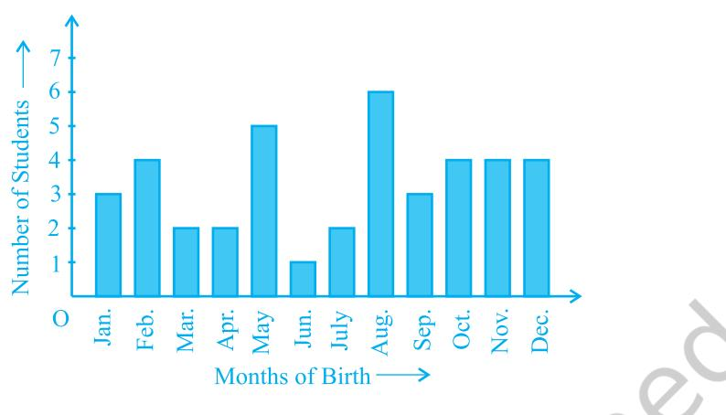
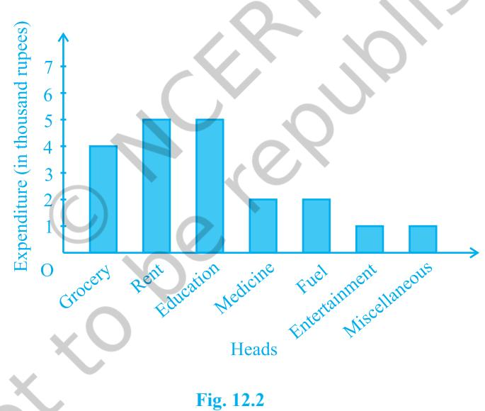
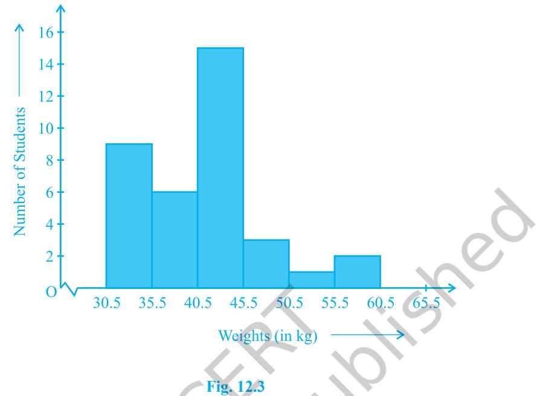
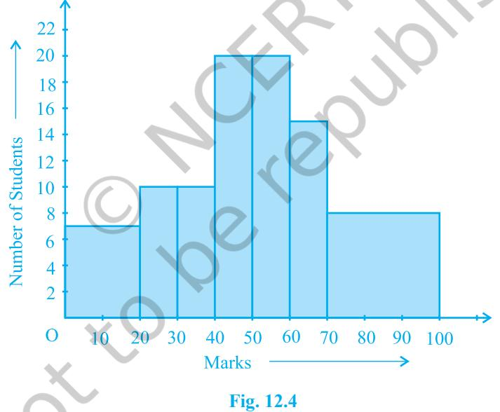
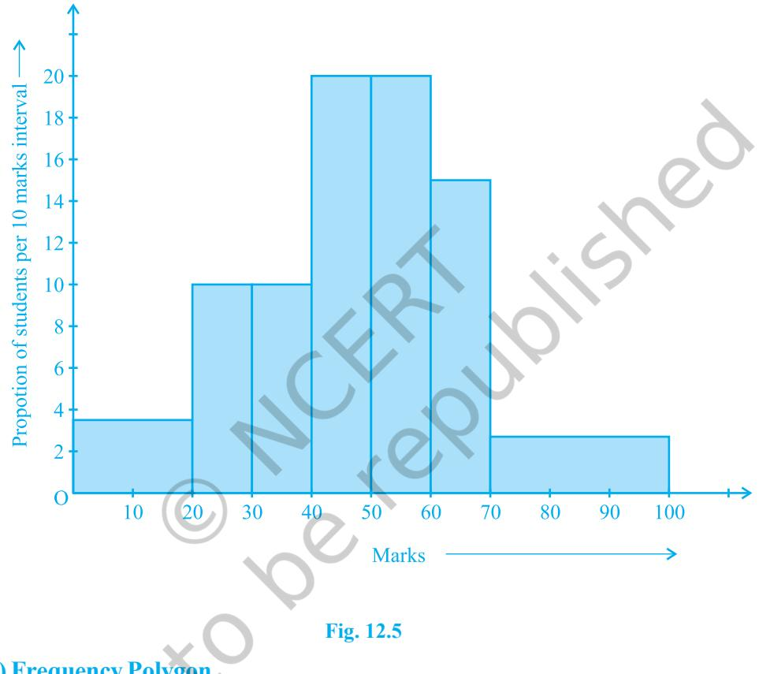
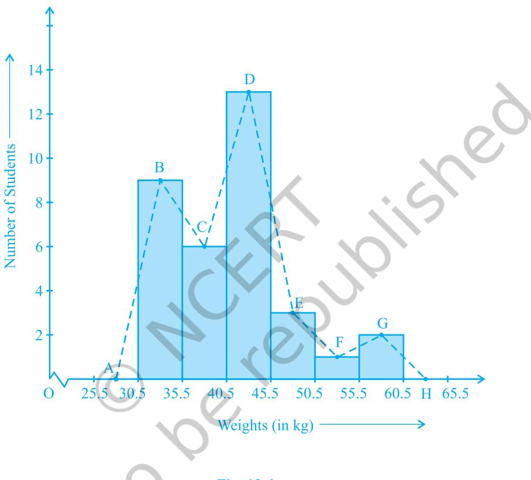
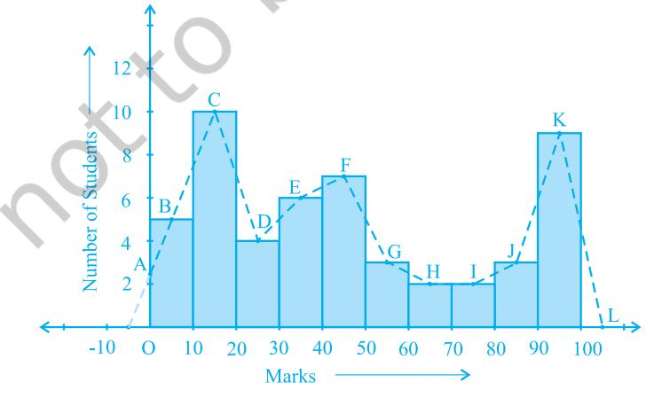
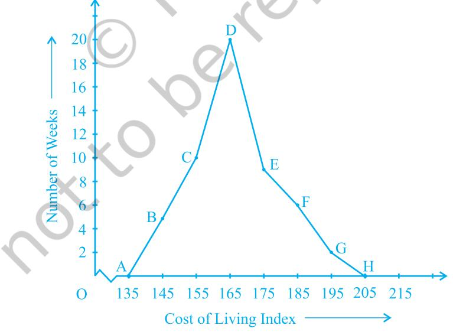

# **CHAPTER 12**

# **STATISTICS**

# **12.1 Graphical Representation of Data**

The representation of data by tables has already been discussed. Now let us turn our attention to another representation of data, i.e., the graphical representation. It is well said that one picture is better than a thousand words. Usually comparisons among the individual items are best shown by means of graphs. The representation then becomes easier to understand than the actual data. We shall study the following graphical representations in this section.

- (A) Bar graphs
- (B) Histograms of uniform width, and of varying widths
- (C) Frequency polygons

## **(A) Bar Graphs**

In earlier classes, you have already studied and constructed bar graphs. Here we shall discuss them through a more formal approach. Recall that a bar graph is a pictorial representation of data in which usually bars of uniform width are drawn with equal spacing between them on one axis (say, the *x*-axis), depicting the variable. The values of the variable are shown on the other axis (say, the *y*-axis) and the heights of the bars depend on the values of the variable.

**Example 1 :** In a particular section of Class IX, 40 students were asked about the months of their birth and the following graph was prepared for the data so obtained:

### **Fig. 12.1**

Observe the bar graph given above and answer the following questions:

- (i) How many students were born in the month of November?
- (ii) In which month were the maximum number of students born?

**Solution :** Note that the variable here is the 'month of birth', and the value of the variable is the 'Number of students born'.

(i) 4 students were born in the month of November.

(ii) The Maximum number of students were born in the month of August.

- Let us now recall how a bar graph is constructed by considering the following example.
**Example 2 :** A family with a monthly income of ` 20,000 had planned the following expenditures per month under various heads:

| Heads | Expenditure |
| --- | --- |
|  | (in thousand rupees) |
| Grocery | 4 |
| Rent | 5 |
| Education of children | 5 |
| Medicine | 2 |
| Fuel | 2 |
| Entertainment | 1 |
| Miscellaneous | 1 |

### **Table 12.1**

Draw a bar graph for the data above.

**Solution :** We draw the bar graph of this data in the following steps. Note that the unit in the second column is thousand rupees. So, '4' against 'grocery' means `4000.

- 1. We represent the Heads (variable) on the horizontal axis choosing any scale, since the width of the bar is not important. But for clarity, we take equal widths for all bars and maintain equal gaps in between. Let one Head be represented by one unit.
- 2. We represent the expenditure (value) on the vertical axis. Since the maximum expenditure is `5000, we can choose the scale as 1 unit = `1000.
- 3. To represent our first Head, i.e., grocery, we draw a rectangular bar with width 1 unit and height 4 units.
- 4. Similarly, other Heads are represented leaving a gap of 1 unit in between two consecutive bars.

The bar graph is drawn in Fig. 12.2.

Here, you can easily visualise the relative characteristics of the data at a glance, e.g., the expenditure on education is more than double that of medical expenses. Therefore, in some ways it serves as a better representation of data than the tabular form.

**Activity 1 :** Continuing with the same four groups of Activity 1, represent the data by suitable bar graphs.

Let us now see how a frequency distribution table for *continuous* class intervals can be represented graphically.

# **(B) Histogram**

This is a form of representation like the bar graph, but it is used for continuous class intervals. For instance, consider the frequency distribution Table 12.2, representing the weights of 36 students of a class:

| Weights (in kg) | Number of students |
| --- | --- |
| 30.5 - 35.5 | 9 |
| 35.5 - 40.5 | 6 |
| 40.5 - 45.5 | 15 |
| 45.5 - 50.5 | 3 |
| 50.5 - 55.5 | 1 |
| 55.5 - 60.5 | 2 |
| Total | 36 |

| Table 12.2 |
| --- |

Let us represent the data given above graphically as follows:

- (i) We represent the weights on the horizontal axis on a suitable scale. We can choose the scale as 1 cm = 5 kg. Also, since the first class interval is starting from 30.5 and not zero, we show it on the graph by marking a *kink* or a break on the axis.
- (ii) We represent the number of students (frequency) on the vertical axis on a suitable scale. Since the maximum frequency is 15, we need to choose the scale to accomodate this maximum frequency.
- (iii) We now draw rectangles (or rectangular bars) of width equal to the class-size and lengths according to the frequencies of the corresponding class intervals. For example, the rectangle for the class interval 30.5 - 35.5 will be of width 1 cm and length 4.5 cm.
- (iv) In this way, we obtain the graph as shown in Fig. 12.3:

Observe that since there are no gaps in between consecutive rectangles, the resultant graph appears like a solid figure. This is called a *histogram*, which is a graphical representation of a grouped frequency distribution with continuous classes. Also, unlike a bar graph, the width of the bar plays a significant role in its construction.

Here, in fact, areas of the rectangles erected are proportional to the corresponding frequencies. However, since the widths of the rectangles are all equal, the lengths of the rectangles are proportional to the frequencies. That is why, we draw the lengths according to (iii) above.

Now, consider a situation different from the one above.

**Example 3 :** A teacher wanted to analyse the performance of two sections of students in a mathematics test of 100 marks. Looking at their performances, she found that a few students got under 20 marks and a few got 70 marks or above. So she decided to group them into intervals of varying sizes as follows: 0 - 20, 20 - 30, . . ., 60 - 70, 70 - 100. Then she formed the following table:

| Marks | Number of students |
| --- | --- |
| 0 - 20 | 7 |
| 20 - 30 | 10 |
| 30 - 40 | 10 |
| 40 - 50 | 20 |
| 50 - 60 | 20 |
| 60 - 70 | 15 |
| 70 - above | 8 |
| Total | 90 |

### **Table 12.3**

A histogram for this table was prepared by a student as shown in Fig. 12.4.

Carefully examine this graphical representation. Do you think that it correctly represents the data? No, the graph is giving us a misleading picture. As we have mentioned earlier, the areas of the rectangles are proportional to the frequencies in a histogram. Earlier this problem did not arise, because the widths of all the rectangles were equal. But here, since the widths of the rectangles are varying, the histogram above does not

give a correct picture. For example, it shows a greater frequency in the interval 70 - 100, than in 60 - 70, which is not the case.

So, we need to make certain modifications in the lengths of the rectangles so that the areas are again proportional to the frequencies.

The steps to be followed are as given below:

- 1. Select a class interval with the minimum class size. In the example above, the minimum class-size is 10.
- 2. The lengths of the rectangles are then modified to be proportionate to the class-size 10.

For instance, when the class-size is 20, the length of the rectangle is 7. So when

the class-size is 10, the length of the rectangle will be 7 20 × 10 = 3.5.

Similarly, proceeding in this manner, we get the following table:

| Marks | Frequency | Width of the class |  | Length of the rectangle |
| --- | --- | --- | --- | --- |
| 0 - 20 | 7 | 20 | 7 × | 10 = 3.5 |
|  |  |  | 20 |  |
| 20 - 30 | 10 | 10 | 10 × | 10 = 10 |
|  |  |  | 10 |  |
| 30 - 40 | 10 | 10 | 10 × | 10 = 10 |
|  |  |  | 10 |  |
| 40 - 50 | 20 | 10 | 20 × | 10 = 20 |
|  |  |  | 10 |  |
| 50 - 60 | 20 | 10 | 20 × | 10 = 20 |
|  |  |  | 10 |  |
| 60 - 70 | 15 | 10 | 15 × | 10 = 15 |
|  |  |  | 10 |  |
| 70 - 100 | 8 | 30 | 8 × | 10 = 2.67 |
|  |  |  | 30 |  |

# **Table 12.4**

Since we have calculated these lengths for an interval of 10 marks in each case, we may call these lengths as "proportion of students per 10 marks interval".

So, the correct histogram with varying width is given in Fig. 12.5.

## **(C) Frequency Polygon**

There is yet another visual way of representing quantitative data and its frequencies. This is a polygon. To see what we mean, consider the histogram represented by Fig. 12.3. Let us join the mid-points of the upper sides of the adjacent rectangles of this histogram by means of line segments. Let us call these mid-points B, C, D, E, F and G. When joined by line segments, we obtain the figure BCDEFG (see Fig. 12.6). To complete the polygon, we assume that there is a class interval with frequency zero before 30.5 - 35.5, and one after 55.5 - 60.5, and their mid-points are A and H, respectively. ABCDEFGH is the frequency polygon corresponding to the data shown in Fig. 12.3. We have shown this in Fig. 12.6.

### **Fig. 12.6**

Although, there exists no class preceding the lowest class and no class succeeding the highest class, addition of the two class intervals with zero frequency enables us to make the area of the frequency polygon the same as the area of the histogram. Why is this so? (**Hint :** Use the properties of congruent triangles.)

Now, the question arises: how do we complete the polygon when there is no class preceding the first class? Let us consider such a situation.

**Example 4 :** Consider the marks, out of 100, obtained by 51 students of a class in a test, given in Table 12.5.

| Marks | Number of students |
| --- | --- |
| 0 - 10 | 5 |
| 10 - 20 | 10 |
| 20 - 30 | 4 |
| 30 - 40 | 6 |
| 40 - 50 | 7 |
| 50 - 60 | 3 |
| 60 - 70 | 2 |
| 70 - 80 | 2 |
| 80 - 90 | 3 |
| 90 - 100 | 9 |
| Total | 51 |

**Table 12.5**

Draw a frequency polygon corresponding to this frequency distribution table.

**Solution :** Let us first draw a histogram for this data and mark the mid-points of the tops of the rectangles as B, C, D, E, F, G, H, I, J, K, respectively. Here, the first class is 0-10. So, to find the class preceeding 0-10, we extend the horizontal axis in the negative direction and find the mid-point of the imaginary class-interval (–10) - 0. The first end point, i.e., B is joined to this mid-point with zero frequency on the negative direction of the horizontal axis. The point where this line segment meets the vertical axis is marked as A. Let L be the mid-point of the class succeeding the last class of the given data. Then OABCDEFGHIJKL is the frequency polygon, which is shown in Fig. 12.7.

**Fig. 12.7**

*Frequency polygons can also be drawn independently without drawing histograms.* For this, we require the mid-points of the class-intervals used in the data. These mid-points of the class-intervals are called **class-marks**.

To find the class-mark of a class interval, we find the sum of the upper limit and lower limit of a class and divide it by 2. Thus,

  
  
**Class-mark = Upper limit + Lower limit**

Let us consider an example.

**Example 5 :** In a city, the weekly observations made in a study on the cost of living index are given in the following table:

| Table 12.6 |  |
| --- | --- |
| Cost of living index | Number of weeks |
| 140 - 150 | 5 |
| 150 - 160 | 10 |
| 160 - 170 | 20 |
| 170 - 180 | 9 |
| 180 - 190 | 6 |
| 190 - 200 | 2 |
| Total | 52 |

Draw a frequency polygon for the data above (without constructing a histogram). **Solution :** Since we want to draw a frequency polygon without a histogram, let us find the class-marks of the classes given above, that is of 140 - 150, 150 - 160,.... For 140 - 150, the upper limit = 150, and the lower limit = 140

So, the class-mark = $\frac{150+140}{2}=\frac{290}{2}=145$.  
  

Continuing in the same manner, we find the class-marks of the other classes as well. So, the new table obtained is as shown in the following table:

### **Table 12.7**

| Classes | Class-marks | Frequency |
| --- | --- | --- |
| 140 - 150 | 145 | 5 |
| 150 - 160 | 155 | 10 |
| 160 - 170 | 165 | 20 |
| 170 - 180 | 175 | 9 |
| 180 - 190 | 185 | 6 |
| 190 - 200 | 195 | 2 |
| Total |  | 52 |

We can now draw a frequency polygon by plotting the class-marks along the horizontal axis, the frequencies along the vertical-axis, and then plotting and joining the points B(145, 5), C(155, 10), D(165, 20), E(175, 9), F(185, 6) and G(195, 2) by line segments. We should not forget to plot the point corresponding to the class-mark of the class 130 - 140 (just before the lowest class 140 - 150) with zero frequency, that is, A(135, 0), and the point H (205, 0) occurs immediately after G(195, 2). So, the resultant frequency polygon will be ABCDEFGH (see Fig. 12.8).

**Fig. 12.8**

Frequency polygons are used when the data is continuous and very large. It is very useful for comparing two different sets of data of the same nature, for example, comparing the performance of two different sections of the same class.

# **EXERCISE 12.1**

- **1.** A survey conducted by an organisation for the cause of illness and death among the women between the ages 15 - 44 (in years) worldwide, found the following figures (in %):

| S.No. | Causes | Female fatality rate (%) |
| --- | --- | --- |
| 1. | Reproductive health conditions | 31.8 |
| 2. | Neuropsychiatric conditions | 25.4 |
| 3. | Injuries | 12.4 |
| 4. | Cardiovascular conditions | 4.3 |
| 5. | Respiratory conditions | 4.1 |
| 6. | Other causes | 22.0 |

(i) Represent the information given above graphically.

- (ii) Which condition is the major cause of women's ill health and death worldwide?
- (iii) Try to find out, with the help of your teacher, any two factors which play a major role in the cause in (ii) above being the major cause.
- **2.** The following data on the number of girls (to the nearest ten) per thousand boys in different sections of Indian society is given below.

| Section | Number of girls per thousand boys |
| --- | --- |
| Scheduled Caste (SC) | 940 |
| Scheduled Tribe (ST) | 970 |
| Non SC/ST | 920 |
| Backward districts | 950 |
| Non-backward districts | 920 |
| Rural | 930 |
| Urban | 910 |

- (i) Represent the information above by a bar graph.
- (ii) In the classroom discuss what conclusions can be arrived at from the graph.
- **3.** Given below are the seats won by different political parties in the polling outcome of a state assembly elections:

| Political Party | A | B | C | D | E | F |
| --- | --- | --- | --- | --- | --- | --- |
| Seats Won | 75 | 55 | 37 | 29 | 10 | 37 |

- (i) Draw a bar graph to represent the polling results.
- (ii) Which political party won the maximum number of seats?
- **4.** The length of 40 leaves of a plant are measured correct to one millimetre, and the obtained data is represented in the following table:

| Length (in mm) | Number of leaves |
| --- | --- |
| 118 - 126 | 3 |
| 127 - 135 | 5 |
| 136 - 144 | 9 |
| 145 - 153 | 12 |
| 154 - 162 | 5 |
| 163 - 171 | 4 |
| 172 - 180 | 2 |

- (i) Draw a histogram to represent the given data. [Hint: First make the class intervals continuous]
- (ii) Is there any other suitable graphical representation for the same data?
- (iii) Is it correct to conclude that the maximum number of leaves are 153 mm long? Why?
- **5.** The following table gives the life times of 400 neon lamps:

| Life time (in hours) | Number of lamps |
| --- | --- |
| 300 - 400 | 14 |
| 400 - 500 | 56 |
| 500 - 600 | 60 |
| 600 - 700 | 86 |
| 700 - 800 | 74 |
| 800 - 900 | 62 |
| 900 - 1000 | 48 |

- (i) Represent the given information with the help of a histogram.
- (ii) How many lamps have a life time of more than 700 hours?
- **6.** The following table gives the distribution of students of two sections according to the marks obtained by them:

| Section A |  | Section B |  |
| --- | --- | --- | --- |
| Marks | Frequency | Marks | Frequency |
| 0 - 10 | 3 | 0 - 10 | 5 |
| 10 - 20 | 9 | 10 - 20 | 19 |
| 20 - 30 | 17 | 20 - 30 | 15 |
| 30 - 40 | 12 | 30 - 40 | 10 |
| 40 - 50 | 9 | 40 - 50 | 1 |

Represent the marks of the students of both the sections on the same graph by two frequency polygons. From the two polygons compare the performance of the two sections.

- **7.** The runs scored by two teams A and B on the first 60 balls in a cricket match are given below:

| Number of balls | Team A | Team B |
| --- | --- | --- |
| 1 - 6 | 2 | 5 |
| 7 - 12 | 1 | 6 |
| 13 - 18 | 8 | 2 |
| 19 - 24 | 9 | 10 |
| 25 - 30 | 4 | 5 |
| 31 - 36 | 5 | 6 |
| 37 - 42 | 6 | 3 |
| 43 - 48 | 10 | 4 |
| 49 - 54 | 6 | 8 |
| 55 - 60 | 2 | 10 |

Represent the data of both the teams on the same graph by frequency polygons. [**Hint :** First make the class intervals continuous.]

- **8.** A random survey of the number of children of various age groups playing in a park was found as follows:

| Age (in years) | Number of children |
| --- | --- |
| 1 - 2 | 5 |
| 2 - 3 | 3 |
| 3 - 5 | 6 |
| 5 - 7 | 12 |
| 7 - 10 | 9 |
| 10 - 15 | 10 |
| 15 - 17 | 4 |

Draw a histogram to represent the data above.

- **9.** 100 surnames were randomly picked up from a local telephone directory and a frequency distribution of the number of letters in the English alphabet in the surnames was found as follows:

| Number of letters | Number of surnames |
| --- | --- |
| 1 - 4 | 6 |
| 4 - 6 | 30 |
| 6 - 8 | 44 |
| 8 - 12 | 16 |
| 12 - 20 | 4 |

- (i) Draw a histogram to depict the given information.
- (ii) Write the class interval in which the maximum number of surnames lie.

### **12.2 Summary**

In this chapter, you have studied the following points:

- **1.** How data can be presented graphically in the form of bar graphs, histograms and frequency polygons.
