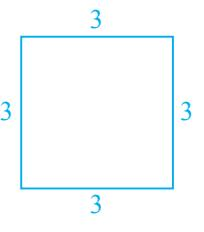
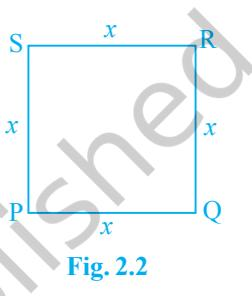
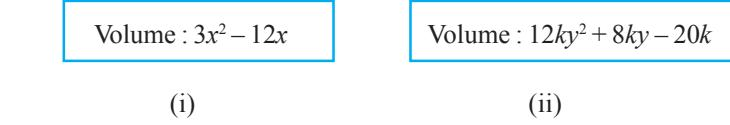

## **2.1 Introduction**

You have studied algebraic expressions, their addition, subtraction, multiplication and division in earlier classes. You also have studied how to factorise some algebraic expressions. You may recall the algebraic identities :

(*x* + *y*) 2 = *x* 2 + 2*xy* + *y* 2 (*x* – *y*) 2 = *x* 2 – 2*xy* + *y* 2 and *x* 2 – *y* 2 = (*x* + *y*) (*x* – *y*)

and their use in factorisation. In this chapter, we shall start our study with a particular type of algebraic expression, called *polynomial,* and the terminology related to it. We shall also study the *Remainder Theorem* and *Factor Theorem* and their use in the factorisation of polynomials. In addition to the above, we shall study some more algebraic identities and their use in factorisation and in evaluating some given expressions.

## **2.2 Polynomials in One Variable**

Let us begin by recalling that a variable is denoted by a symbol that can take any real

value. We use the letters *x*, *y*, *z*, etc. to denote variables. Notice that 2*x*, 3*x*, – *x*, – 1 2 *x*

are algebraic expressions. All these expressions are of the form (a constant) × *x*. Now suppose we want to write an expression which is (a constant) × (a variable) and we do not know what the constant is. In such cases, we write the constant as *a*, *b, c,* etc. So the expression will be *ax*, say.

However, there is a difference between a letter denoting a constant and a letter denoting a variable. The values of the constants remain the same throughout a particular situation, that is, the values of the constants do not change in a given problem, but the value of a variable can keep changing.

Now, consider a square of side 3 units (see Fig. 2.1). What is its perimeter? You know that the perimeter of a square is the sum of the lengths of its four sides. Here, each side is 3 units. So, its perimeter is 4 × 3, i.e., 12 units. What will be the perimeter if each side of the square is 10 units? The perimeter is 4 × 10, i.e., 40 units. In case the length of each side is *x* units (see Fig. 2.2), the perimeter is given by 4*x* units. So, as the length of the side varies, the perimeter varies.

Can you find the area of the square PQRS? It is *x* × *x* = *x* 2 square units. *x* 2 is an algebraic expression. You are also familiar with other algebraic expressions like 2*x*, *x* 2 + 2*x*, *x* 3 – *x* 2 + 4*x* + 7. Note that, all the algebraic expressions we have considered so far have only whole numbers as the exponents of the variable. Expressions of this form are called *polynomials in one variable*. In the examples above, the variable is *x*. For instance, *x* 3 – *x* 2 + 4*x* + 7 is a polynomial in *x*. Similarly, 3*y* 2 + 5*y* is a polynomial in the variable *y* and *t* 2 + 4 is a polynomial in the variable *t*.

In the polynomial *x* 2 + 2*x*, the expressions *x* 2 and 2*x* are called the **terms** of the polynomial. Similarly, the polynomial 3*y* 2 + 5*y* + 7 has three terms, namely, 3*y* 2 , 5*y* and 7. Can you write the terms of the polynomial –*x* 3 + 4*x* 2 + 7*x* – 2 ? This polynomial has 4 terms, namely, –*x* 3 , 4*x* 2 , 7*x* and –2.

Each term of a polynomial has a **coefficient**. So, in –*x* 3 + 4*x* 2 + 7*x* – 2, the coefficient of *x* 3 is –1, the coefficient of *x* 2 is 4, the coefficient of *x* is 7 and –2 is the coefficient of *x* 0 (Remember, *x* 0 = 1). Do you know the coefficient of *x* in *x* 2 – *x* + 7? It is –1.

2 is also a polynomial. In fact, 2, –5, 7, etc. are examples of *constant polynomials*. The constant polynomial 0 is called the **zero polynomial**. This plays a very important role in the collection of all polynomials, as you will see in the higher classes.

Now, consider algebraic expressions such as *x* + 2 3 1 , *x y y* + + 3 and . *x* Do you know that you can write *x* + 1 *x* = *x* + *x* –1? Here, the exponent of the second term, i.e.,

*x* –1 is –1, which is not a whole number. So, this algebraic expression is not a polynomial.

Again, *x* + 3 can be written as 1 2 *x* + 3 . Here the exponent of *x* is 1 2 , which is not a whole number. So, is *x* + 3 a polynomial? No, it is not. What about 3 *y* + *y* 2? It is also not a polynomial (Why?).

If the variable in a polynomial is *x*, we may denote the polynomial by *p*(*x*), or *q*(*x*), or *r*(*x*), etc. So, for example, we may write :

$$\begin{array}{l}{{p(x)=2x^{2}+5x-3}}\\ {{q(x)=x^{3}-1}}\\ {{r(y)=y^{3}+y+1}}\\ {{s(u)=2-u-u^{2}+6u}}\end{array}$$

5

A polynomial can have any (finite) number of terms. For instance, *x* 150 + *x* 149 + ... + *x* 2 + *x* + 1 is a polynomial with 151 terms.

Consider the polynomials 2*x*, 2, 5*x* 3 , –5*x* 2 , *y* and *u* 4 . Do you see that each of these polynomials has only one term? Polynomials having only one term are called *monomials* ('mono' means 'one').

Now observe each of the following polynomials:

$p(x)=x+1$, $q(x)=x^{2}-x$, $\gamma(y)^{2}=y^{2}+1$, $\gamma(w)^{2}=y^{2}$.  
  

How many terms are there in each of these? Each of these polynomials has only two terms. Polynomials having only two terms are called *binomials* ('bi' means 'two').

Similarly, polynomials having only three terms are called *trinomials* ('tri' means 'three'). Some examples of trinomials are

$p(x)=x+x^{2}+\pi$,  
  
$r(u)=\quad u+u^{2}-2$,  
  
$\left(\begin{array}{c}q(x)=\sqrt{2}\ +x-x^{2},\\ 4(y)=y^{4}+y+5.\end{array}\right.$

Now, look at the polynomial *p*(*x*) = 3*x* 7 – 4*x* 6 + *x* + 9. What is the term with the highest power of *x* ? It is 3*x* 7 . The exponent of *x* in this term is 7. Similarly, in the polynomial *q*(*y*) = 5*y* 6 – 4*y* 2 – 6, the term with the highest power of *y* is 5*y* 6 and the exponent of *y* in this term is 6. We call the highest power of the variable in a polynomial as the *degree of the polynomial*. So, the degree of the polynomial 3*x* 7 – 4*x* 6 + *x* + 9 is 7 and the degree of the polynomial 5*y* 6 – 4*y* 2 – 6 is 6. **The degree of a non-zero constant polynomial is zero**.

**Example 1 :** Find the degree of each of the polynomials given below:

(i) $\bar{x}^{5}-x^{4}+3$ (ii) $2-y^{2}-y^{3}+2y^{8}$ (iii) $2$

**Solution :** (i) The highest power of the variable is 5. So, the degree of the polynomial is 5.

- (ii) The highest power of the variable is 8. So, the degree of the polynomial is 8.
- (iii)The only term here is 2 which can be written as 2*x* 0 . So the exponent of *x* is 0. Therefore, the degree of the polynomial is 0.

Now observe the polynomials *p*(*x*) = 4*x* + 5, *q*(*y*) = 2*y*, *r*(*t*) = *t* + 2 and *s*(*u*) = 3 – *u*. Do you see anything common among all of them? The degree of each of these polynomials is one. A polynomial of degree one is called a *linear polynomial*. Some more linear polynomials in one variable are 2*x* – 1, 2 *y* + 1, 2 – *u*. Now, try and find a linear polynomial in *x* with 3 terms? You would not be able to find it because a linear polynomial in *x* can have at most two terms. So, any linear polynomial in *x* will be of the form *ax* + *b*, where *a* and *b* are constants and *a* ≠ 0 (why?). Similarly, *ay* + *b* is a linear polynomial in *y*.

Now consider the polynomials :

$2x^{2}+5$, $5x^{2}+3x+\pi$, $x^{2}$ and $x^{2}+\frac{2}{5}x^{2}$

Do you agree that they are all of degree two? A polynomial of degree two is called a *quadratic polynomial.* Some examples of a quadratic polynomial are 5 – *y* 2 , 4*y* + 5*y* 2 and 6 – *y* – *y* 2 . Can you write a quadratic polynomial in one variable with four different terms? You will find that a quadratic polynomial in one variable will have at most 3 terms. If you list a few more quadratic polynomials, you will find that any quadratic polynomial in *x* is of the form *ax*2 + *bx* + *c*, where *a* ≠ 0 and *a*, *b*, *c* are constants. Similarly, quadratic polynomial in *y* will be of the form *ay*2 + *by* + *c*, provided *a* ≠ 0 and *a*, *b*, *c* are constants.

We call a polynomial of degree three a *cubic polynomial*. Some examples of a cubic polynomial in *x* are 4*x* 3 , 2*x* 3 + 1, 5*x* 3 + *x* 2 , 6*x* 3 – *x*, 6 – *x* 3 , 2*x* 3 + 4*x* 2 + 6*x* + 7. How many terms do you think a cubic polynomial in one variable can have? It can have at most 4 terms. These may be written in the form *ax*3 + *bx*2 + *cx* + *d*, where *a* ≠ 0 and *a*, *b*, *c* and *d* are constants.

Now, that you have seen what a polynomial of degree 1, degree 2, or degree 3 looks like, can you write down a polynomial in one variable of degree *n* for any natural number *n*? A polynomial in one variable *x* of degree *n* is an expression of the form

$$a_{n}x^{n}+a_{n-1}x^{n-1}+\,.\,.\,.\,+\,a_{1}x+a_{0}$$

where *a*0 , *a*1 , *a*2 , . . ., *an* are constants and *an* ≠ 0.

In particular, if *a*0 = *a*1 = *a*2 = *a*3 = . . . = *an* = 0 (all the constants are zero), we get the **zero polynomial**, which is denoted by 0. What is the degree of the zero polynomial? The degree of the zero polynomial is *not defined*.

So far we have dealt with polynomials in one variable only. We can also have polynomials in more than one variable. For example, *x* 2 + *y* 2 + *xyz* (where variables are *x*, *y* and *z*) is a polynomial in three variables. Similarly *p* 2 + *q* 10 + *r* (where the variables are *p*, *q* and *r*), *u* 3 + *v* 2 (where the variables are *u* and *v*) are polynomials in three and two variables, respectively. You will be studying such polynomials in detail later.

## **EXERCISE 2.1**

- **1.** Which of the following expressions are polynomials in one variable and which are not? State reasons for your answer.
	- (i) 4*x* 2 – 3*x* + 7 (ii) *y* 2 + 2 (iii) 3 2 *t t* + (iv) *y* + 2 *y*
	- (v) *x* 10 + *y* 3 + *t* 50
- **2.** Write the coefficients of *x* 2 in each of the following:

(i) 2 + *x* 2 + *x* (ii) 2 – *x* 2 + *x* 3 (iii) 2 2 *x x* π + (iv) 2 1 *x* −

2

**3.** Give one example each of a binomial of degree 35, and of a monomial of degree 100.

- **4.** Write the degree of each of the following polynomials:
	- (i) 5*x* 3 + 4*x* 2 + 7*x* (ii) 4 – *y*

(iii) $5t-\sqrt{7}$ (iv)$3$

- **5.** Classify the following as linear, quadratic and cubic polynomials:
	- (i) *x* 2 + *x* (ii) *x* – *x* 3 (iii) *y* + *y* 2 + 4 (iv) 1 + *x* (v) 3*t* (vi) *r* 2 (vii) 7*x* 3

## **2.3 Zeroes of a Polynomial**

Consider the polynomial *p*(*x*) = 5*x* 3 – 2*x* 2 + 3*x* – 2. If we replace *x* by 1 everywhere in *p*(*x*), we get *p*(1) = 5 × (1)3 – 2 × (1)2 + 3 × (1) – 2 = 5 – 2 + 3 –2 = 4

So, we say that the value of *p*(*x*) at *x* = 1 is 4. Similarly, *p*(0) = 5(0)3 – 2(0)2 + 3(0) –2 = –2

Can you find *p*(–1)?

**Example 2 :** Find the value of each of the following polynomials at the indicated value of variables:

- (i) *p*(*x*) = 5*x* 2 – 3*x* + 7 at *x* = 1.
- (ii) *q*(*y*) = 3*y* 3 – 4*y* + 11 at *y* = 2.
- (iii) *p*(*t*) = 4*t* 4 + 5*t* 3 – *t* 2 + 6 at *t* = *a*.

**Solution :** (i) *p*(*x*) = 5*x* 2 – 3*x* + 7

The value of the polynomial *p*(*x*) at *x* = 1 is given by

$$\begin{array}{r l}{p(1)=5(1)^{2}-3(1)+7}\\ {=5-3+7=9}\end{array}$$

(ii) *q*(*y*) = 3*y* 3 – 4*y* + 11

The value of the polynomial *q*(*y*) at *y* = 2 is given by

$q(2)=3(2)^{3}-4(2)+\sqrt{11}=24-8+\sqrt{11}=16+\sqrt{11}$

(iii) *p*(*t*) = 4*t* 4 + 5*t* 3 – *t* 2 + 6

The value of the polynomial *p*(*t*) at *t* = *a* is given by

$$p(a)=4a^{4}+5a^{3}-a^{2}+6$$

Now, consider the polynomial *p*(*x*) = *x* – 1.

What is *p*(1)? Note that : *p*(1) = 1 – 1 = 0.

As *p*(1) = 0, we say that 1 is a *zero* of the polynomial *p*(*x*).

Similarly, you can check that 2 is a *zero* of *q*(*x*), where *q*(*x*) = *x* – 2.

In general, we say that a *zero* of a polynomial *p*(*x*) is a number *c* such that *p*(*c*) = 0.

You must have observed that the zero of the polynomial *x* – 1 is obtained by equating it to 0, i.e., *x* – 1 = 0, which gives *x* = 1. We say *p*(*x*) = 0 is a polynomial equation and 1 is the *root of the polynomial* equation *p*(*x*) = 0. So we say 1 is the zero of the polynomial *x* – 1, or a *root* of the polynomial equation *x* – 1 = 0.

Now, consider the constant polynomial 5. Can you tell what its zero is? It has no zero because replacing *x* by any number in 5*x* 0 still gives us 5. In fact, *a non-zero constant polynomial has no zero*. What about the zeroes of the zero polynomial? By convention, *every real number is a zero of the zero polynomial*.

**Example 3 :** Check whether –2 and 2 are zeroes of the polynomial *x* + 2.

**Solution :** Let *p*(*x*) = *x* + 2.

Then *p*(2) = 2 + 2 = 4, *p*(–2) = –2 + 2 = 0

Therefore, –2 is a zero of the polynomial *x* + 2, but 2 is not.

**Example 4 :** Find a zero of the polynomial *p*(*x*) = 2*x* + 1.

**Solution :** Finding a zero of *p*(*x*), is the same as solving the equation

$$p(x)=0$$

Now,  
  

$$2x+1=0\ \mbox{gives us}\ x=-\frac{1}{2}$$

So, 1 – 2 is a zero of the polynomial 2*x* + 1.

Now, if *p*(*x*) = *ax* + *b*, *a* ≠ 0, is a linear polynomial, how can we find a zero of *p*(*x*)? Example 4 may have given you some idea. Finding a zero of the polynomial *p*(*x*), amounts to solving the polynomial equation *p*(*x*) = 0.

Now, $p(x)=0$ means $ax+b=0$, $a\neq0$  
  
So, $ax=-b$  
  
i.e., $x=-\frac{b}{a}$

So, *x* = *b a* − is the only zero of *p*(*x*), i.e., a *linear polynomial has one and only one zero*. Now we can say that 1 is *the* zero of *x* – 1, and –2 is *the* zero of *x* + 2.

**Example 5 :** Verify whether 2 and 0 are zeroes of the polynomial *x* 2 – 2*x*.

- **Solution :** Let *p*(*x*) = *x* 2 – 2*x* Then *p*(2) = 2 2 – 4 = 4 – 4 = 0 and *p*(0) = 0 – 0 = 0
Hence, 2 and 0 are both zeroes of the polynomial *x* 2 – 2*x*.

Let us now list our observations:

- (i) A zero of a polynomial need not be 0.
- (ii) 0 may be a zero of a polynomial.
- (iii) Every linear polynomial has one and only one zero.
- (iv) A polynomial can have more than one zero.

## **EXERCISE 2.2**

- **1.** Find the value of the polynomial 5*x* 4*x* 2 + 3 at (i) *x* = 0 (ii) *x* = –1 (iii) *x* = 2
- **2.** Find *p*(0), *p*(1) and *p*(2) for each of the following polynomials:
	- (i) *p*(*y*) = *y* 2 – *y* + 1 (ii) *p*(*t*) = 2 + *t* + 2*t* 2 – *t* 3
	- (iii) *p*(*x*) = *x* 3 (iv) *p*(*x*) = (*x* – 1) (*x* + 1)
- **3.** Verify whether the following are zeroes of the polynomial, indicated against them.
- (i) *p*(*x*) = 3*x* + 1, *x* = 1 – 3 (ii) *p*(*x*) = 5*x* – π, *x* = 4 5 (iii) *p*(*x*) = *x* 2 – 1, *x* = 1, –1 (iv) *p*(*x*) = (*x* + 1) (*x* – 2), *x* = – 1, 2 (v) *p*(*x*) = *x* 2 , *x* = 0 (vi) *p*(*x*) = *lx* + *m*, *x* = – *m l* (vii) *p*(*x*) = 3*x* 2 – 1, *x* = 1 2 , 3 3 − (viii) *p*(*x*) = 2*x* + 1, *x* = 1 2 **4.** Find the zero of the polynomial in each of the following cases: (i) *p*(*x*) = *x* + 5 (ii) *p*(*x*) = *x* – 5 (iii) *p*(*x*) = 2*x* + 5 (iv) *p*(*x*) = 3*x* – 2 (v) *p*(*x*) = 3*x* (vi) *p*(*x*) = *ax*, *a* ≠ 0

(vii) *p*(*x*) = *cx* + *d*, *c* ≠ 0, *c*, *d* are real numbers.

## **2.4 Factorisation of Polynomials**

Let us now look at the situation of Example 10 above more closely. It tells us that since the remainder, 1 2 *q* − = 0, (2*t* + 1) is a factor of *q*(*t*), i.e., *q*(*t*) = (2*t* + 1) *g*(*t*) for some polynomial *g*(*t*). This is a particular case of the following theorem.

**Factor Theorem :** If *p*(*x*) is a polynomial of degree *n* > 1 and *a* is any real number, then (i) *x* – *a* is a factor of *p*(*x*), if *p*(*a*) = 0, and (ii) *p*(*a*) = 0, if *x* – *a* is a factor of *p*(*x*). Proof: By the Remainder Theorem, *p*(*x*)=(*x* – *a*) *q*(*x*) + *p*(*a*).

- (i) If *p*(*a*) = 0, then *p*(*x*) = (*x* – *a*) *q*(*x*), which shows that *x* – *a* is a factor of *p*(*x*).
- (ii) Since *x a* is a factor of *p*(*x*), *p*(*x*) = (*x a*) *g*(*x*) for same polynomial *g*(*x*). In this case, *p*(*a*) = (*a* – *a*) *g*(*a*) = 0.

**Example 6 :** Examine whether *x* + 2 is a factor of *x* 3 + 3*x* 2 + 5*x* + 6 and of 2*x* + 4. **Solution :** The zero of *x* + 2 is –2. Let *p*(*x*) = *x* 3 + 3*x* 2 + 5*x* + 6 and *s*(*x*) = 2*x* + 4 Then, *p*(–2) = (–2)3 + 3(–2)2 + 5(–2) + 6

$$=-8+12-10+6$$
  

$$=0$$

So, by the Factor Theorem, *x* + 2 is a factor of *x* 3 + 3*x* 2 + 5*x* + 6.

Again, *s*(–2) = 2(–2) + 4 = 0

So, *x* + 2 is a factor of 2*x* + 4. In fact, you can check this without applying the Factor Theorem, since 2*x* + 4 = 2(*x* + 2).

**Example 7 :** Find the value of *k*, if *x* – 1 is a factor of 4*x* 3 + 3*x* 2 – 4*x* + *k*. **Solution :** As *x* – 1 is a factor of *p*(*x*) = 4*x* 3 + 3*x* 2 – 4*x* + *k*, *p*(1) = 0 Now, *p*(1) = 4(1)3 + 3(1)2 – 4(1) + *k* So, 4 + 3 – 4 + *k* = 0

i.e., *k* = –3

We will now use the Factor Theorem to factorise some polynomials of degree 2 and 3. You are already familiar with the factorisation of a quadratic polynomial like *x* 2 + *lx* + *m*. You had factorised it by splitting the middle term *lx* as *ax* + *bx* so that *ab* = *m.* Then *x* 2 + *lx* + *m* = (*x* + *a*) (*x* + *b*). We shall now try to factorise quadratic polynomials of the type *ax*2 + *bx* + *c*, where *a* ≠ 0 and *a*, *b*, *c* are constants.

Factorisation of the polynomial *ax*2 + *bx* + *c* **by splitting the middle term** is as follows: 2 3*x*

Let its factors be (*px* + *q*) and (*rx* + *s*). Then *ax*2 + *bx* + *c* = (*px* + *q*) (*rx* + *s*) = *pr x*2 + (*ps* + *qr*) *x* + *qs x =* 3*x* = first term of quotient

Comparing the coefficients of *x* 2 , we get *a* = *pr*.

Similarly, comparing the coefficients of *x*, we get *b* = *ps* + *qr*.

And, on comparing the constant terms, we get *c* = *qs*.

This shows us that *b* is the sum of two numbers *ps* and *qr*, whose product is (*ps*)(*qr*) = (*pr*)(*qs*) = *ac*.

Therefore, to factorise *ax*2 + *bx* + *c*, we have to write *b* as the sum of two numbers whose product is *ac*. This will be clear from Example 13.

**Example 8 :** Factorise 6*x* 2 + 17*x* + 5 by splitting the middle term, and by using the Factor Theorem.

**Solution 1 :** (By splitting method) **:** If we can find two numbers *p* and *q* such that *p* + *q* = 17 and *pq* = 6 × 5 = 30, then we can get the factors.

So, let us look for the pairs of factors of 30. Some are 1 and 30, 2 and 15, 3 and 10, 5 and 6. Of these pairs, 2 and 15 will give us *p* + *q* = 17.

So, $6x^{2}+17x+5=6x^{2}+(2+15)x+5$  
  

$$=6x^{2}+2x+15x+5$$
 
$$=2x(3x+1)+5(3x+1)$$
 
$$=(3x+1)\,(2x+5)$$

**Solution 2 :** (Using the Factor Theorem)

6*x* 2 + 17*x* + 5 = 2 17 5 6 6 6 *x x* + + = 6 *p*(*x*), say. If *a* and *b* are the zeroes of *p*(*x*), then 6*x* 2 + 17*x* + 5 = 6(*x* – *a*) (*x* – *b*). So, *ab* = 5 . 6 Let us look at some possibilities for *a* and *b*. They could be 1 1 5 5 , , , , 1 2 3 3 2 ± ± ± ± ± . Now, 1 1 17 1 5 2 4 6 2 6 *p* = + + ≠ 0. But 1 3 *p* − = 0. So, 1 3 *x* + is a factor of *p*(*x*). Similarly, by trial, you can find that 5 2 *x* + is a factor of *p*(*x*). Therefore, 6*x* 2 + 17*x* + 5 = 6 1 5 3 2 *x x* + + 3 1 2 5 6 *x x* + +

For the example above, the use of the splitting method appears more efficient. However, let us consider another example.

3 2

= (3*x* + 1) (2*x* + 5)

=

**Example 9 :** Factorise *y* 2 – 5*y* + 6 by using the Factor Theorem.

**Solution :** Let *p*(*y*) = *y* 2 – 5*y* + 6. Now, if *p*(*y*) = (*y* – *a*) (*y* – *b*), you know that the constant term will be *ab*. So, *ab* = 6. So, to look for the factors of *p*(*y*), we look at the factors of 6.

The factors of 6 are 1, 2 and 3.

Now, *p*(2) = 22 – (5 × 2) + 6 = 0

So, *y* – 2 is a factor of *p*(*y*).

Also, *p*(3) = 32 – (5 × 3) + 6 = 0

So, *y* – 3 is also a factor of *y* 2 – 5*y* + 6.

Therefore, *y* 2 – 5*y* + 6 = (*y* – 2)(*y* – 3)

Note that *y* 2 – 5*y* + 6 can also be factorised by splitting the middle term –5*y*.

Now, let us consider factorising cubic polynomials. Here, the splitting method will not be appropriate to start with. We need to find at least one factor first, as you will see in the following example.

**Example 10 :** Factorise *x* 3 – 23*x* 2 + 142*x* – 120. **Solution :** Let *p*(*x*) = *x* 3 – 23*x* 2 + 142*x* – 120

We shall now look for all the factors of –120. Some of these are ±1, ±2, ±3,

±4, ±5, ±6, ±8, ±10, ±12, ±15, ±20, ±24, ±30, ±60.

By trial, we find that *p*(1) = 0. So *x* – 1 is a factor of *p*(*x*). Now we see that *x* 3 – 23*x* 2 + 142*x* – 120 = *x* 3 – *x* 2 – 22*x* 2 + 22*x* + 120*x* – 120 = *x* 2 (*x* –1) – 22*x*(*x* – 1) + 120(*x* – 1) (Why?) = (*x* – 1) (*x* 2 – 22*x* + 120) [Taking (*x* – 1) common]

We could have also got this by dividing *p*(*x*) by *x* – 1.

Now *x* 2 – 22*x* + 120 can be factorised either by splitting the middle term or by using the Factor theorem. By splitting the middle term, we have:

*x* 2 – 22*x* + 120 = *x* 2 – 12*x* – 10*x* + 120 = *x*(*x* – 12) – 10(*x* – 12) = (*x* – 12) (*x* – 10) 3 – 23*x* 2 – 142*x* – 120 = (*x* – 1)(*x* – 10)(*x* – 12)

So, *x*

## **EXERCISE 2.3**

- **1.** Determine which of the following polynomials has (*x* + 1) a factor :
$\begin{array}{ll}\mbox{(ii)}&x^{4}+x^{3}+x^{2}+x+1\\ \mbox{(iii)}&x^{4}+3x^{3}+3x^{2}+x+1\end{array}$ (ii) $x^{4}+x^{3}+x^{2}+x+1$ (iv) $x^{3}-x^{2}-\left(2+\sqrt{2}\,\right)x+\sqrt{2}$

- **2.** Use the Factor Theorem to determine whether *g*(*x*) is a factor of *p*(*x*) in each of the following cases:
	- (i) *p*(*x*) = 2*x* 3 + *x* 2 – 2*x* – 1, *g*(*x*) = *x* + 1
- (ii) *p*(*x*) = *x* 3 + 3*x* 2 + 3*x* + 1, *g*(*x*) = *x* + 2 (iii) *p*(*x*) = *x* 3 – 4*x* 2 + *x* + 6, *g*(*x*) = *x* – 3 **3.** Find the value of *k*, if *x* – 1 is a factor of *p*(*x*) in each of the following cases: (i) *p*(*x*) = *x* 2 + *x* + *k* (ii) *p*(*x*) = 2*x* 2 + *kx* + 2 (iii) *p*(*x*) = *kx*2 – 2 *x* + 1 (iv) *p*(*x*) = *kx*2 – 3*x* + *k* **4.** Factorise : (i) 12*x* 2 – 7*x* + 1 (ii) 2*x* 2 + 7*x* + 3 (iii) 6*x* 2 + 5*x* – 6 (iv) 3*x* 2 – *x* – 4 **5.** Factorise : (i) *x* 3 – 2*x* 2 – *x* + 2 (ii) *x* 3 – 3*x* 2 – 9*x* – 5
	- (iii) *x* 3 + 13*x* 2 + 32*x* + 20 (iv) 2*y*

## **2.5 Algebraic Identities**

From your earlier classes, you may recall that an algebraic identity is an algebraic equation that is true for all values of the variables occurring in it. You have studied the following algebraic identities in earlier classes:

3 + *y* 2 – 2*y* – 1

**Identity I :** (*x* + *y*) 2 = *x* 2 + 2*xy* + *y* 2 **Identity II :** (*x* – *y*) 2 = *x* 2 – 2*xy* + *y* 2 **Identity III :** *x* 2 – *y* 2 = (*x* + *y*) (*x* – *y*) **Identity IV :** (*x* + *a*) (*x* + *b*) = *x* 2 + (*a* + *b*)*x* + *ab*

You must have also used some of these algebraic identities to factorise the algebraic expressions. You can also see their utility in computations.

**Example 11 :** Find the following products using appropriate identities:

(i) (*x* + 3) (*x* + 3) (ii) (*x* – 3) (*x* + 5)

**Solution :** (i) Here we can use Identity I : (*x* + *y*) 2 = *x* 2 + 2*xy* + *y* 2 . Putting *y* = 3 in it, we get

$(x+3)\,(x+3)=(x+3)^{2}=x^{2}+2(x)(3)+(3)^{2}$  
  
$=x^{2}+6x+9$

(ii) Using Identity IV above, i.e., (*x* + *a*) (*x* + *b*) = *x* 2 + (*a* + *b*)*x* + *ab*, we have (*x* – 3) (*x* + 5) = *x* 2 + (–3 + 5)*x* + (–3)(5)

$$=x^{2}+2x-15$$

**Example 12 :** Evaluate 105 × 106 without multiplying directly.

**Solution :** 105 × 106 = (100 + 5) × (100 + 6) = (100)2 + (5 + 6) (100) + (5 × 6), using Identity IV = 10000 + 1100 + 30 = 11130

You have seen some uses of the identities listed above in finding the product of some given expressions. These identities are useful in factorisation of algebraic expressions also, as you can see in the following examples.

**Example 13 :** Factorise:

$$(\mathrm{i})\;49a^{2}+70a b+25b^{2}$$

**Solution :** (i) Here you can see that

$49a^{2}=(7a)^{2}$, $28b^{2}=(5b)^{2}$, $70ab=2(7a)$ ($5b$)

25 2 4 9

2

*y x* −

Comparing the given expression with *x* 2 + 2*xy* + *y* 2 , we observe that *x* = 7*a* and *y* = 5*b*. Using Identity I, we get

$49a^{2}+70ab+25b^{2}=(7a+5b)^{2}=(7a+5b)$

(ii)

(ii) We have $\frac{25}{4}x^{2}-\frac{y^{2}}{9}=\left(\frac{5}{2}x\right)^{2}-\left(\frac{y}{3}\right)^{2}$

Now comparing it with Identity III, we get

$$\begin{array}{c}\includegraphics[width=140.0pt]{28.45}\end{array}$$

So far, all our identities involved products of binomials. Let us now extend the Identity I to a trinomial *x* + *y* + *z*. We shall compute (*x* + *y* + *z*) 2 by using Identity I. Let *x* + *y* = *t*. Then,

$(x+y+z)^{2}=(t+z)^{2}$  
  

$$=t^{2}+2tz+t^{2}$$
 (Using Identity I) 
$$=(x+y)^{2}+2(x+y)z+z^{2}$$
 (Substituting the value of 
$$t$$
 )

= *x* 2 + 2*xy* + *y* 2 + 2*xz* + 2*yz* + *z* 2 (Using Identity I) = *x* 2 + *y* 2 + *z* 2 + 2*xy* + 2*yz* + 2*zx* (Rearranging the terms)

So, we get the following identity:

**Identity V : (***x* **+** *y* **+** *z***) 2 =** *x* **2 +** *y* **2 +** *z* **2 + 2***xy* **+ 2***yz* **+ 2***zx*

**Remark :** We call the right hand side expression **the expanded form** of the left hand side expression. Note that the expansion of (*x* + *y* + *z*) 2 consists of three square terms and three product terms.

**Example 14 :** Write (3*a* + 4*b* + 5*c*) 2 in expanded form.

**Solution :** Comparing the given expression with (*x* + *y* + *z*) 2 , we find that

$$x=3a,y=4b{\mathrm{~and~}}z=5c.$$

Therefore, using Identity V, we have

$(3a+4b+5c)^{2}=(3a)^{2}+(4b)^{2}+(5c)^{2}+2(3a)(4b)+2(4b)(5c)\pm2(5c)(3a)$  
  
$=9a^{2}+16b^{2}+25c^{2}+2(4a)\pm40bc+30ac$

.

**Example 15 :** Expand (4*a* – 2*b* – 3*c*) 2

**Solution :** Using Identity V, we have

(4*a* – 2*b* – 3*c*) 2 = [4*a* + (–2*b*) + (–3*c*)]2 = (4*a*) *2* + (–2*b*) 2 + (–3*c*) 2 + 2(4*a*)(–2*b*) + 2(–2*b*)(–3*c*) + 2(–3*c*)(4*a*) = 16*a* 2 + 4*b* 2 + 9*c* 2 – 16*ab* + 12*bc* – 24*ac*

**Example 16 :** Factorise 4*x* 2 + *y* 2 + *z* 2 – 4*xy* – 2*yz* + 4*xz*. **Solution :** We have 4*x* 2 + *y* 2 + z2 – 4*xy* – 2*yz* + 4*xz* = (2*x*) 2 + (–*y*) 2 + (*z*) 2 + 2(2*x*)(–*y*) + 2(–*y*)(*z*) + 2(2*x*)(*z*)

- = [2*x* + (–*y*) + *z*] 2 (Using Identity V)

$$=(2x-y+z)^{2}=(2x-y+z)(2x-y+z)$$

So far, we have dealt with identities involving second degree terms. Now let us extend Identity I to compute (*x* + *y*) 3 . We have:

$(x+y)^{3}=(x+y)\,(x+y)^{2}$  
  
$=(x+y)(x^{2}+2xy+y^{2})$  
  
$=x(x^{2}+2xy+y^{2})+y(x^{2}+2xy+y^{2})$  
  
$=x^{3}+2x^{2}y+xy^{2}+x^{2}y+2xy^{2}+y^{3}$  
  
$=x^{3}+3x^{2}y+3xy^{2}+y^{3}$  
  
$=x^{3}+y^{3}+3xy(x+y)$

So, we get the following identity:

**Identity VI : (***x* **+** *y***) 3 =** *x* **3 +** *y* **3 + 3***xy* **(***x* **+** *y***)** Also, by replacing *y* by –*y* in the Identity VI, we get **Identity VII : (***x* **–** *y***) 3 =** *x* **3 –** *y* **3 – 3***xy***(***x* **–** *y***) =** *x* **3 – 3***x* **2***y* **+ 3***xy***2 –** *y* **3**

**Example 17 :** Write the following cubes in the expanded form:

(i) (3*a* + 4*b*) 3 (ii) (5*p* – 3*q*) 3

**Solution :** (i) Comparing the given expression with (*x* + *y*) 3 , we find that

$$x=3a{\mathrm{~and~}}y=4b.$$

So, using Identity VI, we have:

$(3a+4b)^{3}=(3a)^{3}+(4b)^{3}+3(3a)(4b)(3a+4b)$  
  
$=27a^{3}+64b^{3}+108a^{2}b+144ab^{2}$

(ii) Comparing the given expression with (*x* – *y*) 3 , we find that

* [16] A. A. K.  
  

So, using Identity VII, we have:

(i) (104)3

$(5p^{3}-3q)^{3}=(5p)^{3}-(3q)^{3}-3(5p)(3q)(5p-3q)$  
  
$=125p^{3}-27q^{3}-225p^{2}q+135pq^{2}$

**Example 18 :** Evaluate each of the following using suitable identities:

(ii) (999)3

**Solution :** (i) We have

$$(104)^{3}=(100+4)^{3}$$

$$=(100)^{3}+(4)^{3}+3(100)(4)(100+4)$$

(Using Identity VI)

= 1000000 + 64 + 124800

$$=1124864$$

(ii) We have

(999)${}^{3}=(1000-1)^{3}$  
  
$=(1000)^{3}-(1)^{3}-3(1000)(1)(1000-1)$  
  
(Using Identity VII)  
  
$=1000000000-1-2997000$  
  
$=0070000000$

= 997002999

**Example 19 :** Factorise 8*x* 3 + 27*y* 3 + 36*x* 2 *y* + 54*xy*2

**Solution :** The given expression can be written as

$(2x)^{3}+(3y)^{3}+3(4x^{2})(3y)+3(2x)(9y^{2})$  
  
$=(2x)^{3}+(3y)^{3}+3(2x)^{2}(3y)+3(2x)(3y)^{2}$  
  
$=(2x+3y)^{3}$ (Using Identity VI)  
  
$=(2x+3y)(2x+3y)(2x+3y)$

Now consider (*x* + *y* + *z*)(*x* 2 + *y* 2 + *z* 2 – *xy* – *yz* – *zx*) On expanding, we get the product as *x*(*x* 2 + *y* 2 + *z* 2 – *xy* – *yz* – *zx*) + *y*(*x* 2 + *y* 2 + *z* 2 – *xy* – *yz* – *zx*) + *z*(*x* 2 + *y* 2 + *z* 2 – *xy* – *yz* – *zx*) = *x* 3 + *xy*2 + *x*z 2 – *x* 2*y* – *xyz* – *zx*2 + *x* 2*y* + *y* 3 + *yz*2 – *xy*2 – *y* 2 *z* – *xyz* + *x* 2 *z* + *y* 2 *z* + *z* 3 – *xyz* – *yz*2 – *xz*2 = *x* 3 + *y* 3 + *z* 3 – 3*xyz* (On simplification)

So, we obtain the following identity:

**Identity VIII :** *x* **3 +** *y* **3 +** *z* **3 – 3***xyz* **= (***x* **+** *y* **+** *z***)(***x* **2 +** *y* **2 +** *z* **2 –** *xy* **–** *yz* **–** *zx***) Example 20 :** Factorise : 8*x* 3 + *y* 3 + 27*z* 3 – 18*xyz* **Solution :** Here, we have

$8x^{3}+y^{3}+27z^{3}-18xy\overline{z}$  
  
$=\left(2x\right)^{3}+y^{3}+(3z)^{3}-3\left(2x\right)(y)(3z)$  
  
$=\left(2x+y+\right)\left(2x\right)\left(4x^{2}+y^{2}+9z^{2}-2xy-3yz-6xz\right)$

## **EXERCISE 2.4**

- **1.** Use suitable identities to find the following products:
	- (i) (*x* + 4) (*x* + 10) (ii) (*x* + 8) (*x* 10) (iii) (3*x* + 4) (3*x* 5) (iv) (*y* 2 + 3 2 ) (*y* 2 – 3 2 ) (v) (3 – 2*x*) (3 + 2*x*)
- **2.** Evaluate the following products without multiplying directly:
	- (i) 103 × 107 (ii) 95 × 96 (iii) 104 × 96
- **3.** Factorise the following using appropriate identities:

(i) $9x^{2}+6xy+y^{2}$ (ii) $4y^{2}-4y+1$ (iii) $x^{2}-\frac{y^{2}}{100}$

- **4.** Expand each of the following, using suitable identities:
	- (i) (*x* + 2*y* + 4*z*) 2 (ii) (2*x* – *y* + *z*) 2 (iii) (–2*x* + 3*y* + 2*z*) 2 (iv) (3*a* – 7*b* – *c*) 2 (v) (–2*x* + 5*y* – 3*z*) 2 (vi) 2 1 1 1 4 2 *a b* − +
- **5.** Factorise:
	- (i) 4*x* 2 + 9*y* 2 + 16*z* 2 + 12*xy* – 24*yz* – 16*xz*

(ii) $2x^{2}+y^{2}+8z^{2}-2\sqrt{2}xy+4\sqrt{2}yz-8xz$

- **6.** Write the following cubes in expanded form:
	- (i) (2*x* + 1)3 (ii) (2*a* – 3*b*) 3 (iii) 3 3 1 2 *x* + (iv) 3 2 3 *x y* −

(iii) (998)3

- **7.** Evaluate the following using suitable identities: (i) (99)3 (ii) (102)3
- **8.** Factorise each of the following:
	- (i) 8*a* 3 + *b* 3 + 12*a* 2*b* + 6*ab*2 (ii) 8*a* 3 – *b* 3 – 12*a* 2*b* + 6*ab*2 (iii) 27 – 125*a* 3 – 135*a* + 225*a* 2 (iv) 64*a* 3 – 27*b* 3 – 144*a* 2*b* + 108*ab*2 1

(v) 27p3 - 216 - 9 - 2 + 1 - 2p3

Verify : (i) $x^{3}+y^{3}=(x+y)\overline{\left(\mathbf{x}^{2}-xy+y^{2}\right)}^{\circ}$ (iii) $x^{3}-y^{3}=(x-y)\left(x^{2}+xy+y^{2}\right)$

- **10.** Factorise each of the following:
(i) 27y${}^{3}$ - 125z${}^{3}$ (ii) 64m${}^{3}$ - 343n${}^{3}$

[**Hint :** See Question 9.]

- **11.** Factorise : 27*x* 3 + *y* 3 + *z* 3 – 9*xyz*
**12.** Verify that *x* 3 + *y* 3 + *z* 3 – 3*xyz* = 1 2 2 2 ( ) ( ) ( ) ( ) 2 *x y z x y y z z x* + + − + − + − 

- **13.** If *x* + *y* + *z* = 0, show that *x* 3 + *y* 3 + *z* 3 = 3*xyz*.
- **14.** Without actually calculating the cubes, find the value of each of the following:
	- (i) (–12)3 + (7)3 + (5)3 (ii) (28)3 + (–15)3 + (–13)3
- **15.** Give possible expressions for the length and breadth of each of the following rectangles, in which their areas are given:

  
  
\begin{tabular}{|c|c|c|} \hline Area : $25a^{2}-35a+12$ & Area : $35y^{2}+13y-12$ \\ \hline (i) & (ii) \\ \hline \end{tabular}  
  

- **16.** What are the possible expressions for the dimensions of the cuboids whose volumes are given below?

## **2.6 Summary**

In this chapter, you have studied the following points:

- **1.** A *polynomial p*(*x*) in one variable *x* is an algebraic expression in *x* of the form *p(x*) = *an x n* + *an*–1*x n* – 1 *+ . . . + a*2 *x* 2 + *a*1 *x* + *a*0 ,
where *a*0 , *a*1 , *a*2 , . . ., *an* are constants and *an* ≠ 0.

*a*0 , *a*1 , *a*2 , . . ., *an* are respectively the *coefficients* of *x* 0 , *x*, *x* 2 , . . ., *x n* , and *n* is called the *degree of the polynomial*. Each of *an x n* , *an*–1 *x n*–1 , ..., *a*0 , with *an* ≠ 0, is called a *term* of the polynomial *p*(*x*).

- **2.** A polynomial of one term is called a monomial.
- **3.** A polynomial of two terms is called a binomial.
- **4.** A polynomial of three terms is called a trinomial.
- **5.** A polynomial of degree one is called a linear polynomial.
- **6.** A polynomial of degree two is called a quadratic polynomial.
- **7.** A polynomial of degree three is called a cubic polynomial.
- **8.** A real number '*a*' is a *zero* of a polynomial *p*(*x*) if *p*(*a*) = 0. In this case, *a* is also called a *root* of the equation *p*(*x*) = 0.
- **9.** Every linear polynomial in one variable has a unique zero, a non-zero constant polynomial has no zero, and every real number is a zero of the zero polynomial.
- **10.** Factor Theorem : *x a* is a factor of the polynomial *p*(*x*), if *p*(*a*) = 0. Also, if *x a* is a factor of *p*(*x*), then *p*(*a*) = 0.
- **11.** (*x* + *y* + *z*) 2 = *x* 2 + *y* 2 + *z* 2 + 2*xy* + 2*yz* + 2*zx*
- **12.** (*x* + *y*) 3 = *x* 3 + *y* 3 + 3*xy*(*x* + *y*)
- **13.** (*x y*) 3 = *x* 3 – *y* 3 – 3*xy*(*x* – *y*)
- **14.** *x* 3 + *y* 3 + *z* 3 – 3*xyz* = (*x* + *y* + *z*) (*x* 2 + *y* 2 + *z* 2 – *xy* – *yz* – *zx*)

