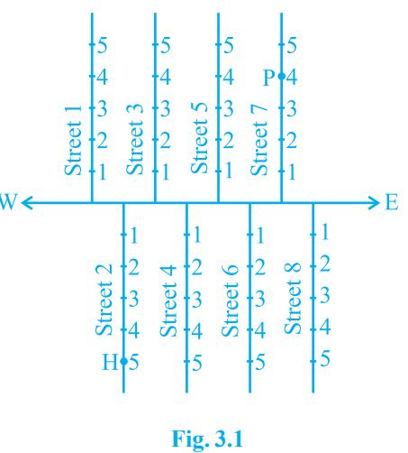
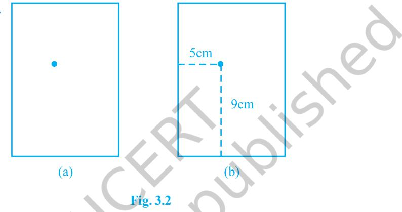
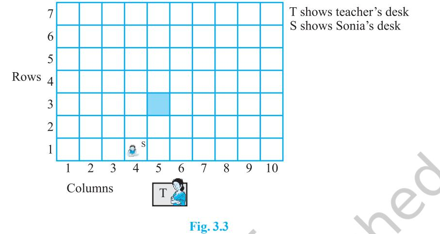
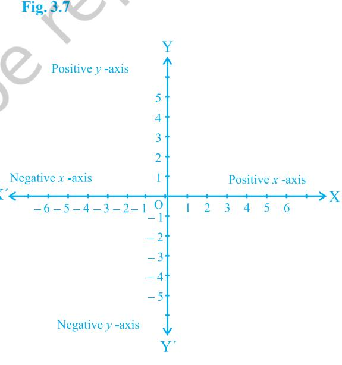
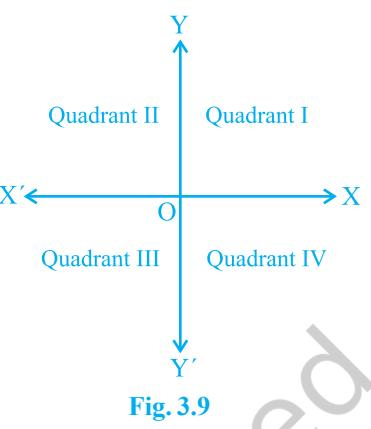
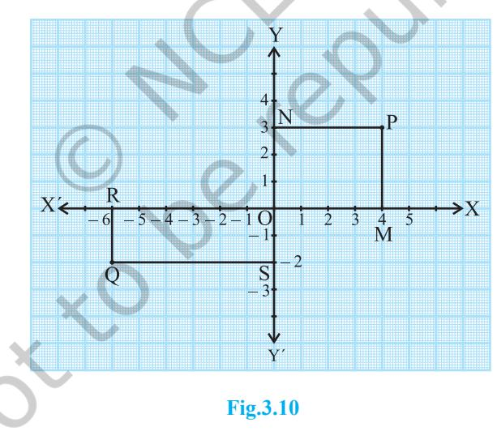
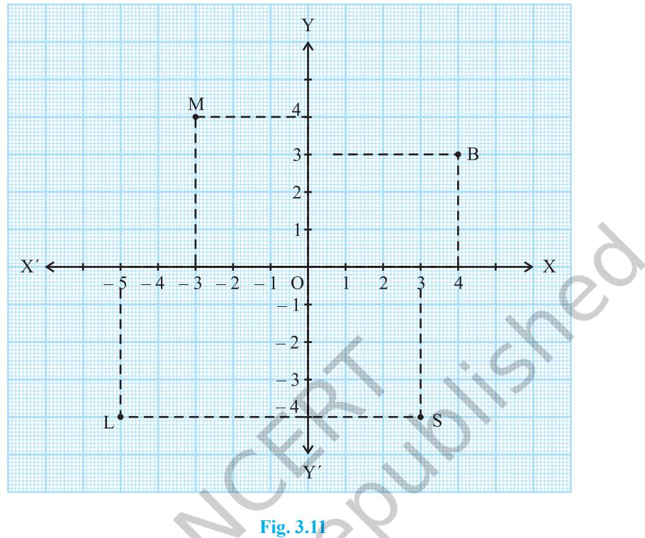
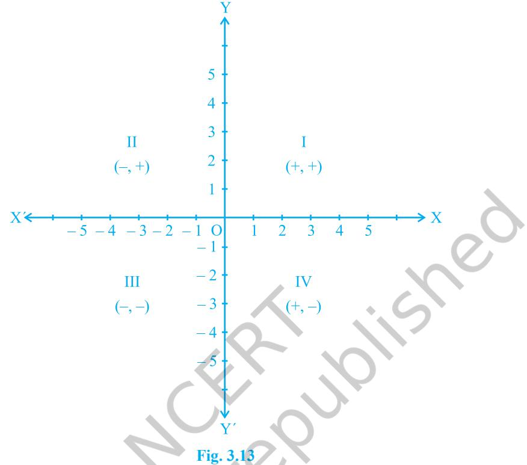
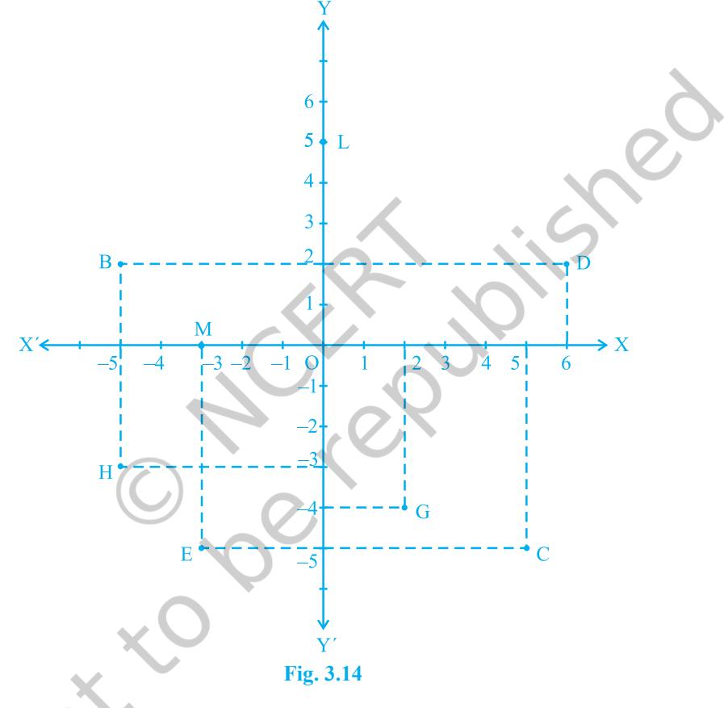

**CHAPTER 3**

# **COORDINATE GEOMETRY**

What's the good of Mercator's North Poles and Equators, Tropics, Zones and Meridian Lines?' So the Bellman would cry; and crew would reply ' They are merely conventional signs!'

LEWIS CARROLL**,** *The Hunting of the Snark*

# **3.1 Introduction**

You have already studied how to locate a point on a number line. You also know how to describe the position of a point on the line. There are many other situations, in which to find a point we are required to describe its position with reference to more than one line. For example, consider the following situations:

**I.** In Fig. 3.1, there is a main road running in the East-West direction and streets with numbering from West to East. Also, on each street, house numbers are marked. To look for a friend's house here, is it enough to know only one reference point? For instance, if we only know that she lives on Street 2, will we be able to find her house easily? Not as easily as when we know two pieces of information about it, namely, the number of the street on which it is situated, and the house number. If we want to reach the house which is situated in the 2nd street and has the number 5, first of all we would identify the 2nd street and then the house numbered 5 on it. In Fig. 3.1, H shows the location of the house. Similarly, P shows the location of the house corresponding to Street number 7 and House number 4.

**II.** Suppose you put a dot on a sheet of paper [Fig.3.2 (a)]. If we ask you to tell us the position of the dot on the paper, how will you do this? Perhaps you will try in some such manner: "The dot is in the upper half of the paper", or "It is near the left edge of the paper", or "It is very near the left hand upper corner of the sheet". Do any of these statements fix the position of the dot precisely? No! But, if you say " The dot is nearly 5 cm away from the left edge of the paper", it helps to give some idea but still does not fix the position of the dot. A little thought might enable you to say that the dot is also at a distance of 9 cm above the bottom line. We now know exactly where the dot is!

For this purpose, we fixed the position of the dot by specifying its distances from two fixed lines, the left edge of the paper and the bottom line of the paper [Fig.3.2 (b)]. In other words, we need **two** independent informations for finding the position of the dot.

Now, perform the following classroom activity known as 'Seating Plan'.

**Activity 1 (Seating Plan) :** Draw a plan of the seating in your classroom, pushing all the desks together. Represent each desk by a square. In each square, write the name of the student occupying the desk, which the square represents. Position of each student in the classroom is described precisely by using two independent informations:

- (i) the column in which she or he sits,
- (ii) the row in which she or he sits.

If you are sitting on the desk lying in the 5th column and 3rd row (represented by the shaded square in Fig. 3.3), your position could be written as (5, 3), first writing the column number, and then the row number. Is this the same as (3, 5)? Write down the names and positions of other students in your class. For example, if Sonia is sitting in the 4th column and 1st row, write S(4,1). The teacher's desk is not part of your seating plan. We are treating the teacher just as an observer.

In the discussion above, you observe that position of any object lying in a plane can be represented with the help of two perpendicular lines. In case of 'dot', we require distance of the dot from bottom line as well as from left edge of the paper. In case of seating plan, we require the number of the column and that of the row. This simple idea has far reaching consequences, and has given rise to a very important branch of Mathematics known as *Coordinate Geometry*. In this chapter, we aim to introduce some basic concepts of coordinate geometry. You will study more about these in your higher classes. This study was initially developed by the French philosopher and mathematician *René Déscartes*.

René Déscartes, the great French mathematician of the seventeenth century, liked to lie in bed and think! One day, when resting in bed, he solved the problem of describing the position of a point in a plane. His method was a development of the older idea of latitude and longitude. In honour of Déscartes, the system used for describing the position of a point in a plane is also known as the *Cartesian system.*

René Déscartes (1596 -1650) **Fig. 3.4**

# **EXERCISE 3.1**

- **1.** How will you describe the position of a table lamp on your study table to another person?
- **2. (Street Plan) :** A city has two main roads which cross each other at the centre of the city. These two roads are along the North-South direction and East-West direction.

All the other streets of the city run parallel to these roads and are 200 m apart. There are 5 streets in each direction. Using 1cm = 200 m, draw a model of the city on your notebook. Represent the roads/streets by single lines.

There are many cross- streets in your model. A particular cross-street is made by two streets, one running in the North - South direction and another in the East - West direction. Each cross street is referred to in the following manner : If the 2nd street running in the North - South direction and 5th in the East - West direction meet at some crossing, then we will call this cross-street (2, 5). Using this convention, find:

- (i) how many cross streets can be referred to as (4, 3).
- (ii) how many cross streets can be referred to as (3, 4).

## **3.2 Cartesian System**

You have studied the *number line* in the chapter on 'Number System'. On the number line, distances from a fixed point are marked in equal units positively in one direction and negatively in the other. The point from which the distances are marked is called the *origin*. We use the number line to represent the numbers by marking points on a line at equal distances. If one unit distance represents the number '1', then 3 units distance represents the number '3', '0' being at the origin. The point in the positive direction at a distance *r* from the origin represents the number *r.* The point in the negative direction at a distance *r* from the origin represents the number −*r*. Locations of different numbers on the number line are shown in Fig. 3.5.

Descartes invented the idea of placing two such lines perpendicular to each other on a plane, and locating points on the plane by referring them to these lines. The perpendicular lines may be in any direction such as in Fig.3.6. But, when we choose

these two lines to locate a point in a plane *in this chapter*, one line will be horizontal and the other will be vertical, as in Fig. 3.6(c).

These lines are actually obtained as follows : Take two number lines, calling them X′X and Y′Y. Place X′X horizontal [as in Fig. 3.7(a)] and write the numbers on it just as written on the number line. We do the same thing with Y′Y except that Y′Y is vertical, not horizontal [Fig. 3.7(b)].

Combine both the lines in such a way that the two lines cross each other at their zeroes, or origins (Fig. 3.8). The horizontal line X′X is called the *x* - axis and the vertical line YY′ is called the *y* - axis. The point where X′X and Y′Y cross is called the **origin**, and is denoted by O. Since the positive numbers lie on the directions OX and OY, OX and OY are called the **positive directions** of the *x -* axis and the *y -* axis, respectively. Similarly, OX′ and OY′ are called the **negative directions** of the *x -* axis and the *y -* axis, respectively.

You observe that the axes (plural of the word 'axis') divide the plane into four parts. These four parts are called the *quadrants* (one fourth part), numbered I, II, III and IV anticlockwise from OX (see Fig.3.9). So, the plane consists of the axes and these quadrants. We call the plane, the *Cartesian plane,* or the *coordinate plane,* or the *xy-plane.* The axes are called the *coordinate axes*.

Now, let us see why this system is so basic to mathematics, and how it is useful. Consider the following diagram where the axes are drawn on graph paper. Let us see the distances of the points P and Q from the axes. For this, we draw perpendiculars PM on the *x* - axis and PN on the *y* - axis. Similarly, we draw perpendiculars QR and QS as shown in Fig. 3.10.

### You find that

- (i) The perpendicular distance of the point P from the *y* axis measured along the positive direction of the *x* - axis is PN = OM = 4 units.
- (ii) The perpendicular distance of the point P from the *x* axis measured along the positive direction of the *y* - axis is PM = ON = 3 units.
- (iii) The perpendicular distance of the point Q from the *y* axis measured along the negative direction of the *x* - axis is OR = SQ = 6 units.
- (iv) The perpendicular distance of the point Q from the *x* axis measured along the negative direction of the *y* - axis is OS = RQ = 2 units.

Now, using these distances, how can we describe the points so that there is no confusion?

We write the coordinates of a point, using the following conventions:

- (i) The *x coordinate* of a point is its perpendicular distance from the *y* axis measured along the *x* -axis (positive along the positive direction of the *x -* axis and negative along the negative direction of the *x -* axis). For the point P, it is + 4 and for Q, it is – 6. The *x* - coordinate is also called the *abscissa*.
- (ii) The *y coordinate* of a point is its perpendicular distance from the *x* axis measured along the *y* - axis (positive along the positive direction of the *y -* axis and negative along the negative direction of the *y -* axis). For the point P, it is + 3 and for Q, it is –2. The *y* - coordinate is also called the *ordinate*.
- (iii) In stating the coordinates of a point in the coordinate plane, the *x* coordinate comes first, and then the *y* - coordinate*.* We place the coordinates in brackets.

Hence, the coordinates of P are (4, 3) and the coordinates of Q are (– 6, – 2).

Note that the coordinates describe a point in the plane *uniquely.* (3, 4) is not the same as (4, 3).

**Example 1 :** See Fig. 3.11 and complete the following statements:

- (i) The abscissa and the ordinate of the point B are _ _ _ and _ _ _, respectively. Hence, the coordinates of B are (_ _, _ _).
- (ii) The *x*-coordinate and the *y*-coordinate of the point M are _ _ _ and _ _ _, respectively. Hence, the coordinates of M are (_ _, _ _).
- (iii) The *x*-coordinate and the *y*-coordinate of the point L are _ _ _ and _ _ _, respectively. Hence, the coordinates of L are (_ _, _ _).
- (iv) The *x*-coordinate and the *y*-coordinate of the point S are _ _ _ and _ _ _, respectively. Hence, the coordinates of S are (_ _, _ _).

**Solution:** (i) Since the distance of the point B from the *y* - axis is 4 units, the *x* - coordinate or abscissa of the point B is 4. The distance of the point B from the *x* - axis is 3 units; therefore, the *y* - coordinate, i.e., the ordinate, of the point B is 3. Hence, the coordinates of the point B are (4, 3).

As in (i) above :

- (ii) The *x*  coordinate and the *y*  coordinate of the point M are –3 and 4, respectively. Hence, the coordinates of the point M are (–3, 4).
- (iii) The *x*  coordinate and the *y*  coordinate of the point L are –5 and 4, respectively. Hence, the coordinates of the point L are (–5, – 4).
- (iv) The *x*  coordinate and the *y* coordinate of the point S are 3 and 4, respectively. Hence, the coordinates of the point S are (3, – 4).

**Example 2 :** Write the coordinates of the points marked on the axes in Fig. 3.12.

**Solution :** You can see that :

- (i) The point A is at a distance of + 4 units from the *y* - axis and at a distance zero from the *x* - axis. Therefore, the *x* - coordinate of A is 4 and the *y* - coordinate is 0. Hence, the coordinates of A are (4, 0).
- (ii) The coordinates of B are (0, 3). Why?
- (iii) The coordinates of C are (– 5, 0). Why?
- (iv) The coordinates of D are (0, 4). Why?
- (v) The coordinates of E are 2 , 0 3 . Why?

Since every point on the *x* - axis has no distance (zero distance) from the *x* - axis, therefore, the *y* - coordinate of every point lying on the *x* - axis is always zero. Thus, the coordinates of any point on the *x* - axis are of the form (*x*, 0), where *x* is the distance of the point from the *y* - axis. Similarly, the coordinates of any point on the *y* - axis are of the form (0, *y*), where *y* is the distance of the point from the *x* - axis. Why?

What are the coordinates of the *origin* **O***? It has zero distance from both the axes so that its abscissa and ordinate are both zero. Therefore, the coordinates of the origin are* **(0, 0)**.

In the examples above, you may have observed the following relationship between the signs of the coordinates of a point and the quadrant of a point in which it lies.

- (i) If a point is in the 1st quadrant, then the point will be in the form (+, +), since the 1st quadrant is enclosed by the positive *x* - axis and the positive *y* - axis.
- (ii) If a point is in the 2nd quadrant, then the point will be in the form (–, +), since the 2nd quadrant is enclosed by the negative *x* - axis and the positive *y* - axis.
- (iii) If a point is in the 3rd quadrant, then the point will be in the form (–, –), since the 3rd quadrant is enclosed by the negative *x* - axis and the negative *y* - axis.
- (iv) If a point is in the 4th quadrant, then the point will be in the form (+, –), since the 4th quadrant is enclosed by the positive *x* - axis and the negative *y* - axis (see Fig. 3.13).

**Fig. 3.12**

**Remark :** The system we have discussed above for describing a point in a plane is only a convention, which is accepted all over the world. The system could also have been, for example, the ordinate first, and the abscissa second. However, the whole world sticks to the system we have described to avoid any confusion.

# **EXERCISE 3.2**

- **1.** Write the answer of each of the following questions:
	- (i) What is the name of horizontal and the vertical lines drawn to determine the position of any point in the Cartesian plane?
	- (ii) What is the name of each part of the plane formed by these two lines?
	- (iii) Write the name of the point where these two lines intersect.
- **2.** See Fig.3.14, and write the following:
	- (i) The coordinates of B.
	- (ii) The coordinates of C.
	- (iii) The point identified by the coordinates (**–**3, **–**5).
- (iv) The point identified by the coordinates (2, 4).
- (v) The abscissa of the point D.
- (vi) The ordinate of the point H.
- (vii) The coordinates of the point L.

(viii) The coordinates of the point M.

## **3.3 Summary**

In this chapter, you have studied the following points :

- **1.** To locate the position of an object or a point in a plane, we require two perpendicular lines. One of them is horizontal, and the other is vertical.
- **2.** The plane is called the Cartesian, or coordinate plane and the lines are called the coordinate axes.
- **3.** The horizontal line is called the *x* -axis, and the vertical line is called the *y* axis.
- **4.** The coordinate axes divide the plane into four parts called quadrants.
- **5.** The point of intersection of the axes is called the origin.
- **6.** The distance of a point from the *y* axis is called its *x*-coordinate, or abscissa, and the distance of the point from the *x*-axis is called its *y*-coordinate, or ordinate.
- **7.** If the abscissa of a point is *x* and the ordinate is *y*, then (*x*, *y*) are called the coordinates of the point.
- **8.** The coordinates of a point on the *x*-axis are of the form (*x*, 0) and that of the point on the *y*-axis are (0, *y*).
- **9.** The coordinates of the origin are (0, 0).
- **10.** The coordinates of a point are of the form (+ , +) in the first quadrant, (–, +) in the second quadrant, (–, –) in the third quadrant and (+, –) in the fourth quadrant, where + denotes a positive real number and – denotes a negative real number.
- **11.** If *x* ≠ *y*, then (*x*, *y*) ≠ (*y*, *x*), and (*x*, *y*) = (*y*, *x*), if *x* = *y*.

