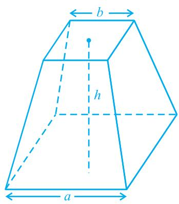
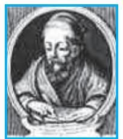
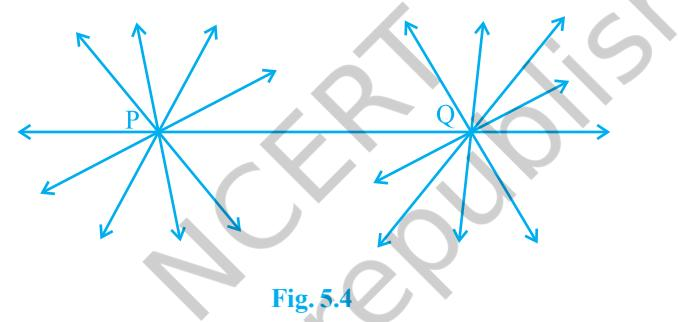
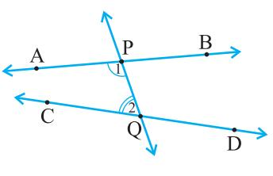
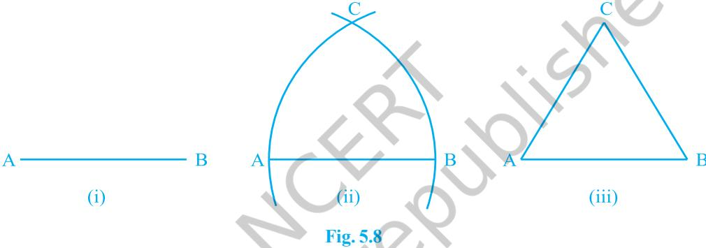

# **CHAPTER 5**

# **INTRODUCTION TO EUCLID'S GEOMETRY**

## **5.1 Introduction**

The word 'geometry' comes form the Greek words 'geo', meaning the 'earth', and 'metrein', meaning 'to measure'. Geometry appears to have originated from the need for measuring land. This branch of mathematics was studied in various forms in every ancient civilisation, be it in Egypt, Babylonia, China, India, Greece, the Incas, etc. The people of these civilisations faced several practical problems which required the development of geometry in various ways.

For example, whenever the river Nile overflowed, it wiped out the boundaries between the adjoining fields of different land owners. After such flooding, these boundaries had to be redrawn. For this purpose, the Egyptians developed a number of geometric techniques and rules for calculating simple areas and also for doing simple constructions. The knowledge of geometry was also used by them for computing volumes of granaries, and for constructing canals and pyramids. They also knew the correct formula to find the volume of a truncated pyramid (see Fig. 5.1).You know that a pyramid is a solid figure, the base of which is a triangle, or square, or some other polygon, and its side faces are triangles converging to a point at the top.

In the Indian subcontinent, the excavations at Harappa and Mohenjo-Daro, etc. show that the Indus Valley Civilisation (about 3000 BCE) made extensive use of geometry. It was a highly organised society. The cities were highly developed and very well planned. For example, the roads were parallel to each other and there was an underground drainage system. The houses had many rooms of different types. This shows that the town dwellers were skilled in mensuration and practical arithmetic. The bricks used for constructions were kiln fired and the ratio length : breadth : thickness, of the bricks was found to be 4 : 2 : 1.

In ancient India, the *Sulbasutras* (800 BCE to 500 BCE) were the manuals of geometrical constructions. The geometry of the Vedic period originated with the construction of altars (or *vedis*) and fireplaces for performing Vedic rites. The location of the sacred fires had to be in accordance to the clearly laid down instructions about their shapes and areas, if they were to be effective instruments. Square and circular altars were used for household rituals, while altars whose shapes were combinations of rectangles, triangles and trapeziums were required for public worship. The *sriyantra* (given in the *Atharvaveda*) consists of nine interwoven isosceles triangles. These triangles are arranged in such a way that they produce 43 subsidiary triangles. Though accurate geometric methods were used for the constructions of altars, the principles behind them were not discussed.

These examples show that geometry was being developed and applied everywhere in the world. But this was happening in an unsystematic manner. What is interesting about these developments of geometry in the ancient world is that they were passed on from one generation to the next, either orally or through palm leaf messages, or by other ways. Also, we find that in some civilisations like Babylonia, geometry remained a very practical oriented discipline, as was the case in India and Rome. The geometry developed by Egyptians mainly consisted of the statements of results. There were no general rules of the procedure. In fact, Babylonians and Egyptians used geometry mostly for practical purposes and did very little to develop it as a systematic science. But in civilisations like Greece, the emphasis was on the *reasoning* behind why certain constructions work. The Greeks were interested in establishing the truth of the statements they discovered using deductive reasoning (see Appendix 1).

A Greek mathematician, Thales is credited with giving the first known proof. This proof was of the statement that a circle is bisected (i.e., cut into two equal parts) by its diameter. One of Thales' most famous pupils was Pythagoras (572 BCE), whom you have heard about. Pythagoras and his group discovered many geometric properties and developed the theory of geometry to a great extent. This process continued till 300 BCE. At that time Euclid, a teacher of mathematics at Alexandria in Egypt, collected all the known work and arranged it in his famous treatise, **Thales**

**(640 BCE – 546 BCE) Fig. 5.2**

called 'Elements'. He divided the 'Elements' into thirteen chapters, each called a book. These books influenced the whole world's understanding of geometry for generations to come.

In this chapter, we shall discuss Euclid's approach to geometry and shall try to link it with the present day geometry.

**Euclid (325 BCE – 265 BCE) Fig. 5.3**

### **5.2 Euclid's Definitions, Axioms and Postulates**

The Greek mathematicians of Euclid's time thought of geometry as an abstract model of the world in which they lived. The notions of point, line, plane (or surface) and so on were derived from what was seen around them. From studies of the space and solids in the space around them, an abstract geometrical notion of a solid object was developed. A solid has shape, size, position, and can be moved from one place to another. Its boundaries are called **surfaces.** They separate one part of the space from another, and are said to have no thickness. The boundaries of the surfaces are **curves** or straight **lines.** These lines end in **points**.

Consider the three steps from solids to points (solids-surfaces-lines-points). In each step we lose one extension, also called a **dimension**. So, a solid has three dimensions, a surface has two, a line has one and a point has none. Euclid summarised these statements as definitions. He began his exposition by listing 23 definitions in Book 1 of the 'Elements'. A few of them are given below :

- 1. A **point** is that which has no part.
- 2. A **line** is breadthless length.
- 3. The ends of a line are points.
- 4. A **straight line** is a line which lies evenly with the points on itself.
- 5. A **surface** is that which has length and breadth only.
- 6. The edges of a surface are lines.
- 7. A **plane surface** is a surface which lies evenly with the straight lines on itself.

If you carefully study these definitions, you find that some of the terms like part, breadth, length, evenly, etc. need to be further explained clearly. For example, consider his definition of a point. In this definition, 'a part' needs to be defined. Suppose if you define 'a part' to be that which occupies 'area', again 'an area' needs to be defined. So, to define one thing, you need to define many other things, and you may get a long chain of definitions without an end. For such reasons, mathematicians agree to leave some geometric terms *undefined*. However, we do have a intuitive feeling for the geometric concept of a point than what the 'definition' above gives us. So, we represent a point as a dot, even though a dot has some dimension.

A similar problem arises in Definition 2 above, since it refers to breadth and length, neither of which has been defined. Because of this, a few terms are kept undefined while developing any course of study. So, in geometry, we *take a point, a line and a plane* (*in Euclid's words a plane surface*) *as undefined terms*. The only thing is that we can represent them intuitively, or explain them with the help of 'physical models'.

Starting with his definitions, Euclid assumed certain properties, which were not to be proved. These assumptions are actually 'obvious universal truths'. He divided them into two types: axioms and postulates. He used the term '**postulate**' for the assumptions that were specific to geometry. Common notions (often called **axioms**), on the other hand, were assumptions used throughout mathematics and not specifically linked to geometry. For details about axioms and postulates, refer to Appendix 1. Some of **Euclid's axioms**, not in his order, are given below :

- (1) Things which are equal to the same thing are equal to one another.
- (2) If equals are added to equals, the wholes are equal.
- (3) If equals are subtracted from equals, the remainders are equal.
- (4) Things which coincide with one another are equal to one another.
- (5) The whole is greater than the part.
- (6) Things which are double of the same things are equal to one another.
- (7) Things which are halves of the same things are equal to one another.

These 'common notions' refer to magnitudes of some kind. The first common notion could be applied to plane figures. For example, if an area of a triangle equals the area of a rectangle and the area of the rectangle equals that of a square, then the area of the triangle also equals the area of the square.

Magnitudes of the same kind can be compared and added, but magnitudes of different kinds cannot be compared. For example, a line cannot be compared to a rectangle, nor can an angle be compared to a pentagon.

The 4th axiom given above seems to say that if two things are identical (that is, they are the same), then they are equal. In other words, everything equals itself. It is the justification of the principle of superposition. Axiom (5) gives us the definition of 'greater than'. For example, if a quantity B is a part of another quantity A, then A can be written as the sum of B and some third quantity C. Symbolically, A *>* B means that there is some C such that A *=* B *+* C*.*

Now let us discuss **Euclid's five postulates.** They are :

**Postulate 1 :** *A straight line may be drawn from any one point to any other point.*

Note that this postulate tells us that at least one straight line passes through two distinct points, but it does not say that there cannot be more than one such line. However, in his work, Euclid has frequently assumed, without mentioning, that there is a *unique* line joining two distinct points. We state this result in the form of an axiom as follows:

**Axiom 5.1 :** *Given two distinct points, there is a unique line that passes through them*.

How many lines passing through P also pass through Q (see Fig. 5.4)? Only one, that is, the line PQ. How many lines passing through Q also pass through P? Only one, that is, the line PQ. Thus, the statement above is self-evident, and so is taken as an axiom.

**Postulate 2 :** *A terminated line can be produced indefinitely*.

Note that what we call a line segment now-a-days is what Euclid called a terminated line. So, according to the present day terms, the second postulate says that a line segment can be extended on either side to form a line (see Fig. 5.5).

**Postulate 3 :** *A circle can be drawn with any centre and any radius*. **Postulate 4 :** *All right angles are equal to one another*.

**Postulate 5 :** *If a straight line falling on two straight lines makes the interior angles on the same side of it taken together less than two right angles, then the two straight lines, if produced indefinitely, meet on that side on which the sum of angles is less than two right angles.*

For example, the line PQ in Fig. 5.6 falls on lines AB and CD such that the sum of the interior angles 1 and 2 is less than 180° on the left side of PQ. Therefore, the lines AB and CD will eventually intersect on the left side of PQ.

A brief look at the five postulates brings to your notice that Postulate 5 is far more complex than any other postulate. On the other hand, Postulates 1 through 4 are so simple and obvious that these are taken as 'self-evident truths'. However, it is not possible to prove them. So, these statements are accepted without any proof (see Appendix 1). Because of its complexity, the fifth postulate will be given more attention in the next section.

Now-a-days, 'postulates' and 'axioms' are terms that are used interchangeably and in the same sense. 'Postulate' is actually a verb. When we say "let us postulate", we mean, "let us make some statement based on the observed phenomenon in the Universe". Its truth/validity is checked afterwards. If it is true, then it is accepted as a 'Postulate'.

A system of axioms is called **consistent** (see Appendix 1), if it is impossible to deduce from these axioms a statement that contradicts any axiom or previously proved statement. So, when any system of axioms is given, it needs to be ensured that the system is consistent.

After Euclid stated his postulates and axioms, he used them to prove other results. Then using these results, he proved some more results by applying deductive reasoning. The statements that were proved are called **propositions or theorems**. Euclid deduced 465 propositions in a logical chain using his axioms, postulates, definitions and theorems proved earlier in the chain. In the next few chapters on geometry, you will be using these axioms to prove some theorems.

Now, let us see in the following examples how Euclid used his axioms and postulates for proving some of the results:

**Example 1 :** If A, B and C are three points on a line, and B lies between A and C (see Fig. 5.7), then prove that AB + BC = AC.

**Fig. 5.7**

**Solution :** In the figure given above, AC coincides with AB + BC.

Also, Euclid's Axiom (4) says that things which coincide with one another are equal to one another. So, it can be deduced that

$$\mathrm{AB+BC=AC}$$

Note that in this solution, it has been assumed that there is a unique line passing through two points.

**Example 2 :** Prove that an equilateral triangle can be constructed on any given line segment.

**Solution :** In the statement above, a line segment of any length is given, say AB [see Fig. 5.8(i)].

Here, you need to do some construction. Using Euclid's Postulate 3, you can draw a circle with point A as the centre and AB as the radius [see Fig. 5.8(ii)]. Similarly, draw another circle with point B as the centre and BA as the radius. The two circles meet at a point, say C. Now, draw the line segments AC and BC to form ∆ ABC [see Fig. 5.8 (iii)].

So, you have to prove that this triangle is equilateral, i.e., AB = AC = BC.

Now, AB = AC, since they are the radii of the same circle (1)

Similarly, AB = BC (Radii of the same circle) (2)

From these two facts, and Euclid's axiom that things which are equal to the same thing are equal to one another, you can conclude that AB = BC = AC.

So, ∆ ABC is an equilateral triangle.

Note that here Euclid has assumed, without mentioning anywhere, that the two circles drawn with centres A and B will meet each other at a point.

Now we prove a theorem, which is frequently used in different results:

**Theorem 5.1 :** *Two distinct lines cannot have more than one point in common.*

**Proof :** Here we are given two lines *l* and *m*. We need to prove that they have only one point in common.

For the time being, let us suppose that the two lines intersect in two distinct points, say P and Q. So, you have two lines passing through two distinct points P and Q. But this assumption clashes with the axiom that only one line can pass through two distinct points. So, the assumption that we started with, that two lines can pass through two distinct points is wrong.

From this, what can we conclude? We are forced to conclude that two distinct lines cannot have more than one point in common.

#### **EXERCISE 5.1**

- **1.** Which of the following statements are true and which are false? Give reasons for your answers.
	- (i) Only one line can pass through a single point.
	- (ii) There are an infinite number of lines which pass through two distinct points.
	- (iii) A terminated line can be produced indefinitely on both the sides.
	- (iv) If two circles are equal, then their radii are equal.
	- (v) In Fig. 5.9, if AB = PQ and PQ = XY, then AB = XY.

- **2.** Give a definition for each of the following terms. Are there other terms that need to be defined first? What are they, and how might you define them?
	- (i) parallel lines (ii) perpendicular lines (iii) line segment
	- (iv) radius of a circle (v) square
- **3.** Consider two 'postulates' given below:
	- (i) Given any two distinct points A and B, there exists a third point C which is in between A and B.
	- (ii) There exist at least three points that are not on the same line.

Do these postulates contain any undefined terms? Are these postulates consistent? Do they follow from Euclid's postulates? Explain.

- **4.** If a point C lies between two points A and B such that AC = BC, then prove that AC = 1 2 AB. Explain by drawing the figure.
- **5.** In Question 4, point C is called a mid-point of line segment AB. Prove that every line segment has one and only one mid-point.
- **6.** In Fig. 5.10, if AC = BD, then prove that AB = CD.

- **7.** Why is Axiom 5, in the list of Euclid's axioms, considered a 'universal truth'? (Note that the question is not about the fifth postulate.)
#### **5.3 Summary**

In this chapter, you have studied the following points:

- **1.** Though Euclid defined a point, a line, and a plane, the definitions are not accepted by mathematicians. Therefore, these terms are now taken as undefined.
- **2.** Axioms or postulates are the assumptions which are obvious universal truths. They are not proved.
- **3.** Theorems are statements which are proved, using definitions, axioms, previously proved statements and deductive reasoning.
- **4.** Some of Euclid's axioms were :
	- (1) Things which are equal to the same thing are equal to one another.
	- (2) If equals are added to equals, the wholes are equal.
	- (3) If equals are subtracted from equals, the remainders are equal.
	- (4) Things which coincide with one another are equal to one another.
	- (5) The whole is greater than the part.
	- (6) Things which are double of the same things are equal to one another.
	- (7) Things which are halves of the same things are equal to one another.
- **5.** Euclid's postulates were :

**Postulate 1 :** A straight line may be drawn from any one point to any other point.

**Postulate 2 :** A terminated line can be produced indefinitely.

**Postulate 3 :** A circle can be drawn with any centre and any radius.

**Postulate 4 :** All right angles are equal to one another.

