### **6.1 Introduction**

In Chapter 5, you have studied that a minimum of two points are required to draw a line. You have also studied some axioms and, with the help of these axioms, you proved some other statements. In this chapter, you will study the properties of the angles formed when two lines intersect each other, and also the properties of the angles formed when a line intersects two or more parallel lines at distinct points. Further you will use these properties to prove some statements using deductive reasoning (see Appendix 1). You have already verified these statements through some activities in the earlier classes.

In your daily life, you see different types of angles formed between the edges of plane surfaces. For making a similar kind of model using the plane surfaces, you need to have a thorough knowledge of angles. For instance, suppose you want to make a model of a hut to keep in the school exhibition using bamboo sticks. Imagine how you would make it? You would keep some of the sticks parallel to each other, and some sticks would be kept slanted. Whenever an architect has to draw a plan for a multistoried building, she has to draw intersecting lines and parallel lines at different angles. Without the knowledge of the properties of these lines and angles, do you think she can draw the layout of the building?

In science, you study the properties of light by drawing the ray diagrams. For example, to study the refraction property of light when it enters from one medium to the other medium, you use the properties of intersecting lines and parallel lines. When two or more forces act on a body, you draw the diagram in which forces are represented by directed line segments to study the net effect of the forces on the body. At that time, you need to know the relation between the angles when the rays (or line segments) are parallel to or intersect each other. To find the height of a tower or to find the distance of a ship from the light house, one needs to know the angle formed between the horizontal and the line of sight. Plenty of other examples can be given where lines and angles are used. In the subsequent chapters of geometry, you will be using these properties of lines and angles to deduce more and more useful properties.

Let us first revise the terms and definitions related to lines and angles learnt in earlier classes.

#### **6.2 Basic Terms and Definitions**

Recall that a part (or portion) of a line with two end points is called a **line-segment** and a part of a line with one end point is called a **ray**. Note that the line segment AB is denoted by AB , and its length is denoted by AB. The ray AB is denoted by AB - , and a line is denoted by AB - . However, **we will not use these symbols**, and will denote the line segment AB, ray AB, length AB and line AB by the same symbol, AB. The meaning will be clear from the context. Sometimes small letters *l*, *m*, *n*, etc. will be used to denote lines.

If three or more points lie on the same line, they are called **collinear points**; otherwise they are called **non-collinear points**.

Recall that an **angle** is formed when two rays originate from the same end point. The rays making an angle are called the **arms** of the angle and the end point is called the **vertex** of the angle. You have studied different types of angles, such as acute angle, right angle, obtuse angle, straight angle and reflex angle in earlier classes (see Fig. 6.1).

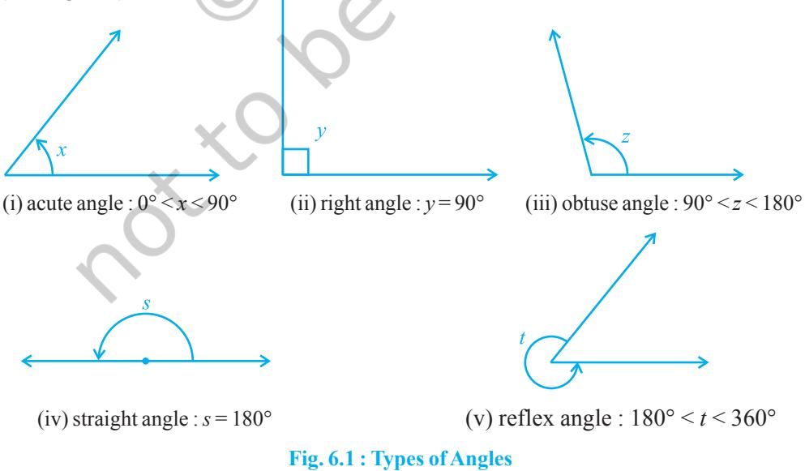

An **acute** angle measures between 0° and 90°, whereas a **right angle** is exactly equal to 90°. An angle greater than 90° but less than 180° is called an **obtuse angle**. Also, recall that a **straight angle** is equal to 180°. An angle which is greater than 180° but less than 360° is called a **reflex angle**. Further, two angles whose sum is 90° are called **complementary angles**, and two angles whose sum is 180° are called **supplementary angles**.

You have also studied about adjacent angles in the earlier classes (see Fig. 6.2). Two angles are **adjacent**, if they have a common vertex, a common arm and their non-common arms are on different sides of the common arm. In Fig. 6.2, ∠ ABD and ∠ DBC are adjacent angles. Ray BD is their common arm and point B is their common vertex. Ray BA and ray BC are non common arms. Moreover, when two angles are adjacent, then their sum is always equal to the angle formed by the two noncommon arms. So, we can write

$$\angle\mathrm{ABC}=\angle\mathrm{ABD}+\angle\mathrm{DBC}.$$

Note that ∠ ABC and ∠ ABD are not adjacent angles. Why? Because their noncommon arms BD and BC lie on the same side of the common arm BA.

If the non-common arms BA and BC in Fig. 6.2, form a line then it will look like Fig. 6.3. In this case, ∠ ABD and ∠ DBC are called **linear pair of angles**.

You may also recall the **vertically opposite angles** formed when two lines, say AB and CD, intersect each other, say at the point O (see Fig. 6.4). There are two pairs of vertically opposite angles.

One pair is ∠AOD and ∠BOC. Can you find the other pair?

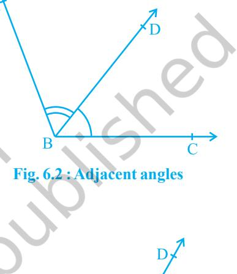

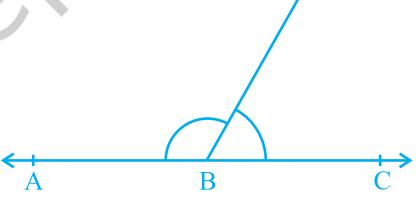

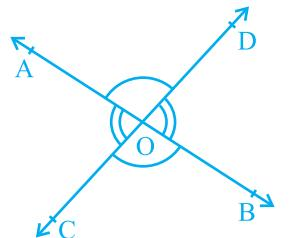

#### **6.3 Intersecting Lines and Non-intersecting Lines**

Draw two different lines PQ and RS on a paper. You will see that you can draw them in two different ways as shown in Fig. 6.5 (i) and Fig. 6.5 (ii).

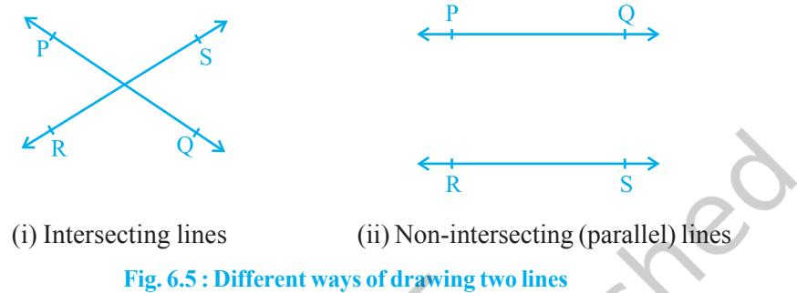

Recall the notion of a line, that it extends indefinitely in both directions. Lines PQ and RS in Fig. 6.5 (i) are intersecting lines and in Fig. 6.5 (ii) are parallel lines. Note that the lengths of the common perpendiculars at different points on these parallel lines is the same. This equal length is called the *distance between two parallel lines*.

#### **6.4 Pairs of Angles**

In Section 6.2, you have learnt the definitions of some of the pairs of angles such as complementary angles, supplementary angles, adjacent angles, linear pair of angles, etc. Can you think of some relations between these angles? Now, let us find out the relation between the angles formed when a ray stands on a line. Draw a figure in which a ray stands on a line as shown in Fig. 6.6. Name the line as AB and the ray as OC. What are the angles formed at the point O? They are ∠ AOC, ∠ BOC and ∠ AOB. Can we write ∠ AOC + ∠ BOC = ∠ AOB? (1) Yes! (Why? Refer to adjacent angles in Section 6.2) What is the measure of ∠ AOB? It is 180°. (Why?) (2) From (1) and (2), can you say that ∠ AOC + ∠ BOC = 180°? Yes! (Why?) From the above discussion, we can state the following Axiom: **Fig. 6.6 : Linear pair of angles**

**Axiom 6.1 :** *If a ray stands on a line, then the sum of two adjacent angles so formed is* 180°.

Recall that when the sum of two adjacent angles is 180°, then they are called a **linear pair of angles**.

In Axiom 6.1, it is given that 'a ray stands on a line'. From this 'given', we have concluded that 'the sum of two adjacent angles so formed is 180°'. Can we write Axiom 6.1 the other way? That is, take the 'conclusion' of Axiom 6.1 as 'given' and the 'given' as the 'conclusion'. So it becomes:

(A) If the sum of two adjacent angles is 180°, then a ray stands on a line (that is, the non-common arms form a line).

Now you see that the Axiom 6.1 and statement (A) are in a sense the reverse of each others. We call each as converse of the other. We do not know whether the statement (A) is true or not. Let us check. Draw adjacent angles of different measures as shown in Fig. 6.7. Keep the ruler along one of the non-common arms in each case. Does the other non-common arm also lie along the ruler?

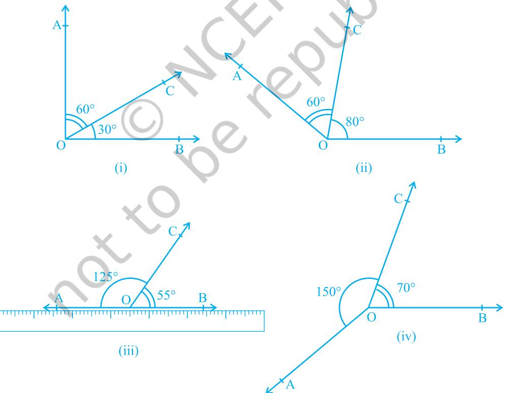

**Fig. 6.7 : Adjacent angles with different measures**

You will find that only in Fig. 6.7 (iii), both the non-common arms lie along the ruler, that is, points A, O and B lie on the same line and ray OC stands on it. Also see that ∠ AOC + ∠ COB = 125° + 55° = 180°. From this, you may conclude that statement (A) is true. So, you can state in the form of an axiom as follows:

**Axiom 6.2 :** *If the sum of two adjacent angles is* 180°, *then the non-common arms of the angles form a line*.

For obvious reasons, the two axioms above together is called the **Linear Pair Axiom**.

Let us now examine the case when two lines intersect each other.

Recall, from earlier classes, that when two lines intersect, the vertically opposite angles are equal. Let us prove this result now. See Appendix 1 for the ingredients of a proof, and keep those in mind while studying the proof given below.

**Theorem 6.1 :** *If two lines intersect each other, then the vertically opposite angles are equal*.

**Proof :** In the statement above, it is given that 'two lines intersect each other'. So, let AB and CD be two lines intersecting at O as shown in Fig. 6.8. They lead to two pairs of vertically opposite angles, namely,

(i) ∠ AOC and ∠ BOD (ii) ∠ AOD and ∠ BOC.

We need to prove that ∠ AOC = ∠ BOD and ∠ AOD = ∠ BOC.

Now, ray OA stands on line CD.

Therefore, ∠ AOC + ∠ AOD = 180° (Linear pair axiom) (1)

Can we write ∠ AOD + ∠ BOD = 180°? Yes! (Why?) (2)

From (1) and (2), we can write

∠ AOC + ∠ AOD = ∠ AOD + ∠ BOD

This implies that ∠ AOC = ∠ BOD (Refer Section 5.2, Axiom 3)

Similarly, it can be proved that ∠AOD = ∠BOC

Now, let us do some examples based on Linear Pair Axiom and Theorem 6.1.

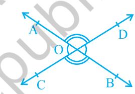

**Fig. 6.8 : Vertically opposite angles**

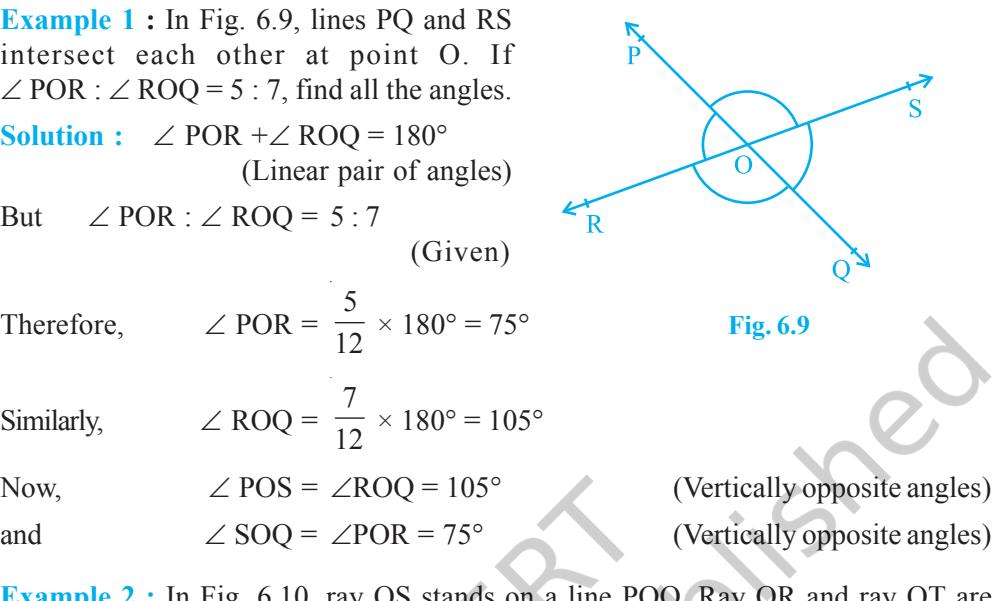

**Example 2 :** In Fig. 6.10, ray OS stands on a line POQ. Ray OR and ray OT are angle bisectors of ∠ POS and ∠ SOQ, respectively. If ∠ POS = *x*, find ∠ ROT.

  
  
**Solution :** Ray OS stands on the fine PQO.  
  
Therefore,  
  
But,  
  
Therefore,  
  
$\left(\begin{array}{c}\includegraphics[height=142.26378pt]{POS}=x\\ \includegraphics[height=142.26378pt]{POS}=180^{\circ}\end{array}\right)$  
  
So,  
  
Now, ray OR bisects $\angle$ POS's-interior,  
  
**Fig. 6.10**

Similarly,  
  
$\angle$SOT = $\frac{1}{2}\times\angle$SOQ  
  
$\angle$SOT = $\frac{1}{2}\times\angle$SOQ  
  
$\angle$SOT = $\frac{1}{2}\times\angle$SOQ  
  
$\angle$SOT = $\frac{1}{2}\times(180^{\circ}-x)$  
  
$\angle$SOT = $90^{\circ}-\frac{x}{2}$

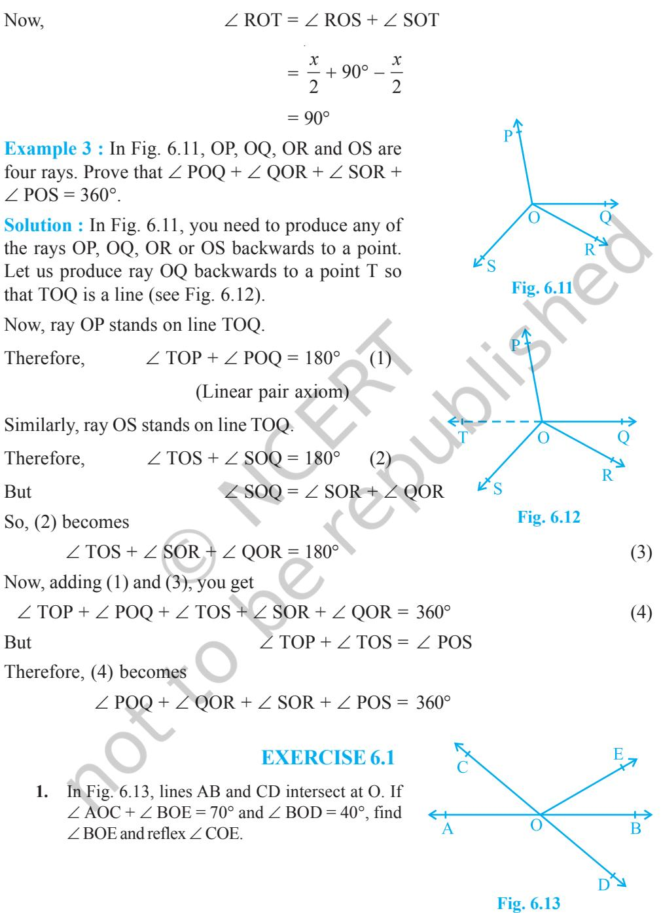

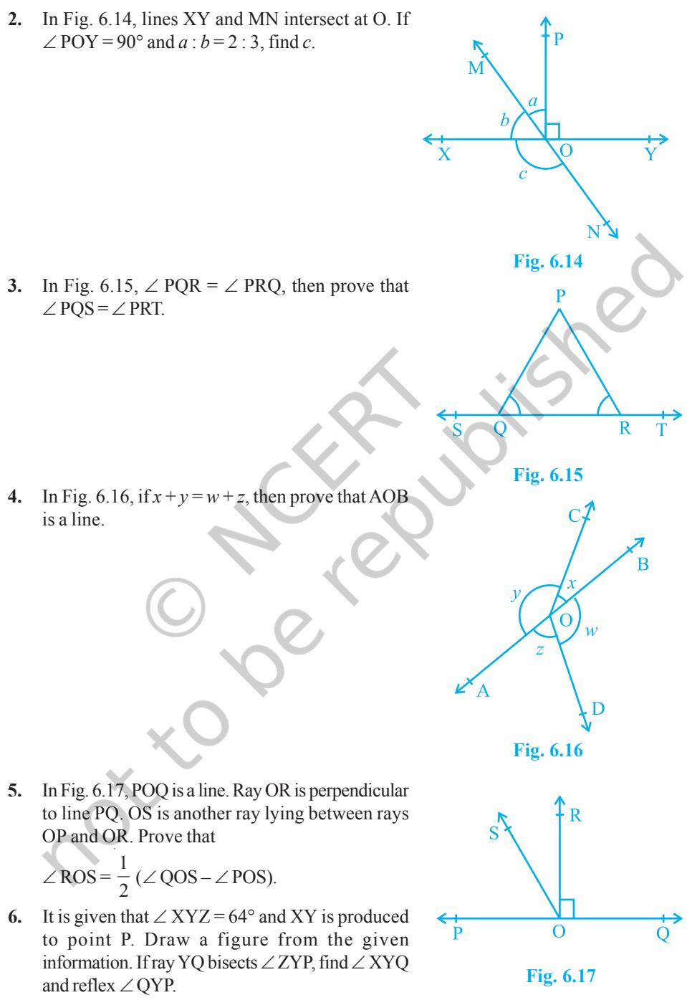

**Fig. 6.18**

## **6.5 Lines Parallel to the Same Line**

If two lines are parallel to the same line, will they be parallel to each other? Let us check it. See Fig. 6.18 in which line *m* || line *l* and line *n* || line *l*.

Let us draw a line *t* transversal for the lines, *l*, *m* and *n*. It is given that line *m* || line *l* and line *n* || line *l*.

Therefore, ∠ 1 = ∠ 2 and ∠ 1 = ∠ 3

(Corresponding angles axiom)

So, ∠ 2 = ∠ 3 (Why?)

But ∠ 2 and ∠ 3 are corresponding angles and they are equal.

Therefore, you can say that

Line *m* || Line *n*

(Converse of corresponding angles axiom)

This result can be stated in the form of the following theorem:

**Theorem 6.6 :** *Lines which are parallel to the same line are parallel to each other*.

**Note :** The property above can be extended to more than two lines also.

Now, let us solve some examples related to parallel lines.

**Example 4 :** In Fig. 6.19, if PQ || RS, ∠ MXQ = 135° and ∠ MYR = 40°, find ∠ XMY.

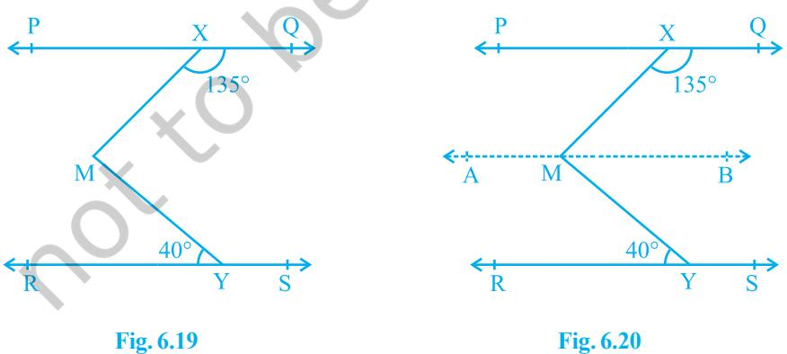

**Solution :** Here, we need to draw a line AB parallel to line PQ, through point M as shown in Fig. 6.20. Now, AB || PQ and PQ || RS.

Therefore, AB || RS (Why?) Now, ∠ QXM + ∠ XMB = 180° (AB || PQ, Interior angles on the same side of the transversal XM) But ∠ QXM = 135° So, 135° + ∠ XMB = 180° Therefore, ∠ XMB = 45° (1) Now, ∠ BMY = ∠ MYR (AB || RS, Alternate angles) Therefore, ∠ BMY = 40° (2) Adding (1) and (2), you get ∠ XMB + ∠ BMY = 45° + 40° That is, ∠ XMY = 85°

**Example 5 :** If a transversal intersects two lines such that the bisectors of a pair of corresponding angles are parallel, then prove that the two lines are parallel.

**Solution :** In Fig. 6.21, a transversal AD intersects two lines PQ and RS at points B and C respectively. Ray BE is the bisector of ∠ ABQ and ray CG is the bisector of ∠ BCS; and BE || CG.

∠ ABQ (1)

We are to prove that PQ || RS.

It is given that ray BE is the bisector of ∠ ABQ.

1 2

Therefore, ∠ ABE =

Similarly, ray CG is the bisector of ∠ BCS.

Therefore, ∠ BCG =

* [10] A. A. K.  
  

But BE || CG and AD is the transversal.

Therefore, ∠ ABE = ∠ BCG

(Corresponding angles axiom) (3)

Substituting (1) and (2) in (3), you get

$$\begin{array}{c}1\\ 2\end{array}\begin{array}{c}\angle\mbox{ABQ}=\begin{array}{c}1\\ 2\end{array}\begin{array}{c}\angle\mbox{BCS}\end{array}

That is, \begin{array}{c}\angle\mbox{ABQ}=\begin{array}{c}\angle\mbox{BCS}\end{array}$$

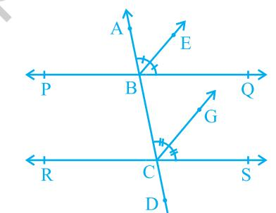

**Fig. 6.21**

But, they are the corresponding angles formed by transversal AD with PQ and RS; and are equal.

Therefore, PQ || RS

(Converse of corresponding angles axiom)

**Example 6 :** In Fig. 6.22, AB || CD and CD || EF. Also EA ⊥ AB. If ∠ BEF = 55°, find the values of *x*, *y* and *z*.

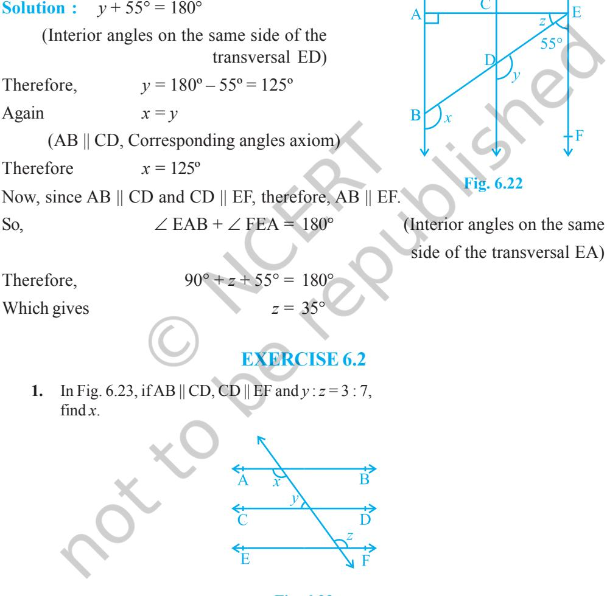

**Fig. 6.23**

- **2.** In Fig. 6.24, if AB || CD, EF ⊥ CD and ∠ GED = 126°, find ∠ AGE, ∠ GEF and ∠ FGE.
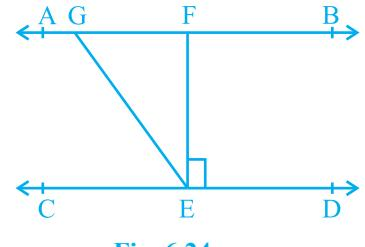

- **3.** In Fig. 6.25, if PQ || ST, ∠ PQR = 110° and ∠ RST = 130°, find ∠ QRS. [**Hint :** Draw a line parallel to ST through point R.]
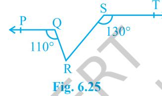

- **4.** In Fig. 6.26, if AB || CD, ∠ APQ = 50° and ∠ PRD = 127°, find *x* and *y*.
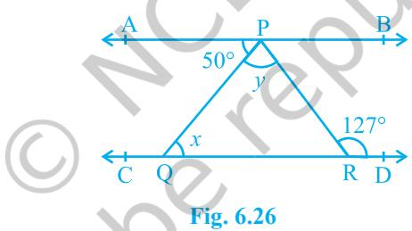

- **5.** In Fig. 6.27, PQ and RS are two mirrors placed parallel to each other. An incident ray AB strikes the mirror PQ at B, the reflected ray moves along the path BC and strikes the mirror RS at C and again reflects back along CD. Prove that AB || CD.
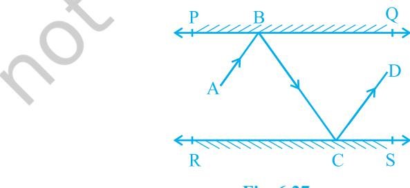

**Fig. 6.27**

#### **6.6 Summary**

In this chapter, you have studied the following points:

- **1.** If a ray stands on a line, then the sum of the two adjacent angles so formed is 180° and viceversa. This property is called as the Linear pair axiom.
- **2.** If two lines intersect each other, then the vertically opposite angles are equal.
- **3.** Lines which are parallel to a given line are parallel to each other.

