# **CHAPTER 8**

# **QUADRILATERALS**

## **8.1 Properties of a Parallelogram**

You have already studied quadrilaterals and their types in Class VIII. A quadrilateral has four sides, four angles and four vertices. A parallelogram is a quadrilateral in which both pairs of opposite sides are parallel.

Let us perform an activity.

Cut out a parallelogram from a sheet of paper and cut it along a diagonal (see Fig. 8.1). You obtain two triangles. What can you say about these triangles?

Place one triangle over the other. Turn one around, if necessary. What do you observe?

Observe that the two triangles are congruent to each other.

**Fig. 8.1**

Repeat this activity with some more parallelograms. Each time you will observe that each diagonal divides the parallelogram into two congruent triangles.

Let us now prove this result.

**Theorem 8.1 :** *A diagonal of a parallelogram divides it into two congruent triangles*.

**Proof :** Let ABCD be a parallelogram and AC be a diagonal (see Fig. 8.2). Observe that the diagonal AC divides parallelogram ABCD into two triangles, namely, ∆ ABC and ∆ CDA. We need to prove that these triangles are congruent.

In ∆ ABC and ∆ CDA, note that BC || AD and AC is a transversal.

- So, ∠ BCA = ∠ DAC (Pair of alternate angles)
- Also, AB || DC and AC is a transversal.

So, ∠ BAC = ∠ DCA (Pair of alternate angles)

and AC = CA (Common)

So, ∆ ABC ≅ ∆ CDA (ASA rule)

or, diagonal AC divides parallelogram ABCD into two congruent triangles ABC and CDA.

Now, measure the opposite sides of parallelogram ABCD. What do you observe?

You will find that AB = DC and AD = BC.

This is another property of a parallelogram stated below:

**Theorem 8.2 :** *In a parallelogram, opposite sides are equal*.

You have already proved that a diagonal divides the parallelogram into two congruent triangles; so what can you say about the corresponding parts say, the corresponding sides? They are equal.

So, AB = DC and AD = BC

Now what is the converse of this result? You already know that whatever is given in a theorem, the same is to be proved in the converse and whatever is proved in the theorem it is given in the converse. Thus, Theorem 8.2 can be stated as given below :

If a quadrilateral is a parallelogram, then each pair of its opposite sides is equal. So its converse is :

**Theorem 8.3 :** *If each pair of opposite sides of a quadrilateral is equal, then it is a parallelogram*.

Can you reason out why?

Let sides AB and CD of the quadrilateral ABCD be equal and also AD = BC (see Fig. 8.3). Draw diagonal AC.

| Clearly, | ∆ ABC ≅ | ∆ CDA | (Why?) |
| --- | --- | --- | --- |
| So, | ∠ BAC = | ∠ DCA |  |
| and | ∠ BCA = | ∠ DAC | (Why?) |

Can you now say that ABCD is a parallelogram? Why?

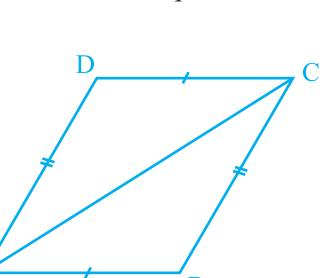

**Fig. 8.3**

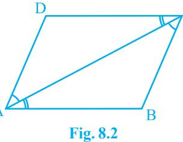

You have just seen that in a parallelogram each pair of opposite sides is equal and conversely if each pair of opposite sides of a quadrilateral is equal, then it is a parallelogram. Can we conclude the same result for the pairs of opposite angles?

Draw a parallelogram and measure its angles. What do you observe?

Each pair of opposite angles is equal.

Repeat this with some more parallelograms. We arrive at yet another result as given below.

**Theorem 8.4 :** *In a parallelogram, opposite angles are equal*.

Now, is the converse of this result also true? Yes. Using the angle sum property of a quadrilateral and the results of parallel lines intersected by a transversal, we can see that the converse is also true. So, we have the following theorem :

**Theorem 8.5 :** *If in a quadrilateral, each pair of opposite angles is equal, then it is a parallelogram*.

There is yet another property of a parallelogram. Let us study the same. Draw a parallelogram ABCD and draw both its diagonals intersecting at the point O (see Fig. 8.4).

Measure the lengths of OA, OB, OC and OD.

What do you observe? You will observe that

OA = OC and OB = OD.

or, O is the mid-point of both the diagonals.

Repeat this activity with some more parallelograms.

Each time you will find that O is the mid-point of both the diagonals.

So, we have the following theorem :

**Theorem 8.6 :** *The diagonals of a parallelogram bisect each other*.

Now, what would happen, if in a quadrilateral the diagonals bisect each other? Will it be aparallelogram? Indeed this is true.

This result is the converse of the result of Theorem 8.6. It is given below:

**Theorem 8.7 :** *If the diagonals of a quadrilateral bisect each other, then it is a parallelogram*.

You can reason out this result as follows:

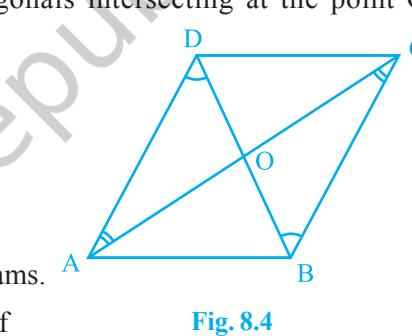

Note that in Fig. 8.5, it is given that OA = OC and OB = OD. So, ∆ AOB ≅ ∆ COD (Why?) Therefore, ∠ ABO = ∠ CDO (Why?) From this, we get AB || CD Similarly, BC || AD Therefore ABCD is a parallelogram. Let us now take some examples. **Example 1 :** Show that each angle of a rectangle is a right angle. **Solution :** Let us recall what a rectangle is. A rectangle is a parallelogram in which one angle is a right angle. Let ABCD be a rectangle in which ∠ A = 90°. We have to show that ∠ B = ∠ C = ∠ D = 90° We have, AD || BC and AB is a transversal (see Fig. 8.6). So, ∠ A + ∠ B = 180° (Interior angles on the same side of the transversal) But, ∠ A = 90° So, ∠ B = 180° – ∠ A = 180° – 90° = 90° Now, ∠ C = ∠ A and ∠ D = ∠ B (Opposite angles of the parallellogram) So, ∠ C = 90° and ∠ D = 90°. Therefore, each of the angles of a rectangle is a right angle. **Example 2 :** Show that the diagonals of a rhombus are perpendicular to each other. **Solution :** Consider the rhombus ABCD (see Fig. 8.7). You know that AB = BC = CD = DA (Why?) Now, in ∆ AOD and ∆ COD, **Fig. 8.5 Fig. 8.6**

OA = OC (Diagonals of a parallelogram bisect each other) OD = OD (Common) AD = CD

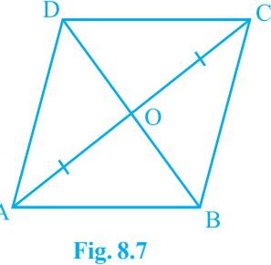

Therefore, ∆ AOD ≅ ∆ COD

(SSS congruence rule)

This gives, ∠ AOD = ∠ COD (CPCT)

But, ∠ AOD + ∠ COD = 180° (Linear pair)

So, 2∠ AOD = 180°

or, ∠ AOD = 90°

So, the diagonals of a rhombus are perpendicular to each other.

**Example 3 :** ABC is an isosceles triangle in which AB = AC. AD bisects exterior angle PAC and CD || AB (see Fig. 8.8). Show that

(i) ∠ DAC = ∠ BCA and (ii) ABCD is a parallelogram.

**Solution :** (i) ∆ ABC is isosceles in which AB = AC (Given)

So, ∠ ABC = ∠ ACB (Angles opposite to equal sides)

Also, ∠ PAC = ∠ ABC + ∠ ACB

(Exterior angle of a triangle)

or, ∠ PAC = 2∠ ACB (1) Now, AD bisects ∠ PAC. So, ∠ PAC = 2∠ DAC (2) Therefore, 2∠ DAC = 2∠ ACB [From (1) and (2)] or, ∠ DAC = ∠ ACB **Fig. 8.8**

(ii) Now, these equal angles form a pair of alternate angles when line segments BC and AD are intersected by a transversal AC.

So, BC || AD

Also, BA || CD (Given)

Now, both pairs of opposite sides of quadrilateral ABCD are parallel.

So, ABCD is a parallelogram.

**Example 4 :** Two parallel lines *l* and *m* are intersected by a transversal *p* (see Fig. 8.9). Show that the quadrilateral formed by the bisectors of interior angles is a rectangle.

**Solution :** It is given that PS || QR and transversal *p* intersects them at points A and C respectively.

The bisectors of ∠ PAC and ∠ ACQ intersect at B and bisectors of ∠ ACR and ∠ SAC intersect at D.

We are to show that quadrilateral ABCD is a rectangle.

Now, ∠ PAC = ∠ ACR

(Alternate angles as *l* || *m* and *p* is a transversal)

So, 1 2 ∠ PAC = 1 2 ∠ ACR

i.e., ∠ BAC = ∠ ACD

These form a pair of alternate angles for lines AB and DC with AC as transversal and they are equal also.

So, AB || DC

Similarly, BC || AD (Considering ∠ ACB and ∠ CAD)

Therefore, quadrilateral ABCD is a parallelogram.

Also, ∠ PAC + ∠ CAS = 180° (Linear pair)

So,

$\begin{array}{c}\includegraphics[height=36.135pt]{Fig1}\end{array}$

or, ∠ BAC + ∠ CAD = 90°

or, ∠ BAD = 90°

So, ABCD is a parallelogram in which one angle is 90°.

Therefore, ABCD is a rectangle.

**Example 5 :** Show that the bisectors of angles of a parallelogram form a rectangle.

**Solution :** Let P, Q, R and S be the points of intersection of the bisectors of ∠ A and ∠ B, ∠ B and ∠ C, ∠ C and ∠ D, and ∠ D and ∠ A respectively of parallelogram ABCD (see Fig. 8.10).

In ∆ ASD, what do you observe?

Since DS bisects ∠ D and AS bisects ∠ A, therefore,

**Fig. 8.10**

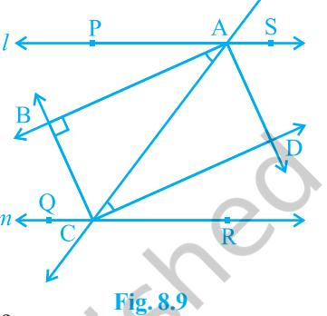

$\angle\,\mathrm{DAS}+\angle\,\mathrm{ADS}=\frac{1}{2}\,\angle\,\mathrm{A}+\frac{1}{2}\angle\,\mathrm{D}$  
  
$=\frac{1}{2}\,\left(\angle\,\mathrm{A}+\angle\,\mathrm{D}\right)$  
  
$=\frac{1}{2}\,\times180^{\circ}$ ($\angle\,\mathrm{A}$ and $\angle\,\mathrm{D}$ are interior angles on the same side of the transversal)  
  
$=90^{\circ}$

Also, ∠ DAS + ∠ ADS + ∠ DSA = 180° (Angle sum property of a triangle) or, 90° + ∠ DSA = 180°

or, ∠ DSA = 90°

So, ∠ PSR = 90° (Being vertically opposite to ∠ DSA)

Similarly, it can be shown that ∠ APB = 90° or ∠ SPQ = 90° (as it was shown for ∠ DSA). Similarly, ∠ PQR = 90° and ∠ SRQ = 90°.

So, PQRS is a quadrilateral in which all angles are right angles.

Can we conclude that it is a rectangle? Let us examine. We have shown that ∠ PSR = ∠ PQR = 90° and ∠ SPQ = ∠ SRQ = 90°. So both pairs of opposite angles are equal.

Therefore, PQRS is a parallelogram in which one angle (in fact all angles) is 90° and so, PQRS is a rectangle.

## **EXERCISE 8.1**

- **1.** If the diagonals of a parallelogram are equal, then show that it is a rectangle.
- **2.** Show that the diagonals of a square are equal and bisect each other at right angles.
- **3.** Diagonal AC of a parallelogram ABCD bisects ∠ A (see Fig. 8.11). Show that
	- (i) it bisects ∠ C also,
	- (ii) ABCD is a rhombus.
- **4.** ABCD is a rectangle in which diagonal AC bisects ∠ A as well as ∠ C. Show that: (i) ABCD is a square (ii) diagonal BD bisects ∠ B as well as ∠ D.

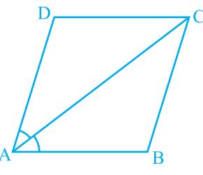

- **5.** In parallelogram ABCD, two points P and Q are taken on diagonal BD such that DP = BQ (see Fig. 8.12). Show that:
	- (i) ∆ APD ≅ ∆ CQB
	- (ii) AP = CQ
	- (iii) ∆ AQB ≅∆ CPD
	- (iv) AQ = CP
	- (v) APCQ is a parallelogram
- **6.** ABCD is a parallelogram and AP and CQ are perpendiculars from vertices A and C on diagonal BD (see Fig. 8.13). Show that
	- (i) ∆ APB ≅ ∆ CQD
	- (ii) AP = CQ

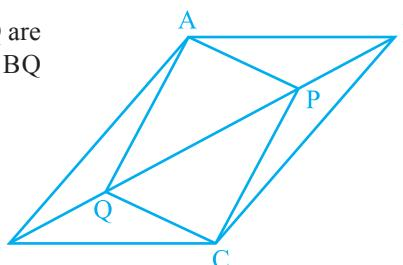

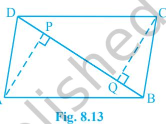

**Fig. 8.14**

### **7.** ABCD is a trapezium in which AB || CD and AD = BC (see Fig. 8.14). Show that

- (i) ∠ A = ∠ B
- (ii) ∠ C = ∠ D
- (iii) ∆ ABC ≅ ∆ BAD
- (iv) diagonal AC = diagonal BD

[*Hint* : Extend AB and draw a line through C parallel to DA intersecting AB produced at E.]

## **8.2The Mid-point Theorem**

You have studied many properties of a triangle as well as a quadrilateral. Now let us study yet another result which is related to the mid-point of sides of a triangle. Perform the following activity.

Draw a triangle and mark the mid-points E and F of two sides of the triangle. Join the points E and F (see Fig. 8.15).

Measure EF and BC. Measure ∠ AEF and ∠ ABC.

What do you observe? You will find that :

$\begin{array}{c}\mbox{EF}=\frac{1}{2}\mbox{BC}\mbox{and}\angle\mbox{AEF}=\angle\mbox{ABC}\\ \mbox{so,}\mbox{EF}\parallel\mbox{BC}\end{array}$

Repeat this activity with some more triangles.

So, you arrive at the following theorem:

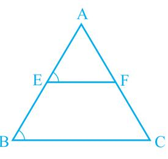

**Fig. 8.15**

**Theorem 8.8 :** *The line segment joining the mid-points of two sides of a triangle is parallel to the third side*.

You can prove this theorem using the following clue:

Observe Fig 8.16 in which E and F are mid-points of AB and AC respectively and CD || BA.

∆ AEF ≅ ∆ CDF (ASA Rule)

So, EF = DF and BE = AE = DC (Why?) Therefore, BCDE is a parallelogram. (Why?) This gives EF || BC.

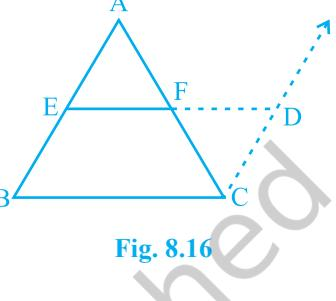

In this case, also note that EF = 1 2 ED = 1 2 BC.

Can you state the converse of Theorem 8.8? Is the converse true?

You will see that converse of the above theorem is also true which is stated as below:

**Theorem 8.9 :** *The line drawn through the mid-point of one side of a triangle, parallel to another side bisects the third side*.

In Fig 8.17, observe that E is the mid-point of AB, line *l* is passsing through E and is parallel to BC and CM || BA.

Prove that AF = CF by using the congruence of ∆ AEF and ∆ CDF.

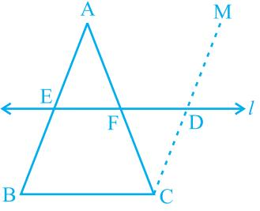

**Fig. 8.17**

**Fig. 8.18**

**Example 6 :** In ∆ ABC, D, E and F are respectively the mid-points of sides AB, BC and CA (see Fig. 8.18). Show that ∆ ABC is divided into four congruent triangles by joining D, E and F.

**Solution :** As D and E are mid-points of sides AB and BC of the triangle ABC, by Theorem 8.8,

DE || AC

Similarly, DF || BC and EF || AB

Therefore ADEF, BDFE and DFCE are all parallelograms.

Now DE is a diagonal of the parallelogram BDFE,

therefore, ∆ BDE ≅ ∆ FED

Similarly ∆ DAF ≅ ∆ FED

and ∆ EFC ≅ ∆ FED

So, all the four triangles are congruent.

**Example 7 :** *l*, *m* and *n* are three parallel lines intersected by transversals *p* and *q* such that *l*, *m* and *n* cut off equal intercepts AB and BC on *p* (see Fig. 8.19). Show that *l*, *m* and *n* cut off equal intercepts DE and EF on *q* also.

**Solution :** We are given that AB = BC and have to prove that DE = EF.

Let us join A to F intersecting *m* at G..

The trapezium ACFD is divided into two triangles; namely ∆ ACF and ∆ AFD.

In ∆ ACF, it is given that B is the mid-point of AC (AB = BC)

and BG || CF (since *m* || *n*).

So, G is the mid-point of AF (by using Theorem 8.9)

Now, in ∆ AFD, we can apply the same argument as G is the mid-point of AF, GE || AD and so by Theorem 8.9, E is the mid-point of DF,

i.e., DE = EF.

In other words, *l*, *m* and *n* cut off equal intercepts on *q* also.

## **EXERCISE 8.2**

- **1.** ABCD is a quadrilateral in which P, Q, R and S are mid-points of the sides AB, BC, CD and DA (see Fig 8.20). AC is a diagonal. Show that :
	- (i) SR || AC and SR = 1 2 AC
	- (ii) PQ = SR
	- (iii) PQRS is a parallelogram.

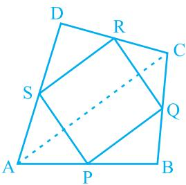

**Fig. 8.20**

# **Fig. 8.19**

- **2.** ABCD is a rhombus and P, Q, R and S are the mid-points of the sides AB, BC, CD and DA respectively. Show that the quadrilateral PQRS is a rectangle.
- **3.** ABCD is a rectangle and P, Q, R and S are mid-points of the sides AB, BC, CD and DA respectively. Show that the quadrilateral PQRS is a rhombus.
- **4.** ABCD is a trapezium in which AB || DC, BD is a diagonal and E is the mid-point of AD. A line is drawn through E parallel to AB intersecting BC at F (see Fig. 8.21). Show that F is the mid-point of BC.

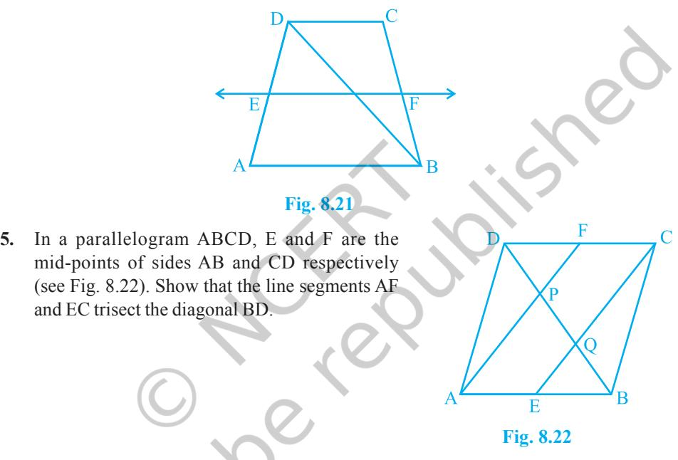

- **6.** ABC is a triangle right angled at C. A line through the mid-point M of hypotenuse AB and parallel to BC intersects AC at D. Show that
	- (i) D is the mid-point of AC (ii) MD ⊥ AC

* [16] A. A. K.  
  

### **8.3 Summary**

In this chapter, you have studied the following points :

- **1.** A diagonal of a parallelogram divides it into two congruent triangles.
- **2.** In a parallelogram,
	- (i) opposite sides are equal (ii) opposite angles are equal
	- (iii) diagonals bisect each other
- **3.** Diagonals of a rectangle bisect each other and are equal and vice-versa.
- **4.** Diagonals of a rhombus bisect each other at right angles and vice-versa.
- **5.** Diagonals of a square bisect each other at right angles and are equal, and vice-versa.
- **6.** The line-segment joining the mid-points of any two sides of a triangle is parallel to the third side and is half of it.
- **7.** A line through the mid-point of a side of a triangle parallel to another side bisects the third side.

