# **CHAPTER 9**

# **CIRCLES**

# **9.1 Angle Subtended by a Chord at a Point**

You have already studied about circles and its parts in Class VI.

Take a line segment PQ and a point R not on the line containing PQ. Join PR and QR (see Fig. 9.1). Then ∠ PRQ is called the angle subtended by the line segment PQ at the point R. What are angles POQ, PRQ and PSQ called in Fig. 9.2? ∠ POQ is the angle subtended by the chord PQ at the centre O, ∠ PRQ and ∠ PSQ are respectively the angles subtended by PQ at points R and S on the major and minor arcs PQ.

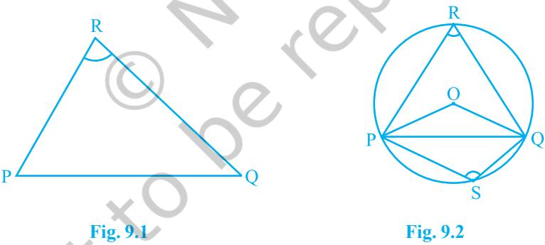

Let us examine the relationship between the size of the chord and the angle subtended by it at the centre. You may see by drawing different chords of a circle and angles subtended by them at the centre that the longer is the chord, the bigger will be the angle subtended by it at the centre. What will happen if you take two equal chords of a circle? Will the angles subtended at the centre be the same or not?

Draw two or more equal chords of a circle and measure the angles subtended by them at the centre (see Fig.9.3). You will find that the angles subtended by them at the centre are equal. Let us give a proof of this fact.

**Theorem 9.1 :** *Equal chords of a circle subtend equal angles at the centre.*

**Proof :** You are given two equal chords AB and CD of a circle with centre O (see Fig.9.4). You want to prove that ∠ AOB = ∠ COD.

In triangles AOB and COD,

|  | OA = | OC | (Radii of a circle) |
| --- | --- | --- | --- |
|  | OB = | OD | (Radii of a circle) |
|  | AB = | CD | (Given) |
| Therefore, | ∆ AOB ≅ | ∆ COD | (SSS rule) |
| This gives | ∠ AOB = | ∠ COD |  |

(Corresponding parts of congruent triangles)

**Remark :** For convenience, the abbreviation CPCT will be used in place of 'Corresponding parts of congruent triangles', because we use this very frequently as you will see.

Now if two chords of a circle subtend equal angles at the centre, what can you say about the chords? Are they equal or not? Let us examine this by the following activity:

Take a tracing paper and trace a circle on it. Cut it along the circle to get a disc. At its centre O, draw an angle AOB where A, B are points on the circle. Make another angle POQ at the centre equal to ∠AOB. Cut the disc along AB and PQ (see Fig. 9.5). You will get two segments ACB and PRQ of the circle. If you put one on the other, what do you observe? They cover each other, i.e., they are congruent. So AB = PQ.

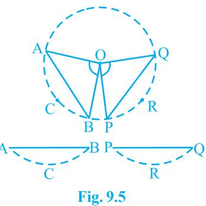

**Fig. 9.3**

**Fig. 9.4**

Though you have seen it for this particular case, try it out for other equal angles too. The chords will all turn out to be equal because of the following theorem:

**Theorem 9.2 :** *If the angles subtended by the chords of a circle at the centre are equal, then the chords are equal.*

The above theorem is the converse of the Theorem 9.1. Note that in Fig. 9.4, if you take ∠ AOB = ∠ COD, then

∆ AOB ≅ ∆ COD (Why?)

Can you now see that AB = CD?

#### **EXERCISE 9.1**

- **1.** Recall that two circles are congruent if they have the same radii. Prove that equal chords of congruent circles subtend equal angles at their centres.
- **2.** Prove that if chords of congruent circles subtend equal angles at their centres, then the chords are equal.

## **9.2 Perpendicular from the Centre to a Chord**

**Activity :** Draw a circle on a tracing paper. Let O be its centre. Draw a chord AB. Fold the paper along a line through O so that a portion of the chord falls on the other. Let the crease cut AB at the point M. Then, ∠ OMA = ∠ OMB = 90° or OM is perpendicular to AB. Does the point B coincide with A (see Fig.9.6)?

Give a proof yourself by joining OA and OB and proving the right triangles OMA and OMB to be congruent. This example is a particular instance of the following result:

**Theorem 9.3 :** *The perpendicular from the centre of a circle to a chord bisects the chord.*

What is the converse of this theorem? To write this, first let us be clear what is assumed in Theorem 9.3 and what is proved. Given that the perpendicular from the centre of a circle to a chord is drawn and to prove that it bisects the chord. Thus in the converse, what the hypothesis is 'if a line from the centre bisects a chord of a circle' and what is to be proved is 'the line is perpendicular to the chord'. So the converse is:

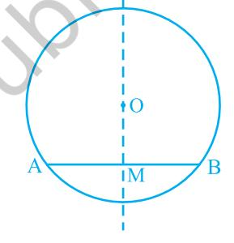

**Fig. 9.6**

**Theorem 9.4 :** *The line drawn through the centre of a circle to bisect a chord is perpendicular to the chord.*

Is this true? Try it for few cases and see. You will see that it is true for these cases. See if it is true, in general, by doing the following exercise. We will write the stages and you give the reasons.

Let AB be a chord of a circle with centre O and O is joined to the mid-point M of AB. You have to prove that OM ⊥ AB. Join OA and OB (see Fig. 9.7). In triangles OAM and OBM,

|  | OA = | OB | (Why ?) |
| --- | --- | --- | --- |
|  | AM = | BM | (Why ?) |
|  | OM = | OM | (Common) |
| Therefore, | ∆OAM ≅ | ∆OBM | (How ?) |
| This gives | ∠OMA = | ∠OMB = 90° | (Why ?) |

**Fig. 9.8**

## **9.3 Equal Chords and their Distances from the Centre**

Let AB be a line and P be a point. Since there are infinite numbers of points on a line, if you join these points to P, you will get infinitely many line segments PL1 , PL2 , PM, PL3 , PL4 , etc. Which of these is the distance of AB from P? You may think a while and get the answer. Out of these line segments, the perpendicular from P to AB, namely PM in Fig. 9.8, will be the least. In Mathematics, we define this least length PM to be **the distance of AB from P**. So you may say that:

*The length of the perpendicular from a point to a line is the distance of the line from the point*.

Note that if the point lies on the line, the distance of the line from the point is zero.

A circle can have infinitely many chords. You may observe by drawing chords of a circle that longer chord is nearer to the centre than the smaller chord. You may observe it by drawing several chords of a circle of different lengths and measuring their distances from the centre. What is the distance of the diameter, which is the longest chord from the centre? Since the centre lies on it, the distance is zero. Do you think that there is some relationship between the length of chords and their distances from the centre? Let us see if this is so.

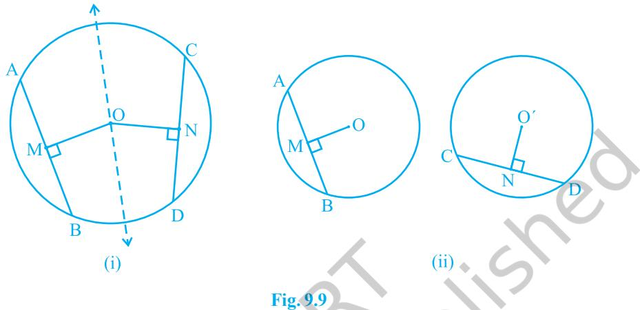

**Activity :** Draw a circle of any radius on a tracing paper. Draw two equal chords AB and CD of it and also the perpendiculars OM and ON on them from the centre O. Fold the figure so that D falls on B and C falls on A [see Fig.9.9 (i)]. You may observe that O lies on the crease and N falls on M. Therefore, OM = ON. Repeat the activity by drawing congruent circles with centres O and O′ and taking equal chords AB and CD one on each. Draw perpendiculars OM and O′N on them [see Fig. 9.9(ii)]. Cut one circular disc and put it on the other so that AB coincides with CD. Then you will find that O coincides with O′ and M coincides with N. In this way you verified the following:

#### **Theorem 9.5 :** *Equal chords of a circle* (*or of congruent circles*) *are equidistant from the centre* (*or centres*)*.*

Next, it will be seen whether the converse of this theorem is true or not. For this, draw a circle with centre O. From the centre O, draw two line segments OL and OM of equal length and lying inside the circle [see Fig. 9.10(i)]. Then draw chords PQ and RS of the circle perpendicular to OL and OM respectively [see Fig 9.10(ii)]. Measure the lengths of PQ and RS. Are these different? No, both are equal. Repeat the activity for more equal line segments and drawing the chords perpendicular to them. This verifies the converse of the Theorem 9.5 which is stated as follows:

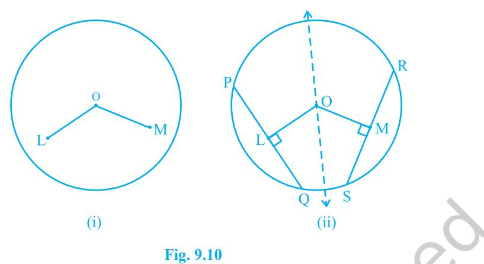

**Example 1 :** If two intersecting chords of a circle make equal angles with the diameter passing through their point of intersection, prove that the chords are equal.

**Solution :** Given that AB and CD are two chords of a circle, with centre O intersecting at a point E. PQ is a diameter through E, such that ∠ AEQ = ∠ DEQ (see Fig.9.11). You have to prove that AB = CD. Draw perpendiculars OL and OM on chords AB and CD, respectively. Now

$$\angleLOE = 180{}^{\circ}-90^{\circ}=\angleLOE = 90{}^{\circ}\angleLOE (Angle sum property of a triangle) = 90{}^{\circ}-\angleAEQ = 90{}^{\circ}-\angleDEQ = 90{}^{\circ}-\angleMEQ = \angleMOE$$

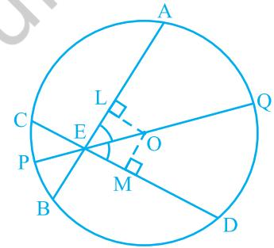

**Fig. 9.11**

In triangles OLE and OME,

|  | ∠ LEO = | ∠ MEO | (Why ?) |
| --- | --- | --- | --- |
|  | ∠ LOE = | ∠ MOE | (Proved above) |
|  | EO = | EO | (Common) |
| Therefore, | ∆ OLE ≅ | ∆ OME | (Why ?) |
| This gives | OL = | OM | (CPCT) |
| So, | AB = | CD | (Why ?) |

### **EXERCISE 9.2**

- **1.** Two circles of radii 5 cm and 3 cm intersect at two points and the distance between their centres is 4 cm. Find the length of the common chord.
- **2.** If two equal chords of a circle intersect within the circle, prove that the segments of one chord are equal to corresponding segments of the other chord.
- **3.** If two equal chords of a circle intersect within the circle, prove that the line joining the point of intersection to the centre makes equal angles with the chords.
- **4.** If a line intersects two concentric circles (circles with the same centre) with centre O at A, B, C and D, prove that AB = CD (see Fig. 9.12).
- **5.** Three girls Reshma, Salma and Mandip are playing a game by standing on a circle of radius 5m drawn in a park. Reshma throws a ball to Salma, Salma to Mandip, Mandip to Reshma. If the distance between Reshma and Salma and between Salma and Mandip is 6m each, what is the distance between Reshma and Mandip?

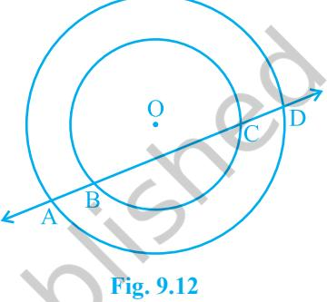

- **6.** A circular park of radius 20m is situated in a colony. Three boys Ankur, Syed and David are sitting at equal distance on its boundary each having a toy telephone in his hands to talk each other. Find the length of the string of each phone.
#### **9.4Angle Subtended by an Arc of a Circle**

You have seen that the end points of a chord other than diameter of a circle cuts it into two arcs – one major and other minor. If you take two equal chords, what can you say about the size of arcs? Is one arc made by first chord equal to the corresponding arc made by another chord? In fact, they are more than just equal in length. They are congruent in the sense that if one arc is put on the other, without bending or twisting, one superimposes the other completely.

You can verify this fact by cutting the arc, corresponding to the chord CD from the circle along CD and put it on the corresponding arc made by equal chord AB. You will find that the arc CD superimpose the arc AB completely (see Fig. 9.13). This shows that equal chords make congruent arcs and conversely congruent arcs make equal chords of a circle. You can state it as follows:

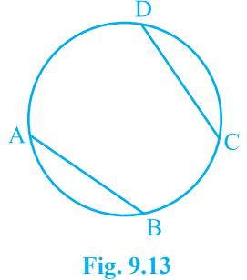

*If two chords of a circle are equal, then their corresponding arcs are congruent and conversely, if two arcs are congruent, then their corresponding chords are equal.*

Also the angle subtended by an arc at the centre is defined to be angle subtended by the corresponding chord at the centre in the sense that the minor arc subtends the angle and the major arc subtends the reflex angle. Therefore, in Fig 9.14, the angle subtended by the minor arc PQ at O is ∠POQ and the angle subtended by the major arc PQ at O is reflex angle POQ.

 In view of the property above and Theorem 9.1, the following result is true:

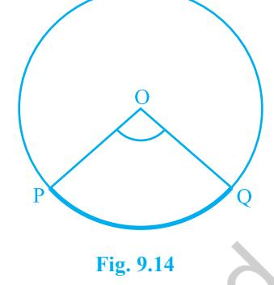

*Congruent arcs* (*or equal arcs*) *of a circle subtend equal angles at the centre.*

Therefore, the angle subtended by a chord of a circle at its centre is equal to the angle subtended by the corresponding (minor) arc at the centre. The following theorem gives the relationship between the angles subtended by an arc at the centre and at a point on the circle.

**Theorem 9.7 :** *The angle subtended by an arc at the centre is double the angle subtended by it at any point on the remaining part of the circle.*

**Proof :** Given an arc PQ of a circle subtending angles POQ at the centre O and PAQ at a point A on the remaining part of the circle. We need to prove that ∠ POQ = 2 ∠ PAQ.

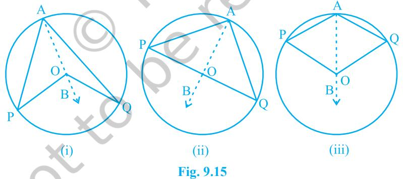

Consider the three different cases as given in Fig. 9.15. In (i), arc PQ is minor; in (ii), arc PQ is a semicircle and in (iii), arc PQ is major.

Let us begin by joining AO and extending it to a point B.

In all the cases,

$$\angle\mathrm{\BOQ}=\angle\mathrm{\OAQ}+\angle\mathrm{\AO}$$

because an exterior angle of a triangle is equal to the sum of the two interior opposite angles.

Also in ∆ OAQ,

| OA = OQ |  | (Radii of a circle) |
| --- | --- | --- |
| ∠ OAQ = ∠ OQA Therefore, |  | (Theorem 7.5) |
| ∠ BOQ = This gives | 2 ∠ OAQ | (1) |
| Similarly, ∠ BOP = | 2 ∠ OAP | (2) |
| From (1) and (2), ∠ BOP + ∠ BOQ = 2(∠ OAP + ∠ OAQ) |  |  |
| ∠ POQ = 2 ∠ PAQ This is the same as |  | (3) |
| For the case (iii), where PQ is the major arc, (3) is replaced by |  |  |
| 2 ∠ PAQ reflex angle POQ = |  |  |
| Remark : Suppose we join points P and Q and |  |  |
| form a chord PQ in the above figures. Then |  |  |
| ∠ PAQ is also called the angle formed in the |  |  |
| segment PAQP. |  |  |
| In Theorem 9.7, A can be any point on the |  |  |
| remaining part of the circle. So if you take any |  |  |
| other point C on the remaining part of the circle |  |  |
| (see Fig. 9.16), you have |  | Fig. 9.16 |
| ∠ POQ = 2 ∠ PCQ = 2 ∠ PAQ |  |  |
| ∠ PCQ = ∠ PAQ. Therefore, |  |  |
| This proves the following: |  |  |
| Theorem 9.8 : Angles in the same segment of a circle are equal. |  |  |
| Again let us discuss the case (ii) of Theorem 10.8 separately. Here ∠PAQ is an angle |  |  |
| 1 in the segment, which is a semicircle. Also, ∠ PAQ = ∠ POQ = |  | 1 × 180° = 90°. |
| 2 |  | 2 |
| If you take any other point C on the semicircle, again you get that |  |  |
| ∠ PCQ = 90° |  |  |
| Therefore, you find another property of the circle as: |  |  |
| Angle in a semicircle is a right angle. |  |  |
| The converse of Theorem 9.8 is also true. It can be stated as: |  |  |
| Theorem 9.9 : If a line segment joining two points subtends equal angles at two |  |  |
| other points lying on the same side of the line containing the line segment, the |  |  |

*four points lie on a circle* (*i.e. they are concyclic*)*.*

You can see the truth of this result as follows:

In Fig. 9.17, AB is a line segment, which subtends equal angles at two points C and D. That is

$$\angle\,\mathrm{ACB}=\ \angle\,\mathrm{ADB}$$

To show that the points A, B, C and D lie on a circle let us draw a circle through the points A, C and B. Suppose it does not pass through the point D. Then it will intersect AD (or extended AD) at a point, say E (or E′).

If points A, C, E and B lie on a circle,

∠ ACB = ∠ AEB (Why?)

But it is given that ∠ ACB = ∠ ADB.

Therefore, ∠ AEB = ∠ ADB.

This is not possible unless E coincides with D. (Why?)

Similarly, E′ should also coincide with D.

## **9.5 Cyclic Quadrilaterals**

A quadrilateral ABCD is called *cyclic* if all the four vertices of it lie on a circle (see Fig 9.18). You will find a peculiar property in such quadrilaterals. Draw several cyclic quadrilaterals of different sides and name each of these as ABCD. (This can be done by drawing several circles of different radii and taking four points on each of them.) Measure the opposite angles and write your observations in the following table.

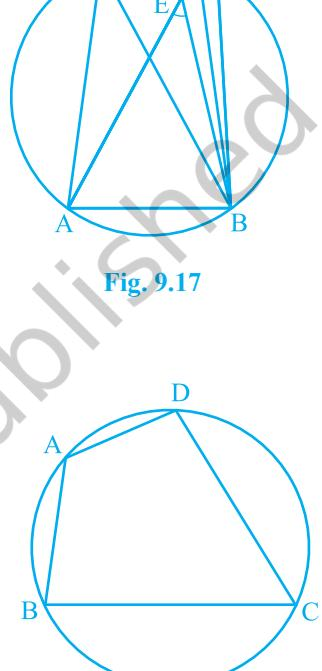

**Fig. 9.18**

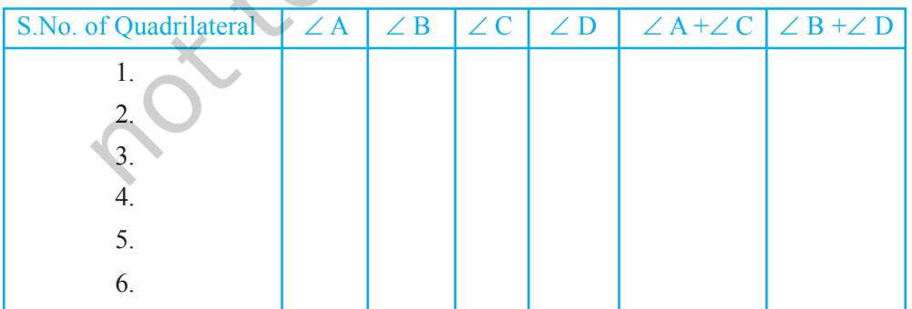

What do you infer from the table?

You find that ∠A + ∠C = 180° and ∠B + ∠D = 180°, neglecting the error in measurements. This verifies the following:

**Theorem 9.10 :** *The sum of either pair of opposite angles of a cyclic quadrilateral is* 180º.

In fact, the converse of this theorem, which is stated below is also true.

**Theorem 9.11 :** *If the sum of a pair of opposite angles of a quadrilateral is* 180º, *the quadrilateral is cyclic.*

You can see the truth of this theorem by following a method similar to the method adopted for Theorem 9.9.

**Example 2 :** In Fig. 9.19, AB is a diameter of the circle, CD is a chord equal to the radius of the circle. AC and BD when extended intersect at a point E. Prove that ∠ AEB = 60°.

**Solution :** Join OC, OD and BC. Triangle ODC is equilateral (Why?) Therefore, ∠ COD = 60° Now, ∠ CBD = 1 2 ∠ COD (Theorem 9.7) This gives ∠ CBD = 30° Again, ∠ ACB = 90° (Why ?) So, ∠ BCE = 180° – ∠ ACB = 90° Which gives ∠ CEB = 90° – 30° = 60°, i.e., ∠ AEB = 60° **Example 3 :** In Fig 9.20, ABCD is a cyclic quadrilateral in which AC and BD are its diagonals. If ∠ DBC = 55° and ∠ BAC = 45°, find ∠ BCD. **Solution :** ∠ CAD = ∠ DBC = 55° (Angles in the same segment) Therefore, ∠ DAB = ∠ CAD + ∠ BAC = 55° + 45° = 100° But ∠ DAB + ∠ BCD = 180° (Opposite angles of a cyclic quadrilateral) So, ∠ BCD = 180° – 100° = 80° **Fig. 9.19 Fig. 9.20**

**Example 4 :** Two circles intersect at two points A and B. AD and AC are diameters to the two circles (see Fig. 9.21). Prove that B lies on the line segment DC.

**Solution :** Join AB.

∠ ABD = 90° (Angle in a semicircle) ∠ ABC = 90° (Angle in a semicircle)

So, $\angle$ ABD + $\angle$ ABC = 90${}^{\circ}$ + 90${}^{\circ}$ = 180${}^{\circ}$.  
  

Therefore, DBC is a line. That is B lies on the line segment DC.

**Example 5 :** Prove that the quadrilateral formed (if possible) by the internal angle bisectors of any quadrilateral is cyclic.

**Solution :** In Fig. 9.22, ABCD is a quadrilateral in which the angle bisectors AH, BF, CF and DH of internal angles A, B, C and D respectively form a quadrilateral EFGH.

Now, ∠ FEH = ∠ AEB = 180° – ∠ EAB – ∠ EBA (Why ?) = 180° – 1 2 (∠ A + ∠ B) **Fig. 9.22**

and $\angle$ FGH = $\angle$ CGD = 180${}^{\circ}$ = 2GCD - (GDC) (Why?)

$\left(\begin{array}{c}\includegraphics[height=36.135pt]{fig1}\end{array}\right)$

Therefore, $\angle$ FEH + $\angle$ FGH = 180${}^{\circ}$ ($\angle$ A + $\angle$ B) + 180${}^{\circ}$ - $\frac{1}{2}$ ($\angle$ C + $\angle$ D) 360${}^{\circ}$ - $\frac{1}{2}$ ($\angle$ A + $\angle$ B + $\angle$ C + $\angle$ D) = 360${}^{\circ}$ - $\frac{1}{2}$ $\times$ 360${}^{\circ}$ - 180${}^{\circ}$ = 180${}^{\circ}$

Therefore, by Theorem 9.11, the quadrilateral EFGH is cyclic.

#### **EXERCISE 9.3**

- **1.** In Fig. 9.23, A,B and C are three points on a circle with centre O such that ∠ BOC = 30° and ∠ AOB = 60°. If D is a point on the circle other than the arc ABC, find ∠ADC.
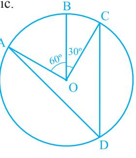

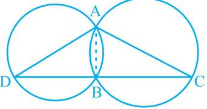

- **2.** A chord of a circle is equal to the radius of the circle. Find the angle subtended by the chord at a point on the minor arc and also at a point on the major arc.
- **3.** In Fig. 9.24, ∠ PQR = 100°, where P, Q and R are points on a circle with centre O. Find ∠ OPR.

- **4.** In Fig. 9.25, ∠ ABC = 69°, ∠ ACB = 31°, find ∠ BDC.
- **5.** In Fig. 9.26, A, B, C and D are four points on a circle. AC and BD intersect at a point E such that ∠ BEC = 130° and ∠ ECD = 20°. Find ∠ BAC.
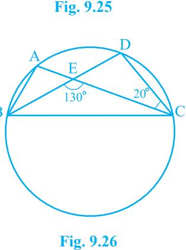

**Fig. 9.24**

- **6.** ABCD is a cyclic quadrilateral whose diagonals intersect at a point E. If ∠ DBC = 70°, ∠ BAC is 30°, find ∠ BCD. Further, if AB = BC, find ∠ ECD.
- **7.** If diagonals of a cyclic quadrilateral are diameters of the circle through the vertices of the quadrilateral, prove that it is a rectangle.
- **8.** If the non-parallel sides of a trapezium are equal, prove that it is cyclic.

- **9.** Two circles intersect at two points B and C. Through B, two line segments ABD and PBQ are drawn to intersect the circles at A, D and P, Q respectively (see Fig. 9.27). Prove that ∠ACP = ∠ QCD.
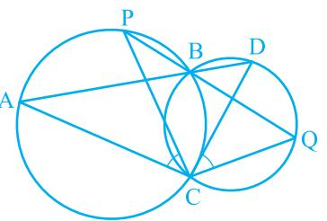

- **10.** If circles are drawn taking two sides of a triangle as diameters, prove that the point of intersection of these circles lie on the third side.
- **11.** ABC and ADC are two right triangles with common hypotenuse AC. Prove that ∠ CAD = ∠ CBD.
- **12.** Prove that a cyclic parallelogram is a rectangle.

## **9.6 Summary**

In this chapter, you have studied the following points:

- **1.** A circle is the collection of all points in a plane, which are equidistant from a fixed point in the plane.
- **2.** Equal chords of a circle (or of congruent circles) subtend equal angles at the centre.
- **3.** If the angles subtended by two chords of a circle (or of congruent circles) at the centre (corresponding centres) are equal, the chords are equal.
- **4.** The perpendicular from the centre of a circle to a chord bisects the chord.
- **5.** The line drawn through the centre of a circle to bisect a chord is perpendicular to the chord.
- **6.** Equal chords of a circle (or of congruent circles) are equidistant from the centre (or corresponding centres).
- **7.** Chords equidistant from the centre (or corresponding centres) of a circle (or of congruent circles) are equal.
- **8.** If two arcs of a circle are congruent, then their corresponding chords are equal and conversely if two chords of a circle are equal, then their corresponding arcs (minor, major) are congruent.
- **9.** Congruent arcs of a circle subtend equal angles at the centre.
- **10.** The angle subtended by an arc at the centre is double the angle subtended by it at any point on the remaining part of the circle.
- **11.** Angles in the same segment of a circle are equal.
- **12.** Angle in a semicircle is a right angle.
- **13.** If a line segment joining two points subtends equal angles at two other points lying on the same side of the line containing the line segment, the four points lie on a circle.
- **14.** The sum of either pair of opposite angles of a cyclic quadrilateral is 1800 .
- **15.** If sum of a pair of opposite angles of a quadrilateral is 1800 , the quadrilateral is cyclic.

