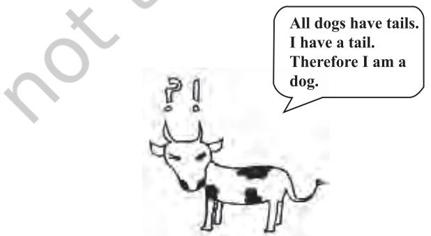
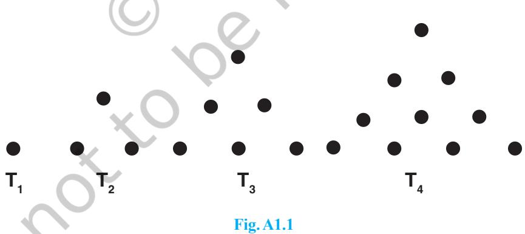
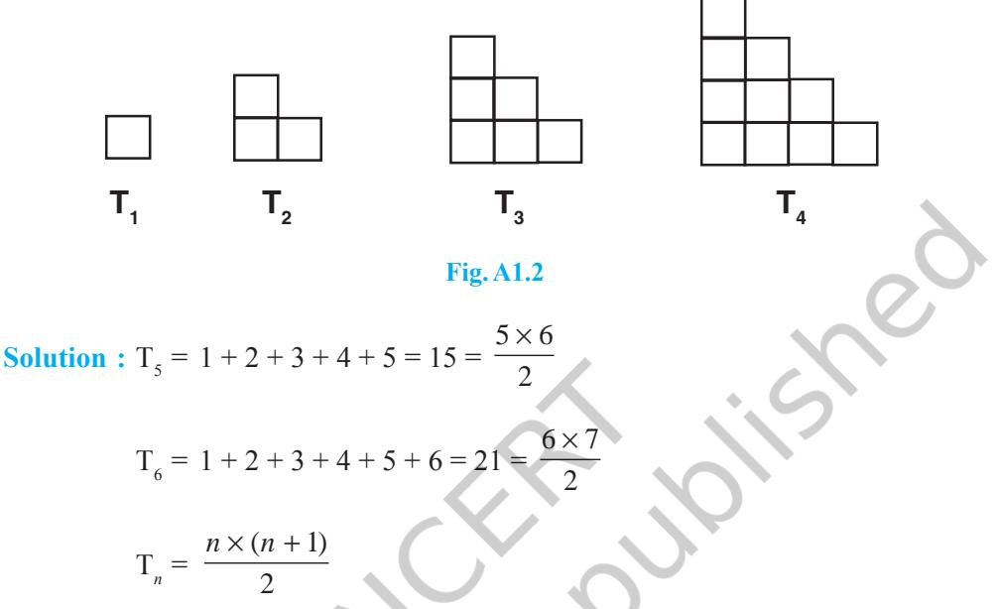
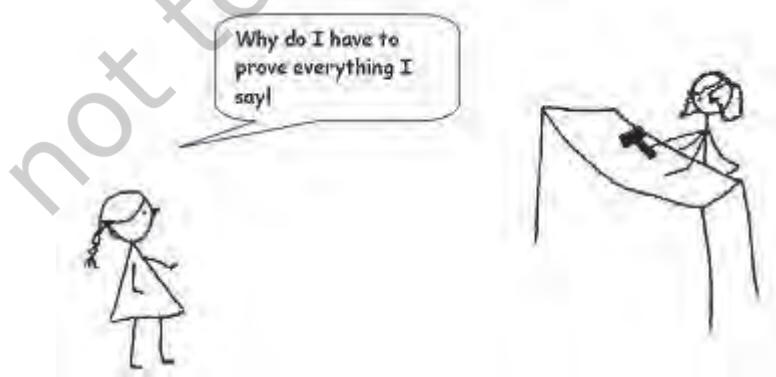
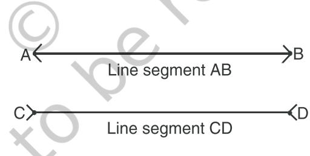
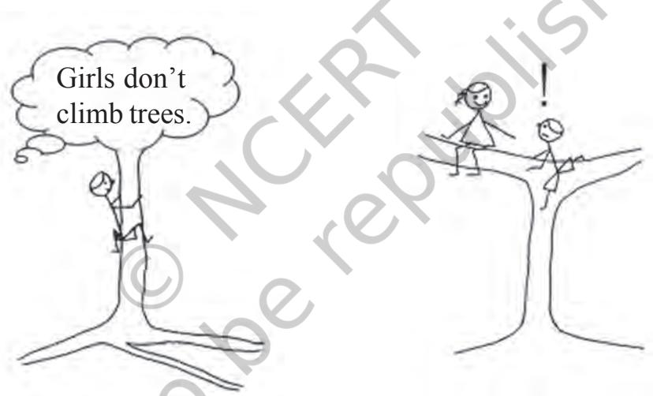
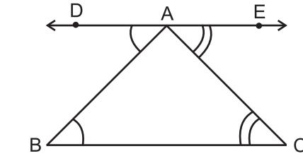
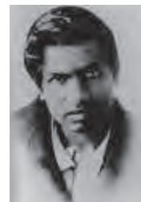

# **APPENDIX 1**

## **PROOFS IN MATHEMATICS**

## **A1.1 Introduction**

Suppose your family owns a plot of land and there is no fencing around it. Your neighbour decides one day to fence off his land. After he has fenced his land, you discover that a part of your family's land has been enclosed by his fence. How will you prove to your neighbour that he has tried to encroach on your land? Your first step may be to seek the help of the village elders to sort out the difference in boundaries. But, suppose opinion


is divided among the elders. Some feel you are right and others feel your neighbour is right. What can you do? Your only option is to find a way of establishing your claim for the boundaries of your land that is acceptable to all. For example, a government approved survey map of your village can be used, if necessary in a court of law, to prove (claim) that you are correct and your neighbour is wrong.

PROOFS IN MATHEMATICS 167

Let us look at another situation. Suppose your mother has paid the electricity bill of your house for the month of August, 2005. The bill for September, 2005, however, claims that the bill for August has not been paid. How will you disprove the claim made by the electricity department? You will have to produce a receipt proving that your August bill has been paid.

You have just seen some examples that show that in our daily life we are often called upon to prove that a certain statement or claim is true or false. However, we also accept many statements without bothering to prove them. But, in mathematics we only accept a statement as true or false (except for some axioms) if it has been proved to be so, according to the logic of mathematics.

In fact, proofs in mathematics have been in existence for thousands of years, and they are central to any branch of mathematics. The first known proof is believed to have been given by the Greek philosopher and mathematician Thales. While mathematics was central to many ancient civilisations like Mesopotamia, Egypt, China and India, there is no clear evidence that they used proofs the way we do today.

In this chapter, we will look at what a statement is, what kind of reasoning is involved in mathematics, and what a mathematical proof consists of.

### **A1.2 Mathematically Acceptable Statements**

In this section, we shall try to explain the meaning of a mathematically acceptable statement. A 'statement' is a sentence which is not an order or an exclamatory sentence. And, of course, a statement is not a question! For example,

"What is the colour of your hair?" is not a statement, it is a question.

"Please go and bring me some water." is a request or an order, not a statement.

"What a marvellous sunset!" is an exclamatory remark, not a statement.

However, "The colour of your hair is black" is a statement.

In general, statements can be one of the following:

- *always true*
- *always false*
- *ambiguous*

The word 'ambiguous' needs some explanation. There are two situations which make a statement ambiguous. The first situation is when we cannot decide if the statement is always true or always false. For example, "Tomorrow is Thursday" is ambiguous, since enough of a context is not given to us to decide if the statement is true or false.

The second situation leading to ambiguity is when the statement is subjective, that is, it is true for some people and not true for others. For example, "Dogs are intelligent" is ambiguous because some people believe this is true and others do not.

**Example 1 :** State whether the following statements are always true, always false or ambiguous. Justify your answers.

- (i) There are 8 days in a week.
- (ii) It is raining here.
- (iii) The sun sets in the west.
- (iv) Gauri is a kind girl.
- (v) The product of two odd integers is even.
- (vi) The product of two even natural numbers is even.

#### **Solution :**

- (i) This statement is always false, since there are 7 days in a week.
- (ii) This statement is ambiguous, since it is not clear where 'here' is.
- (iii) This statement is always true. The sun sets in the west no matter where we live.
- (iv) This statement is ambiguous, since it is subjective–Gauri may be kind to some and not to others.
- (v) This statement is always false. The product of two odd integers is always odd.
- (vi) This statement is always true. However, to justify that it is true we need to do some work. It will be proved in Section A1.4.

As mentioned before, in our daily life, we are not so careful about the validity of statements. For example, suppose your friend tells you that in July it rains everyday in Manantavadi, Kerala. In all probability, you will believe her, even though it may not have rained for a day or two in July. Unless you are a lawyer, you will not argue with her!

As another example, consider statements we often make to each other like "it is very hot today". We easily accept such statements because we know the context even though these statements are ambiguous. 'It is very hot today' can mean different things to different people because what is very hot for a person from Kumaon may not be hot for a person from Chennai.


But a mathematical statement cannot be ambiguous. *In mathematics, a statement is only acceptable or valid, if it is either true or false.* We say that a statement is true, if it is always true otherwise it is called a false statement.

For example, 5 + 2 = 7 is always true, so '5 + 2 = 7' is a true statement and 5 + 3 = 7 is a false statement.

**Example 2 :** State whether the following statements are true or false:

- (i) The sum of the interior angles of a triangle is 180°.
- (ii) Every odd number greater than 1 is prime.
- (iii) For any real number *x*, 4*x* + *x* = 5*x*.
- (iv) For every real number *x*, 2*x* > *x*.
- (v) For every real number *x*, *x* 2 ≥ *x*.
- (vi) If a quadrilateral has all its sides equal, then it is a square.

**Solution :**

- (i) This statement is true. You have already proved this in Chapter 6.
- (ii) This statement is false; for example, 9 is not a prime number.
- (iii) This statement is true.
- (iv) This statement is false; for example, 2 × (–1) = –2, and 2 is not greater than –1.
- (v) This statement is false; for example, 1 2 = 2 1 4 , and 1 4 is not greater than 1 2 .

(vi) This statement is false, since a rhombus has equal sides but need not be a square.

You might have noticed that to establish that a statement is not true according to mathematics, all we need to do is to find one case or example where it breaks down. So in (ii), since 9 is not a prime, it is an example that shows that the statement "Every odd number greater than 1 is prime" is not true. Such an example, that counters a statement, is called a *counter-example.* We shall discuss counter-examples in greater detail in Section A1.5.

You might have also noticed that while Statements (iv), (v) and (vi) are false, they can be restated with some conditions in order to make them true.

**Example 3 :** Restate the following statements with appropriate conditions, so that they become true statements.

- (i) For every real number *x*, 2*x* > *x*.
- (ii) For every real number *x*, *x* 2 ≥ *x*.
- (iii) If you divide a number by itself, you will always get 1.
- (iv) The angle subtended by a chord of a circle at a point on the circle is 90°.
- (v) If a quadrilateral has all its sides equal, then it is a square.

#### **Solution :**

- (i) If *x* > 0, then 2*x* > *x*.
- (ii) If *x* ≤ 0 or *x* ≥ 1, then *x* 2 ≥ *x*.
- (iii) If you divide a number except zero by itself, you will always get 1.
- (iv) The angle subtended by a diameter of a circle at a point on the circle is 90°.
- (v) If a quadrilateral has all its sides and interior angles equal, then it is a square.

### **EXERCISE A1.1**

- **1.** State whether the following statements are always true, always false or ambiguous. Justify your answers.
	- (i) There are 13 months in a year.
	- (ii) Diwali falls on a Friday.
	- (iii) The temperature in Magadi is 260 C.
	- (iv) The earth has one moon.
	- (v) Dogs can fly.
	- (vi) February has only 28 days.
- **2.** State whether the following statements are true or false. Give reasons for your answers.
	- (i) The sum of the interior angles of a quadrilateral is 350°.
	- (ii) For any real number *x*, *x* 2 ≥ 0.
	- (iii) A rhombus is a parallelogram.
	- (iv) The sum of two even numbers is even.
	- (v) The sum of two odd numbers is odd.
- **3.** Restate the following statements with appropriate conditions, so that they become true statements.
	- (i) All prime numbers are odd.
	- (ii) Two times a real number is always even.
	- (iii) For any *x*, 3*x* +1 > 4.
	- (iv) For any *x*, *x* 3 ≥ 0.
	- (v) In every triangle, a median is also an angle bisector.

#### **A1.3 Deductive Reasoning**

The main logical tool used in establishing the truth of an **unambiguous** statement is *deductive reasoning.* To understand what deductive reasoning is all about, let us begin with a puzzle for you to solve.

You are given four cards. Each card has a number printed on one side and a letter on the other side.


Suppose you are told that these cards follow the rule:

"If a card has an even number on one side, then it has a vowel on the other side."

What is the **smallest number** of cards you need to turn over to check if the rule is true?

Of course, you have the option of turning over all the cards and checking. But can you manage with turning over a fewer number of cards?

Notice that the statement mentions that a card with an even number on one side has a vowel on the other. It does not state that a card with a vowel on one side must have an even number on the other side. That may or may not be so. The rule also does not state that a card with an odd number on one side must have a consonant on the other side. It may or may not.

So, do we need to turn over 'A'? No! Whether there is an even number or an odd number on the other side, the rule still holds.

What about '5'? Again we do not need to turn it over, because whether there is a vowel or a consonant on the other side, the rule still holds.

But you do need to turn over V and 6. If V has an even number on the other side, then the rule has been broken. Similarly, if 6 has a consonant on the other side, then the rule has been broken.

The kind of reasoning we have used to solve this puzzle is called **deductive reasoning***.* It is called 'deductive' because we arrive at (i.e., deduce or infer) a result or a statement from a previously established statement using logic. For example, in the puzzle above, by a series of logical arguments we deduced that we need to turn over only V and 6.

Deductive reasoning also helps us to conclude that a particular statement is true, because it is a special case of a more general statement that is known to be true. For example, once we prove that the product of two odd numbers is always odd, we can immediately conclude (without computation) that 70001 × 134563 is odd simply because 70001 and 134563 are odd.

Deductive reasoning has been a part of human thinking for centuries, and is used all the time in our daily life. For example, suppose the statements "The flower Solaris blooms, only if the maximum temperature is above 28° C on the previous day" and "Solaris bloomed in Imaginary Valley on 15th September, 2005" are true. Then using deductive reasoning, we can conclude that the maximum temperature in Imaginary Valley on 14th September, 2005 was more than 28° C.

Unfortunately we do not always use correct reasoning in our daily life! We often come to many conclusions based on faulty reasoning. For example, if your friend does not smile at you one day, then you may conclude that she is angry with you. While it may be true that "if she is angry with me, she will not smile at me", it may also be true that "if she has a bad headache, she will not smile at me". Why don't you examine some conclusions that you have arrived at in your day-to-day existence, and see if they are based on valid or faulty reasoning?

## **EXERCISE A1.2**

- **1.** Use deductive reasoning to answer the following:
	- (i) Humans are mammals. All mammals are vertebrates. Based on these two statements, what can you conclude about humans?
	- (ii) Anthony is a barber. Dinesh had his hair cut. Can you conclude that Antony cut Dinesh's hair?
	- (iii) Martians have red tongues. Gulag is a Martian. Based on these two statements, what can you conclude about Gulag?
	- (iv) If it rains for more than four hours on a particular day, the gutters will have to be cleaned the next day. It has rained for 6 hours today. What can we conclude about the condition of the gutters tomorrow?
	- (v) What is the fallacy in the cow's reasoning in the cartoon below?



- **2.** Once again you are given four cards. Each card has a number printed on one side and a letter on the other side. Which are the only two cards you need to turn over to check whether the following rule holds?
"If a card has a consonant on one side, then it has an odd number on the other side."


## **A1.4 Theorems, Conjectures and Axioms**

So far we have discussed statements and how to check their validity. In this section, you will study how to distinguish between the three different kinds of statements mathematics is built up from, namely, a theorem, a conjecture and an axiom.

You have already come across many theorems before. So, what is a theorem? A mathematical statement whose truth has been established (proved) is called a *theorem*. For example, the following statements are theorems, as you will see in Section A1.5.

**Theorem A1.1 :** *The sum of the interior angles of a triangle is* 180º.

**Theorem A1.2 :** *The product of two even natural numbers is even.*

**Theorem A1.3 :** *The product of any three consecutive even natural numbers is divisible by* 16.

A *conjecture* is a statement which we believe is true, based on our mathematical understanding and experience, that is, our mathematical intuition. The conjecture may turn out to be true or false. If we can prove it, then it becomes a theorem. Mathematicians often come up with conjectures by looking for patterns and making intelligent mathematical guesses. Let us look at some patterns and see what kind of intelligent guesses we can make.

**Example 4 :** Take any three consecutive even numbers and add them, say,

2 + 4 + 6 = 12, 4 + 6 + 8 = 18, 6 + 8 + 10 = 24, 8 +10 + 12 = 30, 20 + 22 + 24 = 66. Is there any pattern you can guess in these sums? What can you conjecture about them?

**Solution :** One conjecture could be :

- (i) the sum of three consecutive even numbers is even.
Another could be :

(ii) the sum of three consecutive even numbers is divisible by 6.

| Line | Sum of numbers | 1 | 1 | 1 |  |  |  |  |  |  |  |  |
| --- | --- | --- | --- | --- | --- | --- | --- | --- | --- | --- | --- | --- |
| 2 | 1 | 1 | 2 | 3 | 1 | 2 | 1 | 4 |  |  |  |  |
| 4 | 1 | 3 | 3 | 1 | 8 | 5 | 1 | 4 | 6 | 4 | 1 | 16 |
| 6 | 1 | 5 | 10 | 10 | 5 | 1 | 32 | 7 | : | : | : |  |
| 8 | : | : | : |  |  |  |  |  |  |  |  |  |

**Example 5 :** Consider the following pattern of numbers called the Pascal's Triangle:

What can you conjecture about the sum of the numbers in Lines 7 and 8? What about the sum of the numbers in Line 21? Do you see a pattern? Make a guess about a formula for the sum of the numbers in line *n*.

**Solution :** Sum of the numbers in Line 7 = 2 × 32 = 64 = 26

Sum of the numbers in Line 8 = 2 × 64 = 128 = 27

Sum of the numbers in Line 21 = 220

Sum of the numbers in Line *n* = 2*n* –1

**Example 6 :** Consider the so-called triangular numbers Tn :



The dots here are arranged in such a way that they form a triangle. Here T1 = 1, T2 = 3, T3 = 6, T4 = 10, and so on. Can you guess what T5 is? What about T6 ? What about Tn ?

Make a conjecture about Tn .

It might help if you redraw them in the following way.



A favourite example of a conjecture that has been open (that is, it has not been proved to be true or false) is the Goldbach conjecture named after the mathematician Christian Goldbach (1690 – 1764). This conjecture states that "*every even integer greater than* 4 *can be expressed as the sum of two odd primes*." Perhaps you will prove that this result is either true or false, and will become famous!

You might have wondered – do we need to prove everything we encounter in mathematics, and if not, why not?



The fact is that every area in mathematics is based on some statements which are assumed to be true and are not proved. These are 'self-evident truths' which we take to be true without proof. These statements are called *axioms*. In Chapter 5, you would have studied the axioms and postulates of Euclid. (We do not distinguish between axioms and postulates these days.)

For example, the first postulate of Euclid states:

*A straight line may be drawn from any point to any other point.*

And the third postulate states:

*A circle may be drawn with any centre and any radius.*

These statements appear to be perfectly true and Euclid assumed them to be true. Why? This is because we cannot prove everything and we need to start somewhere. We need some statements which we accept as true and then we can build up our knowledge using the rules of logic based on these axioms.

You might then wonder why we don't just accept all statements to be true when they appear self-evident. There are many reasons for this. Very often our intuition can be wrong, pictures or patterns can deceive and the only way to be sure that something is true is to prove it. For example, many of us believe that if a number is multiplied by another, the result will be larger than both the numbers. But we know that this is not always true: for example, 5 × 0.2 = 1, which is less than 5.

Also, look at the Fig. A1.3. Which line segment is longer, AB or CD?



#### **Fig. A1.3**

It turns out that both are of exactly the same length, even though AB appears shorter!

You might wonder then, about the validity of axioms. Axioms have been chosen based on our intuition and what appears to be self-evident. Therefore, we expect them to be true. However, it is possible that later on we discover that a particular axiom is not true. What is a safeguard against this possibility? We take the following steps:

- (i) Keep the axioms to the bare minimum. For instance, based on only axioms and five postulates of Euclid, we can derive hundreds of theorems.
- (ii) Make sure the axioms are consistent.
We say a collection of axioms is *inconsistent,* if we can use one axiom to show that another axiom is not true. For example, consider the following two statements. We will show that they are inconsistent.

Statement1: No whole number is equal to its successor.

Statement 2: A whole number divided by zero is a whole number.

(Remember, **division by zero is not defined**. But just for the moment, we assume that it is possible, and see what happens.)

From Statement 2, we get 1 0 = *a* , where *a* is some whole number. This implies that, 1 = 0. But this disproves Statement 1, which states that no whole number is equal to its successor.

- (iii) A false axiom will, sooner or later, result in a contradiction. We say that *there is a contradiction, when we find a statement such that, both the statement and its negation are true*. For example, consider Statement 1 and Statement 2 above once again.
From Statement 1, we can derive the result that 2 ≠ 1.

Now look at *x* 2 – *x*2 . We will factorise it in two different ways as follows:

(1) $\pi^{2}-\pi^{2}=\pi(\pi-\pi)$ and 

(ii) $\pi^{2}-\pi^{2}$ ($\pi^{2}-\pi^{2}$)

So, $ x(x-x)\equiv(x+x)(x-x)$.  

From Statement 2, we can cancel (*x* – *x*) from both sides.

We get *x* = 2*x*, which in turn implies 2 = 1.

So we have both the statement 2 ≠ 1 and its negation, 2 = 1, true. This is a contradiction. The contradiction arose because of the false axiom, that a whole number divided by zero is a whole number.

So, the statements we choose as axioms require a lot of thought and insight. We must make sure they do not lead to inconsistencies or logical contradictions. Moreover, the choice of axioms themselves, sometimes leads us to new discoveries. From Chapter 5, you are familiar with Euclid's fifth postulate and the discoveries of non-Euclidean geometries. You saw that mathematicians believed that the fifth postulate need not be a postulate and is actually a theorem that can be proved using just the first four postulates. Amazingly these attempts led to the discovery of non-Euclidean geometries.

We end the section by recalling the differences between an axiom, a theorem and a conjecture. An **axiom** is a mathematical statement which is assumed to be true without proof; a **conjecture** is a mathematical statement whose truth or falsity is yet to be established; and a **theorem** is a mathematical statement whose truth has been logically established.

## **EXERCISE A1.3**

- **1.** Take any three consecutive even numbers and find their product; for example, 2 × 4 × 6 = 48, 4 × 6 × 8 = 192, and so on. Make three conjectures about these products.
- **2.** Go back to Pascal's triangle.

```
Line 1 : 1 = 110
Line 2 : 1 1 = 111
Line 3 : 1 2 1 = 112
```
Make a conjecture about Line 4 and Line 5. Does your conjecture hold? Does your conjecture hold for Line 6 too?

.

- **3.** Let us look at the triangular numbers (see Fig.A1.2) again. Add two consecutive triangular numbers. For example, T1 + T2 = 4, T2 + T3 = 9, T3 + T4 = 16.
What about T4 + T5 ? Make a conjecture about Tn–1 +Tn

- **4.** Look at the following pattern:

```
1
 2 = 1
112 = 121
1112 = 12321
11112
      = 1234321
111112 = 123454321
```
Make a conjecture about each of the following:

1111112 =

```
11111112
          =
```
Check if your conjecture is true.

- **5.** List five axioms (postulates) used in this book.
## **A1.5 What is a Mathematical Proof?**

Let us now look at various aspects of proofs. We start with understanding the difference between verification and proof. Before you studied proofs in mathematics, you were mainly asked to verify statements.

For example, you might have been asked to verify with examples that "the product of two even numbers is even". So you might have picked up two random even numbers, say 24 and 2006, and checked that 24 × 2006 = 48144 is even. You might have done so for many more examples.

Also, you might have been asked as an activity to draw several triangles in the class and compute the sum of their interior angles. Apart from errors due to measurement, you would have found that the interior angles of a triangle add up to 180°.

What is the flaw in this method? There are several problems with the process of verification. While it may help you to make a statement you believe is true, you cannot be *sure* that it is true in *all* cases. For example, the multiplication of several pairs of even numbers may lead us to guess that the product of two even numbers is even. However, it does not ensure that the product of all pairs of even numbers is even. You cannot physically check the products of all possible pairs of even numbers. If you did, then like the girl in the cartoon, you will be calculating the products of even numbers for the rest of your life. Similarly, there may be some triangles which you have not yet drawn whose interior angles do not add up to 180°. We cannot measure the interior angles of all possible triangles.


Moreover, verification can often be misleading. For example, we might be tempted to conclude from Pascal's triangle (Q.2 of Exercise A1.3), based on earlier verifications, that 11 5 = 15101051. But in fact 11 5 =161051.

So, you need another approach that does not depend upon verification for some cases only. There is another approach, namely 'proving a statement'. A process which can establish the truth of a mathematical statement based purely on logical arguments is called a *mathematical proof*.

In Example 2 of Section A1.2, you saw that to establish that a mathematical statement is false, it is enough to produce a single counter-example. So while it is not enough to establish the validity of a mathematical statement by checking or verifying it for thousands of cases, it is enough to produce one counter-example to *disprove* a statement (i.e., to show that something is false). This point is worth emphasising.



*To show that a mathematical statement is false, it is enough to find a single counter-example.*

So, 7 + 5 = 12 is a counter-example to the statement that the sum of two odd numbers is odd.

Let us now look at the list of basic ingredients in a proof:

- (i) To prove a theorem, we should have a rough idea as to how to proceed.
- (ii) The information already given to us in a theorem (i.e., the hypothesis) has to be clearly understood and used.

For example, in Theorem A1.2, which states that the product of two even numbers is even, we are given two even natural numbers. So, we should use their properties. In the Factor Theorem (in Chapter 2), you are given a polynomial *p*(*x*) and are told that *p*(*a*) = 0. You have to use this to show that (*x* – *a*) is a factor of *p*(*x*). Similarly, for the converse of the Factor Theorem, you are given that (*x* – *a*) is a factor of *p*(*x*), and you have to use this hypothesis to prove that *p*(*a*) =0.

You can also use constructions during the process of proving a theorem. For example, to prove that the sum of the angles of a triangle is 180°, we draw a line parallel to one of the sides through the vertex opposite to the side, and use properties of parallel lines.

- (iii) A proof is made up of a successive sequence of mathematical statements. Each statement in a proof is logically deduced from a previous statement in the proof, or from a theorem proved earlier, or an axiom, or our hypothesis.
- (iv) The conclusion of a sequence of mathematically true statements laid out in a logically correct order should be what we wanted to prove, that is, what the theorem claims.

To understand these ingredients, we will analyse Theorem A1.1 and its proof. You have already studied this theorem in Chapter 6. But first, a few comments on proofs in geometry. We often resort to diagrams to help us prove theorems, and this is very important. However, each statement in the proof has to be established **using only logic**. Very often, we hear students make statements like "Those two angles are equal because in the drawing they look equal" or "that angle must be 900 , because the two lines look as if they are perpendicular to each other". Beware of being deceived by what you see (remember Fig A1.3)! .

So now let us go to Theorem A1.1.

**Theorem A1.1 :** *The sum of the interior angles of a triangle is* 180°.

**Proof :** Consider a triangle ABC (see Fig. A1.4).

We have to prove that ∠ ABC + ∠ BCA + ∠ CAB = 180° (1)



**Fig A 1.4**

| Construct a line DE parallel to BC passing through A. | (2) |
| --- | --- |
| DE is parallel to BC and AB is a transversal. |  |
| So, ∠ DAB and ∠ ABC are alternate angles. Therefore, by Theorem 6.2, Chapter 6, |  |
| they are equal, i.e. ∠ DAB = ∠ ABC | (3) |
| Similarly, ∠ CAE = ∠ACB | (4) |
| Therefore, ∠ ABC + ∠ BAC+ ∠ ACB = ∠ DAB +∠ BAC + ∠ CAE | (5) |
| But ∠ DAB +∠ BAC + ∠ CAE = 180°, since they form a straight angle. | (6) |
| Hence, ∠ ABC + ∠ BAC+ ∠ ACB = 180°. | (7) |

Now, we comment on each step of the proof.

**Step 1 :** Our theorem is concerned with a property of triangles, so we begin with a triangle.

**Step 2 :** This is the key idea – the intuitive leap or understanding of how to proceed so as to be able to prove the theorem. Very often geometric proofs require a construction.

**Steps 3 and 4 :** Here we conclude that ∠ DAE = ∠ ABC and ∠ CAE = ∠ ACB, by using the fact that DE is parallel to BC (our construction), and the previously proved Theorem 6.2, which states that if two parallel lines are intersected by a transversal, then the alternate angles are equal.

**Step 5 :** Here we use Euclid's axiom (see Chapter 5) which states that: "If equals are added to equals, the wholes are equal" to deduce

∠ ABC + ∠ BAC+ ∠ ACB = ∠ DAB +∠ BAC + ∠ CAE.

That is, the sum of the interior angles of the triangle are equal to the sum of the angles on a straight line.

**Step 6 :** Here we use the Linear pair axiom of Chapter 6, which states that the angles on a straight line add up to 180°, to show that ∠ DAB +∠ BAC + ∠ CAE = 180°.

**Step 7 :** We use Euclid's axiom which states that "things which are equal to the same thing are equal to each other" to conclude that ∠ ABC + ∠ BAC + ∠ ACB = ∠ DAB +∠ BAC + ∠ CAE = 180°. Notice that Step 7 is the claim made in the theorem we set out to prove.

We now prove Theorems A1.2 and A1.3 without analysing them.

**Theorem A1.2 :** *The product of two even natural numbers is even.*

**Proof :** Let *x* and *y* be any two even natural numbers.

We want to prove that *xy* is even.

Since *x* and *y* are even, they are divisible by 2 and can be expressed in the form *x* = 2*m*, for some natural number *m* and *y* = 2*n*, for some natural number *n*. Then *xy* = 4 *mn*. Since 4 *mn* is divisible by 2, so is *xy*.

Therefore, *xy* is even.

**Theorem A1.3 :** *The product of any three consecutive even natural numbers is divisible by* 16.

**Proof :** Any three consecutive even numbers will be of the form 2*n*, 2*n* + 2 and 2*n* + 4, for some natural number *n*. We need to prove that their product 2*n*(2*n* + 2)(2*n* + 4) is divisible by 16.

Now, $2n(2n+2)(2n+4)=2n\times2(n+1)\times2(n+2)$

$=2\times2\times2n(n+1)(n+2)=8n(n+1)(n+2)$.  
  

Now we have two cases. Either *n* is even or odd. Let us examine each case.

Suppose *n* is even : Then we can write *n* = 2*m*, for some natural number *m*.

And, then 2*n*(2*n* + 2)(2*n* + 4) = 8*n*(*n* + 1)(*n* + 2) = 16*m*(2*m* + 1)(2*m* + 2).

Therefore, 2*n*(2*n* + 2)(2*n* + 4) is divisible by 16.

Next, suppose *n* is odd. Then *n* + 1 is even and we can write *n* + 1 = 2*r*, for some natural number *r*.

We then have :  
  

$$\begin{array}{ll}2n(2n+2)(2n+4)&=\frac{8n(n+1)(n+2)}{8(2r-1)\times2r\times(2r+1)}\\ &=\frac{8}{8(2r-1)\times2r\times(2r+1)}\\ &\geq16r(2r-1)(2r+1)\end{array}$$

Therefore, 2*n*(2*n* + 2)(2*n* + 4) is divisible by 16.

So, in both cases we have shown that the product of any three consecutive even numbers is divisible by 16.

We conclude this chapter with a few remarks on the difference between how mathematicians discover results and how formal rigorous proofs are written down. As mentioned above, each proof has a key intuitive idea (sometimes more than one). Intuition is central to a mathematician's way of thinking and discovering results. Very often the proof of a theorem comes to a mathematician all jumbled up. A mathematician will often experiment with several routes of thought, and logic, and examples, before she/he can hit upon the correct solution or proof. It is only after the creative phase subsides that all the arguments are gathered together to form a proper proof.

It is worth mentioning here that the great Indian mathematician Srinivasa Ramanujan used very high levels of intuition to arrive at many of his statements, which

he claimed were true. Many of these have turned out be true and are well known theorems. However, even to this day mathematicians all over the world are struggling to prove (or disprove) some of his claims (conjectures).



**Srinivasa Ramanujan (1887–1920) Fig. A1.5**

### **EXERCISE A1.4**

- **1.** Find counter-examples to disprove the following statements:
	- (i) If the corresponding angles in two triangles are equal, then the triangles are congruent.
	- (ii) A quadrilateral with all sides equal is a square.
	- (iii) A quadrilateral with all angles equal is a square.
	- (iv) For integers *a* and *b*, *a b* 2 2 + = *a* + *b*
	- (v) 2*n* 2 + 11 is a prime for all whole numbers *n*.
	- (vi) *n* 2 – *n* + 41 is a prime for all positive integers *n*.
- **2.** Take your favourite proof and analyse it step-by-step along the lines discussed in Section A1.5 (what is given, what has been proved, what theorems and axioms have been used, and so on).
- **3.** Prove that the sum of two odd numbers is even.
- **4.** Prove that the product of two odd numbers is odd.
- **5.** Prove that the sum of three consecutive even numbers is divisible by 6.
- **6.** Prove that infinitely many points lie on the line whose equation is *y* = 2*x*. (*Hint* : Consider the point (*n*, 2*n*) for any integer *n*.)
- 7. You must have had a friend who must have told you to think of a number and do various things to it, and then without knowing your original number, telling you what number you ended up with. Here are two examples. Examine why they work.
	- (i) Choose a number. Double it. Add nine. Add your original number. Divide by three. Add four. Subtract your original number. Your result is seven.
	- (ii) Write down any three-digit number (for example, 425). Make a six-digit number by repeating these digits in the same order (425425). Your new number is divisible by 7, 11 and 13.

## **A1.6 Summary**

In this Appendix, you have studied the following points:

- **1.** In mathematics, a statement is only acceptable if it is either always true or always false.
- **2.** To show that a mathematical statement is false, it is enough to find a single counterexample.
- **3.** Axioms are statements which are assumed to be true without proof.
- **4.** A conjecture is a statement we believe is true based on our mathematical intuition, but which we are yet to prove.
- **5.** A mathematical statement whose truth has been established (or proved) is called a theorem.
- **6.** The main logical tool in proving mathematical statements is deductive reasoning.
- **7.** A proof is made up of a successive sequence of mathematical statements. Each statement in a proof is logically deduced from a previouly known statement, or from a theorem proved earlier, or an axiom, or the hypothesis.

