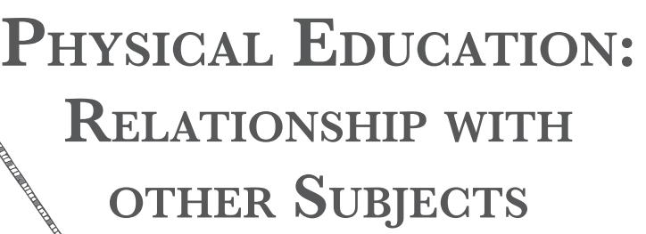
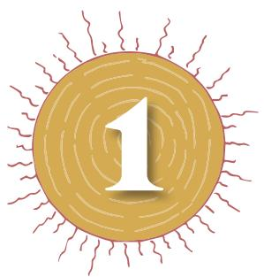
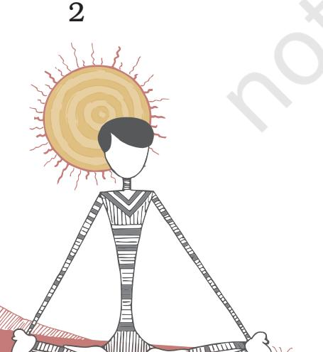
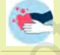
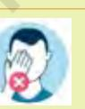

Physical education (PE) aims at the optimum development of an individual through continuous process of learning and participation in guided physical activities. In other words, it aims at optimum physical, mental and social development of an individual.

# **What is Physical Education?**

According to Webster's Dictionary, "Physical education is a part of education which gives instructions in the development and care of the body rending from simple callisthenic exercises to a course of study providing training in hygiene, gymnastics, and the performance and management of athletics and games." Central Advisory Board of Physical Education and Recreation defines PE as "an education through physical activities for the development of total personality of the child to its fullness and perfection in body, mind and spirit. Physical education is an area through which sports, outdoor activities like trekking, hiking, camping, gymnastics, dance, aquatics are used to train individuals in motor skills and fitness skills. Physical education also assists the schools in carrying out responsibility of developing personal and social skills in students." In fact, PE is an integral part of total education. It makes significant contribution towards the achievement of desirable educational and health outcomes. It also enables children to acquire necessary knowledge and skills to stimulate them to actively participate in physical activities throughout their lifespan.

# **Need and Importance of Physical Education**

Participation in games, sports and yoga provide thrill and enjoyment to everyone. In addition, it helps to entertain and maintain a healthy lifestyle.

Chap-1.indd 1 8/28/2020 4:45:56 PM

# **Healthy lifestyle**

By engaging in various physical and yogic activities, one can ensure a healthy lifestyle.

### **Academic achievement**

By participating in various physical and yogic activities, students get stimulated to face challenges and are encouraged to think productively. This tends to improve their concentration of academic achievement.

# **Develops skills and experiences**

Various activities learned during school days such as gymnastics, running, jumping, throwing, swimming, playing team games, learning the rules and regulations of the games and being disciplined help students to develop sportspersonship.

# **Positive self-image**

Participation in regular physical activities also helps students to understand the need for appreciation of own positive aspects and develop ability to compete and cooperate with others. Self belief is also reinforced.

# **Improves interpersonal relationships**

When you play with other students and teams, you learn to develop interpersonal relationships with members of your own team as well as with members of other teams. It builds interactive and positive social environment.

# **Develops internal organ systems**

By participating in physical and yogic activities, students respond to the increased demands of daily life in a healthy way. The system of the body responds to stimuli and becomes more efficient at coping with the load exerted on it.

# **Objectives of Physical Education**

Broadly, there are four objectives of Physical Education which are as follows.

# **Physical fitness**

It refers to the state where an individual is physically fit and has developed great endurance, speed and strength. Physical fitness is essential for leading a happy, healthy, vigorous and fulfilling life. Physical and motor fitness helps to learn and develop technical and tactical knowledge of sports and games.

**Activity 1.1**

sport event.

**•** Measure your pulse and respiration rates before and after playing different games or participation in a

**•** Collect information from 10 persons and prepare a project on physical activities and eating habits and their impact on the human

body.

Chap-1.indd 2 8/28/2020 4:45:56 PM

### **Social efficiency**

It is concerned with one's adaptation to group living. Physical education activities provide ample opportunities to develop such traits and life skills as cooperation, respect for others, loyalty, sportspersonship, self-confidence, etc. All these qualities help a person to become more social and a responsible citizen.

### **Sports culture**

It aims at developing an understanding and appreciation of one's own local environment as well as the global environment. By participating in various physical activities, such as, dance, sports, games and yoga, a person fully understands the history, culture, traditions, etc., and also the aesthetic values associated with these activities.

### **Mental efficiency**

In physical education, a child has to participate in a number of physical and yogic activities. These activities not only require involvement of the body but also require use of the intellect to carry out the task. Positive, healthy and active body-mind relationship helps to enhance mental efficiency.

# **Scope of Physical Education**

Physical education has evolved as a multi-disciplinary subject and its scope is not just confined to physical fitness and the rules of games and sports. The meaning and definition of Physical Education, its aims and objectives and scope, and factors affecting physical fitness and wellness, rules and other necessary knowledge about health, games and sports and yoga are major areas of study in physical education. Games and sports, as well as, cultural heritage, development of leadership qualities and group dynamics through sports and games are also an integral part of this discipline.

In fact, physical education now includes several areas which belong to other subjects like Biology, Genetics, Psychology, Physics, Bio Chemistry, Sociology, Anthropology, History, Culture, Medicine, Media studies, etc.

Contents from other disciplines like laws of motion, types of lever, force, equilibrium and centre of gravity, common postural deviations, therapeutic modalities in rehabilitation, sports massage, prevention and first aid for common sportinjuries, are also the content of physical education. Biological foundations such as heredity and environment, growth and development are also included in it.

Content drawn from psychology, such as, importance of psychology in education with special reference to physical education, such as, individual differences and personality, learning and motivation are related to Physical Education.

#### **Activity 1.2**

- **•** List responsibilities as an individual and in teams while playing the game of your choice.
- **•** Discuss leadership skills in class developed through health and physical education sessions.

3

Chap-1.indd 3 8/28/2020 4:45:56 PM

Personality means, nature and factors affecting performance and transfer of training constitute one of its major components. Similarly, contents related to basic physiology, anatomy, growth and development during adolescence also form part of the content of physical education. Some other contents are organ system, functions of bones, definitions and classification of joints, movement around a joint, general characteristics (properties) of muscles, effects of exercise on muscular system, circulatory system, respiratory system and digestive system, health dimensions, environment, importance of health, health problems, hygiene, community health, aspects of school health services, food, nutrition and balanced diet, communicable and non-communicable diseases, coronavirus, HIV, AIDS and drug abuse.

#### **1. What is Coronavirus?**

Covid 19 is the infectious disease caused by the recently discovered coronavirus. This new virus and disease were unknown before the outbreak began in Wuhan, China, in December 2019. That is why it is called the Novel (new) Coronavirus (NCoV).

### **2. What are the symptoms?**

The most common symptoms of Coronavirus are fever, cough and difficulty in breathing. Some patients may have aches and pains, nasal congestion, runny nose, sore throat or diarrhea. These symptoms are usually mild and begin gradually. Some people become infected but don't develop any symptoms and dont't feel unwell. Most people (about 80%) recover from the disease without needing special treatment. People with fever cough and difficulty in breathing should seek medical attention immediately.

### **3. How does Coronavirus spread?**

People can catch Coronavirus from others who have the virus. The disease can spread from person to person through small droplets from the nose or mouth which are spread when a person with Coronavirus coughs or exhales. These droplets land on objects and surfaces around the person. Other people then catch Coronavirus by first touching these objects or surfaces, then touching their eyes, nose or mouth. People can also catch Coronavirus if they breathe in from a person with Coronavirus who coughs out or exhales droplets. This is why it is important to stay more than 1 meter away from a person who is sick.

### **4. How to prevent Coronavirus?**

Wash your hands with soap water regularly.

If soap and water is not available, use hand sanitiser with at least 60 per cent alcohol.

Wash hands before touching eyes, nose and mouth.

use. Cover your nose and mouth with handkerchief/tissue while

Throw used tissues into closed bins immediately after

Avoid mass gathering and crowded places.

sneezing and coughing.

*For more information, refer to https://www.mohfw.gov.in/pdf/FacilitatorGuideCOVID19_27%20March.pdf*

4

Chap-1.indd 4 8/28/2020 4:45:57 PM

Contents related to Yoga also form a part of this area. Common Yogic Practices are *Yama* and Niyama, *Asana*, *Pranayama*, *Pratyahara*, *Bandha Mudra*, *Shatkarma/Kriya*, Meditation. It includes *Ahara* (Food), *Vihara* (Relaxation), *Achara* (Conduct), *Vichara* (Thinking), *Vyavahara* (Behaviour).

Theories of training are also included in this subject area. These are principles and characteristics of sports training, methods of sports training, training load, warming up, cooling down, aerobic and anaerobic activities, calisthenics and rhythmic exercises, specific training program for development of various motor qualities, techniques, tactics and talent identification. It is also important to understand the difference between play, games and sports.

# **Play, Games and Sport**

Though these terms are used interchangeably, these are actually different.

### **Play**

Play is spontaneous. It is usually a creative activity but has its own limitation and space. One plays voluntarily for fun and pleasure. Play, however, is a broad area which includes both games and sports. The distinctive features of play are that they are free, separate, uncertain, governed by self rules and creative.

### **Games**

Generally the word games and sports are used together. A game is an activity involving more players, defined by a goal that the players tries to reach, and some set rules to play. By masses, games are played primarily for entertainment or enjoyment. The difference of purpose differentiates sport from game, combined with the notion of individual or team skill. Games are also played on the basis of a set of rules. A game is defined as a goal that the players try to achieve. A person who participates in a game is known as a player.

### **Sport**

A sport is a physical activity carried out under an agreed set of rules, for competition or self-enjoyment or a combination of these. Sport are the kind of activities in which similar kind of body movement is repeated over a long time. For example, swimming and running and almost all the track and field events come under sport. Sport involves an activity or activities where the mental capabilities of the sportsperson are judged. In a sport, it is the sportsperson or the individual who determines the outcome. A person participating in a sport is called an athlete or a sportsperson.

Chap-1.indd 5 8/28/2020 4:45:57 PM

2024-25

#### **Activity 1.3**

The teacher divides students into small groups of 10 and plans an aerobic dance or drama. Keeping in view the skill, creativity, and music, these may even be in the form of a competition.

5

# **Relationship of Health and Physical Education with other Disciplines of Knowledge**

Health and Physical Education (HPE) classes provide space for exploring new ideas related to personal and community health. These ideas might then be used by students in various other fields of learning, such as, arts, science, civics and citizenship, communication, design, creativity and technology and languages (english, hindi and other regional languages), humanities (e.g. history, geography, economics, etc.), information and communication technology and psychology.

### **Art**

Health and physical education teachers can incorporate activities related to performing arts, drawing, painting, dance, drama, media, music and visual communication into their programs. These involve both fine motor skills and whole body movement including rhythmic movement. As body movements are part of both arts practice and health and physical education, these promote health knowledge, understanding of the body and lead to physical fitness and enhancing of creative skills at the same time.

# **Science**

The human body is a common concern of both science and health and physical education. In science, students study the human body from the cellular level to the systems level, with a focus on anatomy and physiology. In health and physical education learning is focused on the requirements for good health and the promotion of a healthy body. Students gain an understanding of the role of physical and yogic activities in ensuring good health and can link the functioning of the musculo-skeletal, digestive, endocrine and nervous systems studied in science, for the promotion of the physical, social, mental and emotional health of individuals within a society. Students consider it their personal responsibilities to discuss and adopt health issues, both in relation to their own safety and well-being, as well as to the safety and well-being of others. It also contributes in the designing of training for movements of organs to achieve optimal performance in the area of play, sports and games.

# **Social science**

Social sciences promote the idea that citizens require knowledge and understanding of civic institutions and the skills and willingness to actively participate in functioning of the society. Similarly, in health and physical education,

6

Chap-1.indd 6 8/28/2020 4:45:57 PM

students are encouraged to become active and responsible members of their community. Key concepts within health and physical education classes include understanding of the importance of personal identity within a community, what makes a community and how to engage with different members and agencies within a community. Participation in physical activity and sports also reflect values, rules, rights and responsibilities indicative of a democratic society.

### **Communication**

Communication involves developing knowledge, skills and behaviors that empower students to respond to, make meaning of, and deconstruct a range of communication forms. Effective communication is a key skill in health and physical education. It is essential that students develop the ability to listen, view and respond with respect to the content and context in which communication happens. Learning in the health and physical education domain involves developing familiarity with forms, language and conventions used in different forms of public, personal and interpersonal communication.

# **Design, Creativity and Technology**

Design, Creativity and Technology (DCT) help in developing sport goods, sportwear, sport software programme, etc. These are associated with knowledge and promotion. In this area students learn about the characteristic and properties of how all these aspects differ from each other. These investigations assist students to make decisions about appropriate solution. Students analyse and evaluate factors, such as, social, cultural and economic factors that influence design, creativity and technology.

### **Language(s)**

Languages help students to develop critical approaches to the ideas and thoughts collated to read, view, write, compare, research and talk about texts. Health and Physical Education teachers can use examples related to health and wellbeing to encourage students to reflect on their lifestyles and analyse ways by which the media influences their attitude towards health. For example, Health and Physical Education emphasises on the importance of physical fitness, self-esteem and body image in the maintenance of good health.

### **Economics**

Economics is the study of how society allocates scarce resources to satisfy the wants and needs of its members. Within the health and physical education (HPE) context, consumer health assists students to become more informed consumers of health products and services.

### **Activity 1.4**

- **•** Identify and analyse health needs and services available in the community.
- **•** Investigate the cost of specific behaviours, illness or disease in the community, such as, the economic impact of obesity and inactivity on society.
- **•** Explore the influence of government spending on health outcomes for individuals and the community.
- **•** Identify various locations from the map and interpret maps for outdoor adventure activities.
- **•** Investigate the impact of development and globalisation on poverty, the links between food, hunger and technology, identifying and locating facilities and services that contribute to the health and safety of communities on a local and national level.

7

ects

Chap-1.indd 7 8/28/2020 4:45:57 PM

The cost of disease emerging from unhealthy lifestyle is also studied to determine the burden of disease on families and community.

### **Geography**

Students develop skills in reading and interpreting maps of different kinds and at different scales. The same knowledge and skills are reinforced in physical education during orientation on outdoor education activities (Trekking, Mountaineering, etc). The investigation of local and global health issues involves collecting information from maps, satellite images, statistical data and information and communication technology based resources. These help students to understand themselves and their world, to apply their understanding in their present lives as well as make evidence based decisions that lead to the kind of future they desire.

### **History**

The study of History reflects multiple influences and connections to an array of other countries, cultures and times. The concepts of time, chronology and changes are common to both History and Health and Physical Education. While History focuses on identity from a cultural or national perspective, Health and Physical Education focuses on the range of factors that shape personal identity.

Like skill correction analysis programme, use of cameras and videos in game, use of wind gauge, Iso kinetic machines, construction and marking of play field.

# **Information and Communications Technology (ICT)**

ICT can be used to access, process, manage and present information and events. It constructs new understanding and communicate with others. It is an integral part of different training measurement and evaluation and offcourse coaching and officiating very helpful in conducting tournament.

# **Mathematics**

In Health and Physical Education, Mathematics provides tools and procedures which can be used to model situations and solve problems in areas, such as, scoring different sporting events involving time, distance, weight and number as variables, calculating percentage improvement in results from data collected through fitness testing or performance in physical activities.

8

# **Activity 1.5**

- **•** Create a report and may be a presentation about a game of your choice.
- **•** Capture still and moving images of sporting activities organised in your school and edit or annotate them to explain skill development or tactics.
- **•** Identify, collect and evaluate data from online sources such as, blogs, websites and forums to inform about myths related to Physical Education.

Chap-1.indd 8 8/28/2020 4:45:57 PM

### **Language other than English (LOTE)**

There are a number of martial arts developed by different societies. The text of these martial arts is discussed in the local languages. For folk dances the accompanying songs are in regional languages and music has its own characteristic tone and rhythm.

The concepts of movement, dance, physical activity and sport, vary culturally. These are associated with their own specific languages, vocabularies and discourses. Different societies have different attitudes, values and beliefs about physical activities which are expressed in their regional languages.

# **Myths and Misconceptions about Physical Education**

Myths are surrounded in regard to relationship of physical education with academic success. One of the most discussed myths in the society is that participation in sport and games reduces academic performance of individual.

### **Myths**

Participation in sport kills the time of study. Contrary to the widely held assumption that sport and other activities cut upon the time for serious school study, research evidence has shown that students tend to do better in school when they participate in physical activities. There is a positive correlation between performance in sport and the level of academic achievement. Physical education including sport is an integral part of the social and cultural infrastructure of a nation. It really can make a difference in the broader educational process and in changing and enhancing the quality of life. Vigorous physical exercise stimulates circulation, helps prevent skin eruptions and increases fluid intake. These exercises also promote self-worth and mental health, and support an individual for healing an injury. Sport also enhances physical performance and induce positive physiological adaptation. When children exercise, their fitness needs are met, and build up energy to learn and achieve. Given the growing number of children with obesity, watching TV, continuously being involved in computer games and other unwanted activities, frequency of the children getting involved in physical achievement and academic performance, has taken a back seat. Physical exercise enhances the function in joints, increases the sense of physical well being and promotes a sense of feeling good. It also increases physical working capacity by increasing cardiorespiratory fitness and increased strength and endurance and decreases risk of serious disease that could lead to early disability and death.

9

### **Activity 1.6**

**•** Identify, collect and evaluate data from online sources, such as, blogs, websites and forums to inform about myths related to Physical Education.

Chap-1.indd 9 8/28/2020 4:45:57 PM

# **Assessment**

### **I. Answer in Brief**

- 1. What do you mean by physical education?
- 2. What is the contribution of science subjects to physical education?
- 3. "Although physical education uses content from several disciplines, it is fast emerging as a discipline." Write two arguments favouring this statement.
- (a) _______________________
- (b) _______________________
	- 4. Who is a physically fit person?

#### **II. Short Answer Questions**

(b) _______________________

- 1. Should physical education and sports be an integral part of learning? Justify your answer. Give at least three reasons.
- 2. "All sports can be games, but not all games can be sports" Give at least two arguments for or against the statement.
- (a) _______________________

10

Chap-1.indd 10 8/28/2020 4:45:57 PM

