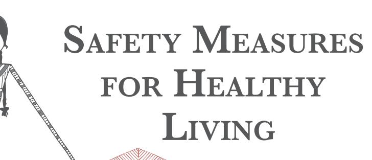
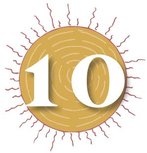
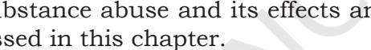
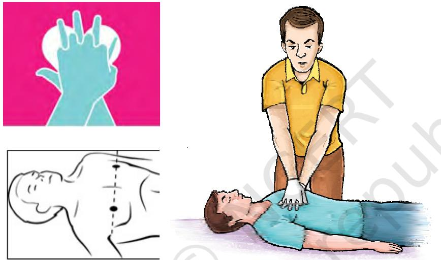
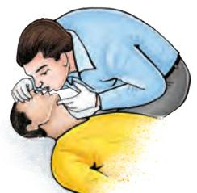
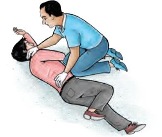

Our ancient scriptures give great emphasis on safe and sound life. Rigveda says, "Self preservation is the first law of nature." Thus, safety and security should be our primary concern. However, injuries and accidents cannot be predicted. These may occur anywhere and anytime. If they are not managed properly, they may have consequences like physical or mental disability. Therefore, they need to be prevented and managed properly. We try to minimise accidents with the help of safety measures. In this chapter we will be learning about precautions to keep ourselves safe and secure. First aid is essential before advanced medical care is available. Drug or substance abuse and its effects and prevention are also discussed in this chapter.

# **Safety at the Work Place**

Many injuries and accidents are reported at work place as well as in playfield. Factors like congested space, faulty equipments, improper methodology and carelessness cause these. For example, while working with chemicals in chemistry laboratory, working with equipment in physics laboratory or on playground, one needs to be careful. Every action (with or without equipment) govern with proper rules and methodology which are helpful to minimise chances of accidents.

# **Safety while working with machines**

Machines, whether hand operated or automatic, make life easy and comfortable. But they may be the cause of physical injuries and accidents if not handled carefully. There are certain dos and don'ts for safety while working on machines —

- **•** Wash hands to remove oil and grease or use chalk powder for proper handling.
- **•** Avoid wearing loose clothes. They can get entangled with machines.

Chap-10.indd 181 8/24/2020 11:45:08 AM

182

# **Activity 10.1**

- **•** Enlist and paste pictures of the safety equipment's or gadgets of any five sports of your choice.
- **•** Name the tablets kept in grain containers to control grain insect.
- **•** Enlist five household insecticides.

### **Do You Know?**

Types of pesticides are

- 1. Insecticides
- 2. Larvicides
- 3. Herbicides
- 4. Fungicides
- 5. Bactericides
- 6. Rodenticides
- **•** Concentrate on work and avoid talking.
- **•** Switch off electricity if the machine is not in use.
- **•** Keep extra or spare parts carefully in proper places so that they do not fall on any one.
- **•** Avoid touching the moving parts of any machine. This may tear-off the skin or cause burn due to heat.

Certain safety equipment and gadgets are used in various areas —

- **•** Helmets
- **•** Spectacles
- **•** Gloves
- **•** Apron
- **•** Insulating Boots
- **•** Face Mask

# **Handling insecticides**

Insecticides are chemicals or herbs to kill or drive away household and agriculture pests like rats, cockroaches, etc. While they are safe to use if proper instructions are followed but carelessness may cause serious accidents.

Common insecticides are —

- 1. sprays agricultural insecticides that kill crop pests.
- 2. tablets kept in grain containers to control grain insects.
- 3. naphthalene balls used in cupboards and drawers to preserve clothes from clothes moth.

Certain dos and don'ts for safety while using insecticides

are —

- 1. household insecticides
- 2. agriculture insecticides
- 3. insecticide tablets in grain containers

## *Household insecticides*

- **•** Spray cans should be kept away from children and destroyed after use.
- **•** Keep the nozzle of the insecticide container away from children.
- **•** Container used for spray need to be shaken well before use otherwise the liquid content may spoil your hand.
- **•** One should read the information brochure attached with container and avoid frequent use of sprays.
- **•** One should not keep the windows and doors closed for long after the spray.

Chap-10.indd 182 8/24/2020 11:45:08 AM

- **•** If accidently sprayed on your body parts, immediately wash with plenty of water and soap.
- **•** If pesticide is accidently sprayed on your clothes, remove them immediately.
- **•** Do not use if any member of your family suffers from allergy and asthma.

# *Agriculture insecticide*

In addition to the precautions mentioned above, remember to —

- **•** cover your body parts with a dress used for this purpose. Wash this thoroughly after every scheduled spray and do not use it if not washed and dried. It can cause serious insecticide poisoning.
- **•** cover your eyes and face with spectacles and mask.
- **•** take a bath as soon as possible after the spray.

### *Insecticide tablets in grain containers*

- **•** Always use the tablets after tying in a cloth piece.
- **•** Wash hands with soap and water as soon as you touch the tablets.
- **•** Keep the tablets out of reach of children.
- **•** Remove the tablets before boiling rice or giving wheat for grinding.
- **•** Shift the patient to the hospital if a tablet is ingested accidently.

# **Handling electricity and electric gadgets**

Electricity is a boon for modern civilisation. However, if due care is not taken while handling electricity and electric gadgets, it may prove fatal. For safe use of electric gadgets, follow the guidelines given below —

- **•** Always use MCBs (Miniature Circuit Breakers) installed at main switch board.
- **•** Immediately change the heated sockets and switches if there is sparking.
- **•** Always read the accompanying instructions before using the gadget.
- **•** Do not touch any electric switch or gadget with moist hands.
- **•** Do not leave the electric gadgets on, if not being used.
- **•** Always wear shoes or rubber slippers while using a gadget to prevent electric shock in accidental leaking of current.

### **Do You Know?**

Insecticides are chemicals or herbs to kill or drive away household pests like rats, cockroaches etc.

Chap-10.indd 183 8/24/2020 11:45:08 AM

**Activity 10.2**

first aid.

**Do You Know?** C-A-B means — **•** compression **•** airways **•** breathing

It helps to perform CPR.

**•** Discuss with your classmates the need of

**•** List the most essential items in a First Aid Box and draw a diagram.

184

# **•** Never try to repair the gadgets yourselves, if you are not trained.

- **•** Always switch the electric supply off before and after using the gadgets.
- **•** Never be in close proximity with electric wires, fire and water. Always use dry sand in case of fire to douse it.
- **•** Always get the servicing of the electrical gadgets done as per schedule.
- **•** Use government approved (ISI mark), electrical gadgets and fittings.

# **First Aid**

You must have met with certain emergency situations when you needed urgent medical treatment but it was not available immediately. You might have seen someone helping a person by providing first aid and then in reaching the hospital.

# **What is First Aid?**

First aid is the immediate and essential temporary care given to a wounded, injured or sick person, in an emergency situation to reduce the suffering of the patient, prevent further complication of injury or sickness before availing professional medical assistance.

# **Priorities of First Aid**

Remember the following priorities before giving first aid —

- 1. Maintain ABC
	- a) *Airway:* Clear the airway if blocked
	- b) *Breathing:* Check breathing and give artificial respiration if necessary.
	- c) *Circulation:* Give chest compressions if heart has stopped
- 2. Check and stop bleeding by applying pressure
- 3. Immobilise broken bones
- 4. Cool the burns
- 5. Treat eye, nose and ear injuries
- 6. Tie simple bandages and dressings over wounds
- 7. Transfer the patient to the nearest health centre

# **When is First Aid required?**

There are many conditions where first aid is required. You have studied a few in Class IX.

Chap-10.indd 184 8/24/2020 11:45:08 AM

The can be following situations may arise where you might need to provide first aid —

### *The person is unconscious and not breathing*

Here CPR (Cardio Pulmonary Resuscitation) is required. It is a life saving measure used when the heart and breathing has stopped.

Starting CPR within three minutes of heart stoppage is very important or else brain will be damaged.

*Cardio Pulmonary Resuscitation (CPR):* Circulation is maintained by chest compressions. Draw a line between the two nipples and keep the heel of the hand over the centre of this line. Place the other hand over it and give chest compressions pressing down the breast bone 1.5 to 2 inches.

*Fig. 10.1: Giving chest compressions*

The ratio of chest compressions to breathing should be 30:2 (i.e. 30 chest compressions and 2 artificial breaths per minute) as we have to provide a heart rate of approximately

*and chin lift*

100 beats per minute.

*Open the airway:* The airway is cleared by finger sweep if required. Any foreign body, secretion, food, broken teeth or tongue falling back are removed.

The airway is kept open by tilting the head backwards and lifting the chin upwards. *Fig. 10.2: Head tilt* 

- C- Cardio means heart,
- P- Pulmonary means lungs and
- R- Resuscitation means to revive

### **Do You Know?**

- **•** CPR (Cardio Pulmonary Resuscitation) must be given soon after breathing has stopped.
- **•** If you are untrained then give CPR only through hands for 100-120 per minute and continue until signs of movements or medical help has arrived.

#### **Activity 10.3**

Observe the activity perform by teacher and do activity under the supervision of the teacher.

Safety Measure

s

for Healthy

Living

Chap-10.indd 185 8/24/2020 11:45:10 AM

*Fig. 10.3: Performing mouth to mouth breathing*

#### **Do You Know?**

30 compressions followed by two breaths counts consists of one cycle of CPR.

*Fig. 10.4: Recovery position*

#### **Activity 10.4**

Let us learn about common medicines, their effects and what happens if they are used incorrectly.

*Breathing:* Breathing is artificially conducted by mouth to mouth technique. Keep your handkerchief over the mouth of the unconscious person. Pinch the nose of the person with one hand while tilting the head backwards and lifting the chin upwards.

Continue CPR till either the person is revived or medical help arrives.

#### *The person is unconscious and breathing*

Place the unconscious casualty in recovery position as explained in Fig. 10.4.

- **•** Extend the arm nearest up alongside the person's head.
- **•** Bring the other arm across the person's chest and place the back of the hand against the cheek.
- **•** Grasp the leg just above the knee and pull it up so that the foot is flat on the ground.
- **•** Roll the person far enough for the face to be angled forward.
- **•** Position the elbow and knee to help stabilise the head and body

# **Medicines and their Effects on Individuals**

Medicines are chemicals and biochemical substances which are used to prevent, cure or correct deficiency disorders in the body. Many substances have been used as medicines since ages in one or the other form, but modern times have seen a tremendous growth in terms of types and usage of medicines. While medicines are used to treat diseases and can be life saving, they can harm the body if not used correctly.

Medicines are used in the form of injections, tablets, syrups, creams, lotions, solutions, drops, powder, sprays and straps.

Medicines affect us in many ways. Some of the common ways are —

- **•** Analgesics reducing pain and in fever.
- **•** Antibodies killing or weakening microbes and infections.
- **•** Lotions in burns and allergies, for soothing effect.
- **•** Supplements correcting deficiencies due to vitamins, nutrients.
- **•** Antipsychotic drugs modifying the body's response, psychological disorders.
- **•** Vaccines and inoculations and immunisation Protecting and preventing.
- **•** Hormones supporting physiological functions.
- **•** Herbal medicines plants herbs

Although medicines assist us to lead a healthy life free of diseases, there are also certain undesirable effects due to

186

2024-25

Chap-10.indd 186 8/24/2020 11:45:11 AM

mechanism of action of the medicine or if taken more than the recommended dose. Thus, it is important to take the medicines only under medical supervision.

# **Precautions while taking medicines**

Medicines need to be used in the required dose so that they should not only have the desired effect but also prevent undesired side effects. Some of the precautions while taking medicines are —

- **•** Take medicines only if prescribed by a doctor. Self medication may be dangerous.
- **•** Take the recommended dose of the medicine and at the prescribed interval. Only then there will be desired effects. One should never adjust the dose oneself.
- **•** Do not minimise or exceed the dose and frequency of taking the medicine. This can cause undesirable effects
- **•** Adult dose of medicines should not be given to children. There are special forms and doses of medicines for children. Keep all medicines out of reach of children. Ingestion by them may cause emergency.
- **•** Store the medicines away from extreme temperature and sunlight.
- **•** Always check the expiry date of medicines before consumption.
- **•** Use a full cup of water and drink standing upright while swallowing a tablet.
- **•** Do not take any medicine on an empty stomach unless prescribed by the doctor.
- **•** Keep a list of medicines one is allergic to. Always tell the doctor about such medicine(s).
- **•** Always visit the doctor if one experiences any unusual symptom while taking the prescribed medicines.
- **•** It is important that the medicine should be taken regularly for the entire period and duration as prescribed by the doctor. Otherwise the disease due to infections can return.

# **Substance (drug) Abuse**

In an effort to establish their identity and desire for experimentation, adolescents often try out new things. Also they are more amenable to external influences, such as, the media and peers. This makes them more vulnerable to substance misuse, especially when they do not have correct and scientific information. They also lack life skills to deal with the wide ranging negative outcomes of extreme dependency on a substance and thereby, getting addicted to it.

**Activity 10.5**

What is the use of vitamins in our body?

187

**Do You Know?** Our physiological functions are supported by hormones.

Chap-10.indd 187 8/24/2020 11:45:11 AM

## **What is substance abuse?**

As you have learnt, drugs affect the body by changing the mental and physical status of a person. Some other substances also work in the same way and are not necessarily drugs. The non-medical use of a substance including drugs, that changes an individual's mental and physical status and affect the health adversely, is known as substance abuse.

Once a person starts using a substance, his mental state is altered and the person cannot get out of this habit. The extreme dependency on the substance compels them to increase the intake every day. This is called addiction.

Substance misuse is widespread today including adolescents across the world. Socially acceptable drugs like tobacco and alcohol abuse not only ruins the life of the individual but can also influence them to associated with crime and violence.

### **Commonly abused substances**

There are substances that can be abused for their moodaltering effects such as inhalants and solvents. On the other hand, there are drugs that can be abused that have no moodaltering or intoxication properties, such as, anabolic steroids. They are abused by the adolescents and youth during body building, to look more muscular.

Commonly abused substances are tobacco, alcohol, marijuana (*ganja*), opium, cannabis, solvents (petrol, glue, correction ink) and aerosols inhalants, cough syrup, caffeine, cocaine and ecstasy. There are other substances like *gutka*  and *paan* (betel).

These substances can be ingested, inhaled, drunk, chewed or injected by a syringe in the blood. Some of these substances make one addicted, even if taken once.

#### **Reasons for substance abuse in young people**

Young people are more vulnerable to substance abuse due to the following reasons —

- **•** During the process of growing up, poor self-esteem, low achievement at school, performance pressures, etc,. are some of the factors that promote substance abuse in adolescence. Resorting to substance use as a means of 'growing up' or fun also makes the adolescents more vulnerable to substance abuse.
- **•** Pressure from peers or friends to try an addictive substance, the urge to gain popularity among friends, and desire to experiment and curiosity to try out new things also make young people particularly vulnerable to substance abuse.

188

Chap-10.indd 188 8/24/2020 11:45:11 AM

- **•** Previous experience of taking substance.
- **•** Family history of substance misuse.
- **•** Lack of support from family, friends and school.
- **•** Lack of knowledge about the effects and dangers of consuming addictive substances.
- **•** Glamorising substance misuse by media misleads young people.
- **•** Easy availability of substances and drugs are the main reasons for substance misuse in young people.
- **•** Social approval of substance abuse like tobacco, paan, beetel nut, *gutka* chewing or taking wine in parties encourages young people to initiate abuse of these substances.

#### **CASE 1**

Sohan has performed well in Class IX annual exams. Now, he is worried whether he will be able to keep up his performance and score good grades in Class X. His parents always tell him how they expect to see him at the top of his class. Afraid of disappointing them, Sohan does not share his concerns with his parents. He feels that some of his friends may be going through the same phase and discusses his problem with them. His friends suggest that smoking may reduce his stress and help him to relax. Sohan wants to feel better and decides to follow his friends' advice. He starts smoking a cigarette or two everyday. Without realising, over a period of six months he was smoking 6-10 cigarettes a day. Smoking has become a habit with him, and in future, it was the cause of his ill health.

#### **Points for Discussion**

- a) What do you think is responsible for Sohan's habit of smoking and why?
- b) Do you think smoking helped reduce Sohan's stress? Why?
- c) What else could Sohan have done to reduce his stress effectively?
- d) What role could Sohan's parents have played to prevent him from smoking?

### **Consequences of substance abuse**

Substance misuse leads to a number of short-term and longterm effects that are detrimental to health.

*Short-term effects:* These are effects that appear only a few minutes after the intake of substance. The user feels a false sense of well-being and a pleasant drowsiness. Some of the short-term effects are distorted vision, hearing and coordination, impaired judgment, bad breath and hangovers.

189

Chap-10.indd 189 8/24/2020 11:45:11 AM

**Activity 10.6**

Discuss how a substance abuser's life gets affected.

*Long-term effects:* Substances having a long-term impact lead to serious damage due to constant and excessive use. These effects show up over a course of time and are usually caused by progressive damage to different body organs. Some of the health consequences include irregular eating habits, sleep disorders, poor hygiene resulting in poor health and low immunity. This predisposes substance abuser to diseases and infections.

Substance abuse in itself is not a cause of HIV/AIDS or STDs but under the influence of drugs, people may engage in risk-behaviours that make them more susceptible to these infections. Injectable drug users, however, are more prone to HIV in conditions where the users do not sterilise needles and share needles to inject the drug.

Substance users may even die suddenly from a so-called overdose, when one consumes more than what the body can tolerate. Death may also occur from long-term damage to the organs of the body.

These substances are especially harmful if consumed during pregnancy. These substances reach the foetus through blood and harm it by crippling its growth and development or death.

Substance abuse influences not only the individual and family but also the community. The persons who get addicted often lose interest in other activities be it school, job or any other responsibility. They are not able to take care of their responsibilities and may become a liability for their families and finally the society. Furthermore, it is expensive to buy substances or drugs on a regular basis. Hence, in desperation, addicted individuals may be forced to engage in petty severe crimes.

# **Prevention of drug abuse**

Paying attention to the following may prevent young people from misusing substances —

- **•** Peer pressure can be managed by being aware of the implications of substance abuse and developing life skills. One can not only save oneself from adopting risky behaviours under peer pressure but also persuade the peers not to engage in unhealthy behaviours such as substance misuse. Advocacy with the involvement of local community can be quite useful.
- **•** The different ways of dealing with negative peer pressure are saying 'No' assertively, making an excuse, reversal of pressure, and giving reasons.
- **•** Young people should also be educated to recognise that a friend is someone who cares, protects and looks

190

Chap-10.indd 190 8/24/2020 11:45:11 AM

after the welfare of their friends rather than force and initiate into unhealthy habits.

- **•** Young people should be empowered with life skills to know about their body and their life. They should be taking well-informed and responsible decisions.
- **•** The family and society should provide the support system for young children in their 'low' times.
- **•** As the attitudes related to smoking, drinking and misuse of other substances are formed during pre-adolescence and early adolescence, this is an important age to invest in prevention efforts. The family, community and educational institutions should empower young people with correct and scientific information.

Young children should be encouraged to get engaged in socially productive activities. For example, one can start a learning centre for the lesser advantaged children in the neighbourhood, one can learn Braille and help at blind school, and one can create awareness about water conservation in the neighbourhood. This will help them to channelise their energy, being away from the menace of substance abuse and also inculcate social responsibility

191

Chap-10.indd 191 8/24/2020 11:45:11 AM

### **I. Answer the following Questions**

- 1. State three precautions one should take while working with a machine.
- 2. While opening a bottle containing liquid insecticide, the liquid fell on your clothes. How can you prevent its harmful effects on you?
- 3. Electrical gadgets are used in all households. What are the requirements of these gadgets which will prevent you from getting an electric shock?
- 4. What do you understand by First Aid? What are the priorities you should keep in mind before administering first aid?
- 5. What is CPR? When and how is it practised?
- 6. Why should you not practise 'self-medication'?
- 7. What do you understand by the term substance abuse?
- 8. List the long term effects of substance abuse. If your friend falls into the trap of substance use, what will you do to dissuade him?

192

Chap-10.indd 192 8/24/2020 11:45:11 AM

