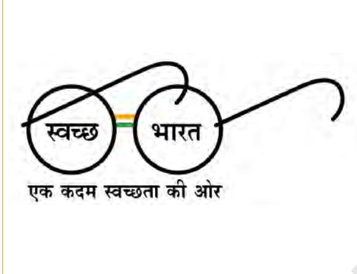
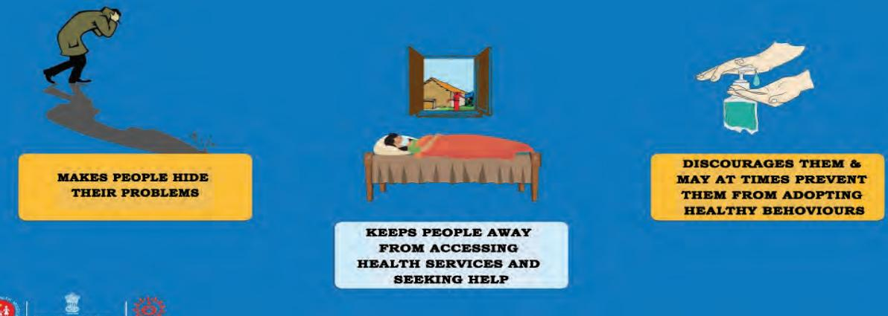
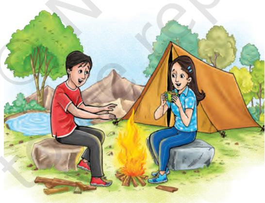
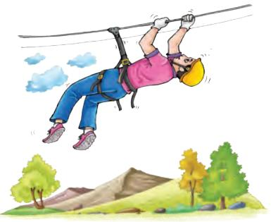
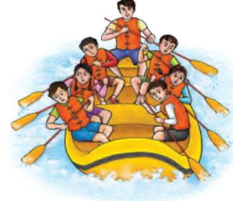
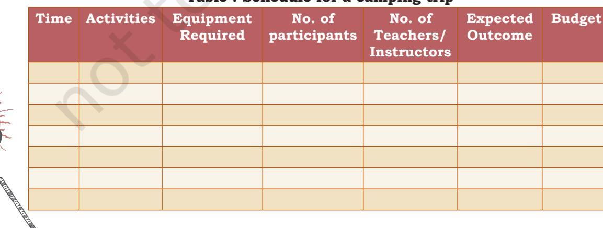

The quality of life in any community is a strong indicator of the health of its members. Our socio-economic needs are such that people depend upon each other as we cannot live in isolation. We live together and collectively share certain amenities that are necessary for our day-to-day existence. In the previous classes (Class VII to IX), we read about the negative effects of unhygienic or filthy surroundings on our health. Regular access to basic amenities, such as, clean water, sanitation, garbage disposal facilities, health care services, recreational facilities, etc., are important for prevention of illnesses and diseases. For prevention of diseases like coronavirus, maintaining of *social distance* is very important. In this chapter, the essential features of healthy community living including social distancing during coronavirus will be discussed. The focus will also be on the principles of cooperative living to ensure healthy living conditions for one and all.

## **Healthy Community Living**

Our way of life, and the utilisation of resources, decide the quality of our personal and community life. A healthy way of living in the community is ensured not only by the optimal use of resources but also by keeping our environment clean and hygienic. Let us understand what is meant by healthy community living.

The following figures show community life in three different situations —

- 1. A village (Fig 11.1)
- 2. A township in an urban area (Fig 11.2)
- 3. A slum in an urban area (Fig 11.3)

#### **A village**

Mawlynnong Village in East Khasi Hills District of Meghalaya was declared as Asia's cleanest village in 2003 by Discover

Chap-11.indd 193 8/24/2020 11:46:07 AM

India Magazine. It is about 75 km away from Shillong, the capital of Meghalaya. Most of the houses in this village are beautifully decorated with flowers and plants. As per the Census of 2011, the total population of Mawlynnong is 414. The main occupation of the villagers is agriculture, but it has also been an age old tradition of ensuring that the surrounding environment is clean. In fact cleanliness is a collective effort and this practice is ingrained in the people since their childhood. The people voluntarily sweep the roads and lanes, water the plants in public areas and clean the drains. A dustbin made out of bamboo is found all along the village. Everyone makes it a point that dirt and waste are not thrown anywhere. All the waste from the dustbin is collected and kept in a pit, which the villagers use as manure. Trees are planted to restore and maintain nature's balance. Mawlynnong's fame as the cleanest village in Asia, is drawing a lot of domestic as well as international tourists, as a result of which tourism is also an important source of employment for the local youths. Besides, there are many interesting sights to see such as the famous living root bridge in the nearby village of Riwai, which is a fascinating example of indigenous methods of conservation and sustainability. Local youths are available as enthusiastic and informative guides.

*Fig. 11.1: Mawlynnong Village*

**A township in an urban area**

*Fig. 11.2: A modern township*

194

Chap-11.indd 194 8/24/2020 11:46:07 AM

This picture is of a modern township derived from an advertisement in a national newspaper. Many times, catchy slogans such as 'Get away from noise, pollution, congestion and a cramped life' are used by builders to sell their apartments. People are assured a safe and healthy environment with not only the basic amenities, but also other features, such as, shopping arcades, clubs, gymnasiums, gardens, clinics, food market, lots of open space, etc.

## **A slum in an urban area**

*Fig. 11.3: A slum area*

These pictures characterise life in a slum area in big cities. As you can see in the picture, people live in overcrowded houses surrounded by stagnant water which is a potential breeding ground for mosquitoes. We also find railway tracks adjacent to the houses which is dangerous for children and adults too. In addition, we find heaps of garbage scattered around the houses.

## **Activity 11.2**

You may conduct a survey in your neighborhood and collect information on the following —

- **•** Make a list of some of the basic amenities and community resources that are collectively shared by members of your community.
- **•** Make a list of some of the community resources that are not available in your locality.
- **•** On the basis of your observations and survey, complete the following table —

| Features appropriate or | Features not appropriate |
| --- | --- |
| necessary for healthy | or necessary for healthy |
| community living | community living |
| 1. Water supply | 1. Open drains |
| 2 | 2 |
| 3 | 3 |
| 4 | 4 |
| 5 | 5 |

#### **Activity 11.1**

After observing the pictures, discuss the following —

- **•** Do you think Mawlynnong Village is a successful example of healthy community living? Give reasons for your answers.
- **•** Do you think modern townships as depicted in Fig 11.2, can offer its inhabitants a safe and healthy environment, as assured by the builders?
- **•** The pictures shown in Fig 11.3, does not reflect signs of healthy community living. Do you agree? Give reasons for your answers.

195

Chap-11.indd 195 8/24/2020 11:46:07 AM

*These activities will enable you to understand various features of healthy community living. Through these activities, you may have observed that in a community, a group of people live in a particular local area. Secondly, they share common facilities, which differ from place to place. In some areas, people have access to facilities, such as, water supply, sanitation, garbage disposal facilities, health care services, recreational facilities, community centre, schools, transportation, etc., but in some places people do not have access to even the most basic amenities.* 

A community is said to be healthy when its members continuously work together to maintain, improve and expand the available natural resources and avoid their wastage. The healthy community only be develped when its members recognise their roles and responsibilities. They strive to inculcate values and attitudes of cooperation, mutual respect, tolerance, kindness, etc. The role of Panchayati Raj, civil societies and other government institutions is also very important to promote healthy living.

#### **Important features of healthy community living**

Maintaining cleanliness of our home and surroundings is an essential feature of healthy community living. Healthy community is one in which all residents have access to quality education, safe and healthy homes, adequate employment, transportation, physical activity and nutrition. Living in overcrowded and unhygienic places with excessive noise and pollution, may lead to various forms of illnesses, diseases and stress. For instance, lack of adequate space, poor ventilation in rooms and toxic fumes in the air, increase the risk of air borne diseases. Access to basic amenities such as regular water supply, safe drinking water and sanitation, is important for healthy community living. In the previous classes (Classes VII to IX), it has been learnt that open and unattended garbage dumps are a potential breeding place for flies, cockroaches, insects and so on. Stagnant water and open drains breed mosquitoes, the carrier of diseases, such as, malaria, dengue and chikungunya. Water borne diseases, such as, cholera, jaundice, diarrhea and gastroenteritis are also resulted due to water pollution.

Access to basic amenities also includes other provisions such as electricity, hospitals, dispensaries, housing facilities, roads and transportation, schools, colleges, employment, security, recreational facilities and so on. Imagine a situation when a member in the family falls seriously ill and requires urgent treatment. What would happen to this person if there are no hospitals in the nearby city, or no transportation facilities to reach there?

196

Chap-11.indd 196 8/24/2020 11:46:07 AM

To ensure these basic amenities, the role of the local government or panchayats is very important. They are required to ensure rules and regulations for safety measures, cleanliness, ensure equal access of public amenities to all members, promote adoption of waste management practices, and help ecological restoration and conservation. However, we cannot depend solely on the government to take the initiative. The quality of life in a community also depends on how the members of the community work to improve on available resources and ensure that the government provides for these facilities.

You might have seen this logo before. This is the logo of the *Swachh Bharat Abhiyan*. You must have also seen some of the television advertisements through which the government advertises the importance and necessity of staying clean and keeping our environment clean. In this Clean India campaign — known popularly as the *Swachh Bharat Abhiyan*, the vision of a Clean and hygienic India, once seen by Mahatma Gandhi, can happen only if members of every community cooperate and accept individual and collective responsibility of keeping themselves, their homes and their surroundings clean.

In order to work collectively, members of a community need to develop values of co-operation, kindness, respect, gratitude, joy, peace and selflessness. These attributes are important in fostering the principles of collective work and in nurturing healthy social relationships. The example of Mawlynnong village shows that high income alone is not the only criterion for healthy living. Cooperative action, responsibility and positive values can also help in improving the quality of life, and healthy living conditions for one and all.

# **Prevention of Coronavirus: Social Distancing and Dealing with Stigma**

## **Prevention through social distancing**

Social Distancing: Deliberately increasing the physical space between people to avoid spreading illness and staying at least one meter away from other person decreases chances of catching coronavirus (COVID-19).

## *Social distancing: Dos*

- **•** Stay at home unless absolutely necessary.
- **•** Keep a distance of at least one meter between yourself and another person.

Chap-11.indd 197 8/24/2020 11:46:08 AM

## *Social distancing: Don'ts*

- **•** Do not hold events where people have to gather (even if it is a corner meeting with three or four friends, or an evening chat on the chaupal).
- **•** Do not go to crowded places like markets, shopping, melas, parties.
- **•** Do not use public transport.

*Courtesy: https://www.mohfw.gov.in/*

*Fig. 11.4: Social distancing dos and don'ts*

## **Dealing with the stigma**

## *What is stigma?*

In any epidemic, it is common for individuals to feel stressed and worried because they fear —

- **•** falling ill and dying.
- **•** approaching health facilities due to fear of becoming infected while in care.
- **•** losing livelihoods, not being able to work during isolation, and of being dismissed from work.
- **•** being socially excluded or placed in quarantine because of being associated with the disease.
- **•** feeling powerless in protecting loved ones and fear of losing loved ones because of the virus or being separated during quarantine.
- **•** feelings of helplessness, boredom, loneliness and depression due to being isolated and not working towards caring for a dependent.

Stress is caused due to the above fears and being treated as an outcaste or blamed for spreading the disease.

#### *What is the reason behind the stigma?*

The level of stigma associated with COVID-19 is based on three main factors —

198

2024-25

Chap-11.indd 198 8/24/2020 11:46:08 AM

- **•** COVID-19 is a new disease about which many things are still being discovered.
- **•** When something is unknown people are worried which leads to fear.
- **•** Rumours or fake news give wrong information and spreads the fear.

#### *Recognising the stigma*

It is very important to recognise stigma and handle it. Below are four case studies related to these issues. Read these case studies and recognise the stigma.

#### **CASE 1**

You are in the grocery shop, there are several people who are wearing a mask. You see Babulal, the store owner, going red in his face as he tries to suppress a cough.

#### **CASE 2**

Sukhram has come back from Pune where he works as a taxi driver. They stay in a joint family and you have taken his contact history as advised by your supervisor. You come to know that Sukhram's family members have asked him to leave the house.

#### **CASE 3**

Beauty works in Delhi as a house maid. recently she has come back and you have been told that beauty's employers have asked her to leave as she had a cold.

#### **CASE 4**

Surali is a young girl of 11 years. She and her 8-year-old brother are staying with an aunt as their parents have been asked to go in for isolation. Surali's aunt keeps on complaining to you that the children are a big burden on the family's resources.

#### **What will you feel like if you were Babulal, Rani, Sukhram and Beauty?**

- **•** Babulal has simple cough. But he is too scared to cough in front of people as he will loose the customers.
- **•** Sukhram needs family support to help him stay in isolation. If everyone takes proper precautions the infection need not spread.
- **•** Beauty has a seasonal cold but she has been asked to leave by her employers.
- **•** Surali and her brother are two small children who need to be supported and this kind of incident can cause mental stress even in the future. Child Protection Cell (CPC) should be approached for appropriate measures for helping children in difficult situations.

Chap-11.indd 199 8/24/2020 11:46:08 AM

*Fig. 11.5: What does stigma do?*

# **Values and Attitudes Conducive for Healthy and Cooperative Living**

How to develop values and attitudes conducive for healthy and cooperative living? These values have to emanate from within a person, but they can also be developed through various other ways. Camping can be seen as one of these ways which is extremely appropriate for students, particularly during the adolescent period.

**What is camping?**

*Fig. 11.6: Camping*

Youngsters might have already attended a camp or may have heard about camping activities from friends. Camping is an outdoor activity, where familiar surroundings are left to spend a night or several nights at an outdoor site. The location of these sites varies as per the objectives of the trip, time of the year and budget available.

*https://www.mohfw.gov.in/*

Common camping sites are: visits to villages or rural areas to understand their pattern of living; mountain areas, national parks, lakes, beaches, forests, etc. One can also plan camping activities in a nearby place, such as, open fields, park, or even in an open space of the school premises. The basic camping equipment include tents, cooking utensils or gadgets, sleeping bags, first aid kits, ropes, insect repellents,

200

Chap-11.indd 200 8/24/2020 11:46:09 AM

etc. These requirements will vary as per the location of the camping site and objectives of the trip. However, irrespective of the location, the essence of all camping activities revolves around two main features —

- (i) Bonding with nature
- (ii) Importance of living in a community.

## **Importance of camping**

Camping gives students a good break, away from the monotony of the classroom. It gives an opportunity to learn from nature in a joyful, exciting and adventurous manner. Living in the natural environment with students from different areas, cultures, religions and backgrounds, help then to learn to work as a team in various activities. These activities differ from adventurous and challenging ones, to the most basic ones, such as, cooking, cleaning, collecting water, etc. In this process, students learn the importance of self-reliance, teamwork, co-existence, importance of natural resources and organisational skills. Camping also offers great opportunities for empowerment of the girls.

*Fig. 11.7: Trekking Fig. 11.8: Mountaineering Fig. 11.9: Rock climbing*

While camping, one can engage in adventure sport, such as, trekking, river rafting, mountaineering, rock climbing, repelling, paragliding, caving. Adventure sport help to develop courage, self-confidence, leadership qualities and enhance concentration powers. This is also a great form of physical exercise. However, these activities should be conducted only in the presence of qualified and professional trainers. Joining the National Cadet Corps (NCC), National Service Scheme (NSS) or Bharat Scouts and Guides will also give you opportunities to take part in these activities.

201

Chap-11.indd 201 8/24/2020 11:46:14 AM

*Fig. 11.10: Zipline Fig. 11.11: River rafting*

A guided walk through the forest helps to explore nature. It can also complement much of the textual data in your geography and science textbooks through direct experiences. At the same time, learn to appreciate the beauty and simplicity of nature to make all understand how much disconnected from 'Mother Earth one has become.' You realise the importance of nature and how we should take care of it. Moreover, through interaction with local communities, one learns about edible and medicinal plants, local crafts, firstaid and various other sustainable forms of living.

During the evenings all may gather around campfires which give a great opportunity for social bonding. Campfires also enable to learn about different cultures through story telling, songs, dances, skits and games. On many occasions hidden talents of individuals are brought out during these activities.

#### **Activity 11.3**

Some of the camping activities have been given in the following table. Write down the qualities which can be developed through the respective activities. You may consult other sources for your answers.

| Activities |  |  | Qualities developed |
| --- | --- | --- | --- |
| Hiking, rock climbing, trekking, rope |  |  | Confidence, leadership qualities, team |
| climbing, river rafting, etc. |  |  | work |
| Nature walk |  |  |  |
| Cultural activities — patriotic songs, |  |  |  |
| lectures Indian culture and | on |  |  |
| heritage drama, | through | dance, |  |
| songs, story telling, skits, quizzes, etc. |  |  |  |
| Campfire — story telling that emphasize |  |  |  |
| on moral values based on local folk |  |  |  |
| tales, games songs. | history, | and |  |
| Interaction with community |  | local |  |
| members on local crafts, medicines, |  |  |  |
| first aid, food, etc. |  |  |  |
| Yoga |  |  |  |
| Voluntary services |  |  |  |

202

Chap-11.indd 202 8/24/2020 11:46:15 AM

# **Assessment**

## **I. Multiple Choice Questions**

- 1. Which of the following is the most important criterion for healthy community living?
- a) Cooperative action
- b) Kindness
- c) Harmony
- d) Safety measures
	- 2. Community participation is essential for ________________.
- a) ecological restoration
- b) public hygiene and health
- c) social harmony
- d) All of the above

#### **II. State whether True or false**

- a) Maintenance of public hygiene is the sole responsibility of the government.
- b) Community health and individual health are closely interlinked
- c) Camping is the only means for developing values of cooperative living
- d) Overcrowding increases the risk to air borne diseases
- e) Interpersonal relationships are as important as our physical environment.

#### **III. Answer the following Questions**

- 1. What is your vision of a healthy community? Give at least 3 examples.
- 2. A camping trip has been arranged by your school. Two girls from your community are not allowed to go for the trip. What are the points you would highlight to convince the parents on the importance of camping trip for girls.
- 3. Arrange a collage of pictures showing various activities in a Camping Trip.
- 4. Give two suggestions for keeping your community healthy, both at the individual and collective level, based on the points enumerated below.

For example,

 Record your suggestions regarding cleanliness drive within the community. The first one has been done for you.

I will ensure that, I do not throw litter around.

 We will ensure that, there are no open garbage dumps in the community.

Chap-11.indd 203 8/24/2020 11:46:15 AM

| a) Record your suggestions regarding rules and regulations within |
| --- |
| the community for safety measures. |
| I will ensure that ____________________________________________ . |
| We will ensure that __________________________________________ . |
| b) Record your suggestions for ensuring equal access of public |
| amenities to all members. |
| I will ensure that ____________________________________________ . |
| We will ensure that __________________________________________ . |
| c) Record your suggestions for adopting effective waste management |
| practices. |
| I will ensure that ____________________________________________ . |
| We will ensure that __________________________________________ . |
| d) Record your suggestions for ecological restoration and |
| conservation within your community. |
| I will ensure that ____________________________________________ . |
| We will ensure that __________________________________________ . |
| e) Record your suggestions for ensuring kindness and consideration |
| to the aged and differently abled. |
| I will ensure that ____________________________________________ . |
| We will ensure that __________________________________________ . |
| f) Record your suggestions for counseling provisions for the youth, |
| recreational facilities, etc. |
| I will arrange for _____________________________________________ . |
| We will arrange for __________________________________________ . |
| 10. Imagine that you have been asked to prepare an activity schedule |
| for a day in a camping trip. First write down the location of the |
| camping site and objectives of the camping trip and include other |
| details in the following table. |
| Location of camping site _____________________________________ . |
| Objectives of the camping trip ________________________________ . |
| Table : Schedule for a camping trip |

204

Chap-11.indd 204 8/24/2020 11:46:16 AM

