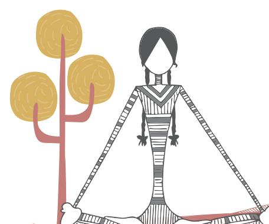
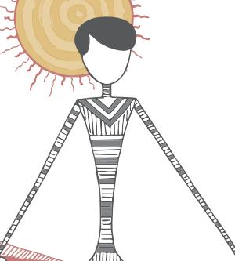

You have already learnt that, 'Health is a state of complete well-being and includes physical, mental, emotional and social health, Many animals show remarkable social behavior. Humans too are social animals and much of their behaviour is based on social norms laid down by the human societies since time immemorial.

Therefore, social health is a very important issue for all human beings — men-women, young-old, educateduneducated, rich-poor. Those children who learn to become socially healthy remain so all their lives. This chapter, will deal with the ways and means of growing up as socially healthy individuals and also helping them to clarify myths related to coronavirus.

#### **Myths and facts related to coronavirus**

**Statement:** A person with coronavirus can recover fully and not be infectious any longer.

**Fact:** 80 per cent of the people have recovered from the disease without needing special treatment. But information on the virus treatment is still being researched.

**Statement:** Eating raw garlic, sesame seeds will protect you against the virus.

**Fact:** Garlic is a healthy food that has other benefits but does not protect you against the coronavirus.

**Statement:** The virus can die easily once it is out of the body. **Fact:** We do not know about this particular virus as of now. Similar viruses (SARS, MERS) survive from 8 to 24 hours depending on types of surfaces.

**Statement:** You can get COVID-19 through mosquito bites **Fact:** The coronavirus cannot be spread through the bite of a mosquito. It is spread thorough droplets spread when an infected person sneezes or coughs.

After learning this lesson one should be able to explain what is social health, help all to remain socially healthy and spread awareness about benefits of social health.

Chap-12.indd 205 8/24/2020 11:46:39 AM

# **What is Social Health?**

#### **Activity 12.1**

Read the following conversation between an old grandfather, Mr. Das and 12-year-old grandson's friend Ravi.

- Mr. Das : How are you Ravi and how is your grandfather?
- Ravi : I am fine but my grandfather always feels angry and unhappy. He criticises everyone all the time, so no one wants to sit and talk with him. He is boring and not as loving as you are. Why does he behave like that Dadu?
- Mr. Das : It is because he has been unwell for a long time. Your grandpa is not getting company from any one, this makes him feel lonely and isolated. In other words, he is suffering physically, as well as mentally due to his old age. He gets angry because he is unsure of himself now and annoys others by his comments. He does not think that he is acceptable in society now.

 Which is why, he expresses his frustrations by being rude to others without any reason and fault of theirs.

 Why don't you spend time with him? Talk to him about your friends, your day in school, a happy incident, a sad one also and you may observe the change in him within a few days.

- Ravi : Thank you, Dadu. Now I understand that if someone is sick and emotionally unhappy, he would likely be angry and alienate others.
#### **Answer in brief**

- 1. Give reasons for the loneliness of Ravi's grandfather.
- 2. State situations that made Ravi think his grandfather was alienating others.
- 3. Say yes or no
- (a) Do you agree that physical, mental and social health are interrelated?
- (b) Living with others harmoniously requires a person to be socially healthy. State the reason for your choice.

#### **Activity 12.2**

- **•** You are in a tricky situation. Your best friend had a fight with another friend and you have seen that your best friend is at fault. You are asked to intervene to bring back peace. Will you announce that the cause of the fight was your best friend? This may become a source of annoyance to your best friend but if you did, that is Justice.
- **•** If you help, the two boys become friends again, that is fraternity.

206

Chap-12.indd 206 8/24/2020 11:46:39 AM

- **•** Your friend Arun noticed that food was being distributed free of charge on the footpath. A boy wearing tattered dirty clothes was repeatedly being sent to the end of the queue. Arun held the boy's hand and insisted that the boy be given the food packet then and there and not at the end. Arun believed in Equality of opportunity for all.
- **•** If you listen carefully to others opinions on a subject even if they do not match yours and try to understand others' viewpoints, you believe in liberty.

Read the preamble to the constitution of India given at the beginning of all NCERT text books. It is reprinted here for you. (photocopy of preamble of constitution).

*Fig. 12.1: Preamble to the Constitution of India*

Chap-12.indd 207 8/24/2020 11:46:39 AM

2024-25

207

Social Health

Everyone is a member of a social group and everyone is part of their peer group, family and kin, community, city, region and country, as well as the physical and biological environment. Would you agree that the country's constitution provides for Justice, Liberty, Equality and Fraternity which should be adopted in life for living happily and having consideration for all others in the group? Let us understand these four terms of our constitution which are directly related to "social health of a person or a country", and then try to define social health. In other words, if one is socially healthy, than will be able to develop interpersonal relations, through maintaining equality, fraternity and justice.

Let us now try and define social health.

# **Definition of 'Social Health'**

*Social health may be defined as the ability to form satisfying interpersonal relationships with others.* One who is able to make positive relationships and acquires the ability to adapt in different social situations and act appropriately as per the situation concerned, and can be called a socially healthy person.

### **Need for developing social health**

Primitive humans were hunter-gatherers, who lived in small groups or clusters and spent their lives at individual levels. Around 10,000 years ago, they moved near rivers to grow their own food and began to live together. With the passage of time, they started to live in a society and developed a language for interaction with each other. As 'human society' progressed, an individual became part of many social groups for example a member of a peer group, a family and kin, a class in school, a native of a region and a citizen of one's country. Social changes occur from time to time and many societies lay down norms and values for group living. Urbanisation has brought about many changes which are different from traditional rural societies.

Social attributes, of people however, remain the same as they are based on interrelationship between members of any society and necessary for accomplishing tasks requiring teamwork. School is one of the platforms for learning social skills.

# **Role of various Institutions**

Promotion of social health among children requires collective efforts and appropriate skills. All people in the field of education have to think about this.

208

Chap-12.indd 208 8/24/2020 11:46:39 AM

# **Role of teacher training institutes and other organisations**

School teachers need a degree, diploma or certificates from a teacher training institute. There are a number of organisation concerned with school education. The syllabus of teacher training courses should include the topics of important issues for children of which health should be one.

Organisations such as NCERT, SCERT, DIET should periodically organise workshops, publish journals and provide inservice training programmes on health issues including social health.

#### **Role of schools in promoting social health**

Schools have a very significant role to play in the promotion of health and safety of children. They spend a lot of time in school in early years. School environment forms ideal setting for acquiring knowledge of healthy choices of food. It is in school that they participate in physical activity through sports, games, yoga, gymnastics, exercise and gain benefits of each. School helps children to learn social skills which assist in establishing lifelong healthy behavior. Children learn team spirit and training in rules and regulations of social wellbeing just as in the defense services, which are inbuilt in training of defense service personnel, so they work together as a team to protect our nation.

In order to promote social health, the school should have a positive environment where children mingle with teachers, peer group and non-teaching staff without fear and apprehensions. Teacher have a significant role in this regard.

#### **Role of teachers**

It is well known that teachers are the mentors and therefore, the teacher training institutes should make training in leadership and mentorship a part of teacher training. Also well known saying that 'example in better than precept' Students easily learn to be socially healthy if the teacher herself or himself sets an example rather than lecture on social health. A good teacher ensures that students grow up into physically, mentally and socially healthy individuals. In doing this the teacher has to make efforts to ensure that students —

- (i) eat a proper diet and perform regular exercise and physical activity which are requirements of good physical health.
- (ii) inculcate friendship between classmates, indulge in amicable behavior with others in school so that students develop a helpful nature. These are necessary for mental and emotional health.

209

Social Health

Chap-12.indd 209 8/24/2020 11:46:40 AM

- 3. Teachers should train students in learning life skills like
	- a) empathy and self awareness
	- b) effective communication so that they develop healthy Interpersonal relationships
	- c) problem-solving and decision-making to learn to be stress free
	- d) creative and critical thinking
	- e) coping with stress and emotion.

The above are absolutely essential for developing social skills in order to be socially healthy.

Social skills help a student to have a desirable self image and self esteem and also self confidence. This makes children acquire ability to live harmoniously in the society.

#### **Role of technology in building social health**

Technology has made communication convenient through Mobiles, Skype, Facebook, Twitter, Instagram and E-mail messages. Knowledge about different media can help to develop the skills to access the appropriate media for accurate information on a specific topic or issues. More so, because media brings awareness, and provides access to global knowledge and learning. But refrain from using mobiles and viewing the T.V. for long periods as that tends to be counter-productive and reduce interaction time with others. This makes us socially withdrawn. Although media is a source of information, all of it may not be true or reliable. It is advisable to seek guidenes from a trusted adult while accessing media and internet. Moreover, there is a need to understand about real and fake news or information as these affects our attitude and behavior.

#### **Role of students in building habits of social health**

Social health comes from social skills. A few important guidelines for promoting social skills are outlined below.

- (i) *Building self awareness is an important skill:* Practice self-care by developing habits of cleanliness and hygiene, keeping away from substance abuse, engaging in physical activity and regularly consuming a balanced diet.
- (ii) *Do not be blameful and judgmental:* Remember when you point a finger at others, three fingers of yours point towards you. Hence indulge in knowing yourself better. It helps to discriminate between a good and a bad act of yours and helps to make friends. Empathy and self awareness go hand in hand. When you seea child hitting an animal, tell that

210

Chap-12.indd 210 8/24/2020 11:46:40 AM

child that if they were hit, they would feel the same pain. That is empathy for others and leads to self awareness.

- (iii) *Learn to identify your own mistakes:* There is no harm in saying sorry for a mistake and rectifying it. People will have faith in you if you did so.
- (iv) *Make an effort to reconnect with old relationships and friendships:* The socially healthy person makes an effort to contact and meet old friends, to remember enjoyable periods of childhood which can be a good way to beat stress and spend leisure time.
- (v) *Appreciate yourself and others:* But never let your ego rule your behaviour which can sometimes drive you to lose a relationship.
- (vi) *Try and be respectful, positive and supportive* towards the needy, the physically and mentally challenged, the downtrodden and those belonging to faith and cultures other than yours. Lend an ear to others opinion. It teaches tolerance. Tolerance and appreciation are virtues in socially healthy individuals.

## **Role of family in inculcating social skills in young family members**

The importance of family in inculcating social skills among, children is paramount. Guardians or parents are the prime teachers and caretakers who feed them healthy food and are also their play mates. They have to be aware themselves to be role model and make children appreciate as they grow. The benefits of enjoying nutritious food and being aware of a balanced diet is of paramount importance. Watching of television for longer duration is bad for students. Parents themselves have to be cautious in what they do in front of children and how long they are in front of the TV. However, at the same time good TV programmes are an avenue for learning. Encourage them to indulge in physical activity to build their muscles and bones. Fit body and fitness depends primarily on proper diet and healthy body and mind. The parents and elder family members need to guide them in social skills. Parents and elders have to be accessible to children for necessary guidance. They form a "safety network'. They are to guide adolescents through advice, answer their queries and occupy them through activities to keep them away from involvement in addictive substances like tobacco, drugs and alcohol which they might believe are helpful in tiding over stress. However, these substances have deleterious effects on the growing body.

Chap-12.indd 211 8/24/2020 11:46:40 AM

2024-25

211

Social Health

# **What are Life skills?**

These are —

- **•** *Empathy:* Is the ability to understand another's feelings in a particular situation.
- **•** *Self Awareness:* Is the recognition of one's character, strengths, areas of growth, beliefs and values.
- **•** *Effective Communication:* Is having skills of communication that facilitate interaction with people in positive ways.
- **•** *Interpersonal Relationships:* Building relationships of friendship and goodwill with all others.
- **•** *Problem solving:* Is the ability to resolve challenges.
- **•** *Decision Making:* Is the quality of analyzing problem to find and act to reach an appropriate solution.
- **•** *Creative thinking:* Is the ability to do something in a novel manner.
- **•** *Critical Thinking:* Is the capacity to analyse multiple perspectives and objectively evaluate the same.
- **•** *Coping with Stress and emotional distress:* These refer to management and regulation of one's emotions and moments of stress.

All these life skills help to develop desirable social health and live happily in a society.

- 1. The teacher needs to play an active role in discouraging her students from engaging in socially unhealthy practices such as vindictive attitudes, selfishness, jealousy and culture of hatred. For this, teacher has to sacrifice time and energy. It is however, necessary for a teacher and school authorities to understand that more than finishing the syllabus and passing exams, it is the teacher's responsibility to build good human beings. Home has a large role to play but it has been the mission of teachers to contribute towards grooming students into socially healthy adults
- 2. Another role of a teacher in inculcating 'social health' is to have a friendly, stress-free atmosphere in class. This can happen if students are engaged in 'group activities', especially activities for 'experiential learning'. Members of groups are reshuffled from time to time for team activities so that students may understand that it takes all kinds of people to make the world and the socially healthy groups can live in harmony despite differing in opinions. Group activities build team spirit and remove boredom.

212

Chap-12.indd 212 8/24/2020 11:46:40 AM

# **Ideas for Promoting Social Health of Students**

- 1. If there is a canteen, permit sale of healthy food like fruits or fruit juices. School authorities should be aware as to what is being sold for consumption immediately outside school and permit only those selling healthy eatables or low fat and healthy snacks.
- 2. Provide for safe drinking water.
- 3. Provide for examination and treatment of students with poor health conditions, bad teeth and weak vision. Organise health checks for them.
- 4. Organise variety of co-curricular activities, and ensure participation of maximum number of students, and training them leadership as well as team spirit.
- 5. Organise interclass sport and games competitions and finally, a sport day and prize distribution for encouragement.
- 6. Include a games period every working day in the time table.
- 7. Seek and insist on cooperation of parents so that even guardians who have not learnt social skills and have unhealthy habits may learn through their participation. It shall be community service by the school and a means to encourage everyone to undertake healthy living.
- 8. Have events for teaching and non teaching staff and allow voluntary participation in games using school equipment.
- 9. Have experts for teaching Yoga, Taekwondo, Judo and Karate for self-defense and utilise school premises for the same.
- 10. Schools can have activities involving children to learn to love and respect all living beings, plants and animals.
- 11. Encourage team games, 'House system' should be adopted, which helps children to interact with students of other classes too.
- 12. Organise periodic slide shows or movies with valuable messages.

In this manner students, teachers, parents and community will realise the benefits of being physically, mentally and socially healthy. And what a great way it will be to build a healthy nation!

213

Social Health

Chap-12.indd 213 8/24/2020 11:46:40 AM

# **Assessment**

#### **I. Answer the following Questions**

- 1. Define
- a) Health
- b) Mental health
- c) Social health
	- 2. What do you mean by life skills? Enlist them.
	- 3. What are the characteristics of a socially healthy person?
	- 4. Suggest three ways in which social health can be promoted in children by each of the following —
- a) School
- b) Teachers
- c) Family
	- 5. Write a short story of your choice to express life skills.
	- 6. What kind of society do you envisage if majority of its members are socially healthy?

214

Chap-12.indd 214 8/24/2020 11:46:40 AM

