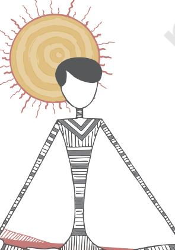
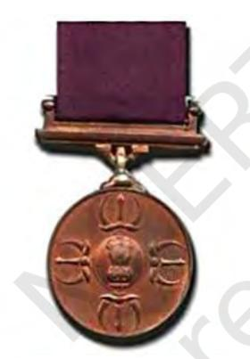
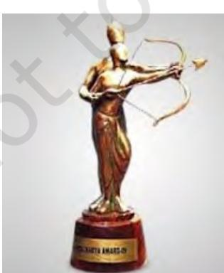
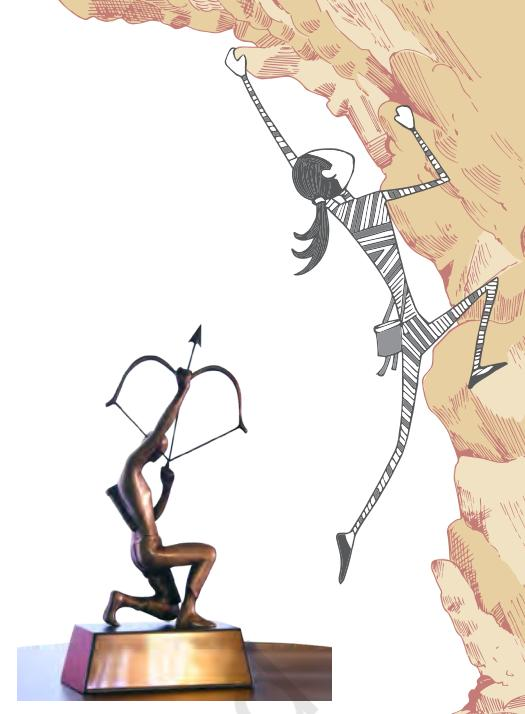
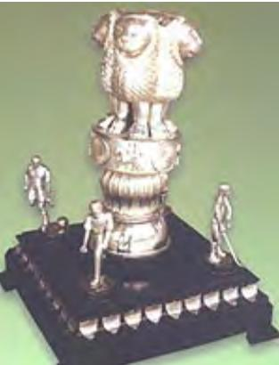
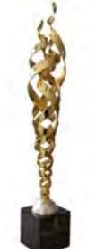
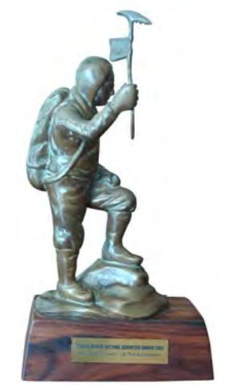
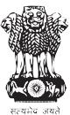

# **Agencies and Awards Promoting Health, Sports and Yoga**

Awards and rewards are the essential parts of performance enhancing efforts in health, sport, games and Yoga. It is managed and monitored by specific agencies. There are a number of agencies that promote health, physical education, including sport and yoga in our country. In India there are provisions for various kinds of awards. The chapter shall discuss those agencies and awards that promote health, physical education, sport and yoga.

# **Agencies**

There are a large number of agencies that are related to health, physical education, sport and yoga. Major institutions working in the areas of school education, physical education, sport and yoga are as follows:

#### **NCERT**

National Council of Educational Research and Training (NCERT) is an apex autonomous organisation set up in 1961 by the Government of India for quality improvement of school education and teacher education. It functions in the areas of educational research, training and development of curriculum and instructional materials for school education. It's another critical role is to assist and advise the Central and State governments on policies and programmes in school education. The major constituent units of the NCERT are —

- 1. *National Institute of Education* (NIE) undertakes research and development activities related to pedagogical aspects of curriculum, instructional materials and supplementary materials. It prepares national curricular policy documents, develops database and various types of materials and organises in-service training for different target groups.
**Activity 13.1** Where is the headquarter of NCERT located?

**13**

Chap-13.indd 215 8/24/2020 12:27:35 PM

Health and P hysical Education - Class X

**Do You Know?** CBSE has started competitive sports for all private schools affiliated to CBSE since 1988-89.

- 216
- 4. *Regional Institutes of Education* (RIEs) are located at Ajmer, Bhopal, Bhubaneswar and Mysore. The RIEs cater to the needs of school education and teacher education (pre-service and in-service education) including those teachers educators in the States and UTs under their respective jurisdictions. Besides these, yet another regional institute, known as North-Eastern Regional Institute of Education (NERIE) is located at Shillong.
	- 5. *NCERT: Role in Health and Physical Education* NCERT as an apex body includes functioning of Health and Physical Education like all other subject areas. The National Curriculum Framework (NCF-2005) prepared by NCERT considers health and physical education a compulsory subject from Class I to X and optional subject at Classes XI and XII. As a follow up of NCF-2005, NCERT has prepared syllabus on health and physical education which has been approved by the National Steering Committee set by the Government of India. Health and Physical Education components have also been included in the pre-service training courses running at each RIE's. It contributes to the policy formulation process of the Central and State governments related to Health and Physical Education.

#### **CBSE**

Central Board of Secondary Education (CBSE) is the first board of education that was set up in 1921 under jurisdiction of Rajputana, Central India and Gwalior. Government of India decided to set up a Joint Board in 1929 and it was named as the 'Board of High School and Intermediate Education. Later in 1952, the constitution of the Board was amended and it was named as 'Central Board of Secondary Education'. In 1962 the Board was reconstituted once again with the objectives: (i) to serve the educational institutions

**Activity 13.2** Find out how many clusters are taking part is CBSE competitive sport.

- 2. *Central Institute of Educational Technology* CIET is concerned with development of educational technology, design and production of media software. It holds programmes to build competencies of media personnel and need-based researches. It evaluates activities undertaken and studies carried out to assess the effectiveness of materials and programmes.
- 3. *Pandit Sunderlal Sharma Central Institute of Vocational Education* (PSSCIVE) is located at Bhopal and organises research, development, training and extension programmes related to Work education and Vocational education.

- 2024-25
Chap-13.indd 216 8/24/2020 12:27:35 PM

more effectively (ii) to be responsive to the educational needs of those students whose parents were employed in the Central Government and had frequently transferable jobs. The major functions of the CBSE have been to develop curriculum for all the subjects at the secondary and higher secondary levels, to conduct evaluation and examination activities, to organise teacher training workshops, to develop resource materials for teachers and students, to publish some text books for secondary and senior secondary classes and to monitor various academic projects. The CBSE has been preparing syllabi on Health and Physical Education, conducting competitive sport activities for schools affiliated to it and promoting the transaction of Health and Physical Education at secondary and higher secondary levels. It has also been ensuring that the Comprehensive and Continuous Evaluation (CCE) is focused on health and physical education activities.

#### **School education agencies in states**

We have found that there are government agencies at the state level for preparing curriculam, training teachers and other functionaries and evaluating the performance of students. There is a State Council of Educational Research and Training (SCERT) in almost all the major States. This institution is responsible for preparation of syllabi and textbooks for all the classes at primary and upper primary stages. In some of the States and Union Territories, the State Institutes of Education (SIE) or the Directorates of Education perform these roles. All these institutions at the state level perform these roles for the subject area of Health and Physical Education also. Then there are State Boards of Education, that are responsible for preparation of Syllabi and textbooks and evaluation of students of all classes at secondary and higher secondary stages. These institutions also conduct in-service teacher training for all the subjects including the subject of Health and Physical Education. Under SCERTs there are District Institutes of Education and Training (DIETs) that are responsible for pre-service teacher education at the elementary stage (primary and upper primary stages).

#### **SAI**

*Sport Authority of India (SAI)* was set up by the Government of India in 1984, aimed to promote sport in India and developing excellence by upgrading the skills of the Indian sport persons. Some of the prestigious institutes run by the SAI are: (i) Netaji Subhash National Institute of Sport, (Chandigarh, Sonipat, Lucknow, Guwahati, Imphal, Bangaluru, Madurai, Kolkata, Patiala and Gandhinagar), and (ii) Laxmibai National College of Physical Education (Thiruvananthapuram).

## 217

Agencies

and Award Promoting H

ealth, S

ports

and Yoga

#### **Activity 13.3**

Education is a concurrent subject of the state government.

#### **Activity 13.4** Where is the head office of

SAI.

Chap-13.indd 217 8/24/2020 12:27:35 PM

The main objective to establish SAI was to upgrade the skills of the budding sport talents in India. In order to attain this objective 23 training centers spread over the entire country are functioning.

Through various schemes formulated for sub-junior, junior and senior levels, it ensures that the enthusiasm for sport is widened among different age groups of people. SAI has also provided competitive exposures to the talented sportpersons. Some of the SAI schemes formulated for the promotion of sport in India include National Sport Talent Contest. The Sport Projects Development Area and the Sport Hostel Scheme. Besides, the Army Boys Sport Company (ABSC) in association with the Indian Army authorities is also run by SAI. SAI provides facilities like sport equipment for the trainees, kit, stipend as well as coaches. Currently, there are eight ABSCs all over India. Another scheme proposed by SAI is called SAI Training Centers (STC). This Scheme has been successful to a great extent, in fulfilling SAI's objective of spotting and nurturing sport talents. Another ambicious schemes run by SAI are - Special Area Games (SAG), and Centre of excellence (COX), producing high level National/ International sport.

#### **NSNIS**

After independence, on May 7, 1961 the National Institute of Sport (NIS) was set up by the Government of India for the development of sport at the Motibagh Palace of the then Maharaja of Patiala. With the objective of developing sport in the country on scientific lines and to train the coaches in different sport disciplines. On January 23, 1973, it was renamed as Netaji Subhas National Institute of Sport (NSNIS). Presently, NSNIS Patiala is Asia's one of the best Sport Institute and is popularly known as the "Mecca" of Indian Sport. It has produced coaches of high caliber and significantly contributed in rendering their expertise and assistance in the preparation of the national teams for various International competitions. The Institute is producing high caliber coaches in sport disciplines through its Diploma in Sport Coaching and Master Course in Sport Coaching. The Institute is presently conducting 6 courses pertaining to sport. (i) Master Degree in Sport Coaching (ii) Post Graduate Diploma in Sport Medicine (iii) Diploma Course in Sport Coaching (iv) Diploma Course in Sport Coaching (for candidates from North-East Region and Andaman and Nicobar) (v) Refresher Course and (vi)Certificate Course in Sport Coaching. (www.nsnis.org)

Other Government Institutions promoting health, physical education, sport and Yoga are Laxmibai National Institute of Physical Education, Gwalior, Indira Gandhi Institute of physical education and Sport Science (University Delhi) New

218

Chap-13.indd 218 8/24/2020 12:27:35 PM

Delhi, Government College of Physical Education, Patiala etc. Besides these there are many other colleges, Faculties and Departments of Physical Education and Sport under various state and central Universities, which promotes sport, games and physical education. Further, a detailed information on various institutions conducting Bachelor's Degree, Postgraduate Degree, Master of Philosophy in Physical Education and Doctorate degree programs could be obtained from their respective websites.

#### **Sport schools**

Another important agency is Motilal Nehru School of Sport, RAI which was founded in July 1973 by the Government of Haryana to provide excellent educational facilities with extra emphasis on sport to deserving students. It is a fully residential and coeducation school. Besides this there are other sport schools such as: G.V.Raja Sport School, Trivandrum; Maharana Pratap Sport College, Dehradun, Sport College, Lucknow, Sport School Jalandhar etc. that cater to the development of sport in the school education sector. There are also provisions for sport scholarships and sport hostels which prospective students can avail. The information can be obtained from concerned institutions or through internet.

#### **Yoga institutions**

There are a number of institutions devoted to promotion of yoga, providing everything from in depth courses to flexible drop-in classes. As the style of yoga and approach to teaching varies at each center, it is important to give proper thought to your needs before approaching the Institute. Some of the Institutes that offer yoga education are as follows:

- 1. Ramamani Iyengar Memorial Yoga Institue, Pune
- 2. Krishnamacharya Yoga Mandiram, Chennai
- 3. Bihar School of Yoga, Munger
- 4. The Yoga Institute, Mumbai
- 5. Kaivalyadham Shriram Mahadevji Yoga Samiti, Lonavala, Pune
- 6. Morarji Desai National Institute of Yoga, New Delhi
- 7. Swami Vivekananda Yoga Anusandhan Samsthana (SVYASA), Bengaluru
- 8. Patanjali Yoga Pith, Haridwar
- 9. Malviya Toga Sansthan BHU, Varanasi
- 10. Uttarakhand University of Sanskrit and Yogic Sciences, Haridwar

Additional information about above Yoga institutions could be obtained from their respective websites.

219

Chap-13.indd 219 8/24/2020 12:27:35 PM

#### **Activity 13.5**

Gather information regarding the benefits you can get from different institutions/agencies working in the areas of games and sport, health and physical education and sport training from different sources, such as by discussing with your teachers, sport teachers, and relevant publications or through internet. Identify the types of help you can get from each one of them to promote your abilities in games and sport.

#### **Awards in Sport**

Sport awards in India are presented by the Government of India to honour the players who have performed very well in their field of sport. It is bestowed to various sport personalities in different fields for their accomplishments and outstanding performances and to enhance the enthusiasm of players and recognise their skills and achievements. All the 7 awards are given to the proud recipient on National Sport Day every year i.e. 29 August to mark and celebrate the birthday of hockey Maestro Major Dhyanchand. These awards include the Trophy Rajiv Gandhi Khel Ratna Award, Arjuna Award, the Maulana Abul Kalam Azad (MAKA) Award, the, the Dronacharya Awards and the Dhyan Chand Award. Very recently the sport category also has been added in the list of areas for which Bharat Ratna is conferred.

#### **Rajiv Gandhi Khel Ratna Award**

*Fig. 13.1: Rajiv Gandhi Khel Ratna*

The Rajiv Gandhi Khel Ratna award was instituted in the year 1991- 92. It is India's highest honour given for achievement in sport. The words "Khel Ratna" literally mean "Sport Gem" in Hindi. The award is named after the late Rajiv Gandhi, former Prime Minister of India. It carries a medal, a scroll of honour and a cash component of ` 7,50,000. The Khel Ratna was devised to be an overarching honour, conferred for outstanding sporting performance, whether by an individual or a team, across all sporting disciplines in a given year.

#### **Dronacharya Award**

Dronacharya Award was instituted in 1985 to honour eminent coaches who have done 'outstanding and meritorious' work consistently with a singularity of purpose for raising the standards of sportpersons to highest performance in National and International events. As the best sportperson award is named Arjuna Award, it is appropriate that the coaching award is named after Dronacharya, as he was the Guru of Arjuna. The award comprises a plaque (bronze statuette of Dronacharya), a scroll of honour and a cash prize of ` 5,00,000 (Rupees five lakh).

220

*Fig. 13.2: Dronacharya award*

Chap-13.indd 220 8/24/2020 12:27:36 PM

#### **Arjuna Award**

The Arjuna Award was instituted in 1961 by the Government of India to recognise outstanding achievement in games and sport. The award carries a cash prize of ` 500,000 a bronze statuette of Arjuna and a scroll. Over the years the scope of the award has been expanded and a large number of sportpersons who belonged to the pre-Arjuna Award era were also included in the list. Further, the number of disciplines for which the award is given was increased to include indigenous games and the differently abled category. The Government has recently revised the scheme for the Arjuna Award. According to the revised guidelines, to be eligible for the Award, a sportperson should not only have had good performance consistently for the previous three years at the international level with excellence for the year for which the Award is recommended, but should also have shown qualities of leadership, sportpersonship and a sense of discipline.

From the year 2001, the award is given only in disciplines falling under the following categories:

- **•** Olympic Games/Asian Games/Commonwealth Games / World Cup/World Championship Disciplines and Cricket
- **•** Indigenous Games
- **•** Sport for the Physically Challenged

#### **Dhyan Chand Award**

The Dhyan Chand Award is a Life Time Achievement given to the veteran sportpersons of India for their achievements in their respective fields of sport. It is named after Dhyan Chand the legendary Indian hockey player. This is a new award instituted by the Government of India in the year 2002. The award carries a cash prize of ` 5,00,000/- (Rupees five lakh), a statuette and scroll of honour. The main objective of the award is to bestow honour on those sportpersons who have contributed a lot to their respective sport by their performance and who still continue to contribute to the promotion of sport after their retirement from the active sporting career.

#### **Maulana Abul Kalam Azad (MAKA) Trophy**

Government instituted MAKA Trophy in 1956-57 as a tool for promoting the competitive sport amongst colleges and Universities. The top overall performing University in the Inter-University tournaments in India is given the MAKA Trophy, which is a rolling trophy along with cash prize. The cash prize has also been recently enhanced to Rs.10 lakh, Rs. 5 lakh and Rs.3 lakh for the Universities securing first, second and third position respectively in Inter-University tournaments.

*Fig. 13.3: Arjuna award*

221

*Fig. 13.4: Dhyan Chand award*

*Fig. 13.5: Maka trophy*

Chap-13.indd 221 8/24/2020 12:27:36 PM

Fig. 13.6: Rashtriya Khel Protsahan Puraskar

Fig. 13.7: TNNA Award

#### **Activity 13.5**

Gather information of the current year's award winners in the field of Games.

#### **Do You Know?**

Tenzing Norgay was the first person from India to climb Mount Everest in 29, May 1953.

#### **Rashtriya Khel Protsahan Puraskar**

The RKPP award was instituted in 2009 by the Govt. of India to recognise the contribution in sport by entities other than sport persons and coaches. The objective of the award is to encourage and promote corporate involvement in the promotion and development of sport. The award carries a citation and a trophy in each categories, like

- 1. The community sport identification and nurturing of budding young talent
- 2. Financial support for sport excellence.
- 3. Establishment and management of sport academics of excellence.
- 4. Employment of sport persons and sport welfare measure.

#### **Tenzing Norgay National Adventure Award**

The TNNAA was instituted in 1993 by the Govt. of India. It is named after Tenzing Norgay, who is one of the first two individual to reach the summit of Mount Everest in 1953 along with Sir Edmund Percival Hillary. The award is given to individual for Excelling Adventure Activities on land, Sea and Air. It carries a statuette, Certificate and a cash prize of 5 Lakhs.

#### **Other sports awards in India**

Apart from the awards that have been discussed so far, there are some other special awards that are given by the Government of India to the medal winners in the international sport events. Some State governments also confer these awards. Generally, the Governments give away some cash awards for winning medals or cups in the international championships, Olympic Games, the World cup or World Championships, the Asian and Commonwealth Games or Championships. The players who become victorious in the game of Chess and Billiards or Snooker as well as the junior sportpersons who win medals in the World, Asian and Commonwealth Championships, are also given these awards.

222

Chap-13.indd 222 8/24/2020 12:27:37 PM

# **Assessment**

#### **I. Answer the following Questions**

- 1. Explain the role of agencies at the national level that work for Health and Physical Education in schools.
- 2. Which are the State level government agencies responsible for Health and Physical Education in schools? What roles do they play for the promotion of this subject area?
- 3. Write brief Notes on the following:
	- a) Sports Authority of India (SAI),
	- b) Netaji Subhas National Institute of Sports (NSNIS),
	- c) Sports Schools
	- d) Yoga Institutions
- 4. Which are the national awards that are given to sportpersons in India? What are the criteria for conferring those awards?
- 5. What awards are given to coaches and senior and retired sport persons? What are the bases of giving those awards?
- 6. Identify those educational and sport agencies that can help you in promoting your abilities and skills in games and sport and explain what kinds of contributions they can make.
- 7. Write the full forms of MAKA, RGKR, TNNAA.

#### **II. Reference**

 cbse.nic.in mnssrai.com ncert.nic.in performerawards.com sportauthorityofindia.nic.in sportforschools.com www.nsnis.org

Chap-13.indd 223 8/24/2020 12:27:37 PM

Ministry of Health & Family Welfare Govenment of India

### **Novel Coronavirus (COVID-19) School Advisory**

- **•** Schools are advised to **avoid any large** gathering of students during the course of the day in the school.
- **•** Any student/staff with **travel history to any COVID-19 affected country** or in contect with such persons i**n last 28 days**, should be monitored and home quarantined for 14 days.
- **•** Class teachers should be alert to any child with **signs and symptoms i.e. fever, cough and difficulty in breathing**, and should immediately inform the parents to have the child tested.
- **•** Ask parents not to send child back to school till advised so by the treating doctor.
- **•** Teachers, school staff and students should also be advised about simple public health measures of hand and respiratory hygiene.

# **Hand hygiene**

- **Wash hands frequently and thoroughly** with soap & water or use alcohol based hand sanitizer, even when hands are visibly clean.
#### **Respiratory hygiene**

- Everyone should **cover their mouth** with a tissue/handkerchief (or their sleeve if there are no tissues available) when they cough or sneeze and wash their hands afterwards.
- **Do not touch** your eyes, nose and mouth.
- Everyone should **throw away used tissues** in a bin and wash their hands after contect with coughing/sneezing.
- **• Frequently touched surfaces** door knobs, switches, desk tops, hand railing etc. should be disinfected.
- **•** Provide **alcohol based hand cleaners/sanitizers** in frequented spots of the school.
- **•** Ensure **availability of soap and water** in rest rooms at all times.
- **• Foot operated pedal bins lines with plastic bag** should be provided in each classroom & rest room.
- **•** In hostels, health status of students as well as the other ancillary staff, should be **monitored on regular basis**. In case there are suspected cases, the **authorised local medical authority** should be called for examination.
- **•** Anybody with **signs & symptoms (cough, fever or difficulty in breathing)** should call state/UT helpline number or Ministry of Health & Family Welfare's 24×7 helpline at 011-23978046 or visit public health facility with a mask or mouth covered.

**For Further information:** Call at Ministry of Health, Govt. of India's 24×7 control room number +91-11-23978046 Email at ncov2019@gmail.com

Chap-13.indd 224 8/24/2020 12:27:37 PM

