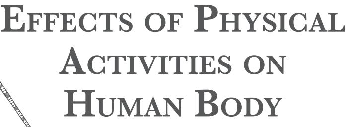

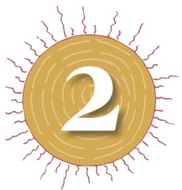

In this chapter, we shall discuss the effects, both shortterm and long-term, of physical activity on each of the major organ systems of human body. You are aware that a healthy individual is one who has a healthy mind in a healthy body. This state of health can be achieved when various organ systems of the body function in harmony. For example, physical activities are based on motor movements and their co-ordination. The command for movements comes from the brain which is a part of the nervous system. The required energy for movements and other activities is obtained from food. Food is completely digested in the intestine, a part of digestive system. Food and oxygen reach all the parts of body through the action of heart, which is a part of the circulatory system. In fact, many organ systems of the body function as an integrated whole for healthy maintenance of the body.

You have already studied about organ systems of the human body in the previous science classes. In this chapter, the organ systems have been discussed in relation to the effect of physical activities. It is a common experience that performance in any event, sports or otherwise, depends upon physical health, as well as, mental and emotional health. Development and maintenance of physical, mental and emotional health specially during this coronavirus (COVID-19) is therefore, very important.

# **Organ Systems of Human Body**

Aggregates of cells constitute a tissue. Tissues of various kinds together make an organ and many organs together comprise an organ system. Various organ systems perform different functions of the body necessary for wellbeing and healthy living. The organs which have a major role to play in the functioning of their respective system, such as, heart, lungs, liver and kidney

Chap-2.indd 11 8/24/2020 1:09:23 PM

are called vital organs. Before we learn about the impact of physical activities on organ systems, let us review functioning of these systems.

# **Organ systems for movement of body and limbs: skeletal and muscular systems**

When you walk, play, exercise, practice or participate in a sport, or even when you 'warm up' prior to a sport activity or competition, what is most obvious are the movements of hands and legs, with the brain being equally active. All the movements are due to contraction of muscles. Muscles are attached to bones. Bones form the skeleton. Bones are attached to each other by ligaments and muscles are attached to bones by tendons (Fig. 2.1, 2.2, 2.3).

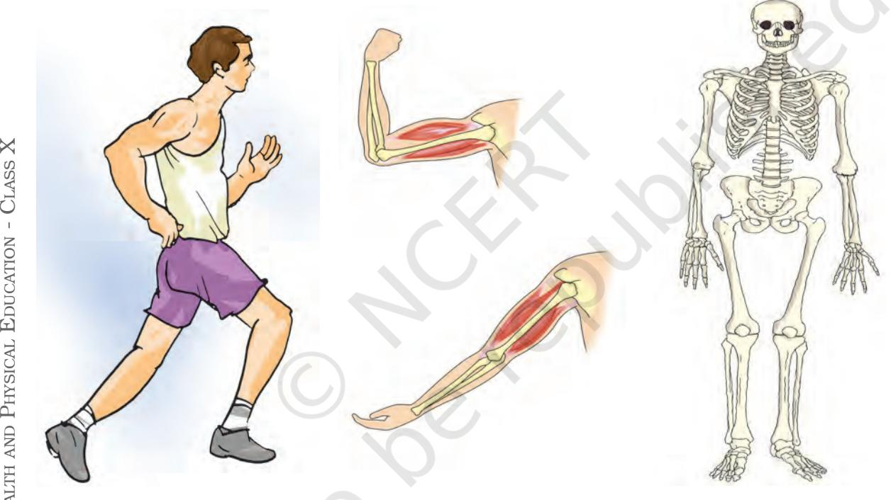

*Fig. 2.1: Muscle movement*

- *Fig. 2.2: Muscle of the arm*
- *Fig. 2.3: Human skeleton*

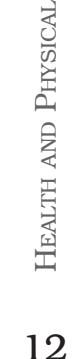

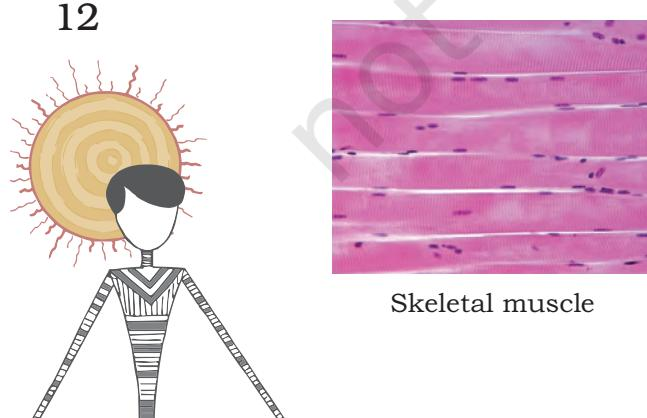

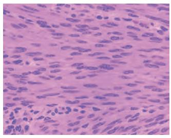

Skeletal muscle Smooth muscle Cardiac muscle *Fig. 2.4: Types of muscles*

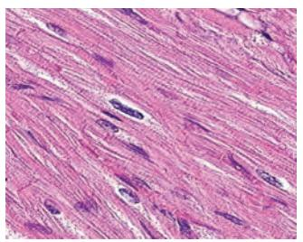

2024-25

Chap-2.indd 12 8/24/2020 1:09:25 PM

Muscles are made up of muscle cells which are also termed as muscle fibres because of their elongated shape. You have learnt in earlier classes that there are mainly three kinds of muscles. There are muscles that contract to cause movements according to one's will. These are called voluntary muscles, such as, those of the limbs and the neck. The involuntary muscles, such as, those lining the food canal, move automatically without our efforts for making them move. Another kind of muscles, which are also involuntary, are the muscles of the heart or cardiac muscles which never stop contracting and relaxing. As learnt in earlier classes, muscle cells (muscle fibres) may be striated (voluntary) muscle fibres, unstriated (involuntary) muscle fibres and cardiac muscle fibres (Fig.2.4). Muscles are grouped into bundles enclosed in a membrane. Movement of muscles takes place by the movement of molecules of muscle proteins, called actin and myosin present in the muscle fibres. Upon receiving instructions from the brain and nerves, these proteins slide over each other and the muscle contracts. Muscle contraction uses up energy, which comes from food. It is measured in calories.

### **Energy producing organ systems**

Through digestive system, food gets digested and converted to a form, which can be broken down in the cell to release energy. Respiratory system ensures a continuous supply of Oxygen to each and every cell of the body for oxidation of food. It is also responsible for continuous elimination of carbon dioxide produced as a result of this oxidation.

**Digested food** (Glucose) + Oxygen → Carbon dioxide + Water + ATP

Adenosine Tri Phosphate (ATP) is the chemical that releases energy. ATP is biological energy.

Respiratory system functions to ensure the continuous supply of oxygen to the body and removal of carbon dioxide from the body. Fig. 2.5 shows the different parts of the respiratory system. The intake of oxygen laden air from the atmosphere into lungs is inspiration (inhalation) and the

process of removal of CO2 laden air from lungs is expiration (exhalation). Inspiration and expiration constitute breathing. (Fig. 2.7)

### **Activity 2.1**

Underline the labelled vital organs in Fig. 2.5 Observe the location of the vital organs such as the spinal cord.

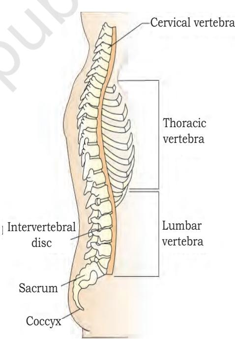

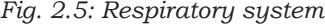

13

Chap-2.indd 13 8/24/2020 1:09:25 PM

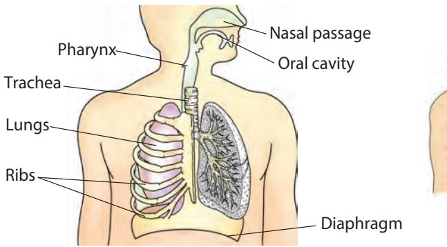

*Fig. 2.6: Human respiratory system*

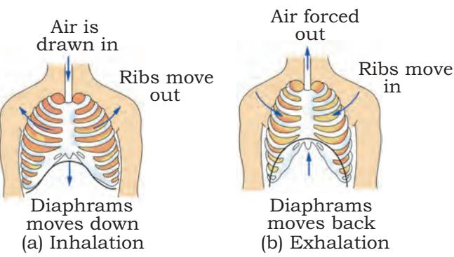

*Fig. 2.7: Machanism of breathing in human beings*

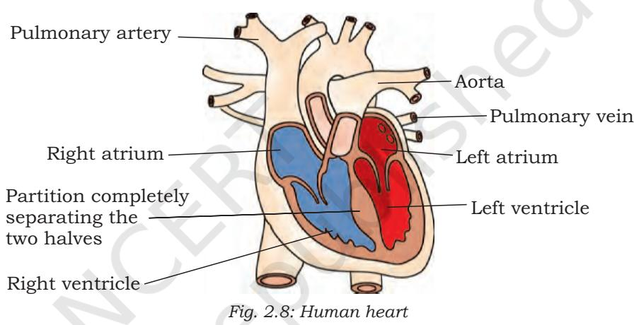

You have already learnt in earlier classes that when muscles of rib cage and diaphragm (the muscular partition between thorax and abdomen) contract and flatten, the thoracic cavity increases in volume and air from outside rushes in. It passes through nostrils, pharynx, trachea and bronchi and reaches the lungs (inhalation). The reverse happens during exhalation when muscles of the rib cage and diaphragm relax and CO2 laden air from lungs goes out through bronchi, trachea and nostrils.

Breathing is followed by internal respiration when oxygen laden air from alveoli or air sacks of lungs is picked up by capillaries and reaches the heart through pulmonary vein. Once oxygen reaches cells, it oxidises glucose (which reaches cells after digestion through blood) to release energy as ATP or adenosine tri phosphate.

Circulatory system circulates nutrients and oxygen to all parts of the body. It also carries carbon dioxide and other waste substances produced in the body to organs (lungs and

14

Chap-2.indd 14 8/24/2020 1:09:28 PM

kidneys) for their removal. It also transports hormones and minerals required for the body.

The flow chart below shows organs of circulatory system for you to recall.

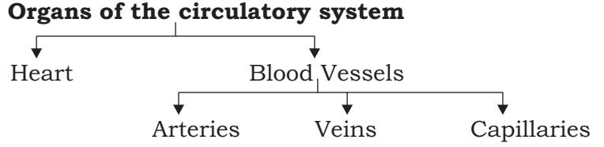

Heart (Fig. 2.8) is the most vital organ of the body. It is situated between the two lungs in the thoracic cavity and is a cone shaped muscular, four chambered organ covered by a membrane. The four chambers are left and right atria (singular atrium) and left and right ventricles. They are separated by muscular partitions called septa singular septum. The chambers communicate by openings which are protected by valves.

The cardiac muscle cells continuously contract and relax (heart beat) for pumping blood into the organs and receiving blood from them. As the heart beats, oxygenated blood flows into the arteries and goes to various parts of the body, and then it flows back to the heart through veins for oxygenation in the lungs. This circulation of blood is depicted below. Blood flow between heart and lungs is called pulmonary circulation, while between heart and body parts is called systemic circulation.

The process of circulation is shown in Fig 2.10 and further elaborated below.

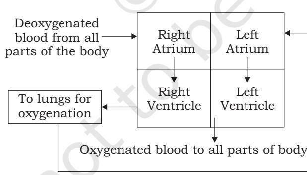

*Fig. 2.9: Diagrammatic representation of the heart and the flow of blood through it*

# **As shown in the above figure**

- **•** Deoxygenated blood from all parts of the body is collected by the veins. Veins pour deoxygenated blood laden with carbon dioxide into right atrium of the heart.
Eff ects of Physical Activiti e s on Human Body

15

Chap-2.indd 15 8/24/2020 1:09:28 PM

- **•** From right atrium, deoxygenated blood goes to right ventricle and then through pulmonary artery to lungs.
- **•** Pulmonary vein carries (oxygenated blood) from the lungs to the left atrium of the heart from where it goes to the left ventricle.
- **•** Aorta, a large artery arises from left ventricle and the oxygenated blood enters the arteries and reaches all the organs through them.

#### **Activity 2.2**

In the diagram below, fill in the blanks with the words provided within brackets. In the upper boxes name the parts of the body from where blood is entering or going to and in the lower box state the kind of blood, oxygenated or deoxygenated. After filling discuss with one of your classmates.

[Words: Lungs, upper part of body, lower part of body, all parts of body; +O2 (oxygenated) and –O2 (deoxygenated).]

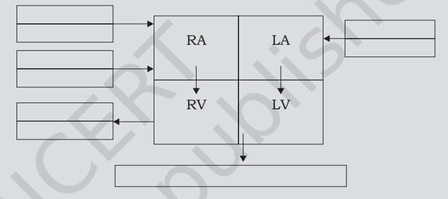

Now you have understood that blood flows from various parts of the body to heart, heart to lungs, lungs to heart and heart to various parts of the body. Since, in one circuit of circulation, blood passes through the heart twice, blood circulation is termed double circulation. Regular physical exercise has a positive effect on circulation. Hence, regular physical exercise is important for all.

# **Effects of Physical Activities, Games, Sports and Yoga on Muscular, Circulatory and Respiratory Systems**

Physical exercise and Yoga, when regularly done, have a positive effect on the body, as explained below.

# **Effects of physical activities on vital organs and body functions**

#### *Bones*

Weight bearing exercise helps preserve bone mass and thus protects against osteoporosis (bone degeneration).

16

Chap-2.indd 16 8/24/2020 1:09:28 PM

## *Muscles*

Physical activity build and strengthen muscles, which can protect the bones from injury, support and protect joints from being affected by arthritis. Strong muscles also give stability and improve balance and coordination during movements. Physical activities also improve blood supply to the muscles and increase their capacity to use oxygen.

#### **Muscles and muscle performance**

Physical activities if undertaken regularly have beneficial effects on the muscular system. Whenever physical activities, games or sport are undertaken there is contraction of muscles and increase in energy level due to breakdown of ATP.

The beneficial effects of regular physical activities are listed below —

- **•** *Change in shape and size of the muscle fibres:* Muscle fibres enlarge with physical activities which cause an overall enlargement of muscles with the change in its size and shape. The size of muscles increases by 60 per cent. It is because of this reason that, the muscles of arms of a tennis player are well developed.
- **•** *Maintenance of muscle tone:* Muscles are stimulated to contract by signals from nerves. Due to continuous signals, when physical exercises are undertaken, muscles remain in partial state of contraction called muscle tone. Hence, regular physical activities maintain good muscle tone and enhance physical fitness.
- **•** *Increase in muscle proteins:* The units of muscle contraction are proteins. Physical activities lead to increase in total proteins.
- **•** *Increase in blood capillaries:* Regular physical exercises lead to increase in number of blood capillaries supplying blood to muscles.
- **•** *Increase in efficiency of ligaments and tendons:*  Ligaments and tendons become more efficient as a result of regular physical activity. This improves muscle movements resulting in greater tolerance of stress during strenuous activity.
- **•** *Long term increase in muscle strength:* Regular physical exercises increase and maintain strength of muscles. This increases speed of contraction as in the case of marathon runner and also work well against load as in the case of weight lifter.
- **•** *Delay in muscle fatigue:* Muscles need oxygen to contract. But when muscles are used for a long time during sport, available oxygen gets used up and lactic acid accumulates. This causes muscle fatigue. It is, therefore, important to do physical activities like stretching to delay muscle fatigue.

Eff ects of Physical Activiti e s on Human Body

17

Chap-2.indd 17 8/24/2020 1:09:28 PM

- **•** *Maintaining correct posture and beautiful body:* Regular physical activities and yogic activity like asanas prevent postural deformities. Healthy muscles give the body a beautiful shape.
#### **Oxygen Debt**

During physical activities, respiratory rate increases. At the same time, oxygen gets speedily used up, this creates an oxygen debt, as the rate of oxygen intake may not match the oxygen requirement due to the exercise. Thus, maximum exercises are followed by a recovery period when oxygen debt is removed by obtaining more oxygen. For example, when an athlete is running and requires 3 litres of oxygen, if oxygen obtained is only 2 litres, oxygen debt of 1 litre is created, which gets recovered during recovery period.

- **•** *Overall improvement in efficiency of muscle movements and reaction time:* Muscles contract on receiving stimulus from nerves. The time taken to react to the stimuli (reaction time) improves with regular physical exercise.
- **•** *Increase in capacity for storage of food:* Regular physical activities help cells to store more food, which can be readily available for oxidation to provide energy when needed.

#### **Respiratory system**

- **•** Increase in size of lungs and volume of chest: Physical activities require more oxygen. Therefore, more oxygen has to be inhaled. This provides exercise to the lungs and chest and as a result the size increases. Simultaneously, the diaphragm and rib muscles strengthen.
- **•** Increase in lung power: Respiratory exercises, which include Pranayam and Anulom-vilom, improve lung power. The efficiency of alveoli or air sacs of lungs also improves.
	- **•** Activation of unused (inactive) alveoli: Active inhalation increases residual volume of air, tidal air and vital capacity which is important for healthy body.

**Residual volume of air:** Even after forced expiration some air remains in the lung, it cannot be expelled and is called residual air.

**Vital capacity:** Vital capacity is the amount of air inhaled and exhaled with maximum effort. In normal adult, it is 3500 cc to 4500 cc.

#### **Vital Capacity = TV + IRV + ERV**

(TV= Tidal Volume, IRV =Inspiratory Reserve Volume, ERV=Expiratory Reserve Volume)

**TV:** The volume of air breathed in and out during quiet breathing is called tidal volume.

18

Chap-2.indd 18 8/24/2020 1:09:28 PM

**IRV:** Air over and above tidal volume that can be breathed in upon continuous inhalation.

**ERV:** Air breathed out over and above TV upon continuous exhalation.

Exercising regularly makes vital capacity go upto 5500cc.

#### **Circulatory system**

Blood pumped into circulation transports oxygen and food to tissues, removes waste and also transports hormones to target organs. During physical activities, nutrients and Oxygen is needed by muscles to get energy for contraction. So heart pumps at a faster rate and circulation is speeded up. But this change is temporary. Certain permanent changes also occur when physical activities are undertaken regularly. These are given below.

- **•** *Increase in the size of heart* occurs as cardiac muscles develop with regular physical activities. Regular exercise increases the capacity and thickness of the walls of the heart.
- **•** *Increase in number of capillaries and blood cells:*  The unused capillaries become active with physical activities making circulation efficient. An increase in the number of blood cells and amount of hemoglobin has also been observed.
- **•** *Decrease in heart rate:* Under normal conditions the heart beats 72 times per minute at rest. But an athlete's heart rate may be found to be much lower at rest. The athlete's heart becomes so efficient that at rest same requirement is fulfilled with fewer heartbeats.
- **•** *Increase in stroke volume:* Stroke volume is the quantity of blood pumped out by aorta in one stroke. Heart, having gained efficiency with regular physical activities, is able to pump out more blood in one stroke.

#### **Activity 2.3**

Complete the table given below to depict the positive effects of regular physical activities on organ systems.

| Organ | Positive effective of regular physical |
| --- | --- |
| System | activities |
| Muscular | Improved |
| System | muscle |
|  | performance |
| Respiratory | Increase |
| System | in stroke |
|  | volume |
| Circulatory | Pumping blood |
| System | with more |
|  | efficiency |

Chap-2.indd 19 8/24/2020 1:09:28 PM

# **Activity 2.4**

You have already studied asanas in your previous class. Write the names of asanas which can improve the —

- **•** Respiration system
- **•** Circulatory System
- **•** Muscular system

Health

20

and P

hysical

Education -

Class X

- **•** *Decrease in LDL and increase in HDL:* LDL and HDL are low density lipoproteins and high density lipoproteins respectively. Lipoproteins are secreted by liver. LDL, also known as bad cholesterol, adversely affects the blood vessels of the heart. On the other hand, HDL which is good cholesterol helps to remove cholesterol from the body. Regular physical activities help in production of more HDL and less LDL Thus physical activities help in reducing blood cholesterol.
- **•** *Prevention of heart related illness/ailments:* It is well known that cardiac diseases and high blood pressure can be prevented by regular physical exercises.

# **Effect of Yoga on the Body**

Yogic practice ensures good health and enhances physical fitness. Some of the asanas have been explained in Chapter 9. It has been found that these asanas develop muscles of the chest, abdomen and lungs and make them active. Some of you have already learnt this in Class IX.

Muscles of the rib cage are involved in respiration so the asanas indirectly improve respiration. Regular Yoga practice also improves blood circulation.

Apart from asanas, suryanamaskar is an integral part of yogic practice. Suryanamaskar improves blood circulation and makes the lungs strong.

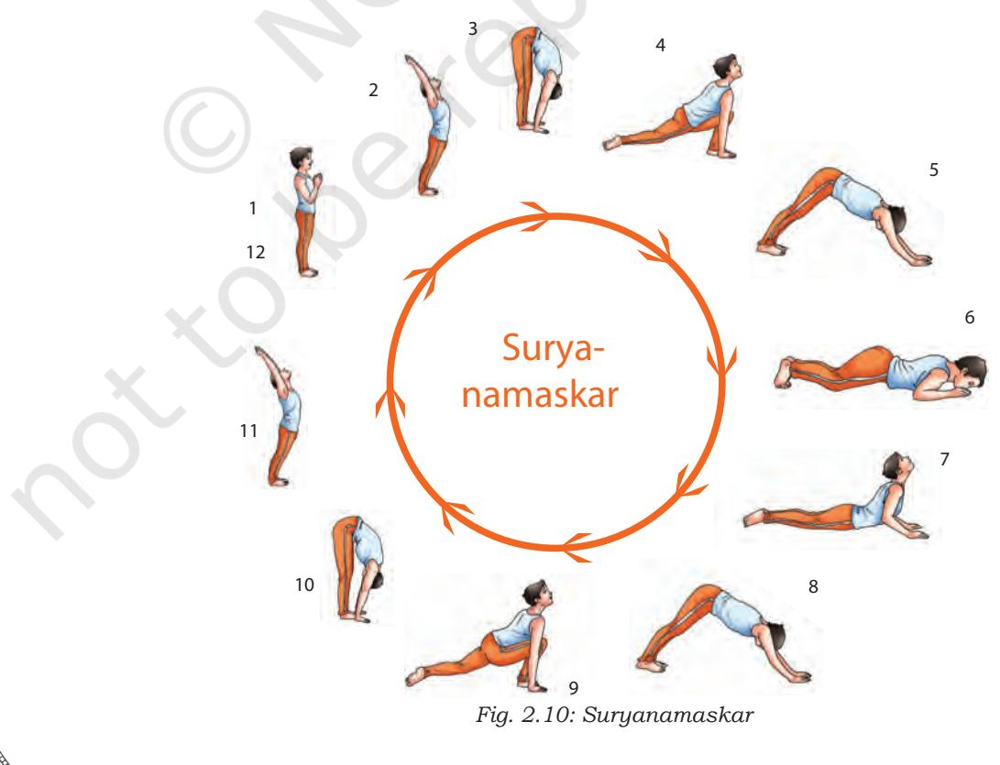

Chap-2.indd 20 8/24/2020 1:09:29 PM

# **Activity 2.5**

Words related to human body are hidden in the matrix given below. Search for them by going up or down, or even diagonally. Circle each of the discovered word.

| X | M | Y | L | M | V | N | Q | O | T | W | Z |
| --- | --- | --- | --- | --- | --- | --- | --- | --- | --- | --- | --- |
| Y | N | T | U | I | R | P | C | X | M | C | D |
| P | I | X | A | C | T | I | N | Y | L | J | N |
| F | B | N | L | J | X | W | I | Z | R | O | Z |
| M | Y | O | S | I | N | F | T | X | I | N | R |
| R | Q | M | T | P | G | S | C | T | Y | Z | N |
| X | C | Y | U | N | I | U | A | V | O | Y | T |
| P | A | L | N | U | X | R | Y | Z | Q | C | M |
| W | R | U | R | Q | I | E | A | W | A | S | Q |
| S | D | T | H | P | N | L | I | T | X | Z | Y |
| A | P | Z | X | M | O | C | U | Z | I | N | M |
| U | A | E | G | R | D | S | H | E | R | O | S |
| W | C | P | F | Q | N | U | Y | X | M | Z | N |
| U | Z | S | T | N | E | M | A | G | I | L | Z |
| L | B | R | E | A | T | H | I | W | N | G | X |

21

Eff ects of Physical Activiti e s on Human Body

Chap-2.indd 21 8/24/2020 1:09:29 PM

### **I. Answer the following Questions**

- 1. Give one example to show that organ systems work in unison. You may mention two or more organ systems to support your point.
- 2. Ravi is a good athlete. Give one permanent effect of being an atlete on of systems his muscular system, and respiratory system.
- 3. "Physical activities are necessary for developing a healthy body and healthy mind." Give two examples in support of this statement.
- 4. Complete the sentence —

 The respiratory system gets positively affected by undertaking yoga exercises regularly because __________________.

- 5. Mention two changes that take place in each of the circulatory and respiratory systems due to regular physical activities.
- 6. Some of your friends avoid physical activity. Other friends are always eager to participate in physical activities. Prepare a health profile of your friends who indulge in games and yoga regularly. Indicate what physical activities they undertake regularly. What is the time duration? How do those who are physically active get motivation to play some games or exercise regularly? Present your findings in class and allow your peers in the classroom to add to the profiles you prepared.

22

Chap-2.indd 22 8/24/2020 1:09:29 PM

