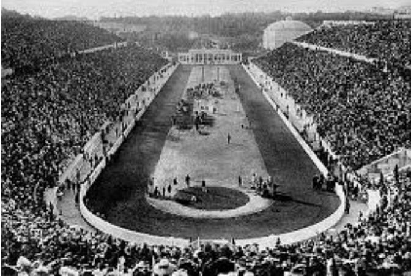
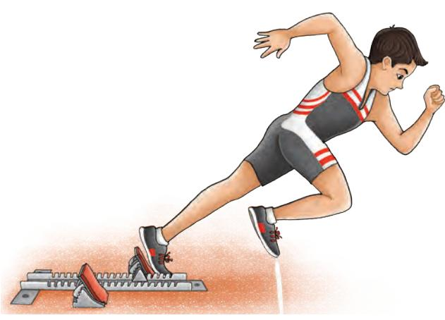
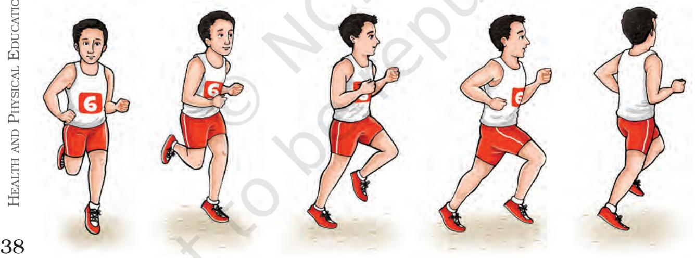
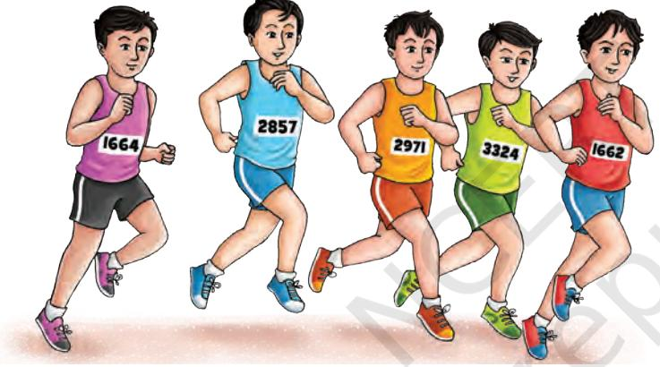
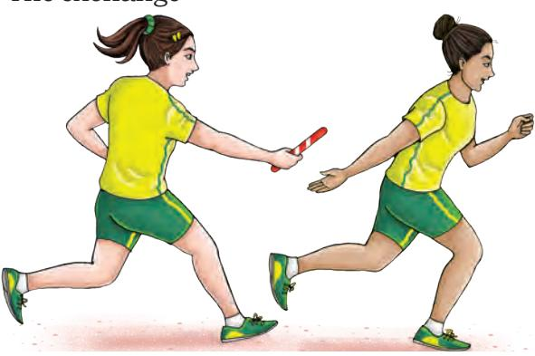
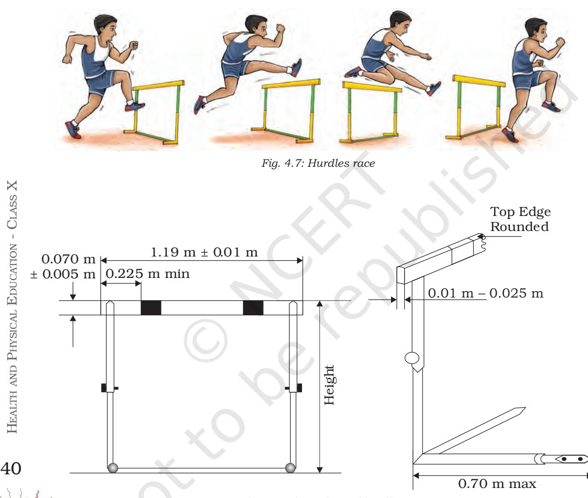
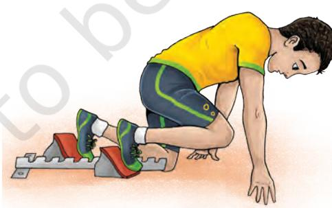
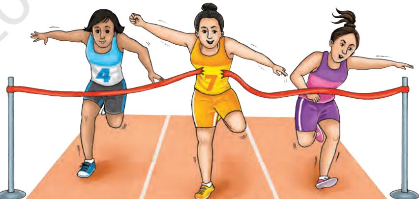
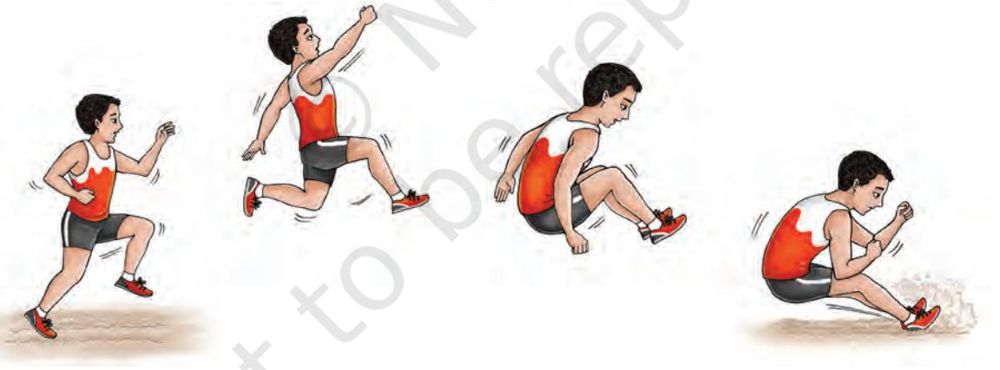
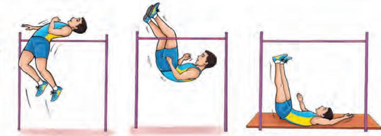

# **Individual Games and Sports I**

You might have participated in different games and sports. There are two broad categories of competitions which are played as individual games and team games. Team games are represented by more than two players. The example of team games are Football, Cricket, Hockey, Basketball, Volleyball, etc. Individual games are played with different events like, singles events, doubles or mixed events.

There are many individual sports, for example, Badminton, Table Tennis, Tennis, Swimming, Judo, Wrestling, etc. Track and field is also an individual sport which we will discuss in this chapter. We shall discuss various aspects of track and field, such as, history, rules and regulations, classification of track and field events.

### **Track and Field**

Track and field events are comprised with running events and field events. All running events are held in the track and categorised as short distance, middle distance and long distance running, race walk, hurdles and steeplechase events.

Field events are categorised as, throwing and jumping events. There are "combined events" which includes decathlon for men and heptathlon for women. Decathlon which is organised for men includes 10 events and Heptathlon for women includes 7 events. The events are described below with the help of Table 4.1.

#### **Activity 4.1**

- **•** Enlist the events of Decathlon for men.
- **•** List out the events of Heptathlon for women.

Chap-4.indd 35 8/24/2020 11:37:16 AM

|  | Track (Running Events) |  | Field Events |
| --- | --- | --- | --- |
|  |  | Throwing | Jumping |
| (a) | Short Distance | • Javelin Throw • High Jump |  |
|  | Running Events | Discus Throw Long Jump • • |  |
|  | 100 meter, 200 meter, | • Shot Put • | Triple Jump (Hop-step-jump) |
|  | 400 meter, |  |  |
|  | 110 meter, Hurdles | • Hammer Throw • Pole Vault |  |
|  | (men) |  |  |
|  | 100 meter Hurdles |  |  |
|  | for women |  |  |
|  | 400 meter Hurdles |  |  |
|  | (men and women) |  |  |
| (b) | Middle Distance | Relay Events | Combined Events |
|  | Running Events | (a) 4 × 100 mtr (a) | Decathlon (Men) (consist 10 |
|  | 800 meter, 1500 | (men & women) events) |  |
|  | meter | (b) 4 × 400 mtr | 100 m, Shot put, High Jump, |
| (c) | Long Distance | (men & women) | Long Jump, 400 m. |
|  | Running Events | (c) 4 × 400 mtr | 110 m. Hurdle, Discuss Throw, |
|  | 5000 meter, | (mix relay) | Pole Vault, Javelin Throw, and |
|  | 10,000 meter |  | 1500 m. |
|  | 3000 meter Steeple | (b) | Heptathlon (Women) (consist 10 |
|  | Chase (m), 20 | events) |  |
|  | km walking, 50 |  | 100 m. Hurdle, High Jump, |
|  | km walking and |  | Shot Put, 200 m. |
|  | Marathon (42.195 |  | Long Jump, Javelin Throw, and |
|  | km). |  | 800 m. |

#### **Table 4.1: Track and Field Events**

#### **History**

Track and field events are among the oldest of all sporting competitions. Running, jumping and throwing have been universal forms of human physical activities since the human beings exist. The first recorded example of organised track and field events is found in the Ancient Olympic Games held in 776 BC. The starting of the modern Olympic Games at Greece in 1896 was marked as new era for track and field events which was initiated by Pierre-de-Coubertin. Until the early 1920s, only males were participating in the track and field events. Introduction of five track and field events for women in the athletics was started during 1928 Summer Olympics. Gradually more women's events were introduced as time progressed. However, it was only towards the second half of the twentieth century that the men's and women's track and field events were given equal status. Furthermore, major track and field events for disabled athletes were first introduced at the 1960 Summer Para Olympics. From 1990's onwards, track and field events became increasingly more professional.

**Activity 4.2**

distance.

is 42.195 km? **•** Collect information about different Marathon and their

**•** Find out why Marathon

36

Chap-4.indd 36 8/24/2020 11:37:17 AM

The World Athletics Federations (WAF) was formed and 200 nations became its member. Olympic Games are organised after every four years.

*Fig. 4.1: 1896 Olympic Panathnaic Stadium track*

## **Track Events**

Track events are running events on a track for specified distances.

These include (i) Sprints (100m, 200m, 400m), (ii) Middle Distance (800m, 1500m), (iii) Long Distance (3000m, 3000m, Steeplechase, 5000m, 10,000m), (iv) Relays (4×100m, 4×400m), and (v) Hurdles (110/100m, 400m).

#### **Activity 4.3**

- **•** Name the person who started Modern Olympic Games in 1896?
- **•** Find out the colours of Olympic rings.
- **•** What does it symbolise?
- **•** Discuss for whom Para Olympic meant for and how many events?

#### **Do You Know?**

The IAAF World Championships in Athletics became a fully professional competition from 1997.

200 3000, 5000 200 400m Track Various events start Indication 1500 110 Hurdles 100, 100 Hurdles 400, 800, 10000 4×100, 4 400× Finish line for all events

*Fig. 4.2: Starting position of various events in 400 meter track*

Individual Games and Sports I

37

Chap-4.indd 37 8/24/2020 11:37:17 AM

#### **Sprints**

Sprinting is the name given to short distance running in which the runner tries to maintain maximum speed for the whole race. These include track events covering distances

*Fig. 4.3: Sprint running*

of 100 meters, 200 meters, 400 meters, 4×100 meters relay, 4×400 meters relay, and hurdle races of 100 meters for women, 110 meters for men and 400 meters for both men and women. At the professional level, sprinters begin the race by assuming a crouching position on the starting blocks. Then they lean their body forward and gradually move into an upright position as the race progresses and momentum is gained. Athlete remain in the same lane on the running track throughout the sprinting distance. The man or woman who runs fastest and takes minimum time over 100m, wins the race.

The winner is often named 'the fastest man/woman in the competition'. Some sprint events start in lanes, to cover the same distance for each runner.

# **Activity 4.4**

Tell the name of different starts in sprint events.

**Middle distance**

*Fig. 4.4: Middle distance running*

The middle distance races are of 800 meters and 1500 meters. Runners start the race from a standing start position in the lanes along a curved starting line or in staggered lanes. However the distance is same for each runner. After hearing the starter's pistol, they head forward in the designated lane or move towards the innermost track to follow the shortest route to the finish. Athletes rely more on speed endurance and

Chap-4.indd 38 8/24/2020 11:37:19 AM

pacing than just pure speed. Middle-distance races require different skills and tactics to win the sprints competition. These races require that the athletes maintain a plateau pace, (i.e. the maintenance of speed at which the runner is running) that allows for a final spurt of speed, whereas sprint races need to be run at top speed for the entire length of the race.

#### **Long distance**

There are four common long distance running events in track and field. These are 3000 meters, 5000 meters and 10,000 meters and 3000 meters steeplechase. Long distance track races have much in common with middle distance races. However, in these races, pacing, endurance, and race tactics play an important role in performance. In these events, runners need to balance their energy to win the race.

*Fig. 4.5: Long distance running*

#### **Activity 4.5**

What are important points in relays? Practice relay baton exchange technique amongst your friends.

### **Relays**

Relay races are the only track events in which a team of runners directly compete against other teams. Common relay races are the 4×100 meter and the 4×400 meter. The exchange

of baton takes place within a specified area of the track called baton exchange zone. Teams may be disqualified if the team fails to complete the baton exchange within an area of 20 meters, the team is considered as disqualified. A team may also be disqualified if its runners have deliberately created hurdle for the other competitors. The 4×100 meter event is run strictly within the same lane on the track. It means that the team collectively runs one complete circuit of the track. Teams in a 4×400 meter event remain in

*Fig. 4.6: Relay race*

39

Chap-4.indd 39 8/24/2020 11:37:21 AM

There are 28 hurdle jumps and 7 water jumps in 3000 meters steeplechase event.

their own lane until the runner of the second leg passes the first bend, at which point runners can leave their lanes and head towards the inner-most part of the circuit. For the second and third baton change-overs, team mates must align themselves in respect of their team position. The leading team takes the inner lanes while team mates of the slower teams must await the baton on outer lanes.

**Hurdles**

*Fig. 4.8: Dimensions of hurdle*

In this race, hurdles are placed at fixed intervals along the track. The runners have to run over them on their way to finish the line. Typical hurdle races are the 100m and 400m for women and 110m and 400m for men. Timing, footwork, and techniques are key in winning the hurdle events. Athlete needs

Chap-4.indd 40 8/24/2020 11:37:22 AM

to run fast. The key factor to win in the hurdles race is to cross the hurdles without slowing down.

| Distance | Men | Under 20 | Under 18 | Under 20 | Under 18 |
| --- | --- | --- | --- | --- | --- |
|  |  | Men | Boys | Women | Girls |
| 110 m/100 m | 1.067 m | 0.991 m | 0.914 m | 0.838 m | 0.762 m |
| 400 m | 0.914 m | 0.914 m | 0.838 m | 0.762 m | 0.762 m |

#### Dimensions: Standard heights of the hurdles

#### Men under 20 and boys under 18

| Distance of | Distance from start | Distance between | Distance from last |
| --- | --- | --- | --- |
| Race | line to first hurdle | hurdles | hurdle to finish line |
| 110 m | 13.72 m | 9.14 m | 14.02 m |
| 400 m | 45.00 m | 35.00 m | 40.00 m |

#### Women under 20 and girls under 18

| Distance | Distance from | Distance | Distance from |
| --- | --- | --- | --- |
| of Race | start line to | between | last hurdle to |
|  | first hurdle | hurdles | finish line |
| 100 m | 13.00 m | 8.50 m | 10.50 m |
| 400 m | 45.00 m | 35.00 m | 40.00 m |

#### **Rules of track events**

The rules of track events, as observed in most international athletics competitions, are formulated by the International Association of Athletics Federation (IAAF). Key rules of track events relate to three phases — starting, running and finishing.

#### *Starting*

- **•** The start of a race is marked 5 cm wide by a white line. In all races, that are not run in lanes, the start line must be curved, so that all the athletes run the same distance upto the finish.

*Fig. 4.9: Starting position for a sprint race*

- **•** Starting blocks shall be used for all races up to and including 400 meter (including the first lap of the 4x100 and 4x400) and shall not be used for any other race. No part of the starting block overlaps the start line or extend into another lane.

| Activity 4.7 |  |
| --- | --- |
| The details stated above aim |  |
| at making us understand |  |
| about the different types |  |
| of running. Identify | the |
| different distances in each |  |
| of the following — |  |
| Sprints | (1) |
| (2) |  |
| Middle Distance | (1) |
| (2) |  |
| Long Distance | (1) |
| (2) |  |
| Hurdles | (1) |

The details stated above aim at making us understand about the different types of running. Identify the different distances in each

- 
(2)

41

Chap-4.indd 41 8/24/2020 11:37:23 AM

- **•** In most international competitions, the command of the starter is "on your marks" and "set" for crouch start and "on your mark" for standing start.
- **•** Any sprinter with a false start is considered disqualified.
- **•** Athletes are not permitted to run inside the inner curve of the track. They have to run in their designated lanes only.

#### *Running*

- **•** In all races that are run in lanes, athletes have keep themselves their allocated lanes from start to finish. This also applies to any portion of a race run in lanes.
- **•** If an athlete leaves the track or steps on the line demarking the track, this will be considered disqualified.
- **•** An athlete, after voluntarily leaving the track shall not be allowed to continue in race.
- **•** Any athlete found intentionally obstructing the path of another runner is also disqualified from the race.
- **•** There are races that start in lanes and then at a "break line", the competitors merge. Examples of this are the 800 meters and 4x400 relay race.

#### *Finishing*

- **•** The finish of a race is marked by a white line 5 cm wide. Competitors are placed in the order in which any part of their torso (as distinguished from the head, neck, arms, legs, hands or feet) reaches the vertical plane of the nearer edge of the finish line.
- **•** The measurement of time shall be taken from the flash or the smoke of the gun to the finishing touch, which shall be recorded in 1/100th of a second if taken manually. Fully automatic timing (FAT) is required for high level meets.

*Fig. 4.10: Finishing position for a sprint race*

42

Chap-4.indd 42 8/24/2020 11:37:25 AM

## **Field Events**

Field events constitute of events that are participated by men and women outside the track. These include jumping events (Long Jump, Triple Jump, High Jump and Pole Vault) and throwing events (Shot Put, Discus Throw, Javelin Throw and Hammer Throw).

#### **Jumping events**

The jumping events comprise Long Jump, Triple Jump, High Jump and Pole Vault.

- 1. Long jump: The long jump is one of the oldest field events. The take-off has to be made from a 20 cm wide board one meter away from a pit. Athletes sprint along a length of track to a take off board and a sandpit. If any part of the runner's foot goes past the takeoff board, the jumper is considered for a foul and does not receive score for that round. Distance is measured from the end of the takeoff board to the nearest mark made by the jumper on the pit. Best eight competitors have a maximum of six rounds. Professional long jumpers typically have strong acceleration and sprinting abilities. However, athletes must also have a consistent stride to allow them to take off near the board while still maintaining their maximum speed.

*Fig. 4.11: Long jump*

- 2. Triple jump: Similar to the long jump, the triple jump takes place on a field heading towards a sandpit. This event is termed as the "hop-step and jump." The event begins like a long jump, with competitor dashing down the runway and leaping from a takeoff board they first hop then take a step and then jump into the pit. The event is scored identically to the long jump.
 and

Sports I

Chap-4.indd 43 8/24/2020 11:37:25 AM

Practice and measure separately hop step and jump

#### **Activity 4.9**

In case of tie in high jump practice how to break it.

Hop phase Step phase Jump phase

#### *Fig. 4.12: Triple jump*

- 3. High jump: In high jump event, competitors combined speed, to generate lift, with jumping technique. Jumpers may approach the bar from either-side, and land on a large, generally inflated cushion. In between, they must clear the 4-meter-long bar without knocking it off its supports. The bar will originally be set at a low height, at which competitors may choose to jump, or pass to another height. The bar is raised to a predetermined height after each round. Each competitor who either clears or passes a height advances to the next round. They are ranked according to the height they clear. An athlete is allowed a maximum of three trials of each height. Competitors are eliminated after missing (failing) three consecutive jumps in a particular height. Athletes have a short run up and then take off from near one foot to jump over a horizontal bar and fall back onto a cushioned landing area. Jumping technique has played a significant part in the history of the event. The modern technique of high jump as shown in the figure is known as "Fosbury Flop".

*Fig. 4.13: High jump*

- 4. Pole vault: Each vaulter sprints down the runway with a fiberglass or carbon fiber pole and plants the pole into the vaulting box. This box is specifically made of
44

Chap-4.indd 44 8/24/2020 11:37:32 AM

fiberglass or carbon fiber. The atheletes then push themselves over the crossbar and land onto the mattress.

*Fig. 4.14: Pole vault*

The rules require that athletes do not move their hands along the pole. As per technique, they begin clearing the bar with their feet first in a position so that the stomach faces the bar. As with high jumping, vaulters may touch the bar, as long as it doesn't fall. Round-by-round scoring rules are the same as for the high jump.

#### **Throwing events**

There are four major throwing events: Shot Put (putting the shot), Discus, Javelin and Hammer Throw. These are detailed below.

*Fig. 4.15: Shot Put*

- 1. Shot Put: In putting the shot event the athletes put a metal ball through the air for maximum distance. For male athletes, the metal ball weights 7.26 kg and for female athletes the weight is 4 kg. The athlete must stay in a circle of 2.135 m (7 ft) diameter until the shot has landed after throw. The put must be made from the shoulder with one arm only, and the shot must not be brought behind the shoulder. In shot put the athlete holds the shot close to their neck in one hand. Then they move in straight line or spin around for gaining
45

 and

Sports I

Chap-4.indd 45 8/24/2020 11:37:35 AM

What is the weight of discuss for men and women?

#### **Activity 4.11**

- **•** What are the lengths of Javelin for men and women?
- **•** What are the weights of Javelin for men and women?

momentum and finally putting the shot in a pushing manner in the direction of the purified landing area.

- 2. Discus: In the discus event the athlete stands inside a throwing circle of 2.5 mt (8'–2½") diameter. As per technique he/she turns around one and a half times and throws the disc as far as he or she can. The disc is a round plate made of wood and metal and weighs 2 Kg for men and 1 Kg for women. When throwing the discus, the athlete must remain in circle. The feet of the athlete cannot leave this area before the discus lands. Even afterwards the athlete must leave the circle from rear half of the circle. Otherwise it is a fault and the throw will not be counted. The athlete will spin around to gain momentum, speed and then releases the disc in the proper direction. The athlete that throws it furthest from the front part of the circle (and within the legal area) wins the event.

Chap-4.indd 46 8/24/2020 11:37:37 AM

for men is 800 grams and 2.6 to 2.7 meters long.

The javelin must be thrown in a specific way for it to be a legal throw. The athlete has to hold the javelin by its grip, throw the javelin overhand and cannot turn the back to the target when throwing. When throwing the javelin, the athlete runs down a runway to gain momentum and then must throw the javelin prior to crossing a line. The athlete cannot go over the line until the javelin lands. To avoid foul, the athlete must have a really good balance at the end of the throw. The athlete must leave the runway from behind the extended lines of the throwing arc.

*Fig. 4.18: Hammer throw*

- 4. Hammer Throw: The hammer throw doesn't actually involve throwing a hammer like you would think. In this throwing event the athletes throw a heavy ball (7.265 Kg for men and 4 Kg for women) that is attached to a handle with a long (4 feet) wire. Like the discus and the shot put, the athlete must stay in a circle until the hammer lands. They spin several times to gain momentum prior to releasing the hammer. Balance is important due to the force generated by having the heavy ball at the end of the long wire.
#### **Rules for field events**

In general, most field events allow an athlete to take their attempt individually, under the same conditions as the other athletes. Each attempt is measured to determine who achieved the longest distance or maximum height.

- **•** Horizontal jumps (long jump and triple jump) must be initiated from behind a line. In the case of throws, that line is an arc or inside a circle. Crossing the line while initiating the attempt will invalidate the attempt. It will be considered as a foul.
47

Chap-4.indd 47 8/24/2020 11:37:39 AM

(3)

The details aim at making us understand that the athletes participate in different types of jumping and throwing events. Identify — Horizontal Jump (1) (2) Vertical Jump (1) (2) Throws (1) (2)

- **•** All landings must occur inside the area called safe. For the jumps, it is a sand filled pit, for throws it is a defined sector.
- **•** A throw landing on the line, on the edge of sector, is a foul.
- **•** Assuming a proper attempt, officials will then measure the distance from the closest landing point back to the line.
- **•** Whenever a record (or potential record) occurs, that measurement is taken (again) using a steel tape and observed by at least three officials (plus usually the meet referee).
- **•** The leading 8 competitors in jumps (Long Jump and Triple Jump only) and throws will get three more attempts in addition to the 3 attempts they already have taken.
- **•** In vertical jumps (High Jump and Pole Vault), set the bar at a particular height.
- **•** The competitor must clear the bar without knocking it off the stands that are holding the bar (flat).
- **•** Three failures in a row will end the competitor's participation in the event.
- **•** The competitor has the option to PASS their attempt.
- **•** A pass could be used to save energy and avoid taking a jump. However, that would not improve their position in the standings.
- **•** After all competitors have cleared, passed or failed their attempts at a height, the bar height will be raised.
- **•** The height of the bar raised is predetermined before the competition. Though when one competitor remains, that competitor may choose their own selected height for the remaining attempts. A record is kept of each attempt by each competitor.
- **•** After all competitors have taken their attempts, the one who jumps the highest height is the winner. The bar does not shift to a lower height except to break a tie for first place or a qualifying position. If those critical positions are still tied after applying the tiebreakers, all tied competitors will take a fourth jump at the last height.
- **•** If they still miss, the bar will go down one increment where they will again jump. This process will continue until the tie is broken.

48

Chap-4.indd 48 8/24/2020 11:37:39 AM

Given below the names of various events in one column. You have to identify the category of events each of these belongs to. Tick off in the appropriate column before the sports event. The category of one is marked as an example.

| Changes | Categories of Sports Events |  |  |
| --- | --- | --- | --- |
|  | Running | Jumping | Throwing |
| Pole Vault |  |  |  |
| Middle and Long Distance |  |  |  |
| Run |  |  |  |
| Long and High Jump |  |  |  |
| Shot Put |  |  |  |
| Hurdle Race |  |  |  |
| Javelin |  |  |  |
| Sprints |  |  |  |
| Triple Jump |  |  |  |
| Discus |  |  |  |
| Relays |  |  |  |
| Hammer |  |  |  |

#### **Some Athletic World Records: Men (As on 01.06.2019)**

| Sr | Events | Time/ | Men | Country | Date |
| --- | --- | --- | --- | --- | --- |
| No. |  | distance |  |  |  |
| 1. | 100 m | 9.58 sec | Usain Bolt | Jamaica | 16 Aug. |
|  |  |  |  |  | 2009 |
| 2. | 200 m | 19.19 sec | Usain Bolt | Jamaica | 20 Aug. |
|  |  |  |  |  | 2009 |
| 3. | 400 m | 43.03 sec | Wayde Van | RSA | 14 Aug. |
|  |  |  | Niekerk |  | 2016 |
| 4. | 800 m | 1:40.91 | David | Ken | 9 Aug. |
|  |  |  | Rudisha |  | 2012 |
| 5. | 1500 m | 3:26:00 | Hicham El | Morocco | 14 July |
|  |  |  | Guerrouj |  | 1998 |
| 6. | Long | 8.95 m | Mike Powel | USA | 30 Aug. |
|  | Jump |  |  |  | 1991 |
| 7. | Triple | 18.29 m | Jonathan | Great | 7 Aug. |
|  | Jump |  | Edwards | Britain | 1995 |
| 8. | Shot | 23.12 m | Randa | U.S.A. | 20 May |
|  | Put |  | Bornes |  | 1990 |

Individual Games

49

 and

Sports I

Chap-4.indd 49 8/28/2020 4:45:34 PM

| Sr | Events | Time/ | Women | Country | Date |
| --- | --- | --- | --- | --- | --- |
| No. |  | distance |  |  |  |
| 1. | 100 m | 10.49 sec | Florance | U.S.A. | 16 Jul. |
|  |  |  | Griffith Joyne |  | 1988 |
| 2. | 200 m | 21.34 sec | Florance | U.S.A. | 20 Sep. |
|  |  |  | Griffith Joyne |  | 1988 |
| 3. | 400 m | 47.60 sec | Manta Koch | Germany | 06 Oct. |
|  |  |  |  |  | 1985 |
| 4. | 800 m | 1:53.28 | Jarmila | Czechosl | 26 Jul. |
|  |  |  | Kratochvilova | ovakia | 1983 |
| 5. | 1500 | 3:50:07 | Genzebe | Ethiopic | 17 Jul. |
|  | m |  | Dibaba |  | 2015 |
| 6. | Long | 7.52 m | Galina | Soviet | 11 |
|  | Jump |  | Chistyakoya | Union | Jun. |
|  |  |  |  |  | 1988 |
| 7. | Triple | 15.50 m | Inessa | Ukraine | 10 |
|  | Jump |  | Kravets |  | Aug. |
|  |  |  |  |  | 1995 |
| 8. | Shot | 22.63 m | Natalya | Soviet | 17 |
|  | Put |  | Lisouskaya | Union | Jun. |
|  |  |  |  |  | 1987 |

#### **Some Athletic World Records: Women (As on 01.06.2019)**

50

Chap-4.indd 50 8/24/2020 11:37:39 AM

# **Assessment**

#### **I. Answer the following Questions**

- 1. What are track and field events? Which of these also belong to the category of team sports?
- 2. What are the main track rules?
- 3. Describe the major rules that are observed in long jump.
- 4. Describe the special features of triple jump and high jump.
- 5. Discuss the specific rules for shot put and discus throw.
- 6. How do you break a tie in high jump?
- 7. How is high jump executed?
- 8. Describe various relay races.
- 9. In which events does the athlete take standing position to start the race?
- 10. How do these track and field events help an individual performance?

#### **II. Fill in the Blanks**

- 1. The standard track is of _________________ meter.
- 2. The hurdles event common for men and women is
- 3. The Diameter of discus circle is _________________.
- 4. The baton exchange area in relay event is _________________ meter.

#### **III. State whether True or False**

_________________.

- 1. Modern Olympic Games started at Greece in 1896.
- 2. The weight of discus for men is 1 kg.
- 3. The official women javelin size is 2.2 to 2.3 meters long and weighs 600 grams.

Chap-4.indd 51 8/24/2020 11:37:39 AM

