# **Individual Games and Sports II 5**

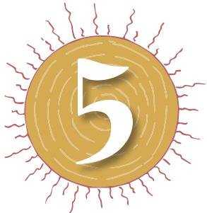

Track and field events, as one of the major individual sports, have already been studied in the previous chapter. However there are other individual sports like Badminton, Gymnastics, Table Tennis, Tennis, Swimming and Combative Sports such as Judo and Boxing. We shall discuss these games in this chapter.

# **Badminton**

Badminton is a racket sport played by either two opposing players (singles) or two opposing pairs (doubles). The players take positions on opposite halves of a rectangular court that is divided by a net. It is one of the few sports where men and women can play together. It is a game for all ages and abilities. Although fitness is a key aspect for professional players, it is also played as a recreation game across the world.

# **History**

The origin of the badminton dates back to second century BC. Although it appears that this sport was named after Badminton House, Gloucestershire, owned by the Duke of Beaufort. In 1873, some British army officers in India initially played the game at 'Poonah' (now known as Pune) thus derived its name. In 1877 first set of rules were derived. These laws were gradually adopted by other nations. However, the game evolved as an international sport only after the first All England Championship. In 1934, the International Badminton Federation (now known as Badminton World Federation) was formed and the rules of the game were standardized. Badminton Association of India came into existence in the year 1934. Various state level associations are affiliated to it.

Chap-5.indd 52 8/24/2020 11:38:26 AM

# **Events**

The events played in badminton are: (a) Singles' (Men, Women), (b) Doubles' (Men, Women), (c) Mixed Doubles' (Combination of one Man and one Woman) and (d) Teams' Event (Men, Women, Mixed)

## **Court**

The court is rectangular, and is divided into 2 halves by a net. Court is usually marked for both singles' and doubles' play. The doubles' court is wider than the 'singles' court.

The full width of the court is 6.1 metres, and in singles' this width is reduced to 5.18 metres. The full length of the court is 13.4 metres. The service courts are marked by a centre line dividing the width of the court, by a short service line at a distance of 1.98 metres from the net, and by the outer side and back boundaries. In doubles', the service court is also marked by a long service line, which is 0.76 metres from the back boundary.

The net is 1.55 metres high at the edges and 1.524 metres high in the centre. The net posts are placed over the doubles sidelines, even when singles is played.

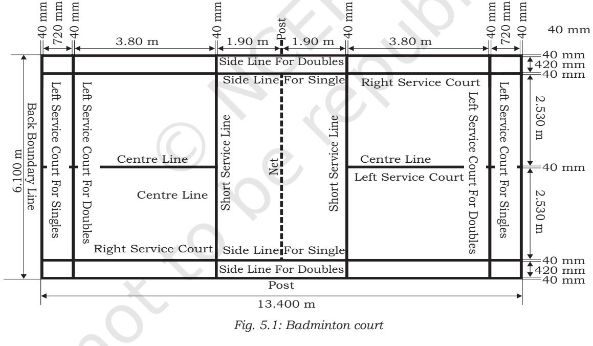

#### **Rules**

#### *Starting the game*

A coin is tossed to start the game. The player winning the toss has the choice to serve first, or to choose which side of the court would they prefer. The player losing the toss gets the left over option.

53

Chap-5.indd 53 8/24/2020 11:38:26 AM

#### *Service*

- **•** At the beginning of the game of badminton and when the score is even, the server serves from the right service court.
- **•** Server and receiver always stand diagonally in opposite service courts.
- **•** The server's racket shall initially hit the base of the shuttle.
- **•** While serving the whole of the shuttle shall be below 1.15m from the surface of the court at the instant of impact of the racket with the shuttle.
- **•** Some parts of both feet of the server and receiver must remain in contact with the surface of the court until service is delivered.
- **•** The movement of the server's racket must continue forward after the start of service until service is delivered.

# *Let*

**'Let'** is called by the umpire, or by a player (if there is no umpire), to halt play. A 'let' may be given for any unforeseen or accidental occurrence. It shall be a 'let', if —

- **•** there is an unforeseen or accidental situation occurs.
- **•** during play, the shuttle is caught in the net or caught on the net and remains suspended on its top after passing over the net.
- **•** the shuttle disintegrates and the base separates from the rest of the shuttle.
- **•** the server and receiver are both faulted at the same time.
- **•** the server serves before the receiver is ready.
- **•** the line judge is unsighted and the umpire is unable to make a decision.
- **•** in the opinion of the umpire, the play is disrupted or a player of the opposing side is distracted by a coach.

# *Faults*

A player or player's side loses the rally, if the service or shuttle —

- **•** is not correct.
- **•** misses the shuttle during service.
- **•** lands outside the court.
- **•** passes through the net.
- **•** fails to cross over the net.
- **•** touches the walls or ceiling or ground before being retrieved.
- **•** is hit twice.

54

Chap-5.indd 54 8/24/2020 11:38:26 AM

- **•** hits a player, attire, equipment or any person or object outside the court.
- **•** is hit by both the doubles partners in succession.
- **•** is in play, the player's racket, parts of his body or his clothes touch the net or its support.

# **Fundamental techniques**

- 1. Grip: Holding grip of a badminton racket is the foundation of playing this game. Holding the racket wrongly will reduce the power and accuracy of the stroke. The shots will be limited. A player needs to learn how to change grip quickly during games. Below are the two basic types of badminton grips.
# *Forehand grip*

- **•** This grip is used to hit shots on the forehand side of the body and around the head shots.
- **•** In this a player holds the racket head in the non-playing hand, keeping the handle points towards the body. The face of the racket perpendicular to the floor.
- **•** The player places the playing hand on the handle just like shaking hands with it, it is like a V shape in between thumb and index finger.
- **•** For flexibility, the racket handle rest loosely in the fingers.
- **•** In order to increase control and accuracy while serving and hitting from the forecourt and mid court, the grip is shortened and placed nearer to the shaft.

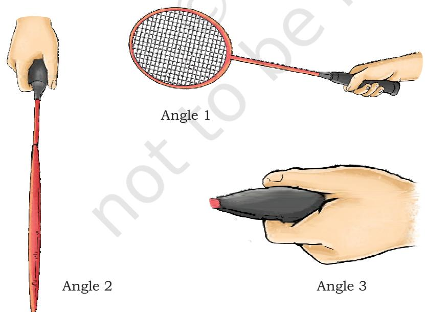

55

Chap-5.indd 55 8/24/2020 11:38:29 AM

# *Backhand grip*

- **•** While playing backhand grip, shots is hit from backhand (left) side of player's body.
- **•** The player holds the racket in the same way as it was held in forehand grip.
- **•** The player turns the racket anti-clockwise so that the V shape moves leftwards.
- **•** The player places the thumb against the back of the handle for greater leverage and power.
- **•** The other techniques are the same as in forehand grip.

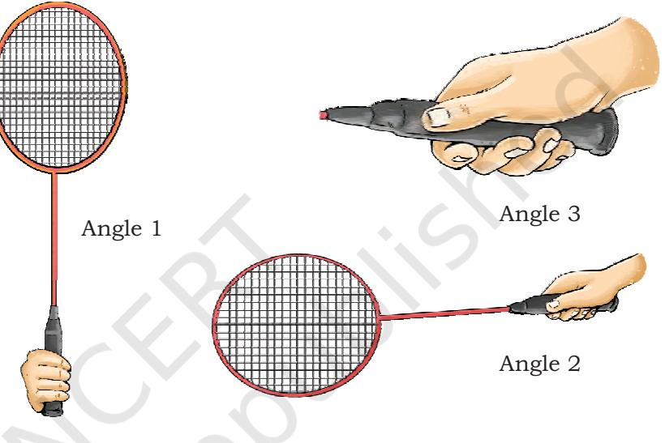

<i>Fig. 5.3: Backhand grip

- 2. Service: There are basically three types of serves high, low and flat. High service is the most basic of all strokes. One needs to learn this first when one starts playing the game. You need to concentrate on the following three broad points while delivering the high service.
	- **•** Stance: To deliver the high service, the player has to take a position about two feet from the short service line and about six inches from the centre line.

The player has to make sure not to touch the centre line as it will be called a touch fault. The player has to stand comfortably with both feet spread apart and parallel to each other and take the initial serving position. At this stage, the full weight of the body is on the back foot.

- **•** Point of Contact: As one starts the forward movement of the racket, slowly start shifting the weight from the back foot to the front foot. The player then drops the shuttle and hit it high and
56

Chap-5.indd 56 8/24/2020 11:38:34 AM

back to the baseline. The player must make sure that the point of contact is always below the waist.

- **•** Follow-through: Once the service is delivered, the player continues to swing the racket right across the left shoulder (or right shoulder if the player is left-handed). This is called the follow through.
- 3. Return of Service: This stroke plays a crucial part in a rally because good return of serve allows a player to dictate terms and control a rally till the point is won. However weak return of serve will allow the opponent to go on the offensive. While receiving the serve to hit the shuttle, normally players stand in the centre of the court with the left foot forward and place the weight of the body more on the front foot. It will help the player to receive all types of serves i.e. high, low and flick. In fact, players are advised to take the stance closer to the short service because in high serve the shuttle remains in the air for a longer duration. On a high serve, a player has the choice of playing an attacking clear, drop shot, smash or a half smash. Similarly, on a low serve, a player can flick, push or lift the shuttle to the baseline. It is important to try to meet the shuttle as close to the net as possible so that the receiver has more options available to choose the shots.

# **Gymnastics**

Gymnastics is a sport that involves physical movements in a sequence. It requires physical strength, balance, coordination, endurance, flexibility and body control. It often involves dance moves, flips, twists, jumps and other moves. It helps children to develop physical coordination and motor skills, proper use of balance develop a good sense of precision and timing. It can be performed as a way to stay fit or specifically to compete in events locally, nationally as well as internationally.

#### **History**

Gymnastics was developed for fitness and beauty practices by the ancient Greeks. It included skills for mounting and dismounting a horse, and circus performance skills. The Greeks used gymnastics as military training. However, in the late eighteenth and early nineteenth century, the German physical educators created exercises for boys and young men on apparatus. Their design is considered as modern gymnastics. The Federation of International Gymnastics was founded in 1881. By the end of the

Chap-5.indd 57 8/24/2020 11:38:34 AM

nineteenth century, men's gymnastics competition was popular enough to be included in the first "Modern" Olympic Games in 1896 and women gymnasts were included in Olympic Games in 1986. The first world cup in gymnastics was organised in 1975.

## **Forms of gymnastics**

The major forms of gymnastics are: Artistic gymnastics, Rhythmic gymnastics, Trampolining, Tumbling and Acrobatic Gymnastics.

#### *Artistic gymnastics*

Artistic gymnastics is usually divided into Men's and Women's Gymnastics. Men compete in six events. These are floor exercise, pommel horse, still rings/roman rings, vaulting table, parallel bars, and horizontal bar. Women compete on four events. These are floor exercise, vaulting table, uneven bars, and balancing beam.

#### **1. Events for men**

- (i) Floor Exercise: For this event a 12×12 square spring floor is required. A series of tumbling passes are performed to demonstrate flexibility, strength, and balance. The gymnast must also show strength skills, including circles, scales, and press handstands. Men's floor routines usually have four passes that will total between 50–70 seconds and are performed without music. As per rules, male gymnasts touch each corner of the floor at least once during their routine.
*Fig. 5.5: Vault*

- (ii) Pommel Horse: A typical pommel horse exercise involves both single leg and double leg skills. Single leg skills are generally found in the form of scissors, often done on the pommels. Double leg skill, however, is the main staple of this event. The gymnast swings both legs in a circular motion (clockwise or counterclockwise depending on preference) and performs such skills on all parts of the apparatus. Gymnasts will often include variations on a typical circling skill by turning or by straddling their legs. This makes the exercises of gymnast more challenging. A gymnast performs a dismount, either by swinging his body over the horse or landing after a handstand.
- (iii) Still Rings: The rings are attached to a wire cable from a point to 5.75 meters from the floor, and adjusted in height so, that the gymnast has room to hang freely and swing. The gymnast performs a

58

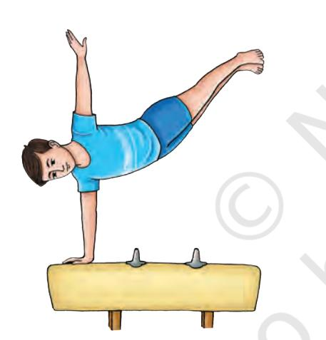

*Fig. 5.4: Pommel horse*

Chap-5.indd 58 8/24/2020 11:38:35 AM

routine demonstrating balance, strength, power, and dynamic motion while preventing the rings themselves from swinging. At least one static strength move is required, but some gymnast includes two or three strenghts. A routine should have a dismount at the end of routine.

- (iv) Vault: In this, the gymnasts sprint down a runway, which is a maximum of 25 meters in length, before hurdling onto a spring board. The body position is maintained while "punching" (blocking using only a shoulder movement) the vaulting board. The gymnast then rotates to a standing position. Multiple twists and somersaults are added before landing in case of advance gymnastics. Vaults depend on the speed of the run, the length of the hurdle, the power the gymnast generated from the legs and shoulder girdle and the kinesthetic awareness in the air. In case of more difficult and complex vaults the speed of rotation is more important.
- (v) Parallel Bars: Men perform on two bars. These are kept slightly further than a shoulder's width apart and usually 1.75 m high. For executing a series of swings, balances, and releases require great strength and coordination.

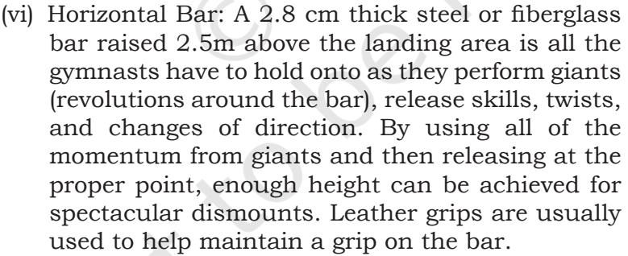

#### **2. Events for women**

nineteenth century, men's gymnastics competition was popular enough to be included in the first "Modern" Olympic Games in 1896 and women gymnasts were included in Olympic Games in 1986. The first world cup in gymnastics

The major forms of gymnastics are: Artistic gymnastics, Rhythmic gymnastics, Trampolining, Tumbling and Acrobatic

Artistic gymnastics is usually divided into Men's and Women's Gymnastics. Men compete in six events. These are floor exercise, pommel horse, still rings/roman rings, vaulting table, parallel bars, and horizontal bar. Women compete on four events. These are floor exercise, vaulting table, uneven

floor at least once during their routine.

horse or landing after a handstand.

(iii) Still Rings: The rings are attached to a wire cable from a point to 5.75 meters from the floor, and adjusted in height so, that the gymnast has room to hang freely and swing. The gymnast performs a

(ii) Pommel Horse: A typical pommel horse exercise involves both single leg and double leg skills. Single leg skills are generally found in the form of scissors, often done on the pommels. Double leg skill, however, is the main staple of this event. The gymnast swings both legs in a circular motion (clockwise or counterclockwise depending on preference) and performs such skills on all parts of the apparatus. Gymnasts will often include variations on a typical circling skill by turning or by straddling their legs. This makes the exercises of gymnast more challenging. A gymnast performs a dismount, either by swinging his body over the

(i) Floor Exercise: For this event a 12×12 square spring floor is required. A series of tumbling passes are performed to demonstrate flexibility, strength, and balance. The gymnast must also show strength skills, including circles, scales, and press handstands. Men's floor routines usually have four passes that will total between 50–70 seconds and are performed without music. As per rules, male gymnasts touch each corner of the

was organised in 1975.

**Forms of gymnastics**

*Artistic gymnastics*

bars, and balancing beam. **1. Events for men**

Gymnastics.

*Fig. 5.4: Pommel horse*

- (i) Floor Exercise: The floor event occurs on a carpeted 12m × 12m square, usually consisting of hard foam over a layer of plywood, which is supported by springs or foam blocks generally called a "spring" floor. Female gymnasts perform a choreographed routine of 50 to 70 seconds in this event. The routine should consist of tumbling lines, series of jumps, dance elements, acrobatic skills, and turns.
*Fig. 5.5: Vault Fig. 5.6: Parallel bars*

59

Chap-5.indd 59 8/24/2020 11:38:36 AM

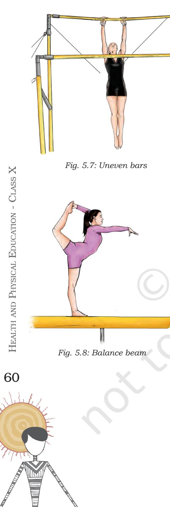

- (ii) Vault: In the vaulting events gymnasts sprint down a 25 meters (82 ft) runway, jump onto or perform a round off entry onto a beat board or spring board, land momentarily, inverted on the hands on the vaulting horse or vaulting table. Then they spring off this platform to a two footed landing. Every gymnast starts at a different point on the vault runway depending on her height and strength. The post flight segment may include one or more multiple somersaults, and/or twisting movements. In vaults with round-off entries, gymnasts "round-off" so that hands are on the runway while the feet land on the springboard. From the round-off position the gymnast travels backwards as in a back handspring so that the hands land on the vaulting platform (horse). She then blocks off the vaulting platform into various twisting and somersaulting combinations.
- (iii) Uneven Bars: On the uneven bars (also known as asymmetric bars), the gymnast performs a routine on two horizontal bars set at different heights. The height is generally fixed, but the width may be adjusted. Gymnasts perform swinging, circling, transitional, and release moves, as well as moves that pass through the handstand. Usually in higher levels of gymnastics, leather grips are worn to ensure that the gymnast maintains a grip on the bar, and to protect the hands from blisters and tears.
- (iv) Balance Beam: The gymnast performs a choreographed routine from 70 to 90 seconds in length consisting of leaps, acrobatic skills, turns and dance elements on a padded spring beam. Apparatus norms set by the International Gymnastics Federation specify that the beam must be 125 cm (4') high, 500 cm (16') long, and 10 cm (4.5") wide. The event requires in particular, balance, flexibility and strength.

#### **3. Rhythmic gymnastics**

Only women compete in rhythmic gymnastics, although there is a new version of this discipline for men being pioneered in Japan. This combines elements of ballet, gymnastics, dance and apparatus manipulation. The sport involves the performance of five separate routines with the use of five apparatus – Ball, Ribbon, Hoop, Clubs, Rope on a floor area, with a much greater emphasis on the aesthetic rather than the acrobatic.

Chap-5.indd 60 8/24/2020 11:38:37 AM

# **4. Acrobatic gymnastics**

Acrobatic gymnastics is one of the oldest forms of organised physical activities, and today it is being reorganised, revitalised by changes and renewed interest. The International Federation of Sports Acrobatics (IFSA) was founded in Moscow in 1973. United States Sports Acrobatics (USSA) was founded in 1975. It was merged with International Gymnastics federation (FIG) in 1999. Sports Acrobatics was demonstration sports at the 2000 Olympics in Sydney. Now, it is an accepted competitive sport. It is very effective for the development of physical fitness and graceful posture. Acrobatic gymnastics is a group gymnastic discipline for both men and women. Acrobats in groups of two, three and four perform routines with the heads, hands and feet of their partners. They may, subject to regulations (e.g. instrumental), pick their own music.

#### **5. Tumbling and trampolining**

Tumbling, also known as power tumbling, is a gymnastics sporting discipline which combines skills of artistic gymnastics with those of trampolining. It is sometimes practiced on a 25-meter-long spring track, competitors both male and female, perform two passes, each containing eight skills, along the track.

# **Table Tennis**

Table Tennis is also known as Ping-Pong, in which two or four players participate using table-tennis rackets on a plain hard surface called Table, which is divided by a net.

# **History**

The game of Table Tennis probably descended from the game of 'Royal Tennis', which was played in the medieval era (12th century A.D.) Table Tennis was probably played with improvised equipment in England during the last quarter of 19th century. Evidence show that David Foster in England patented an action game of Tennis on Table in 1890. One year later John Jaques came out with a game called Gossima. In 1900, a celluloid ball was introduced by Jaques and the name was given as 'Ping-Pong'. Table Tennis is controlled by ITTF (International Table Tennis Federation) which was founded in 1926 with headquarters in Berlin. It was introduced in Olympics in 1988 in Seoul, South Korea. First World Championship of Table-Tennis was held in London in 1926. TTFI (Table-Tennis Federation of India) was formed in 1926 in Calcutta, now known as Kolkata.

Individual Games and 61

Sports II

Chap-5.indd 61 8/24/2020 11:38:37 AM

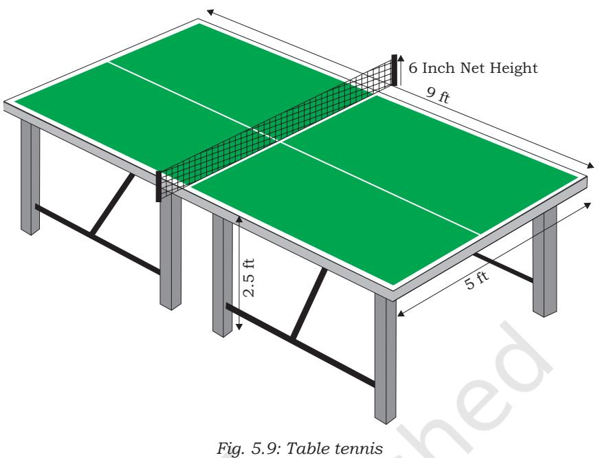

# **Rules**

- **•** Table Tennis table is 9 ft. (2.74 meter) long, 5 ft. (1.525 meter) wide and 2.5 ft.(76 centimeter) high.
- **•** Net is 6 inches (15 centimeter) high from the table.
- **•** A game of Table Tennis is played up to 11 points.
- **•** A player or the pair who first scores 11 points wins unless both players or pairs score 10 points then the game is won by the player or pairs who gains 2 point lead.
- **•** If a player causes the table to move while the ball is in play, player loses a point.
- **•** A player shall score a point if the opponent's free hand touches the playing surface or the net assembly.

# **Fundamental techniques**

- 1. Grip: Players grip their rackets in a variety of ways. The manner in which players grip their rackets can be classified into two major categories i.e. Pen hold grip (mainly used by Chinese and Korean) and shake hand or Orthodox grip (commonly used).
	- **• Pen hold grip:** In this, one grips the racket in such a way as one holds a pen. It involves index finger and think joining each other across the handle and curling the middle, ring and fourth finger on the back of the blade. The three fingers however, will always remain touching one another.

62

Chap-5.indd 62 8/24/2020 11:38:37 AM

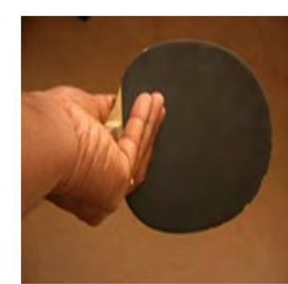

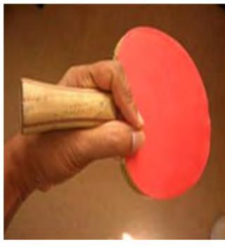

*Fig. 5.10: Pen hold grip*

- **•** Shake hand grip: In this grip, the racket is held in such a way as one shakes hand with someone. The shake hand grip is used due to increasingly fast nature of the game, making the backhand stroke more effective.
- 2. Services: There are different kind, of services, such as, long service, short service, spin service, flat service, high toss service and back-hand or forehand service.
- 3. Types of strokes: The two types of strokes are offensive and defensive including backhand and forehand.
	- (i) Offensive strokes (drive, loop drive, loop, loop kill, hook, counter drive, flip and smash)
		- a) Drive: The racket is primarily perpendicular to the direction of the stroke, and most of the energy applied to the ball results in speed rather than spin, creating a shot that does not arc much, but it is fast enough to make it difficult to return.
		- b) Loop drive: The racket is much more parallel to the direction of the stroke (closed) and the racket thus grazes the ball, resulting in a large amount of topspin. Variations in spin and speed add to the effectiveness of this shot.
		- c) Loop: The loop produces a more pronounced loopy arc, with a higher trajectory and extreme topspin, but is typically slower.
		- d) Loop kill: The loop kill produces a flatter arc, with higher speed that resembles a speed drive but with stronger topspin.
		- e) Hook: It is similar to a regular Loop, but carries a tilted topspin (or is referred as the "top-side" spin), it bounces sideways and downward upon hitting the table.
		- f) Counter drive: It is a counter attack against drives (normally high loop drives). One has

63

Chap-5.indd 63 8/24/2020 11:38:38 AM

to bring close to the racket and stay close to the ball (try to predict its path). The racket is held closed and near to the ball, which is hit with a short movement off the bounce (before reaching the highest point) so that the ball travels faster to the other side.

- g) Flip: When a player tries to attack a ball that has not bounced beyond the edge of the table, however the ball may still be attacked, and the resulting shot is called flip because the back swing is compressed into a quick wrist action.
- h) Smash: Smash is executed when his or her opponent has returned a ball that bounces too high and/ or too close to the net. Smashing is a large back swing and rapid acceleration imparting as much speed on the ball as possible.
- (ii) Defensive strokes
	- a) Push or Slice: The push is usually used for keeping the point alive and creating offensive opportunities. A push resembles a tennis slice, the racket cuts underneath the ball, imparting backspin and causing the ball to float slowly to the other side of the table. Offensive players should only push for variation and not for general rallies.
	- b) Chop: A chop or cut is the defensive, backspin counterpart to the offensive loop drive. A chop is essentially a bigger, heavier slice, taken well back from the table. Sometimes a defensive player can impart no spin on the ball during a chop, or frequently add right- or left-hand spin to the ball. This may further confuse his/ her opponent.
	- c) Block: A block is executed by simply putting the racket in front of the ball, the ball rebounds back toward the opponent with nearly as much energy as it came in with. This is not as easy as it sounds, because the ball's spin, speed, and location, all influence the correct angle of a block.
	- d) Side spin drive: The premise of this move is to put a spin on the ball either to the right or the left of the racket. The execution of this move is similar to a slice, but to the right or left, instead of down. This spin will result in the ball curving to the side but bouncing in the opposite direction when the opponent returns it.

64

Chap-5.indd 64 8/24/2020 11:38:38 AM

- e) Lob: The defensive High Ball or Lob is deceptive in its simplicity. To execute a High Ball, a defensive player first backs off the table 8-10 meters; then, the stroke itself consists of simply lifting the ball to an enormous height before it falls back to the opponent's side of the table. A High Ball is inherently a creative shot, and can have nearly any kind of spin.
- f) Drop shot: The drop shot is a high level stroke, used as another variation for close-to-table strokes. The player has position the racket close to the ball and just let the ball touch it (without any hand movement) in a way that the ball stays close to the net with almost no speed and spin, and touches the other side of the table more than twice if the opponent doesn't reach it.

# **Skills**

# *Forehand drive*

- **•** Keep arm close to the torso.
- **•** Forearm makes 90° with the upper arm.
- **•** Draw the forearm back to another 45°.
- **•** Let the waist turn naturally along with the arm and shift your weight towards the right foot.
- **•** Swing forward with a slight upward motion while shifting your weight back to left foot.
- **•** Elbow should be used as a pivot point and should only move a little forward in the follow through.

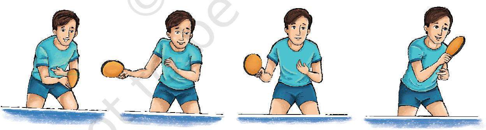

*Fig. 5.11: Forehand drive*

#### *Backhand drive*

- **•** Form ready position.
- **•** Turn waist towards left with Racket towards 9 O'clock position.
- **•** Contact with the ball is made in front of the body slightly after the top of the bounce.

Individual Games and Sports II

65

Chap-5.indd 65 8/24/2020 11:38:42 AM

- **•** Elbow acts as pivot point.
- **•** Snap the forearm forward in slightly upward direction.
- **•** Power comes with the flick of the wrist.
- **•** Follow through until the racket points after the ball.

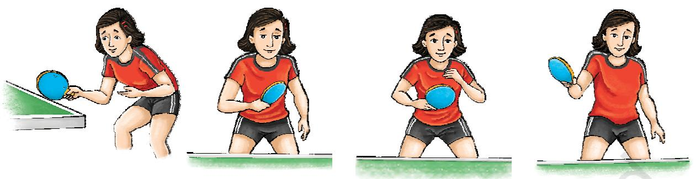

*Fig. 5.12: Backhand drive*

# *Blocking*

It is a backup shot, when there isn't enough time for a full drive or loop. This stroke allows the players to use opponent force against them.

- **•** Adjust the racket angle according to the severity of top spin. More the spin, more one should close the racket.
- **•** Involve a little backspin and follow through.
- **•** Execute immediately after the bounce to keep control and speed.
- **•** Hit the ball as it is rising off the surface of the table on your side using 50 per cent of the stroke action before hitting the ball and 50 per cent after hitting the ball.

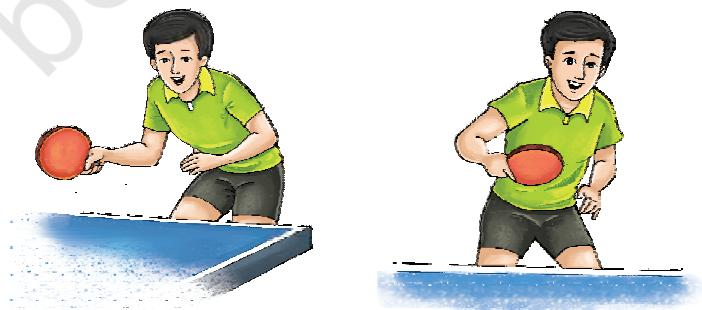

*Fig. 5.13: Blocking*

# **Tennis**

Tennis is one of the most popular individual sports in the world. In tennis, the player uses a racquet to hit a ball over a net into the opponent's court. The ball must be kept in play and can only bounce one time on the court surface and the

66

Chap-5.indd 66 8/24/2020 11:38:49 AM

opponent must strike the ball back over the net. It is a sport usually played between two players (singles) or between two teams of two players each (doubles).

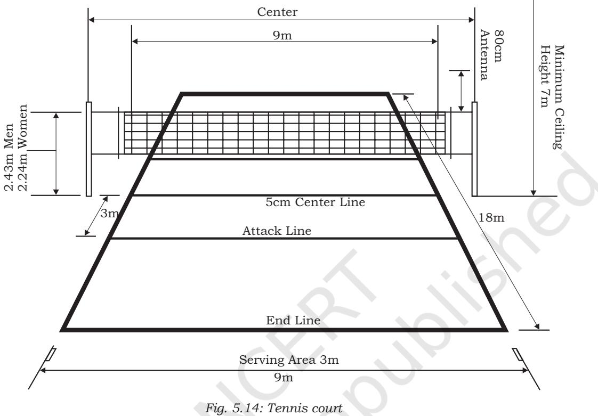

# **History**

An early version of Tennis started in the 16th century in France where players would yell "tenez" when starting a game giving the game the name, Tennis. Later the game was refined in England in the 19th century as lawn tennis which resembled the sport played today. The world's oldest tennis tournament, the Wimbledon Championships were first played in London in 1877. The comprehensive rules promulgated in 1924 by the International Lawn Tennis Federation, now known as the International Tennis Federation, have remained largely stable, one of the major changes being the addition of the tie-back system. The Davis Cup, an annual competition between men's national teams, dates to 1900. The analogous competition for women's national teams, the Fed Cup, was founded as the Federation Cup in 1963. There are four top tournaments called the Grand Slam Tournaments, these are Wimbledon, the US Open, the Australian Open, and the French Open.

67

Chap-5.indd 67 8/24/2020 11:38:49 AM

# **Rules**

The following are the rules regarding equipment, balls, court, lines and scoring:

- 1. Equipment
	- (i) Racquets: Tennis racquet must adhere to the following guidelines —
		- **•** The hitting area, composed of the strings, must be flat and generally uniform.
		- **•** The frame of the hitting area may not be more than 29 inches in length and 12.5 inches in width.
		- **•** The entire racquet must be of a fixed shape, size, weight, and weight distribution. There may not be any energy source built into the racquet.
		- **•** The racquet must not provide any kind of communication, instruction or advice to the player during the match.
	- (ii) Balls: Tennis balls are of hollow rubber with a felt coating. Traditionally white, the predominant colour was gradually changed to optic yellow in the latter part of the 20th century to ensure better visibility.

(iii) Court

- **•** Tennis is played on a rectangular, flat surface, usually grass or clay, a hard court of concrete and/or asphalt and occasionally carpet (indoor). The court is 78 feet (23.77 m) long, and 27 feet (8.23 m) wide for singles matches and 36 ft (10.97 m) for doubles' matches.
- **•** Additional clear space around the court is required for players so as to reach over run balls.
- **•** A net is stretched across the full width of the court, parallel with the baselines, dividing it into two equal ends. The net is 3 feet 6 inches (1.07 m) high at the posts and 3 feet (91.4 cm) high in the center.

(iv) Lines

- **•** The lines that delineate the width of the court are called the baseline (farthest back) and the service line (middle of the court).
- **•** The short mark in the center of each baseline is referred to as either the hash mark or the center mark.

68

Chap-5.indd 68 8/24/2020 11:38:49 AM

- **•** The outermost lines that make up the length are called the doubles' sidelines. These are the boundaries used when doubles is being played.
- **•** The lines to the inside of the doubles' sidelines are the singles' sidelines and used as boundaries in singles' play. The area between a doubles' sideline and the nearest singles' sideline is called the doubles' alley, which is considered playable in doubles' play.
- **•** The line that runs across the center of a player's side of the court is called the service line because the serve must be delivered into the area between the service line and the net on the receiving side.
- **•** All the lines are required to be 2 inches (51 mm) in width. The baseline can be up to 4 inches (100 mm) wide if so desired.
- (v) Scoring
	- **•** The players (or teams) start on opposite sides of the net. One player is designated as the server, and the opposing player is the receiver.
	- **•** A tennis match is determined through the best of 3 or 5 sets. Women play 3 set matches, while men play 5 set matches. For men, the first player to win three sets wins the match, and for women, the first player to win two sets wins the match.
	- **•** A set consists of games, and a game, in turn, consists of a sequence of points played with the same player serving.
	- **•** A game is won by the first player to have won at least four points in total and at least two points more than the opponent.
	- **•** The running score of each game is described in a manner peculiar to tennis: scores from zero to three points are described as "love", "15", "30", and "40" respectively
	- **•** If at least three points have been scored by each player, making the player's score equal at 40 a piece, the score is not called out as "40-40", but rather as "deuce".
	- **•** If at least three points have been scored by each side and a player has one more point than the opponent, the score of the game is "advantage" for the player in the lead.

Individual Games and Sports II

69

Chap-5.indd 69 8/24/2020 11:38:49 AM

- **•** A game point occurs in tennis whenever the player who is in the lead in the game needs only one more point to win the game. The terminology is extended to sets (set point), matches (match point), and even championships (championship point).
- **•** A break point occurs if the receiver, not the sever, has a chance to win the game with the next point. Break points are of particular importance because serving is generally considered advantageous, with the server being expected to win games in which they are serving.
- **•** A receiver who has one (score of 30–40), two (score of 15–40) or three (score of love-40) consecutive chances to win the game has break point, double break point or triple break point, respectively.
- **•** If the leading player wins that game, the player wins the set 7–5. If the trailing player wins the game, a tie-break is played. A tie-break, played under a separate set of rules, allows one player to win one more game and thus the set, to give a final set score of 7–6.
- **•** In tournament play, the chair umpire announces the winner of the set and the overall score.

#### 2. Grip

A grip is a way of holding the racquet in order to hit shots during a match. There are three types of grip.

- i. Forehand: the tennis forehand is a stroke in which the inner side of the palm of the dominant hand that is holding the racket faces forward. The forehand stroke is made by swinging the racket across one's body in the direction of where one wants to land the ball.
- ii. Backhand: The backhand is a tennis stroke in which one swings the racquet around one's body with the back of the hand preceding the palm.
- iii. The Serve (Service): A serve in tennis is a shot to start a pint. A player will hit the ball with racquet so it will fall into the diagonally opposite service box without being stopped by the net. There are three types of serve
	- a) Flat Serve
	- b) Slice Serve
	- c) Kick Serve

70

Chap-5.indd 70 8/24/2020 11:38:49 AM

# **Swimming**

Swimming is a water based sport where a person propels the body through the water by arms, known as strokes and legs that are called kicks and move progressively through water. It is a sport for all round development of the child. Swimming improves cardiovascular system and places minimum stress on joints. It employs major muscle groups of the body leading to a well-developed flexible muscular system. Swimming is also important for physical rehabilitation for people suffering from disabilities or those recovering from injuries.

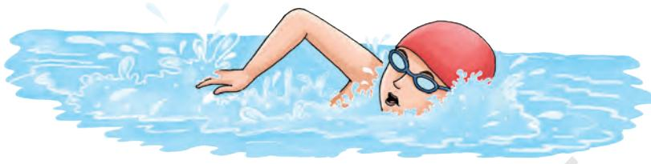

*Fig. 5.15: Swimming*

# **History**

Swimming is a sport that was included in the first modern Olympic Games at Athens in 1896, diving events were added in 1904 and women's competitions were recognised in 1912. FINA (Federation International de Notation) was formed at London Olympic in 1908 AD. National Swimming Association of India was founded in 1949. Swimming was one of the six sports at the First Asian Games held at Delhi in 1951. The aquatic sport of swimming involves competition amongst participants to be the fastest over a given distance. Different distances are covered in different levels of competition.

# **Rules**

- **•** A swimmer must finish the race in the same lane. Swimming across another lane or interfering with the other shall disqualify the offender.
- **•** During a turn the swimmer shall touch the end of the pool.
- **•** A swimmer should not walk.
- **•** Any swimmer not participating in a race, who enters the water in which an event is being conducted before all swimmers shall be disqualified from the next scheduled race in the meet.

#### **Do You Know?**

The current Olympic games contain freestyle events of 50m, 100m, 200m, 400m, 800m, and 1500m; 100m and 200m events in each of backstroke, breaststroke and butterfly; 200m Individual Medley (that is, 50m butterfly, 50m backstroke, 50m breaststroke, and 50m freestyle); 400m Individual Medley (100m butterfly, 100m backstroke, 100m breaststroke, and 100m freestyle); and the Marathon 10km.

Individual Games

 and

Sports II

Chap-5.indd 71 8/24/2020 11:38:50 AM

- **•** There shall be four swimmers in each relay team. In relay events, the team of swimmers whose feet lose touch with the starting platform before the preceding teammate touches the wall shall be disqualified. Any relay team shall be disqualified from a race if a team member, other than the swimmer designated to swim that length, enters the water when the race is being conducted, before swimmers of all teams have finished the race. The member of a relay team and their order of competing must be nominated before the race. Any relay team member may compete in a race only once.
- **•** The composition of a relay team may be changed between the heats and finals of the event, provided that it is made up from the list of swimmers properly entered by a member for that event. Failure to swim in the order listed will result in disqualification. Substitutions may be made only in the case of a documented medical emergency.
- **•** Any swimmer having finished the race, or the stipulated distance in a relay event, must leave the pool as soon as possible without obstructing any other swimmer who has not yet finished the race. Otherwise the swimmer committing the fault or the relay team shall be disqualified.
- **•** Should a foul endanger the chances of success of a swimmer, the referees shall have the power to allow the swimmer to compete in the next heat or, should the foul occur in a final event or in the last heat, they may order it to be re-swim.

# **Fundamental techniques**

Techniques in swimming are strokes, starts and turns.

#### *Strokes*

In swimming there are four competitive strokes (Front Crawl, Back Crawl, Breast stroke and Butterfly stroke) being followed all over the world. All the above mentioned strokes have been learnt in the previous class.

#### *Starts*

All four competitive strokes are to be started in the competition by using the technique known as start. The swimmers emphasis on the quickest technique, which allows him a stronger push off from the starting position. The starting techniques, popular today, are: (i) Grab start (ii) Circular start (iii) Racings start (iv) Conventional start (v) Tuck start. The following sequence is followed; (i) Position on the block (ii) Take off (iii) Flight (position in air) (iv) Entry into the water

72

Chap-5.indd 72 8/24/2020 11:38:50 AM

(v) Glide (vi) First stroke. However, backstroke uses almost a uniform technique, which does not have any special name and is known as backstroke start.

#### *Turns*

During the race, the swimmer must take a turn from the end of the wall to complete the full distance. The swimmers try to use a technique that is quicker and gives a strong push off from the wall within the permissible rules of the stroke. The various turns used by swimmers are: (i) Simple turn (ii) Throw away turn (iii) Summer Sault turn (iv) Flip turn (v) Roll over turn (vi) Breast stroke turn (vii) Butterfly turn.

The following sequence is followed in the turn: (i) Approach to the wall (ii) Turn or touch (iii) Push off (iv) Glide (v) First stroke.

# **Tactics**

Swimming is an individual and cyclic sport. It is highly competitive with the application of science. It is getting transformed from an art to science. Now, the importance is given to strategy and tactics for completing and pacing the race. In order to achieve the best performance, a swimmer must learn to distribute the distance economically and thoughtfully throughout the race. Tactics in swimming during different races can be categorised in three different phase — (i) Sprint races (ii) Middle distance races (iii) Long distance races

#### **Sprint races**

The 50 m race or the sprint race depends on the start, maintaining the speed and a good finish.

# **Middle and Long distance races**

In these races, the key word is to build endurance and speed. In middle and long distance races, the swimmer tries to prevent building up high oxygen debt. Swimming at a very fast pace will accumulate a high level of oxygen debt early in the race and will experience an immediate drop in speed. Swimmer may sometimes prefer to begin faster than an ideal pace and attempt to get out in front avoiding the choppy waters. Some swimmers like to swim the strategy races in relation to the opponent.

Chap-5.indd 73 8/24/2020 11:38:50 AM

# **Assessment**

# **Badminton**

#### **I. Answer the following Questions**

- 1. What are the types of events in Badminton?
- 2. Which motor skill do you enjoy the most and why during a game of badminton?
- 3. Explain the badminton technique you like most. Why?

#### **II. Fill in the Blanks**

- 1. Measurement of Badminton court for singles is _____________.
- 2. Height of the poles from the floor is _____________.
- 3. Weight of the shuttle cock is _____________ to _____________.
- 4. Number of feathers in a shuttle cock are _____________.

#### **III. State whether True or False**

- 1. Four players are required to start a game.
- 2. International Badminton Federation was founded in 1934.
- 3. Player can leave the court at any time.
- 4. Breadth of badminton net is 2'6".

# **Gymnastics**

#### **I. Answer the following Questions**

- 1. What is the difference between gymnastics events for men and women?
#### **II. Fill in the Blanks**

- 1. Rhythmic Gymnastics was included in Olympic games in _____________ at _____________.
- 2. Measurement of floor for floor exercises is _____________ metre.
- 3. Length of balancing beam is _____________.
- 4. Gymnastic team consists of _____________ players.
- 5. A official can wait for _____________ minutes, if a player has not arrived in time.

#### **III. State whether True or False**

- 1. Uneven bar is a men's event.
- 2. Balancing beam is a women's event.

74

Chap-5.indd 74 8/24/2020 11:38:50 AM

- 3. Pommel horse is a men's event.
- 4. Parallel bar is a men's event.
- 5. International Gymnastic Federation was founded in the year 1881.

# **Table Tennis**

#### **I. Answer the following Questions**

- 1. Which motor skill did you enjoy the most in table tennis game and why?
- 2. Give three landmarks in the development of table tennis.
- 3. Define the terms, drive and smash as used in table tennis.
- 4. Write in brief the history of table tennis.
- 5. List the equipments required in table tennis.

#### **II. Fill in the Blanks**

- 1. The table used in table tennis is _____________ feet long _____________ feet wide and _____________ feet high.
- 2. Net is _____________ inches high from the table.
- 3. A game of table tennis is played up to _____________ points.
- 4. A player or the pair who first scores 11 points wins unless both players and pairs score _____________ points. Then the game is won by the player or pairs who game a 2 point lead.
- 5. If a player causes the table to move whilst the ball is in play, player _____________ a point.
- 6. A player shall score _____________ if his opponent's free hand touches the playing surface or the net assembly.

# **Tennis**

#### **I. Answer the following Questions**

- 1. When does a game point occur in tennis?
- 2. What is a break point in tennis?
- 3. How is the scoring done in a tennis match?

#### **II. Fill in the Blanks**

_____________.

- 1. The frame of the hitting area may not be more than _____________ inches in length.
- 2. Tennis balls are of hollow rubber with a felt coating. Traditionally white, the predominant color was gradually changed to
- 3. The tennis court is _____________ feet long and _____________ feet wide for singles matches.

Chap-5.indd 75 8/24/2020 11:38:50 AM

- 4. The lines that delineate the width of the court are called the
- 5. A tennis match is determined through the best of 3 or 5 sets. Women play _____________ set matches, while men play _____________ set matches.

# **Swimming**

#### **I. Answer the following Questions**

_____________.

- 1. Which stroke is the slowest?
- 2. List down the diving events of men and women?
- 3. Explain the technique of any stroke of your choice?

#### **I. Fill in the Blanks**

- 1. Standard swimming pool should be of _____________ mts. length and _____________ mts. width.
- 2. There are _____________ lanes in standard swimming pool.
- 3. Width of lane is _____________.
- 4. Height of starting platform is _____________.

#### **II. State whether True or False**

- 1. A swimmer can change the lane after start.
- 2. The fourth lane is given to the best swimmer.
- 3. Roll over turn is permitted in backstroke.

76

Chap-5.indd 76 8/24/2020 11:38:51 AM

