# **Team Games and Sports I**

A team game means organised physical activity with players working together towards a shared objective. In team games a group of individuals in the same team, work together to achieve the objective of being the winners of the game. Team members set points and scores, make decisions, communicate among themselves, manage conflicting situations, and solve problems in a supportive, trusting atmosphere in order to achieve their objectives. Team games include games, such as, Basketball, Cricket, Football, Handball, Hockey, Kabaddi, Kho-Kho and Volleyball, etc. In this chapter, we shall discuss Basketball, Cricket, Football, Hockey and Volleyball.

# **Basketball**

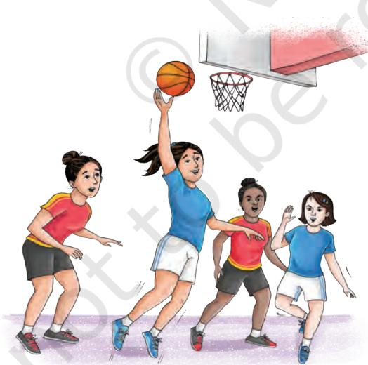

*Fig. 6.1: Children playing basketball*

Basketball is a fast, free-flowing, high-scoring team game. The players shoot a ball through a basket to score points while following a set of rules. Usually, two teams consist of

Chap-6.indd 77 8/24/2020 11:39:22 AM

five players on each team. They play on a marked rectangular court with a basket fixed on each end. Basketball is one of the world's most popular games.

The rules allow all players to move freely around the court and occupy any position. All players have an equal opportunity to score a Basket. To play basketball, students should learn and practice the basic skills of dribbling, passing, receiving and shooting.

#### **History**

The game of basketball originated at the Springfield College of Physical Education, Massachusetts, USA in 1891, invented by Dr. James Naismith. In 1894, Naismith fixed the first 13 rules which still form the basis of modern basketball. In India, the Young Men's Christian Association (YMCA) at Kolkata introduced basketball for the first time. Later the YMCA established at Madras in 1920 played an important role in the development of this game. Today basketball is one of the most favourite games in many schools and colleges. The game is played by both men and women of all ages and ability. In order to promote Basketball at National and International levels the Basketball Federation of India was set up in 1950. The first National Basketball tournament was held in Delhi in 1934 and thereafter it was organised every two years until 1951. After that it started being organised annually.

#### **Basketball court measurements**

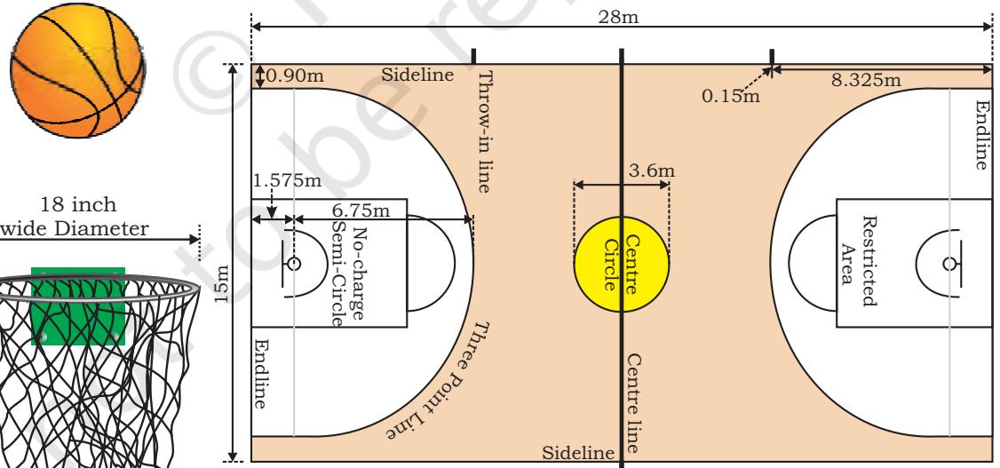

*Fig. 6.2: Basketball court, a basket and a basketball*

Basketball is played on a rectangular court, which should be an indoor wooden court or an outdoor concrete court having two side lines and two end lines. The dimensions of basketball court is 28 x15 meters. The court is divided

78

Chap-6.indd 78 8/24/2020 11:39:23 AM

into two sections, called half-courts, by the mid-court line, which is where the game starts with a jump ball. A jump ball is when a referee throws the ball up at center circle to determine which team gets possession. Two players from opposing teams jump up to tap the ball out of the circle in order to gain control over the ball take the game forward. The basketball posts are located at the opposite ends of the court.

# **Rules**

|  |  |  | Duration of a Match (Total 4 Quarters) |  |  |  |
| --- | --- | --- | --- | --- | --- | --- |
| Play | Rest | Play | Half time | Play | Rest | Play |
| 10 min | 2 min | 10 min | 15 min | 10 min | 2 min | 10 min |

- **•** The duration of the game of each quarter is ten minutes with 2 minutes rest between 1st and 2nd quarter and 3rd and 4th quarter, also 15 minutes rest between 2nd and 3rd quarter. Extra time period is of about 5 minutes. Teams exchange the side after half time. The clock is stopped while the play is not active. Therefore, it takes longer time to complete the game than the allotted time.
- **•** A team must consist of twelve (12) members. But only five players from each team may be on the court at one time. Substitutions are unlimited but can only be done when the play is stopped.
- **•** The team with the ball, attempting to score in their basket is 'on offense', the team that prevents opposite team from scoring is 'on defence'. The ball is moved in two ways: either dribbling or by passing to teammates. If the ball goes out of the court, the ball possession is given to the opposite team.
- **•** For both men's and women's teams, a standard uniform consists of a pair of shorts and a jersey with a clearly visible bib number, printed on both the front and back. Players should wear appropriate shoes that provide extra ankle support.
- **•** The game is controlled by the officials consisting of the three (3) referees, out of which one (1) is the overall incharge and the other four (4) table officials are responsible for keeping other records of each teams scoring, timekeeping, individual and team fouls, player substitutions, alternating possession arrow, and stop–and-go-clock, etc.
- **•** The essential equipment in basketball game is the ball, clocks, score sheets, scoreboard(s), alternating possession arrows and other required equipments.
- **•** An attempt to unfairly disadvantage an opponent through physical contact is illegal and called a foul.

79

Chap-6.indd 79 8/24/2020 11:39:23 AM

Health and P hysical Education - Class X

80

*Fig. 6.3: Dribbling*

Players who are fouled either get ball possession or are awarded one or two free throws and one point is awarded for successfully converting a free throw, which is attempted from a line 15 feet (4.6 m) from the basket. Each player is allowed 5 personal fouls before they are disqualified from the game. At this point they no longer remain a part of the game.

- **•** Two points are awarded when a basket is scored during the game but three points are awarded when a basket is scored from outside the 6.25 mtrs line.
# **Fundamental skills**

We are well aware that, to play any game one has to learn some skills. Similarly to play basketball game a player should learn the following fundamental skills.

# *Dribbling*

It is important to penetrate to score a basket, move the ball across the court, get away from the defenders, and find a good passing lane. There are different types of dribbling —

- **•** basic dribble
- **•** low dribbling
- **•** high dribble
- **•** behind the back
- **•** crossover dribble
- **•** change-of-pace
- **•** between the legs dribble

#### *Passing*

A good offensive attack requires accurate passing from players. It helps find an open man, to find a good shooter or to get away from a defender. There are several types of passes used in basketball, either one hand or both hand pass —

- **•** Overhead
- **•** Chest
- **•** Push
- **•** Baseball
- **•** Off-the-dribble
- **•** Bounce
- **•** Shoulder
- **•** Hook

Chap-6.indd 80 8/24/2020 11:39:24 AM

81 *Fig. 6.4: Passing*

# *Shooting*

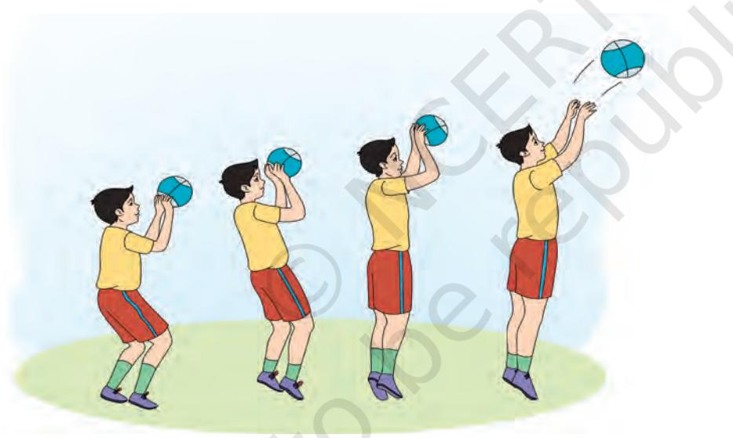

*Fig. 6.5: Shooting*

The objective of the game is to win by scoring maximum points. Therefore, improving the team's shooting is important to win a game. Shooting with either one hand or both hands is done in the following ways —

- **•** Jump shot
- **•** Dunk shot
- **•** Free throw
- **•** Layup
- **•** Three-point shot
- **•** Hook shot

Team Games and Sports I

Chap-6.indd 81 8/24/2020 11:39:25 AM

#### *Defence*

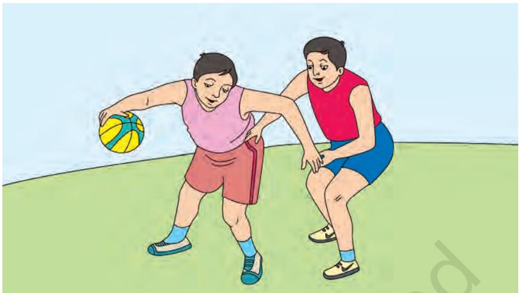

*Fig. 6.6: Defence*

The game of basketball allows a variety of defences to be deployed in an effort to disrupt and combat offensive plays. Here are examples of the three basic categories of team defences. In addition, each category comprises of an assortment of different variations.

- **•** *Man to man defence:* Man-to-man defences match up the defenders against specific offensive players. Defenders are usually assigned to be matched up with offensive players by size and ability.
- **•** *Zone Defence:* In Zone defence, defenders are assigned to guard specific areas on the court. Zones are named or designated by their player alignments.
- **•** *Combined Defence:* A third type of defence that can be deployed is the combination defence. With combination defences, some of the players are assigned to play man-to-man while the rest of the defenders play zone. Combination defences are usually deployed in an effort to stop or neutralise great individual offensive players.

#### *Rebounding*

Chap-6.indd 82 8/24/2020 11:39:26 AM

2024-25

The objective of rebounding is to successfully gain possession of the basketball after a missed field point or free throw, as it rebounds from the ring or backboard. This plays a major role in the game, as most possessions end when a team misses a shot. There are two categories of rebounds: offensive rebounds, in which the ball is recovered by the offensive side and does not change possession, and defensive rebounds, in which the defending team gains possession of the loose ball. The majority of rebounds are defensive, as the team on defence tends to be in better position to recover missed shots.

82

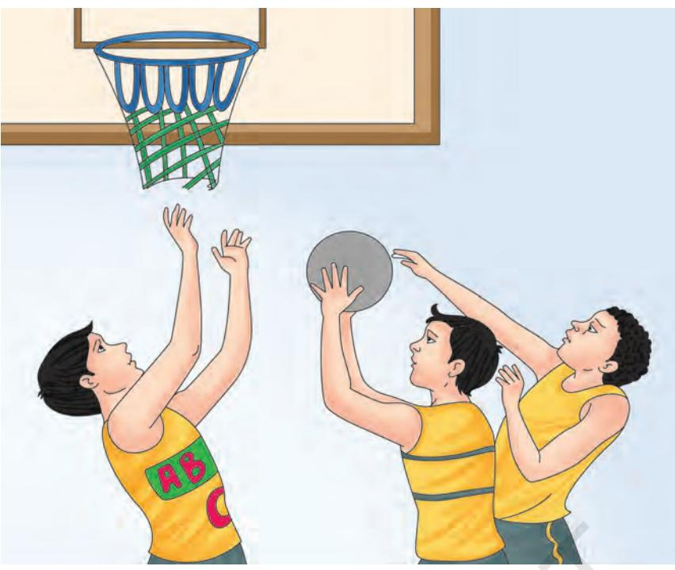

*Fig. 6.7: Rebounding*

#### **Arjun awardees**

| S.No. | Name of Player | Year |
| --- | --- | --- |
| 1. | Sarbjit Singh | 1961 |
| 2. | Man Mohan Singh | 1971 |
| 3. | Suman Sharma | 1983 |
| 4. | Parminder Singh | 2001 |
| 5. | Geethu Anna Jose | 2014 |
| 6. | Prashanti Singh | 2017 |

# **Cricket**

#### **Introduction**

Cricket is a bat and ball game played between two teams on a field, at the centre of which is a rectangular pitch. One team bats, trying to defend the wicket and scoring as many runs as possible. The other team bowls and fields, trying to dismiss the batsmen and thus limiting the runs scored by the batting team. A run is scored by the striking batsman hitting the ball with his bat, running to the opposite end of the pitch and touching the crease there without being dismissed. The teams switch between batting and fielding at the end of an inning.

83

Chap-6.indd 83 8/24/2020 11:39:26 AM

#### **History**

The game of cricket, as it is played today, has its origin in the south eastern part of England. Cricket became a generally adopted sport in the second half of the seventeenth century. The Hambeldon club which was founded in about 1750's had played a significant part in the evolution of the game. It was superseded by the Marylebone Cricket Club (M.C.C) with its headquarters at Lords, London. Cricket became an international game with the formation of the Imperial Cricket Conference (I.C.C) in 1909. The name of Imperial Cricket Conference was changed to International Cricket Conference (later, Council) to enable countries outside the common wealth to become its members. The first Limited Over International cricket match was played in 1971 at Melbourne. The governing International Cricket Council (ICC) saw its potential and staged the first limited over Cricket World Cup in 1975. The first edition of limited over Cricket world cup won by West Indies.

In the 21st century, a new limited over form, Twenty 20, has made an immediate impact. The first T-20 international match took place on August 5 2004, between the women's teams of England and New Zealand. The first T-20 international match between men's teams was played on February 17 2005, between Australia and New Zealand. The first T-20 World Cup was played in South Africa in 2007. India won the first edition of T-20 World Cup.

An all India team went on a tour of England in 1911 under Maharaja Bhupinder Singh of Patiala. The Indian Cricket Control Board came into being towards the end of 1928. The national championship for the Ranji Trophy began in 1935. India entered the international arena and played its first official Test against England in 1932. Meanwhile Prince Ranjit Singhji of Nawanagar who had gone to England for further studies, made a remarkable name for himself in the game of cricket.

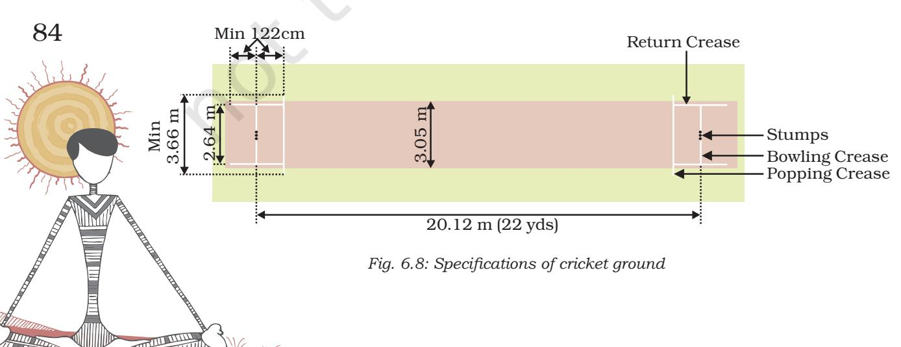

#### **Measurement**

Chap-6.indd 84 8/24/2020 11:39:26 AM

#### *Ways to score runs*

The aim of the batsmen is to score runs. One of the main cricket rules for batsmen to score runs is that they must run to the pitch at each other's end (from one end to the other), hence score one run. Cricket rules state that, they may run multiple runs per shot. As well as while running they can also score runs by hitting boundaries. A batsman hits a boundary and scores 4 or 6 runs. A four and six both are scored by hitting the ball. If it crosses the boundary after touching the ground it is considered as four and if the ball crosses boundary before touching the ground it is considered as six. Cricket rules also state that once a 4 or 6 has been scored any runs physically scored by the batsman by running between the wickets are null and void.

Other ways runs can be scored according to the cricket rules include no balls, wide balls, byes and leg byes. Cricket rules state that all runs scored by these methods are awarded to the batting team but not the individual batters.

- **•** A **No Ball** can be declared for many reasons: If the heel of the bowler's front foot lands on or in front of the popping crease or if the bowler's back foot touches then outside the return crease the ball is declared no ball. If the bowler bowls the ball from the wrong place, the ball is declared dangerous (often happens when bowled at the batsmen's body on the full), bounces more than twice or rolls before reaching the batsman or if fielders are standing in illegal positions. The batsman can hit a No ball and score runs off it but cannot be out from a No ball except if they are run out, hit the ball twice, handle the ball or obstruct the field. The batsman gains any runs scored off the no ball for his shot while the team also gains one run for the no ball itself.
- **•** A **Wide Ball** will be declared if the umpire thinks the batsman did not have a reasonable opportunity to score off the delivery. However if the delivery is bowled over the batsmen's head it will not be declared a wide but a no ball. Umpires are much stricter on wide deliveries in the shorter format of the game while being much more relaxed in test cricket. A wide delivery will add one run to the batting team and any runs scored by the batsman. The batsman is not supposed to be declared 'out' off a wide delivery except if they are stumped, run out, handle the ball, hit their wicket or obstruct the field.
- **•** A **Bye** is where a ball that isn't a no ball or wide passes the striking batsman and runs are scored without the batsman hitting the ball.

Team Games and Sports I

85

Chap-6.indd 85 8/24/2020 11:39:26 AM

- **•** A **Leg Bye** is where runs are scored by hitting the batsman, but not the bat and the ball is not a no ball or wide. However no runs can be scored if the striking batsman didn't attempt to play a shot or if he was avoiding the ball.
#### **Types of** *'out' in cricket*

Ways batsmen can be given 'Out' according to cricket rules: There are a number of different ways a batsman can be given out in the game of cricket. When a bowler gets a batsman out it is said that the bowler gets a 'wicket'. Following are the different ways, a batsman can be given out according to the rules of cricket:

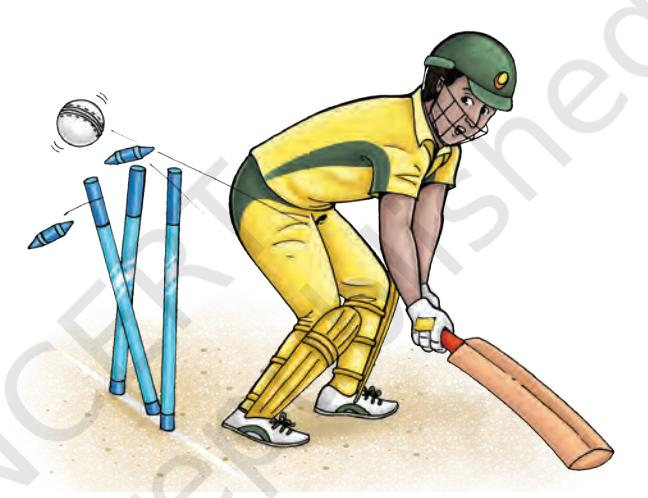

*Fig. 6.9: Bowled*

- **• Bowled** Cricket rules state that if the ball is bowled and hits the striking batsman's wickets the batsman is given out (as long as at least one bail is removed by the ball). It does not matter whether the ball has touched the batsman's bat, gloves, body or any other part of the batsman. However, the ball is not allowed to have touched another player or umpire before hitting the wickets.
- **• Caught** Cricket rules state that if a batsman while playing the ball, either it touches his bat, hand or glove holding the bat then the batsman can be caught out. This is done by the fielders, wicket keeper or bowler catching the ball on the full (before it bounces). If this is done then cricket rules state the batsman is out.
- **• Leg before Wicket (LBW)** If the ball is bowled and hits the .batsman first without touching the bat, then an LBW decision is possible. However for the umpire to give this out he must first look at some of the factors stated in the cricket rules. The first thing the umpire

86

Chap-6.indd 86 8/24/2020 11:39:28 AM

need to decide is that if is not a no ball, would the ball have hit the wickets if the batsman was not there. If his, answer to this is yes and the ball was not pitched on the leg side of the wicket he can safely give the batsman out. However, if the ball hits the batsman outside the line of off stump while he was attempting to play a stroke then he is not out.

- **• Stumped** A batsman can be given out according to cricket rules when the wicketkeeper puts down his wicket while, he is out of his crease and not attempting a run (if he is attempting a run it would be a run out).
- **• Retired Out** A batsman leaves the field without the permission of umpire for any resource like, illness, injury etc. Than is given as retired out.
- **• Run Out** Cricket rules state that a batsman is out if no part of his bat or body is grounded behind the popping crease while the ball is in play and the wicket is fairly put down by the fielding side.
- **• Hit Wicket** Cricket rules specify that if a batsman hits his wicket down with his bat or body after the bowler has entered his delivery stride and the ball is in play then he is out.
- **• Handled the Ball** Cricket rules allow the batsman to be given out if he willingly handles the ball with the hand that is not touching the bat without the consent of the opposition or umpire.
- **• Timed Out** An incoming batsman must be ready to face a ball or be at the non strikers end with his partner within three minutes of the outgoing batsman being dismissed. If this is not done the incoming batsman can be given timed out.
- **• Hit the Ball Twice** Cricket rules state that if a batsman hits a ball twice other than for the purpose of protecting his wicket or with consent from the opposition, he is out.
- **• Obstructing the Field** A batsman is out if he intentionally obstructs the opposition by word or action There are many other cricket rules. However these are most of the basics and will get you well on your way to playing the game. Many of the more advanced rules and laws can be learned along the way and are not vital to general play.

If any batsman leaves the field of play without the Umpire's consent for any reason other than injury or incapacity, he may resume the innings only with the consent of the opposing captain. If he fails to resume his innings, he is out. For the purposes of calculating a batting average, retired out is considered a dismissal.

87

Chap-6.indd 87 8/24/2020 11:39:28 AM

# **Rules**

- **•** Cricket is a game played between two teams consisting of eleven players each. There is also a reserve player called a twelfth man, who can only be utilized as fielder.
- **•** The twelfth man is not allowed to ball, bat, and wicket keeping or captain the team. His sole duty is to act as a substitute fielder.
- **•** Two umpires are placed on the playing field while there is also a third umpire off the field who is in charge of video decisions.
- **•** When the call is too close for the on field umpires then they refer it to the third umpire who reviews slow motion video replays to make a decision.

# **Fundamental skills**

#### *Batting skills*

Being a batsman he must have good wrist power, eye coordination, Endurance, speed, Excellent reaction ability and Statistics for cricket.

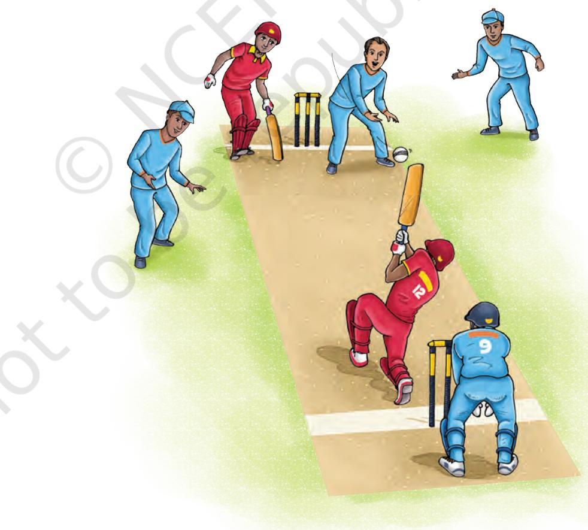

*Fig. 6.10: Batting skill*

88

Chap-6.indd 88 8/24/2020 11:39:30 AM

# **Batting techniques**

- **•**  Defence **•**  Drive
- 
- **•**  Pull **•**  Cut
- 
- **•**  Hook **•**  Sweep
- 
- *Front foot defence*
	- **•** The front foot defence is played when the ball is bowled at a good length, which is not over-pitched enough for a drive and not short enough to go on the back foot.
	- **•** The front foot should move as close as possible to the pitch of the ball with the left shoulder and left elbow leading the body in the direction of the ball.
	- **•** The weight of the body is on the front foot with the knee bent and the head should be over the bat watching the point of contact. The bat is kept angled and very close to the front pad to prevent the ball going through bat and pad.
	- **•** The top hand is firm at the top of the handle while the bottom hand is relaxed, with the thumb and index finger loosely holding the bat. The back leg should be fully extended with the heel raised off the ground but remaining parallel to the crease.
	- **•** The weight of the back foot should be on the inside of the right toe and care should be taken not to turn it or drag it out of the crease.
	- **•** The front foot defensive stroke can be played with the bat slightly behind or in front of the pad depending on the nature of the wicket and the proficiency of the bowler.

#### *Off drive*

- **•** Off drive is played to an over-pitched ball in line with the off stump or marginally outside.
- **•** Like the forward defence, the left shoulder and elbow lead the body with the front foot going as close as possible to the pitch of the ball. The bat comes down in and arc from the top of the back lift and strikes the ball just in front of the left foot.
- **•** After impact, the bat must continue in the arc and finish over the left shoulder. The follow through can also be checked at shoulder height, keeping the bat face open.
- **•** The head is kept straight and still throughout the shot and the top hand and elbow controls the direction of the shot. At the time of impact the head should be over the ball with the body weight balanced on the front foot. The full face of the bat must hit the ball and on completion, the batsman must be well balanced.

89

Chap-6.indd 89 8/24/2020 11:39:30 AM

# *Straight drive*

- **•** This shot is played exactly in the same way as an off drive but with the difference is that it is played to a over pitched ball in and around the line of middle stump and the front foot must point down the wicket and the body must be turned slightly and the shoulders opened out to allow the free swing of the bat.
#### *On drive*

- **•** On drive is played to a over-pitched ball on and around the leg stump.
- **•** This has been considered to be a difficult shot to play. The basic principles of a drive apply here too, though the swing of the bat is an arc from slips to mid- on with the front pointing down the wicket.
- **•** The front foot should be placed outside the line of ball with the shoulders turned and the impact is just in front of the left toe. The follow through is generally checked below shoulder height.

## *Back foot defence*

- **•** The back foot defensive stroke is played to a shortpitched ball in line with the stumps, which is not short enough to play and attacking shot.
- **•** The back foot is moved back and across to the line of the ball with the front naturally following it. The bat is brought down close to the body with the head steady and over the ball.
- **•** The back foot must remain parallel to the crease as far as possible to maintain the sideways position of the body with the top hand firm and in control, and the bottom hand holding the bat loosely.
- **•** To keep the bat straight, the left elbow is held high next to the head. Care should be taken to maintain the balance at the time of playing the ball and to remain 'side-on' as this presents a smaller target for short rising deliveries.
- **•** The back foot defence can also be played with the body beside the line of the ball, but here the batsman must resist the temptation to follow the movement of the ball away from him.

# *Bowling skills*

Bowling is as important as batting. The ball is defended by a batsman to save his wicket. When the ball is bowled to a batsman it is called as a ball or delivery.

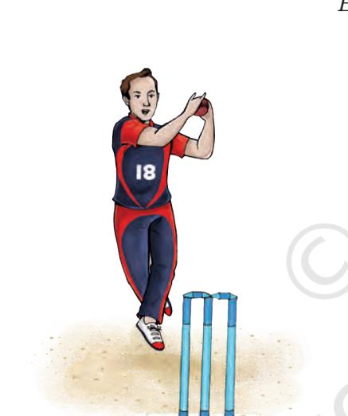

*Fig. 6.11: Bowling Skills*

Health

90

and P

hysical

Education -

Class X

Chap-6.indd 90 8/24/2020 11:39:31 AM

2024-25

# **Types of bowling**

| Fast bowling | Spin bowling |
| --- | --- |
| Seam bowling | Off spin |
| Swing bowling | Leg spin |
| Bouncer | Chinaman |
| In swinger | Doosra |
| Leg cutter | Googly |
| Off cutter | Arm ball |

*Swing bowling*

- **•** When a ball of a fast or medium fast bowler deviator in air either on leg side (in swing) or on off side (out swing) it is turned in air as swing bowling.
#### *Outswing*

- **•** For out swing bowling, the ball is held with the index and middle finger and thumb below the seam, which is upright & angled towards the slips with the shiny surface on the right (for right hand bowler).
- **•** For effective out swing bowling, the bowler should bowl as close as possible to the stumps.
- **•** The wrist is cocked and when the ball is released the seam must be vertical and goes down the pitch upright. The two fingers should stay behind the seam as long as possible.

#### *Inswing*

- **•** Here, the ball is held by the two fingers and the thumb underneath it, with the seam upright and angle towards fine leg.
- **•** The shiny side is on the left side and the fingers may also have a slight gap between them.

#### *Wicket keeping*

The wicket keeper plays an important role in cricket. A good wicket keeper can save a number of runs for his team. His function is to stop deliveries, which the batsman is unable to play or passed by batsman.

# *Fielding*

In 21st century, fielding is a key point to win the match. A player requires more hard work, practice and flexibility to become a good fielder.

*Fig. 6.12: Wicket keeping*

91

Chap-6.indd 91 8/24/2020 11:39:32 AM

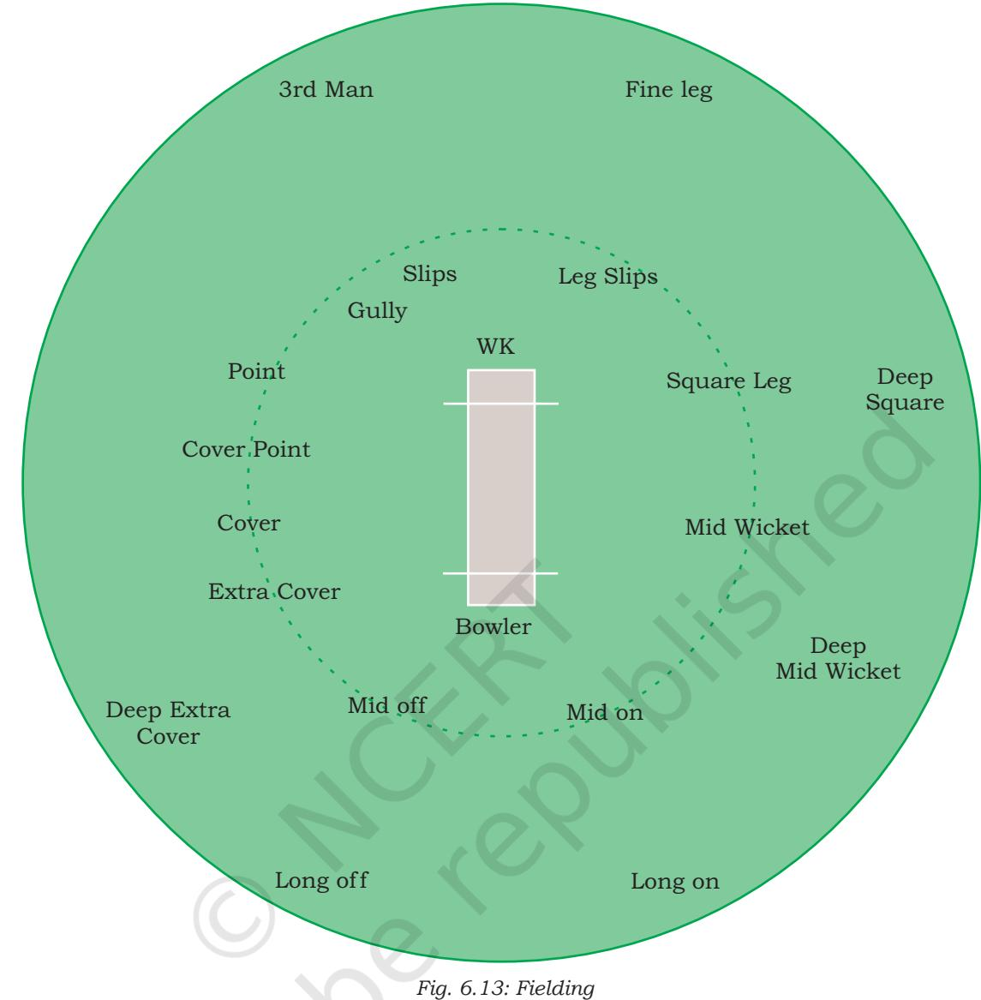

# **Arjuna awardee**

| S.No. | Name of Player | Year |
| --- | --- | --- |
| 1 | Sachin Tendulkar | 1994 |
| 2 | Sourav Ganguly | 1997 |
| 3 | Rahul Dravid | 1998 |
| 4 | Mithali Raj | 2003 |
| 5 | Anju Jain | 2005 |
| 6 | Anjum Chopra | 2006 |
| 7 | Jhulan Goswami | 2010 |

92

Chap-6.indd 92 8/24/2020 11:39:32 AM

| 8 | Virat Kohli | 2013 |
| --- | --- | --- |
| 9 | Harmanpreet Kaur | 2017 |
| 10 | Smriti Mandhana | 2018 |

**Bharat Ratna**

| S.No. | Name of Player | Year |
| --- | --- | --- |
| 1. | Sachin Tendulkar | 2013 |

# **Football**

Football has been a very popular game all over the world since ages. Also commonly known as soccer, it is a game that involves kicking a ball with the foot to score a point. It is played between two teams with a spherical ball on a rectangular field of grass or green artificial turf. There is a goal post at each end of the rectangular field and errected at the middle of base line. Points are scored by moving the ball to an opposing team's end of the field and putting it between two goal posts. Players are required to move the ball by kicking, dribbling, carrying, and passing. The team that scores more points than the other by the end of the match wins the game.

# **History**

According to FIFA (Federation International de Football Association), the "very earliest form of the game was played in china during the second and third centuries. The game was later developed in England and the rules of football were formulated in India, football began its journey when the British rulers brought it with them and in no time it became popular in the masses. The first recorded game here took place between the 'Calcutta Club of Civilians' and the 'Gentlemen of Barrackpore' in 1854. The first ever football club in India, the 'Calcutta Football Club' was founded in 1872. The first football association, "the Indian Football Association" (IFA) was established in Calcutta in 1893, though there was no Indian on its board till 1930s. It was later, replaced by All India Football Federation (AIFF). The Durand Cup Tournament is the oldest in India and the one of the oldest in the world, was started in Shimla in 1888. The decade of 1951 to 1962 is known as the golden era in the history of Indian football, as the country put up commendable performances in a number of international competitions. India won gold medals in 1951 and 1962 Asian Games, held at New Delhi and Jakarta.

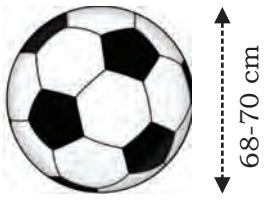

Circumference of football

*Fig. 6.14: Specifications of football*

93

Chap-6.indd 93 8/24/2020 11:39:32 AM

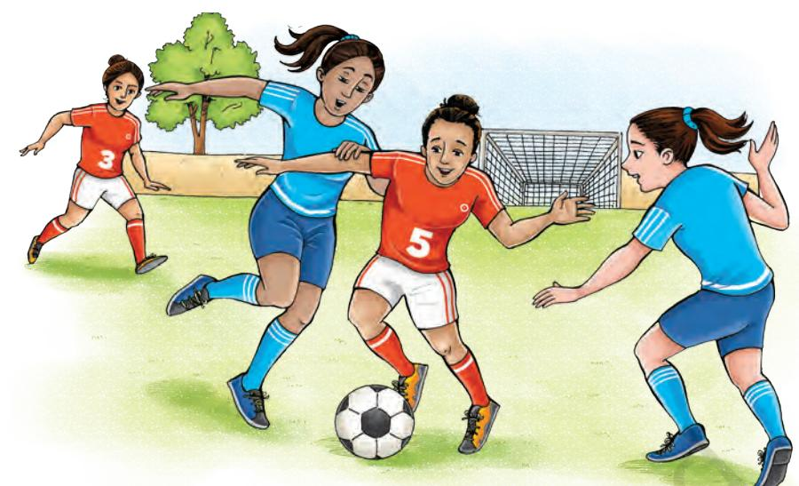

*Fig. 6.15: Children playing football*

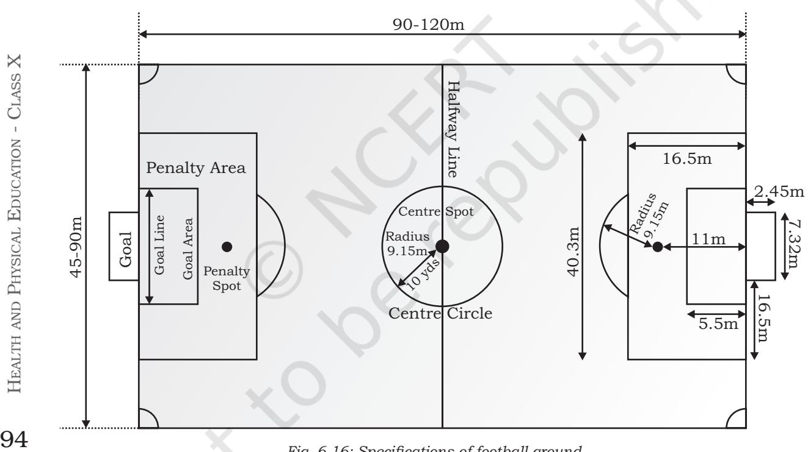

*Fig. 6.16: Specifications of football ground*

# **Field measurements**

As per international standard, the length of the rectangular football field (pitch) is in the range of 100 to 110 m (110 to 120 yards) and the width is in the range of 65 to 75 m (70 to 80 yards). There are also goal posts at the back of each football zone. One way to score is to kick the football through the goal posts. The ball must go between the uprights and over the crossbar.

Chap-6.indd 94 8/24/2020 11:39:34 AM

#### *Goal post*

Distance between the posts is 7.32 meter whereas the height of the goal post is 2.44 meter.

#### **Rules**

According to the official rules of football guide, the players need to execute the game in a fair and accepted manner. The football match is played in two halves of 45 minutes each. There are several rules in the game of football regarding the field, players, penalties, offence and defence.

#### *Start and restart of play*

A coin toss takes place before the game starts, the winner of the toss will get the choice of choosing the end to attack. At the kick-off, all players from each side must be in their own halves of the field. The kick-off takes place on the centre spot in the centre circle. The player who kicks off cannot touch it again until another player has made contact.

#### *Punishment for offences*

If the player persistently offends during a match, the referee can choose to take action. First the Yellow Card as a caution is shown to a player. Any offence after the second one leads to Red card. If they showed a red card to a player it means that player is expelled from the match. A straight red card (no previous caution) can be shown for extreme offences, such as, serious foul play, violent conduct, spitting, deliberately handling the ball to prevent a goal, a professional foul (denying a goal scoring opportunity) and insulting language and/or gestures.

#### *Free kicks*

Whenever a free kick is taken, the players on the opposite side must be at least 10 yards away from the ball until it is kicked. If this rule is not adhered to, the kick is retaken. There are two types of free kicks awarded, depending on the nature of the offence: (i) Direct Free Kick — allows the team to take a direct shot at the opponent`s goal. (ii) Indirect Free Kick — a direct strike on goal is not permitted. It means a second player has to touch the ball after the kick is taken to score a goal.

#### *Penalty kick*

A penalty kick is awarded for offences taking place in the penalty and goal areas. A nominated member of the team is allowed to strike at goal from the penalty spot, with only the goalkeeper to beat. The goalkeeper must remain on his line until the ball has been kicked, and all other players must be outside the penalty area behind the penalty spot. After the

95

Chap-6.indd 95 8/24/2020 11:39:34 AM

player has taken the kick, that player cannot strike the ball again without another player touching the ball.

#### *Throw-in*

A throw-in is awarded when the whole ball crosses the touch line (conceded by the team who last touched the ball). It is delivered on the field of play with both hands and from behind and over the player's head. Otherwise it is deemed to be a foul throw and a throw-in is given to the opposition. It cannot go directly to the goalkeeper's hands (if on the same team). A goal cannot be scored directly from a throw-in.

#### *Corner kick*

A corner kick is awarded once the whole ball crosses the goal line of the opposition, after touching one of their players. A kick is taken from the corner of whichever side the ball travelled over the field. Opponents must be 10 yards from the corner arc and the kicker cannot touch the ball a second time without having touched by any other player.

#### **Fundamental skills**

#### *Receiving*

Receiving a ball on the ground is different than receiving a ball in air. Keep your eye on the ball, select the foot to receive the ball, don't stop the ball, prepare it for new action or move, shot, dribble, pass.

#### *Passing*

Passing involves giving the ball to partners. Perfect decision making is required before a perfect pass. Before pass, see the target, approach the ball, and look at the ball holding the head steady. Strike the correct area of the ball with lacked ankle, make sure of follow through and transfer of weight forward.

#### *Shooting*

Shooting uses the same elements as used in passing, the difference is that the ball is to be passed to the goal keeper to convert the score for the team. Player should look up to see the position of goal keeper, choosing the area to shoot the ball while make a proper contact with the ball with proper follow through.

#### *Trapping*

It is a method of gaining control of the ball. Trapping uses the feet, thigh, or chest to bring the ball to the ground.

96

Chap-6.indd 96 8/24/2020 11:39:34 AM

# **Techniques and lead-up activities**

The students already learnt the fundamental techniques of playing football in the previous classes. Now let us discuss a few lead-up activities to develop these techniques.

#### *Ball control*

Five versus two in 30m x 20m area. Players make two touches only to retain possession of the ball.

#### *Dribbling*

Four quarters of the area are numbered. One player dribbles in one quarter and passes the ball to quarter number 2 and so on. Reaching last quarter, the player without losing the ball gets points. If ball is lost in any quarter, the other teams start anti clockwise and then enter in to the next three quarters.

#### *Passing*

Number of players—four. Rectangle measures 5m × 20m or 10m × 30 m, one ball.

#### *Heading*

Two versus two, Goal of 8 yards, Centre line 5 yards from each goal.

#### *Shooting*

Shooting board is a place along the penalty spot, arranged inside the penalty area.

#### *Tackling*

One versus one, 10m × 10m area, time 2 minutes.

#### *Throw-ins*

Throw-in is a competition between two players.

#### *Goal keeper*

A goal keeper also acts as a defence but is allowed to catch or touch the ball with hands within the penalty box (D-area). A goal keeper is usually the last man standing at the goal to prevent opponents from scoring the goal.

#### **Arjuna awardees**

| S.No. |  | Name of Player | Year |
| --- | --- | --- | --- |
| 1 | P.K. Banerjee |  | 1961 |
| 2 | C.P. Singh |  | 1971 |

97

Chap-6.indd 97 8/24/2020 11:39:34 AM

| 3 | Sudhir Karmakar | 1981 |
| --- | --- | --- |
| 4 | Baichung Bhutia | 1998 |
| 5 | Oinam Bembem Devi | 2017 |

# **Hockey**

#### **Introduction**

Field Hockey is a team game, in which a team of players attempt to score goals by hitting/Scooping, pushing or flicking a ball into an opposing team's goal using curved sticks. However, the name Field Hockey is used in countries in which the word Hockey is generally reserved for another form of hockey, such as ice hockey or street hockey. The players should learn and practice the basic skills of dribbling, passing, tapping and hitting. They should learn how to attack and score goals and how to work with others to defend and stop goals from being scored. To do this they need to learn how to keep possession by dribbling effectively and moving the ball accurately and quickly between players. As they progress, skills should become more consistent and efficient, and the players should be introduced to set play situations.

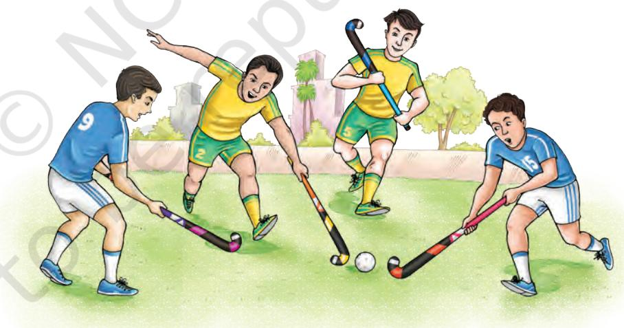

*Fig. 6.17: Players playing hockey*

#### **History**

The history of the game of hockey has its roots well laid in the world's early civilisations. One of the oldest known sports, the hockey game is believed to be in existence about 1200 years before the Ancient Games of Olympia. Right from Arabs, Greeks, Romans, and Persians to Ethiopians, every country played with a variation of the game. While some played it just

98

Chap-6.indd 98 8/24/2020 11:39:36 AM

for recreation, the others had the opinion that hockey would make them better warriors. Even though many ancient civilisations played hockey in different variations, the modern game of field hockey was developed in the British Isles in the 19th century. It was introduced in India by the British Army regiments and the game soon became popular. It was during this time that the London Hockey Association was formed and the rules for playing hockey were standardised. In 1924, the International Hockey Federation (FIH) was founded and three years later, the International Federation of Women's Hockey followed.

In India, the first hockey club came up in Calcutta in 1885-86 and soon Bombay and Punjab followed. Making its Olympic debut at the 1928 Amsterdam Games, Indian hockey team won its first Olympic gold, without conceding a single goal. The hallmark of this ruthless domination was the wizardry of Indian hockey legend, Dhyan Chand, who mesmerised the Amsterdam crowd with his dazzling skills. From 1928 to 1956, India won six consecutive Olympic gold medals, while winning 24 consecutive matches. It was the golden era of Indian hockey, when India produced some of the finest players the game has ever seen.

## **Field measurements**

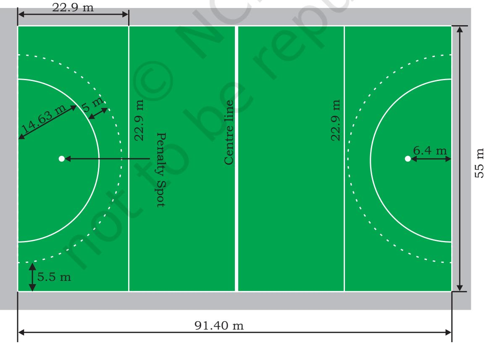

*Fig. 6.18: Specification of hockey field*

Team Games and Sports I99

Chap-6.indd 99 8/24/2020 11:39:36 AM

Hockey is played on a 91.40 m × 55 m rectangular field. At each end there is a goal 2.14 m high 1.20 m deep and 3.66 m wide measured from the inner sides of the posts and crossbar, and the goal post is surrounded by an approximately semi-circular area 14.63 m from the goal bounded by a solid line. A spot 0.15m in diameter, called the penalty spot, is marked with its centre 6.40 m from the centre of each goal.

### **Equipment**

Each player carries a stick, normally a little over 3 feet (90 centimeters) long, 2 inches wide and traditionally made of wood but now often made with fiberglass, Kevlar and carbon fiber composites, with a rounded handle flattening out on one side and with a hook at the bottom.

# **Rules**

The rules set by the International Hockey Federation FIH are used worldwide.

#### *General play*

Prior to the start of the game, a coin is tossed and the winning captain can choose a starting end or start with the ball. The game time is divided into four quarters of 15 minutes each 15-02-15-10-15-2-15. At the start of each quarter as well as after goals are scored, play is started with a pass from the centre of the field.

Field players may only play the ball with the flat side of the stick. Tackling is permitted as long as the tackler does not make contact with the attacker or his stick before playing the ball (contact after the tackle may also be penalised if the tackle was made from a position where contact was inevitable). Further, the player with the ball may not deliberately use his body or stick to shield the ball from a legitimate tackle.

When the ball passes over the sidelines, it is returned to play from sideline either by individual player by himself or with a push or hit, taken by a member of the team whose players were not the last to touch the ball before crossing the sideline. If it crosses the goal line after last touched by an attacker, a 15 mt hit or pass can be made by any player of the defending team. A 15 mt hit is also awarded for offenses committed by the attacking side within 15 mt of the end, of the pitch they are attacking.

#### *Free hits*

Free hits are awarded when offences are committed outside the scoring circles. The ball may be hit or pushed once in any direction by the team offended against. Opponents

100

Chap-6.indd 100 8/24/2020 11:39:36 AM

must move 5 mt away from the ball when a free hit is awarded, and for attacking free hits within 5 mt of the circle, all attackers other than the one taking the hit must also be 5 mt away.

#### *Corner*

A corner is awarded if the ball goes over the backline after last being touched by a defender. Corners are played by the attacking team and involve a free hit from the 22.90 meter line.

#### *Penalty corner*

The penalty corner is set play that is awarded against a defending team when any offence is committed in the defensive circle, and may be awarded when a deliberate offence is committed in the defending 23 m area, or when the defending team deliberately plays the ball over the back line.

#### *Penalty stroke*

A penalty stroke is awarded when defenders commit a deliberate foul in the circle which deprives an attacker of possession or the opportunity to play the ball. This penalty is being taken by a single attacker against the goalkeeper, and is taken from a spot 6.4 m from the penalty spot and directly in front of the goal. The goalkeeper must stand with heels on the goal line, and cannot move his feet until the ball is played.

On the umpire's whistle, the striker may push or flick the ball at the goal, which the goalkeeper attempts to save. The player taking the penalty shot may not touch the ball twice. Hitting or dragging or tapping the ball is also forbidden. If the shot is saved, play is restarted with 15 mt hit to the defenders; if a goal is scored, play is restarted from the centre line. Time is stopped for the Penalty stroke.

#### *Dangerous play*

If the ball is raised off the ground in a manner that is, in the umpire's opinion, dangerous, the ball is turned over to the other team and they receive a free hit from the point of contact.

#### *Tie breaker (shootout)*

In case of a draw match, penalty shootout is conducted. The winners will be decided by 5 penalty shootouts by each team and the team which scores highest number of goals is declared the winner. The shootout will start at 22.90 mt. line in front of the shooter and should be completed within 8 seconds after the umpire's whistle. The goalkeeper will start defence from goal line.

Chap-6.indd 101 8/24/2020 11:39:36 AM

#### **Arjuna awardees**

| S.No. | Name of Player | Year |
| --- | --- | --- |
| 1 | Prithipal Singh | 1961 |
| 2 | Sunita Puri | 1966 |
| 3 | P. Krishnamurthy | 1971 |
| 4 | Versha Soni | 1981 |
| 5 | Dhanraj Pillai | 1995 |
| 6 | Baljeet Singh Saini | 2000 |
| 7 | Mamta Kharab | 2002 |
| 8 | Ritu Saini and Rani Rampal | 2016 |
| 9 | S.V. Sunil | 2017 |
| 10 | Savita Punia | 2018 |
| 11 | Manpreet Singh | 2018 |

# **Volleyball**

Volleyball is a net game that involves two teams of 12 players (six playing and six substitutes). Each team works together to hit an inflated ball over a high net. Each team tries to score points by grounding the ball on the other team's court. Volleyball is a rebound game where one cannot hold or catch the ball; every contact must be a rebound action. It is essential for the player to be in the right place at the right time if the game is to be played in a controlled manner. Therefore, good anticipation and movement skills should be taught to players. At competency level, students should learn and practice the basic skills of sending and receiving the ball over a high net. They should play simple 3 touch volleyball games working as a team to keep the ball in play and ground it on the opponent's side of the court.

#### **History**

Originally named Mintonette, it was created as a gentle indoor sport for older players to be able to exert a bit of athletic effort by keeping the ball in the air. The idea of using a net was borrowed from tennis. It was raised to a height above the average man's height. During a demonstration game, someone remarked that the players seemed to be volleying the ball back and forth over the net, and perhaps "volleyball" would be a more descriptive name for the sport. The game of Volleyball was invented by William G. Morgan in the year 1895 in Holyoke, Massachusetts by YMCA (USA). It was invented as a recreational game. This game was brought to India more than 85 years ago when some physical education

102

Chap-6.indd 102 8/24/2020 11:39:36 AM

teachers had been abroad and were trained in different games including Volleyball. YMCA College of Physical Education, Madras, took this game seriously and students trained there have taken the game to other parts of the country.

*Fig. 6.19: Players playing volleyball*

# **Measurements**

*Fig. 6.20: Specifications of volleyball court*

2024-25

Chap-6.indd 103 8/24/2020 11:39:38 AM

#### *NETR Posts*

The net is 2.43 mt high for men and 2.24 mt high for women. It is doubled vertically over the center line. It is 1 m wide and 9.5-10 m long end is 10 cm more bleak mesh. The antenna is a flexible rod 1.8 m long and 10 mm. in diameter centered fixed an side line near pole. The top on antenna extends 80 cm above the net. The 2.55 m high posts are placed 0.5 m – 1.0 m out side the side line.

#### **Rules**

Volleyball is a fast game played by two teams of 6 players each. It can be played indoors or outdoors. A player on one of the teams begins a 'rally' by serving the ball from behind the back line of the court, over the net, and into the receiving team's court. The receiving team must not let the ball be grounded within their court. The rally continues, with each team allowed up to three consecutive touches, until either a team grounds the ball on the opponent's court and wins the rally or a team commits a fault and loses the rally. The team that wins the rally is awarded a point, and serves the ball to start the next rally. The ball is usually played with the hands or arms, but players can legally strike or push the ball with any part of the body.

Common faults include —

- **•** catching and throwing the ball;
- **•** two consecutive contacts with the ball made by the same player;
- **•** four consecutive contacts with the ball made by the same team;
- **•** touching the net during play;
- **•** crossing the centre line; and
- **•** violation of rotation.

#### **Fundamental skills and lead-up activities**

#### *Smash*

- **•** Run and approach as per the height, distance and speed of the ball.
- **•** Swing the arm back behind the body. Bend slightly and jump off both feet. Swing the arm back behind the body.
- **•** Hit the ball between the head and the hitting shoulder, in front of the body and with an outstretched arm.
- **•** Land in a balanced position on both feet and shift weight from toe to heel. Flex knees to avoid injury.

104

Chap-6.indd 104 8/24/2020 11:39:38 AM

- **•** Setting up the ball, sending and receiving practices requiring students to:
	- Overhead pass, underhand pass the ball.
	- Keep the ball in the air. Play in a circle or small group: how long can you keep the ball in the air?
- **•** Striking the ball against the wall
- **•** A player strikes the ball on the surface keeping in view the force and direction in a manner that the ball hit the wall and deflects within the reach of Player B and the rally goes on.

Fig. 6.21: The smash

# *Block*

- **•** Block is the first line of defence against the smash. It may be performed by one, two or three front-row players who jump at the net.
- **•** Stand in a balanced position about half a meter from the net, feet shoulder width apart.
- **•** Watch the opposition developing their attack and move quickly to where it is anticipated.
- **•** Use side steps or cross steps to move along the net.
- **•** Coordinate with the timings of the jump of attacker and raise hands above the net to block the smash.
- **•** Move to receive passes: from a ready position, players should move right or left to receive a pass and return it.
- **•** Play simple games that combine serving, overhead pass and underhand passes.
- **•** Mark a chalk line on the wall. Practice the blocking action. Jump using vigorous knee extension and controlled arm movement. Both hands must touch simultaneously above the mark. Practice blocking at the net with one, two or three players.

Team Games and Sports I

105

Chap-6.indd 105 8/24/2020 11:39:44 AM

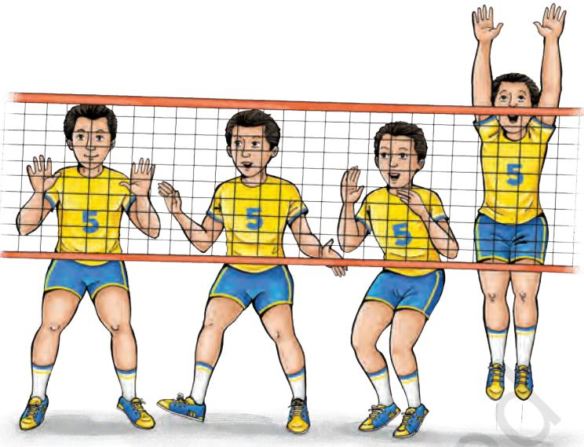

*Fig. 6.22: The block*

# **Arjuna awardees**

| S.No. | Name of Player | Year |
| --- | --- | --- |
| 1 | Nripjit Singh | 1962 |
| 2 | G.M. Reddy | 1973 |
| 3 | K.Udaya Kumar | 1991 |
| 4 | Amir Singh | 2001 |
| 5 | Tom Joseph | 2014 |

Health and P hysical Education - Class X

Chap-6.indd 106 8/24/2020 11:39:45 AM

# **Assessment**

# **Basketball**

#### **I. Answer the following Questions**

- 1. List any five important rules of the basketball game.
- 2. List any five penalties of basketball game.
- 3. How does playing basketball help us in the improvement of our health?
- 4. Which is the motor skill you enjoyed the most and why?
- 5. Explain any one fundamental skill of basketball game.
- 6. How can you improve your performance in the game of basketball?

#### **II. Fill in the Blanks**

- 1. Measurement of a basketball court is _____________ .
- 2. Height of the lower edge of the board from floor is _____________ .
- 3. Diameter of the ring is _____________ .
- 4. Duration of one quarter is _____________ .
- 5. Duration of team time out is _____________ .

# **III. State whether True or False**

- 1. Five players are required to start a game.
- 2. Basketball game was invented in 1981.
- 3. Player is to be substituted within 20 seconds.
- 4. Player can leave the court at any time.
- 5. After five fouls player has to leave the court.

#### **IV. Assess your Performance by the following Activities**

- 1. Dribbling Test: Zig Zag dribbling for 30 seconds
- 2. Passing Test: Passing on the wall for 30 seconds from 5 mt. distance
- 3. Shooting Test: Shooting for 30 seconds from under the basket position

# **Cricket**

#### **I. Answer the following Questions**

- 1. List the basic rules of the game of cricket.
- 2. What has been the impact of Twenty20 form of cricket on Test Matches?

Chap-6.indd 107 8/24/2020 11:39:45 AM

#### **II. Fill in the Blanks**

- 1. Cricket became an international game with the formation of the _____________ in 1909.
- 2. The name of Imperial Cricket Conference was changed to _____________ to enable countries outside the Common Wealth to become its members.
- 3. The International Cricket Council (ICC) staged the first limited over Cricket World Cup in _____________ .
- 4. The lines that delineate the width of the court are called the
- 5. The Indian Cricket Control Board came into being towards the end of _____________ .
- 6. The National Cricket Championship known as _____________ Trophy, named after Prince Ranjit Singhji of Nawanagar.

# **Football**

#### **I. Answer the following Questions**

_____________ .

- 1. What is the stipulated size of the field for playing football according to the international standard?
- 2. How many players constitute a football team and what are their positions?
- 3. What are the basic equipment required for football teams?
- 4. What role does the Referee play? Who are the other officials in the football match?
- 5. What is the official duration of a football match? How far can it be extended and why?
- 6. On how many occasions is the kick-off used during a football match?
- 7. What are the penalties that the Referee can award against offences during the match?
- 8. What are the rules regarding free kick, penalty kick, throw-in and corner kick?
- 9. What are the norms of fair play in football for footballers and spectators?

#### **II. Fill in the Blanks**

- 1. The first ever football club in India, the _____________ was founded in 1872.
- 2. The first football association, known as Indian Football Association" (IFA) which was established in 1893 was replaced by _____________ .
- 3. The decade of 1951 to 1962 is known as the _____________ era in the history of Indian football.

108

2024-25

Chap-6.indd 108 8/24/2020 11:39:45 AM

- 4. India became the first Asian nation to reach the Olympic football semifinals in the _____________ Olympics.
- 5. The Asian Football Confederation (AFC) was formed in the Second Asian Games held in Manila in _____________ .

# **Hockey**

#### **I. Answer the following Questions**

- 1. Write a brief note on the history of Hockey in India.
- 2. What are the rules of the game in respect of (i) field, (ii) players, (iii) equipment, (iv) free hits, (v) long corner, (vi) short corner, and (vii) penalty stroke?

#### **II. Fill in the Blanks**

- (a) If the ball is raised off the ground in a manner that is, in the umpire's opinion, dangerous, the ball is turned over to the _____________ and they receive a _____________ from the point of contact.
- (b) Hockey uses a three-tier card system of warnings and suspensions and these are known as (i) _____________ card, (ii) _____________ card, and (iii) _____________ card.
- (c) The procedure laid down in FIH tournament regulations for tie breaker mandates _____________ minutes each way of "golden goal" extra time (i.e. the game ends as soon as one team scores). If scores are still levelled, the game will be decided with _____________.

# **Volleyball**

#### **I. Answer the following Questions**

- 1. What are the advantages of playing volleyball?
- 2. Which motor skill you enjoyed the most and why?
- 3. Explain any one technique of volleyball.
- 4. How can you improve your performance in the game of volleyball?

#### **II. Fill in the blanks**

- 1. The first game of volleyball was played in _____________
- 2. Volleyball is a fast game played by two teams of _____________ players each.
- 3. When the rally continues, each team is allowed upto _____________ consecutive touches.

Team Games

 and

Sports I

Chap-6.indd 109 8/24/2020 11:39:45 AM

#### **III. State whether True or False**

- 1. It is considered as a fault if six players are playing the game.
- 2. A player catches and throws the ball.
- 3. Three consecutive contacts with the ball made by the same team are allowed.
- 4. Two consecutive contacts with the ball made by the same player are allowed.
- 5. The player touches the net during play.

110

Chap-6.indd 110 8/24/2020 11:39:45 AM

