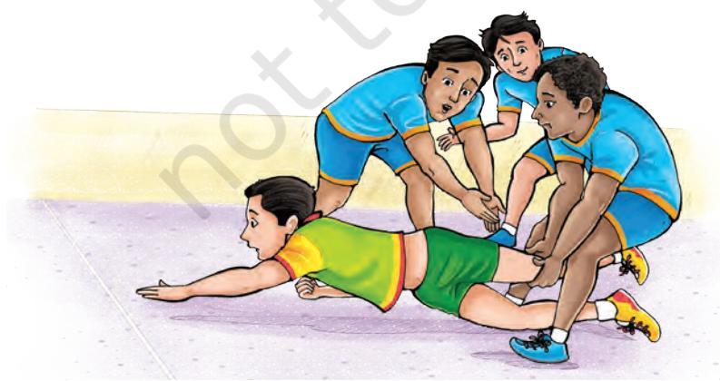
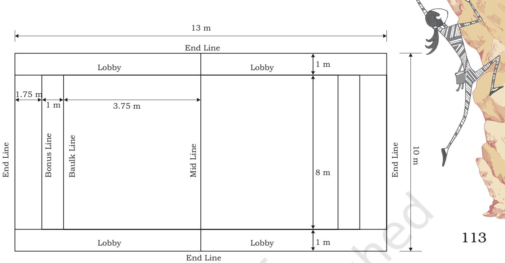
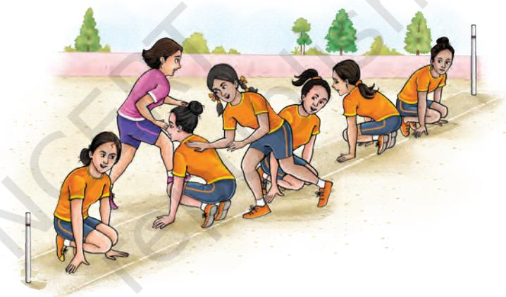
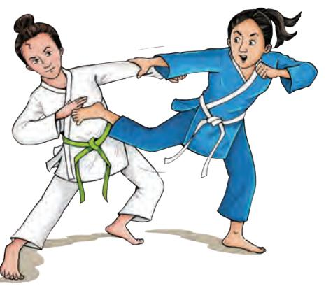
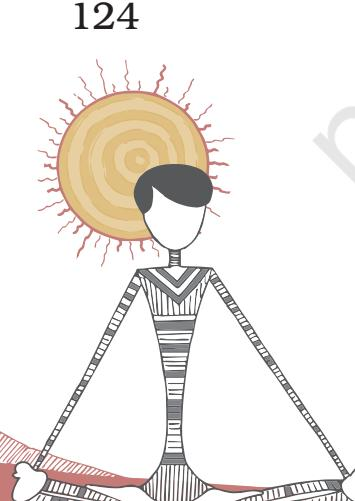
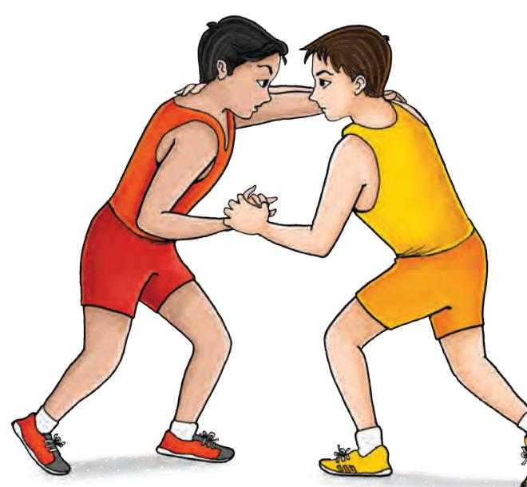
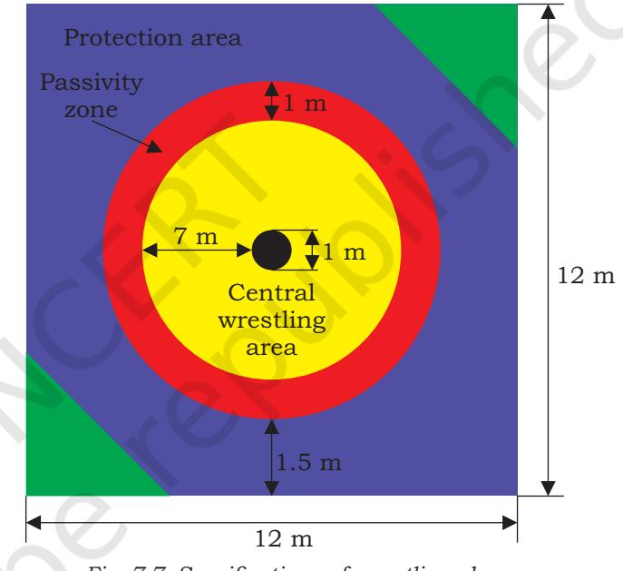

In the previous chapter, we have discussed team games like Football, Hockey, Basketball, Cricket and Volleyball. This chapter includes Kabaddi, Kho-Kho and Combative sports like Judo and Wrestling.

# **Kabaddi**

Kabaddi is an indigenous game which is popular in India. It is a simple and inexpensive game and does not require a big playing area or any equipment. This game is popular in the villages and small towns in India. It is played throughout Asia with minor modifications. Kabaddi is quite new to the other parts of the world. It was known by various names in different parts of India. For example, Chedugudu or Gudugudu in Southern parts of India, Ha-du-du (Men), Chu-kitkit (Women) in Eastern India, Hu-tu-tu in Maharashtra in western India and Kabaddi in Northern India. It is a game of attack and defense. The two teams occupy opposite halves of a field and take turn in sending a 'Raider' into the other half. In order to win points, members of the opposite team are tagged and the raider tries to return to half, holding the breath and chanting, "Kabaddi, Kabaddi, Kabaddi".

*Fig. 7.1: Children playing kabaddi*

Chap-7.indd 111 8/24/2020 11:41:01 AM

## **History**

According to some historians Kabaddi might have developed during prehistoric times when human beings were forced to defend themselves from sudden attacks from ferocious beasts. There is also another school of thought, in India, which believes that this game is a version of Chakravyuha, used in Mahabharata. The game was demonstrated for the first time at the international level during 1936 in Berlin Olympics by *Hanuman Vyayam Pracharak Mandal*, Amravati, Maharashtra. The game was introduced in the Indian Olympic Games at Calcutta in 1938.

In 1950, the All India Kabaddi Federation came into existence and compiled standard rules. The Amateur Kabaddi Federation of India (AKFI) was founded in 1973. After formation of the AKFI, the first men's nationals were held in Madras (Chennai), while the women's were held in Calcutta (Kolkata) in 1955. The Asian Kabaddi Federation (AKF) was founded in 1978. AKF is affiliated to Olympic Council of Asia. The parent body designated to regulate the game at the international level is International Kabaddi Federation (IKF). The Kabaddi World Cup was first played in 2004, then in 2007 and 2010. So far India is the unbeaten champion in Kabaddi World Cup. Iran is the next most successful nation being runners-up twice. Pakistan was the runners-up in 2010.

## **Rules**

#### **Kabaddi field measurements**

| S. No | Field measurements | Men | Women |
| --- | --- | --- | --- |
| 1 | Side lines (AB, CD, EF & GH) | 13 meter | 12 meter |
| 2 | End Line (AD, BC) | 10 meter | 8 meter |
| 3 | Lobby (AE, BF, DG, CH) | 1 meter | 1 meter |
| 4 | Baulk Line (from Mid line) | 3.75 meter | 3 meter |
|  | (LN, KM, LR, KQ) |  |  |
| 5 | Baulk Line (RQ, MN) | 8 meter | 6 meter |
| 6 | Mid-line (IJ) | 10 meter | 8 meter |
| 7 | Bonus Line (TS, PO) from Baulk | 1 meter | 1 meter |
|  | Line (RT, QS, MO, NP) |  |  |
| 8 | Bonus Line (MN, ST) | 8 meter | 6 meter |
| 9 | Sitting Block (2 meters away | 8×1 meter | 6×1 meter |
|  | from End lines) |  |  |
| 10 | Court (each half of the playfield | 6.5×8 meter | 6×6 meter |
|  | divided by the mid line) |  |  |
| 11 | Space surrounding the | 4 meter | 4 meter |
|  | play field |  |  |
| 12 | Duration of the match | 20-5-20 | 15-5-15 |
|  |  | Minutes | Minutes |

#### **Do You Know?**

- **•** Pro Kabaddi League was established in 2014.
- **•** Women Kabaddi Challenge was first played in 2016.
- **•** 2019 Kabaddi World Cup was held in April 2019 at Malaysia. It is the largest World Cup in the history of kabaddi consisting of 32 men's team and 24 female's teams.

112

Chap-7.indd 112 8/24/2020 11:41:01 AM

*Fig. 7.2: Specifications of Kabaddi court*

#### *Court*

The Kabaddi court measures 13×10 meters for men and 12×8 meters for women with a line dividing it into identical halves denoting actual playing area of the two teams. Traditionally the game is played outdoors and the entire court is dug at least 1 foot deep. The mud is removed and filled with sand from the river or beach. This ensures that the player is not seriously injured if he falls or is dragged by opponents. However, now synthetic Kabaddi fields are used for comfort and to reduce injuries. Tournaments like the Indian Kabaddi league have emerged as crowd pullers in urban areas.

#### *Team*

Each team shall consist of minimum 10 and maximum 12 players. Seven players shall take the ground at a time and the remaining players are the substitutes.

#### *Duration of the match*

The duration of the match is divided into two halves of 20 minutes each. In case of men and junior boys there is a 5 minutes interval and in case of women, junior girls, subjunior boys and girls two halves of 15 minutes with 5 minutes interval. The teams shall change court after interval. The number of players for each team at the start of the second half shall remain the same as it was at the end of first half. The last raid of each half of the match shall be allowed to be completed even after completion of the scheduled time as mentioned above.

Team Games and Sports II

Chap-7.indd 113 8/24/2020 11:41:01 AM

## *System of scoring*

One point score will be given to each team for every opponent who is deemed out. And if your team, makes all the players of your opponent team out, your team is entitled to get 2 points as a bonus. This is known as Lona.

### *Time out*

- **•** Each team shall be allowed to take two time outs of 30 seconds in each half. Such time out shall be called for by the Captain, Coach or any playing member of the team with the permission of the Referee. The time out duration shall be added to match time.
- **•** During time out, the team shall not leave the ground. Any violation of this will result in the award of a technical point to the opponent team.
- **•** Official time out shall be called for by the Referee or Umpire in the event of any injury to the player, interruption by outsiders, re-marking of the ground or any such unforeseen circumstances. Such time out will be added to the match time.

#### *Substitution*

- **•** Five reserve players can be substituted with the permission of the referee during time out or interval.
- **•** Substituted players can be re-substituted.
- **•** If any player is suspended or disqualified from the match, no substitution is allowed for that particular player. The team will play with less number of players.
- **•** No substitution is allowed during the official time out.
- **•** Substitution is not allowed for players who are deemed out.

#### *Bonus point*

- **•** One point shall be awarded to the raider when they cross the bonus line. If the raider after crossing the bonus line, (is caught) the opponent team will also be awarded one point.
- **•** The bonus line will be applicable when there are a minimum of 6 players in the court; the bonus point shall be awarded by the referee after completion of such a raid by showing thumb upward towards the side which score.
- **•** If the raider while crossing the bonus line is caught, then a point will be awarded to the defending team. No bonus point shall be given to the attacking team.
- **•** If the raider, after crossing the bonus line, puts out one or more antis, they will get the number of points

114

Chap-7.indd 114 8/24/2020 11:41:01 AM

scored in addition to the bonus point for crossing the bonus line.

- **•** The raider has to cross the bonus line to score the bonus point before touching the antis or before he is caught by the antis. The raider will not be awarded bonus points if they cross the bonus line after a touch or struggle.
- **•** There shall be no revival for bonus points.
- **•** If player is suspended temporarily or disqualified from the match, then the team will play with less number of players. Such players shall be counted while awarding bonus point.

## *Result*

The team which scores the highest number of points at the end of the match shall be declared the winner.

### *Precautions*

- **•** Players should have clipped nails and no ornaments of any sort shall be allowed.
- **•** All players must have distinct numbers on their T-shirts of at least 4 inches thickness in front and 6 inches thickness at the back. Dress code is followed compulsorily by both the teams during competitions.
- **•** Application of oils or any other soft substances to the body shall not be allowed.
- **•** Shoes are compulsory in case the match is played on the mat surface.

## **Fundamental skills**

#### *Skills*

The skills used by the raider in kabaddi are called offensive skills. The skills used by the antis are called defensive skills. During a raid, the raider has to make maximum use of his limbs to come in contact or touch the opponents in order to score points. This is accomplished through leg touches, such as, toe touch, foot touch, squat leg, thrust, kicks, etc., with lower limbs and through hand touches with upper limbs.

Offensive skills

- a) Touch: Touch is a fundamental and the easiest skill, which every raider applies in one or the other forms. There are different kinds of touches such as —
	- (i) Hand touch: (a) running hand touch (b) stooping hand touch (c) turning hand-touch (d) hopping hand touch (e) fake and touch
	- (ii) Toe touch: This offensive skill is used by almost every raider. A raider can execute this

 and

Sports II

Chap-7.indd 115 8/24/2020 11:41:01 AM

skill even from a considerable distance from the anties. During the course of a raid, the raider will move in different angles, according to the positions and moves of the opponents. At the same time, in order to apply this skill, the raider requires to extend his leg towards the opponent suddenly.

- (iii) Foot touch: The modern toe touch is a moderate form of foot-touch. The major difference between these two skills is that in foot-touch, the raider tries to touch the opponents with complete foot whereas in toe touch, toe is used to touch the opponents. This skill helps the raider to cover more area in the opponent's court and has an advantage over toe touch.
- b) Mule kick: It is very useful in critical situations. Mule kick is a thrust or blow in the air, by the raider, with leg, to touch an anti. There are various types of kicks, such as
	- i. Back kick: Kicking the anti who comes behind the raider during the course of raid is known as back kick. The different forms of back kick are: (i) running back kick (ii) standing back kick (iii) fake and kick (iv) taking a turn and back kick.
	- ii. Side kick: Raiders who raid from second to second and attack the central zone will find this skill the most suitable. The method and principle of kick are the same as in the case of back kick. The only difference between the two is that the area to be covered is sideward.
	- iii. Curve kick is also called a mule kick as the leg lifted to kick at the anties takes a curve from back to the side. This type of kick will enable the raider to cover more area with the attacking leg. At the same time it enables the raider to change his direction.

Defensive skills

- a) Ankle hold: This is a counter skill used by defensive players against leg thrusts and foot touches during an attack or raid. A team, which has mastery over ankle hold, can plan different strategies and tactics in various situations, such as, (a) lifting up (b) pulling back (c) changing direction of the raider.
Health and P hysical Education - Class X

116

Chap-7.indd 116 8/24/2020 11:41:01 AM

- b) Thigh hold: This skill is a good defensive skill. Every team uses this technique as a planned and surprise tactic. For example: (a) Taking one step forward and hold — Taking one step forward means holding the raider's thigh on wrong step or rear leg (b) thigh hold from behind.
- c) Waist hold or trunk hold: Waist hold is a skill used by a defender to catch the raider from behind.
- d) Wrist hold: Wrist hold is also a defensive skill and used occasionally only when a situation presents itself. This hold is rarely used now a days.
- e) Blocking: It is a defensive skill used by covers and corners. Blocking is an act of creating a wall of obstruction in the path of the raider to prevent the movement. The aim of blocking is not just to obstruct the path, but also to catch the raider.

### *Tactics*

Tactics means exploiting a given situation to one's advantage. This is also done to create a situation to suit one's purpose. The raider may increase or decrease the tempo of the game depending on the situation. In order to do this the player may adopt a passive raid or an aggressive raid by creating a situation for a struggle. Sometimes the raider may pass time in the last few minutes of the game, especially when the team is leading and the opponents are playing an aggressive game. Keeping in view the game situation, different tactics adopted by the raider.

## *Retreat*

Unless the raider returns to home court safely after the raid, the raid cannot be treated as successful. This is called a retreat. The raider has to pre-plan the path of retreat before starting the raid. While retreating to home court, the raider should keep the following points in view —

- **•** The raider does not give room for pursuit.
- **•** The raider regains their defensive position quickly before the opponent team's raider begins the raid.
- **•** While returning to home court, the raider must pass only through the midline.

## *Raid*

Raid is the offence part of the game. The main feature of the game is raiding on the opponent's court, alternatively by both the team players. The defence is done with teamwork while only one player makes an attack.

117

Chap-7.indd 117 8/24/2020 11:41:01 AM

#### *Cant*

'Cant' is holding of breath by the raider during the attack and chanting the word kabaddi, kabaddi, respectively, in one single expiration.

# **Kho-Kho**

Kho-Kho is one of the most popular traditional team sport in India. It is the simplest form of chasing and touching a person. It is an inexpensive and enjoyable sport that demands physical fitness and a set of skills. Dodging, feigning and bursts of controlled speed make this game quite thrilling. To catch by pursuit is to chase, rather than just run — is the main skill of Kho-Kho. This game is played in two innings by two teams on a rectangular court. One team becomes the chasers and the other the runners. In the game, the chaser pursues the runners and touches them and puts them out. Each team has to chase and defend for 9 minutes twice in a match.

*Fig. 7.3: Player playing kho-kho*

## **History**

In the ancient era, a version of the Kho-Kho game was played on 'raths' or chariots in Maharashtra, and this was known as Rathera. The Kho-Kho rules were first framed in the early 1900's. A committee was formed at Puna Gymkhana in 1914 for framing the Kho-Kho rules and the first ever book of Kho-Kho rules was published from Baroda Gymkhana in 1924. The year 1936 was the year of the golden opportunity for the game of Kho-Kho when Berlin Olympic Games featured an exhibition of Kho-Kho in the main stadium. The *Hanuman Vyayam Prasarak Mandal* of Amravati was the proud demonstrators in that exhibition.

The first ever All India Kho-Kho Championships were organised at Vijaywada in 1959-60 under the auspices of Kho-Kho Federation of India. In 1969-70 the junior age group

118

Chap-7.indd 118 8/24/2020 11:41:03 AM

competitions were organised in Hyderabad. Competitions for women's junior-group, girls under 16, were held in 1974 at Dewas when two more sub-junior groups for boys under 14 and for Girls under 12 also commenced. In the tournament best sub-junior boys were awarded Bharat Award and best sub-junior girls Veer Bala Award. In 1987, a demonstration was held in South Asian Games and Asian Kho-Kho Federation came into existence with three countries as its members. The Indian Olympic Association had included Kho-Kho as a discipline in the South Asian Games which was held at New Delhi in 2013.

## **Playfield**

A Kho-Kho playground (or pitch) is rectangular. It is 27 meters in length and 16 meters in width. There are two rectangles at the end.

*Fig. 7.4: Specifications of kho-kho ground*

One side of the rectangle is 16 meters and the other side is 1.50 meters. In the middle of these two rectangles, there are two wooden poles. The central lane is 24 m long and covers an area of 35 cm × 30 cm. There are eight cross lanes which lie across the small squares from pole to pole and right angles to the central lane is divided equally into two parts of 7.85 m each by the central lane. At the end of the central lane, two poles are fixed. These are 120 to 125 cm above the ground and their circumference is not less than 30 cm and not more than 40 cm. These poles are made of wood which are smooth all over. The poles are fixed firmly in the free zone tangent to the pole-line.

119

Team Games and Sports II

Chap-7.indd 119 8/24/2020 11:41:03 AM

## **Rules**

- **•** The team consists of 12 players, but only 9 players take the field for a contest.
- **•** A match consists of two innings. An inning consists of chasing and running turns of 9 minutes each.
- **•** Then, one team sits in the middle of the court, in a row, with adjacent members facing opposite directions.
- **•** The chasers can only run in one direction and cannot cut across the sitters unlike the dodgers who can run randomly and in between the sitters.
- **•** They have to run round the entire row to reach the other side.
- **•** The other option is to pass the chasing job to another sitter whose back is facing the chaser as the chaser is running.
- **•** In this option, the chaser touches the sitter he wants, usually nearest to the target and shouts "kho" to signify the change of guard.
- **•** The objective is to tag all the opponents in the shortest time possible.
- **•** The team that takes the shortest time to tag maximum number of opponents in the field wins.

## **Fundamental skills**

## *Offensive skills*

1. Giving kho to side: To chase a defender

- (i) Two steps kho (proximity and distal step)
- (ii) Advance kho: Running ahead of defender and dropping kho.
- (iii) Deceptive kho: To deceive defender by different body movements.
- 2. Pole turning: To turn the pole in continuation of attack
	- (i) Pole turning from 8th square (from sitting position).
	- (ii) 4 up turn: Turning pole by taking four steps.
	- (iii) 5 up turn: Turning pole by taking five steps.
	- (iv) Running pole turning: Pole turning without giving Kho.
- 3. Covering on cross lane: To cover the defender on cross lane.
	- (i) Quadruped
	- (ii) Biped
	- (iii) Rush Through
	- (iv) Combination

120

Chap-7.indd 120 8/24/2020 11:41:03 AM

- 4. Pole dive: Taking support of pole and touching the defender.
	- (i) Running pole dive
	- (ii) Pole dive from 8th square (Sitting)
	- (iii) Judgment kho and pole dive
	- (iv) Running flat dive
	- (v) Steady dive
	- (vi) Side dive
- 5. Tapping
	- (i) Shoulder tap: Touching the shoulder of defender.
	- (ii) Heel tap: Touching the heel of defender.

## *Defensive skills*

- 1. Chain game: Defender takes entry behind the sitting chaser and runs in a zig-zag path by making the attacker give kho from behind.
	- (i) Six Single up
	- (ii) Two five six up
	- (iii) Two three six up
	- (iv) Three four five six up
	- (v) One four five six up
	- (vi) One four seven one
- 2. Ring game: Defender runs in the shape of a ring (oval shape) by making use of four squares. In front ring defender faces the attacker. In back ring defender shows his back and plays ring game.
	- (i) Short ring Defender stands close to the centre lane.
	- (ii) Medium ring Defender stands almost half the way from the centre lane.
	- (iii) Long ring Defender stands away from the central lane but.
- 3. Combination of chain and ring game
- 4. Dodging: To deceive the attacker, different body dodge is used. Shoulder dodge, Foot dodge, combining both skills of defence, 3-ring defence.
- 5. Avoiding the pole: The defender stands between last square and pole without reaching pole.

## *Palti*

By showing his back, the defender deceives the attacker and turns in the opposite direction to the direction in which he was running.

121

Chap-7.indd 121 8/24/2020 11:41:03 AM

*Fig. 7.5: Player playing Judo*

Judo is a popular martial art, combative and Olympic sport. In the term judo, 'ju' means 'gentle' and 'do' means 'the way or path'. Judo was developed in Japan in the late 19th century by using the principles of balance and leverage adapted from jujutsu. Its most prominent feature is its competitive element, where the objective is to either throw or putdown one's opponent to the ground, immobilise or otherwise subdue one's opponent with a grappling maneuver, or force an opponent to submit by joint locking or by executing a stranglehold or choke. Strikes and thrusts by hands and feet as well as self-defense are a part of judo. Many are trained in Judo either for participation in competition or self-defense.

#### **History**

The history of judo starts with Japanese jujutsu. It was created by Professor Jigoro Kano and he believed that the techniques could be practiced as a competitive sport if the more dangerous techniques were omitted. By 1910 Judo was a recognised sport that could be safely engaged in and in 1911 it was adopted as a part of Japan's educational system. In the same year, the Kodokan Judo Instructors' Training Department, Kodokan Black Belt Association and Japan Athletic Association were formed. World War II saw a different development of Judo. Instead of being used for sport, Judo was being taught as a combat skill. Those selected for commando and special services training often achieved a high standard of expertise. When Japan hosted the 1964 Olympics, Judo was given its first opportunity as an event. Of the 16 medals awarded for Judo, Japan won three gold medals, and one silver medal. Judo was no longer a Japanese sport but had developed to become an international sport.

There have been two main developments in Judo over the years. The first was the introduction of weight categories. Earlier everyone fought everyone else, with the result that, if two players were equally matched in skill, the bigger man usually won. Initially there were three categories, and later this was made into five. Inclusion of the sport in the Olympic Games in 1964 helped to hasten this important reform. There are different styles of Judo. With its inclusion in the Olympics, there has been a shift towards a contest style practice. In clubs where this style is taught, the practice becomes largely a continuous contest. Other schools stress on skills. They favour repetitive movements to make them instinctive and the development of speed through practice with little resistance.

122

2024-25

Chap-7.indd 122 8/24/2020 11:41:04 AM

## **Rules**

## *Officials*

There are three officials who preside over a judo match. There is one referee who walks around inside the contest area and conducts the match. There are two judges who sit diagonally across the mat from one another, each in a corner. The two judges assist the referee and indicate when the contestant goes outside of the contest area. The referee is in charge of awarding points and accessing penalties and uses hand gestures to signal his decision. However, if a judge disagrees with a call, then the three officials take a vote and the decision is decided by a majority vote. In addition to the Judge and Referees there are also scorekeepers and timers. There is usually a scoreboard, which displays points and penalties and it can either be electronic or manual. Medical personnel are also on hand in the event of injury to a contestant.

#### *Contestants*

The two contestants, who are known as Judokas, compete for 5 minutes for men and 4 minutes for women. One contestant wears white uniform and the other a blue uniform.

#### *Uniforms*

The judokas wear loose-fitting judo uniforms called judogi, consisting of pants, a jacket and a belt. Judogi is made up of loose-fitting pants, a jacket and a belt that is tied around the waist. The jacket and pants are made of cotton. They are either blue or white and they are made so a rival should be able to get a grip on either one of them so as to be able to make a judo throw. One judoka will wear white the other blue. The belt is three meters long and it is wrapped around the waist twice. The color of the belt signifies the rank the combatant has reached.

#### *Competition area*

The entire competition area in judo is 46 to 53 feet square (14 to 16 meters). This area is made up of foam mats commonly referred to as tatami mats and the individual mats are 6.5 feet by 3.281 feet wide (2 meters long, a 1-meter wide). Inside the competition area is a contest area, which is 8-10 meters square. This contest area (shiaijo) is green in color, that would be 29.5 feet square (9-meters) and it will have a 3.281 foot (1-meter) red boundary around it. This is the danger zone and it alerts the competitor(s) (judoka) that they are about to go out of bounds. The area outside the danger zone is the safety zone. This zone is three meters wide and it is the out-of-bounds area.

Chap-7.indd 123 8/24/2020 11:41:04 AM

In the middle of the contest area are two pieces of tape, one blue and one white 13.1 feet apart (4-meters). These two pieces of tape mark the place where the judoka will stand when they begin and end each bout.

#### *Contest*

A random draw, in the same weight category, is used to determine which contestants will be fighting each other. In the Olympic Games there are two pools, and each pool has its own single-elimination tournament. The two pool winners will compete for the gold medal, with the loser of this contest winning the silver medal. In each pool, the competitors who lose to a pool winner are then entered into a repechage round which is also a single-elimination tournament. The winners of the repechage pools will be the winners of the bronze medals.

To win the contest a Judoka must score an Ippon a score that equals 10 points by using successful Judo techniques. If neither of the Judokas is able to score an Ippon or 10 points by the end of the match, the winner will be the Judoka who has scored the most points. In the event of a tie, for the first time at the 2004 Olympic Games, the "Golden Score" rule was used. If there is no winner after the five-minute period has ended, the referee announces the beginning of "Golden Score". This will extend the match for an extra fiveminute period and the contestant who scores the first point is declared the winner of the match.

#### *Judo penalties*

Two types of penalties may be awarded. One is shido and another is hansoku. After two shido are given, the third shido becomes hansoku-make and the victory is given to the opponent. This is an indirect hansoku-make and does not result in expulsion from the tournament.

# **Wrestling**

Considered as one of the most ancient and oldest sport in the world, wrestling has also been equally popular in India. It is a form of combat sport involving grappling type techniques such as clinch, fighting, throws, take downs, joint locks and other grappling holds. A wrestling bout is a physical competition, between two (occasionally more) competitors or partners, who attempt to gain and maintain a superior position. There are a wide range of styles with varying rules, such as, traditional, historic and modern styles. Wrestling techniques have been incorporated into other martial arts as well as military hand-to-hand combat systems.

**Activity 7.1** What is the proficiency given in India? Make a list. e.g.: Yellow belt or Black

belt.

Chap-7.indd 124 8/24/2020 11:41:04 AM

*Fig. 7.6: Bout in wrestling*

## **History**

Wrestling has been a part of human society since ancient times. In India also it received regular patronage from the Emperors and Kings. Wrestling in India then was popularly known as *Malla Yuddha*. In famous Indian epic, Mahabharata, Bhima was considered to be a great wrestler of that time and some of the other great wrestlers included Jarasandha, Duryodhana, and Karna. Another Indian epic, *Ramayana*  also mentions about wrestling and Hanuman is described as one of the great wrestlers of that time. Wrestling in India continued to increase its popularity during modern days. Even during the British rule, wrestling in India got encouraging support, as the British rulers included the game into the military practice. In fact, India was considered among the top 10 countries in wrestling till the 1960s. India also hosted the World Wrestling Championship at New Delhi in 1967.

The term *Kushti*, which means wrestling, denotes both a local form of the art as well as a more global combat. Kushti is composed of three primary dimensions: *dao*, *pench*, and *paintra* (moves, counter-moves, and stance). There may be similarities between the *daos* known as *multani*, *dhobi pat*, and *kalajangh* and the corresponding freestyle moves known as arm drag, front hip throw, and fireman carry. But what is significantly different about wrestling in India is that wrestlers mostly wrestle in mud pits, engage in bouts that last for half an hour or more. At other times and under other circumstances Indian wrestlers follow clearly defined international guidelines, rules, and regulations.

## **Do You Know?**

In 2008, Sushil Kumar brought 2nd Bronze Medal for India at Beijing Olympic Games. This feat was repeated at 2012 Olympics games by Sushil Kumar (Silver Medal) and Yogeshwar Dutt Bronze Medal. The first medal was won by K.D. Jadhav in 1952 at Helsinki Games. Geeta Phogat became the first Indian woman wrestler to represent the country at 2012 London Olympic Games.

Chap-7.indd 125 8/24/2020 11:41:05 AM

Worldwide wrestling entered a new era with the acknowledgement of Female Wrestling as an Olympic discipline in the Athens Games in 2004.

## **Measurement of the wrestling mat**

| Terms | Dimensions |
| --- | --- |
| Dimensions of the mat | 9 meters in a circle |
| Empty space on the border of the mat | 1 metre |
| Height of the platform | 1.10 metre |
| Colour of marks on the mat | Red of Blue |
| Thickness of the mat | 10 cm |
| Protection area | 1.2 to 1.5 m width |

*Fig. 7.7: Specifications of wrestling play area*

## **Rules and regulations**

- 1. There are two Olympic styles of wrestling, Freestyle and Greco-Roman. With one key exception, the rules of the two styles are identical:
	- **•** In Greco-Roman, a wrestler may not attack his opponent's legs, nor use his own legs to trip, lift or execute other moves.
	- **•** In freestyle, both the arms and legs may be used to execute holds or to defend against attack.
- 2. The wrestler must be at least 17 years old, and must be sponsored by the national federation, to compete at the World Championships or Olympic Games.

126

2024-25

Chap-7.indd 126 8/24/2020 11:41:06 AM

- 3. The weight divisions: There are eight weight divisions in men's international wrestling and six for women. Athletes are weighed-in prior to the competition, and must be at the weight level or below in order to participate in the competition.
- 4. New weight categories for wrestling (for 2018-19) —

| Freestyle (Boys) | Freestyle (Girls) |
| --- | --- |
| 35 kg | 30 kg |
| 38 kg | 33 kg |
| 41 kg | 36 kg |
| 44 kg | 39 kg |
| 48 kg | 42 kg |
| 52 kg | 46 kg |
| 57 kg | 50 kg |
| 62 kg | 54 kg |
| 68 kg | 58 kg |
| 75 kg | 62 kg |

### **Under-14 Boys and Girls**

#### **Under-17 Boys and Girls**

| Freestyle and Greco-Roman (Boys) | Freestyle (Girls) |
| --- | --- |
| 41-45 kg | 36-40 kg |
| 48 kg | 43 kg |
| 51 kg | 46 kg |
| 55 kg | 49 kg |
| 60 kg | 53 kg |
| 65 kg | 57 kg |
| 71 kg | 61 kg |
| 80 kg | 65 kg |
| 92 kg | 69 kg |
| 110 kg | 73 kg |

#### **Under-19 Boys and Girls**

| Freestyle | Freestyle (Girls) | Greco-Roman (Boys) |
| --- | --- | --- |
| 57 kg | 50 kg | 55 kg |
| 61 kg | 53 kg | 60 kg |
| 65 kg | 55 kg | 63 kg |
| 70 kg | 57 kg | 67 kg |
| 74 kg | 59 kg | 72 kg |
| 79 kg | 62 kg | 77 kg |
| 86 kg | 65 kg | 82 kg |

Chap-7.indd 127 8/24/2020 11:41:06 AM

| 92 kg | 68 kg | 87 kg |
| --- | --- | --- |
| 97 kg | 72 kg | 97 kg |
| 125 kg | 76 kg | 130 kg |

- 5. The officials: There are three officials for every international wrestling match, a referee (on the mat) plus a chairperson and a judge. There cannot be two officials from the same nation officiating the same match, nor may an official officiate a match where an athlete from his/her nation is participating. The officials award points on a majority vote. At least two of the three officials must agree on technical points and falls.
- 6. The coach: The coach may remain at the foot of the platform or at least two meters from the edge of the mat during the competition.
- 7. The uniform: Wrestlers must wear a one-piece singlet, in the color assigned to them (red or blue), wrestling shoes and carry a handkerchief. The wrestling singlet must be of a type approved by the international wrestling federation. Referees must wear a white shirt or pullover, pants and shoes.
	- o The competition rules: You have already gone through these rules in Class IX, Chapter 10 *Team Games*.

## **Scoring rules and terms**

- **•** Takedown occurs when a man takes opponent to the mat from a standing position. This is worth one point, but can be worth more if the opponent is brought down onto his back.
- **•** Exposure is turning an opponent's shoulders to the mat. Once the line of the back area breaks a 90-degree angle, points are scored. This can occur both from the feet and on the mat. A wrestler who holds his opponent in a danger position for five seconds will receive one extra point.
- **•** Reversal is, when the man underneath completely reverses his position and comes to the top position in control, he has scored a reversal, worth one point.
- **•** Escape is when an athlete works to come out from the bottom position (after being under dominant control) and gets to their feet, facing the rival. The athlete has then scored an escape, worth one point.
- **•** Duration of the bout U-15 cadets and veterans The duration of a bout will be of two periods of 02 minutes with a 30 second break.

128

Chap-7.indd 128 8/24/2020 11:41:06 AM

- **•** Junior and seniors The duration of a bout will be two periods of 3 minutes each with a 30 second break.
For all the competitions, the timing displayed on the scoreboards will start from 6 to 1 minute (from 4 to 0 minute for U-15, cadets and veterans).

| Points | Terms |
| --- | --- |
| 1 point | Holding of opponent on the ground |
| 2 points | Placing the opponent in danger |
| 3 points | Bringing the opponent into immediate danger |
|  | position |
| 4 points | Exceeding a throw of great height losing contact of |
|  | the other opponent from the ground. |
| 5 points | All grand amplitude throws executed in a standing |
|  | position which bring the defending wrestler to a |
|  | direct and immediate danger position. |
|  | The hold executed by a wrestler in the Parterre |
|  | position who completely lifts his opponent off the |
|  | ground with the execution of a high amplitude |
|  | throw which project the opponent into a direct and |
|  | immediate danger position. |
| Fall | Bring two shoulders of the opponent on the ground. |

#### **Scoring**

#### **Types of Victories**

|  | by fall by injury |
| --- | --- |
| A bout may be won |  |
|  | by a disqualification |
|  | by points (by having at least 1 point more after addition of the |
|  | two periods) |
| In case of tie by points, | The highest value of holds. |
| the winner will be | The least amount of cautions. |
| declared by successively | The last technical point/points |
| considering | scored. |

129

Chap-7.indd 129 8/24/2020 11:41:06 AM

# **Assessment**

## **Kabaddi**

#### **I. Answer the following Questions**

- 1. List the landmarks in the history of Kabaddi in India.
- 2. What is the system of scoring in Kabaddi?
- 3. What are the rules regarding substitutions?
- 4. What is a bonus point?
- 5. What is the Golden Raid rule?

#### **II. Fill in the Blanks**

- 1. The Kabaddi court measures _____________ meters with a dividing line in between making it into identical halves.
- 2. Each team consists of minimum _____________ and maximum _____________ players, but only _____________ players take the ground at a time.
- 3. The duration of the match is two halves of _____________ minutes with _____________ minutes interval in case of men and junior boys and of _____________ minutes with _____________ minutes interval in the case of women and junior girls.
- 4. Each team shall be allowed to take _____________ "time outs" of _____________ seconds each in each half.

## **Kho-Kho**

#### **I. Fill in the Blanks**

- 1. In Kho-Kho, one team becomes the _____________ and the other the _____________ or runners.
- 2. Many historians say that Kho-Kho is actually a modified form of ' _____________ '.
- 3. The first ever book of Kho-Kho rules was published from Gymkhana Baroda, in _____________ .
- 4. The year 1936 got the golden opportunity for the game of Kho-Kho when _____________ featured an exhibition of Kho-Kho in the main stadium.
- 5. The first ever All India Kho-Kho Championships were organised at _____________ in 1959-60 under the auspices of _____________ of India.
- 6. The Indian Olympic Association has included kho-kho as a discipline in the next _____________ Games to be held in New Delhi in _____________ .

130

2024-25

Chap-7.indd 130 8/24/2020 11:41:06 AM

#### **II. State whether True or False**

- 1. In Kho-Kho, each team consists of 15 players, but only 12 players take the field for a contest
- 2. A match consists of 4 innings. An innings consists of chasing and running turns of 9 minutes each.
- 3. The chasers can only run in one direction and cannot cut across the sitters unlike the dodgers who can run randomly and in between the sitters.
- 4. The equipment used in Kho-Kho are posts, two watches, and score board.
- 5. A Kho-Kho playground (or pitch) is rectangular. It is 29 meters in length and 16 meters in width.
- 6. One side of the rectangle is 20 meter and the other side is 9 meters.
- 7. At the end of the innings there is an interval of 5 minutes and an interval of 2 minutes, in between the turns.

## **Judo**

#### **I. Answer the following Questions**

- 1. Briefly list the typical characteristics of Judo?
- 2. Why should we learn Judo?
- 3. How has Judo developed in India?

#### **II. Fill in the Blanks**

- 1. There is one _____________ who walks around inside the contest area and conducts the match and there are _____________ judges who sit diagonally across the mat from one another, each in a corner.
- 2. Contestants, who are known as _____________, compete for _____________ minutes for men and _____________ minutes for women.
- 3. The judoka wears loose-fitting judo uniforms called _____________ because _____________ .
- 4. The entire competition area in judo is _____________ to _____________ square feet (14 to 16 meters).
- 5. In the middle of the contest area are two pieces of tape, one _____________ and one _____________ .
- 6. To win the contest a Judoka must score an _____________ a score that equals 10 points by using successful Judo techniques.
- 7. Penalty points can also be awarded against a Judoka. These penalties are: _____________, _____________ and _____________ .

Chap-7.indd 131 8/24/2020 11:41:06 AM

# **Wrestling**

#### **I. Answer the following Questions**

- 1. List the landmarks in the history of wrestling in India?
- 2. List and describe the scoring rules and terms of wrestling.

#### **II. Fill in the Blanks**

- 1. It is a form of combat sports involving grappling type techniques such as _____________, _____________, _____________, _____________, _____________ and other grappling holds.
2. In Greco-Roman, a wrestler may not attack his/her opponent's _____________, nor use his/her own _____________ to trip, lift or execute other moves.

- 3. In freestyle, both the _____________ and _____________ may be used to execute holds or to defend against attack.
- 4. International wrestling is contested on a mat, with a _____________ meter circular competition area.
- 5. There are three officials for every international wrestling match, a _____________ (on the mat) plus a _____________ and a _____________
- 6. If a wrestler scores _____________ points more than his opponent at any time, the round is stopped.

132

Chap-7.indd 132 8/24/2020 11:41:06 AM

