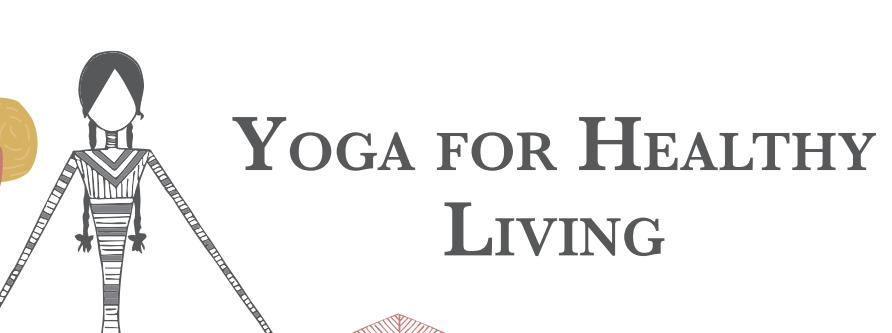

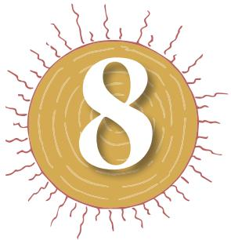

Adolescents in different situations experience a wide range of emotions that could vary from positive to negative, such as, happiness, satisfaction, sadness, anger, frustration, etc. They have high expectations from themselves that may be further reinforced by people and environment around them. This may cause stress in them. There are many occasions when they may get stressed or feel angry or frustrated. It is natural for adolescents to experience both positive and negative emotions. It is also necessary to express their feelings and emotions. There are positive and negative ways of expressing the emotions. It is pointed out that negative emotions and their expression in negative ways may be caused by certain stresses experienced by the adolescents.

In today's life, stress is becoming a major cause of many health-related problems. It is a known fact that chronic stress negatively affects health. Hypertension, diabetes mellitus, cardiac problems, depression, anxiety attacks, road-rage, etc., have become common now-a-days. The most common emotion faced by all of us during this COVID-19 pandemic is fear. It has also made us panicky and anxious to deal with such issues. Yoga can help us in dealing with stress and mental health issue during this time. In the management of stress, lifestyle plays an important role. A healthy lifestyle reduces stress and promotes one's health.

Here, it is important to recognise that stress can be tackled and definitely decreased. Many times, we may not necessarily be in control of the situations but we can control our over-all response to such situations.

# **What is Stress?**

Stress can be understood as a state of physiological and psychological imbalance resulting from demanding or difficult situations which the person is not able to cope with.

Chap-8_New.indd 133 8/24/2020 11:42:31 AM

In day-to-day life, a person faces many situations. Some situations are easy to handle; while some are difficult. As a result, the body starts responding at physiological and psychological levels. At the physiological level, there may be changes in heart rate, pulse rate, blood pressure, secretions of hormones, etc. At the psychological level, there may be changes in attention, concentration, memory and alertness and also in the emotional state (like anger, fear, hate, sadness, etc.).

Stress generally occurs as a result of major events in life, such as, tough competitions, getting low scores in an examination, recent break-up in friendship, not getting a good job, a fight with others, and so on. There are several other factors which may cause stress in a person, like, diseases, poor living conditions, poverty, problems in relationship, challenges of adolescence, wrong habits, high aspirations, unrealistic goals, death of a close relative, discrimination, fast changing life and many others. However, sometimes it may also occur due to minor issues, such as, not getting up early, not getting ready on time, reaching school late, not getting the desired food, arguments with a friend, not getting permission from parents for attending a late night party, and so on.

Intensity of stress varies from person to person and generally depends on perception of a particular situation by that person. A situation may be easy to handle for one person, while it may pose a big challenge to another. For example, examination may cause stress in one student, while it may not affect another student.

Stress which motivates us to perform better and learn new skills is beneficial. For example, getting admission in a new course, preparing for an examination or getting promotion may cause stress but this stress is beneficial as it finally contributes towards growth and development. Stress may be harmful also. When stress is severe and chronic it reduces efficiency of a person. This kind of stress may adversely affect our ability to feel, think and act.

During severe stress, people may become restless and worried. They may not remember the things properly. Even small things may make them angry. You also might have observed that when you are in tension you become restless. You may not be able to focus on your studies and small things may cause irritation.

Chronic and severe stress reduces our body's ability to fight diseases. It can lead to various psychosomatic diseases, such as, peptic ulcer, migraine, diabetes mellitus, high blood pressure, etc. It could even result in heart attack, brain stroke and death. Several psychological disorders, such as, anxiety attacks and depression may

# **Activity 8.1**

Think and discuss the following with your friends:

#### **Questions**

- **•** Have you ever experienced stress?
- **•** What was the cause of it?
- **•** How did you manage it?
- **•** Can you think any other way by which you could have better managed it?

134

Chap-8_New.indd 134 8/24/2020 11:42:31 AM

also result from chronic and severe stress. However, the fact is — we cannot avoid stress. Therefore, management of stress is necessary

# **Yoga as a Way of Life for Stress Management**

Yoga has been considered a panacea for managing the stress. In this context, we will discuss the role of yoga in developing a healthy lifestyle by which stress can be managed. Yoga practices when become a way of life, play an important role in stress management.

You have learnt about *asana*, *pranayama*, *kriya*, *mudra*, *bandha* and meditation in Class IX. However, yoga is not limited to the physical postures, breathing techniques or meditation for a few minutes only. Rather yoga is a way of life also. It propounds several principles and practices, such as, *asana, pranayama, kriya, mudra, bandha* and meditation which are relevant to healthy living. Yogic principles and practices of healthy living can be adopted by all, irrespective of age, gender, profession or place. As a way of life, yoga gives direction about food, eating habits, thinking, recreational means and conduct. Yogic way of life, if adopted in true sense, empowers us to deal with stress and promote physical and mental health.

The components of yogic way of life are —

- **•** *Ahara* (Food)
- **•** *Vihara* (Relaxation)
- **•** *Achara* (Conduct)
- **•** *Vichara* (Thinking)
- **•** *Vyavahara* (Behaviour or actions)

#### *Ahara*

The principles of *ahara* are related to food consumption. Yoga emphasises on *mitahara,* which is related to quality and quantity of food and also the state of mind during the intake of food.

As for the quality, the concept of *mitahara* implies that food should be freshly cooked, nutritious, nourishing and in the natural form. Regarding quantity of food, *mitahara* mentions that two quarters of the stomach should be filled with food, one quarter with liquid and the remaining quarter (one‑fourth) should be left empty for free flow of air. This implies that quantity of food may vary from person to person depending upon the individual requirements. It is very natural that a sportsperson will require more food as compared to a person who is doing desk job. *Mitahara* also advocates that the food should be eaten with positive state of 135

Chap-8_New.indd 135 8/24/2020 11:42:31 AM

mind with utmost concentration. You might have observed if someone eats while watching the television or in an angry mood or when the person's attention is somewhere else, then they tend to just gulp down the food without enjoying it. So, the state of mind is also very important while eating. Thus, *mitahara* emphasises that right quality and quantity of food should be eaten in a positive state of mind.

# **Activity 8.2**

In Column I, put a list of food items that you like eating and in Column II put the food items that you consider good for your health.

| Column I | Column II |
| --- | --- |
| Food items that you like eating | Food items that you consider good for health |

#### **Questions**

- **•** Compare the items of both the columns. Do the items in Column I tally with those in Column II?
- **•** Do you think that you need to change your food habits? Make a separate list indicating which food items from the list (Column I) you want to change.

# *Vihara*

*Vihara* means relaxation, which can be brought about by activities, such as, exercise, recreational and creative activities like drawing, painting, singing, etc. These activities help to regulate and channelise our emotions and bring us joy and happiness. Yogic practices of *asana, pranayama* and *meditation* relax body and mind. In addition to this, relaxation can be attained in good company also. Sound sleep is also important for relaxation. It is, therefore, important that we should regularly follow a timetable that provides adequate time for yogic and creative activities which are relaxing.

# **Activity 8.3**

Prepare a timetable that allots some leisure time to pursue your hobbies and creative activities, exercise and sufficient time for sleep.

|  | Time allocated | Activities |
| --- | --- | --- |
| • | 5.30 to 6.30 pm | • Yogasana |
| • | _________________________ | • _________________________ |
| • | _________________________ | • _________________________ |

136

Chap-8_New.indd 136 8/24/2020 11:42:31 AM

# *Achara*

*Achara* means conduct that includes emotions, attitudes, desires, instincts and habits. Right conduct is essential for a stress-free life. Positive emotions and positive attitudes, good habits and control on desires help in making us strong, both, individually and socially. The right conduct protects us from unnecessary stress caused by negative emotions and attitudes like hate, jealousy, fear, etc.

Therefore, we should have control on our desires, instincts, emotions, habits and attitudes. Here, yoga is important as it encourages good conduct in our personal and social life. Yoga advocates for positive emotions and positive attitude towards self and other persons.

In this context yogic principles of *Yama* (restraint) and *Niyama* (observance) help to develop control on our desires and emotions and bring about peace and harmony.

#### *Yama* **(Restraint) and** *Niyama* **(Observance)**

*Yamas* (restraints) and *Niyamas* (observances) are sets of the dos and the don'ts. They can be considered as the universal codes of conduct that help us in following high standards in our personal and social life. *Yamas* are concerned with one's social life; while the *niyamas* are concerned with one's personal life. *Yama* and *Niyama* are part of *Ashtanga* Yoga that has been propagated by Patanjali.

The **five** *yamas* are *ahimsa* (non-violence), *satya* (truthfulness), *asteya* (non stealing), *brahmcharya* (celibacy) and *aparigraha* (non possessiveness).

The **five** *niyamas* are: *Shaucha* (cleanliness), *Santosha* (contentment), *Tapas* (austerity), *Swadhyaya* (self study) and *Ishwarpranidhana* (surrender to god).

#### *Vichara*

We know that thoughts are very important as our behaviour is guided by the kind of thoughts we have. Our thinking should be positive.

Positive thoughts bring pleasure to our life; while negative thoughts can make us unhappy. Right thinking guides us towards appropriate behaviour. It helps in prevention and management of stress-related health problems.

Yoga prescribes that one should have positive thoughts. Positive thoughts give us strength to bear the sorrows of life. Yogic practices like *yama, niyama, pratyahara, dhyana* (meditation), study of good literature, etc., help us in controlling our thoughts and thereby promoting optimism in life.

#### **Activity 8.4**

Ramesh and his friends are planning to skip their classes and go for a movie instead. Ramesh is worried as he feels that it is not right to skip the class without informing his parents. But at the same time, he does not want to be seen as a spoilsport by his friends. Finally, he succumbed to the peer pressure. Now, he is disturbed to think what would happen if his parents come to know of it.

#### **Questions**

- **•** Why was Ramesh worried?
- **•** Was his conduct appropriate? Explain your answer.
- **•** Can you suggest some ways to get out of this conflicting situation?
- **•** What would you do, if you were in Ramesh's place?
- **•** Do you think the yogic principles of *Yama* (restraint) and *Niyama* (observance) help to develop control on our desires and emotions and lessen our stress?

137

Chap-8_New.indd 137 8/24/2020 11:42:31 AM

# **Activity 8.5**

Write your thoughts about various people in the appropriate columns in the table given below.

| People | Positive Thoughts | Negative Thoughts |
| --- | --- | --- |
| Teachers |  |  |
| Parents |  |  |
| Bench partner in the class or |  |  |
| your friend |  |  |

#### **Questions**

On the basis of your thinking, as given in the above table, answer the following questions:

- **•** Find out which type of thoughts positive or negative were dominating you today?
- **•** Do you feel that you need to change your thoughts? If yes, why?

### **Activity 8.6**

Shreya is an outgoing and independent girl. She does not like to be dictated by her parents. Her parents are worried as they think that she has been wasting her time and energy on futile, trivial and useless things. One day, her parents asked her to study while she wanted to finish the novel which she was reading. At this, Shreya lost her temper and started shouting at her parents.

#### **Questions**

- **•** Was Shreya's behaviour towards her parents appropriate?
- **•** Were her attitude and thinking responsible for this kind of behaviour?
- 138 **•** Suggest how she should have behaved.

# *Vyavahara*

*Vyavahara* (behaviour) means actions. *Vyavahara* is the result of *ahara*, *vihara, achara and vichara*. Yogic philosophy propounds that our actions should be right. We should not indulge in wrong activities. Our behaviour towards others should be appropriate. *Karma‑ yoga* proposes that we should perform right and act with full dedication and to our utmost capacity without worrying about the results. We can remain stress-free and be happy if we follow this philosophy and act accordingly.

# **Yogic Practices**

The practices which can strengthen the autonomic nervous system with the dominance of para-sympathetic system of body are beneficial for managing stress. Here are some *asanas*, *pranayamas*, *kriya* and relaxing practices which are helpful in stress management.

# *Asana*

#### *Hastottanasana*

*Hastottanasana* comprises of three words— *hasta*, *uttana* and *asana*. *Hasta* means 'arms'; *uttana* means 'stretched up' and *asana* means 'posture'. In this posture, the arms are stretched upwards, hence is called *Hastottanasana*.

Let us perform Hastottanssana by following the steps given below.

- 1. Stand erect on the ground with both feet together.
- 2. Slowly inhaling, raise both arms over the head.
- 3. Interlock the fingers and turn the palms upward.

Chap-8_New.indd 138 8/24/2020 11:42:31 AM

- 4. Exhaling, bend from the waist towards the right side. Maintain this position comfortably for 5-10 seconds in the beginning.
- 5. Inhaling, come to the centre.
- 6. Repeat it from the left side as well.

*Fig. 8.1: Hastottanasana*

### **Remember the following points**

|  | Dos | Don'ts |
| --- | --- | --- |
| • | Bend from the waist only. | Avoid bending forward. • |
| • | Stretch the arms up as much |  |
|  | as possible. |  |

#### **Benefits**

- **•** It relaxes the whole body.
- **•** It relieves pain in the neck, shoulders and arms.
- **•** It is beneficial for increasing the height of growing children.
- **•** It increases flexibility of the spine.

### **Limitation**

- **•** This *asana* should not be performed in case of hernia, abdominal inflammation.
# *Padahastasana*

*Padahastasana* consists of three words: *pada*, *hasta* and *asana*. In Sanskrit *pada* means 'feet', *hasta* means 'arms' and *asana* means 'posture'. In this *asana,* the hands are brought near the feet, hence it is called *Padahastasana*. It strengthens the organs located in the abdominal area and improves their functioning. *Fig. 8.2: Padahastasana* 

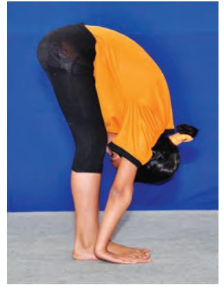

139

Living

Chap-8_New.indd 139 8/24/2020 11:42:33 AM

Let us perform *Padahastasana* by following the steps given below.

- 1. Stand erect, keep both feet together with hands beside the body. Balance weight of the body on the sole of the feet.
- 2. Inhaling, raise both arms above the head and stretch them up.
- 3. While exhaling, bend forward from the waist. Place the palms on the floor beside the feet or touch the feet with palms.
- 4. Maintain this position comfortably for 10–15 seconds.
- 5. To come back, slowly come to the standing position keeping your arms up over the head. Then slowly bring the arms down to the starting position.

#### **Remember the following points**

|  | Dos | Don'ts |
| --- | --- | --- |
| • | Keep the legs straight. | • Do not bend the knees. |
| • | Keep the arms straight and bring them |  |
|  | down along the head while bending down |  |
|  | from the waist. |  |

#### **Benefits**

- **•** It improves digestion.
- **•** Liver and spleen are activated by this *asana*.
- **•** Abdominal muscles are toned by this *asana*.
- **•** It improves circulation of blood to the head and upper region of the body.
- **•** It increases the flexibility of the legs' muscles.

#### **Limitations**

- **•** In case of severe backache and high blood pressure one should avoid this *asana*.
#### *Trikonasana*

*Trikonasana* is made of two words— *trikona* and *asana*. *Trikona* in Sanskrit means 'triangle'. In this *asana*, the body assumes the shape of a triangle, hence it is named *Trikonasana*. This *asana* helps to manage stress by strengthening the abdominal organs and the muscles in legs, trunk and buttocks.

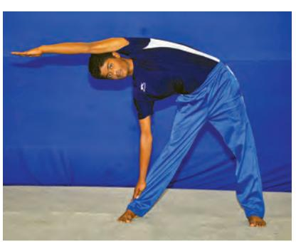

*Fig. 8.3: Trikonasana*

140

Chap-8_New.indd 140 8/24/2020 11:42:35 AM

Let us perform *Trikonasana* by following the steps given below.

- 1. Stand erect with legs together, hands by the side of the thighs.
- 2. Move your legs 2-3 feet apart.
- 3. Raise the arms sideways and bring them to shoulder level, parallel to the floor, so that they are in one straight line.
- 4. Turn the right foot to the right side at 90o angle.
- 5. Bend from the waist to the right side, taking care not to bend the body forward.
- 6. Place the right hand on the right foot. If possible, the right palm can rest on the floor also. Keep the two arms in line with each other.
- 7. Lower the left arm over the ear until it is parallel to the floor with palm facing down. Now look up at the left hand.
- 8. Maintain this position with normal breathing comfortably for 5–10 seconds.
- 9. To come back, lift the right palm. Raising the trunk bring the arms sideways in line with the shoulders. Bring down your arms and keep the hands by the sides of thighs. Bring your feet together and relax.
- 10. Repeat the *asana* from other side.

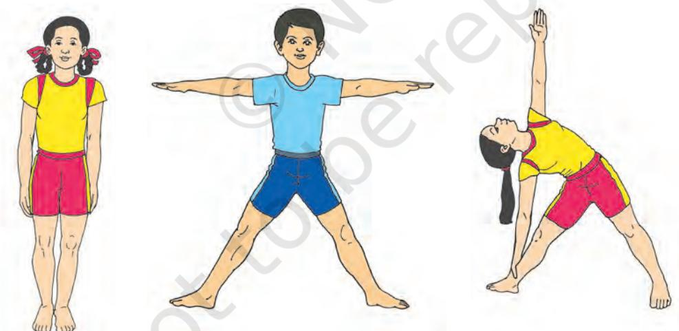

*Fig. 8.4: (a) Hastotanasana, (b) Trikonasana pose 1 and (c) Trikonasana pose 2*

#### **Remember the following points**

|  | Dos | Don'ts |
| --- | --- | --- |
| • | In final position, the back of the legs, the back of | • Do not bend the knees while bending |
|  | the chest and the back of the hips should be in | sideward. |
|  | a line. | • Do not lean forward or backward while |
| • | Maintain the final posture with normal breathing. | performing this asana. |

141

Chap-8_New.indd 141 8/24/2020 11:42:35 AM

# **Benefits**

- **•** It tones up the muscles in trunk, legs and hips.
- **•** It improves the flexibility of spine.
- **•** It invigorates the abdominal organs.
- **•** It is effective for increasing the height of growing children.
- **•** It relieves the pain in the neck and back.
- **•** It is beneficial for the person suffering from sciatica.

### **Limitation**

- **•** Practice of this *asana* should be avoided in case of backache and abdominal inflammation.
# *Shashankasana*

This *asana* is made of two words: *Shashanka* and *asana*. *Shashanka* in Sanskrit means hare. In the final position of this *asana*, the body resembles the shape of a hare, hence, it is called *Shashankasana*. This *asana* helps to regulate the functioning of the organs of the endocrine system especially the adrenal glands

and the pancreas located in the abdominal and pelvic regions of the body. These glands produce hormones and play a vital role in energy allocation.

Let us perform Shashankasana by following the steps given below.

- 1. Sit in *Vajrasana*.
- 2. Inhaling, raise both arms over the head.
- 3. Exhaling, bend forward from the waist keeping the head and arms straight in line with the trunk.
- 4. Place the forehead and arms on the ground. Close the eyes.
- 5. Stay in this position for 5-10 seconds or as long as you feel comfortable.
- 6. To come back, raise your arms and trunk; and slowly come in the *Vajrasana pose*.

#### **Remember the following points**

|  | Dos | Don'ts |
| --- | --- | --- |
| • | Bend from the waist only. | • Do not bend the arms while bending |
| • | In the final position, the forehead should | down. |
|  | be placed between the arms. |  |

#### **Benefits**

- **•** It relaxes the body and helps in reducing the stress.
- **•** It improves the functioning of liver, kidneys and other visceral organs.

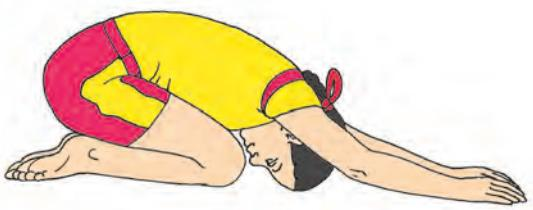

*Fig. 8.5: Shashankasana*

*Fig. 8.6: Vajrasana*

Chap-8_New.indd 142 8/24/2020 11:42:36 AM

142

- **•** It tones up reproductive organs.
- **•** It is effective in the management of diabetes mellitus and sciatica.

- **•** Persons suffering from backache and cervical spondylitis should avoid this *asana*.
# *Ushtrasana*

In Sanskrit, *Ushtra* means 'camel'. In the final position of this *asana*, the body resembles a camel. Hence, this is called *Ushtrasana*. This *asana* should be practised before *shashankasana* and *paschimottan asana.*

Let us perform *Ushtrasana* by following the steps given below

- 1. Sit in *Vajrasana.*
- 2. Stand on the knees with toes pointing backward and resting on the floor.
- 3. Inhaling, bend backward giving the spine a backward bend.
- 4. Place the palms on the respective heels or soles.
- 5. Keep the head tilted backwards.
- 6. Maintain the posture comfortably for 5 -10 seconds.
- 7. To come back, release the hands one by one, bring the head, neck and chest back to the normal position and slowly come to the Vajrasana.

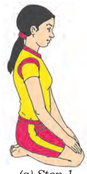

*Fig. 8.8: Ushtrasana Steps (a) Step 1 (b) Step 2 (c) Step 3*

# **Remember the following points**

|  | Dos | Don'ts |
| --- | --- | --- |
| • | Place palms on soles or heels carefully and keep | • Do not jerk the neck while assuming |
|  | the arms straight. | and releasing the posture. |
| • | Contract the buttock and stretch the dorsal region | • Do not bend the spine forcefully beyond |
|  | of back when bending backwards. | the capacity. |
| • | In the final position, thighs should be perpendicular |  |
|  | to the floor; and head should be tilted backwards. |  |
| • | Weight of the body should be supported by legs |  |
|  | and arms. |  |

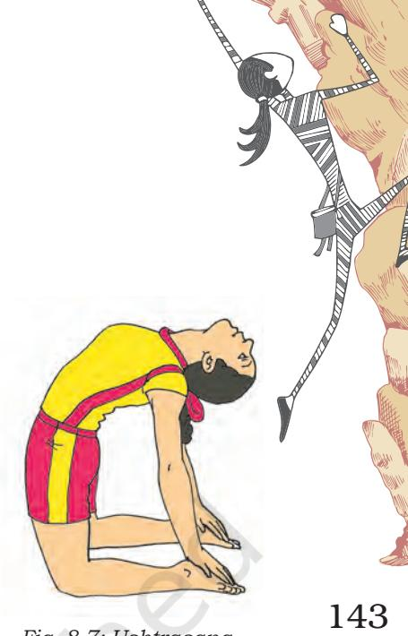

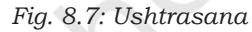

Chap-8_New.indd 143 8/24/2020 11:42:37 AM

# **Benefits**

- **•** It is beneficial for people with drooping shoulders and hunched back.
- **•** It helps to regulate the functions of the endocrine system especially the thyroid glands.
- **•** It helps to tone the entire digestive system as well as excretory system.
- **•** It makes the spine flexible; loosens up the vertebra and stimulate spinal nerves.

# **Limitation**

- **•** Avoid practising this *asana* in hernia, abdominal complaints, severe arthritis and vertigo.
# *Ardhamatsyendrasana*

*Ardhamatsyendrasana* is a milder version of the *Matsyendrasana* which is named after Yogi Matsyendranath. *Ardha* means 'half'. The original *Matsyendrasana* is difficult to practise, hence its easier version called *Ardhamatsyendrasana* is generally practised. In *Ardhamatsyendrasana*, the spine is given the maximum lateral twist.

Let us perform Ardhamatsyendrasana by following the steps given below.

- 1. Sit on the ground with legs extended in front.
- 2. Bend the knee of the left leg, place left foot close to the right buttock, heel touching the side of the hip and the left knee touching the ground.
- 3. Bend the right knee; and place the right foot flat on the ground near the outer side of the left knee. Toes of the right foot should face forward.
- 4. Place left arm over right knee in such a way that it covers the outer side of the right knee. Hold the right foot or ankle with left hand. The right knee should be close to the left armpit.
- 5. Bend the right arm from the elbow and take it behind and encircle the waist as much as possible as if trying to touch the navel.
- 6. Turn the head towards the right side. Try to look behind over the shoulder.
- 7. Stay in this position for 5-10 seconds.
- 8. To come back, bring your head to the centre. Bring the right arm in the front. Similarly, bring the left arm, right leg and left leg to the starting position. Repeat it for the other side.

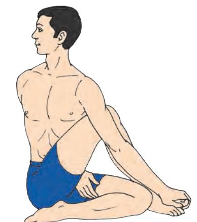

*Fig. 8.9: Ardhamatsyendrasana*

144

Chap-8_New.indd 144 8/24/2020 11:42:37 AM

# **Remember the following points**

|  | Dos |  | Don'ts |
| --- | --- | --- | --- |
| • | Twist the spine with support of the arm. | • | Do not give jerk to the spine. |
| • | Toes of the foot kept near the outside of | • | Do not strain the back. |
|  | knee should be facing forward. |  |  |
| • | The outside edge of the foot which is |  |  |
|  | kept near the buttock should touch the |  |  |
|  | floor. |  |  |
| • | Sit as straight as possible. |  |  |
| • | While twisting the spine, simultaneously |  |  |
|  | move the arm, trunk and head. |  |  |

#### **Benefits**

- **•** It stimulates liver, spleen and pancreas and helps to regulate their functioning.
- **•** It benefits intestines also.
- **•** It enhances movements of the shoulders.
- **•** It rejuvenates the nerves around the navel.
- **•** It is useful for persons suffering from diabetes mellitus and lower back pain.
- **•** It strengthens the spinal column and the muscles of the back.

### **Limitation**

- **•** People suffering from peptic ulcer, hernia and severe arthritis should avoid this practice. People with sciatica or slipped disk should be cautious and seek expert advice.
# *Bhujangasana*

*Bhujangasana* or Cobra Pose is very helpful in stress management. In *Bhujangasana* the organs of endocrine system especially the adrenal glands and pancreas are activated and strengthened.

Let us perform *Bhujangasana* by following the steps given below.

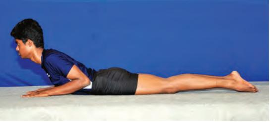

*Fig. 8.10: Bhujangasana*

- 1. Lie prone on the ground with forehead touching the floor; legs together, hands by the side of thighs.
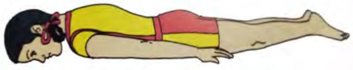

*Fig. 8.11: Bhujangasana*

145

Chap-8_New.indd 145 8/24/2020 11:42:38 AM

- 2. Fold the hands at elbows and place the palms by the side of the shoulders, thumbs under armpits, with tip of the fingers not crossing the shoulder line.
- 3. Inhaling, slowly raise the head, neck and shoulders. Shoulders should be shrugged backwards.
- 4. Raise the trunk up to the navel region. Raise the chin as high as possible.
- 5. Eyes should be kept gazing upward.
- 6. Maintain the position for 5-10 seconds or as long as comfortable.
- 7. To come back, bring down the upper part of navel region, chest, shoulders, chin and head.
- 8. Place the forehead on the ground and arms along the body, hands by sides of the thighs. Relax.

#### **Remember the following points**

|  | Dos |  |  | Don'ts |
| --- | --- | --- | --- | --- |
| • | Put minimum weight on hands. |  | • | Do not give jerk to lift the body. |
| • | Distribute weight on the back. |  | • | Do not allow the elbows to spread out. |
| • | The trunk should be raised up to the |  | • | Do not raise the region beyond the navel region. |
|  | navel only. |  |  |  |
| • | While raising, should | shoulders | be |  |
|  | shrugged backwards. |  |  |  |

#### **Benefits**

- **•** It affects the spinal column and makes it flexible.
- **•** It solves digestive complaints.
- **•** It increase intra-abdominal pressure benefitting the internal organs especially the liver and kidneys.
- **•** It relaxes both body and mind.

#### **Limitation**

- **•** Those suffering from hernia, peptic ulcer, intestinal tuberculosis and acute abdominal pain should avoid this practice.
# *Makarasana*

The Posture is called *Makarasana* as the body resembles the shape of *Makara*, which in Sanskrit means 'crocodile'. *Makarasana* is a relaxing *asana* to body and mind and is very beneficial for reducing stress.

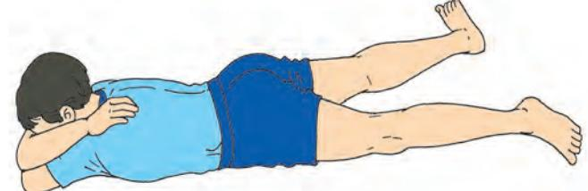

*Fig. 8.12: Makarasana*

146

2024-25

Chap-8_New.indd 146 8/24/2020 11:42:38 AM

Let us perform *Makarasana* by following the steps given below.

- 1. Lie down on your stomach.
- 2. Keep the legs at a comfortable distance with heels inside and toes pointing outward.
- 3. Fold your arms and elbows, and keep them under the head.
- 4. Place the head on the cushion of the arms, close your eyes and relax.
- 5. To come back, bring the arms alongside the body and both the legs together.

# **Remember the following points**

|  | Dos | Don'ts |  |
| --- | --- | --- | --- |
| • | Both elbows can be kept slightly apart if | • Do not press the chest hard on the ground so |  |
|  | found difficult to put one above the other. | that the breathing becomes uncomfortable. |  |
| • | Do a deeper abdominal breathing. | • Do not bring the feet together. | 147 |

# **Benefits**

- **•** Traditionally it is a relaxing posture.
- **•** It is beneficial in almost all psychosomatic disorders.
- **•** It is beneficial for respiratory organs, as well as digestive organs.

# **Limitation**

- **•** Those having complaint of obesity and cardiac problems should avoid this practice.
# *Sarvangasana*

*Sarvangasana* (shoulder stand posture) strengthens the entire body. It regulates the functioning of thyroid glands. It increases the supply of blood to the brain and strengthens the central nervous system enabling the person to fight the problems induced by stress.

Let us perform *Sarvangasana* by following the steps given below.

- 1. Lie on the back with the hands along the thighs, palms resting on the ground.
- 2. Pushing down on hands slowly raise both the legs up to 30°. Hold the position for a few seconds.
- 3. Slowly raise the legs further up to 60° and maintain the position for a few seconds.
- 4. Raise the legs further up to 90° and maintain the position for a few seconds.
- 5. Bend the arms at the elbow and place the hands at the hips. Now, cupping the buttocks with hands raise the buttocks. Raise legs, abdomen and chest up vertically

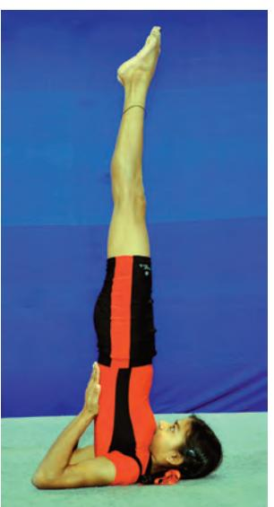

*Fig. 8.13: Sarvangasana*

Living

Chap-8_New.indd 147 8/24/2020 11:42:39 AM

in a straight line with the trunk. Place the plams on your back to support the back.

- 6. Push the chest forward so that it presses firmly against the chin. Keep the elbows close to each other.
- 7. Maintain the position comfortably for 5-10 seconds.
- 8. To come back, lower the spine very slowly along the floor. Lower the buttocks with hands supporting the back and bring the buttocks on the ground. Bring the legs up to 90° and stop there. place the hands firmly on the ground close to the body. Lower the legs still up to 60° and 30° and then slowly on the ground and relax.

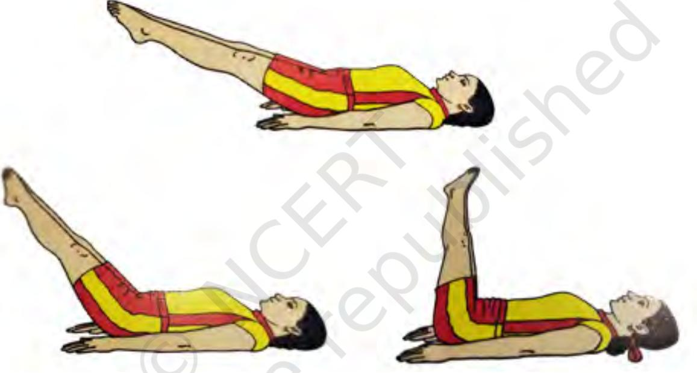

*Fig. 8.14: Sarvangasana*

#### **Remember the following points**

|  | Dos |  | Don'ts |
| --- | --- | --- | --- |
| • | Movements of the legs should be very | • | Avoid bending the legs. |
|  | slow, stopping at different angles. | • | Avoid jerky action in assuming the final |
| • | In the final position, keep the legs |  | position or returning from it. |
|  | vertical in a straight line with the |  |  |
|  | trunk. |  |  |
| • | Support the back with your hands. |  |  |

#### **Benefits**

- **•** It regulates the thyroid function.
- **•** It helps in increasing the circulation of blood to the brain.
- **•** It strengthens the neck region.
- **•** It helps in managing problems related to endocrine glands.

148

Chap-8_New.indd 148 8/24/2020 11:42:39 AM

- **•** Those suffering from high blood pressure, epilepsy, pain in neck and lumber region, excessive obesity and cardio-vascular complaint should not practise it.
# *Matsyasana*

*Matsyasana* (fish posture) is effective in reducing stress. In *Matsyasana,* one has a feeling of floating on water like a fish which is soothing to the body and mind both.

Let us perform Matsyasana by following the steps given below.

- 1. Sit in *Padmasana*.
- 2. Lie on the back with support of the elbows.
- 3. Lift the neck and chest slightly up; the back should be arched and raised from the ground.
- 4. Bend the head backward and place the crown of the head on floor.
- 5. Make hooks with the index fingers of both hands; and clasp the big toes with hooks of opposite hands.

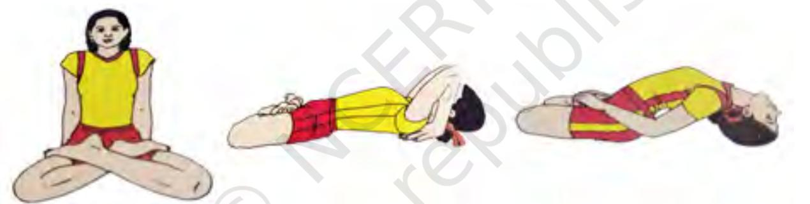

*Fig. 8.15: Matsyasana* 

- 6. Maintain the position for 10-15 seconds or as long as comfortable.
- 7. To come back, release the toes; place hands on the ground; raise head up with the support of hands. Sit with the help of the elbows.

# **Remember the following points**

|  | Dos | Don'ts |
| --- | --- | --- |
| • | Try to make the maximum arch of the spine. • | Do not allow the knees to come up from the |
| • | Keep the arms bent at the elbows. | ground while arching the back. |
| • | • The crown of head must touch the floor. | While leaning backward, do not strain. |
| • | The knees must touch the ground. |  |

Chap-8_New.indd 149 8/24/2020 11:42:39 AM

2024-25

#### **Benefits**

- **•** It improves blood supply to the brain.
- **•** It regulates the functioning of thyroid gland and improves immunity system.

149

- **•** It alleviates backache and cervical spondylitis.
- **•** It diverts the blood from the legs to the pelvic region and helps to increase the tone of the abdominal muscles.
- **•** It is beneficial in lung and respiratory disorders.

- **•** Avoid practising this asana in case of vertigo, cardiovascular disease, hernia, arthritis, knee and ankle and spinal problems.
#### *Shavasana*

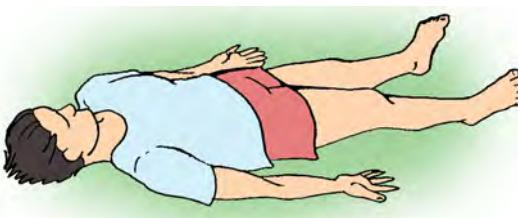

*Shavasana* (corpse posture) is a relaxing practice. This *asana* is very effective for de-stressing the body and mind which remain in a state of rest. This helps in the repair of tissues and cells, and thereby rejuvenates the body. It helps to reduce blood pressure, anxiety and insomnia and gives relief to the tired body and mind.

*Fig. 8.16: Shavasana*

Let us perform *Shavasana* by following the steps given below.

- 1. Lie flat in supine position.
- 2. Keep the legs straight with feet 8-12 inches apart. Keep the heels inside and the toes outside.
- 3. Keep the palms facing upward slightly away from the body with fingers in a semi-flexed position.
- 4. Take a deep breath and simultaneously close the eyes. Feel complete relaxation and try to relax all parts of your body.
- 5. Breath normally and concentrate on the flow of breath.
- 6. To come back, open your eyes and come to the starting position.

#### **Remember the following points**

|  | Dos |  |  |  | Don'ts |
| --- | --- | --- | --- | --- | --- |
| • | Withdraw | attention | from | external | • Do not tense the muscles of body. |
|  | surroundings. |  |  |  | • Try not to sleep. |
| • | All parts of the body should be relaxed. |  |  |  |  |
| • | Try to be | aware | of the | internal |  |
|  | happenings. |  |  |  |  |

#### **Benefits**

- **•** It removes stress and tension.
- **•** It is useful to reduce high blood pressure.
- **•** It relaxes the body and mind.

150

Chap-8_New.indd 150 8/24/2020 11:42:39 AM

- **•** It removes fatigue from the body.
- **•** It is beneficial in the case of insomnia as it helps to induce sleep.

- **•** Do not practise if suffering from low blood pressure.
# *Kriyas*

# *Kapalabhati*

*Kapalabhati* is a kriya (cleansing procedure). It helps to revitalise the nervous system which becomes exhausted due to stress. It invigorates the person and helps in fighting negative effects of stress.

Let us perform Kapalabhati by following the steps given below.

- 1. Sit straight in any meditative pose like *Padmasana*  or *Vajrasana*.
- 2. Take deep breath through the nostrils.
- 3. Exhale forcefully in such a way that the lower abdomen is contracted to expel out the air. Inhale spontaneously and passively without making any efforts. Do not make effort to inhale. Air will enter the body through the passive inhalation. This is one stroke of *Kapalabhati*. Begin with 20 strokes at a time. This is one round. One can paractise one to three rounds in a pactical session. Gradually increase the strokes in one round.

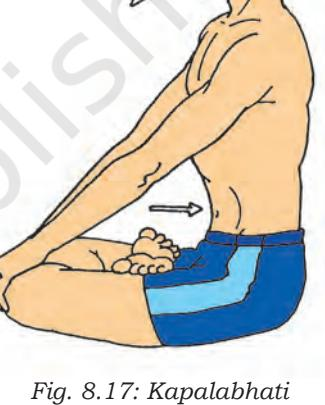

# **Remember the following points**

|  | Dos | Don'ts |
| --- | --- | --- |
| • | Inhalation should be passive and short, | • Do not move the chest or shoulders during |
|  | while exhalation should be forceful. | exhalation. |
| • | Kapalabhati should be practised after | • Do not contract or distort the face. |
|  | asana but before meditation. |  |

Chap-8_New.indd 151 8/24/2020 11:42:40 AM

2024-25

### **Benefits**

- **•** It stimulates the nerves in the abdominal region, tones up the abdominal muscles and improves digestion.
- **•** *Kapalabhati* expels more carbon-dioxide and other waste gases from the lungs than the normal breathing.
- **•** It improves heart and lungs capacity and therefore good for bronchial asthma.
- **•** It improves blood circulation throughout the body.
- **•** It energises the body and removes lethargy.

151

- **•** Those suffering from cardio-vascular problems, high blood pressure, hernia, vertigo and gastric ulcer complaints, should avoid practising *Kapalabhati*.
# *Pranayama*

# *Anuloma-viloma pranayama*

*Anuloma-viloma pranayama* (Alternate Nostril Breathing) relaxes the body and mind. This pranayama nourishes the body with oxygen, purifies the blood and improves efficiency of the brain. It lowers stress by developing harmony in various systems of the body.

For managing the stress, *anuloma-viloma pranayama* should be practised daily.

Let us perform *anuloma-viloma* by following the steps given below.

- 1. Sit in the position of *Pasmasana* or in any other comfortable meditative posture.
- 2. Keep the body erect and place the hands on the respective knees.
- 3. Raise the right hand and place the right thumb on the right nostril and close it.
- 4. Inhale slowly through the left nostril.
- 5. Close the left nostril by the ring finger and the little finger and exhale slowly through the right nostril.
- 6. Again inhale through the right nostril.
- 7. Close the right nostril with thumb and exhale through the left nostril. This is one round of *Anuloma-viloma*.
- 8. Repeat it 10 times.

# **Remember the following points**

| Health |  | Dos | Don'ts |
| --- | --- | --- | --- |
|  | • | Inhale the air slowly without bulging the | • Avoid producing sound from the nose. |
|  |  | abdomen. | • Do not press hard on the nostrils. |
| 152 | • | Keep the ratio of 1:1 or 1:2 between and | • Avoid retaining breath (kumbbhaka) in the |
|  |  | the exhalation. | beginning. |

#### **Benefits**

- **•** It calms down the mind and improves concentration.
- **•** It improves functioning of all cells of the body by providing them sufficient oxygenated blood.
- **•** It purifies the blood.
- **•** It improves blood supply to brain.
- **•** It helps to regulate blood pressure.
- **•** It helps in managing stress by reducing anxiety.

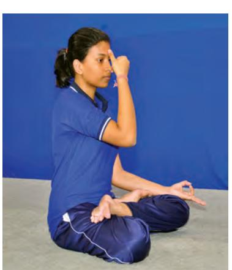

*Fig. 8.18: Anuloma-viloma*

and P

hysical

Education -

Class X

Chap-8_New.indd 152 8/24/2020 11:42:40 AM

- **•** It is beneficial in many diseases, such as, asthma, high or low blood pressure, insomnia, chronic pain, endocrine imbalances, heart problems, hyperactivity, etc.
- **•** In the beginning, retention of breath should be avoided.
# *Bhastrika Pranayama*

*Bhastirka pranayama* is a yogic breathing practice in which quick and deep inhalation and exhalation are done to strengthen the functioning of lungs. This *pranayama*  increases the supply of oxygenated blood to the whole body. It strengthens all the systems of body and provides more energy which is required to fight the effects of stress.

Let us perform Bhastrika Pranayama by following the steps given below.

- 1. Sit in *Padmasana*, *Ardhapadmasana* or in any other meditative posture. Keep the body erect.
- 2. Slowly inhale through the nostrils.
- 3. Then exhale quickly and forcefully through the nostrils.
- 4. Immediately inhale with force.
- 5. Continue this forceful rapid exhalation and inhalation counting up to ten breaths.
- 6. At the end of the tenth breath, the final exhalation is followed by a deep inhalation and slow exhalation. This is one round of *Bhastrika Pranayama*.
- 7. Take a few normal breaths after this round before starting another round.
- 8. Complete three rounds of *Bhastrika Pranayama*.

#### **Remember the following points**

|  | Dos |  | Don'ts |
| --- | --- | --- | --- |
| • | Sit straight and open the chest for proper | • | Do not go beyond the capacity. |
|  | strokes. | • | Chest and shoulders should not move. |
| • | Lungs, diaphragm and stomach should | • | Do not practice it in extremely hot conditions. |
|  | move with each inhalation and exhalation. |  |  |
| • | Bhastrika pranayama should be performed |  |  |
|  | after asana and nadishodhana pranayama. |  |  |

#### **Benefits**

- **•** It increases the gastric fire and improves appetite.
- **•** It destroys phlegm.
- **•** It is beneficial in case of asthma.

Yoga

153

for Healthy

Living

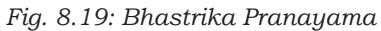

Chap-8_New.indd 153 8/24/2020 11:42:41 AM

- **•** *Bhastrika pranayama* should not be practised during ear infection. A person suffering from heart problems, high blood pressure, vertigo, stomach ulcers should not practise this *pranayama*.
# *Bhramari Pranayama*

The word *Bhramari is* derived from *bhramara* which means a 'black humming bee'. In this *pranayama*, the practitioner makes the sound which resembles the buzzing sound of a black bee, therefore it is named as *Bhramari Pranayama. It*  is a relaxing *pranayama.* It soothes the mind and, therefore, good for stress management.

Let us perform *Bhramari Pranayama* by following the steps given below.

- 1. Sit in the position of *Padmasana* or *Siddhasana* or any comfortable sitting position. Close the eyes.
- 2. Inhale deeply through the nose.
- 3. Close both the ears with thumbs, put the fingers on forehead and eyes and exhale while making soft sound of a humming bee.
- 4. Concentrate on the sound keeping it low pitched.
- 5. After exhalation, bring your hands back on your knees and breathe in slowly. This is one round.
- 6. Practise five to ten rounds in similar way.

# **Remember the following points**

|  | Dos | Don'ts |
| --- | --- | --- |
| • | While exhaling, make a soft sound like a | • Do not make the sound at a high pitch. |
|  | humming bee. |  |
| • | Focus on the sound and enjoy it. |  |
| • | Practise it after asanas and anuloma-viloma, |  |
|  | but before meditation or sleep. |  |

#### **Benefits**

- **•** The sound resonating in the brain is very soothing and removes tension and anxiety.
- **•** It is very useful to reduce high blood pressure.
- **•** It energises the mind and refuels it with new energy.
- **•** It pacifies the mind and helps reduce anger, anxiety and insomnia.
- **•** It helps in enhancing the concentration.
- **•** It improves memory.
- **•** It alleviates throat ailments.

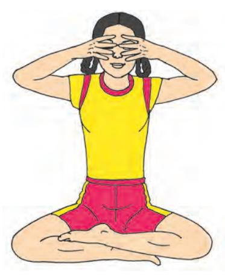

*Fig. 8.20: Bhramari Pranayama*

154

Chap-8_New.indd 154 8/24/2020 11:42:41 AM

- **•** During an ear infection, this *pranayama* should not be practised.
- **•** People suffering from cardiac diseases should also avoid the practice.

# *Sheetali Pranayama*

*Sheetali* means 'cooling'. *Sheetali pranayama* cools the body and mind, hence the name is *sheetali pranayama*.

Let us perform sheetali pranayama by following the steps given below.

- 1. Sit in *Padmasana* or any other meditative posture.
- 2. Keep the hands in *jnana mudra*.
- 3. Open the mouth. Extend the tongue and bring it outside the mouth as far as possible.
- 4. Roll the tongue from the sides to make it like a tube. The sides of the tongue should be curled up.
- 5. Inhaling draw the air from the curled tongue and fill the lungs with air to the maximum.
- 6. Draw the tongue inside and close the mouth.
- 7. Exhale through the nose.

This is one round of *sheetali pranayama*. Practise it 3-5 times.

 **Remember the following points**

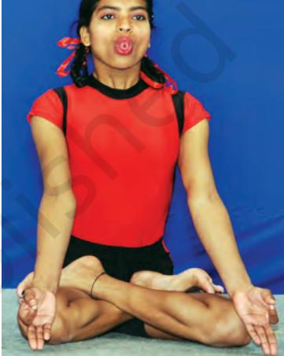

Yoga

155

for Healthy

Living

*Fig. 8.21: Sheetali*

|  | Dos |  | Don'ts |
| --- | --- | --- | --- |
| • | Focus on the tongue and the | • | Do not practise it during cold weather. |
|  | cooling sensation of the breath. | • | Do not practice it in polluted environment because |
|  |  |  | inhaling through the mouth does not have filtering |
|  |  | process. |  |

#### **Benefits**

- **•** It cools the body and tranquilises the mind.
- **•** It quenches thirst and improves digestion.
- **•** It enhances endurance to the deprivation of water.
- **•** It is beneficial in the case of high blood pressure and also in low fever.
- **•** It is beneficial for skin and eyes also.

#### **Limitation**

- **•** Persons suffering from low blood pressure, asthma, bronchitis and constipation should avoid practising this *asana*. It should not be practised in cold climate.
Chap-8_New.indd 155 8/24/2020 11:42:41 AM

### *Yoganidra*

*Yoganidra* means 'sleep' with awareness. *Yoganidra* is a state of mind between wakefulness and dream. Normally, we sleep without awareness. But in *yoganidra* we sleep with awareness. *Yoganidra* is helpful in management of stress. It relaxes body and mind and reduces tension.

*Yoganidra* is practised in *Shavasana*. It consists of body and breath awareness. The awareness is rotated in quick succession through all parts of the body, then it is taken to the breath and finally to the mind.

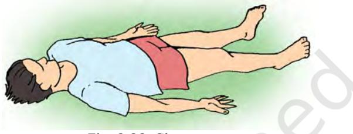

*Fig. 8.22: Shavasana*

Let us practise Yoganidra by following the steps given below. Lie supine in *Shavasana*. Take deep breath and feel completely relaxed.

#### *Phase 1: Awareness of the body*

Rotate your awareness to different parts of the body as per the instructions give below:

- **•** Relax the first (big), second, third, fourth, fifth toe of the right foot, sole, heel, ankles, calf muscles, knee, thigh and right hip. Similarly relax the first (big), second, third, fourth, fifth toe of the left foot, sole, heel, ankles, calf muscles, knee, thigh and left hip.
- **•** Now relax the thumb of the right hand, first, second or middle, third, fourth (little) fingers of right hand, palm, back of the hand, wrist, forearm, elbow, upper arm and right shoulder. Now relax the thumb of left hand, first, second or middle, third, fourth (little) fingers of left hand, palm, back of the hand, wrist, forearm, elbow, upper arm and left shoulder.
- **•** Now be aware of the back and relax it. Relax the right and left buttocks, middle part of right back, middle part of left back, right shoulder blade, left shoulder blade, the spine and the whole back together.
- **•** Now focus your attention to the front part of your body. Relaxs area above the chest, right and left side of the chest, navel, right and left side of abdomen, upper parts of right and left leg.

156

Chap-8_New.indd 156 8/24/2020 11:42:41 AM

- **•** Now relax the left, right, front and back of your neck, throat, chin, lower and upper lip, tip of the nose, the right cheek and left cheek, the right and left ear, the right and left eye, the right and left eyelid, the right and left eyebrow, the space between eyebrows, the forehead, the right, left back, and top of the head.
- **•** Now relax whole body.

### *Phase 2: Awareness of the breath*

- **•** Now focus your attention on breath. Feel the flow of your natural breath. Do not change it. Feel the movement of nostrils with each breath. Now focus your attention on the movements of the abdominal area during breathing. Abdomen falls and rises with each exhalation and inhalation. Continue focussing your attention on breathing and the movement of the abdomen.
#### *Phase 3: Coming back*

- **•** To come back, become aware of your body and be aware of the time and place you are in. Move your fingers and toes; and move the head from one side to the other. Take your own time. Be wide awake. Slowly sit up and open your eyes.
*Note: After breath awareness a scene may be described and the practitioner is asked to visualise it in that state. Alternately, different things like floating in a swimming pool, sitting in a garden, burning a candle, chirping birds, mountains, flowers, rising sun, a song, etc., can be suggested and the practitioner is asked to develop vision on thinking, feeling and at an emotional level. After this, a resolution also can be made. For making a resolution, before the stage of body awareness, they are asked to think about what they want to pursue. Now the resolution is repeated three times. After this, the person is asked to come back by following the steps as mentioned in the 'come back' phase.*

### **Remember the following points**

|  | Dos | Dont's |
| --- | --- | --- |
| • | Relax all parts of body one by one. | • Do not tense the muscles of body. |
| • | Focus on the part of body which is being named. | • Do not sleep. |
| • | Follow the instructions properly. |  |

#### **Benefits**

- **•** It reduces anxiety and tension.
- **•** It activates parasympathetic system and thereby helps in management of stress related problems.

Yoga for Healthy Living

157

Chap-8_New.indd 157 8/24/2020 11:42:42 AM

- **•** It reduces bodily tension and relaxes whole body.
- **•** It helps to reduce blood pressure.

- **•** In case of depression this practice should be avoided.
# **Meditation**

Meditation is an important yogic practice which is commonly used for relaxation and stress management. Meditation provides rest and peace of mind. During meditation, all kinds of thoughts which are causing stress are eliminated. This results into an enhanced state of physical and emotional wellbeing. After meditation, the person feels fresh and develops a new perspective on stressful situations. Meditation helps to reduce negative emotions and increases self-awareness.

# **Yoga for Healthy Living**

In this section, some advanced *asanas* are given which you can learn at this stage. These are balancing *asanas* and more difficult as compared to the previously learnt *asanas*. These *asanas* will also help you remain healthy.

# *Shirshasana*

*Shirsha,* a Sanskrit word means 'head'. In this posture one stands on one's head, hence it is called *Shirshasana* (Head Stand Posture).

Let us perform *Shrishasana* by following the steps given below.

- 1. Put a folded cloth or blanket on the floor. Kneel on the ground, with the buttocks resting on the heels.
- 2. Inter-lock the fingers and form a finger-lock.
- 3. Place hands on ground making an angle of 60º between the elbows.

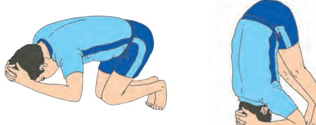

*Fig. 8.25: Steps of Shrishasana*

- 4. Place the centre of the head on the ground supported by the finger-lock.
- 5. Lifting the knees and the buttocks straighten the legs.
- 6. Bend the legs at the knees and bring the knees closer to the chest.

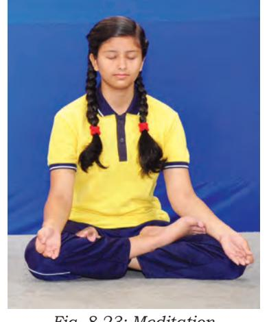

*Fig. 8.23: Meditation*

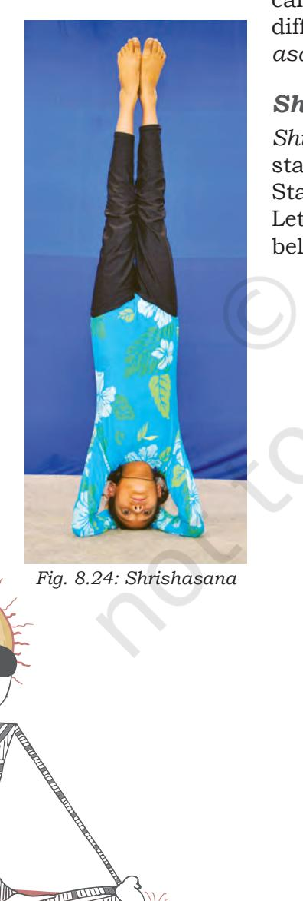

158

Chap-8_New.indd 158 8/24/2020 11:42:43 AM

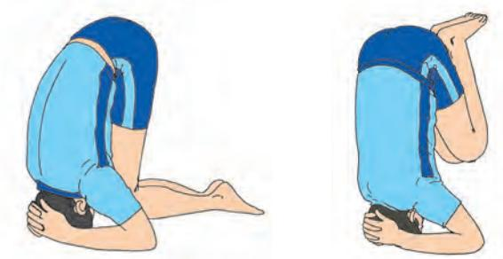

*Fig. 8.26: Shrishasana*

- 7. Resting on the elbows and contracting abdominal muscles raise the feet off the ground one by one.
- 8. Keeping the legs folded in the knees, straighten the thighs.
- 9. Unfold the legs and bring them vertically in line with the body and maintain the posture for 5-10 seconds.
- 10. To come back, reverse the order. Fold the legs at the knees.
- 11. Bring the knees closer to the chest and down to the ground. Take the feet away from the body. Place the knees on the ground. Raise the head and the fingerlock from the ground. Open the finger-lock and come to the starting position.

# **Remember the following points**

|  | Dos | Dont's |
| --- | --- | --- |
| • | All the movements should be very slow. • | Avoid giving any jerk or push to the body |
| • | Proceed from one stage to another after | to make the balance. |
|  | having mastered the former stage. • | Avoid spreading and shifting the elbows |
| • | Keep the elbows firmly on the ground so | while doing the asana |
|  | that the balance is not lost. • | Avoid any bend in the waist. |
| • | Normal breathing should continue. |  |

# **Benefits**

- **•** It improves blood circulation, particularly of venous blood.
- **•** It helps in the proper functioning of the abdominal organs and endocrine glands.
- **•** It increases the supply of blood to the brain and strengthens the central nervous system.

#### **Limitation**

- **•** Avoid performing this posture in case of problems of ears, weak eye, high blood pressure, heart trouble, etc.
# *Bakasana*

*Baka*, a Sanskrit word, means 'crane'. The final posture in the *asana* imitates a crane, hence, it is called *Bakasana*  (Crane Posture).

Yoga for Healthy Living

159

Chap-8_New.indd 159 8/24/2020 11:42:43 AM

Let us perform *Bakasana* by following the steps given below:

- 1. Squat on the floor.
- 2. Place the hands flat on the floor in front of the feet, with the fingers pointing forward. Keep the elbows slightly bent.
- 3. Pressing the arms, raise the feet with bent knees above the ground. Leaning forward, adjust the knees so that they touch the upper arms near the armpits.
- 4. Hold the body above the ground while keeping the hands on ground. Maintain the position for 5–10 seconds.
- 5. To come back, slowly lower the feet to the floor and come to the squatting position.

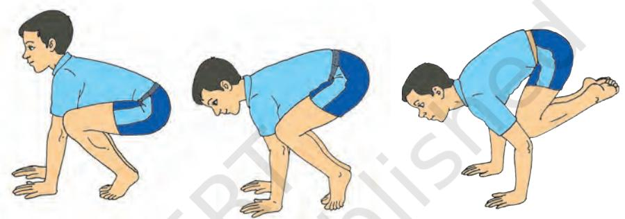

*Fig. 8.27: Bakasana*

#### **Remember the following points**

|  | Dos | Don'ts |
| --- | --- | --- |
| • | Spread the fingers. | • Avoid exerting pressure on the elbow with |
| • | Keep the chest forward and look in front in | the raised foot-lock. |
|  | the final position. | • Do not make haste in balancing the body. |
| • | Contract the abdominal muscles while lifting |  |
|  | the body. |  |
| • | Support weight of the body on hands. |  |

#### **Benefits**

- **•** It increases the strength of the arms and shoulders.
- **•** It increases a sense of balance.
- **•** It tones the abdominal muscles.
- **•** It provides an adequate supply of blood to hand, shoulders and chest.

#### **Limitation**

- **•** A person with high blood pressure, heart disease or cerebral thrombosis should not practise this *asana*.
# *Hamsasana*

*Hamsa*, a Sanskrit word, means 'swan'. In final posture of this *asana,* the body resembles a swan, hence, it is called *Hamsasana (swan posture)*.

160

Chap-8_New.indd 160 8/24/2020 11:42:44 AM

It is a preparatory pose for *Mayurasana*. The only difference is that in *Mayurasana* legs are raised; while in *Hamsasana* feet are kept on the ground and the body is kept little bent and balanced on the elbows.

Let us perform *Hamsasana* by following the steps given below.

- 1. Take the kneeling position.
- 2. Keep a little distance between the knees, keeping the heels together.
- 3. Place the hands in front between the knees on the ground, fingers pointing towards the feet.
- 4. Place the elbows on the naval region.
- 5. Extend the legs. Raise the trunk up, keeping the feet together. Place the tip of toes on the ground. Rest the whole body on the elbows pressing the abdomen. Maintain this position for 5-10 seconds.
- 6. To come back, bend the legs and bring them closer keeping the knees on the ground. Remove the elbow from the abdomen. Bring the hands to the sides of the body and the knees closer and come to the starting position.

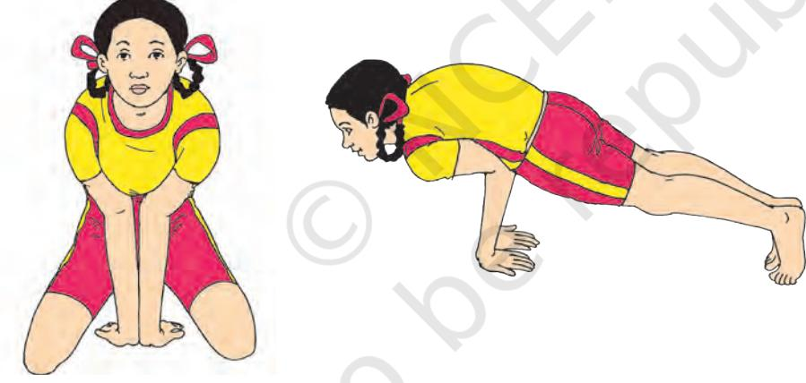

#### *Fig. 8.28: Mayurasana*

#### **Remember the following points**

|  | Dos | Dont's |
| --- | --- | --- |
| • | Keep the legs straight. | Avoid keeping more distance • |
| • | Keep the elbows together. | between the bent elbows kept on the |
| • | Keep the fingers spread out. | abdomen. |
|  |  | • Do not jerk the body. |
| • | Tense the muscles of the body when raising the trunk. |  |

#### **Benefits**

- **•** It gives exercise to the arms.
- **•** Pressure exerted on the abdomen in this *asana* improves functioning of the kidneys and liver.

Yoga for Healthy Living

161

Chap-8_New.indd 161 8/24/2020 11:42:45 AM

- **•** It increases appetite.
- **•** It helps to develop control on muscles and balance in body.
- **•** It massages the digestive organs and alleviates problems of constipation and dysentery.

- **•** A person suffering from peptic ulcers, hyper acidity, high blood pressure or hernia, should not practise this *asana*.
# *Mayurasana*

In Sanskrit *Mayura* means 'peacock'. In the final posture, the body resembles a peacock, hence, it is called *Mayurasana*  (peacock posture).

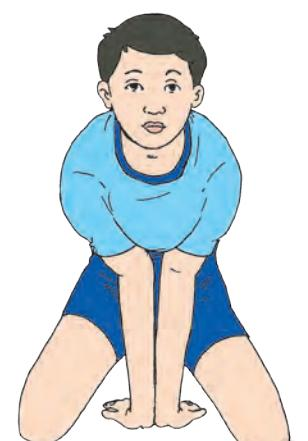

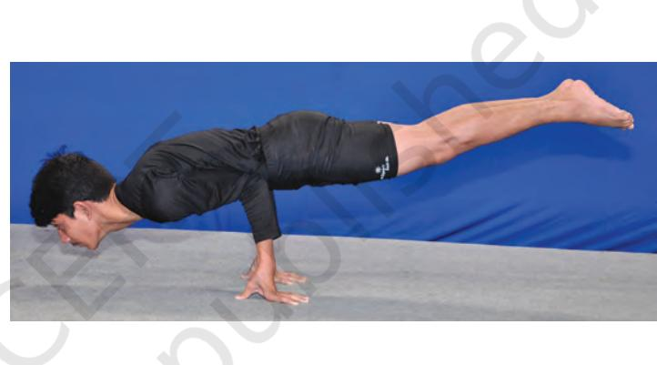

#### *Fig. 8.29: Mayurasana*

Let us perform *Mayurasana* by following the steps given below.

- 1. Kneel on the ground.
- 2. Keep both feet together and knees apart.
- 3. Bring the elbows together and place palms on the ground between the knees, the fingers facing towards the feet.
- 4. Place the elbows at the navel region and stretch the legs backwards.
- 5. Slowly raise the trunk and legs off the ground. Maintain this position for 5-10 seconds. The whole body should be balanced on palms and supported by abdominal muscles by shifting the body weight a little forward and balancing the body on the elbows.
- 6. To come back, lower the legs to the ground. Bring the legs towards the hands and place the knees on the ground. Remove elbows from the navel and place the hands by the side of the body. Reduce the distance between the knees and come to *vajrasana*.

162

Chap-8_New.indd 162 8/24/2020 11:42:46 AM

# **Remember the following points**

|  | Dos |  | Don'ts |
| --- | --- | --- | --- |
| • | Shift the body weight by propelling the | • | Do not throw the legs up with a jerk. |
|  | body forward and raising the legs up | • | Do not keep the elbows apart while in |
|  | while balancing the body. |  | balance. |
| • | Spread out the fingers well to secure a |  |  |
|  | broad base for balance. |  |  |
| • | Tense the muscles of the body while |  |  |
|  | raising the trunk. |  |  |
| • | In the final position, the weight of body |  |  |
|  | should be supported by abdominal |  |  |
|  | muscles. |  |  |

#### **Benefits**

- **•** It strengthens the arms.
- **•** It helps to promote circulation in the abdominal region.
- **•** It helps to increase appetite.
- **•** It massages the digestive organs.
- **•** It helps to regulate the functions of kidneys and liver.
- **•** It helps to develop muscle control and balance in the body.

#### **Limitation**

- **•** A person suffering from high blood pressure, heart disease, hernia or peptic ulcers should not practise this *asana*.
163

Chap-8_New.indd 163 8/24/2020 11:42:46 AM

# **Assessment**

### **I. Answer the following Questions**

- 1. 'Yoga is a way of life'. What makes it a way of life?
- 2. Which specific Yoga practices are relevant for relaxation?
- 3. Mention any two stressful situations experienced by you.
- 4. List any two positive and two negative effects of stress on body.
- 5. Write any two symptoms of stress

|  | Physiological |  | Emotional |  | Behavioral |
| --- | --- | --- | --- | --- | --- |
|  | symptoms |  | symptoms | symptoms |  |
| • |  | • |  | • |  |
| • |  | • |  | • |  |

- 6. You are stressed due to a certain happening. Mention any two yogic practices you would like to perform to de-stress yourself. Give reasons.
- 7. Write the advantages of the following yogic practices:
- 1. *Shirshasana*
- 2. *Anuloma- Viloma Pranayama*

164

Chap-8_New.indd 164 8/24/2020 11:42:46 AM

