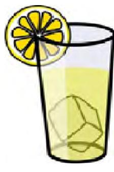

# **Dietary Considerations and Food Quality**

Food is a basic human need. It is consumed to provide nourishment to the body. To achieve optimal level of fitness certain dietary considerations are required. Mostly food is consumed for its taste or appearance; however, both nutritive value and quality of food need attention. Food quality, food adulteration, food spoilage and impact of indiscriminate use of pesticide and radiation on human health have been discussed in this lesson.

# **Dietary Planning**

Dietary planning is an important step in proper food selection and preparation of meal to stay healthy and fit. Dietary planning is a process of developing meal plans for adequate nutrition within the available resources. Nutritional requirement and food choices vary with regard to their age, sex, activity level and physiological condition. Food is planned accordingly to make it enjoyable, satisfying and healthy. Planning is a scientific method of saving energy, time and money. It makes the tasks of procuring raw material, preparing meals and ensuring food quality simpler. It adds variety the meals and reduces wastage.

You have studied the five food groups in Class IX. Revise these and for reference keep these handy.

# **Factors Affecting the Planning**

Everybody needs a balanced diet irrespective of age but certain factors influence the food choices. Consider the following factors while planning meal for good health and fitness.

# **Age**

Body's need for food and nutrients varies greatly with age. An infant needs only mother's milk initially but needs extra

#### **Activity 9.1**

- **•** Plan a meal (lunch or dinner) including some food from each food group.
- **•** Record your one day diet. Analyse each food preparation according to the food group. How could you improve your diet for the missing nutrients?

Chap-9.indd 165 8/24/2020 11:43:36 AM

food and nutrients with growing age. Adolescents grow at a fast pace and are active, so they need extra nourishment. But their food preferences are often influenced by friends and media rather than nutritional requirement. They need guidance in this regard. Nutritious food preparations can be planned in the form they enjoy, like spinach paratha or spinach, carrot and potato soup instead of spinach vegetable. Elders often have difficulty in chewing, swallowing and digestion; they need soft and easily digestible foods, such as, well cooked vegetables, idli etc.

#### **Gender**

Nutritional requirements vary with gender. Till the age of 10 years nutritional requirements are same, thereafter both grow at different pace and their body composition is also different. Mostly men are taller and heavier than women. They are more muscular while women have more fat cells. Thus, their body types are different leading to different nutrient requirements. Females need more iron (hemoglobin) due to blood loss during menstruation. Lack of iron often puts them at high risk of iron deficiency or anemia. Whole grains, seasonal fruits, green leafy vegetables and dairy products are healthy for both genders. Food preferences may also vary with gender.

# **Physical activity**

Energy and nutrient requirements vary with physical activity. Sitting jobs like reading, computer work, etc., need less energy and heavy duty tasks like cycling, carrying heavy load, sports, etc., need more energy. Intensity and duration of activity also affect the requirements, e.g., a person cycling normally needs lesser energy than a person participating in a race, need nutrients, like vitamin B, in accordance with energy requirement. In general energy from fried foods, extra butter or ghee needs to be avoided. Food preparations from whole foods, nuts, oilseeds, dairy foods, egg, and fish can fulfill the requirement for energy and other nutrients.

# **Physiological state**

Physiological conditions like infancy, childhood, adolescence, pregnancy, lactation impose high demands of food and nutrients due to higher rate of growth and development. For example, a healthy sedentary woman needs 1900 kcal/day while the same woman, if pregnant, will need 2200 kcal. Similarly an adult man needs 0.8 g protein/Kg body weight/day. The same person if an athlete requires 2.0g protein/Kg body weight/day. Foods like *laddoo* (rich in calories) are quite suitable for highly active and growing persons while those with sedentary life style should avoid them to prevent becoming overweight. Careful selection is

166

Chap-9.indd 166 8/24/2020 11:43:37 AM

helpful to prevent malnutrition and illnesses. Physiological state also affects the food preferences.

# **Economic considerations**

Some foods are expensive while others are cheap but both may provide similar nutritional benefits, e.g., cashew nuts are expensive, groundnuts are cheap and both are good sources of fat, protein, vitamins and minerals. Seasonal, local, fresh foods are cheaper and more nutritious. The cost of a food item also varies from one place to another. Purchasing from whole sale markets, haats, etc., is economical. Homemade food is cheaper.

# **Time and skill**

The number and types of dishes served in a meal depend on the availability of time, ingredients, equipment and skills of the person who cooks. Lack of these may influence the quality of the meal. Hence, it is necessary to plan in such a way that nutritional quality is maintained. Preplanning and time management skills are useful in preparing nutritious meal in lesser time. All members of the family, including children, need to be engaged in food preparation activities in an appropriate manner.

# **Region, religion and culture**

Eating habits are often linked with the foods produced in the localily, e.g., people living in coastal areas eat more fish or coconut is popular in Kerala. When the same food is consumed over a period of time it becomes cultural practice. Religion also influences the food habits e.g., the Jain community does not eat onion, garlic, eggs, fish, meat, etc., However, mobility, technology and various modern factors are lessening such impacts. Certain foods are associated with festivals like, *gujia* in Holi.

# **Food preferences of individuals**

Food preferences vary from person to person and strongly affect planning of meals, e.g., a vegetarian cannot eat meat and a non-vegetarian will not get satisfaction with only vegetarian dishes. People from south India will get satisfaction with idli sambhar instead of dal roti. Occasional change is accepted but dissatisfaction resulted from less preferred food over a long period of time may lead to under-eating, malnutrition and health problems.

# **Sensory appeal**

How food satisfies the sensory organs, e.g., tongue, nose, eyes, ear, constitute sensory appeal. Good looking and aromatic food appeals and attracts everybody. Appearance, 167

Chap-9.indd 167 8/24/2020 11:43:37 AM

*Fig. 9.1: Taste*

# **Activity 9.2**

- **•** Ramesh plans to make chapatti, dal, spinach vegetable, raita and a sweet for himself and his wife; while Mahima consumes missi roti, mint chutney and buttermilk as she has go to work as a labor in an industry. Compare and evaluate their meals.
- **•** Name five food items you started eating after seeing the advertisements. Explain good and bad features about each of them. What feature in the advertisement attracted you the most?

168

Health

and P

hysical

Education -

Class X

taste, flavor, texture, temperature, also play a crucial role in food acceptance. For example, *papad* has to be crisp and bread soft; ice cream chilled and soup hot. This has to be given due consideration.

#### **Related concepts**

Taste is a sensation perceived in the mouth and throat. There are four tastes, i.e., sweet, salt, bitter, sour. The fifth taste is referred to as umami which is similar to the taste of monosodium glutamate (MSG).

Ayurveda describes six tastes namely, sweet, salt, bitter, sour, pungent and astringent which can easily be linked with the tastes of sugar, salt, neem, lemon, chilli and amla respectively.

Flavour is sensed by both nose and tongue together. It includes both aroma and taste. Lemon has lemony flavor and sour taste. Specific compounds when present in a certain food give them distinct flavor and can also be modified by processing.

#### **Satiety value**

Satiety value implies a sense of pleasure and satisfaction that a person gets from eating food. While planning meals, it is important to take care that it keeps one satisfied for sufficient time and does not lead to hunger pangs soon. This in turn will affect the working capacity, efficiency and health of a person.

## **Media and advertisement**

Many persons, particularly children, choose food tempted by advertisements. Further they choose a certain food because it is available on discount or as a free gift. Such practice is common with some processed, packaged and ready to eat foods. These items may initially attract, appear cheap but on regular use they may turn out to be costly, less nutritious and unhealthy. Hence it is necessary to see nutrition facts on the label of the packing to make healthy food choices. Using the same concept to advertise nutritious foods will encourage people to choose and consume healthy diets.

## **Accessibility and transport**

Foods available nearby are usually selected. It commonly happens with people living in remote areas, elders, handicaps and persons not having requisite transport facilities. Famines, droughts, heavy rainfall, cyclones and road blockages further limit the food supply. Big *bazaars*, home delivery system and online purchase have improved the access to food. Local haats are organised which are also good sources of cheap and fresh food items.

# **Dietary Considerations for Sportspersons**

In Class IX you have studied the dietary considerations for different life stages of humans for their health and wellbeing. The diets of sportpersons should be managed to help them

Chap-9.indd 168 8/24/2020 11:43:37 AM

exhibit their best performance and maintain endurance. They are constantly indulged in intense physical exercises, training, matches and competitions and other sports-related activities. Hence their energy and nutritional requirements are also very high. Besides age, gender, body composition, types of sports, intensity and duration of the event, the environmental factors also greatly affect their nutritional requirements. Adequate nutrition is of utmost importance for their health, physical fitness, endurance, peak performance and prevention of dehydration, injury and infection. The right kind of food given at the right time in right proportion is of paramount importance for sportpersons to prolong their sporting life.

# **Carbohydrates**

Carbohydrates are major sources of energy for sportpersons. For general fitness, 3-5 g carbohydrate per Kg body weight per day is sufficient. For intensive sport like football, gymnastic, weight lifting, 5-10 g carbohydrate per Kg body weight per day may be required. Body stores of carbohydrate (glycogen) must be sufficient before and during exercise. Glycogen stores determine the stamina and performance. For one hour of exercise, no extra intake except water is needed. Carbohydrate requirement increases with increasing duration of workout. Timing of carbohydrates intake is vital. Intake of high carbohydrate, easily digestible food, 2-4 hours before training and event are advisable for quick energy release and replenishment in the body. Food preparations having potato (baked), bread, rice, semolina (suji), and banana along with liquid food are suggested. Excessive consumption of carbohydrates may lead to weight gain, cause digestive discomfort, muscle stiffness, diarrhea, lethargy, etc., and eventually hamper the performance.

## **Protein**

Depending upon the intensity of the sport, protein requirement can range from 1.2 -2.0g per kg body weight per day. Sufficient intake of carbohydrates ensures that protein is used for building and repairing of muscles and tissues; for formation of hormones, enzymes, antibodies and neurotransmitters; preventing damage; and not for giving energy. For better utilisation of protein, consume carbohydrate and protein food sources in appropriate proportion, preferably 3:1 or 4:1 for better performance in endurance events.

Foods like egg, whey protein, soy and milk (casein), low fat dairy products, grains, nuts, seeds and beans provide good quality protein. Readymade protein powders should be avoided or taken under expert supervision only. Low protein intake makes sportpersons susceptible to fatigue,

#### **Activity 9.3**

- **•** Make a diet plan for your team participating in football in Meghalaya, giving suitable justifications.
- **•** Your physical education teacher must be planning events for sports day. Note down the diets he or she suggests to you. Relate all in terms of food groups and give your suggestions in terms of suitability to the game you are playing.

169

Chap-9.indd 169 8/24/2020 11:43:37 AM

lethargy, muscle weakness, injuries and infection. At the same time high protein intake particularly from animal foods or protein powders or supplements may cause unnecessary weight gain, calcium excretion in urine and adverse effect on bones, liver and kidney functions. Consumption of more protein is advisable after the event, during rest period for repair and recovery of the body.

# **Fat**

Fat is not considered a good source of energy during exercise and competition. It is metabolised very slowly, thus, is better for slow and long duration events like marathon. Fats like butter, cream, cow's ghee or coconut oil are good for synthesis of hormone necessary to maintain stamina in sport. Nuts, seeds, low fat dairy products are good choices as they also provide other nutrients and antioxidants. Foods rich in omega-3 fatty acids like flax seeds, fish oil, salmon, consumed in the right amount, enhance strength and vigour in the body and accelerate performance. However, high intake of fat eventually leads to overweight, obesity and associated health problems which hamper performance significantly.

## **Vitamins and minerals**

Vitamins and minerals are crucial in sport because energy utilisation in the body is largely associated with them, particularly some group B vitamins and magnesium. Folate, calcium, zinc, iron are other crucial micronutrients which get depleted faster during long exercises. Vitamin C plays an important role in collagen synthesis and absorption and utilisation of iron in the body. Vitamin B6 helps in protein utilisation. Vitamin A, E and C are important to prevent cell damage and act as antioxidants which are needed to reduce stress and improve stamina and immunity. Adequate intake of these supports the performance and recovery from injury in sport. Colorful fruits and vegetables, dairy products, seeds, nuts and whole grains taken in sufficient amount can provide the needed vitamins and minerals.

# **Water and fluids**

Water and fluids maintain the hydration level and electrolyte balance in the body and are crucial in sports. Dehydration can be serious and can lead to heat exhaustion, profuse sweating, muscle cramps, vertigo (fainting), vomiting, constipation, excessive fatigue and disturbance in vision and coordination. It can hamper the performance and reduce endurance significantly. Drinking 2-2.5 liters of water may be adequate but up to 5-6 liters a day in hot weather and intense exercises may be needed. Sometimes just potable water is not sufficient addition of glucose and salt is also needed.

170

Chap-9.indd 170 8/24/2020 11:43:37 AM

Cool but not cold water is better absorbed and maintains the body temperature. Safe drinking water and beverages like coconut water, fruit juices, thin shakes and sugarcane juice are good choices to maintain energy and hydration levels. Recommendations are available for required amounts of water and fluid intake before, during and just after the event.

*Sports Authority of India along with some other reputed institutions has suggested the nutritional guidelines for different sport. Find out about them.*

# **Food Quality**

Nutritious food too, if contaminated or adulterated is not safe for consumption as it may cause infection or disease. Hence the causes of food spoilage, and the ways to improve the food quality need to be understood.

Food quality is the criteria by which a person accepts or rejects any food item. It is crucial at every stage of food handling from farm to table. Good quality food brings health and well-being and poor quality can cause illness and rejection of food in the market as well. Quality of food is often judged in terms of microbiological load and alterations in physical parameters and chemical composition of food. Food quality risks include food adulteration. In order to protect the health of the people every government enforces certain laws and regulations. In India it is the responsibility of Food Safety and Standards Authority of India (FSSAI) to ensure safety and quality food.

**Food Safety and Standards Authority of India (FSSAI)** is a statuary body under Food Safety and Standards Act 2006. It now encompasses previously employed eight acts in the interest of food operators and consumers. It ensures the availability of wholesome food that is safe for consumption. Amendment and up-gradation are done from time to time. FSSAI code is given to each food item which you can see on various food products.

Physical examination of food is done on the basis of size, shape, color, texture and visual appeal. The food should be free from dirt, cracks or any foreign material; contamination by bacteria, mould, virus, yeast; and infestation by insects, pests, rats, mice, flies and cockroaches which lead to food spoilage and make the food unfit for human consumption. Food quality can seriously be influenced by factors like heat (temperature); air (oxygen, humidity) or moisture content of food, type of food itself and its composition, treatment given to food during processing, handling and storage. Food quality is favorably altered by techniques of food preservation. It is also possible to enhance nutritional quality of food by fortification.

*Fig. 9.2: FSSAI*

*Fig. 9.3: Fortified*

*Fig. 9.4: Agmark of India*

# **Activity 9.4**

- **•** Visit to nearby market, select any 10 food items and report food quality based on the check points above.
- **•** Collect 10 packaged foods and record five points reflecting the food quality in each.
- **•** If you have found low quality food then what you would do?

171

Dietary Consi derations an d Foo d Quality

Chap-9.indd 171 8/24/2020 11:43:37 AM

*Fig. 9.5: ISI*

# **Activity 9.5**

- **•** Collect five perishable food items and leave them at room temperature. Also store the same five food items in the refrigerator. Record the changes in food items kept in both places and assess them in terms of food quality.
- **•** Write five semiperishable and five non-perishable food items you regularly use in your diet.
- **•** Government of India has developed five booklets on food safety. Search on the portal (www.snfportal. in) and record 10 points to prevent food spoilage which can be followed in day-to-day life.

172

Health

and P

hysical

Education -

Class X

It is necessary to observe the quality marks, like FSSAI, AGMARK and ISI, on the food articles while selection to ensure quality.

When food quality is modified intentionally, it is called food adulteration. Over ripening or excessive microbial load causes food spoilage. All these aspects are discussed briefly in the following section.

# **Check points to ensure food quality**

- **•** Check for cuts, bruises, foul smell, discoloration and wrinkles on fruits and vegetables before purchase, handling and consumption.
- **•** Check for any foreign material or adulterant in food.
- **•** Check for seal of the packet or lid of the container or bulging of container.
- **•** Read label for safety, permitted color, preservatives, ingredients, specific information, direction of use, FSSAI code, manufacturing and expiry or "best before" date.
- **•** Avoid buying loose food items particularly flours, oil, spice powders, etc.
- **•** Be watchful for harmful chemicals and colors used to give product a certain look, e.g., acid washed ginger and colored sweets.

# **Food spoilage**

Food spoilage indicates that the food is unfit for human consumption. It is a serious threat to food quality and can be fatal. It is mainly caused by microorganisms, over activity of some enzymes and insects, pests and rodents. High moisture content, temperature and nutrient composition of food affects the growth of causative factors and accelerate food spoilage. The knowledge of approximate shelf life of different foods helps in reducing spoilage. The duration of time during which the food item remains fit for consumption at room temperature is called shelf life which determines perishability. Thus, foods are —

- 1. **Perishable** which remain fresh and edible for few hours to 1-2 days only, e.g., milk, meat, green leafy vegetables.
- 2. **Semi-perishable** which remain fresh and edible for about a week (5-7 days) e.g., some vegetables and fruits.
- 3. **Non-perishable** which remain fresh and edible for more than a month, e.g., grains, sugar, oil, pulses.

Food is precious and is not available in unlimited quantity. So food should not be wasted rather protected from spoilage. Proper storage of food decreases food spoilage and various

Chap-9.indd 172 8/24/2020 11:43:37 AM

treatments can also be given for this, food preservation is one of them.

# **Food preservation**

Food preservation is the process of treating and handling food to stop or slow down spoilage and extend shelf life of food. It works on the principles of reducing the moisture content, preventing the growth of micro organisms causing spoilage and controlling enzymatic activity. The techniques are —

- 1. **Heat treatment:** Application of heat helps in preserving food by destroying the harmful microorganisms. For example, Pasteurisation of milk and sterilisation of bottles.
- 2. **Refrigeration and freezing:** Low temperature limit the enzymatic and microbial activities keeping the food safe for longer duration.
- 3. **Drying or dehydration:** This technique is based on reducing or removing the moisture content of food as microbes cannot grow in the absence of water.
- 4. **Addition of preservatives:** Preservatives are natural or chemical ingredients which selectively control the growth of microorganisms and enzymes in food and restrict spoilage. Jams and jellies are preserved by sugar and pickles by salt, spices and oil. Acid medium also restrict the growth of bacteria. Chemical preservatives like sodium benzoate or Potassium Meta bisulphite (KMS) are used in ketchups and squashes. Preservatives are used in very small quantity. Use above the prescribed limit is harmful and punishable under law.
- 5. **Preservation by Radiation:** Radiations are emissions of intense energy capable of penetrating tissues. When food is exposed to specific form of radiation (gamma rays from Cobalt 60) under controlled conditions it increases their shelf life and is referred as irradiated food. Items like fruits, potatoes, onions, spices, herbs and some ready-to-eat foods can be preserved in this way. But this technique is not suitable for milk and milk products. The safety of irradiated foods is under debate. Consumers can choose or avoid irradiated foods by identifying its symbol on the label. This mark has been approved by Food safety and Standards Regulations Authority of India (2015).

# **Food adulteration**

Food adulteration is an unhealthy and illegal practice of adding the low grade ingredient(s) in the original food or

#### **Activity 9.6**

- **•** Choose three preserved foods prepared at your home and another three from the market. Identify the method of food preservation in each and the preservative used, if any. Classify the preservative as natural or chemical.
- **•** Identify one preservative for each: lemon pickle, guava jelly, frozen peas, pineapple squash and bread.

Dietary Consi derations

173

 an

d Foo

d Quality

Chap-9.indd 173 8/24/2020 11:43:37 AM

deleting the vital component. It is usually done intentionally to increase the profits. It makes the food unsafe to eat; degrades the food quality and is injurious to health.

Under Food Safety Standards Act (2006) adulterated food is now termed as substandard food, unsafe food or food containing extraneous matter. The helpline where an individual can lodge complaint is —

http://nationalconsumerhelpline.in/foodSafety.aspx The following criteria designate any food as adulterated or unsafe and the person responsible for any of these is punishable under law —

- 1. The article itself, or its package thereof, is composed, whether wholly or in part, of poisonous or deleterious substances.
- 2. The article consists of, wholly or in part, any filthy, putrid, rotten, decomposed or diseased animal substance or vegetable substance.
- 3. The article contains of unhygienic processing or the presence of any harmful substance in that article.
- 4. It contains substitution of any inferior or cheaper substance whether wholly or in part.
- 5. It contains addition of a substance directly or as an ingredient which is not permitted.
- 6. There is abstraction, wholly or in part, of any of its constituents.
- 7. The article is colored, flavored or coated, powdered or polished, so as to damage or conceal the article or to make it appear better or of greater value than it really is.
- 8. There is presence of any coloring matter or preservatives other than that specified in respect thereof or in quantity more than prescribed.
- 9. The article has been infected or infested with worms, weevils, or insects.
- 9. The article is prepared, packed or kept under insanitary conditions.
- 11. The article is misbranded or sub-standard or food containing extraneous matter.
- 12. The article contain pesticides and other contaminants in excess of quantities specified by regulations.

The following tests for common adulterants can be performed by students themselves (Table 9.1).

174

Chap-9.indd 174 8/24/2020 11:43:37 AM

| Food Product | Adulterant | Method for detecting the Adulterant |
| --- | --- | --- |
|  |  | Put a drop of milk on a polished vertical |
|  |  | surface. The drop of pure milk either stops |
|  |  | or flows slowly leaving a white trail behind |
| Milk | Water | it. On the other hand, milk adulterated with |
|  |  | water flows immediately without leaving a |
|  |  | mark. Add 2-3 drops of tincture iodine. Formation |
| Milk | Starch | of blue color indicates the presence of |
|  |  | starch. |
|  |  | Take 5 ml milk sample in a test tube. Add |
|  |  | 5 ml Para-dimethyl Amino Benzaldehyde |
|  | Urea | reagent. Appearance of distinct yellow color indicates presence of added urea whereas |
|  |  | formation of slight yellow color indicates |
|  |  | natural urea in milk. |
| Mustard Seeds | Argemone Seeds | Argemone seeds have rough surface and are tinier in size and black in color. Mustard seeds on pressing are yellow inside, while |
|  |  | argemone seeds are white. |
| Sugar | Chalk | Dissolve sugar in a glass of water, chalk |
|  |  | will settle down at the bottom. |
|  |  | On ignition genuine silver foil burns away completely leaving glistening white |
| Silver Foil | Aluminium Foil | spherical ball of the same mass while |
|  |  | aluminum foil is reduced to ashes of black |
|  |  | grey color. A cotton wick dipped in pure honey |
| Honey | Sugar solution | burns when ignited with a match stick. |
|  |  | If adulterated, presence of water will not |
|  |  | allow the honey to burn and if it does, it |
|  |  | will produce a crackling sound. |
| Coffee | Chicory | Gently sprinkle the coffee powder on the |
|  |  | surface of water in a glass. The coffee |
|  |  | floats over the water but chicory begins to |
|  |  | sink within a few seconds. |
| Tea | Coloured Leaves | Pour water drop by drop at the heap of the tea leaves placed on a filter paper. Water will dissolve the added colour and leave |
|  |  | streak of colour. |
|  |  | Move a magnet through the sample. Iron |
|  | Iron filings | will stick to the magnet. |
| Red Chilli |  | Take 2 gms sample in a test tube, add 5 ml |
|  | Rodamine | of acetone. Immediate appearance of red |
|  |  | color indicates presence of Rodamine. |
| Powder |  | Add the sample to water. The saw dust |
|  | Saw dust | will float at the surface of water while chilli |
|  |  | powder will settle down in bottom. |

# **Table 9.1 Methods for detection of common adulterants in food**

175

Chap-9.indd 175 8/24/2020 11:43:37 AM

| Turmeric | Artificial colour | Natural turmeric powder leaves a light yellow colour while settling down whereas |
| --- | --- | --- |
| Powder |  | adulterated turmeric powder will leave a strong yellow colour in water. |
| Dal — arhar, |  | Extract the color with lukewarm water |
| huskless moong | Metanil Yellow | from the sample of pulses, add drops of |
| and channa |  | HCl. A pink color indicates presence of |
|  |  | metanil yellow. Take a cotton piece soaked in water or |
| Green |  | vegetable oil. Rub the outer green surface of the vegetable. If the cotton turns green, |
| vegetables like peas, bitter | Malachite Green | then it is adulterated with malachite green. Place a small portion of the peel (from the |
| gourd |  | green side) on a moistened white blotting |
|  |  | paper, green colour on paper indicates the |
|  |  | presence of malachite green. |
| Black Pepper | Papaya Seeds | Pure black pepper settles at the bottom whereas papaya seeds float on the surface |
|  |  | of water. |
|  | Colored dried | Pure saffron will not break easily. Pure |
| Saffron | tendrils of maize | saffron when dissolved in water will |
|  | cob | continue to give out colour till it remains |
|  |  | in water. |
| Common Salt |  | Stir a spoonful of salt in water. Chalk |
|  | Chalk | will make the solution white and other |
|  |  | insoluble impurities will settle down. |

As a part of its mandate to ensure safe food to the citizens, Food Safety and Standards Authority of India (FSSAI) conducts testing of food for different types of adulterants, chemical and micro-biological contaminants and other safety parameters for food. The food testing is done by FSSAI through a network of FSSAI notified laboratories across the country. The food safety officers collect samples of food products for testing. A consumer can also get the samples of food tested in such labs. If the food is found unsafe after testing, the cost of the test is reimbursed to the consumer.

#### *Adverse effects of food adulteration on health*

Adulteration is detrimental to health. Many a times food is adulterated in such a way that it looks the same but soon it may change in taste, appearance and nutritional composition, often leading to harmful effects on health. Consuming adulterated food can cause the symptoms like diarrhea, vomiting, headache, abdominal cramps, fatigue, etc. Sometimes its impact may not be instantly visible but may distort the functioning of the immune, digestive and nervous system. It can also lead to liver disorder, heart disease, paralysis, brain damage, cancer, etc. Consumption

176

Chap-9.indd 176 8/24/2020 11:43:37 AM

of adulterated food by pregnant women may lead to abortion or damage the brain of the baby. Children, pregnant and lactating women, elderly people, weak and sick persons are at higher risk of consequences of food adulteration.

## *Actions to be taken against food adulteration*

- 1. Buy food products having standard mark like FSSAI, AGMARK, etc.
- 2. If you suspect adulteration in any food, do not buy or consume it.
- 3. Make others aware of suspected adulteration by various modes — personal, print media and digital media
- 4. Lodge a complaint to 'Prevention of Food Adulteration Department' in your city, town or district.
- 5. Always preserve grocery bills. These will be needed in case of lodging a complaint to a company, manufacturer, distributer, store-keeper or shopkeeper or to consumer court under the Food Safety and Standards Act.

# *Effects of pesticides on health*

Pesticides are chemicals used in agriculture to protect crops in the fields, during storage and to control insects and pests in the surroundings, e.g., mosquitoes and cockroaches. These can be chemical or biological in nature. Chemical pesticides have played a significant role in increasing food production, but unnecessary and excessive use of these over a long period of time has adversely influenced various forms of life on earth, as well as, the quality of soil, water and environment. These have disrupted the natural balance of the ecosystem.

Pesticides often leave their residues in food which are passed on to the body. Those at higher risks are workers handling or producing pesticides as pesticides are toxic in nature. The adverse effects of pesticide residues depend on the type and amount of the pesticide and the route (ingestion or inhalation) and duration of exposure. If pesticide is used in accordance with good agricultural practice, the residual level would be low and consumption of such foods will not be harmful. Symptoms of acute poisoning include vomiting, diarrhea, abdominal pain, dizziness and numbness. In severe cases, it may lead to difficulties in breathing, blurred vision and convulsion. Pesticides can cause damage to the brain and nervous system, liver, kidneys and are specially harmful to fetus. In India, FSSAI is responsible for setting maximum residue limits (MRLs) for the pesticides.

**Activity 9.7**

- **•** Search any two cases of food adulteration (personal experience, news item, internet, etc.), identify adulterant and its effect on health.
- **•** Whom can you approach when you see fungus on bread; suspect water in milk or find ice cream sold after the expiry date?
- **•** Conduct a survey on 10 persons to assess their actions on food safety asking simple questions like whether they check sign of quality standard (FSSAI, Agmark etc.), date of expiry, ingredients, visual condition of product, package, etc., while buying. Make a report and discuss in class.

177

Chap-9.indd 177 8/24/2020 11:43:37 AM

# **Activity 9.8**

- **•** Find out one herbal formulation suitable for home gardening.
- **•** Find out good practices of use of pesticides.

### *Some preventive measures*

- **•** Young children, pregnant and lactating women, weak and sick persons are at higher risk, hence they should be specially protected.
- **•** Use herbal or bio-pesticides.
- **•** Wash fruits and vegetables thoroughly under clean running water.
- **•** Use organic food.
- **•** Keep the pesticides in locked cabinets, away from kitchen and bathroom.
- **•** Read all labels and warnings carefully before using pesticides.

# *Suggested readings*

- 1. *Nutrition and Hydration guidelines for excellence in sports performance.* 2007 International Life Sciences Institute — India, National Institute of Nutrition and Sports Authority of India.
- 2. National Institute of Nutrition, Indian Council of Medical Research. 2011 *Dietary guidelines for Indians-A manual*
- 3. https://archive.fssai.gov.in/home/safe-foodpractices/E-BOOKLETS.html
- 4. https://foodsmart.fssai.gov.in/DART.pdf

178

Chap-9.indd 178 8/24/2020 11:43:37 AM

# **Assessment**

# **I. Solve this Nutrition Puzzle**

## **Horizontal**

- 1. Which nutrient is the main source of energy for sport person?
- 2. This is one of the factors affecting meal planning.
- 3. The practice of adding unwanted material in food.
- 4. Emissions of intense energy capable of penetrating tissues.

#### **Vertical**

- 1. In India this authority certifies foods for safe consumption.
- 2. Milk and meat help to build the body because these contain this nutrient.
- 3. This branch of study deals with food composition and its effect on the body
- 4. Which compounds are used for food crops but can be injurious to health?

4

# **II. Answer the following Questions**

- 1. 'Without dietary planning it is difficult to meet the requirements of people' — discuss this statement giving suitable reasons and examples.
- 2. In a group there is a male teacher, a female doctor, a 15-year-old girl playing tennis and a man aged 68 years. List the factors that will be applicable for dietary planning of this group.

179

Chap-9.indd 179 8/24/2020 11:43:38 AM

- 3. What kind of diet do sportspersons need? Substantiate your answer giving reasons.
- 4. Write notes on
- a) Food quality
- b) Food preservation methods
	- 5. 'Even the most nutritious food may not be safe to eat if adulterated' discuss the statement giving cases/examples in the light of what you know about food adulteration?
	- 6. Suggest a method to detect:
- a) Metanil yellow adulteration in arhar dal
- b) Papaya seeds adulteration in peppercorns
	- 7. What are the various ways of protection from harmful effects of pesticides?
	- 8. Which of the following is food adulteration?
- a) Adding a preservative
- b) Abstraction of a constituent of food article
- c) Using a food color
- d) Splitting of a food article in small pieces
	- 9. Match the following
		- a) Turmeric (i) Caution
		-
- 
- b) Microbial load (ii) Anti inflammatory
- c) Pesticides (iii) Shelf life
- d) Semi-perishable (iv) Food Quality
	- 10. Discuss the classification of food based on shelf life. Take an example of a semi-perishable food and explain various methods of increasing its shelf life.

180

Chap-9.indd 180 8/24/2020 11:43:38 AM

