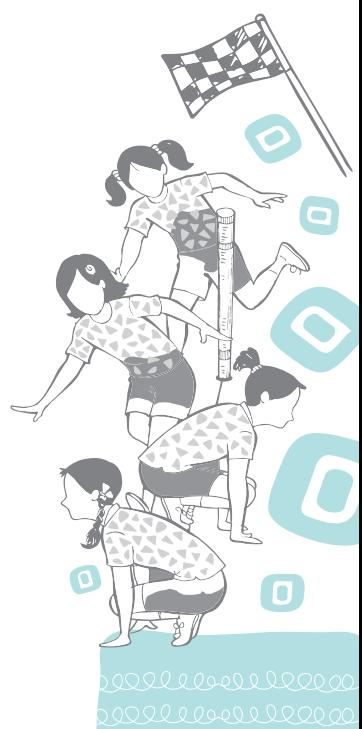

In modern times, Physical Education is one of the most exciting and dynamic subjects. This subject has changed dramatically during the last 50 years. It has expanded in different areas from school to non-school setting and from school-aged children to people of all ages. Earlier, physical education was generally understood as physical activities either in school time table or some free hand exercises, games, sports, racing, swimming, etc. If we look at the Indian history of physical education after Independence, a number of schemes were launched by the Government of India for schools, where every student must participate in physical activities. We can witness the growing interest in games and sports exemplified by the fitness boom and the wellness movement. Sports events receive worldwide coverage. In schools, students like sports and other forms of physical activities, which help to achieve and maintain their health and well-being.

# **Meaning and Definition**

Physical Education is an education which brings improvement in human performance with the help of physical activities. Physical activities range from simple walking to jogging, running, sprinting, hopping, jumping, climbing, throwing, pushing, pulling, kicking, etc. Education without physical activities is like body without soul. There is no controversy in giving due place to physical education and different forms of exercises in the total set-up of education. All teachings in human education begin with physical education. Physical education is also considered as movement education as the life begins from movement only. In general life is characterised by movement. The movement starts from the birth of a child, till the end of life.

### **Do You Know?**

- **•** *Sharir Madhyam Khalu Dharma Sadhnam* means physique is the prime source of performing all duties.
**1**

- **•** Swami Vivekananda and other philosophers like Socrates, Aristotle, and Plato were of the opinion that physical training was necessary for the youth.

Chap-1.indd 1 31-07-2020 15:24:29

Mental, intellectual, emotional and social development of a growing child is dependent and closely related to physical development. A physically fit individual possesses a wellbalanced personality which is, mentally sharp, emotionally stable and socially well-adjusted.

Physical education teaches how to acquire ability to develop strength, speed, endurance and coordination abilities. It also emphasises on achieving social qualities, such as, empathy, cooperation, friendliness, team spirit, and respect for rules, which are essential for healthy social relations with others. In this era of technological advancement, physical education and sports are considered essential for health, fitness, wellness, vigour and strength.

The concept of physical education is not new. The fact is that it has its roots in the ancient period. At various stages in history, different people have associated different meanings to the word 'Physical Education'. Physical Education in simple words is understood as learning with the help of movements of body and realising the benefits at mental level. It simply means education through the use of physique and physical movements and deriving the advantage for social gain. Some of the definitions given by well known authors are given here to understand and for the ready reference of the students.

*Fig. 1.1: Children participating in physical activities and excercise*

### **Definitions of Physical Education**

In ancient India, a sanskrit adage stated that *"Sharir Servarth Sambhavo Dehe".* The National plan of physical

Chap-1.indd 2 31-07-2020 15:24:30

education (1956) states that, "Physical education should aim at making the child physically, mentally and emotionally fit and developing personal and social qualities which will help to live happily with others and build a good citizen". It further emphasises that the development of the total personality and achievement of worthy citizenship motivated for service should be the outcomes of physical education.

According to the Ministry of Education and National Planning for Physical Education and Recreation, "The aim of physical education must be to make every child physically, mentally and emotionally fit and also to develop in him personal and social qualities that will help to live happily with others. Physical education programme should also aim to build good citizens of the country."

According to the Central Advisory Board of Physical Education and Recreation, "Physical education is the process of education through physical activities. It is the development of the total personality of the child to its fullness and perfection in body, mind and spirit."

Sports and physical education are an integral part of the learning process, and need to be included in the evaluation of performance. A nation-wide infrastructure for physical education, sports and games are required in the educational field. The infrastructure consists of playfields, equipments, coaches and teachers of physical education. Available open spaces in urban areas can be used for playgrounds. Efforts should be made to establish sports institutions and hostels where specialised attention can be given to sports activities and sports-related studies, along with normal education. Appropriate encouragement should be given to those who have talent in sports and games. Due focus should be given on indigenous traditional games.

*Fig. 1.2: Physical exercise*

Chap-1.indd 3 31-07-2020 15:24:31

2024-25

### **Activity 1.1**

- **•** Prepare a chart on the steps taken by the Government of India to promote games and sports in India and discuss with your classmates.
- **•** Prepare a chart on the Importance of Physical Activities on health and discuss in the class.
- **•** Discuss Fit India Movements and its benefits.

Charles A. Bucher has defined Physical Education as an "Integral part of total educational process, is a field of endeavour which has its aim — the development of physically, mentally, emotionally and socially fit citizens through the medium of physical activities which have been selected with a view to realise these outcomes."

According to American Alliance for health, physical education, recreation and dance, "Physical Education is education through physical activities which are selected and carried as with regard to value in human growth, development and behaviour".

Finally, it can be concluded that the development of all personality traits like, physical, social, mental, emotional, and moral takes place through various programmes of physical education.

# **Aims and Objectives**

If you are doing physical exercises or playing any game regularly, you must have realised their importance. The aim of physical education is to target the total development of human personality. In physical education, the final aim is to make every human being physically, mentally and emotionally fit and also to provide each kind of opportunity to them, so that they can develop such personal and social qualities which will help them to live happily with others and shape themselves as true citizens of the country.

Efforts are needed to provide adequate facilities and ample time for the individuals and the groups to participate in situations that are physically wholesome, mentally stimulating and socially sound. Through physical education one can strive to achieve the following aims and objectives.

### **Motor Development**

The objective of motor development refers to the neuromuscular relationship of nerve or nerve fibre to the one that connects the central nervous system with muscles. This in turn enables the movement of the body. To enhance the ability of the body to act, react and interact, it is necessary to exercise the muscles and nerves. In other words, physical development of a person is the foremost objective of physical education. Physical education is related to physical activities, which when performed, have an effect on various organ systems of our body. It leads to the improvement in size, shape, efficiency, etc., of various organs of these systems. An individual who is having good motor movements may perform daily routine work very effectively without undue

Chap-1.indd 4 31-07-2020 15:24:31

fatigue and laziness and feels confident in life. It also promotes sound health which enables an individual to become a valuable asset for the society and nation.

*Fig. 1.3: Children participating in physical activities and excercise*

Motor development can be possible through participating in different kinds of physical activity programmes like, games, sports, yoga, dance, etc.

## **Mental Development**

Mental development refers to the ability to think and solve problems effectively. Knowledge received by participating in physical activities about body movement, health, fitness, sanitation, nutrition, disease prevention and others may contribute to an individual's mental development. A mentally developed person takes wise decisions at the right time and in a right spirit. Mental development objectives deal with a person's ability to think correctly, act wisely and skillfully in all situations of life. Various activities conducted in physical education classes not only require physical strength but also need mental alertness, deep concentration, and precise movements. In this manner, physical education also sharpens the mind and makes it more efficient.

### **Emotional Development**

This refers to a psychological situation of body and mind. Emotion is a drive to do something. Emotion covers

Chap-1.indd 5 31-07-2020 15:24:32

### **Activity 1.2**

Prepare a project on the status of various facilities available in your district related to various games and sports. Critically analyse how these can be shared effectively.

experiences, such as, fear, anger, joy, love, sorrow, etc. It is usually a feeling which has specially become intense. For example, joy means intense pleasure. A child needs to develop confidence, a feeling of belongingness, and eliminate negative feelings through participating in games, sports, yoga, etc.

### **Social Development**

This objective of physical education refers to the feeling of belongingness, adjustment of group living, social poise, social relationships, and social adjustment. Physical activities provide such opportunities to the children to fulfil basic needs like, recognition, self-respect, belongingness, and love. When these needs are fulfilled, the individual becomes a well-adjusted social person. While participating in physical activities including games and sports, an individual acquires social qualities, such as, cooperation, friendship, courtesy, empathy, team spirit, democratic living, sportspersonship, etc. These qualities are essential for social development.

### **Moral Development**

Every game has a set of rules and regulations and it is the duty of each player to obey them. The players know that disobedience of any rule is a moral crime that can result in their expulsion from the team. Therefore, obedience of these rules becomes the moral duty of each player. Participation in games helps in moral development and equips them to differentiate between right and wrong with honesty. Hence, physical education also plays an important role in the moral development of a person.

# **Need and Importance of Physical Education in the Modern Society**

The modern researches have proven that the views of Greek philosophers Aristotle and Socrates in considering athletics as complete education is correct. It has been scientifically observed that adequate exercise of limbs is essential for disciplining one's mind in the right spirit. Regular exercises and playing games help the body and mind to deal with the modern day silent killers, such as, stress, strain, worry, anxiety and tension. The need and importance of physical education may be understood in several ways which describes the different kinds of requirements for various sections of the society.

Chap-1.indd 6 31-07-2020 15:24:32

Health and Physical Education must continue to be a compulsory subject from the primary, to the secondary stages, and as an optional subject at the higher secondary stage. However, it needs to be given equal status with other subjects, a status that is not being given at present. In order to transact the curriculum effectively, it is essential to ensure that the minimum essential physical space and equipment are available in every school, and that doctors and medical personnel visit school regularly.

It should be possible to organise the utilisation of school space, at the block level at least, for special sports programmes both before school hours and after school hours to enable children with special talents for sports to come here for special training and during vacation periods. It should also be possible to develop these sports facilities so that many more children can avail of these for leisure-time sports activities and engage with team games such as basketball, throwball, volleyball, and local forms of sports.

*Source: The National Curriculum Framework 2005*

The need and importance of physical education for every section of people in the modern society can be understood from the points given below—

- **•** Optimum development of child's physical growth
- **•** Intellectual development
- **•** Emotional development
- **•** Social development
- **•** Personal development
- **•** Character building
- **•** Physical fitness
- **•** Development as a disciplined citizen of the country
- **•** Neuromuscular development
- **•** Cultural development
- **•** Developing leadership qualities
- **•** Healthy and safe environment
- **•** Development of national integration
- **•** Better international understanding

Sports and games play an important role in the development of human personality. They are no less important than food and fresh water. It is interesting to note that there are many nurseries and training centres for games in most of the developed countries.

Chap-1.indd 7 31-07-2020 15:24:32

### **Activity 1.3**

- **•** Prepare a list of common myths prevailing in your surroundings by discussing with your parents, grandparents, and other community members.
- **•** Compare with list given.
- **•** Discuss with your classmates "How to remove these myths?"

# **Misconceptions about Physical Education and Sports**

Lack of understanding about the importance of physical education results into misconceptions and disbelief.

There are a number of misconceptions related to physical education. Some people do not agree that it is a part of the educational process. The fact is that, skill, fitness, performance, and health are parts of physical education. It addresses the educational and developmental values that are the results of participation in physical activities. The participation in these activities develops social or co-operative attitude, good character and a balanced personality. However, when one fails to recognise this holistic approach of physical education, it results in a number of misconceptions. People in the society are either less aware about the advantages of taking part in physical education activities or are left behind with the pace of modern educational system. Thus, it becomes important for all of us to understand what we think and how the modern world is looked at by educated and disciplined people of the society. Some of the common myths associated with physical education are given below.

### Physical Education

- **•** is all about physical training only.
- **•** is only about the participation in games.
- **•** is about building body.
- **•** is performing drill.
- **•** is play.
- **•** has poor social status.
- **•** has no job or career prospects.
- **•** leads to indiscipline.
- **•** is wastage of money only.
- **•** has rest periods hence, no physical or mental earning.
- **•** is taken-up by left out group only.

# **Terminology used in Physical Education**

### **Game**

It is often considered as an activity played by more than two people combined as a team. There are defined objective, time, space, rules, and limited pattern of behaviour, the outcome of which is to determine a winner or loser. *Fig. 1.4: Children playing football*

Chap-1.indd 8 31-07-2020 15:24:32

### **Sport**

Sport is a wider term which acts as an institution involving all physical activities, individual skills, governed by a set of rules and often taken competitively.

# **Sports Training**

Planned and systematic process of preparation of sportsperson or athlete for better performance, which is based on scientific principles, is called sports training. It improves specific fitness and sports specific skills, techniques, and tactics.

### **Gymnastics**

Gymnastics include different exercises, without apparatus, and with apparatus. These exercises involve arm, leg, hand and trunk movements as well as performing jumping movements, and maintaining balance. It constitutes agility exercises done on various kinds of gymnastic apparatus like, parallel bars, horizontal bar, beam, pommel horse, ring, etc.

*Fig. 1.5: Players performing gymnastics*

## **Physical Culture**

In some of the countries, physical education is considered as 'physical culture'. The culture is synonymous to our social belief, custom, and religious way of treating the body as temple. It also includes the concept of making the body beautiful by developing shaped muscles. Weight-training devices, and sharp and high intensity exercises are some of the means, used for muscle training so that the body looks muscular and in good shape.

### **Drill**

Drill includes different kind of body exercises for developing good posture of standing, walking, fighting, etc., and

Chap-1.indd 9 31-07-2020 15:24:33

disciplining the body and mind. In games and sports, drill is the process of repetition of activities done with beats, music, or verbal order.

# **Health Education**

Health Education includes the knowledge about diseases, health, rest, sleep, sanitation, pollution and psychosomatic disorder. A healthy person is an asset for the society whereas an unhealthy person is a liability.

# **Recreation**

Recreation includes playing, singing, camping, hiking, reading, gardening, dancing, and many more pleasure-giving activities. Through recreation one can regain the lost energy, vigour, and spirit. After hard work one can engage in different kinds of recreational activities for releasing mental stress and get rid of fatigue.

# **Career Options in Physical Education, Sports and Allied Areas**

There are many job opportunities and open career options with broader choices in Physical Education. A sports career in India, which was considered less lucrative in the past, has now become one of the options for students. Sometimes the students take interest in this profession merely for adventure and a tension free life. Individuals, who demonstrate peak performance in sports and physical education, follow a set of mental processes that allow them to produce excellent results consistently. These performance strategies translate into a specific set of mental skills. By learning these skills, effectiveness and performance can be enhanced. There are key strategies that lead to high performance in the field of sports—through the training of mental practices, individuals can accelerate their development and improve their performance. Self confidence is one important key to success. For example, physical education programme helps to boost one's self confidence. To make a career in physical education, one should start by setting modest goals that are meaningful but attainable. Some of the options given here are broad areas that are often selected by the students undergoing various physical education courses as a choice with higher success rate.

# **Teaching or Coaching**

Career in sports has been mainly focused on teaching and coaching in schools, colleges, and universities. Teachers are involved in teaching and organising physical activity

Chap-1.indd 10 31-07-2020 15:24:33

programmes based on theory and practical syllabi of health and physical education, extramural and preparation of teams. Coaches are potentially sportspersons or players with talent in fundamentals, techniques, and rules of competitive sports or games. Coaches are responsible for overall preparation, and performance of teams. Coaches are also employed in government run centres, sporting clubs, holiday resorts, etc., for special sports. Some may also be self-employed in their own sports training centres.

### **Health, Sports and other Related Careers**

Nowadays, the interest of youth in health and particularly fitness has been increasing. The demands for specialists therefore, in health-related career have also increased. The major career categories in health are—

### *Physical fitness instructor*

These are better known as gym or aerobics instructors. They supervise people in games, fitness clubs, sports centre, health clubs, etc. They prepare the routine of exercise according to age, gender and level of fitness of the person. Instructors make sure that the equipment are correctly set up. They work in consultation with the dieticians, physiologists, psychologists, doctors, etc.

### *Dietician*

They plan the diet for a player or a team so that they eat proper and balanced food according to their physical work. In the present time, dieticians are considered important part of modern spa, and beauty parlours and also in hospitals and health centres.

### *Sports Medicine Physician*

The sports related injuries are different in nature. Sport Medicine Physician can give better treatment to sportsperson after understanding the seriousness of sports related injuries. A good sportsperson can become a better physician. It is the duty of the sports medicine physician to cure the sportsperson so as to enable him/her to come back in the mainstream. There is thus, a tremendous scope for this sports career.

### **Sports Administration Related Careers**

An administrator in sports can be a Sports Director, Sports Officer, Head of Department, General Manager, Executive Director, Supervisor, etc. The areas that they take care of are related to finance, scheduling equipment, facilities, public relations, and many more. They also undertake the

Chap-1.indd 11 31-07-2020 15:24:33

### **Activity 1.4**

Collect some more information about careers in Health and Physical Education.

responsibility of implementing curriculum, monitoring staff, office, managing sports information, scholarship and promotion, supervision of coaches and various competitions, organising conferences, etc. An administrator must have leadership qualities, should be well organised, willing to accept responsibilities, hard working and honest.

### **Performance Related Careers**

Performance related careers in sports are of two types, one is professional performers in sports, and second is sports officials. The sports performers play as an individual or in team for organisations on contract or on pay-roll basis either for a specified period, or otherwise. Sports officials like, referee, umpire, judges, etc., officiate the match or tournament on contract or on pay-roll basis either for a specified period or otherwise. Every sportsperson wants to be a professional performer but only a few succeed in earning a living. The dream of every sports person is to be a professional performer like Dhyan Chand, Milkha Singh, Sachin Tendulkar, Mary Kom, Vishwanathan Anand, Mahesh Bhupati, Sakshi Malik, etc. For officiating, no educational qualification or degree is required, only a written and practical examination conducted by the state and national sport organisation of a specific sport has to be cleared.

### **Communication Related Careers**

A wide range of career opportunities are available in sports communication as variety in the means and methods of communication are the demands of the society. Sports communication includes sports writer, sports editor, sports publisher, sports photographer, painter/ artist, broadcaster, sports information director, sports statisticians, etc.

### *Sports Writers*

There is a separate section devoted to sports in all the newspapers, magazines, periodicals, bulletins, etc. For writing these sections, sports writers are required. The job of sports writer is to cover the stories related to the vast world of sports on the basis of performance, team selection, policies, management, results, and other related matters to write sports column.

#### *Sports Publishers*

Sports Publishers are responsible for all the publication units including the quality, content, sales and promotion of books, etc. As there are various textbooks, coaching

Chap-1.indd 12 31-07-2020 15:24:33

books, sports magazines, audio-visual material, journals, periodicals, etc., so publication also has reputed value as a career in sports.

### *Photography*

As the scope of photography in sports is not very vast, people may opt for it as a part-time/full-time career in sports. Individuals with artistic ability, skill and experience in painting and drawing sports events can choose this profession.

### *T.V. or Radio Reporters*

Sports are a valuable section on broadcast and telecast. Sports events are broadcasted and telecasted to be heard on every radio-station and can be seen on T.V. channels respectively. Because of high demands of sports, provision of special T.V. sports channels are there. The duties of broadcasters are to present sports programmes on T.V. or radio live from the stadium or playfield. They also present commentary summaries, reviews and sports news on T.V. and radio. Sometimes they anchor special sports programmes, do interactions or take interviews of sports personalities.

### **Sales and Management Related Careers**

This profession includes sports marketing executives, sports events managers and sports competition organisation associated with sports equipment, material, etc. The ability to interact with customers and to convince them that the product or event is suitable to their needs, is the base for becoming a successful sports manager. Knowledge of the product and organisation of various types of tournament and championship are pre-requisite for these jobs. This job involves high responsibility and alertness, so long hours in the service are required.

Physical education also helps in opting for other careers such as defence, para-force, and police service, etc.

Chap-1.indd 13 31-07-2020 15:24:33

# **Assessment**

### **I. Long Answer Questions**

- 1. Define physical education and discuss the importance of physical education in daily life.
- 2. What are the main objectives of physical education? Explain any four in detail.
- 3. What are the misconceptions about physical education and sports?
- 4. What are the career options in physical education?

### **II. Short Answer Questions**

- 1. Define recreation.
- 2. What do you understand by the term 'Drill'?
- 3. Write the names of apparatus used in Gymnastics.
- 4. What are the differences between games and sports?

#### **III. Fill in the Blanks**

- 1. Games include different teams where the number of players is______________.
- 2. In some of the countries physical education is considered as____________________.
- 3. After hardwork, one can engage in any kind of_______________ activities for releasing mental stress and get rid of fatigue.
- 4. Drill includes different kinds of body______________for developing good posture of standing, walking and fighting, etc.

### **IV. State whether True or False**

- 1. The concept of physical education is new.
- 2. In modern times Physical Education is one of the most exciting and dynamic subjects in its history.
- 3. Charles A. Bucher has defined Physical Education as an "Integral part of total educational process''.
- 4. Gymnastics includes different exercises, without apparatus and with apparatus.
- 5. Physical education does not promote emotional development of a person.

Chap-1.indd 14 31-07-2020 15:24:33

