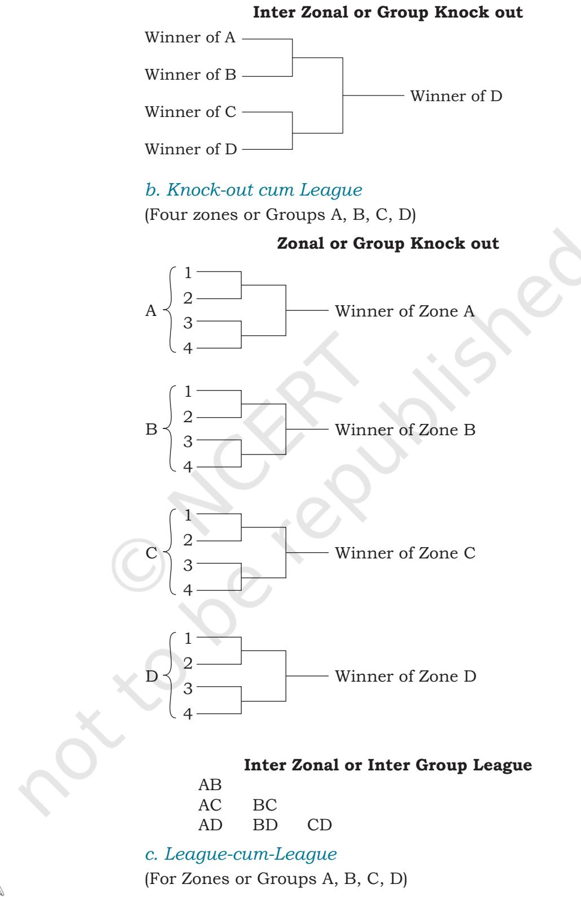
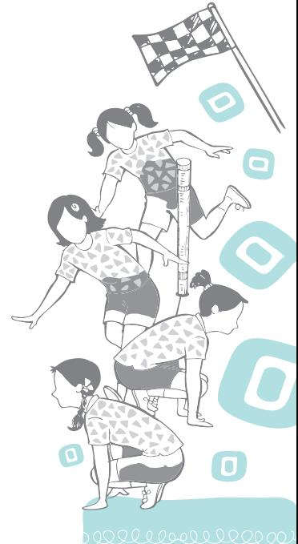

#### **Activity 10.1**

Collect information about the types of tournaments played at school level in different games and sports.

You may have heard about tournaments that are organised for different sports at different levels. Have you read or heard about world cup tournaments for Cricket, Hockey, Football or Kabaddi? Such tournaments are also held at national and state level and even at local level. You or your friends may have participated in inter-school or other open tournaments for Kabaddi, Kho-Kho, Football, Volleyball, Basketball and Cricket organised at the zone, district or local levels.

A tournament is a competition held among different teams in a particular game or sport according to a fixed schedule where a winner is decided. Different types of tournaments are—Knock-out or Elimination Tournament (Single Knockout or Single Elimination, Consolation Type I and Type II, C Double Knock-out or Double Elimination), League or Round Robin Tournament (Single League, and Double League), Combination Tournament (Knock-out cum Knock-out, Knock-out cum League, League cum Knock-out, League cum League) and Challenge Tournament (Ladder, and Pyramid).

While deciding the type of tournament to be conducted, the season, time of disposal, play fields and equipment, type of activity, officials, and finance/budget must be taken into consideration.

Different types of tournaments with their merits and demerits, and the method of drawing fixtures have been described in this chapter.

## **Knock out or Elimination Tournament**

#### **Single Knock out or Single Elimination**

In single knock out tournament, the teams once defeated, are eliminated and not given another chance to play.

Chap-10.indd 300 31-07-2020 15:46:00

Total number of matches in the tournament = N – 1, where N is the number of teams competing.

For example, if N = 13 Total number of matches = 13 –1 =12

#### *Method of Drawing Fixtures*

- 1. Drawing fixture for a certain number of teams competing is decided by the power of two, viz. 2, 22, 23, 24, 25, 26, … etc., i.e., 2, 4, 8, 16, 32, 64, … respectively.
- 2. Suppose 16 teams have entered for a tournament, there will be no byes i.e. 16 – 16 = 0.
- 3. If the number of teams participating is not a power of 2, the byes will be given to a specific number of teams in the first round.
- 4. The number of 'Byes' to be given is decided by subtracting the number of teams from its next higher number which is the power of two. For example, if 13 teams entered for a competition, number of Byes = 16 – 13 = 3 and for 25 teams, number of Byes = 32 – 25 = 7

#### *Seeding*

#### **Single Knock out Fixture for 8 Teams Round I Round II Round III** 1 2 3 4 5 6 7 8 **I Rd. II Rd. III Rd.** Upper Half Lower Half Upper Half = N 2 = 8 2 = 4 Teams Lower Half = N 2 = 8 2 = 4 Teams

No. of matches = N–1 = 8–1 = 7 No. of matches = N-1 = 8-1=7

Chap-10.indd 301 31-07-2020 15:46:01

Chap-10.indd 302 31-07-2020 15:46:02

#### *Procedure of giving byes*

| Ist Bye | — | Bottom of the lower half |
| --- | --- | --- |
| IInd Bye | — | Top of the upper half |
| IIIrd Bye | — | Top of the bottom half |
| IVth Bye | — | Bottom of the upper half |

This process continues in case the number of byes are more than four.

A knock-out fixture is usually drawn by lots and if it is drawn purely on the basis of lots without considering the standards of the teams, strong teams may meet each other in the earlier rounds, hence allowing the weaker teams reaching upto semifinals resulting in unfair and uninteresting competition. To avoid this, seeding is done. Seeding is sorting of strong teams and fitting them into the fixtures so that these teams do not meet in the earlier rounds.

If there is no marked difference in the standard of the seeded teams, then these teams are distributed in the fixture by lots among them.

#### **Table 1: Number of Teams in each Quarter**

| Dividend and Divisor | Remainder |  |  | No. of teams in each quarter |  |
| --- | --- | --- | --- | --- | --- |
|  |  | I | II | III | IV |
| N ÷ 4 | 0 | Q | Q | Q | Q |
| N ÷ 4 | 1 | Q + 1 | Q | Q | Q |
| N ÷ 4 | 2 | Q + 1 | Q | Q + 1 | Q |
| N ÷ 4 | 3 | Q + 1 | Q + 1 | Q + 1 | Q |

(N = No. of Teams, Q = Quotient)

| No. of Teams/entries | 5 to 8 |
| --- | --- |
|  | = 2×2×2 = 23 |
|  | = 3 Rounds |
| No. of Teams/entries | 9 to 16 |
|  | = 2×2×2×2 = 24 |
|  | = 4 Rounds |
| No. of Teams/entries | 17 to 32 |
|  | = 2×2×2×2×2 = 25 |
|  | = 5 Rounds |
| No. of Teams/entries | 33 to 64 |
|  | = 2×2×2×2×2×2 = 26 |
|  | = 6 Rounds |
| No. of Teams/entries | 65 to 129 |
|  | = 2×2×2×2×2×2×2 = 27 |
|  | = 7 Rounds |

#### **Activity 10.2**

- **•** Draw a fixture of nine teams for a Single Knock-out tourament and show it to your teacher.
- **•** Collect information about the rules and regulations for drawing fixtures in Inter School Competitions.

Chap-10.indd 303 31-07-2020 15:46:02

#### *Merits and Demerits of Single Knock out or Elimination Tournament*

#### *Merits*

- (i) Tournament finishes in a short time.
- (ii) There will be economy of expenditure.
- (iii) The competition will be keen and intense due to the fear of elimination of a team from the tournament, when defeated.

#### *Demerits*

- (i) A team may be eliminated by chance and will not get another chance to play.
- (ii) If the fixture is drawn purely by lots, there is a possibility of matches between strong teams in the earlier rounds, which would get eliminated, thus weaker teams reaching Semifinals or the Finals.
- (iii) Winner of a match/round may have to wait for the winner of another match to play the next round.

#### *Special Seeding*

When some top ranking players or teams participate in a tournament, the fixtures are generally drawn in such a manner that these players or teams play directly at Quarter Finals or Semifinals stage.

A fixture of 24 teams participating in a tournament including 4 teams, i.e., 1, 12, 13 and 24, are given special seeding direct at the Quarter Finals stage.

For deciding the number of byes for the fixture of special seeding, first subtract the number of teams that are given special seeding (4) from the total number of teams participating (24), i.e., 24 – 4 = 20.

Now, Number of Byes = 32 – 20 = 12 Byes.

Chap-10.indd 304 31-07-2020 15:46:02

Chap-10.indd 305 31-07-2020 15:46:02

#### **Consolation Tournament**

In single knock out or elimination tournament, a team may be eliminated by chance and will not have another chance to play. To avoid this, consolation tournaments are advocated. Consolation indicates that defeated teams would play again to show their worth and win subsidiary honours. Greater number of matches are possible in this tournament, and hence it's superior to single knock out tournament.

- Consolation tournament is of two types—
- **•** I Type of Consolation Tournament
- **•** II Type of Consolation Tournament

#### *I Type of Consolation Tournament*

- 1. Each team will have a chance to play atleast twice.
- 2. Teams first play a regular knock out tournament.
- 3. Teams that are eliminated in the first match in the regular round will play among themselves in the consolation round for subsidiary honours.

#### **Fixture for 13 teams Regular Round I Rd. II Rd. III Rd. IV Rd.**

2024-25

Chap-10.indd 306 31-07-2020 15:46:02

#### **Consolation Round (for losers)**

#### *II Type of Consolation Tournament*

In II type of consolation tournament, every loser of the regular round will have a chance to play in the consolation round to win subsidiary honours.

#### *Method 1*

#### **Fixture for 16 teams (without byes) Regular round I Rd. II Rd. III Rd. IV Rd.**

Chap-10.indd 307 31-07-2020 15:46:02

Chap-10.indd 308 31-07-2020 15:46:02

### *LOSERS*

 From the two methods of drawing fixtures for the II type of consolation tournaments, the first method is recommended.

Total number of matches to be played in consolation type II = 2 N – 3, where N is the number of participating teams.

#### **Double Knock out or Double Elimination Tournament**

- **•** A team must be defeated twice to be eliminated.
- **•** Tournament is continued until all the teams are defeated twice except one team.
- **•** It is superior to single knock-out and consolation tournament because it decides the true winners.
- **•** Double elimination is an extension of consolation type II.
- **•** Regular winner plays with the consolation winner to decide the champion.
- **•** Total number of matches in this tournament shall be (2n – 2) or (2n – 1).

#### **Fixture for 10 Teams (consolation round)**

Chap-10.indd 309 31-07-2020 15:46:03

(If number 5 wins instead of number 10, then they will have to play again to decide the champion because both the numbers 5 and 10 have been defeated only once.)

#### **Bagnall-wild Elimination Tournament**

*This tournament can truly decide the first three places.*

#### **Fixture for 12 Teams (regular round)**

Chap-10.indd 310 31-07-2020 15:46:03

#### **Fixture for 12 Teams (consolation round)**

$$\begin{array}{c}{{\begin{array}{c}{{3-\overline{{\phantom{2}}}}\\ {5-\overline{{\phantom{2}}}}\end{array}}}\end{array}}}\end{array}\begin{array}{c}{{5-\overline{{\phantom{2}}}}}\end{array}7\;\;\;\mathrm{II~Place}$$

$$\begin{array}{r}{{\bf\Large9}-\overline{{{\bf\Large9}-{\bf\Large5}}}}\\ {{\bf\Large10}-\overline{{{\bf\Large10}-{\bf\Large5}}}}\end{array}{\bf\Large9}-\overline{{{\bf\Large5}}}{\bf\Large5}{\bf\Pi}\ {\bf\Pi}\ {\bf P}{\bf l}{\bf a}{\bf c}e\ {\bf\Pi}$$

In the above fixture of 12 teams, the first 3 places are decided as follows—

First place: Winners of the regular knock out tournament gets first place.

Second place: All the teams defeated by first place winner except the defeated finalist play among themselves on knock out basis and their winner plays with the defeated finalist. The winner of this match gets second place.

Third place: All the teams defeated by the runner ups of the regular tournament play among themselves on knock out basis and the winner plays with the loser of the final round for second place. The winner of this match gets third place.

**Note:** If number 5 gets second place instead of number 7. Third place will automatically be accorded to number 7 (without any further matches).

#### **League or Round Robin Tournament**

- (a) Single League: In Single League tournaments, each team play once with every other team.
 Total no. of Matches in Single League = N(N 1) 2 , here

N is number of teams.

For example, if 7 teams are competing, the total number of matches will be = 7(7 1) 2 = 21

#### *Merits*

- (i) It decides the true winner.
- (ii) Teams play more number of matches.
- (iii) It helps in ranking the participating teams.
- (iv) The teams need not wait for the completion of other matches or rounds.

Chap-10.indd 311 31-07-2020 15:46:03

#### *Demerits*

- (i) It requires a lot of time and facilities.
- (ii) Teams that get defeated often will lose interest in the game.
- b. Double League: In double league, every team plays twice with every other team.

 Total number of matches in Double League = N (N – 1), where N is the number of teams participating in a tournament.

#### *Method of Drawing Fixture for Single League*

#### **Cyclic Method**

For drawing fixture by Cyclic Method, fix number. 1 in case of even number of teams and fix Bye in case of odd number of teams and rotate the other numbers clockwise as shown in the above fixture.

Total number of rounds for even number of teams = N – 1 rounds

Total number of rounds for odd number of teams = N rounds,

where N is the number of teams

#### **Tabular Method**

In this method, the fixtures are drawn in a tabular form. The numbers of columns to be drawn horizontally as well as vertically are—

- a) For even number of teams, N+1 columns
- b) For odd number of teams, N+2 columns

Chap-10.indd 312 31-07-2020 15:46:04

Procedure for entering the numbers inside the squares indicating the rounds—

- (i) In the squares of the horizontal columns immediately below the teams, enter the numbers serially from number 1 onwards.
- (ii) In each vertical column except the last one, enter the numbers serially starting from the number next to that round at the teams.

| H | 7 | 2 | 4 | 6 | 1 | 3 | 5 |  |
| --- | --- | --- | --- | --- | --- | --- | --- | --- |
| G | 6 | 7 | 1 | 2 | 3 | 4 |  |  |
| F | 5 | 6 | 7 | 1 | 2 |  |  |  |
| C D E | 2 3 4 | 3 4 5 | 5 6 | 7 |  |  |  |  |
| A B | 1 |  |  |  |  |  |  |  |
|  | A | B | C | D | E | F | G | H |

#### **Fixture of 8 teams**

No. of Matches = N(N 1) 2 = 8(8 1) 2 = 28

| Rd. I | Rd. II | Rd. III | Rd. IV | Rd. V | Rd. VI | Rd. VII |
| --- | --- | --- | --- | --- | --- | --- |
| AB | AC | AD | AE | AF | AG | AH |
| DF | BH | BC | BD | BE | BF | BG |
| CG | DG | EG | CH | CD | CE | CF |
| EH | EF | FH | FG | GH | DH | DE |

- (iii) Note the number entered in the top square of the last vertical column. In the next square, enter 2. Then precede entering numbers in the other squares every time adding 2, i.e., 4, 6, etc., until the number becomes 1 less than the number at the top-most square.
- (iv) After this, enter number 1, 3, 5, etc., i.e., by 2 every time until the bottom-most square is filled up.
- (v) The number of bottom-most square will be 2 less than the number of the top-most square.

Chap-10.indd 313 31-07-2020 15:46:04

#### A A B B C C D D E E F F G G Bye Bye 1 2 3 4 5 6 7 3 4 5 6 7 2 5 6 7 1 4 7 1 2 6 2 3 1 4 3 5

#### **Activity 10.4**

- **•** Prepare a fixture for Classes VI to IX for Single League Inter Class tournament and show it to your teacher.
- **•** Collect information about a game played on Single League basis. Also try to understand the rules to decide the winner and discuss it without your teacher.

|  | N(N | 1) | 7(7 | 1) |  |
| --- | --- | --- | --- | --- | --- |
| No. of Matches = |  | = |  |  | = 21 |
|  | 2 |  | 2 |  |  |

| Rd. I | Rd. II | Rd. III | Rd. IV | Rd. V | Rd. VI | Rd. VII |
| --- | --- | --- | --- | --- | --- | --- |
| AB | AC | AD | AE | AF | AG | DE |
| CG | DG | BC | BD | BE | BF | BG |
| DF | EF | EG | FG | CD | CE | CF |
| E Bye | B Bye | F Bye | C Bye | G Bye | D Bye | A Bye |

#### **Staircase Method**

#### **Fixture of 7 teams by staircase method**

#### **Drawbacks of staircase method**

- (i) It does not indicate the number of rounds to be played.
- (ii) It is not easy to fix the matches of rounds.

#### **Method of deciding winners in league tournaments**

The winners in league tournaments are generally decided on the basis of points scored by the respective teams.

## **Fixture of 7 teams**

Chap-10.indd 314 31-07-2020 15:46:04

Generally, points awarded are:

 Win = 2 points Loss = 0 points

Draw = 1 points to each team

Team getting maximum number of points is declared the winner.

In case of a tie between two or more number of teams, the ranking is established according to rules and regulations of the International/National Federation of that game or as decided by the Tournament Authorities prior to the commencement of the tournament.

#### **Combination Tournament**

- **•** Combination tournaments are usually conducted whenever the matches are to be played on group basis or zonal basis.
- **•** Combination tournaments are highly recommended for conducting Inter-School tournaments in a district, state or zone to save time and money.

#### *a. Knock-out cum Knock-out*

(Four zones or Groups A, B, C, D)

#### **Zonal or Group Knock out**

Chap-10.indd 315 31-07-2020 15:46:05

2024-25

Chap-10.indd 316 31-07-2020 15:46:05

**Zonal or Group League** A Winner of Zone A 1 — 2 1 — 3 1 — 4 2 — 3 2 — 4 3 — 4 B Winner of Zone B 1 — 2 1 — 3 1 — 4 2 — 3 2 — 4 3 — 4 C Winner of Zone C 1 — 2 1 — 3 1 — 4 2 — 3 2 — 4 3 — 4 D Winner of Zone D 1 — 2 1 — 3 1 — 4 2 — 3 2 — 4 3 — 4 **Inter Zonal or Inter Group League** A — B A — C B — C A — D B — D C — D *d. League-cum-Knock-out* (For Zones or Groups A, B, C, D) **Zonal or Group League** A Winner of Zone A 1 — 2 1 — 3 1 — 4 2 — 3 2 — 4 3 — 4 B Winner of Zone B 1 — 2 1 — 3 1 — 4 2 — 3 2 — 4 3 — 4 C Winner of Zone C 1 — 2 1 — 3 1 — 4 2 — 3 2 — 4 3 — 4 D Winner of Zone D 1 — 2 1 — 3 1 — 4 2 — 3 2 — 4 3 — 4

2024-25

Chap-10.indd 317 31-07-2020 15:46:05

#### **Inter Zonal or Inter Group Knock out**

#### **Challenge Tournaments**

- **•** Challenge tournaments are usually conducted for games like Badminton, Table Tennis, Squash, etc.
- **•** Challenge tournaments can be carried out during any specified period of time without any fixed schedule.
- **•** This tournament helps in selecting the best players in individual or dual games.

Two common types of challenge tournaments are:

- (a) Ladder Tournament
- (b) Pyramid Tournament

#### *Ladder Tournament*

Before starting the ladder tournament, the players shall be arranged in a ladder arbitrarily. Certain rules are followed in the conduct of the tournaments.

- 1. The period within which the tournament is to be finished is specified.
- 2. A player can challenge only the player immediately above him. For example, N can challenge any one of the two or three players above him.
- 3. Challenge must be accepted and played only in the order they are made.
- 4. The time to play the accepted challenge should be specified.
- 5. After the challenge match, if the challenger has defeated the player he challenged, the challenger is placed above the loser in the ladder. If not, their original position remains in the ladder.
- 6. The players who have already played a challenge shall not be allowed to play or challenge again.
- 7. No excuse after the challenge for a failure is accepted.
- 8. At the end of the specified period of the tournament, the player remaining on the top of the ladder is declared the winner or the best.

X Z C B A M N R S

Z

2024-25

Chap-10.indd 318 31-07-2020 15:46:05

#### *Pyramid Tournament*

- 1. Pyramid tournament is a modified form of ladder tournament.
- 2. Players are arranged in the form of a pyramid arbitrarily.
- 3. Players of a particular rank can challenge any one of the players in the rank immediately above him provided he has challenged the players of his own rank and won. For example, H in rank 4 can challenge C or M or L in rank 3 only after he has challenged and won against K or F or S in his own rank.

## **Competitions**

Participation in international sports competitions like Olympic Games, Asian Games and Commonwealth Games help people to know each other and provide opportunities to the participants to see others. It promotes friendship among people of all the continents.

## **Importance of sports participation in international competitions**

- 1. Participation in sports develops unity of mind and body by which optimum health is achieved.
- 2. It helps in promoting social peace and justice.
- 3. It helps in promoting social democracy.
- 4. It helps in breaking the barriers between social classes and nations.

There are different types of competitions being organised at International, National, State or Zone and University levels. These competitions are being discussed here.

Chap-10.indd 319 31-07-2020 15:46:05

#### **Ancient Olympic Games**

First Ancient Olympic Games were held in 776 B.C. These games were regularly held once in four years. A sequence of 293 Olympics was terminated in 394 A.D. by the Roman Emperor Theodosius.

#### **Modern or Summer Olympic Games**

Baron Pierre de Coubertin was the founder of the Modern Olympic Games. Modern Olympic Games are also held once in four years and were first held in Athens (Greece) in 1896. But during the two world wars, the Olympic Games (i.e., VIth, XIIth and XIIIth Olympiads respectively in the year 1916,1940 and 1944) were not held.

International Olympic Committee is the supreme controlling body of the Modern Olympic Games which was formed in Paris on 25th June 1894 with its headquarter in Lausanne (Switzerland). IOC is a permanent and self-elected body, which has at least one member from each country that has National Olympic Committee. From India, Sir Dorabji Jamshedji Tata, G.D. Sondhi and Raja Bhalindera Singh had the honour of being members of IOC.

India first participated in the Olympic Games in 1900 with Norman Pitchard winning two Silver Medals in 200 m and 200 m hurdles. Indian Men's Hockey team has won 8 gold medals (six successive gold from 1928–1956, 1964 and 1980), 1 silver medal (1960 Rome Olympic games) and 2 bronze medals (1968, Mexico and 1972, Munich Olympic games).

In 1952 Helsinki (Finland) Olympic Games, Khashaba Jadhav won bronze medal in Men's Freestyle Bantamweight category in Wrestling. In 1996 Atlanta (USA) Olympic Games, Leander Paes won bronze medal in Men's Singles event in tennis.

In 2000 Sydney (Australia) Olympic Games, Karnam Malleswari won bronze medal in Women's Weightlifting 69 kg weight category. In 2004 Athens (Greece) Olympic Games, Rajyavardhan Singh Rathore won Silver medal in men's double trap in Shooting. In 2008 Beijing (China) Olympics, India won 1 gold medal (Abhinav Bindra in Men's 10 m Air Rifle Shooting) and 2 bronze (Vijender Singh in Middle weight, 75 kg category in Boxing and Sushil Kumar in Men's freestyle, 66 kg category in Wrestling).

In 2012 London (Britain) Olympic Games, India won 2 silver medals (Vijay Kumar in Men's 25 m rapid fire pistol in Shooting and Sushil Kumar in Men's freestyle 66 kg weight category in Wrestling) and 4 bronze medals (Gagan Narang

Chap-10.indd 320 31-07-2020 15:46:05

in Men's 10 m Air Rifle Shooting, Saina Nehwal in Women's Singles in Badminton, Mary Kom in Women's Flyweight category in Boxing and Yogeshwar Dutt in Men's Freestyle 60 kg weight category in Wrestling). In 2016 Reo de Janeiro (Brazil), India won 1 silver medal (Pusarla Venkata Sindhu in Women's Singles event in Badminton) and 1 bronze medal (Sakshi Malik in Women's freestyle 58 kg in Wrestling). In 2020, Olympic Games will be held at Tokyo (Japan), 2024 Games at Paris (France) and 2028 Games will be held at Los Angeles (USA).

#### **Winter Olympic Games**

The Winter Olympic Games started in Chamonix (France) in 1924. Winter sports like Figure Skating, Ice Hockey, Ski Jumping, Speed Skating, Alpine Skiing, Freestyle Skating are included in Winter Olympic Games. In 2018, Winter Olympic Games were held at Pyeongchang (Korea) and 2022 Winter Olympic Games will be held at Beijing (China).

#### **Paralympic Games**

Paralympic Games are the international competitions specially organised for para atheletes. In other words, we can say that "These are the special Olympic Games organised for para athletes. Paralympic Games started in Rome (Italy) in 1960. In Paralympic sports, athletes who participate are grouped into different categories, based on their type of disability such as Physical Impairment, Visual Impairment and Intellectual Disability. In 2016 Paralympic Games in Reo de Janeiro (Brazil), India won 2 gold medals (Mariyappan Thangavelu in Men's High Jump and Devendra Jhajharia in Men's Javelin), 1 silver medal (Deepa Malik in Women's Shot Put) and 1 bronze medal (Varun Singh Bhati in Men's High Jump). The International Paralympic Committee (IPC) is the global governing body of the paralympic movement. Its purpose is to organise the summer and winter Paralympic Games and act as the International Federation for ten sports, supervising and coordinating World Championships and other competitions."

Founded on 22 September, 1989 as a non-profit organisation, it is based in Bonn, Germany and aims to develop sports opportunities for all the people with impairment from the beginner to elite level.

Till 2016, the Summer Paralympic Games included 22 sports and 526 medal events, and the Winter Paralympic Games included 5 sports and disciplines and about 72 events. The number and types of events change from one Paralympic Game to another.

#### **Activity 10.5**

Collect photographs of Summer and Paralympic medal winners of India. Prepare a collage with caption. Share it with your classmates.

Chap-10.indd 321 31-07-2020 15:46:05

#### **Commonwealth Games**

Melville Marks Robinson was the founder of the Commonwealth games. The First Commonwealth games were held in 1930 in Hamilton (Canada). Since then, the Commonwealth Games have been conducted every four years except for 1942 and 1946 due to World War II. From 1930 to 1950, the games were known as the British Empire Games. From 1954 to 1966, the games were called the British Empire and Commonwealth Games and from 1970 to 1974, the games were termed as the British Commonwealth Games. It was from 1978 Edmonton (Canada) Games onwards, these are known as the Commonwealth Games.

| Year | Edition | Venue |  |  | Medals |  | Rank |
| --- | --- | --- | --- | --- | --- | --- | --- |
|  |  |  |  |  | Gold Silver Bronze Total |  |  |
| 2018 | XXI | Gold Coast | 26 | 20 | 20 | 66 | 3rd |
|  |  | (Australia) |  |  |  |  |  |
| 2014 | XX | Glasgow | 15 | 30 | 19 | 64 | 4th |
|  |  | (Scotland) |  |  |  |  |  |
| 2010 | XIX | Delhi | 38 | 27 | 36 | 101 | 3rd |
|  |  | (India) |  |  |  |  |  |
| 2006 | XVIII | Melbourne | 22 | 17 | 11 | 50 | 4th |
|  |  | (Australia) |  |  |  |  |  |
| 2002 | XVII | Manchester | 30 | 22 | 17 | 69 | 4th |
|  |  | (England) |  |  |  |  |  |
| 1998 | XVI | Kuala Lumpur | 7 | 10 | 8 | 25 | 7th |
|  |  | (Malaysia) |  |  |  |  |  |
| 1994 | XV | Victoria | 6 | 11 | 7 | 24 | 6th |
|  |  | (Canada) |  |  |  |  |  |
| 1990 | XIV | Auckland (New | 13 | 8 | 11 | 32 | 5th |
|  |  | Zealand) |  |  |  |  |  |
| 1986 | XIII | Edinburgh |  |  | Did not participate |  |  |
|  |  | (Scotland) |  |  |  |  |  |
| 1982 | XII | Brisbane | 5 | 8 | 3 | 16 | 6th |
|  |  | (Australia) |  |  |  |  |  |
| 1978 | XI | Edmonton | 5 | 5 | 5 | 15 | 6th |
|  |  | (Canada) |  |  |  |  |  |
| 1974 | X | Christchurch (New | 4 | 8 | 3 | 15 | 6th |
|  |  | Zealand) |  |  |  |  |  |

#### **India's Performance in Commonwealth Games**

Chap-10.indd 322 31-07-2020 15:46:05

| 1970 | IX | Edinburgh | 5 3 |  | 4 | 12 | 6th |
| --- | --- | --- | --- | --- | --- | --- | --- |
|  |  | (Scotland) |  |  |  |  |  |
| 1966 | VIII | Kingston | 3 4 |  | 3 | 10 | 8th |
|  |  | (Jamaica) |  |  |  |  |  |
| 1962 | VI | Perth |  | Did not participate |  |  |  |
|  |  | (Australia) |  |  |  |  |  |
| 1958 | VI | Cardiff | 2 1 |  | 0 | 3 | 8th |
|  |  | (Wales) |  |  |  |  |  |
| 1954 | V | Vancouver | 0 0 |  | 0 | - | - |
|  |  | (Canada) |  |  |  |  |  |
| 1950 | IV | Auckland (New |  | Did not participate |  |  |  |
|  |  | Zealand) |  |  |  |  |  |
| 1946 |  |  | Not held due to World War II |  |  |  |  |
| 1942 |  |  |  |  |  |  |  |
| 1938 | III | Sydney | 0 0 |  | 0 | - | - |
|  |  | (Australia) |  |  |  |  |  |
| 1934 | II | London | 0 0 |  | 1 | 1 | 12th |
|  |  | (England) |  |  |  |  |  |
| 1930 | I | Hamilton |  | Did not participate |  |  |  |
|  |  | (Canada) |  |  |  |  |  |

#### **Asian Games**

The inaugural Asian Games were held in New Delhi, India in 1951. The Asian Games, also known as Asiad are held every four years. 2018 Asian Games were held at Palembang, Jakarta (Indonesia). 2022 Asian Games will be conducted in Hangzhou (China).

| India's Performance in Asian Games |
| --- |

| Year | Edition | Venue |  |  | Medals |  | Rank |
| --- | --- | --- | --- | --- | --- | --- | --- |
|  |  |  |  |  | Gold Silver Bronze Total |  |  |
| 2018 | XVIII | Palembang, Jakarta | 15 | 24 | 30 | 69 | 8th |
|  |  | (Indonesia) |  |  |  |  |  |
| 2014 | XVII | Incheon (Korea) | 11 | 9 | 37 | 57 | 8th |
| 2010 | XVI | Guangzhou (China) | 14 | 17 | 34 | 65 | 6th |
| 2006 | XV | Doha (Qatar) | 10 | 17 | 26 | 53 | 8th |
| 2002 | XIV | Busan | 11 | 12 | 14 | 37 | 7th |
|  |  | (South Korea) |  |  |  |  |  |

Chap-10.indd 323 31-07-2020 15:46:06

| 1998 | XIII | Bangkok | 7 | 11 | 17 | 35 | 9th |
| --- | --- | --- | --- | --- | --- | --- | --- |
|  |  | (Thailand) |  |  |  |  |  |
| 1994 | XII | Hiroshima | 4 | 3 | 16 | 23 | 8th |
|  |  | (Japan) |  |  |  |  |  |
| 1990 | XI | Beijing | 1 | 8 | 14 | 23 | 11th |
|  |  | (China) |  |  |  |  |  |
| 1986 | X | Seoul (South | 5 | 9 | 23 | 37 | 5th |
|  |  | Korea) |  |  |  |  |  |
| 1982 | IX | New Delhi | 13 | 19 | 25 | 57 | 5th |
|  |  | (India) |  |  |  |  |  |
| 1978 | VIII | Bangkok | 11 | 10 | 7 | 28 | 6th |
|  |  | (Thailand) |  |  |  |  |  |
| 1974 | VII | Tehran | 4 | 12 | 11 | 27 | 7th |
|  |  | (Iran) |  |  |  |  |  |
| 1970 | VI | Bangkok | 6 | 9 | 10 | 25 | 5th |
|  |  | (Thailand) |  |  |  |  |  |
| 1966 | V | Bangkok | 7 | 3 | 11 | 21 | 5th |
|  |  | (Thailand) |  |  |  |  |  |
| 1962 | IV | Jakarta | 10 | 9 | 11 | 30 | 3rd |
|  |  | (Indonesia) |  |  |  |  |  |
| 1958 | III | Tokyo | 5 | 4 | 5 | 14 | 7th |
|  |  | (Japan) |  |  |  |  |  |
| 1954 | II | Manila | 5 | 4 | 8 | 17 | 5th |
|  |  | (Philippines) |  |  |  |  |  |
| 1951 | I | New Delhi | 17 | 17 | 18 | 52 | 2nd |
|  |  | (India) |  |  |  |  |  |

#### **National Games**

Early National Games termed as Indian Olympic Games started in 1924 at Lahore. The games were held every two years. Indian Olympic Games were renamed as National Games from the IX Games in Bombay in 1940. National Games on the lines of the Olympic Games started in 1985 in Delhi. Last National Games were held at Thiruvananthapuram (Kerala) in 2015.

#### **National Championships**

National Sports Associations and Federations conduct the National Championships in their game or sport every year. National Federations conduct National Championships in Mini, Sub Junior, Junior, Youth, Senior and Veteran categories in boys/men as well as girls/women section.

Chap-10.indd 324 31-07-2020 15:46:06

National Championships in different individual games like Badminton, Table Tennis, etc., are conducted for individual events as well as team events. In games like Wrestling, Judo, etc., National Championships are conducted in different weight categories by the concerned National Associations or Federations.

#### **Inter University Tournaments**

Inter University Tournaments in India started in 1941. Sports Department of Indian Universities allocates the tournaments to different universities for organising interuniversity tournaments in different games and sports for participation of University students. The tournaments are organised annually on all India basis/4 zone basis and played on Knock-out/League/League cum Knock-out basis. Only member universities/institutes of the association are eligible to enter their teams to participate in the Inter University tournaments, with only one team from each university.

#### **SGFI Games**

School Games Federation of India (SGFI) is a voluntary organisation which was formed in December, 1954 to promote games and sports for boys and girls at National and International level. Different States and affiliated units participate in National School Games organised every year. It conducts competitions at National level for various games and sports like Athletics, Badminton, Football, Wrestling, Kabaddi, Table Tennis, etc. Competitions are organised for different age groups i.e. (U-14, U-17 and U-19). Only school boys and girls below 19 years can participate in these games.

Chap-10.indd 325 31-07-2020 15:46:06

# **Assessment**

#### **I. Long Answer Questions**

- 1. Draw a fixture for Single Knock-out Tournament with 11 teams.
- 2. Draw a fixture of 5 teams for Single League Tournament using Tabular Method.
- 3. Draw a fixture of Single League Tournament with 7 teams using Cyclic Method.
- 4. Write the merits and demerits of Single League Tournament.
- 5. Draw a fixture for Single League Tournament with 6 teams using Staircase Method.
- 6. List and explain different types of competitions that are being organised at International level.
- 7. List and explain different types of competitions that are being organised in India.
- 8. Explain in detail about the Olympic and Paralympic Games.

#### **II. Short Answer Questions**

- 1. What is a tournament?
- 2. List different types of tournaments.
- 3. What is the full form of the SGFI Games?
- 4. What were the early National Games called?
- 5. Where were the inaugural Asian Games held?
- 6. Who was the founder of Commonwealth Games?
- 7. Where and when were the Winter Olympic Games started?
- 8. Who was the founder of Modern Olympic Games?
- 9. When were the first Ancient Olympic Games held?

#### **III. Fill in the Blanks**

- 1. Knock-out tournament is also termed as _____________.
- 2. In Single Knock-out tournament, total number of matches with 16 teams will be _____________.
- 3. Staircase Method is a type of _____________ tournament.
- 4. Number of byes in Single Elimination Tournament with 29 teams will be _____________.
- 5. No. of byes in a Single Knock-out Tournament for 51 teams with special seeding for 4 teams will be _____________.
- 6. Olympic Games were started in_________________.
- 7. Paralympic Games were started in________________.
- 8. Commonwealth games were founded by _____________________.

Chap-10.indd 326 31-07-2020 15:46:06

- 9. National games in India are held at an interval of _____________ years.
- 10. School games in India are organised by ____________________ .

#### **IV. State whether True or False**

- 1. There will be no byes in a Single Knock-out tournament having 32 teams.
- 2. League tournament is also termed as Round Robin Tournament.
- 3. Total number of matches in a Single League Tournament with 6 teams will be 15.
- 4. Number of matches in the first round in a Single Knock-out Tournament with 27 teams will be 12.
- 5. Total number of matches in Double League Tournament with 7 teams will be 21.
- 6. School games in India are organised by SGFI.
- 7. Abhinav Bindra won gold medal in Shooting in 2016 Reo de Janeiro (Brazil) Olympic Games.
- 8. Sakshi Malik won Olympic medal in Wrestling.
- 9. Devendra Jhajharia won medal in Paralympic Games, Reo de Janeiro (Brazil), in Javelin event.

Chap-10.indd 327 31-07-2020 15:46:06

