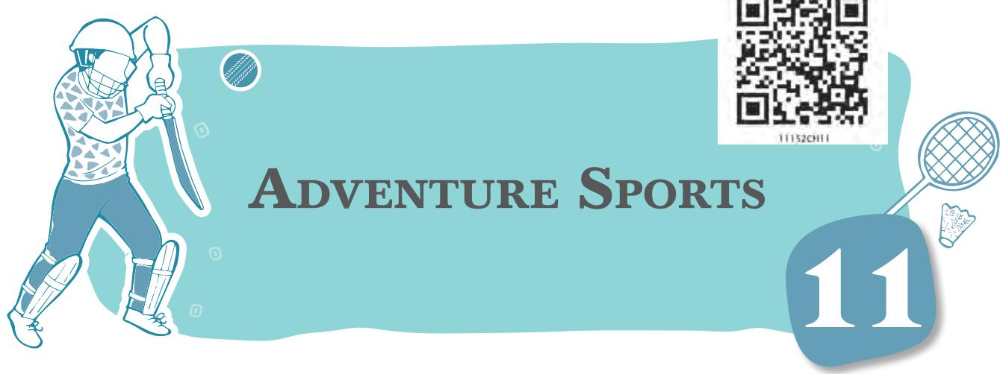
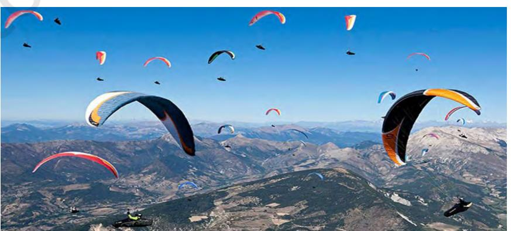
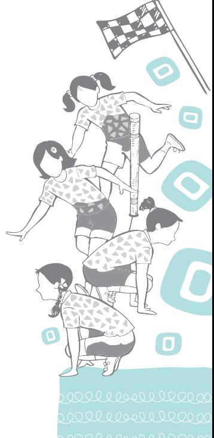
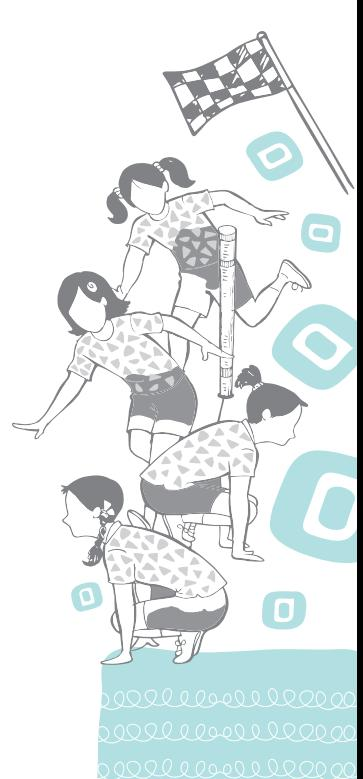
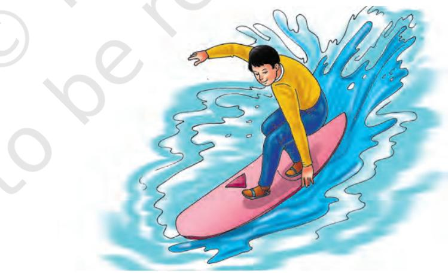
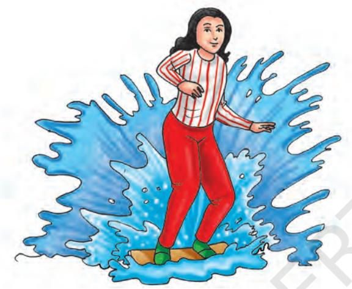
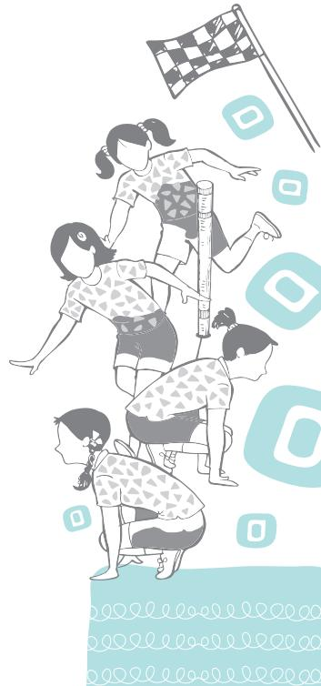
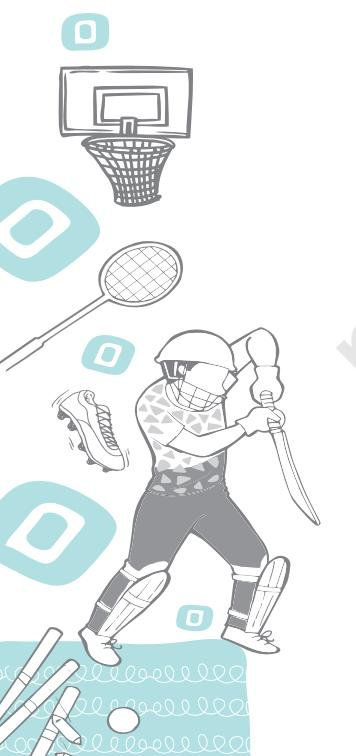
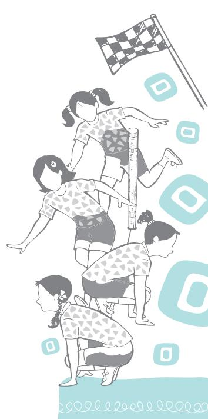

Adventure sports are extraordinary activities performed by individuals who are in search of excitement, extra enthusiasm and have the desire to explore nature. These sports are invented out of adventurous interest of individuals who want to explore nature out of curiosity. During the exploration, different types of adventure sports were discovered, such as, rafting, surfing, mountaineering, trekking, etc. Participation in such sports also helps to fulfil the purpose of satisfying robust human behaviour. These sports are classified as—

- 1. Adventure water sports
Chap-11.indd 328 31-07-2020 15:46:36

2024-25

- 2. Adventure land sports
- 3. Adventure air sports

Further, the adventure sports in all three categories are also divided separately for water (rafting, surfing, etc.), land (mountaineering, trekking, etc.) and air (paragliding, jumping, etc.). The camping has already been discussed in the Class IX book. Here, in this chapter, paragliding and surfing are explained for understanding as these are most exciting and classical adventure sports.

*Fig. 11.1: Paragliding*

## **Paragliding**

Paragliding is the recreational and competitive adventure sport for flying paragliders. Paragliding is engine less or motor free sport and practised by the adventurous people. This type of sports need courage and need to be decisive.

#### *Historical Development of Paragliding*

Domina C. Jalbert, in 1954, invented advanced governable gliding parachutes with multi-cells and controls for lateral glide.

In one of the articles, in *Flight* magazine, Walter Neumark predicted that a glider pilot would be able to launch himself by running over the edge of a cliff or down a slope. French engineer Pierre Lemoigne produced improved parachute designs that led to the Para-commander.

David Barish, during 1965, developed the 'sail wing' that was used to sail slope-soaring as a summer activity for ski resorts.

In the year 1985, Canadian authors Patrick Gilligan and Bertrand Dubois from Switzerland, wrote the first flight manual with the title 'The Paragliding Manual', officially coining the word 'Paragliding'.

#### *Classification of Paragliding*

Paragliding is classified as—

- 1. Light-weight gliding
- 2. Free flying glider
- 3. Foot-launched glider: Foot launched glider is like an aircraft with no rigid primary structure.

#### *Sitting Position*

The paraglider (pilot) sits in a harness, suspended below a fabric wing comprising a large number of interconnected baffled cells. Wing shape is maintained by the suspension lines. Despite not using an engine, paragliders, flight can last many hours and cover hundreds of kilometers. Though, the norms for flight of one to two hours that covers around some tens of kilometers are considered valid for gliding purposes. By skillful exploitation of sources on lift, the pilot may gain height, often climbing to altitudes of a few thousand meters.

#### *First World Championship 1989*

The first official Paragliding World Championship was held in Austria, in 1989.

Chap-11.indd 329 31-07-2020 15:46:37

## 330 Health and Physical Education - XI

#### **Do You Know?**

Canadian Domina Jalbert invented and patented (in 1963) parafoil in an aerofoil shape; an open leading edge and a closed trailing edge, inflated by passage through the air.

## *Strength of Paraglider Structure*

Paraglider lines are usually made from spectra that are immensely strong. For example, a single 0.66 mm diameter line (about the thinnest used) can have a breaking strength of 56 kg. Paraglider wings typically have an area of 20–35 square meters (220–380 sq ft) with a span of 8–12 meters (26–39 ft) and weigh 3–7 kilograms (6.6–15.4 lb). Combined weight of wing, harness, reserve, instruments, helmet, etc., weigh around 12–22 kilograms (26–49 lb).

#### *Speed of Paragliders*

The speed range of paragliders is typically 20–75 kilometres per hour (12–47 mph).

## *Carrying Capacity and Storage of Paragliders*

For storage and carrying, the wing is usually folded into a stuff-sack (bag), which can then be stowed in a large backpack along with the harness. The complete equipment packs into a rucksack that can be carried easily on the pilot's back, in a car, or on public transport.

### *Instruments*

Instruments used in paragliding are—

- 1. Variometer: The main purpose of a variometer is to help a pilot find and stay in the 'core' of a thermal to maximise height gain and, conversely, to indicate when a pilot is in sinking air and needs to find rising air. A variometer also indicates the climb rate or sinkrate with short audio signals (beeps, which increase in pitch and tempo during ascent, and a droning sound, which gets deeper as the rate of descent increases) or a visual display. It also shows altitude — either above takeoff, above sea level or flight level at higher altitudes.
- 2. Radio: Radio communications are used in training to communicate with other pilots, or to report where and when they intend to land. These radios normally operate on a range of frequencies in different locations. In rare cases, pilots use radios to talk to airport control towers or air traffic controllers. Many pilots carry a cell phone so they can call for pickup if they land away from their intended point of destination.
- 3. GPS (Global Positioning System): GPS is a necessary accessory while flying in competitions. The recorded

Chap-11.indd 330 31-07-2020 15:46:37

GPS track of a flight can be used to analyse the flying technique or can be shared with other pilots. GPS is also used to determine drift due to the prevailing wind when flying at altitude, providing position information to allow restricted airspace to be avoided and identifying one's location to aid the retrieval teams after landing out in unfamiliar territory.

## *Flying Techniques*

There are different ways of flying as with all the aircrafts, launching and landing are done into wind. Paragliders, like hang gliders do not 'jump' at any time. There is one assisted launch technique used in flatland areas and two launching techniques used on the higher ground.

- 1. Forward launch: In low winds, the wing is inflated with a forward launch, where the pilot runs forward with the wing behind so that the air pressure generated by the forward movement inflates the wing.
- 2. Reverse launch: In higher winds, a reverse launch is used, with the pilot facing the wing to bring it up into a flying position, then turning around under the wing and running to complete the launch. Reverse launches have a number of advantages over the forward launch.

## *Landing*

Landing a paraglider, as with all unpowered aircrafts which cannot abort a landing, involves some specific techniques and traffic patterns. Paragliding pilots most commonly lose their height by flying a figure of 8 in over landing zone until the correct height is achieved, then line up into the wind and give the glider full speed. Once the correct height (about a meter above ground) is achieved the pilot will 'stall' (pause) the glider in order to land.

## *Control through Speed Bar Mechanism*

Paraglider can be controlled with the help of breaks and accelerator attached with the paraglider. These are the speed bar mechanism called control breaks, which are held in pilot's hand. Breaks are used to adjust the speed of the glider.

## *Types of Competitions*

- 1. Cross-country flying is the classical form of paragliding competitions with championships in club, regional, national and international levels.

Chap-11.indd 331 31-07-2020 15:46:37

## 332 Health and Physical Education - XI

#### **Do You Know?**

George Freeth (8 November 1883–7 April 1919) is often credited as being the 'Father of Modern Surfing'. He is thought to have been the first modern surfer.

- 2. Aerobatic competitions demand the participants to perform certain manoeuvres. Competitions are held for individual pilots as well as for pairs that show synchronous performances. This form is the most spectacular for spectators on the ground to watch.
- 3. In Bivouac flying competitions, a certain route has to be flown or hiked, which may take over several days.

Sky Parachutes have the maximum resemblance with paragliders but the sports are very different. Whereas with sky-diving, the parachute is 'only' a tool to safely return to earth after free fall, the paraglider allows longer flights and the use of thermals.

## **Surfing**

The term surfing refers to the act of riding a wave, regardless of whether the wave is ridden with a board or without a board, and regardless of the stance used. Surfing is an event to be inducted in the Olympic Games from the year 2020. Surfing is a surface water sport in which the wave rider, referred to as a surfer, rides on the forward or deep face of a moving wave, which carries the surfer towards the shore. Waves suitable for surfing are primarily found in the ocean, but waves can also be found in lakes or rivers in the form of standing wave or tidal bore. However, surfers can also utilise artificial waves such as those from boat and the waves created in artificial wave pools.

*Fig. 11.2: Surfing-1*

#### *Historical Development of Surfing*

For centuries, surfing was a central part of ancient Polynesian culture. Surfing may have first been observed by the British explorers at Tahiti in 1767.

Chap-11.indd 332 31-07-2020 15:46:38

## *Governing Body*

The highest governing body for surfing sport is known as International Surfing Association. It is played all over the world. In 1975, professional contests started. That year, Margo Oberg became the first female professional surfer.

## *Types of Surfing*

*Fig. 11.3: Surfing-2*

- 1. Stand-up Surfing: The modern-day definition of surfing, most often refers to a surfer riding a wave standing up on a Surfboard; this is also referred to as stand-up surfing. Long surf-boarding and short surf-boarding are the two types of stand-up surfing. Both long and short surf-boarding have several major differences, including the board design and length, the riding style, and the kind of wave that is ridden.
- 2. Body Surfing or Body Boarding: The surfer riding a wave on a body board, either by lying on the belly, or drop knee, is called body surfing. In body surfing, the wave is surfed without a board, using the surfer's own body to catch and ride the wave, this is very common and considered to be the purest form of surfing.
- 3. Surf Matting: An other type of surfing that is surfed in inflatable mats, using foils, is called surf matting.
- 4. Tow-surfing: Tow-surfing is most often associated with big wave surfing with a motorised water vehicle, such as a personal watercraft, which tows the surfer into the wave front. Water-craft help the surfer to match a large wave's speed, which is generally higher than a self-propelled surfer can produce.

Chap-11.indd 333 31-07-2020 15:46:38

## *Types of Surfboard*

A long board (10 feet) causes more friction with the water, and is slower than a smaller lighter board (6 feet). Longer boards are good for beginners, who need help in balancing. Smaller boards are good for more experienced surfers who want to have more control and manoeuverability.

## *Dangers during Surfing*

## *Seabed*

The seabed can pose danger for surfers. If a surfer falls while riding a wave, the wave tosses and tumbles the surfer around, often in a downwards direction. At reef breaks and beach breaks, surfers have been seriously injured and even killed because of a violent collision with the sea bed, the water above which can sometimes be very shallow, especially at beach breaks or reef breaks during low tide.

## *Rip currents*

Rip currents are water channels that flow away from the shore. Under the wrong circumstances, these currents can endanger both experienced and inexperienced surfers. Since a rip current appears to be an area of flat water, tired or inexperienced swimmers or surfers may enter one and be carried out beyond the breaking waves. Although many rip currents are much smaller, the largest rip currents have a width of forty or fifty feet. However, by paddling parallel to the shore, a surfer can easily exit a rip current.

## *Surfing related Sports*

Surfing-related sports, such as, paddle boarding and sea kayaking do not require waves. Other water related sports such as kite surfing and wind-surfing rely primarily on wind for power, yet all of these platforms may also be used to ride waves. Recently the use of V-drive boats wave surfing, in which one surfs on the wave of a boat, has emerged.

## *Safety and Security in Paragliding and Surfing*

The security and safety of the gliders and surfers have to be kept in mind as there is high risk involved during these adventure sports. Safety measure should be followed and observed by the individuals taking adventure sports.

- 1. A paraglider should be certified and highly skillful before taking adventure sports.

Chap-11.indd 334 31-07-2020 15:46:38

- 2. A paraglider should keep all type of safety instruments before going for paragliding. These instruments are Virometer, Global Positioning System and Radio to get update about all kinds of dangers.
- 3. During practice, proper safety equipments like helmet, knee guards, chest guards and other protective equipment should be worn.
- 4. Gliding should not be permitted without proper assistance (licensed personnel).
- 5. A surfer should recognise the wave current flowing in sea for keeping himself in the safe zone.
- 6. A surfer should also be able to recognise the deep face of the moving wave that can be dangerous sometimes to the surfer.
- 7. Surfer should practise his surfing skills in the artificially created waves before introducing himself in the deep sea.
- 8. Paragliders should inspect their paraglide breaks and other necessary lining for safety measures regularly.
- 9. Enough practice should be done before taking long route paragliding.
- 10. Fitness standard (physical and mental) should be maintained, which is considered as the key factor that helps in meeting out and taking quick decision during any untoward situation.

Chap-11.indd 335 31-07-2020 15:46:38

# **Assessment**

#### **I. Long Answer Questions**

- 1. Write down the use of Variometer in paragliding.
- 2. Explain 'tow- surfing'.
- 3. Discuss the safety measures to keep in mind during paragliding.
- 4. Briefly explain Sea beds and Rip Currents.
- 5. How does Global Positioning System work?

#### **II. Short Answer Questions**

- 1. Name the person who invented paragliding.
- 2. Name the two flying techniques in paragliding.
- 3. Classify the categories of adventure sports.
- 4. In which year, the first world championship for surfing was held?
- 5. What are the different types of surfing?

Chap-11.indd 336 31-07-2020 15:46:38

- 
- 
- 
- 

- 

| 6. | (i) | Certain practical activities and games have been |  |  |
| --- | --- | --- | --- | --- |
|  |  | suggested. How many activities and games have you |  |  |
|  |  | undertaken in your class? Mention them. |  |  |
|  |  | ������������������������������������������������������ |  |  |
|  |  | ������������������������������������������������������ |  |  |
|  |  | _______________________________________________________ |  |  |
|  | (ii) | What difficulties did you face in organising these activities |  |  |
|  |  | and games? |  |  |
|  |  | ������������������������������������������������������ |  |  |
|  |  | ������������������������������������������������������ |  |  |
|  |  | ������������������������������������������������������ |  |  |
|  |  | (iii) Would you like to suggest any activity(ies). Mention these. |  |  |
|  |  | ������������������������������������������������������ |  |  |
|  |  | ������������������������������������������������������ |  |  |
|  |  | ������������������������������������������������������ |  |  |
| 7. |  | Certain questions have been given in boxes in the text of the |  |  |
|  |  | chapters. |  |  |
|  | (i) | Did you try to find out their answers? Yes/No |  |  |
|  | (ii) | Are these helpful in understanding the text of the |  |  |
|  |  | chapter? | Yes/No |  |
|  | (iii) | Do you find these questions interesting? |  | Yes/No |
| 8. | (i) | Do you find the exercise given at the end of each chapter |  |  |
|  |  | in the textbook interesting? Yes/No |  |  |
|  | (ii) | Point out the exercise which according to you should be |  |  |
|  |  | modified. |  |  |
|  |  | Page No. Exercise No. |  |  |
| _________________ _________________ |  |  |  |  |
| _________________ _________________ |  |  |  |  |
| _________________ _________________ |  |  |  |  |
| 9. |  | Point out the printing errors, if any. |  |  |
| _________________ _________________ |  |  |  |  |
| _________________ _________________ |  |  |  |  |
| 10. |  | Any specific comments/suggestions for overall improvement |  |  |
|  |  | ��������������������������������������������������������� |  |  |
|  |  | Page/Para No. Error |  |  |
| _________________ _________________ |  |  |  |  |
|  |  | of the textbook. |  |  |
|  |  | ��������������������������������������������������������� |  |  |
|  |  | ��������������������������������������������������������� |  |  |

