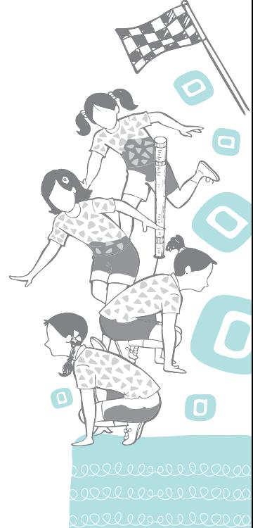
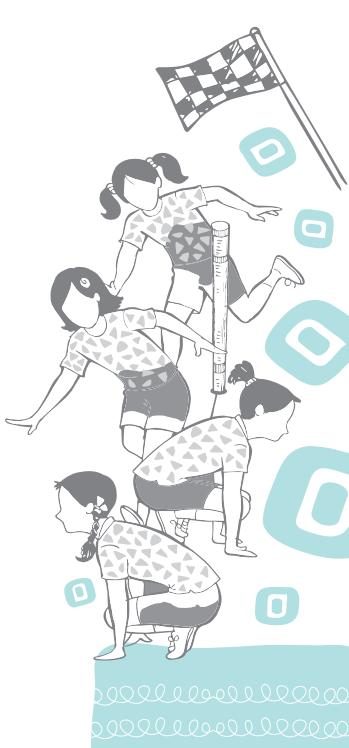

Health is commonly understood as a state of absence of disease. This definition of health is focused only on the ability of the body to function, that may be disrupted from time to time by diseases. However, this definition of health is partial and covers only the physical aspect. In this perspective, the meaning of health has been changing over a period of time. In 1948, the World Health Organization (WHO) defined it comprehensively as "a state of complete physical, mental and social well-being and not merely the absence of disease or infirmity." Health is now referred to as a state of physical, mental, intellectual, emotional and social health and wellbeing. It is the ability to adapt and manage physical, mental and social challenges throughout life. Moreover, it is also the ability of a person to handle stress, acquire skills, and maintain positive relationships. It is widely acknowledged that health is influenced by biological, socio-cultural, economic, and environmental forces. Access to basic needs like, food, safe drinking water supply, housing, sanitation, health services and availability of positive socio-cultural, economic, and environmental settings influence the health status of a population.

# **Health and its Dimensions**

Health, indicates a sound body and a sound mind. It is multidimensional—the dimensions being physical, mental, emotional, social, spiritual and environmental. All these dimensions are interrelated with one another.

### **Physical Dimension**

Physical dimension refers to the ability of a human body to function properly. It involves exercises, healthy habits, balanced diet, bone health, and body mass index. We

Chap-2.indd 15 31-07-2020 15:25:11

can maintain a healthy body by taking proper nutrition, exercising, and avoiding harmful habits such as substance abuse. It is better to consume nutritious foods and beverages that enhance good health rather than those which impair it. Physical wellness is the ability to maintain the quality of life that allows one to get through daily activities without undue fatigue or physical stress. Optimal physical health consists of building physical strength, flexibility, coordinative ability, and endurance while taking safety precautions including medical self-care and appropriate use of a medical system, as well as protecting oneself from injuries and harm. It involves personal responsibility, disease prevention, and care for minor illnesses and also knowing when professional medical attention is needed. Being physically fit and feeling physically well often leads to the psychological benefits of enhanced self-esteem, self-control, determination and a sense of direction.

### **Mental Dimension**

Mental health refers to the cognitive aspects of health that includes thinking, reasoning, remembering, imagining, and learning words. Cognitive aspect is related to the processes of perception, memory, judgment, and reasoning, as contrasted with emotional processes. It refers to the ability of individuals to use their brain and think, process information and act properly. It is our capacity to master new skills, embrace humour, and creativity. A sound mental health plays an important role in shaping our daily activities. It helps individuals in making a complete person. To stimulate our mental health, we can engage in various activities such as questioning critically, involving ourselves in creative, and problem solving activities. Mental health leads to an increase in self-esteem, and thereby leads to confidence in social situations. A sound mental health depends primarily on increased physical activities. Engaging in games and sports regularly keeps us mentally active.

#### **How can we have good mental health?**

- **• Eat healthy food:** There are strong links between what we eat and how we feel. A 'healthy diet' is one that has enough essential nutrient, and provides the right amount of calories to maintain a healthy weight.
- **• Express your feelings:** Whenever we are feeling stressed, then talking about our feelings helps us to stay in good mental health.

Chap-2.indd 16 31-07-2020 15:25:11

- **• Play games and sports you like:** What do you love to play? Playing Hockey, Cricket, Chess or any other game or doing an activity you enjoy or you're good at, boosts your self-esteem. It helps you to concentrate, sleep, look, and feel better. Enjoying through games helps in beating stress also.
- **• Get enough sleep:** Every day our body needs time to rest and heal. Sleep for about eight hours is must for all, especially for children.
- **• Spend time with friends and family:** Friends and family can make you feel cared for. They can offer different views to your problems, and the tension you are feeling. This helps in better understanding of the problem or situation and thus in solving the problems.
- **• Ask for help:** None of us is perfect in all aspects. We all have problems when things go wrong or get tired at times. If you feel that you cannot cope up with the situation, and things are getting too much, then do not hesitate to ask for help.
- **• Do not consume tobacco products or alcohol:**  Tobacco and alcohol result in illness in proportion to the consumption. Learn to say 'No' to your friends in such situations.

### **Social Dimension**

This dimension of health refers to the ability of individuals to interact with others in the socio-cultural environment. A sound social health helps us in maintaining healthy relationships with others. Good social health includes not only having positive relationships but behaving appropriately and maintaining socially acceptable standards. It focuses on creating and maintaining healthy, and supportive relationships with family, neighborhood, friends, peers, teachers, and community members. Good communication skills help in establishing sound relationships. These relationships impact a person's life the most.

Social health also affects the other dimensions of health in many ways. A bad social life, many a times, lead individuals to question their purpose in life or feel isolated and unwanted. Such feelings can de-motivate individuals from physical activity and push them towards depression.

### **Emotional Dimension**

Emotional dimension of health is another important ability to cope, adjust and adapt to our environment. People with

Chap-2.indd 17 31-07-2020 15:25:11

#### **Activity 2.1**

- **•** List actions and activities to make 'greener' lifestyle, at home and at school.
- **•** Review and find out how far you are able to achieve the objective of becoming 'greener'.
- **•** Motivate others to adopt life style which promote greening the environment.

positive mindset tend to be more successful. It is a commonly used statement that 'individuals become the type of person like the friends they have'. It means that the friends and other people who live together in the immediate environment play a very important role in personality development and emotional wellness. Some of the techniques which help in having stable emotional health include: reading inspirational books, setting goals, learning how to deal with setbacks, acquiring characteristics such as hope, enthusiasm, and positive thinking.

#### **Spiritual Dimension**

There are different belief systems that exist all around the world. The spiritual beliefs will help the individuals discover and pursue their own value and belief and a sense of overall purpose in life. Generally, people often find their purpose from a belief or faith system while others create their own school of worship. A person who has a purpose in life is said to be healthier than those who do not have it.

Spiritual health easily affects emotional and mental health as having a purpose in life can help you to apply yourself to achieving goals. Having a purpose in life can also help people to maintain a proper perspective of life and overcome adversity. Often people who are spiritual, meet together regularly around their spiritual purpose, which helps to improve their social health also.

#### **Environmental Dimension**

Environmental health inspires us to live a lifestyle that is beneficial for our surroundings. It encourages us to live in harmony with the nature by taking action to protect it. Our environment consists of external and internal factors. Our surroundings such as our habitat, occupation, pollution levels at the places where we live and work constitute our external environment. A healthier planet leads to healthier inhabitants. The internal environment refers to an individual's internal structure in the form of genetic composition, which is very crucial in determining the health and wellness of human beings. Other environmental factors which include our family, friends, neighbourhood, community, habitat, all have an impact on our health.

The core principle of environmental wellness is respect for nature and all the species living in it. Environmental wellness does not mandate you to join a movement or organisation, but it does encourage you to practise habits that promote a healthy environment. When you become environmentally

Chap-2.indd 18 31-07-2020 15:25:11

aware, you will be able to realise how your daily habits affect the environment. Improving environmental wellness is simple and results in a more balanced lifestyle.

# **Health Needs of Children, Adolescents and Differently Abled**

Health of the children is a critical concern for all societies, since it contributes to their overall development. The age group category of children includes toddlers, infants, and kids in the age-group up to 9 years, adolescents in the age-group from 10 to 19 years, and differently abled belonging to both the age-groups. Health, nutrition, and education are important for the overall development of the children, so that they grow as empowered members of the society and responsible citizens of the nation. The criticality of health concerns of all the groups need multi-dimensional response, depending upon their specific age, and socio-economic and educational status of the parents.

### **Health Needs of Children**

Childhood is the stage during which the foundation of healthy life is laid. The physical, mental and social health needs are significant for the overall development of the child. The basic health needs of the children belonging to pre-natal, postnatal and childhood stages are related to food and nutrition, immunity, positive family and social environment. Children in India continue to lose their lives to vaccine preventable diseases, such as, measles, which remains the biggest killer. The major cause of mortality and morbidity among children is a group of disease conditions like, diarrhoea, pneumonia and fevers which occur due to lack of immediate treatment by the family and non-availability of adequate health services. Besides, poor living conditions and lack of response to basic needs of children are also responsible factors. Even those who survive these hurdles, by the time they reach school, they may be underweight, malnourished, and susceptible to multiple illnesses.

There is an urgent need to adopt a multi-pronged strategy to ensure adequate response to the health needs of children. Besides ensuring availability of quality health and nutrition services, reducing mortality rates, and improving access to education and skill development should be given priority. All children must undergo the entire course of vaccination and this process must continue. To attain these goals, it is essential to make the people aware about the urgent

Chap-2.indd 19 31-07-2020 15:25:11

need of all the age-groups and ensure that these needs are responded well in time and health, and nutrition services are utilised. The process of governance must make sure that these services are availed by all including the marginalised sections of the society.

#### **Health Needs of Adolescents**

Adolescents constitute about one-fifth of India's population. As you have already learnt, adolescence is a period of transition from childhood to adulthood and a critical period for the development of self-identity. The process of acquiring a sense of self-awareness is linked to physical, physiological, mental, and emotional changes. It is also a phase of learning to negotiate the social and psychological demands of being young adults. Responsible handling of issues like, independence, intimacy and peer group dependence are concerns that need to be recognised, and appropriate support be given to cope with them. Adolescents are confused about sudden changes taking place in their bodies and minds. As a result, they face many doubts regarding numerous concerns, and health related uses. Many adolescents experience tension, and stress and respond differently on different occasions.

There are concerns about growing too tall or not gaining height, growth and development of body parts, and so on. Worrying about pimples on the face is a common problem during adolescence.

Adolescence is also a time when there is a temptation to experiment, which leads them to indulge in various negative behaviours. The process of distancing from parents and dependence on peer group also lands them in confusing situations. No doubt the peer group provides positive impact but quite often it leads them to adopt negative behaviour. The most common is drug abuse. As a result, there are chances of their becoming addicted to smoking and various kinds of drugs. Initially, the young people take these for fun, relaxation, or

Chap-2.indd 20 31-07-2020 15:25:12

to get out of tension and stress. But later there are higher chances of one becoming addicted to these. Unfortunately, the earlier one gets into the habit of substance misuse, the greater are the chances of addiction, and serious diseases like cancer, and heart diseases during adult age.

Major health needs and problems among adolescents include nutritional disorders (malnutrition as well as obesity), substance abuse, high risk sexual behaviour, stress, mental disorders, and injuries (including road traffic injuries, suicides, and different types of violence). Many of these are precursors of communicable and non-communicable diseases (including mental disorders), and injuries, which inflict high morbidity, mortality, disability, and economic burden on adolescents, their households, and health systems. Moreover, the addiction to internet, especially to social media, has been increasingly keeping them under great stress, leading them to undergo depression and selfharm. They need help and guidance to pass over this period smoothly. They need counseling and healthcare advice, as well as treatment.

### **Health Needs of the Differently Abled**

You would have observed that the differently-abled children are often hidden in their homes. Usually this type of discrimination starts in the family. It exists at various levels such as, education centers, work places, and in healthcare facilities and so on. Due to the stigma associated with disabilities, the families also become the victims of discrimination. As a result, the differently-abled children face chronic ill health, socio-economic burden, and isolation.

According to World Health Organisation, disability is an umbrella term, covering impairments, activity limitations, and participation restrictions. Disability is thus not just a health problem but is a complex phenomenon, reflecting the interaction between features of a person's body and features of the society in which they live.

The National Policy for Persons with Disabilities (2006) recognises that the persons with disabilities are valuable human resources for the country. It seeks to create an environment that provides equal opportunities, protection of their rights and full participation in society. The *2030 Agenda for Sustainable Development* has also highlighted about the needs and issues of 'Persons with disabilities' and 'Persons in vulnerable situation'.

Therefore, taking care of physical, social and emotional well-being of such a population is a major challenge. Many policies and welfare schemes have been planned in the

#### **Activity 2.2**

Discuss with your classmates —how and why excessive use of social networking site is depressing and self harming?

#### **Do You Know?**

About 2.21 per cent of the total population of India is 'disabled'. The highest number of disabled persons in India is from the State of Uttar Pradesh. At all India level, 7.62 per cent of the disabled persons belong to the age group of 0–6 years. Focus today is on inclusive education.

*Source: Census 2011*

Chap-2.indd 21 31-07-2020 15:25:12

#### **Activity 2.3**

- **•** Prepare a chart on the Disability Act 2016.
- **•** Observe your surroundings and analyse how far the act has been implemented.
- **•** List the actions you can take and share with your classmates.
- **•** Collect information about various programmes and schemes for differently-abled individuals and share it in the morning assembly.

field of education and health to overcome various difficulties faced by the differently-abled individuals and their families. The focus is on 'inclusive development' for the welfare of differently-abled persons which is an important milestone towards sustainable development.

#### **Health Status of Children in India at a Glance**

- **•** At all India level, the sex ratio in the age groups 0–6 years and 0–14 years are 918 and 916 respectively whereas it is 943 for all ages and also is not favourable to females in many of the States and UTs.
- **•** As per Sample Registration System (SRS)-2016, there has been substantial reduction in the Infant Mortality Rate (IMR) at all India level from 46 in 2011 to 34 in 2016. Among the bigger States and UTs, IMR varies widely from 10 in Kerala to 47 in Madhya Pradesh. The IMR for female has been reported at 36 against 33 for male.
- **•** Under-five Mortality Rate (U5MR) estimated at 39 for 2016 at all India level varies significantly in rural (43) and urban areas (Data). Among the bigger States and UTs, U5MR varies from 11 in Kerala to 55 in Madhya Pradesh.
- **•** At all India level, 28 per cent of children had mild anaemia, 29 per cent had moderate anaemia, and 2 per cent had severe anaemia in 2015–16.
- **•** National Family Health Survey (NFHS-4) (2015–16) shows that at all India level, 38 per cent of children under five years of age are stunted (too short height for their age) which is an improvement from 48 per cent in 2005–06. It is higher among children in rural areas (41%) than that of urban areas (31%).
- **•** Five states with higher prevalence of stunting in children under five years age are Bihar (48%), Uttar Pradesh (46%), Jharkhand (45%), and Meghalaya (44%), whereas it is lowest in Kerala and Goa (20% in each).
- **•** At all India level, 21 per cent of children under five years age are wasted. It varies in the range of 6 per cent in Mizoram to 29 per cent in Jharkhand.
- **•** The prevalence of anaemia among children in age group 6–59 months is highest among children in Haryana (72%) and lowest in Mizoram (19%).
- **•** At all India level, 62 per cent of children of age 12–23 months received all basic vaccinations at any time before the NFHS -4, and 54 per cent received all basic vaccinations by 12 months of age.

Chap-2.indd 22 31-07-2020 15:25:12

- **•** National Crime Records Bureau (NCRB) data reveals that the rate of crime against children (below 18 years of age) has increased to 24 per lakh children in 2016 from 21.1 in 2015.
- **•** Under Protection of Children from Sexual Offences Act, 2012 (POCSO) crimes reported are as high as 34.4 per cent of the total crime against children.

# **Addressing the Health Needs of Children**

Institutions, teachers and reviewers play an important role in addressing the health needs of children. These are discussed below.

### **Role of Schools**

Schools play a vital role in promoting the health and safety of young people and helping them to establish lifelong healthy behaviours. It is easier and more effective to develop healthy behaviours during childhood than trying to change unhealthy behaviours during adulthood. Many health risks behaviours are often established during childhood or adolescence and continued into adulthood. The following are the leading causes of diseases, death, disability, and social problems:

- **•** Inadequate physical activity
- **•** Unhealthy diet
- **•** Substance misuse (Tobacco, alcohol and other drug use)
- **•** Stress
- **•** Behaviours that contribute to unintentional injury and violence
- **•** Risky behaviours that can result in HIV infection, other sexually transmitted infections (STIs) and unintended pregnancy.

Regular physical education classes can help children to develop a healthy lifestyle.

### **Role of Teachers**

Teachers have a very important role to play during the period spent in schools. They need to understand and address the diverse needs of their students through innovative teaching methods, counseling and referral to specialists wherever required. They need to work closely with the parents and community on sensitive issues and the emerging challenges being faced by the children. The teacher can plan various needbased health promotion programmes for the empowerment of children such as, engaging in games and sports, physical activities, curricular and extra-curricular activities, nutrition education programmes, and preventive measures for substance misuse.

Chap-2.indd 23 31-07-2020 15:25:12

#### **Role of Adolescent-friendly Health Services**

The children during adolescence are usually considered a healthy cohort. They generally do not have any medical problem. They just want to have some more information or knowledge about some of the concerns that may be troubling their mind. Often they do not get any proper answer for their concern and get frustrated and feel lost. They can easily be misled, and hence get into wrong habits and adopt risky behaviours.

Adolescents are often quite reluctant to share many of their problems with parents, family members and teachers. They feel scared, ashamed or shy to discuss their problems with them since they believe that these people will get upset and will not be sensitive to their concerns. That is why, we need to encourage them to speak about their personal concern to someone whom they trust.

One of the emerging health needs of the adolescents is accessibility and availability of health services for various health issues. The healthcare workers can play an important role in making the services adolescent-friendly and encouraging them to use the health services more often. These services are provided by trained healthcare workers in adolescent-friendly health centres. These centers are being established by the government in the form of adolescentfriendly health clinics. The adolescents feel shy and are reluctant to use health services. Some of the reasons are lack of privacy or confidentiality, lack of patience and sensitivity among the health workers, and also lack of friendly behaviour from them.

#### **Role of Peer Educator or Peer Facilitator**

Training or providing education to some adolescents who can help, educate or counsel other adolescents is emerging as a powerful technique for addressing the health needs of the adolescents. Such adolescents are called as 'Peer Group Facilitator/Educators'. They can help the adolescents to remove their shyness to talk to their parents, family members and teachers.

Training is given to the children of senior classes to understand and guide to the best of their ability to address the health needs of friends, peers, and other children in the community. But at the same time, one should be aware of one's limitations while giving information regarding sensitive issues and problems. Refer them to teachers or adolescent friendly services for appropriate support. As peer facilitator,

**Activity 2.4**

Does your school provide training to be a peer facilitator? If not, please discuss it with your class teacher. Ask your school to take up the training of peer group educator/facilitator.

Chap-2.indd 24 31-07-2020 15:25:12

one can help the teacher in organising various activities related to adolescents' issues and concerns.

#### **To be a peer group educator/facilitator, you should**

- **•** be a good listener.
- **•** have knowledge about various health issues of the children during adolescence age.
- **•** be friendly, influential and acceptable to adolescent children.
- **•** be trusted and truthful.
- **•** use creative and innovative approach while dealing with problems.
- **•** be non-judgmental.
- **•** practice confidentiality.
- **•** be a good role model in the school and society.

## **Lifestyle and Wellness**

Everyone wants to look good and healthy. Maintaining a healthy lifestyle requires commitment. Strong desire, dedication and motivation play an important role in accomplishing a healthy lifestyle.

We all make New Year's resolution and set a goal to change some things in a more meaningful manner in our life. One aspect, which most of us think to modify in our life relates to our body weight, physical and mental health, or our personality. Many are able to stick to these goals, but many of us fail also. It is difficult but not impossible to make changes in lifestyle especially with regards to engaging in regular physical activities or games.

With respect to our health, how do we sustain such goals is the most difficult question. We need to work out many strategies to motivate us to continue keeping health goals in sight. So being regular with physical activities, games, or sports that you wish to play or restricting eating junk food on a weekly basis or on most of the days is the key to maintain good physical and mental health.

## **Healthy Lifestyle and Health Goals**

A healthy lifestyle does not become part of our life in an instant. It is a series of choices we make every day consciously and continuously. Initially, the changes of opting a healthy lifestyle and undertaking wellness activities are difficult, but if we persist, it becomes a part of our new healthy behaviour. Therefore, it is important that healthy lifestyle activities are

#### **Activity 2.5**

You have read about lifestyle diseases in your previous classes. Can you list some of these? Also discuss about their prevention.

Chap-2.indd 25 31-07-2020 15:25:12

adopted as part of our life from early childhood and adolescent period itself. This helps to prevent or reverse the adverse effects of lifestyle disorders such as, poor eating habits and physical inactivity. In order to maintain health goals we can try the following strategies:

*Set positive health goals*: Having positive health goals keeps us motivated to follow goals with energy and enthusiasm. For example, a student may decide, 'I will skip dinner daily'. This is a determination with a negative mind. This type of goal does not train our mind for healthy lifestyle. Instead, the goal could be, 'I will eat healthy food'. This helps to make healthy food choices. Similarly, one can decide, "I will firmly say 'NO' to Tobacco use". Such goals help us to reinforce positive behaviours in the long term.

*Set realistic goals:* You would agree that many times we set health goals but fail to achieve them. For example, we may decide to exercise at least five days a week. But we have not been able to do so for about two weeks now. Gradually we lose track of our goal and we feel that now it's difficult to exercise. We slip into the attitude of either we follow it every day or none. This is because we give up as we have not been able to exercise for five days due to lack of time. In such situations, we should not feel guilty of failure. Rather we should re-visit and re-plan our goals related to regular physical activity or playing games, considering the real situations in our life.

# **Few Tips for Meeting Health Goals**

Decide your health goal. Keep it easy for you to begin the act. Keep them 'SMART'. Think what problems could come in your way and how you can overcome these problems.

- **S - SPECIFIC:** I will do jogging.
- **M - MEASURABLE:** For at least 30 minutes, daily or three/four days in a week.
- **A - ACHIEVABLE:** For five days in a week.
- **R - RELEVANT:** I will reduce my body weight.
- **T - TIME BOUND:** I will follow this schedule throughout the year.

Given below are some other aspects related to health. Write in the table below as per the 'SMART' goal to remain healthy.

Chap-2.indd 26 31-07-2020 15:25:12

|  | Health Goals |  |  |
| --- | --- | --- | --- |
| My Smart Goals are | Diet | Physical Activity | Any other |
| Specific |  |  |  |
| Measurable |  |  |  |
| Achievable |  |  |  |
| Relevant |  |  |  |
| Time-Bound |  |  |  |
| Weight |  |  |  |

# **Efforts for Achieving Health Goals at International Level—Sustainable Development**

# **Goals (SDGs)**

The Millennium Development Goals (MDGs) were related to basic development issues. These were target-based, time bound and have been among the most successful global goals. Among the list of eight MDG goals, three were related to health. These goals stressed the importance of health challenges at the global level.

*Fig. 2.2: Millenium development goals*

The SDGs are also, known as 'Transforming our world: the 2030 Agenda for Sustainable Development'. There are 17 Global Goals having 169 targets. SDGs also carry forward the unfinished agenda of MDGs for continuity and to sustain the momentum generated. These also aim to address the challenges of inclusiveness, equity, and urbanisation.

*Fig. 2.3: Global goals for sustainable development*

Chap-2.indd 27 31-07-2020 15:25:12

The third SDG—'ensure healthy lives and promote wellbeing for all at all ages'—is wide-ranging as compared to the health goals in MDGs that were limited to child and maternal mortality and communicable diseases. The most important feature of SDG3 is universal health coverage which means to provide 'access to good quality health services without financial hardship for people in need'.

The adolescents face challenges to their healthy development due to a variety of factors. Some of these include poverty, social discrimination, inadequate education, early marriage, and child-bearing. It is speculated that investments in adolescents will have an immediate, direct, and positive impact on India's health goals.

#### **Project on Sustainable Development**

Prepare a project on any one SDG and focus on the following:

- **•** Collect information about the targets set by UN for that goal.
- **•** Describe what actions have been taken by our Government related to that goal?
- **•** How can you contribute towards achieving the goal?
- **•** You can make a poster related to the theme of this SDG. Place it in the classroom and discuss.

# **Contribution of Physical Education for Promoting Health and Well-being**

Physical health and mental health are inseparable. Daily exercise is important for gaining, reducing, or maintaining weight. Physical activities are fundamental for energy balance, and weight control.

These are important lifestyle related health determinants. Low levels of physical activity pose the greatest public health problems in India and many countries around the world.

Many lifestyle diseases today are because of lack of physical activities. Physical activity for a longer duration leads to deterioration of the essential body functions. A 20–30 per cent increased risk in all-cause mortality was seen in people with insufficient physical activity as compared to those who were involved in at least 150 minutes of moderateintensity physical activity each week. (WHO, 2010)

Physical activity leads to maintenance or improvement in the functioning of the organs. It provides essential stimuli for most organs of the human body, in order to develop and maintain their structures and functions of life.

Chap-2.indd 28 31-07-2020 15:25:12

Physical activity is a key determinant of energy, balance, and weight control. The beneficial effects of physical activity go beyond controlling excess body weight. It reduces the risk for cardiovascular diseases, diabetes, blood pressure, and cancer. It improves the level of high density lipo protein cholesterol, improves the control of blood glucose in overweight people, even without significant weight loss.

**WHO recommendations about physical activities for children and adolescents aged 5–17 years**

- **•** Should do at least 60 minutes from moderate to vigorousintensity physical activity daily.
- **•** Physical activities for more than 60 minutes daily will provide additional health benefits.
- **•** Should include activities that strengthen music and bone, at least thrice in a week.

#### **For age group 18–64 years**

- **•** Should do at least 150 minutes of moderate-intensity physical activity thoughout the week, or do at least 75 minutes of vigorous-intensity physical activity thoughout the week, or an equivalent combination of moderate and vigorous-intensity activity.
- **•** For additional health benefits, adults should increase their moderate-intensity physical activity to 300 minutes per week, or equivalent.
- **•** Muscle-strengthening activities should be done involving major muscle groups on two or more days a week.

Chap-2.indd 29 31-07-2020 15:25:12

# **Assessment**

#### **I. Long Answer Questions**

- 1. What are the common health needs of adolescents?
- 2. List all the dimensions of health and explain the emotional and spiritual dimensions briefly.
- 3. What are MDGs, and SDGs? How are these important for the world?
- 4. What are the benefits of engaging in regular physical activity to the adolescents and the young?
- 5. Explain the physical and mental dimensions of health.
- 6. How can we get good mental health? Explain.

#### **II. Short Answer Questions**

- 1. List some reasons due to which the adolescents do not utilise health services.
- 2. List important signs of stress and tension among the adolescents.
- 3. What are the causes of lifestyle diseases?
- 4. What are the benefits of setting positive health goals?
- 5. How much population of India is disabled currently?

#### **III. Fill in the Blanks**

- 1. Health is commonly understood as a state of absence of ___________ .
- 2. The Millennium Development Goals (MDGs) helped in focusing global attention and resources towards basic ___________ issues.
- 3. Health indicates a sound ___________, and sound ___________ .
- 4. ___________ of health refers to the ability of individuals to interact with others in the socio-cultural environment.
- 5. Health of the children is a critical concern for all societies, since it contributes to their ___________ .
- 6. Schools play a vital role in promoting the health and safety of young people and helping them to establish lifelong ___________.
- 7. ________________ is a key determinant of energy expenditure, energy balance, and weight control.
- 8. The SDGs, known as 'Transforming our world: the 2030 Agenda for Sustainable Development' is a set of ________________ Global Goals with ________________ targets between them.

Chap-2.indd 30 31-07-2020 15:25:12

#### **IV. State whether True or False**

- 1. Health is influenced by biological, socio-cultural, economic, and environmental factors.
- 2. Lifestyle diseases are—Typhoid, Malaria, and Tuberculosis.
- 3. Mental health refers to the cognitive aspects of health that includes thinking, reasoning, remembering, imagining, and learning words.
- 4. Childhood is the stage during which the foundation of healthy life is laid.
- 5. Physical health and mental health are separable.
- 6. Not everyone wants to look good and healthy.

#### **V. Skill based Questions**

- 1. Find out the status of anaemia among the boys and girls in your State. What schemes have been developed by your State and the Government of India to tackle anaemia?
- 2. You have read about healthy diet in previous classes. Make a diet chart for an adolescent boy in the age group of 14–17 years.
- 3. Make a project on lifestyle diseases. What are the major lifestyle diseases? Discuss how one can prevent the lifestyle diseases.
- 4. Find out the desired minimum levels of physical activities for children, adolescents, and adults in different age groups.

Chap-2.indd 31 31-07-2020 15:25:13

