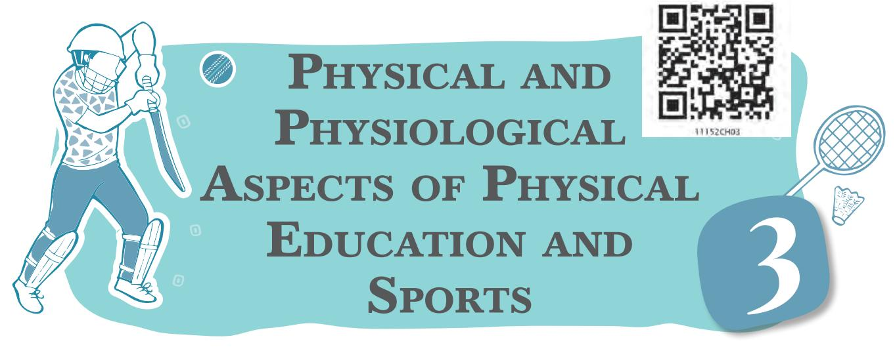

Physical and physiological aspects of physical education and sports include growth and development, heredity and environment, and differences between growth and development. Factors affecting growth and development, and physical and physiological changes occurring during developmental stages are also discussed in this chapter. Physiological aspects include activities like warming up, conditioning and cooling down, effects of exercises on muscular, digestive, circulatory, and respiratory systems. These are also the part of this chapter.

# **Growth and Development**

The terms growth and development are used in various aspects of life. Growth can be explained as becoming bigger or larger. Growth is termed as a physical change, whereas development includes physical, social, and psychological changes. Development also means transformation or improvement. Growth is related to quantitative improvement. Development is related to quantitative as well as qualitative improvement.

## **Growth**

Growth refers to the process through which the body increases in size and shape. It is a biological process. In other words, growth means increase in mass. From the time of conception, the process of growth starts in the mother's womb. The fertilised egg continues to grow and after birth this process goes on till complete physical maturity is obtained. Growth is thus, a quantitative increase in size and shape. Physical growth refers to these changes in size and shape of different organs of the body, each of which normally proceeds at a different rate. Growth therefore, is a

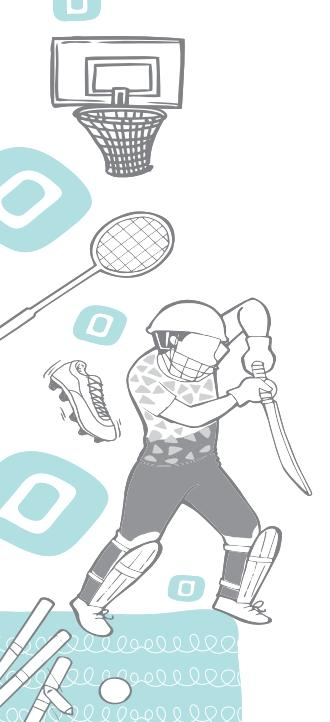

Chap-3.indd 32 31-07-2020 15:25:39

tangible biological process in which the organism gains in terms of size, volume, height, and weight.

## **Development**

Development is related with advancement and a progressive series of qualitative changes. Development processes have greater relationship with external factors than growth. Proper development cannot take place unless external factors such as nutrition, activity, and protection from diseases, and other socio-cultural influences are well ensured. More specifically development can be defined as the emerging and expanding of capabilities of the individual. Growth forms the basis for the development of functional capacities of the child. Without proper growth, probably the required level of development may not be achieved at a given stage. Acquisition of skills and knowledge also indicates developmental process. Although growth comes to end at some stage of life, development continues till death.

| Growth |  | Development |  |  |  |  |
| --- | --- | --- | --- | --- | --- | --- |
| Growth is visible. |  | Development can be observed. |  |  |  |  |
| Growth is quantitative. |  | Development is quantitative as well as |  |  |  |  |
|  | qualitative. |  |  |  |  |  |
| Growth comprises of height, | Along with | the | physical |  | changes, |  |
| weight, size, and shape of body | cognitive, | social, | and |  | emotional |  |
| and its organs. |  | changes are also included. |  |  |  |  |
| It is due to cell division. |  | It happens due to motor and mental |  |  |  |  |
|  |  | processes and their interplay. |  |  |  |  |
| Growth is for limited period. |  | Development is a life long process. |  |  |  |  |
| Growth can be measured | It can | be observed | by |  | matured |  |
| objectively. | behaviour. |  |  |  |  |  |
| Growth tells about one aspect of |  | Development deals with all the aspects |  |  |  |  |
| the personality and is limited in |  | of personality and has a vast scope. |  |  |  |  |
| scope. |  |  |  |  |  |  |
| Growth can be measured and | Development | is | more | related |  | to |
| continues up to certain age of an | qualitative | aspect | and | difficult |  | to |
| individual. |  | measure for instance, mental ability, |  |  |  |  |
|  |  | academic achievement, etc. |  |  |  |  |
| The limits of the growth are set by |  | Development is more affected by the |  |  |  |  |
| the heredity of an individual. |  | environment available to the person. |  |  |  |  |

## **Table 1: Difference between Growth and Development**

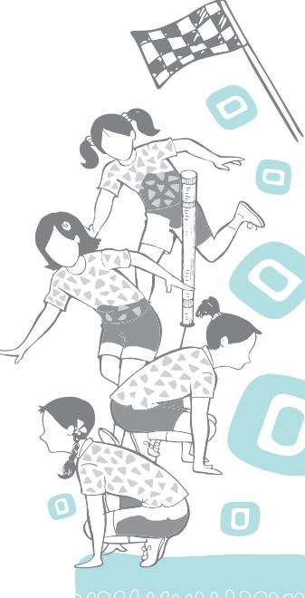

# **Factors Affecting Growth and Development**

The following factors influence the growth and development of a living organism.

## **Heredity**

Heredity is a biological process that plays an important role in the transmission of physical and social attributes from parents to their children. Height, weight and structure of the body, colour of hair and eyes, intelligence, aptitudes, and instincts of the child are highly influenced by heredity.

The behaviour of a living organism is influenced by two factors—heredity and environment. The biological or psychological characteristics which are transmitted by the parents to their children are known by the name of heredity. It is a biological process of transmission of certain traits of appearance and behaviour of the parents towards their offsprings. Heredity traits are innate, they are present at birth. The essential characteristics inherited by all human beings are physical structure, reflexes, innate drives, intelligence, temperament, etc.

## **Environment**

Environment plays an important role in human life. Psychologically a person's environment consists of the sum total of the stimulations (physical and psychological) which is received from the conception. There are three different types of environment, such as—

- 1. Physical: It consists of all outer physical surroundings. These are both animate and inanimate which have to be manipulated in order to provide food, clothing, and shelter. Geographical conditions such as weather, climate, and physical environment also have considerable impact on an individual child.
- 2. Social: It is constituted by the society, individuals, institutions, social laws, and customs that regulate human behaviour. It refers to the physical and social setting in which a child lives. It includes culture, education, human settlement, etc.
- 3. Psychological: It is rooted in an individual's reaction with an object and situation. One's love, affection, emotion, and feeling of friendship and brotherhood will strengthen human bond with one another.

Environment is the sum total of the surroundings in which an individual has to live. It is generally divided into two categories—natural and social. Natural environment

Chap-3.indd 34 31-07-2020 15:25:39

refers to all those things and forces on, and around the earth that are natural and influence a person. Social environment means the environment which one sees around oneself on acquiring consciousness in the society, i.e., languages, religions, customs, traditions, means of communication, means of luxury, family, school, social groups, etc.

**Role of Heredity and Environment on Growth and Development**

- **•** Heredity is responsible for all the inborn traits, instincts, emotions, and physical traits.
- **•** Environment is responsible for the growth and development of the mental and social traits.
- **•** The two forces heredity and environment are complementary to each other like seed and soil, ship and wave, etc.

So growth and development are regulated by the surrounding environment of a child, or where an individual lives.

## **Gender**

Gender acts as an important factor in human growth and development. Boys in general are taller, heavier in comparison to the girls but girls demonstrate early physical growth during adolescence than boys. The body composition and structural growth of girls are different from boys.

## **Nutrition**

Growth and development of the child depends on food habits and nutrition. The human body requires an adequate supply of calories for its normal growth and this requirement varies with phases of development. Malnutrition has an adverse effect on the structural and functional development of the child.

## **Exercise**

Physical exercises have positive impact on growth and development of the children. The functional activities come in the form of exercises of the body. It means growth through use and atrophy (the reverse of growth) through disuse.

The growth of muscles from the normal functioning of the child is a matter of common knowledge. It is a fact that repeated physical activity builds the strength of the muscle. The increase in muscular strength is mainly due to better circulation and good stimulation supply of nutrients and oxygen to the muscles. Play and other physical activities provide for the growth and development of skeletal muscles.

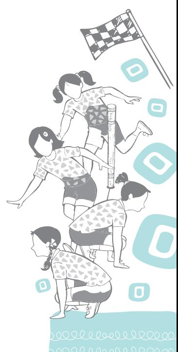

#### **Hormones**

Hormones are chemical substances and play an important role in regulating the process of growth and development. There are many endocrine glands present inside our body. Endocrine glands are ductless glands and are situated in some specific parts of the body. These glands make internal secretions locally and produce one or more hormones.

Hormones are physiological substances having the power to increase or decrease the activity level of the body or certain organs of the body. For example, thyroid gland releases thyroxin hormone which influences the skeletal and muscular growth. In the absence of this hormone in appropriate proportion, growth and development is affected.

Similarly, the adrenal glands are situated very close to kidneys. These secrete adrenaline, which is responsible for strong and rapid heartbeat, release of stored sugar from liver and controls blood pressure. Gonads are repoductive glands, which secrete hormones that affect our growth and sexual behaviour.

## **Learning and Reinforcement**

Learning is the most important and fundamental topic in the whole science of psychology. Development consists of maturation and learning. Learning includes much more than school learning. Learning goes to help the child in the physical, mental, emotional, intellectual, social, and attitudinal developments. All knowledge and skill, all good and bad habits, all acquaintances with people and things, all attitudes built up while dealing with people and things are learned.

Reinforcement is an important factor in learning. Exercise or activity is necessary for learning. It may be a motor activity, as in playing on a musical instrument, or it may be a sensory activity as in listening to a piece of music. Whatsoever, there must be activity in some form. 'Learning by doing', is an old psychological proverb. Now it is accepted that, activity should be repeated till we get the desired results. So the saying should be replaced as 'learning by doing and getting results'.

#### **Pollution**

According to studies, air pollution not only affects the respiratory organs but also has harmful effects on human growth. Indoor pollution or the pollution from housing conditions can result in ill health which can negatively impact human growth and development. For example, lead exposure from deteriorated lead-based paint in older housing can be very harmful. Lead is very harmful for children as it simply gets immersed into the growing bodies of children and obstructs the normal development of brain and other organs and systems.

## **Socio-economic Status**

Socio-economic factors definitely have some effect. It has been seen that children from different socio-economic background vary in average body size at all ages. The families with high income are primarily more advanced. The most important reasons behind this are better nutrition, better facilities, regular meals, sleep, and exercise. Family size also influences the growth rate, as in big families with limited income, sometimes children do not get the proper nutrition and hence the growth is affected.

# **Physical and Physiological Changes During Developmental Stages**

## **Early Childhood**

Early childhood is a time of tremendous growth across all the areas of development. Physically, between birth and age of three, a child typically doubles in height and quadruples in weight. A typical three-year-old might have mastered many skills, including sitting, walking, toilet training, using a spoon, scribbling, and sufficient hand-eye coordination to catch and throw anything. Between three and five years of age, children continue to grow rapidly and begin to develop finemotor skills. By the age of five, most children demonstrate fairly good control of pencils, crayons, and scissors. Gross motor accomplishments may include the ability to skip and balance on one foot. Physical growth slows down between five and eight years of age, while body proportions and motor skills become more refined. Physical changes in early childhood are accompanied by rapid changes in the child's cognitive and language development.

## **Middle Childhood**

Middle childhood has not been considered an important stage in human development as compared to early childhood. Physical development during middle childhood is less dramatic than in early childhood or adolescence. Growth is slow and steady until the onset of puberty, when individuals begin to develop at a much quicker pace. The age at which individuals enter puberty varies, but there is evidence of a visible trend—the age at which puberty begins has been decreasing over time. In some individuals, puberty may start

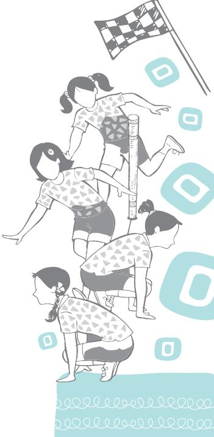

#### **Do You Know?**

About 2.21 per cent of the total population of India is 'disabled'. The highest number of disabled persons in India is from the State of Uttar Pradesh. At all India level, 7.62 per cent of the disabled persons belong to the age group of 0–6 years. Focus today is on inclusive Education. *Source: Census 2011*

as early as at age eight or nine. The onset of puberty differs across gender and begins earlier in females. The cognitive development of middle childhood is slow and steady. Middle childhood is a time when children can gain enthusiasm for learning, and work for achievement can become a motivating factor as children work toward building competence and selfesteem.

## **Adolescence**

The adolescent years are the second period of accelerated growth. The age between 12 and 18 years is generally considered as 'adolescence'. Individuals may gain a total of 15–20 centimeters in height and as much as 8–10 kg in weight. The timing of this growth spurt is not highly predictable; it varies across both, individuals and gender. In general, females begin to develop earlier than males. Sexual maturation is one of the most significant developments during this time. Like physical development, there is significant variability in the age at which individuals attain sexual maturity. Females tend to mature at about age thirteen, and males mature at about age fifteen. Adolescence is also an important period for cognitive development.

# **Physiological Aspects of Activities**

The body's physiological responses to exercise occur in the musculoskeletal, cardiovascular, respiratory, endocrine, and

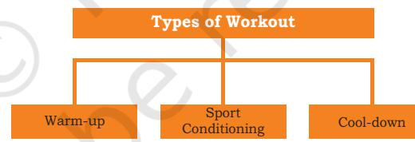

immune systems. Different types of exercises will have different effects upon the muscles exercised. Before

performing any exercise, or workout body has to be warmed up properly for the efficient and effective functioning of muscles.

#### **Warm-up**

Warming up is a short time activity carried out prior to any intense or skilled activity. It is important to warm up before exercising,

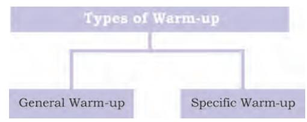

which is usually done by including 10 to 40 minutes of light activities, such as, slow jog, calisthenics, and stretching. Players need warm-up as it increases body temperature and heart rate, provide stretching, stimulate the entire body and major

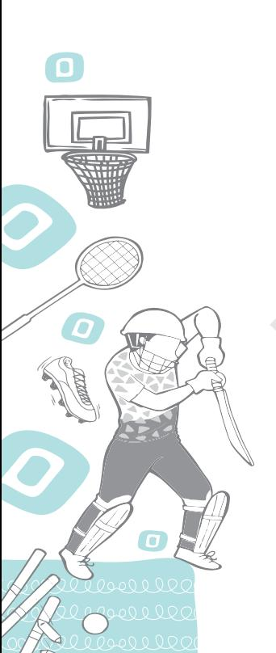

Chap-3.indd 38 31-07-2020 15:25:40

biomechanical functions, provide practice for basic movements, and finally prepare the player or athlete for rigorous athletic activity/training. Stretching results in increased blood flow and prevents injuries to the muscles, tendons, and ligaments. Proper warm-up exercises are not supposed to be done vigorously. A warm-up generally consists of a gradual increase in intensity of physical activity (a 'pulse raiser'), joint mobility exercise, and stretching, followed by the main activity. Warming up brings the body to a condition at which it safely responds to nerve signals for quick and efficient action. The objectives of the warm-up are to increase heart rate, blood flow, internal temperature of the muscles, respiratory rate, perspiration, and decrease the viscosity of joint fluids.

A warm-up is intended to raise the body temperature and prepare a player physiologically and psychologically to compete in a game. Researchers have suggested that the optimum duration of the warm-up period, should be between 15 to 20 minutes. This should consist of a gradual increase in intensity until the player is working at 70 per cent of maximal heart rate. A warm-up at this intensity has the effect of allowing an increase in the range of movement of the joints and improving aerobic performance. This means the player becomes more flexible and movement efficiency improves. A warm-up produces a 2 to 3 degree rise in body temperature that can last for 45 minutes.

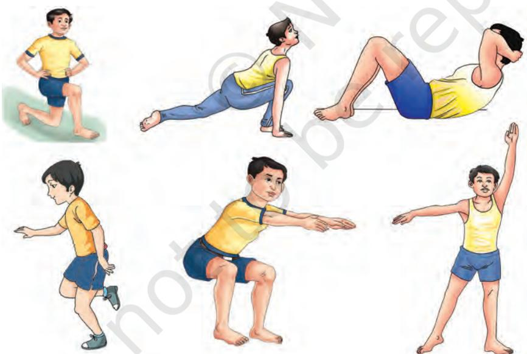

*Fig. 3.1: General warm-up exercises*

## **General Warm-up**

It involves rhythmic movements using large muscle groups. The general warm-up should consist of a light physical activity

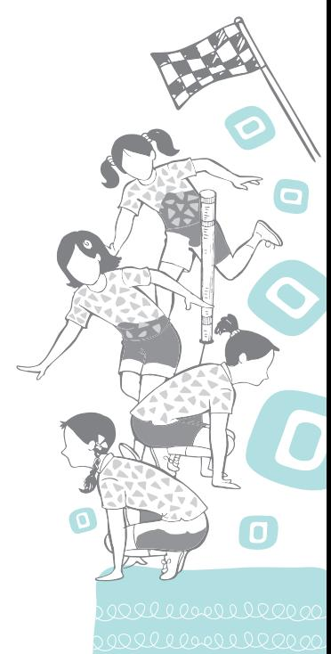

like walking, jogging, stationary bike, skipping, or easy aerobics. It is also beneficial in improving neuromuscular coordination of muscles that results in developing better control on muscles. This warming up in turn increases the body temperature resulting in reduced viscosity in muscle fibres and thus helps in getting better results. Both the intensity and duration of the general warm-up (or how hard and how long), should be governed by the fitness level of the participating athlete.

## **Specific Warm-up**

It consists of specific exercises which are matched to the main activity. In specific warm-up, some special sets of exercises need to be performed which have a direct relation with the activity to be carried out. In this part, the athletes are specifically preparing their body for the demands of their particular sport. During this part of the warm-up, more vigorous activity should be employed. Activities should reflect the type of movements and actions which will be required during the sporting event. The set of activities and exercises in specific warming up differ from sport to sport. These are especially designed to meet the requirement of different activities and sports.

For example in weightlifting, the athlete first needs to perform some exercises with a bar for specific warm-up. Similarly a basketball player practices layup shots or free throws before the competition, this helps to improve their coordinating abilities. Different games have their own specific warm-up exercises. Some of them are described (along with the games they concern) as follows:

- 1. Basketball—shooting, dribbling, lay-up shots, free throws, shuttle run, dodging, etc.
- 2. Cricket—bowling, catching, batting, fielding, running, etc.
- 3. Lawn Tennis—wall practice, service practice, passing shots, knocking, etc.
- 4. Shot put—standing throws, putting the shot with both hands, gliding practice with or without shot, shifting the shot from left hand to right hand, and vice-versa.
- 5. Hockey—dribbling, rotation of stick, short passes, long hits, scoop, stopping the ball with stick, etc.
- 6. Weightlifting—warming up rowing, high pull, snatch squat, shoulder shrug, good morning exercise, etc.

2024-25

Chap-3.indd 40 31-07-2020 15:25:41

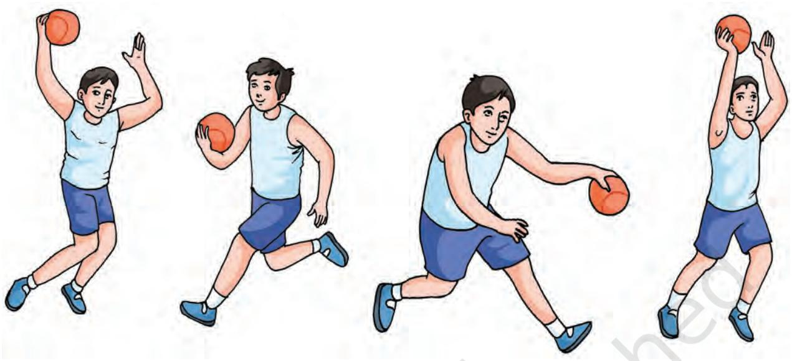

*Fig. 3.2: Different types of warming up drills in basketball*

## **Methods of Warming up**

There are various methods of warming up for different games and sports, the most commonly used are by—

- 1. exercise
- 2. massage
- 3. taking hot water bath
- 4. sipping some hot beverages.

## *Exercise*

Most sets of warm-up exercises include four to five very simple movements. The exercises that are included in this method are walking, jogging, running, jumping, bending, stretching exercises, etc.

## *Massage*

Massaging of muscles is a good method to gain muscle tone and is an effective means of warming up. It helps in the removal of lactic acid and recovery from fatigue and healing of minor injuries of muscles.

### *Hot Water Bath*

This technique is very helpful in warming up and relaxation of muscles after competition. A hot water bath is helpful in raising body temperature which results in the activation of muscles by increasing blood circulation in them.

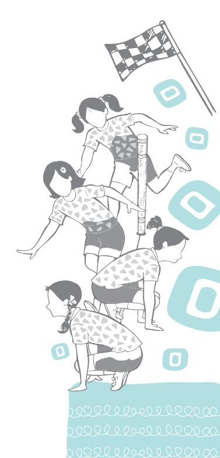

#### *Hot Beverage*

A small intake of tea, soup, coffee, or any other hot beverage stimulates the body functions and helps in preparing the body for competition. The drink should not be consumed in large quantities as it may cause discomfort.

Things to take into account when performing the warm-up:

- **•** Always start with a continuous slow run to prepare the body and increase temperature. Move all the parts of your body, from head to toes.
- **•** Do not get tired; don't make too many repetitions of each movement and move the alternate parts of the body.
- **•** It has to be progressive, from low-intensity to highintensity exercises.
- **•** End up with some sprints or short, and fast races. It should last for 10–15 minutes, and your heart rate should increase until 120–140 beats/minute.

#### **Sports Conditioning**

Sports conditioning offers an edge over the competition. The purpose of sports conditioning is to complement current sports training. Sports conditioning is ideal for children who strive for greater performance in any sporting activity. It is meant to enhance an individual's strength, balance, coordination, flexibility, speed, and power, which can be carried over into all the sports.

The conditioning programme is an important step in injury prevention. Proper training can reduce the incidence of injury in young athletes and also offers the teams a chance to grow strong together. Sports conditioning helps to prepare athletes for better application of their sport-specific skills. Athletes of all levels and abilities need a more sports-oriented training programme besides general fitness.

Sports conditioning should be directly related to the type of sport in which the individual participates. A good conditioning programme includes strength, power, speed, quickness, agility, movement, skills, deceleration, balance, reactivity, and anaerobic capacity.

The conditioning programme should be specific to the sport and should meet the individual needs of the athlete.

#### **Limber down or Cool down**

Cool down is a session of light exercises that follows rigorous physical activities. The session will usually include gentle exercises, and stretching activities. Stretching is a major factor in the procedure of cooling down. Stretching allows the body muscles to build elasticity and repair from aerobic and anaerobic exercises.

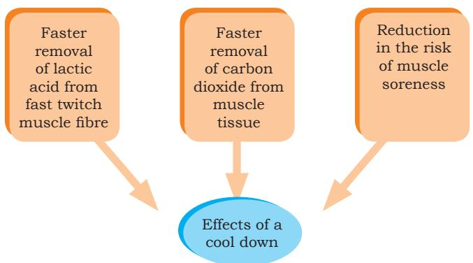

Cooling down is an easy exercise, done after a more intense activity, to allow the body to gradually transition to a resting or near resting state.

The main aim of the cool down session is to promote recovery and return the body to a pre-exercise, or pre-workout level. During a strenuous workout, the body goes through a number of stressful processes. For example, muscle fibres, tendons and ligaments get damaged, and waste products build up within the body.

### *Effects of Cooling down*

- 1. Helps heart rate and breathing to return towards resting levels gradually.
- 2. Helps avoid fainting or dizziness, which can result from blood pooling in the large muscles of the legs when a vigorous activity is stopped suddenly.
- 3. Helps to remove metabolites (intermediate substances formed during metabolism) from muscles, such as lactic acid.
- 4. Helps to prepare the muscles for the next exercise session, whether it's the next day or in a few days' time.

## *Effects of Exercise on various Body Systems*

#### *Effects of Exercise on Cardiovascular System*

Cardiovascular is the system of heart, blood vessels, and blood. The effects of exercise on cardiovascular system are summarised as—

> **Heart rate:** The number of beats or contractions of heart in one minute is called as heart rate. The number of contractions ranges from 60 to 80 beats/minute. However, 72 beats/minute is considered as the normal heart rate. During exercise, the heart rate increases and may range from 140 to 180 beats/minute depending on the intensity of exercise.

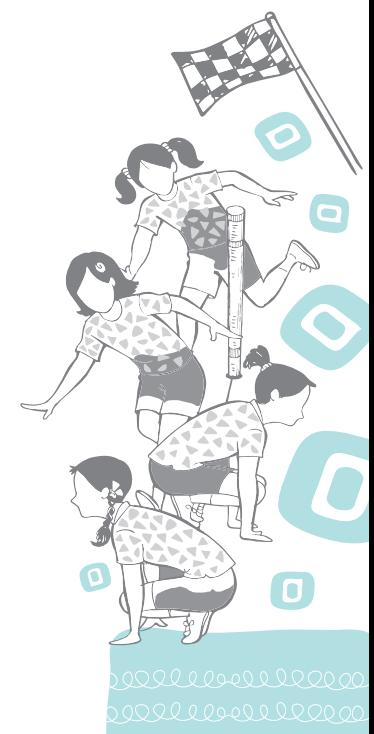

#### **Do You Know?**

There are two main types of muscle fibers; fast twitch muscle fibre and slow twitch muscle fibre.

#### **Activity 3.1**

Record the heart rate from radial artery or carotid artery before and after completing 100 metre sprint.

**Stroke volume:** The amount of blood pumped out by each ventricle in each heartbeat is known as stroke volume. At rest, the stroke volume is around 70 ml/beat for male and 50 ml/beat for female, during exercise the stroke volume increases.

**Cardiac output:** It is the amount of blood pumped out by each ventricle of the heart in one minute. It is the product of stroke volume and heart rate. Endurance training results in increased cardiac output through increased stroke volume. Cardiac output increases directly with increased exercise.

Cardiac output = Heart rate × Stroke volume

At rest it is around 5 litre/minute; during exercise the increase may be about 4 to 5 fold.

**Cardiac hypertrophy:** Hypertrophy is the increase in the volume of an organ or tissue due to the enlargement of its component cells. Cardiac hypertrophy is referred to as 'athlete' heart, which may occur after 7–10 years of vigorous physical training.

**Blood volume:** The blood is a reddish fluid, alkaline in reaction and is salty in taste. The body of an adult contains about 5–6 litres of blood which weighs 1/3rd of the total body weight. Exercise produces the following effects.

- **•** The effect of exercise on blood volume depends on the type and intensity of exercise.
- **•** During endurance training, the resting blood volume increases approximately by 8 per cent.
- **•** Plasma volume in the blood increases by 12 per cent.
- **•** Increase in blood volume is known as hemodilution.
- **•** Increase in the number of blood vessels and their size too.
- **•** By continuous and endurance training, capillarisation takes place.

#### *Effects of Exercise on Respiratory System*

The mechanism of inspiration and expiration is known as respiration. It is controlled by medulla oblongata of the brain. It helps in adequate supply of O2 and elimination of CO2 from the body. The effects of exercise on respiratory system are summarised as follows:

> **Tidal volume:** It is referred to as the volume of air inspired or expired per breath. During rest, it is around 500 ml; during exercise it increases; during maximal

exercise, it increases 5 to 6 times above the resting values.

**Respiratory rate (F):** It is also known as breathing rate or breathing frequency. It is defined as the number of breaths per minute. At rest, it is 12–20 per minute, during exercise it increases to 2–3 times.

**Minute ventilation or Pulmonary ventilation (PV):** It is commonly referred to as the breathing process of lungs during inhalation and exhalation.

PV = Tidal volume × Respiratory rate

PV = (TV × RR)

During rest = 8 litres/minute

(PV changes with body size, it is smaller in female and larger in male.)

**During exercise:** PV increases during exercising. The initial rise in the ventilation is due to the increased stimulation of the inspiratory centres caused by muscular activity. The second phase of gradual increase in the ventilation occurs due to an increase in the temperature, and chemical changes in the arterial blood produced by muscular activity.

**Pulmonary diffusing capacity:** The rate of diffusion of gas between the alveoli of the lungs and the blood of the lung capillaries is called pulmonary diffusing capacity. During exercise the pulmonary diffusing capacity for oxygen increases.

**Hyperventilation:** An increased breathing due to an increased tidal volume or increasing respiratory rate or both is referred to as hyperventilation.

**Total lung capacity:** The volume of air in the lungs at the end of maximal inspiration is termed as total lung capacity. During exercise the total lung capacity slightly decreases.

**Vital capacity:** The maximal volume of air which is forcefully expired after maximal inspiration is called vital capacity.

## *Effects of Exercise on Muscular System*

Muscle is a tissue which has the power of contraction. Skeletal muscles are the main muscles for physical activities and exercises. Several changes take place in the skeletal muscles depending upon the type of training which an individual is undergoing. The effects of exercise on muscular system are summarised as follows.

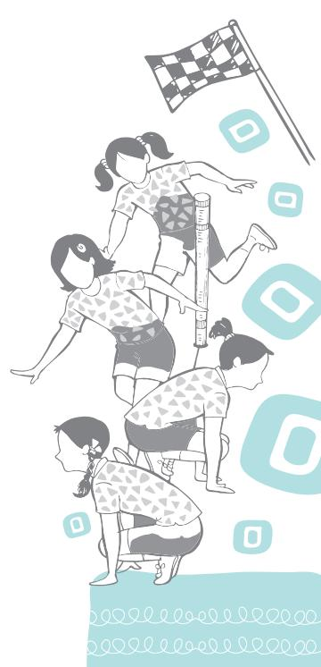

**Muscular hypertrophy:** Due to regular exercise, training muscles become enlarged. Muscle fibers, diameter and length increases. The total amount of protein, glycogen and enzymes are increased.

**Aerobic changes:** By training, the amount of myoglobin increases which helps for better supply of O2 to the working muscles of the body. By training, muscles produce energy by increased oxidation of glycogen. A trained muscle uses more fat to supply more energy.

**Anaerobic changes:** These are the changes which help in supply of energy in the absence of O2.

- **•** Increased lactic acid tolerance
- **•** Change in blood flow of the muscles
- **•** Change in red and white fibres of the muscles

**Training and capillary supply:** Endurance training increases the capillary ratio (expressed as capillaries per fiber). Training increases capillary density as well.

**Influence on performance:** As muscles become stronger, they contract with less exertion during a maximum voluntary force. A greater perfusion occurs, and the exercise can be continued without involving the anaerobic metabolism. This would help in delaying the lactic acid accumulation and increase in the muscular force. Strength, flexibility and endurance are increased after the training.

## *Effects of exercise on Digestive System*

There are many effects of exercise on the body that can positively influence digestive system functioning. Regular exercise makes our digestive system strong, speeding up metabolism and preventing constipation. The short term effects of exercise on the digestive system are—

> **Blood flow increases:** Exercise can improve the blood flow. Circulation of blood in all the areas of body also includes the digestive track organs and enhance their functioning.

> **Speedup metabolism:** Exercise can boost our metabolism. Exercise can slightly increase our resting metabolic rate (the amount of calories our body burns at rest). Metabolism is the process in which the food we consume is converted into energy that is needed by the body to survive.

> **Prevent constipation:** Exercise helps in reducing constipation by decreasing the time taken by food to move through the large intestine, thus limiting the

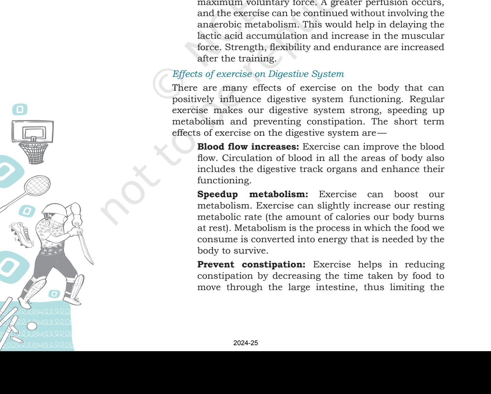

amount of water absorbed from the stool in to the body. Exercise accelerates our breathing and heart rate. This helps to stimulate the natural contraction of the intestinal muscles which prevent constipation naturally.

**Prevent digestive diseases:** Regular exercise helps to prevent digestive diseases. Many diseases are associated with stomach and if we exercise regularly, that will strengthen our internal organs, such as liver, stomach, intestine, various glands, etc., and prevents us from digestive diseases.

# **Assessment**

## **I. Long Answer Questions**

- 1. What is the difference between growth and development? Explain.
- 2. Define growth and development and explain the factors affecting growth and development.
- 3. Explain the effects of exercise on muscular system.
- 4. Enlist and explain the effects of exercise on respiratory system.
- 5. Explain physical and physiological changes that take place during different developmental stages.

## **II. Short Answer Questions**

- 1. What is meant by cardiac output?
- 2. Write down the full form of MV.
- 3. What is Muscle Hypertrophy?
- 4. List the developmental stages of life.
- 5. What is general warm-up?
- 6. What is specific warm-up?

### **III. Fill in the Blanks**

- 1. Growth refers to the process through which body increases in ____________ and ____________.
- 2. There are ____________ major factors which directly or indirectly influence the growth and development of a ____________.
- 3. Hormones play an important role in regulating the process of ____________ and ____________.
- 4. An increased tidal volume, or increased respiratory rate, or both is referred to as ____________.
- 5. Heart rate ____________ during submaximal exercise and it is caused due to increase in ____________ activity.
- 6. ____________ with high velocity movement develops exploring strength or power.

#### **IV. Match the Following**

- 1. Stroke Volume a. Lung
- 2. Residual Volume b. Muscles
- 3. Lactic Acid c. Heart
- 
- 
- 
- -
- 4. Snatch d. Basketball
- 5. Gliding e. Weight lifting

