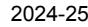
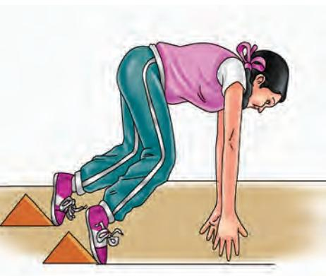
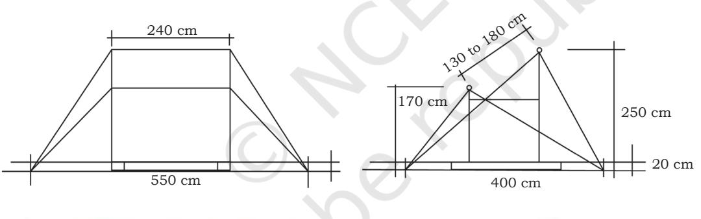
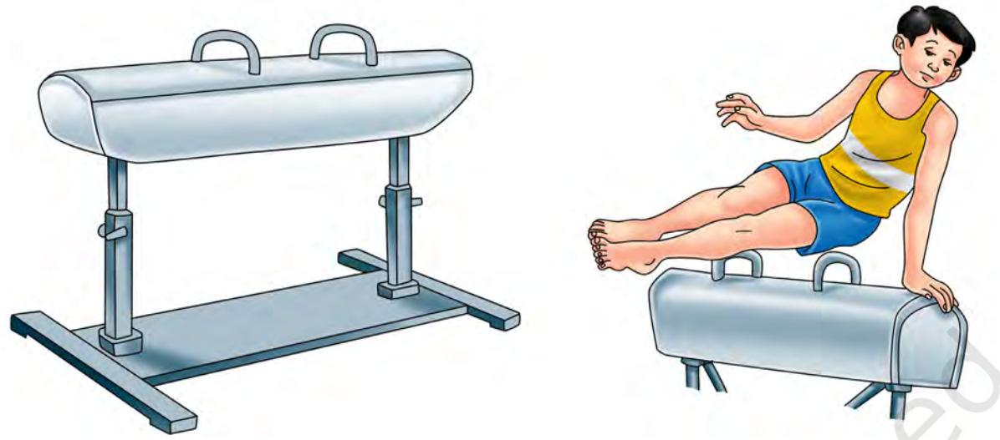
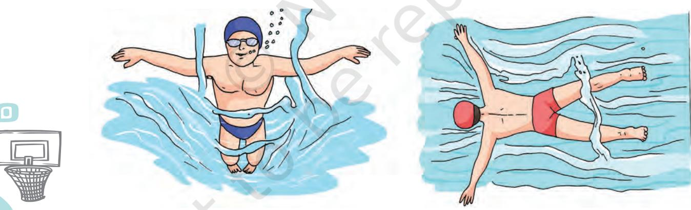

**4**

# **Individual Games**

Games and sports are important parts of our lives. They are essential to enjoy overall health and well-being. Sports and games offer numerous advantages and are thus highly recommended for everyone irrespective of their age. Sports with individualistic approach characterised with graceful skills of players are individual sports. Do you like the idea of playing an individual sport and be responsible for your win or loss, success or failure? There are various sports that come under this category. This chapter will help you to enhance your knowledge about Athletics, Badminton, Gymnastics, Judo, Swimming, Table Tennis, and Wrestling.

# **Athletics**

Running, jumping and throwing are natural and universal forms of human physical expression. Track and field events are the improved versions of all these. These are among the oldest of all sporting competitions. Athletics consist of track and field events. In the track events, competitions of races of different distances are conducted. The different track and field events have their roots in ancient human history.

# **History**

Ancient Olympic Games are the first recorded examples of organised track and field events. In 776 B.C., in Olympia, Greece, only one event was contested which was known as the stadion footrace. The scope of the games expanded in later years. Further it included running competitions, but the introduction of the Ancient Olympic pentathlon marked a step towards track and field as it is recognised today. There were five events in pentathlon namely—discus throw, long jump, javelin throw, the stadion foot race, and wrestling.

Chap-4.indd 49 31-07-2020 15:26:11

Athletics at the 1960 Summer Paralympics consisted of 25 events, 13 for men and 12 for women. Prepare the list of these events both for men and women.

Track and field events were also present at the Pan-Hellenic Games in Greece around 200 B.C. period and spread to Rome in Italy. Track and field events began developing in parts of Northern Europe in the middle ages. The stone put and weight throw competitions popular among Celtic societies in Ireland and Scotland were predecessor to the modern shot put and hammer throw events. Pole vault is the last track and field events which evolved in the eighteenth century.

In the late 19th century, modern track and field competitions were separated from general sporting festivals and were first recorded. These competitions were typically organised by educational institutions, military organisations, and sports clubs. Competitive hurdling first came into being, with the advent of the steeplechase in England around 1850. The first national body for the sport of athletics, The Amateur Athletic Association (AAA) was established in England in 1880. Under this grouping, track and field became the focus of the annual AAA Championships. The United States also began holding an annual national competition. The USA outdoor Track and Field Championship was held in 1868 by the New York Athletic Club.

The establishment of the modern Olympic Games at the end of the nineteenth century marked a new height for track and field events. The Olympic athletics programme comprised of track and field events including a marathon race. These also contained many of the foremost sporting competitions of the 1896 Summer Olympics.

The Olympics also consolidated the use of metric measurements in international track and field events, both for race distances and for measuring jumps and throws. The athletics programme greatly expanded over the next decades and remained most prominent among the games. The Olympics were the elite competitions for track and field, and only amateur sportsmen at that time could compete. Track and field continues to be largely an amateur sport.

The International Amateur Athletic Federation (IAAF) was established in 1912, becoming the international governing body for track and field.

### **Indian History of Athletics**

In the history of Indian Athletics, the decade of 1940's to 1950's is important as a number of Athletics associations were started in this decade. In 1946, the Amateur Athletics Federation of India (AAFI) was established for the management of Indian Athletics. The entire scenario of Indian Athletics was changed by AAFI as it worked in collaboration with

Chap-4.indd 50 31-07-2020 15:26:11

<b>Activity 4.1

the other Athletics associations for improving sports and athletics. Indian Athletics went through many phases. Many track and field games were played in the grass.

At present synthetic track is used which has made things easier as there was no need for manual marking of tracks and associated definitions for throws and jumps in those tracks. Application of technology has helped the athletes and improved the status of the sport.

India has so far produced a number of successful athletes in the international level who have a rich tradition of winning performances in the international tournaments.

Some of the most successful athletes in the early history of Indian Athletics are Milkha Singh, T.C. Yohannan, Gurbachan Singh, Sriram Singh, etc. Some of the notable Indian Athletes in the contemporary period include P.T. Usha, Anju Bobby George, Jyotirmoyee Sikdar, Saraswati Saha, Soma Biswas, etc.

### **Classification of Athletics Events**

According to the nature of competitions, athletics events are classified into four types. These are—

> **Track Events:** All running events come under track events.

> **Field Events:** The jumping and throwing events are called field events.

> **Combined Events:** There are some other unique events which are called as combined events. These are also organised in athletics. In fact, these are the combination of some track and field events, such as decathlon, heptathlon, etc.

> **Events conducted outside the stadium:** These events are held outside the track, on roads or at natural places; for example, Marathon of 42.195 km and 20 and 50 km walk.

### *Classification of Track Events*

Track events are classified into three categories. These are—

| Table 1: Classification of Track Events |
| --- |

| 1. Short Distance | 2. Middle | 3. Long |
| --- | --- | --- |
| Races | Distance Races | Distance Races |
| 100 m | 800 m | 3000 m |
|  |  | steeplechase |

#### **Activity 4.2**

Collect information about your favourite athletes and share in the class.

Chap-4.indd 51 31-07-2020 15:26:11

| 200 m | 1500 m | 5000 m |
| --- | --- | --- |
| 400 m |  | 10,000 m |
| 110 m Hurdle Race |  | 20 km walking |
| (Men) |  |  |
| 100 m Hurdle Race |  | Road Events |
| (Women) |  |  |
| 400 m Hurdle Race |  |  |
| 4×100 m relay |  | 50 km walking |
| 4×400 m relay |  | Marathon (42.195 m) |

#### *Classification of Field Events*

Field events are classified into two categories—jumping events and throwing events. Further these are classified as given below:

#### **Table 2: Classification of Field Events**

| Jumping Events | Throwing Events |
| --- | --- |
| Long Jump | Shot Put |
| High Jump | Discus Throw |
| Triple Jump | Javelin Throw |
| Pole Vault | Hammer Throw |

# *Classification of Combined Events*

Combined events are those events which are characterised as mixed events from the track as well as field events. For men there are mixed events called 'Decathlon' and comprised of 10 events to be completed within the span of two days. Combined track and field events for women are called 'Heptathlon' and are divided into seven events. These mixed events are classified below.

#### **Table 3: Classification of Combined Events**

| Decathlon (Men) |  |  | Heptathlon (Women) |
| --- | --- | --- | --- |
| 100 m |  | 100 m | 1st day |
| Long Jump |  | High Jump |  |
| Shot Put | 1st day | Shot Put |  |
| High Jump |  | 200 m |  |
| 400 m |  |  |  |

#### **Do You Know?**

- **•** Sebastian Coe from Great Britain was one of the world's greatest athlete winner of four medals at Olympic Games, and had not taken a single day rest between his training.
- **•** Steeplechase—A hurdle race with water jumps came into existence in England around 1850.

Chap-4.indd 52 31-07-2020 15:26:11

| 110 m Hurdle |  | Long Jump | 2nd day |
| --- | --- | --- | --- |
| Discus Throw |  |  |  |
| Pole Vault | 2nd day | Javelin Throw |  |
| Javelin Throw |  | 800 m |  |
| 1500 m |  |  |  |

#### **Activity 4.3**

Collect the information about the events under 'Decathlon' and 'Heptathlon', which are to be completed on the first day of the competition and on the second day of competition.

### **General Rules**

These are some of the general rules which need to be followed by every athlete during the events.

- **•** The athlete should run with shoes.
- **•** There should be a number on the chest and back of every athlete. No athlete can participate without the number. Only in the games of Pole Vault and High Jump, an athlete can bear one number.
- **•** If an athlete runs before the gun is fired, it is considered as a foul and is expelled from the event. Only in the combined events, the athlete is given a warning for first foul, but on the second foul, the athlete is expelled from the game.
- **•** The starter speaks in English at the time of start.
- **•** If any athlete obstructs the other athlete, then the referee can expel that athlete.
- **•** In the races up to 400 m, all the athletes have to finish them in the same lane allotted to them.
- **•** 800 m race starts in lanes but lanes are changed to first lane after the first curve.

### **Athletics Track**

A track is formed by two straight lines and two curved lines. It is oval shaped. Track surface can be of soil, grass, or synthetic. In the national and international competitions, the synthetic tracks, which are also known as all-weather tracks are used. In all races up to and including 400 m, each athlete has a separate lane, with a width of 1.22 m to 1.25 m to be marked by lines 5 cm in width.

## **Methods of starting the Race**

Each race is started with a starting gun. The main two types of start are—

> **Crouch Start:** This type of start is essential for sprint races. Starting block is used in this start, so the athlete can better use their reaction, speed, and explosive power.

Chap-4.indd 53 31-07-2020 15:26:11

- **•** Starting line in the track events is included and the Finish line is excluded. Line on the right hand side of the lane is included in the width of each lane.
- **•** No check marks are permitted in the track except for relays.

Chap-4.indd 54 31-07-2020 15:26:12

### *Types of Crouch Start*

The crouch start is further divided into three types.

#### *Bunch or Bullet Start*

In such a start, the distance from the starting line to the block is between 16 to 19 inches. The distance between both the blocks (front leg and rear leg) may be 8 to 11 inches. The athlete sets the body in crouching position in such a way that the rear toe and the heal of front foot should be in a straight line. The toes should be behind the starting line like a bridge but in the line of big toe. In the set position, the hips should be slightly lifted up and the arms should be straight. This last position in the bunch start is a little unstable which helps the athlete in leaving the block quickly.

#### *Medium Start*

The distance of the blocks from the starting line is 15 to 18 inches. The distance between both the blocks (front leg and rear leg) may be 15 to 20 inches. The knee of rear leg and the arch of front foot should be in a straight line. The shoulders and hips are almost at the same height.

#### *Elongated start*

The distance of the blocks from the starting line is 11 to 14 inches. The distance between both the blocks (front leg and rear leg) may be 25 to 29 inches. The rear knee is placed near the front heal. In the crouch start, the distance between the blocks depends upon the length of the leg, breadth of the hip, length of torso, strength of arms and time reaction, etc. Medium start is considered as better than the other two starts. Most of the athletes, therefore, use this type of start.

The distance between the blocks (front and rear leg) varies and depends on the height of the athlete.

*Fig. 4.2: Types of crouch start*

#### *Starting block*

An athlete uses starting block in track events for all the sprinting ability to get a good start. The starting block helps the athlete to give support during the start of race to expel the body forward. Starting block needs to be kept in right angle according to

Chap-4.indd 55 31-07-2020 15:26:12

*Fig. 4.3: Starting block*

the height of the athlete. A starting block needs to be strong and adjustable.

Before starting, the athlete should be calm and composed. The athlete should wait for the commands while standing near the assembly line.

#### *On Your Marks*

On the command 'On your marks', the athlete will move towards the starting line and will take position at the starting block. The head is kept in resting position. In this position, the hand will be placed parallel to but behind the starting line and according to the width of the shoulders. The weight of the body is distributed on the rear knee and hands. In the starting position, the shoulders can be moved ahead of starting line. The neck should be in resting position but the concentration of athlete should be towards the next command.

*Fig. 4.4: Both side views of the 'on your marks' position*

#### *Set*

Athlete keeps the back a little above the shoulder. The weight of the body is equally distributed over the front foot and hands. This last position is usually unstable and tense which helps in leaving the block easily. Head should be in resting position and the grip on the block should be strong. The athlete should be alert enough to listen to the next command.

Chap-4.indd 56 31-07-2020 15:26:13

2024-25

*Fig. 4.5: 'Set' position*

#### *Gun shot*

Soon after the gun shot, the athlete has to leave the block as quickly as possible. This helps in a good start. The athlete should lift his body gradually after taking a start.

### *Types of Finishing*

The finishing of all the races is very important. A little difference can alter the athlete's ranking. The following techniques during training process need to be learned to finish the race.

#### *Lunging forward*

In this technique, the athlete lunges the body forward just before the finishing line. The athlete needs to spread arms backward in order to expand the chest forward. While spreading his arms the athlete needs to balance his body.

#### *Shoulder shrug*

In this technique, the athlete needs to bend shoulders towards the finishing line. The body weight is carried forward while maintaining the balance of the body. While shrugging the shoulders, the athlete needs to bend his head as well as upper body towards the finishing line.

### *Run through*

This technique is usually adopted by new athletes. The athlete runs through the finishing line after completing the race. The athlete should not reduce the pace before finishing.

*Fig. 4.6: Techniques of finishing the race*

### **Relay Races**

Relay races are team events. In this race, four runners complete a given distance. Each relay team needs four runners. Each runner runs the quarter of the running track, while holding

Chap-4.indd 57 31-07-2020 15:26:13

#### **Do You Know?**

Steeple chase—A hurdle race with water jumps came into existence in England around 1850.

a baton. Two runners will exchange the baton only in a given exchange zone mark in track. If the baton falls in the exchange zone, then only the athlete who has dropped it will lift it.

#### **Table 4: Types of Relay Races**

| Relay Races for Men and Women |
| --- |
| 4×100 meter |
| 4×400 meter |
| Members of Relay team = 6 |
| Running members = 4 |
| Length of Baton 28–30 cm |
| Circumference of Baton 12–13 cm |
| Weight of Baton at least 50 gms |
| Baton exchange zone 20 m |
| Acceleration zone 10 m |

#### *Methods of baton exchange*

*Downward pass*

There are three methods of baton exchange, which are—

*Fig. 4.7: Method to give the baton from the bottom*

In such a pass, the runner who is to run will move his hand back to take the baton with palms facing upwards. The thumbs will be towards the inner side and the palm will be upward. The athlete holding the baton, will hold the baton from one end and will place the other end of the baton in the

Chap-4.indd 58 31-07-2020 15:26:14

hands of the athlete who is about to run.

#### *Upward pass*

In such a pass, the athlete who is going to hold the baton will keep the hand in a 'V' shape, which will be used to take the baton near the hip, upside down. The athlete who is passing the baton will hold the baton in such a way, that it will get nearer to the other athlete. This pass is easier for the new runner.

*Fig. 4.8: Method to give the baton from the upper side*

#### *Push pass*

Push pass is exactly similar to the downward pass at the change over box. The athlete, who is holding the baton, runs while aiming at the elbow of the other athlete with the baton. The other athlete takes the baton with his arm moving backward.

*Fig. 4.9: Method to give push pass*

Chap-4.indd 59 31-07-2020 15:26:15

#### **Jumping Events**

Jumping Events consist of four events. However, only two (Long jump and High jump) are discussed below.

- **•** Long Jump
- **•** High Jump
- **•** Triple Jump
- **•** Pole Vault

#### *Long Jump*

Long jump is considered as the main field event. In this event, the athlete has to jump from the takeoff board to the jumping pit. The entire group of athletes will get three jumps to qualify for the final phase of the competition. Athletes should have speed, power and flexibility for it. Eight qualified jumpers are selected for the final phase of the competition. Three more chances are given to the selected eight jumpers for getting final ranking.

#### **Table 5: Information about Long Jump**

| Length of runway | 40 m – 45 m |
| --- | --- |
| Width of runway | 1.22 m + 0.01 m |
| Length of take-off board | 1.22 m + 0.01 m |
| Width of take-off board | 20 cm |
| Thickness of take-off board | 10 cm |
| Distance of the last edge of pit from | Minimum 10 m |
| take-off board |  |
| Width of pit | 2.75 m – 3.00 m |
| Distance of take-off board from the pit | 1.00 m – 3.00 m |
| Width of plasticine indicator | 10 cm |
| Degree of plasticine indicator towards | 45° |
| runway |  |

2024-25

Chap-4.indd 60 31-07-2020 15:26:15

# *Methods of Long Jump*

Athletes usually use the following methods for long jump—

- 1. Sail Technique
- 2. Hang Technique
- 3. Hitch-kick Technique

### *Phases of Long Jump*

There are the four phases in long jump.

**Runway:** The athlete attains his maximum speed by running on the runway so that he can reach the take off board with full speed and also to get the maximum momentum.

*Fig. 4.11: The hang technique*

**Take-off:** The athlete takes-off with his strong foot by pushing it against the take-off board. The athlete raises both the hands up and as a result his entire body is raised up. The front leg is lifted upwards and the knee is bent.

**Flight:** When the body of the athlete is in the air after the take-off, it is known as flight. During flight position, the athlete uses various techniques like hang method or hitch-kick technique. The momentum gained during the runway helps the body to move forward in the air.

**Landing:** Both feet of the athlete simultaneously touch the ground while landing. During landing, the legs should be kept straight. Both hands should be raised and taken towards the feet and the neck should be bent forward. This posture helps in gaining some more distance in the air and the body gets balanced while landing.

Chap-4.indd 61 31-07-2020 15:26:16

*Fig. 4.12: Hitch-kick technique*

#### *High Jump*

This is also one of the major field events. In this, the athlete crosses the crossbar with a jump. Activeness and flexibility are important for the athlete.

#### **Table 6: Information about High Jump**

| Minimum length of runway | 15 m |
| --- | --- |
| Size of landing area | 6 m×4 m |
| Height of landing pit | 0.60 m – 0.70 m |
| Distance between two poles | 4.00 m – 4.04 m |
| Length of crossbar | 4.00 m (±2cm) |
| Weight of crossbar | 2 kg |
| Diameter of crossbar | 29 mm – 31 mm |
| Length of rectangular edges of crossbar | 15 cm – 20 cm |
| Width of edges of crossbar | 30 mm – 35 mm |
| Gap between the edges of crossbar and | 10 mm |
| poles |  |

#### *Techniques of High Jump*

The most popular technique of high jump is Fosbury Flop. However some other techniques are also used. Which are—

> **Scissor Jump:** To jump over the crossbar with alternate legs and to land on the feet is called scissor jump.

> **Western roll :** Rolling over the crossbar and landing on the back is known as western roll.

Chap-4.indd 62 31-07-2020 15:26:16

**Straddle Technique:** In this technique, the legs are taken alternately over the crossbar and the body is rolled near the bar.

**Fosbury Flop:** It is a new technique. In this, the bar is crossed by back after bending the body. The landing is done on the shoulders.

*Fig. 4.13: Fosbury flop*

# *General Rules*

Certain general rules of high jump are given below.

- **•** Jumper needs—to jump on one foot only.
- **•** It will be a foul, if an athlete—
	- **▪** shakes the bar from the support.
	- **▪** touches the ground with any part of his body before clearing the poles.
- **•** An athlete can jump from any height. Consecutive three failures from a particular height will disqualify the athlete.
- **•** Poles should not be moved during the competition.
- **•** If there are more than three athletes, the time fixed for each jump is one minute. If two to three athletes are there in the competition, time of 1.30 minutes is given. Whereas a time of 3 minutes is given to a single athlete.

Chap-4.indd 63 31-07-2020 15:26:17

- **•** Athlete can mark the runway according to the wish, but can use only the adhesive tape given by the organisers.

*Fig. 4.14: Complete action sequence of fosbury flop*

### **Throwing Events**

The following four events are not included in the throwing events, but only two (Shot put and Discus) are explained in this book.

- **•** Shot put
- **•** Discus

### *Shot put*

#### **Table 7: Information about Shot Put**

| Diameter of the shot put |  |  |  | 2.135 m (±5 mm) |
| --- | --- | --- | --- | --- |
| circle |  |  |  |  |
| Extended sides of the circle | lines | on | both | 75 cm |
| Length of stop board |  |  |  | 1.21 m (±0.01 m) |
| Width of stop board |  |  |  | 11.2 cm – 30 cm |
| Height of stop board |  |  |  | 10 cm (±0.2 cm) |

Chap-4.indd 64 31-07-2020 15:26:18

| Weight of shot | 7.260 kg (for men), 4.00 kg (for |
| --- | --- |
|  | women) |
| Diameter of shot | 110 mm – 130 mm (men) 95 |
|  | mm – 110 mm (women) |
| The extended lines on both | 75 cm |
| sides of the circle |  |
| Angle of the throwing sector | 34.92° |
| within the circle |  |

Shot put is one of the main throwing events. The athlete who throws the shot is called as shot putter. The athlete should have qualities like power, flexibility and speed to throw the shot.

### *Methods of Shot put*

The following are the methods of shot put.

### **1. Gliding Technique**

- a) Grip: The shot is held at the base of the fingers, not the palm. Fingers are slightly spread apart with the thumb for support. The hand will be bent back in a cocked position when holding the shot.
- b) Shot placement: The shot is placed below the ear. It needs to be placed near the jaw bone and over the collar bone.
- c) Standing Position: The shot putter places the right foot on the half way circle line and the left foot along the back line (towards the direction of throw) of the circle.
- d) Gliding Phase: Keep the right foot exactly straight and the toe of the left foot touching on the ground just in front of the stop board. The left foot will rapidly move forward while bending at the knee to take thrust from the hip joint. The right foot will be dragged from the ground.
- e) Final Phase: The last phase of the putting shot will be associated with the turn of body and changing of rear left foot to right for balancing the body weight. The hips will be carried forward. This turn is most vital for the shot putter as it has to be combined with the throwing of arms to put the shot for distance. The whole body weight will be maintained on right foot after the release of shot.

Chap-4.indd 65 31-07-2020 15:26:18

*Fig. 4.15: Layout of shot put sector*

*Fig. 4.16: Gliding technique for throwing shot*

#### **2. Rotation Technique for Throwing Shot**

- a) Initial Position: In the initial position, the athlete will stand with the back towards the direction of putting the shot. The left foot will be on central line and the right foot will be just behind. The right foot will be 5–8 cm behind the iron rim to avoid foul during rotation of the body.
- b) Rotation: The weight of the body will be on the right foot. Rotation will start after taking just one swing from the starting position. In this position, the left arm will be kept parallel to the ground on left side.

Chap-4.indd 66 31-07-2020 15:26:20

The right foot will be brought over the left foot while leaning the shoulder when the shot reaches the middle. Both the shoulders will rotate after leaning and laying the entire body weight on the toes. The shoulder and the trunk will fully rotate towards the right and the body weight will also shift on the left foot.

### *Discus Throw*

Discus throw is an old and popular event. The athlete should have power, elasticity, speed and balance for discus throw.

#### **Table 8: Information about Discus Throw**

| Weight of discus | 2 kg (men), 1 kg (women) |
| --- | --- |
| Diameter of discus | 219 mm – 221 mm (men) |
|  | 180 mm – 182 mm (women) |
| Thickness of the rim of discus | 12 mm – 13 mm (6 mm at |
|  | edge) |
| Diameter of circle | 2.50 m |
| Extended lines on both sides | 75 cm |
| of circle |  |
| Angle of throwing sector | 34.92° |

*Fig. 4.17: Layout of discus throw*

Chap-4.indd 67 31-07-2020 15:26:20

#### **Do You Know?**

The first national body of athletics 'Amateur Athletic Association, (AAA), was established in England.

#### *Initial Stage of Discus Throw*

At First the athlete will stand in the circle near the ring with the back against the direction of throwing the discus. The athlete will take one or two swings while rotating the right arm along with the body. In this position, the whole body weight will shift from one foot to another. The heels will lift upward. The upper part of the body should be bent towards right side, while the discus is on the right side. The circle will start from the lower part of the body, the left foot will be rotated leftward, and the body weight will rest on it. The right knee and right foot will also rotate.

In this position, the process of crossing the discus will start. First of all, the left foot will leave the ground. After this, the left foot will take the position of throwing the discus. The right foot (bent at knee) will rotate from left to right in a semi-circle. Both the muscles will be in front of the shoulder while rotating and as a result, there will be a bend in the upper and lower portion of the body. The right arm holding the discus will be straight and above the head. The left arm will be in front of the chest and bent at the elbow. The head will remain straight.

*Fig. 4.18: Technique of throwing discus*

#### *Methods of Discus Throw*

A Discus is thrown by three methods.

- 1. The athlete keeps the right foot at the centre line and left foot 10 cm behind the circle.
- 2. In the second method the athletes keep the centre line between their feet.
- 3. In the third method, the athletes keep their left foot on the centre line.

**Throwing:** Both the feet will be straight at the knees while rotating at the time of throwing. The shoulder muscles will move forward. The shoulders and trunk will stop rotating. Whole of the body's weight will be on both the toes and feet will be straight. The left foot will come back at the end but the right foot will bend from the knee after going forward. The upper part of the body will be bent forward. It is done to balance the body.

**Last Step:** Both the feet will be on the ground, the waist will be bent backward in rotating position, left foot will be in straight line and right foot will be bent at knee. The right knee will be rotating to the left side. The left arm will open upward. The right arm will be brought forward and upward while keeping away from the body.

Chap-4.indd 68 31-07-2020 15:26:20

*Fig. 4.18: Technique of throwing discus*

# **Types of Sports Awards**

There are many awards to honor the outstanding coaches and sportspersons. Government of India honors its coaches, and sportspersons with the following awards:

- 1. Dronacharya Award
- 2. Arjuna Award

*Initial Stage of Discus Throw*

knee and right foot will also rotate.

elbow. The head will remain straight.

A Discus is thrown by three methods.

foot 10 cm behind the circle.

while keeping away from the body.

*Methods of Discus Throw*

between their feet.

the centre line.

balance the body.

At First the athlete will stand in the circle near the ring with the back against the direction of throwing the discus. The athlete will take one or two swings while rotating the right arm along with the body. In this position, the whole body weight will shift from one foot to another. The heels will lift upward. The upper part of the body should be bent towards right side, while the discus is on the right side. The circle will start from the lower part of the body, the left foot will be rotated leftward, and the body weight will rest on it. The right

In this position, the process of crossing the discus will start. First of all, the left foot will leave the ground. After this, the left foot will take the position of throwing the discus. The right foot (bent at knee) will rotate from left to right in a semi-circle. Both the muscles will be in front of the shoulder while rotating and as a result, there will be a bend in the upper and lower portion of the body. The right arm holding the discus will be straight and above the head. The left arm will be in front of the chest and bent at the

1. The athlete keeps the right foot at the centre line and left

2. In the second method the athletes keep the centre line

3. In the third method, the athletes keep their left foot on

**Throwing:** Both the feet will be straight at the knees while rotating at the time of throwing. The shoulder muscles will move forward. The shoulders and trunk will stop rotating. Whole of the body's weight will be on both the toes and feet will be straight. The left foot will come back at the end but the right foot will bend from the knee after going forward. The upper part of the body will be bent forward. It is done to

**Last Step:** Both the feet will be on the ground, the waist will be bent backward in rotating position, left foot will be in straight line and right foot will be bent at knee. The right knee will be rotating to the left side. The left arm will open upward. The right arm will be brought forward and upward

- 3. Rajiv Gandhi Khel Ratna Award
- 4. Dhyan Chand Award

### *Dronacharya Award*

Government instituted Dronacharya Award to recognise the efforts of coaches and trainers who dedicate their lives for enhancing the performance of athletes and raising the standard of games. The Dronacharya Award was first given in 1985. Every year, Dronacharya award is provided to expert coaches for their consistent outstanding performance. The cash prize associated with Dronacharya Award is ` 5 lakhs. It also includes a bronze statue of Guru Dronacharya (the ancient Indian Physical and weapon trainer in the mythological era of Mahabharata), a tie, a blazer, a scroll and a suit.

### *Eligibility for Dronacharya Award*

The award is open to coaches who have trained an individual or a team for at least two years with consistent outstanding performance at:

- 1. Global Olympic events
- 2. Sports disciplines recognised by the government
- 3. Indigenous sports recognised by the government

### *Dronacharya Award Winners*

Some of the well known coaches of athletics who received Dronacharya Award in India are—O.M. Nambiar (1985),

### **Do You Know?**

Deepa Malik is the lady Para-athlete who received Arjuna Award in the year 2012 for her excellent performance.

#### **Activity 4.4**

Make a list of winners of Dronacharya Award for the last five years and share with other students.

Chap-4.indd 69 31-07-2020 15:26:21

### **Activity 4.5**

Collect information about the medal winners of Paralympics Games in any two athletic events who have received Arjuna Award and prepare a chart on their achievements to share on the school notice board.

### **Activity 4.6**

Collect information about the Arjuna award and Dhyan Chand award winners, Prepare a chart on their achievements to share on the school notice board.

Ilyas Babar (1994), Karan Singh (1995), Joginder Singh Saini (1997), Hargobind Singh Sandhu (1998), Kuntal Roy, R.D. Singh (2006), A.K. Kutty (2010), Ramphal (2011), Mahavir Singh Phogat (Wrestling, 2016), and Sukhdev Singh Pannu (Athletics, 2008).

#### *Arjuna Award*

The Arjuna Award was instituted in 1961 as the highest national recognition for outstanding performance in Sports and Games in the Olympics, Asian Games, Commonwealth Games, World Cup, World Championships. As per the revised scheme, from April 2002, the objective of Arjuna Awards is to recognise outstanding performance of sports persons at international level. The winners are decided by a Selection Committee. The award carries a cash prize of `5 lakh, a bronze statuette of Arjuna, and a scroll. The nominations for the award are invited by the Ministry of Youth Affairs and Sports from all recognised National Sports Federations recognised by the Government of India.

### *Arjuna Award Winners in Athletics*

Some of the well known athletes who received Arjuna Award in India are Gurbachan Singh Randhawa (1961), Ajmer Singh, (1966), Vijay Singh Chauhan (1972), Sriram Singh (1973), T.C. Yohannan, (1974), Hari Chand, (1975), Sabir Ali (1981), P.T. Usha (1983), Shiny Abraham (1984), Anju Bobby George, (2002). Hima Das, Neeraj Chopra (2018).

### *Rajiv Gandhi Khel Ratna Award*

The Rajiv Gandhi Khel Ratna award is India's highest honour given for achievement in sports. The words *Khel Ratna* in Hindi literally mean "sports gem" in English. It carries a medal, a scroll of honour and a substantial cash component of ` 750,000. The award was instituted in the year 1991–92 for supreme accolade in the field of sports in India. The first player to receive the Rajiv Gandhi Khel Ratna award was Anand Viswanathan, World Chess Champion.

#### *Rajiv Gandhi Khel Ratna Award Winners in Athletics*

Some of the winners of Rajiv Gandhi Khel Ratna award are Jyotirmoyee Sikdar (1998–99), K.M. Beenamol (2002–03), Anju Bobby George (2003–04).

#### *Dhyan Chand Award Winners in Athletics*

Dhyan Chand Award is given for lifetime achievement in sports. The award is named after Dhyan Chand, an Indian field hockey player who scored more than 1000 goals during his career from 1926 to 1948. Bobby Aloysius received the

Chap-4.indd 70 31-07-2020 15:26:21

Dhyan Chand award for his lifetime contribution towards sports from the Government of India.

# **Badminton**

Badminton, one of the world's fastest racket sports is a popular school sport for both boys and girls. It is suitable for children of all ages and abilities. Badminton activities develop all-round physical skills important for school age children including eyehand coordination, catching and throwing, stability and balance, speed and agility—the ability to quickly change direction, jumping and landing skills, and also learn decision-making and tactical skills. Badminton was earlier known as Poona or Poonah when British Army officers started playing the game at Pune in 1860. The name Badminton derives from the Duke of Beaufort's Badminton House in Gloucestershire. International Badminton Federation (IBF) is the international governing body for Badminton and was established in 1934. The new name Badminton World Federation (BWF) was adopted in 2006. Thomas Cup, a Men's Team World Badminton Championship, was first held in 1948, and Uber Cup, a Women's Team World Badminton Championship, was first held in 1956. Sudiraman Cup, a World Mixed Team Badminton Championship, was first held in 1989. Individual World Badminton Championship started in 1956. Badminton was a demonstration event in the 1972 Munich Olympic Games and an exhibition sport in the 1988 Summer Olympics. It became an official Summer Olympic sport at the Barcelona Olympics in 1992.

# **Types of Events**

- **•** Men's and Women's Singles, Doubles, Mixed Doubles
- **•** Junior Boy's and Girl's (Under 17 and 19) Singles, Doubles, Mixed Doubles
- **•** Sub Junior Boy's and Girl's (Under 13 and 15) Singles, Doubles, Mixed Doubles

# **Measurement of Badminton Court and Specification of Equipment**

- **•** Badminton is an indoor game. It requires a racket, a net, two posts and a shuttlecock.
#### *Court Measurements*

Badminton court is rectangular, 13.40×6.10 metre (5.18 metre for singles) with 4 cm wide white or yellow lines. The height of the ceiling from the court for International competitions shall be 12 metre. There shall be at least 2 metre clear space surrounding the court. The posts shall be 1.55 metre in height

### **Activity 4.7**

Do you have indoor badminton hall in your school or nearby? if yes, collect the information about the game and compare with the information given in your book.

#### **Activity 4.8**

Collect information about the Olympic Medalists and All England winners of your country in badminton.

Chap-4.indd 71 31-07-2020 15:26:21

*Fig. 4.20: Badminton racket and shuttle*

from the surface of the court and placed on the doubles' side lines. Net shall be of dark colour with its height 1.524 metre at the centre. It is 76 cm in depth and at least 6.10 metre in width. The shuttle shall have 16 feathers fixed in the base and weigh from 4.74 to 5.50 grams. The racket shall not exceed 680 mm in overall length and 230 mm in overall width.

*Fig. 4.19: Badminton court*

For playing Badminton, the following process is followed:

- **•** The toss is conducted before the play starts.
- **•** The side which wins the toss can choose either to serve or receive first and at which side of the court to play.
- **•** To start the game, the server delivers the service by hitting the shuttle with the racket below the waist in the diagonally opposite service courts.
- **•** During the service, it is considered as a 'fault':
	- **▪** if the shuttle is caught on the net and remains suspended on its top if or
	- **▪** after passing over the net, the shuttle is caught in the net; or
	- **▪** if the served shuttle is hit by the receiver's partner.

Chap-4.indd 72 31-07-2020 15:26:22

- **•** It shall be a 'fault' during play if;
	- **▪** the shuttle lands outside the boundaries of the court, or
	- **▪** it fails to pass over the net, or
	- **▪** it touches the ceiling or side walls, or
	- **▪** it touches the player or the dress of a player.

*Fig. 4.21: Singles game*

# **Singles**

- **•** At the beginning of the game (0–0)
- **•** When the server's score is even, the server serves from the right service court.
- **•** When the server's score is odd, the server serves from the left service court.
- **•** If the server wins a rally, the server scores a point and then serves again from the alternate service court.
- **•** If the receiver wins a rally, the receiver scores a point and becomes the new server.
- **•** The player needs to serve from the appropriate service court—left if their score is odd, and right if the score is even.

Chap-4.indd 73 31-07-2020 15:26:22

# *Fig. 4.22: Doubles game* **Do You Know?**

During a game of badminton, a shuttlecock hit by the player may reach a speed of more than 2000 miles per hour.

#### **Doubles**

- **•** A side has only one 'service'.
- **•** The service passes consecutively to each player.
- **•** At the beginning of the game and when the score is even, the server serves from the right service court. When it is odd, the server serves from the left court.
- **•** If the serving side wins a rally, the serving side scores a point and the same server serves again from the alternate service court.
- **•** If the receiving side wins a rally, the receiving side scores a point. The receiving side becomes the new serving side.
- **•** Players do not change their respective service courts until they win a point when their side is serving.

#### **Scoring System**

- **•** A match consists of best of three games of 21 points each.
- **•** Every time there is a serve, there is a point scored.

Chap-4.indd 74 31-07-2020 15:26:23

- **•** The side winning a rally adds a point to its score.
- **•** At a score of 20 all, the side which gains two-points lead first wins that game.
- **•** If the score reaches 29 all, the side scoring the 30th point, wins that game.
- **•** The side winning a game serves first in the next game.
- **•** When the leading score reaches 11 points, players have a 60 seconds interval.
- **•** An interval of two minutes is allowed between each game.
- **•** In the third game, players change ends when the leading score reaches 11 points.

# **Fundamental Skills of Badminton**

### *Basic Strokes*

A wide range of strokes are used in badminton. The services are—

- (i) High Serve
- (ii) Backhand Low Serve
- (iii) Backhand Flick Serve
- (iv) Forehand Low Serve
- (v) Forehand Flick Serve

#### *Forecourt Strokes or Net Strokes*

It is played from an area between the net and the short service line. These are named as—

- **•** Backhand Net Shot
- **•** Forehand Net Shot
- **•** Backhand Net Lift
- **•** Forehand Net Lift
- **•** Backhand Net Kill
- **•** Forehand Net Kill

### *Midcourt Strokes*

Played from the middle of the court, these are called—

- **•** Block
- **•** Backhand Drive
- **•** Forehand Drive

### *Rear Court Strokes*

These are played from the back of the court.

- **•** Forehand Clear
- **•** Forehand Smash

*Fig. 4.23: Stance for backhand low and flick serve*

Chap-4.indd 75 31-07-2020 15:26:23

*Fig. 4.24: Position marked for various strokes*

- **•** Forehand Drop Shot
- **•** Backhand Clear
- **•** Backhand Smash
- **•** Backhand Drop Shot

### *High Serve*

- **•** High serve travels to the rear of the opponent's service court, dropping vertically.
- **•** It is used in singles to begin the rally, from a neutral/ defensive position.
- **•** High serve is used in women's singles and sometimes in men's singles.
- **•** A sideways stance is used with the racket held in forehand grip.
- **•** The racket and shuttle are held in elevated position with weight on the rear leg.
- **•** Weight is continuously transferred forward towards the front foot and the shuttle is dropped to the side or in front.
- **•** The racket is lowered with bent wrist and swung forward by accelerating the racket head to hit the shuttle in front and to the side of the body.
- **•** The racket is carried through high and long in follow through.

Chap-4.indd 76 31-07-2020 15:26:24

### *Backhand Low Serve*

- **•** Backhand Low Serve is used in doubles and men's singles to start the rally from a defensive or neutral situation.
- **•** In backhand low serve, the shuttle skips the net and lands at the front of the opponent's service court.
- **•** It is used to restrict the opponent's opportunity to attack and create attacking opportunities for the serving side.

- **•** With the short backswing of the racket, its face is opened slightly.
- **•** The racket is swung forward and the shuttle is pushed out of the hand.
- **•** Strike the shuttle out of the hand with a continued pushing action.
- **•** Quickly recover back by bringing the racket up, to return the service reply.

Chap-4.indd 77 31-07-2020 15:26:25

The main difference in high, low and flick service in badminton is the trajectory of the shuttlecock. Trajectory is the parabolic path followed by a shuttle when hit at a certain angle.

*Fig. 4.26: Trajectory of services*

# **Gymnastics**

# **History**

Gymnastics begun in ancient Greece about 2500 years ago. It was used in training to keep people fit for sporting activities. In the Greek city of Athens, gymnastic tournaments were held, including tumbling, rope climbing, and other similar activities. Plato, Homer and Aristotle strongly advocated the strengthening qualities of gymnastics. The 'Federation of International Gymnastics' (FIG) was formed in Liege in 1881.

# **Gymnastics in India**

Gymnastics Federation of India (GFI) was initiated in 1951. It was affiliated by the Indian Olympic Association (IOC) and Federation International de Gymnastics (FIG) in 1952. GFI is the founder member of Commonwealth Gymnastics Confederation (CGC) and Asian Gymnastics Union (AGU) since these bodies came into existence. The National Gymnastic Championship for men and women was organised in 1952 and in 1962 respectively. The first national championship for sub junior girls and boys was organised in 1986 at Karnal in Haryana. Sports Aerobics was also organised under Gymnastics Federation of India from 1997 along with gymnastics.

#### **Do You Know?**

- **•** The word Gymnastic is derived from the Greek word Gymnos meaning 'naked art'.
- **•** Modern Gymnastic is regulated by Federation International de Gymnastique (FIG), which was founded in 1881, June 23.
- **•** Khushi Ram and Veer Singh represented India for the first time in Olympics held at Helsinki in 1952.

Chap-4.indd 78 31-07-2020 15:26:25

# **Apparatus**

You have already studied in previous classes about gymnastics. In this game, different events are performed on different apparatuses like Horizontal Bar, Parallel Bars, Rings, Vaulting Table, Pommel Horse and some other apparatus specially for female participants like, un-even bars, balancing beam, etc.

Gymnastics is performed by both men and women. Men have six apparatus and women have four apparatus on which they perform their routines. Their apparatuses are as follows:

Women's apparatus

- 1. Vaulting Table 2. Balancing Beam
- 
- 3. Floor exercise 4. Uneven Bars

Men's apparatus

- 
- 3. Floor exercise 4. Parallel bars
- 
- *Uneven Bars*
- 1. Vaulting table 2. Horizontal Bar
	-
- 5. Roman Rings 6. Pommel Horse

*Fig. 4.27: Uneven bars*

# **Do You Know?**

- **•** Nadia Comaneci was the first female gymnast who received perfect score in 1976 at Montreal Olympics.

Chap-4.indd 79 31-07-2020 15:26:26

#### *Specifications*

- **•** Height: Upper bar—2.50 m (8.2 ft), Lower bar—1.70 m (5.6 ft)
- **•** Diameter of the bar: 4 cm (1.6 in)
- **•** Length of the bars: 2.10 m (7.9 ft)
- **•** Diagonal distance between the two bars: 1.30 m (4.3 ft)–1.90 m (6.2 ft) (adjustable)

#### *Horizontal Bars*

Chap-4.indd 80 31-07-2020 15:26:26

*Fig. 4.29: Pommel horse*

# *Specifications*

- **•** Height from top surface to floor: 1.15 m (3.77 ft) ± 1 cm (0.39 in)
- **•** Length at top: 1.60 m (5.2 ft) ± 1 cm (0.39 in)
- **•** Length at bottom: 1.55 m (5.09 ft) ± 1 cm (0.39 in)
- **•** Width at top: 35 cm (14 in) ± 1 cm (0.39 in)
- **•** Width at bottom: 30 cm (12 in) ± 1 cm (0.39 in)
- **•** Height of the pommels: 12 cm (4.7 in) ± 0.5 cm (0.20 in)
- **•** Distance between the pommels: 40 cm (16 in) –45 cm (18 in)(adjustable)

# *Roman Rings*

Chap-4.indd 81 31-07-2020 15:26:27

### *Specifications*

- **•** Inner diameter: 18 cm (7.1 in) ± 0.1 cm (0.039 in)
- **•** Diameter of profile: 2.8 cm (1.1 in) ± 0.1 cm (0.039 in)
- **•** Distance from the point of attachment to lower inner side of the rings: 3 m (9.8 ft) ± 1 cm (0.39 in)
- **•** Distance between the two points of attachment: 50 cm (1.6 ft) ± 0.5 cm (0.20 in)

### *Vaulting Table (Men and Women)*

75/85 cm

Chap-4.indd 82 31-07-2020 15:26:28

*Fig. 4.31: Vaulting table*

# *Specifications*

- **•** Length: 1.20 m (3.9 ft) ± 1 cm (0.39 in)
- **•** Width: 90 cm (3.0 ft) ± 1 cm (0.39 in)
- **•** Height
	- **▪** Men: 1.35 m (4.43 ft) ± 1 cm (0.39 in)
	- **▪** Women: 1.25 m (4.10 ft) ± 1 cm (0.39 in)
- **•** Run up area
	- **▪** Length: 3.5 m (11.5 ft) ± 10 cm (3.9 in)
	- **▪** Width: 1 m (3.3 ft) ± 1 cm (0.39 in)

# *Balancing Beam*

Chap-4.indd 83 31-07-2020 15:26:28

#### *Specifications*

- **•** Height: 1.25 cm (4.10 ft)
- **•** Length: 5 cm (16 ft)
- **•** Width: 10 cm (3.9 in)

### *Floor*

*Fig. 4.33: Floor*

#### *Specifications*

- **•** Performance area: 12 m (39 ft) × 12 m (39 ft) ± 3 cm (1.2 in)
- **•** Diagonals: 1.697 m±5 cm (2.0 in)
- **•** Border: 1 m (3.3 ft)
- **•** Safety zone: 2 cm (6.6 ft)

# *Parallel Bar*

#### *Specifications*

- **•** Bar length: 3.50 m (11.5 ft) ± 1 cm (0.39 in)
Chap-4.indd 84 31-07-2020 15:26:30

- **•** Bar rounded profile: 5 cm (2.0 in) ± 1 mm (0.039 in) vertical by 4 cm (1.6 in) ± 1 mm (0.039 in) horizontal.
- **•** Bar width: 4 cm (1.6 in) ± 1 mm (0.039 in)
- **•** Height of bar from floor: 2 m (6.6 ft) ± 1 cm (0.39 in)
- **•** Distance between bars: 42 cm (17 in)–52 cm (20 in) (adjustable)

### *Advanced skills on apparatus*

*Cartwheel on Balancing Beam*

- **•** Stand erect keeping feet slightly apart.
- **•** With a momentary swing, raise the front leg close to the chest, and arms by the side of the head, step out.
- **•** Place one leg ahead of the rear leg and shift the body weight on the supporting leg.
- **•** Turn shoulder on the side and place alternate arms on the beam at sideways.
- **•** Swing and raise the rear leg first.
- **•** Move the supporting leg to the direction of the cartwheel.
- **•** Turn the trunk up to 130–135 degree angle, keeping legs straddle as much as possible.
- **•** Push off the left arm and place the right leg on the beam surface and vice versa.
- **•** Keep the head in between arms throughout the cartwheel.

Chap-4.indd 85 31-07-2020 15:26:31

#### *Back Handspring or Flic Flac on Balancing Beam*

- **•** Keep the feet together in balanced position.
- **•** Push off from the toes and take off the body upbackward with swinging arms sharp by the side of the head.
- **•** As the body moves in the air, extend chest as well as pull the upper body from the hip region with the arms inside towards the beam.
- **•** Extend the head and spot the place of contact.
- **•** Place arms slightly on the beam.
- **•** Now, snap down sharply by bending from the hip and simultaneously push off the arms from the beam.
- **•** Land on the beam keeping knees together and hips tight.

*KIP Technique on Uneven Bars*

*Fig. 4.37: KIP on uneven bars*

Chap-4.indd 86 31-07-2020 15:26:33

- **•** Stand in front of the low bar.
- **•** Now jump and grasp the bar with over hand grip by extending the arms forward.
- **•** Lead the feet in forward swing and perform a smooth glide under the bar.
- **•** At the end of the glide, extend hips while forcing the shoulders a little forward.
- **•** Now quickly draw the feet on the bar and then extend the hips.
- **•** During the action, press down the bar, raise the legs to the hips, during the rear-ward swing.
- **•** From this support position, execute a strong beat up action.
- **•** Raise the body from the bar, pushing the shoulder over the arm.
- **•** At the end, flexed from the hips, place the sole of both feet on the bar by the side of the grip.
- **•** Circle forward by leading the upper body and shoulders.
- **•** Straighten legs and arms throughout the circle.
- **•** As the circle passes through the line of the bar, raise shoulders and hips, while bending the knees slightly.
- **•** Rotate the grip as body moves down to the upward.

*Forward Scissor on Pommel horse*

*Fig. 4.38: Cartwheel on balancing beam*

Pommel horse skill needs coordinated and synchronised movements, with continuous and simultaneous change of hands and legs.

**Evaluation Procedure for the above Elements (Movements):** There are four elements on the floor exercises and two elements each on all the other apparatuses given in this chapter. The evaluation of these elements will be done based on the following points.

#### **Do You Know?**

In Rio Olympics 2016, Dipa Karmakar—'The Golden Girl' became the first Indian girl to qualify for the Gymnastics and was one amongst the five gymnasts who successfully did the Produnova at international level, which is the most difficult vault. Deepa Karmakar won the 4th position in Olympics.

Chap-4.indd 87 31-07-2020 15:26:33

- (i) Value of each element =5.00 points (each element will be evaluated out of 5.00 points)
- (ii) Value of four elements on floor exercises = 20.00 points (four elements ×5.00 points each =20.00)
- (iii) Value of two elements on pommel horse =10.00 (two elements ×5.00 points each =10.00)
- (iv) Value of two elements on rings =10.00 points
- (v) Value of two elements on vaulting table =10.00 points
- (vi) Value of two elements on parallel bars =10.00 points
- (vii) Value of two elements on horizontal bars =10.00 points
- (viii) Value of two elements on balancing beam =10.00 points
- (ix) Value of two elements on uneven bars =10.00 points The total value for the boys' section comes to 70.00 points

(i.e., 20.00 for floor and 50.00 for rest of the five apparatuses).

The total value for the girls' section comes to 50.00 points (i.e., 20.00 for floor and 30.00 for rest of the three apparatuses).

# **Judo**

# **History**

Judo is considered to have originated from Japan. Jigoro Kano invented this game in 1882, and he is considered as the founder father of Judo. It is believed that Judo is the comprehensive form of another ancient self-defence form 'Ju Jutsu'. Judo is an art of self-defence and is considered gentle a way of attack with the help of one's own body. Judo is an ideal form of physical exercise and self-defence. Judo became a system of self-defence in Japan involving throwing, hitting, kicking, choking, bending and pinning an opponent. Jigoro Kano reviewed all the principles of attack and defence and correctly applied these to the game. Judo in male category was introduced in Tokyo Olympic Games in 1964. Judo in women category was added in the Barcelona Olympic, 1992.

# **Emergence of Judo in India**

Judo was introduced through the Judo training centre at Visva Bharati University started by Rabindranath Tagore in 1905. It is believed that on the suggestion of Okakura Kakuzo (master of Judo in Japan), Rabindranath Tagore called a Judo expert from Japan to India in 1905.

Judo Federation of India (JFI) was formed in India in 1965 and thus attained steady growth. Worldwide, Judo is governed

#### **Do You Know?**

- **•** The word judo is literally explained by 'Ju' which means gentle and 'Do' that means path. Thus this game is considered as a gentle path of selfdefense.
- **•** Judo was first officially taught at the Kōdōkan Judo Institute in Japan in 1882.

Chap-4.indd 88 31-07-2020 15:26:33

by the IJF (International Judo Federation). The year 1966 witnessed the first National Judo Championship in Hyderabad.

Judo was included in the Asian Games in 1986 at Seoul and India got its much needed break in Seoul Asian Games, where Indians bagged four bronze medals. It was a milestone for team India and since then, India has been performing continuously at international Judo events. Several Indian *Judoka* (a person who practises or is an expert in Judo) qualified for the Olympic Games. Several of them received the prestigious Arjuna Award for their performances. In the 2010 Judo World Cup in Tashkent, Thoudam Kalpana Devi of Manipur became the first Indian to be included among the top-three positions in the World Cup.

### **Basic Techniques**

A few basic techniques of Judo given below with the original terminology and their English version.

- 1. *Tachi-Waza*—Standing techniques
- 2. *Koshi-Waza*—Hip techniques
- 3. *Ashi-Waza*—Leg techniques
- 4. *Te-Waza*—Hand techniques
- 5. *Osae-komi*-*Waza*—Ground techniques (Holds)
- 6. *Kensetsu-Waza*—Arm lock techniques
- 7. *Shime-Waza*—Choking techniques

### **Basic rules**

- (i) During international competitions, each match lasts for four minutes, and points and penalties are awarded by the match referee assisted by the judges.
- (ii) The main objective of the player is to score an 'Ippon' (winning point) before the time runs out. Once a player scores an *Ippon* or is given a 'Hansoku-make' (severe penalty), the match ends immediately. Otherwise, the winner of the match is determined by the scored points.
- (iii) If the points are equal, then the winner is declared on the basis of the least number of penalty points known as 'Shido', means minor penalties.
- (iv) *Judoka* are not allowed to employ any of the outlawed techniques, attacking joints other than the elbows, punching or kicking, touching the opponent's face, or intentionally injuring the opponent in any way.
- (v) In a judo bout, *Judoka* can achieve two types of scores (*Ippon* and *waza-ari*).

Chap-4.indd 89 31-07-2020 15:26:34

#### **Do You Know?**

- **•** Yasuhiro Yamashita is a legend of world Judo.
- **•** Judogi is the formal Japanese name for the traditional uniform used for Judo practice and competition.
- (vi) *Ippon* is the best, as it results in immediate victory. *Ippon* can be achieved by throwing an opponent in such a way as to make them land on their back.
- (vii) *Ippon* can also be achieved by trapping an opponent in an armhold or stranglehold to the extent that it forces the opponent to surrender or immobilising an opponent on the floor for at least 20 seconds.
- (viii) The next best score is *waza-ari*, which is awarded for lesser throws than those required for scoring ippon, and for immobilising the opponent for less than the time required to score *ippon*, i.e., 10 seconds.
- (ix) There are two types of penalties awarded in judo—*shido*  and *hansoku-make*. Awarding *hansoku-make* to a judoka automatically gives the match to the opponent. *Hansoku-make* is given for major rule breaches or for the accumulation of three *shidos*. The third *shido*  becomes *hansoku-make* (disqualified).

### **Specifications of Dress and Belts**

#### **Table 9: Judogi (Judo Dress) and Obi (Belt)**

Chap-4.indd 90 31-07-2020 15:26:34

| First dan |  |
| --- | --- |
| Second dan |  |
| Third dan |  |
| Fourth dan | Black |
| Fifth dan |  |
| Sixth dan |  |
| Seventh dan |  |
| Eighth dan |  |
|  | Red and White |
|  | or |
|  | Black |
| Ninth dan |  |
| Tenth dan |  |
| Eleventh dan |  |
|  | Red or Black |

# **Golden Score**

In case there is no score(s) or scores are equal, the contest will continue till golden score. Any score or penalties from regular time will remain on the scoreboard and will be extended into the golden score overtime period. The decision in the golden score is made by the deference or score or hansoku-make.

# **Measurements of Contest Area in Judo**

A traditional Judo match takes place on *tatami* mats measuring 14×14 meters or 16×16 meters, with a combat area of 9×9 meters or 10×10 meters marked out within it. Players must wear the designated uniform with an appropriate knotted belt. The Judo player/athletes who are called Judoka, must bow before stepping onto the mat, and must bow to each other before and after the competition.

# **Competition area**

The competition area is a minimum of 14m×14m and is divided into two zones. The inner zone called the contest area is a minimum of 8m×8m to a maximum of 10m×10m. The outer zone is the safety area and is a minimum of 3m wide. The contesting area is of different colour to the safety area.

When using two or more adjoining competition areas, the common or shared safety area is 4m. A free zone, a minimum of 50 cm, must be maintained around the entire competition area.

Chap-4.indd 91 31-07-2020 15:26:34

*Fig. 4.39: Competetion area of judo*

### *Tatamis*

The competition area is covered by a *tatamis* or similar material. The tatamis is made of pressed foam and is 1m×2m or 1m×1m.

### *Platform*

The platform is optional and is made up of solid wood. It measures approximately 18m×18m. When using a platform, it is recommended that the safety area is a minimum of 4m wide around the competition area.

## *Judogi (Uniforms)*

Judoka must wear the appropriate *Gi* (uniform). Judogi is no more than 5 cm above the ankle and wrist and is tied with the correct style of knotted belt.

#### *Referees and Judges*

Contest occurs under the supervision of a referee and two judges. The referee stands inside the contest area, and the two judges sit at the outer corner of the contest area, diagonal to each corner.

### *Contestants*

The name of the blue uniform contestant is called first, followed by the name of the white uniform contestant.

Chap-4.indd 92 31-07-2020 15:26:34

The contest begins with the blue contestant stands on the right side of the referee while the white contestant stands on the left. The referee starts the bouts by saying Hajime (start). The referee stops the bouts temporarily by saying Mate.

# **Commonly used terms in Judo**

- 1. *Hajime*—Start
- 2. *Sore-mate*—time up
- 3. *Mate*—temporarily stop a contest
- 4. *Osae-komi*—pinned the opponent
- 5. *Toketa*—if the pinned opponent successfully breaks the pin (breaking the hold)
- 6. *Kuzushi*—breaking the balance of the opponent

# **Important Tournaments**

- 1. National School Games
- 2. CBSE School National Competition
- 3. Federation Cup
- 4. International Competitions like, Asian Games, Commonwealth Games, and Olympics.

# **Judo weight categories**

The following weight categories are classified for the purpose of competition.

### **Table 10: Judo Weight Categories List**

| U-19 Boys | U-19 Girls |
| --- | --- |
| Below 40 kg | Below 36 kg |
| Below 45 kg | Below 40 kg |
| Below 50 kg | Below 44 kg |
| Below 55 kg | Below 48 kg |
| Below 60 kg | Below 52 kg |
| Below 66 kg | Below 57 kg |
| Below 73 kg | Below 63 kg |
| Below 81 kg | Below 70 kg |
| Below 90 kg | Below 70 kg |
| Below 90 kg | --- |

Chap-4.indd 93 13-08-2020 15:35:43

#### **Do You Know?** In the 1912 Olympic games, Fanny Durack of Australia became the first Female Olympic Swimming Gold Medalist in 100 m Free Style.

# **Swimming**

#### **History**

In the early 1800s, swimming emerged as a competitive sport in England. The first indoor swimming pool, St George's Baths, was opened for public use in the year 1828. The first national governing body, the Amateur Swimming Association, was formed in the year 1880.

The Olympic Games were held in 1896 in Athens, which was a male-only competition. Six events were planned for the swimming competition, but only four events were actually contested—100 m, 500 m, and 1200 m freestyle and 100 m for sailors. The first gold medal was won by Alfréd Hajós of Hungary in the 100 m freestyle.

In 1908, the world swimming body 'Federation Internationale de Natation' (FINA) was formed.

Women were first allowed to take part in swimming competitions in the 1912 Summer Olympics in Stockholm competing in freestyle races. In the 1912 games, Harry Hebner of the United States won the 100 m backstroke.

### **History of Swimming in India**

In the year 1948, the Swimming Federation of India (SFI) was formed. Since then this body is looking after the promotion and administration of aquatic sports in India. The SFI is affiliated to FINA, the world governing body for the sport.

Few not able Indian swimmers are Sachin Nag, Sufyan Shaikh, Khajan Singh, Nisha Milled, Sikha Tandon, and Sandeep Sejwal.

| Physical Property | Specified Value |
| --- | --- |
| Length | 50 m |
| Width | 25 m |
| Depth | 2.0 m (6 ft 7 in) minimum, 3.0m (9 |
|  | ft 10 in) |
| Number of lanes | 10 |
| Lane width | 2.5 m (8 ft 2 in) |
| Water temperature | 25 – 28°C (77–82°F) |

#### **Table 11: Dimensions of Swimming Pool**

2024-25

Chap-4.indd 94 31-07-2020 15:26:35

*Fig. 4.40: Aerial view of swimming pool*

# **Starting Platforms**

Starting platforms shall be firm and give no springing effect. The height of the platform above the water surface shall be from 0.5 metre to 0.75 metre. The surface area shall be at least 0.5 metre×0.5 metre and covered with a non-slip material. Maximum slope shall not be more than 10 degrees.

*Fig. 4.41: Starting platforms*

# **Teaching swimming in early stages**

Teaching swimming sounds like a task for those who know how to swim. But if you are not careful, you can scare people

Chap-4.indd 95 31-07-2020 15:26:36

**Activity 4.9**

Make a list of the Olympic events of swimming.

away from the water for a good amount of years. So, how you teach swimming is very important. If swimming is not taught properly and correctly, children can develop a phobia.

#### *Role of the Teacher*

- 1. Cheerful attitude
- 2. Understand individual differences
- 3. Offer plenty of encouragement
- 4. Recognise the fear of the student
- 5. Develop self-confidence in students
- 6. Praise students
- 7. Have patience

#### *The beginning*

Assemble the class at pool side at a given point of time. First, orient the children with pool surroundings and swimming environment by taking them around the pool, showing various equipment, changing rooms, different depths of the pool, specially the limits of shallow water. Also brief the safety, health and hygiene rules which are to be followed by all at the pool. Engage them in talks and bring them closer to the pool. Make them sit on the deck around the shallow end with feet hanging and swinging in the water, making waves. Also encourage them to lean forward and touch the water with hands.

#### *Entry into the pool*

Organise a partner system (spotter system), one acting as a spotter for the other. If required, air tubes and arm bands may be used. Various methods of safe entry may be used, i.e., walking down the steps if provided at the shallow end facing the pool side, sit on the pool side, grip the railing with the other hand, try the same method by facing pool side and jump towards the teacher/partner already into the water to support.

#### *Movement at the shallow end*

Encourage the children to move along the wall, rail or scum gutter immediately on entering the water. Take support with one hand and paddle with the support of rail or wall and paddle with both hands while walking at the shallow end. Later, introduce hopping and let them sink down up to shoulder level.

Breathing with the mouth may be introduced by blowing into the water taken in both hands or by putting the face on the surface in standing position with feet apart.

Chap-4.indd 96 31-07-2020 15:26:36

#### *Getting the feet off the bottom*

Walking across the pool with shoulders submerged and arms at stretch for support and holding kick boards with both hands. Gradually increase the speed and lean forward until the feet rise from the bottom. Students stand back towards the wall in forward leaning position, approximately 2 meters away, arms stretched forward on the surface and shoulder submerged. From this position, they lean forward on the water, push off with the feet and glide towards a wall, rail or scum gutter.

#### *Floating*

Remember that it is much easier to float on the surface by keeping the body relaxed than by thrashing about with arms and legs. After having left the bottom with support, the child should now be ready to float without any support or help.

#### *Types of Floats*

There are many techniques of floating, such as—

- 1. Tuck float
- 2. Jellyfish float
- 3. Prone float
- 4. Star float
- 5. Supine float

#### *Pushing off, gliding and standing up again*

The beginners should now gain confidence, as swimming is based on the principle of gliding across the surface of the water. Stand with your back to the side walls of the pool and close up against it, leave the shoulders into the water keeping the head above the surface, now place the foot against the wall, take a deep breath, lower the face into the water and kick the wall with the raised foot.

Lift the other leg so that both the legs end up straight and pointed behind. The body will stretch on the surface and now glide towards the partner who is standing 4–5 meters away. The partner now holds the out stretched hand, lowers the hips, pulls the knees under the body, thrust them down to the bottom placing a little apart, and the beginner stands up on the floor raising the head and shoulders.

Practice gliding further with a float held in extended hands. It enables the beginner to stay on the surface and make him ready to learn the stroke.

#### *Which Stroke First?*

There are no set rules regarding the order in which swimming strokes should be taught to the beginners. There are various

Chap-4.indd 97 31-07-2020 15:26:36

schools of thought about the stroke best suited to the beginners. Some suggest back stroke for beginners.

Whatever the merits of any stroke may be, a multiple stroke approach in the early stages may be preferred whereby the learner is given an experience of all the strokes and later the learner allowed to make up one's own mind. The butterfly stroke, however, may be introduced at a later stage as it requires a high degree of swimming proficiency, strength and co-ordination.

### **Fundamental rules and regulations**

Following rules should be followed by the competitors while swimming in a race.

- (i) A swimmer shall swim the course alone and cover the whole distance to qualify.
- (ii) A swimmer must finish the race in the same lane in which he started.
- (iii) In all the events, a swimmer while turning, shall make physical contact with the end of the pool. The turn must be made from the wall, and it is not permissible to take a stride or step from the bottom of the pool.
- (iv) Standing on the bottom during freestyle events or during the freestyle portion of medley events shall not disqualify a swimmer, but he shall not walk.
- (v) Pulling on the lane rope is not allowed.
- (vi) Obstructing another swimmer by swimming across another lane or interfering the other shall disqualify the offender. Should the foul be intentional, the referee shall report the matter to the member promoting the race and to the swimmer so offending.
- (vii) No swimmer shall be permitted to use or wear any device that may aid speed, buoyancy or endurance during a competition (webbed gloves, fins, etc.). Goggles may be worn.
- (viii) Any swimmer not participating in a race shall be disqualified, if they enter the water, in which an event is being conducted before the preceding team-mate touches the wall.
- (ix) There shall be four swimmers in each relay team.
- (x) In relay events, the team of swimmers whose feet lose touch with the starting platform before the preceding team-mate touches the wall, shall be disqualified.
- (xi) Any relay team shall be disqualified from a race if a team member, other than the swimmer supposed to

Chap-4.indd 98 31-07-2020 15:26:36

swim that length, enters the water when the race is being conducted, before swimmers of all the teams have finished the race being conducted.

- (xii) The member of a relay team and their order of competing must be nominated before the race. Any relay team member may compete in the race only once.
 The composition of a relay team may be changed between the heats and finals of the event, provided that it is made up from the list of swimmers properly entered by a member of that event. Failure to swim in the order listed, will result in disqualification. Substitutions may be made only in the case of a documented medical emergency.

- (xiii) Any swimmer having finished his race, or his distance in a relay event, must leave the pool as soon as possible without obstructing any other swimmer who has not yet finished his race. Otherwise the swimmer committing the fault or his relay team shall be disqualified.
- (xiv) Should a foul endanger the chances of success of a swimmer, the referees shall have the power to allow him to compete in the next heat or, should the foul occur in a final event or in the last heat, he/she may order it to re-swim.
- (xv) No pace-making shall be permitted, nor may any device be used which has that effect.

### **Swimwear**

The swimwear includes swimsuit, cap and goggles, which shall be in good moral state and suitable for the individual sports disciplines and should not carry any symbol which may be considered offensive. The swimsuits shall be nontransparent. It is permissible to wear two caps.

**Table 12: Events Conducted in the** 

|  | World Championships in 50 m pool |  |
| --- | --- | --- |
| Events | Men | Women |
| Freestyle | 50m, 100m, 200m, | 50m, 100m, |
|  | 400m, 800m, | 200m, 400m, |
|  | 1500m | 800m, 1500m |
| Backstroke | 50m, 100m, 200m | 50m, 100m, 200m |
| Butterfly | 50m, 100m, 200m | 50m, 100m, 200m |
| Ind. Medley | 200m, 400m | 200m, 400m |
| Relays Freestyle | 4×100m, 4×200m | 4×100m, 4×200m |

Chap-4.indd 99 31-07-2020 15:26:36

| Medley | 4×100m 4×100m |
| --- | --- |
| Mixed Relays | 4×100 Freestyle and 4×100m Medley |

### **Fundamental Techniques**

Techniques in swimming are classified into three main categories—

- 1. Strokes
- 2. Starts
- 3. Turn

### **Strokes**

In swimming, there are four strokes used in the competition all over the world.

- 1. Front Crawl or Freestyle
- 2. Back Crawl
- 3. Breast
- 4. Butterfly

*Teaching stages of front crawl stroke*

- **1. Body Position:** The basic body position for teaching the front crawl stroke is streamlined prone position. The swimmer lies flat on his stomach with both arms stretched out in front, passing by the side of ears and the water level is at hair line. Both legs are extended to the back with toes pointed.
- **2. Arm Action:** The arms are pulled alternately from front to back inside the above. While one arm is pulling/pushing, the other arm is recovering. The

Chap-4.indd 100 31-07-2020 15:26:36

arm strokes provide most of the forward propulsion. The arm action is further divided into entry, catch, pull, push, release, initial and final recovery.

- **3. Leg Action:** The leg movements in front crawl is called the flutter kick. The legs move alternatively up and down. The leg movement originates from the hip joint. While one leg kicks downward, the other leg recovers upward. The knees are flexed with toes pointed during the downbeat and are kept straight with toes relaxed during the upbeat. Though, the leg action provides only a small amount of forward propulsion when combined with arm action, but it is essential to attain horizontal body position and reduce the body drag.
- **4. Lateral Breathing:** Breathing in the front crawl stroke is done on the side, whichever side is convenient to the swimmer. The swimmer takes the breath through the mouth by turning the head to the side of the pushing arm, at the beginning of recovery. Soon the face goes back into the water and the swimmer breathes out more through the mouth and only a small portion through the nose. The mouth goes to the other side also while breathing out but does not come out of the water. The swimmer continues exhalation and goes back to the same side to inhale again. Usually the swimmers take breath every arm cycle.
- **5. Body Roll:** The body of the front crawl stroke swimmer rotates around its long axis with every arm stroke so that the shoulder of the recovering arm is higher than the shoulder of the pulling/pushing arm. This helps the pulling arm to sink down and perform a deeper pull, and on the other hand, it facilitates a high elbow of the other arm.

*Teaching stages of back crawl stroke*

*Fig. 4.43: Back crawl stroke*

Chap-4.indd 101 31-07-2020 15:26:36

- **1. Body Position:** The basic body position for teaching the back crawl stroke is streamlined supine position. The swimmer lies flat on his back with both arms stretched back over head, passing by the side of ears. Face is out of the water and both legs are extended back with toes pointed. Hips are just below the water surface.
- **2. Arm Action:** The arms are pulled alternately from back to front inside the water and recovers above the water with straight arm over the body. While one arm is pulling/pushing, the other arm is recovering. The arm strokes provide most of the forward propulsion. The arm action is further divided into various parts, such as, the entry, catch, pull, push, release, and recovery.
- **3. Leg Action:** The legs move alternately up and down. The leg movement originates from the hip joint. While one leg kicks downward, the other leg recovers upward. The knees are flexed with toes pointed during the upbeat and are kept straight with toes relaxed during the downbeat.
- **4. Lateral Breathing:** Breathing in backstroke is very easy, as the mouth and nose are usually above the water. The swimmer breathes once in every arm cycle.

*Teaching stages of breast stroke*

*Fig. 4.44: Breast stroke*

- 1. Practise the kick and its movements on dry land of the water.
- 2. Practise the kick on the edge of the swimming pool in the water.
- 3. Kick back with a board held to the chest in prone position. Try to keep the knees stable at the surface and draw both the feet to the buttocks by bending at the

Chap-4.indd 102 31-07-2020 15:26:37

knee, not at the hip. Allow the swimmer to let their feet work in a wide arc, if necessary, as the main aim is to get their feet turned out. Once the swimmer has their feet ready to kick back, it is advisable to get them to pause at this point and consciously turn their feet out before kicking back, and pause again while the legs are fully extended.

- 4. Kick on front, holding the board on the back and with thumbs underneath and arms fully extended. Place the face in water and proceed to do three kicks and then breathe. Stretch and glide after each kick. Keep the head very stable with the eyes looking to the front at all times. Rocking movements of the head are best avoided as they affect the body position and the swimmer can lose track of where their arms and legs are. A stable head helps maintain a reference point. The breathing is performed by raising and lowering the head as one unit.
- 5. Repeat Step 4 by doing two kicks and one round of breathing.
- 6. One breath and one kick. Holding the board (as above) with eyes looking directly ahead and arms and legs fully extended. Ask the swimmer to lift their head and shoulders (by contracting their back muscles), then lift their feet, lower their head and shoulder, then kick and glide. Repeat this sequence over and over—stressing to the swimmer that the first movement in the sequence is raising of the head and shoulders.
	- **a. The Pull:** Swimmers have a lot of difficulty with learning the pull because they achieve very little propulsion. This causes difficulty in teaching the stroke as the swimmers modify the pull incorrectly, in order to gain propulsion. To avoid this temptation, the use of fins is employed to enable them to propel themselves while they develop the correct stroke mechanics. As the swimmers become more proficient, the fins are removed.
	- **b. The Complete Stroke:** By following the above progression, the swimmer has learned to kick and breathe, and pull and breathe with the correct timing. All that remains to do now is, to connect the two skills together and the timing should look after itself – as it has already been taught.

Chap-4.indd 103 31-07-2020 15:26:37

- (i) Three kicks with arms extended and one pull. Breathe only on the full stroke. Glide after each kick and look straight ahead at all times.
- (ii) Two kicks with arms extended and one pull. Breathe only on the full stroke. Glide after each kick.
- (iii) Normal breast stroke with a long glide beginning the next stroke after exhalation has been completed. The above three skills are important for consolidating the stroke. Try to develop power in the pull and the kick whilst still holding a glide in the stroke. By doing this, you will develop speed and strength without running the risk of losing the timing. Only when the swimmer is swimming strongly and correctly, should the glide be reduced for faster swimming. Fast breast stroke swimming is achieved with minimum glide but with the maintenance of maximum arm and leg extension. Teaching breast stroke is an exercise of patience but if you follow the process outlined above, you will find it as an effective way for teaching breast stroke with good technique from the earliest stages.

*Teaching stages of butterfly stroke*

<i>Fig. 4.45: Butterfly stroke

- **1. Body Position:** The body must be horizontal and streamlined. The teacher/coach must make sure that the swimmer can push off the wall in a streamlined position initially on the surface and progress to dropping down under the water and pushing off under water while maintaining a streamlined body position. This takes time and must be worked on continually. Apart from teaching the swimmer the position needed for their body, it also
Chap-4.indd 104 31-07-2020 15:26:38

develops the leg muscles needed for the push off in their turns and eventually the leg drive needed for their dives. Body should be either in the prone position. Legs together, toes pointed, arms extended in front of the shoulders, head positioned between the arms, ears squashed between the arms, and one hand on top of the other. There should be no gap between the arms and the ears. The top hand must be locked over the bottom hand with, no gaps.

- **2. Dolphin Kick:** The swimmers lie on the tummy, in a streamlined position and push the chest down into the water and let their bottoms rise and then vice versa, i.e., chest up and bottoms down. They can do this with the hands by the side, to begin. They continue the movement, trying to get to the other side of the pool. They must do 3–4 movements without breathing and push the chin forwards to grab a quick breath and then the head returns to the streamlined position with the eyes looking towards the bottom. Once this has been established, try to extend the arms in front of the head in the streamlined position and perform the same movement while breathing at every fourth kick. Slowly build up the strength in the kick by doing short distances with short to moderate rest intervals. The goal is for a quick movement from the legs and this takes strength and practice. Goal should be to execute three kicks per second. All kicking practices can be done with and without fins.
#### *Starts*

All four competitive strokes are to be started in the competition by using a pair of techniques known as the start. The swimmer emphasises on the quickest technique which allows him a stinger push off from the starting position. The popular starting techniques are—

- 1. Grab start
- 2. Circular start
- 3. Racing start
- 4. Conventional start
- 5. Track start

#### *Teaching Stages of Start*

For teaching the 'start' to the beginners, the following sequence is followed—

- 1. Position on the block
- 2. Take off

Chap-4.indd 105 31-07-2020 15:26:38

- 3. Flight (position in the air)
- 4. Entry into the water (glide first stroke)

However, back stroke uses almost a uniform technique, which does not have any special name and is known as backstroke start.

### *Turns*

During the race, the swimmer must take a turn from the end of the wall to complete the full distance of the race. The swimmers try to use such techniques which are quicker and gives strong push off from the wall within the permissible rules of the stroke. The various turns used by the swimmers are:

- 1. Simple
- 2. Throw away
- 3. Summersault
- 4. Flip
- 5. Roll over
- 6. Breast stroke
- 7. Butterfly

*Teaching Stages of Turn*

- 1. Approach to the wall
- 2. Turn or touch
- 3. Push off
- 4. Glide First

# **Table Tennis**

# **History**

Table tennis, also known as 'Ping-Pong', is a popular indoor recreational sport in India. The International Table Tennis Federation (ITTF) was founded in 1926. Table tennis made its Olympic debut at the 1988 Seoul Games. At present, there are 226 member nations affiliated to International Table Tennis Federation. Table Tennis Federation of India is one of the founder members of ITTF and officially started playing table tennis with the establishment of Table Tennis Federation of India (TTFI) in 1926. Table tennis has been contested at the Asian Games since 1958. Table tennis competition has been in the Commonwealth Games as an optional sport since 2002. World Team Table Tennis Championships, which include men's team and women's team events, started in the year 2000. World Table Tennis Championships have been held since

Chap-4.indd 106 31-07-2020 15:26:38

1926, and biennially since 1957. Earlier the game was played up to 21 points, which was changed to 11 points effective from September 2001. The change of rule made the game faster. The ITTF also changed the rule of five services by one player at a time to two services effective from 2002. All the table tennis events since 2014 are now being played with a new poly material ball.

#### **Do You Know?**

Sharath Kamal is a famous Table Tennis player of India, who was conferred Padma Shri by the Government of India.

# **Facilities and Equipment Required**

Table tennis is an indoor game requiring a racket, net, net posts, a table and a ball.

*Fig. 4.46: Table of table tennis*

- **•** Surface of the table shall be rectangular, 2.74 m long and 1.525 m wide, and shall lie in a horizontal plane 76 cm above the floor.
- **•** The playing surface may be of any material and shall yield a uniform bounce of about 23 cm when a standard ball is dropped on to it from a height of 30 cm.
- **•** The playing surface shall be uniformly dark coloured and matt, but with a white side-line, 2 cm wide, along each 2.74 m edge and a white end line, 2 cm wide, along each 1.525 m edge.
- **•** For doubles, each court shall be divided into two equal half-courts by a white centre line, 3 mm wide, running parallel with the side lines; the centre line shall be regarded as a part of each right half-court.
- **•** The net shall be suspended by a cord attached at each end to an upright post 15.25 cm high, the outside limits of the post being 15.25 cm outside the side line.

Chap-4.indd 107 31-07-2020 15:26:38

#### **Do You Know?**

Manav Thakkar of India secured top position in the junior world ranking of International Table Tennis Federation during the first month of 2018.

### **Activity 4.10**

Check the Table Tennis tables of your school by bouncing a Table Tennis ball as per the rules.

*Fig. 4.48: Table tennis ball*

*Fig. 4.47: Net used in table tennis*

- **•** The top of the net, along its whole length, shall be 15.25 cm above the playing surface.
#### *Ball*

- **•** The ball shall be spherical, with a diameter of 40 mm and weigh 2.7 g.
- **•** It shall be made of celluloid or similar plastics material and shall be white or orange in colour.

#### *Racket*

- **•** Racket may be of any size, shape or weight, but the blade shall be flat and rigid.
- **•** At least 85 per cent of the blade by thickness shall be of natural wood; an adhesive layer within the blade may be reinforced with the fibrous material, but shall not be thicker than 7.5 per cent of the total thickness or 0.35 mm, whichever is the smaller.
- **•** A side of the blade used for striking the ball shall be covered with either ordinary pimpled rubber, with pimples outwards having a total thickness including adhesive, of not more than 2.0 mm, or sandwich rubber, with pimples inwards or outwards, having a total thickness including adhesive of not more than 4.0 mm.

*Fig. 4.49: Table tennis racket*

Chap-4.indd 108 31-07-2020 15:26:38

# **Playing conditions**

The playing space shall be rectangular and not less than 14 meter long, 7 meter wide and 5 meter high. The four corners may be covered by surrounds of not more than 1.5 meter length. For para event, F.O.P. (Field of Play) shall not be less than 8×6 meter. In an international event, the light intensity equally measured at the height of the playing surface shall be at least 1000 lux uniformly over the whole playing area.

# **Definitions**

- **•** A rally is the period during which the ball is in play.
- **•** The ball is in play from the last moment at which it is stationary on the palm of the free hand before being intentionally projected in service until the rally is decided as a let or a point.
- **•** A let is a rally of which the result is not scored.
- **•** A point is a rally of which the result is scored.
- **•** The racket hand is the hand carrying the racket.
- **•** The free hand is the hand not carrying the racket; the free arm is the arm of the free hand.
- **•** A player strikes the ball if he or she touches it in play with his or her racket, held in the hand, or with his or her racket hand below the wrist.
- **•** A player obstructs the ball if he or she, or anything he or she wears or carries, touches it in play when it is above or travelling towards the playing surface, not having touched his or her court since last being struck by his or her opponent.
- **•** The server is the player due to strike the ball first in a rally.
- **•** The receiver is the player due to strike the ball second in a rally.
- **•** The umpire is the person appointed to control a match.
- **•** The assistant umpire is the person appointed to assist the umpire with certain decisions.
- **•** Anything that a player wears or carries includes anything that he or she was wearing or carrying, other than the ball, at the start of the rally.
- **•** The end line shall be regarded as extending indefinitely in both the directions.

Chap-4.indd 109 31-07-2020 15:26:38

#### **Do You Know?**

India has won a total of five medals in the 19th Commonwealth Games.

# **Functional Rules of Table Tennis**

- **•** The right to choose the initial order of serving, receiving and starting at a particular end shall be decided by toss and the winner may choose to serve or to receive first or to start at a particular end.
- **•** When one player or pair has chosen to serve or to receive first or to start at a particular end, the other player or pair shall have the other choice.
- **•** After 2 points have been scored, the serving player or pair shall become the receiving player or pair. This will continue until the end of the game, unless both the players and pairs score 10 points or the expedite system is in operation, when the sequence of serving and receiving shall be the same but each player shall serve for only 1 point in turn.

*Fig. 4.50: Player playing table tennis*

- **•** In each game of a doubles match, the pair having the right to serve first shall choose which of them will do so and in the first game of a match, the receiving pair shall decide which of them will receive first; in subsequent games in the match, the first server having been chosen, the first receiver shall be the player who served to him or her in the preceding game.
- **•** In doubles, during the change of service, the previous receiver shall become the server and partner of the previous server shall become the receiver.
- **•** The player or pair serving first in a game shall receive first in the next game of the match and in the last possible game of a doubles match, the pair due to receive next shall change their order of receiving when the first pair scores 5 points.

Chap-4.indd 110 31-07-2020 15:26:39

*Fig. 4.51: Left arm service in table tennis*

- **•** The player or pair starting at one end in a game shall start at the other end in the next game of the match and in the last possible game of a match, the players or pair shall change ends when the first one player or pair scores 5 points.
- **•** If a player serves or receives out of turn, play shall be interrupted by the umpire as soon as the error is discovered and shall resume with those players serving and receiving who should be server and receiver respectively at the score that has been reached, according to the sequence established at the beginning of the match and, in doubles, to the order of serving chosen by the pair having the right to serve first in the game during which the error is discovered.
- **•** If the players have not changed ends when they should have done so, play shall be interrupted by the umpire as soon as the error is discovered and shall resume with the players at the ends at which they should be at the score that has been reached, according to the sequence established at the beginning of the match.
- **•** In any circumstances, all points scored before the discovery of an error shall be reckoned.
- **•** The expedite system shall come into operation after 10 minutes' play in a game or at any time when requested by both the players or pairs except that expedite system shall not be introduced in a game if at least18 points have been scored.
- **•** If the ball is in play when the time limit is reached and the expedite system is due to come into operation, play shall be interrupted by the umpire and shall resume

Chap-4.indd 111 31-07-2020 15:26:39

**Activity 4.11**

Play doubles and mixed doubles in Table Tennis with your classmates by following the laws of the game.

with service by the player who served in the rally that was interrupted; if the ball is not in play when the expedite system comes into operation, play shall resume with service by the player who received in the immediately preceding rally.

- **•** Thereafter, each player shall serve for 1 point in turn until the end of the game, and if the receiving player or pair makes 13 good returns in a rally, the receiver shall score a point.
- **•** Introduction of the expedite system shall not alter the order of serving and receiving in the match.
- **•** Once introduced, the expedite system shall remain in operation until the end of the match.

# **Scoring System**

- **•** A match shall consist of the best of any odd number of games.
- **•** A game shall be won by the player or pair first scoring 11 points unless both the sides score 10 points each, when the game shall be won by the first player or pair subsequently gaining a lead of 2 points.

# **Fundamental Techniques of Table Tennis (Grip)**

The racket can be held with two different types of grip.

- **•** The penhold grip mainly used by Chinese and Japanese.
- **•** Most commonly used grip is called 'shakehand' grip.

*Fig. 4.52: Pen hold grip and shakehand grip (left to right respectively)*

# **Service**

There are different kinds of services that may be done from forehand or backhand such as long service, short service, flat service, spin service (side spin, back spin, top spin) low toss and high toss service.

Chap-4.indd 112 31-07-2020 15:26:39

*Fig. 4.54: Forehand service sequence (left to right repectively)*

### **Types of Strokes**

- **•** There are offensive and defensive strokes played by a table tennis player including backhand and forehand.
- **•** The offensive strokes in table tennis include drive, loop drive, loop, loop kill, hook, counter drive, flip and smash.
- **•** The defensive strokes in table tennis include push, slice, block, drive, lob, drop shot and spin (side backhand top). Most commonly used skill is forehand push, which can be played in the following way—
- **•** This stroke is mainly used if a player cannot play a more aggressive attacking stroke.
- **•** It is used when the opponent plays the ball short to the forehand with back spin. Right foot is the leading foot to return the ball with body weight transferred onto the right foot.
- **•** The racket moves in a downward forward direction to contact the ball just in front of the body with slight follow through.

Chap-4.indd 113 31-07-2020 15:26:40

- **•** The ball travels in upward direction from the racket.
- **•** Initially the stroke is practised when there is little back spin on the ball from the opponent.

# **Wrestling**

## **History**

Wrestling has a prominent place in the Olympic Games and considered as one of the oldest forms of combat. It is believed that pictures of combating sports like wrestling were depicted in 15,000-year-old cave drawings found in France. Early Egyptians and Babylonians were also believed to be using the same techniques for the purpose of exhibiting their superiority over others. Wrestling was also very popular in Greece. It was developed by ancient Greeks as a way to train soldiers in hand-to-hand combat and military exercises. As per records found in the history of wrestling, it was year 1888 when the first national wrestling tournament was hosted at New York City. During the first Olympic Games, only one event in free style wrestling was introduced. It was until Saint Louis Olympic Games in 1904, where the free style wrestling competition was hosted in five categories. In 1908 Olympic Games, Greco Roman wrestling was also introduced in five weight categories but the number was increased up to eleven categories in later years. The International Federation of Associated Wrestling Styles (FILA) was founded in the year 1912 at Antwerp, Belgium. Norway hosted the first world women's wrestling championship in the year1987 and women wrestling was included in the Olympic Games 2004.

# **Wrestling in India**

Wrestling has been popular in India since ancient times; it was mainly an exercise to stay physically fit. The wrestlers, traditionally, use to wear a linen cloth called *Langota*. The real name which was used for the technique similar to wrestling in India was Malla Yuddh. One of the premier characters of the epic *Mahabharata* was Bhima, he was considered to be a great wrestler of that time. Jarasangha, Duryodhana, Karna and Balarama were included as other great wrestlers during Mahabharata. In an other Indian epic *Ramayana*, Hanuman is described as one of the greatest wrestlers of all time.

### **Governing Body**

The governing body of the wrestling game at international level is known as United World Wrestling (UWW). Earlier, wrestling

### **Do You Know?**

Vinesh Phogat is the first woman wrestler of India to win gold at Asian Games.

#### **Activity 4.13**

Collect information about the wrestlers of India and their achievement at international wrestling.

Chap-4.indd 114 31-07-2020 15:26:40

game was governed by International Amateur Wrestling Federation, meant basically for the amateur wrestlers. Wrestling game in India is governed by a controlling body named Wrestling Federation of India (WFI), which was registered on 27th January, 1967 under the Society Act 1960 of the Government of India. The Wrestling Federation of India is the national governing body for the regulation of wrestling in India.

# **Types of wrestling**

#### *Free style*

Free style is a type of wrestling in which holds on whole body parts are allowed. Free style wrestling was one out of total nine events that were included in the first Olympic Games 1896.

*Fig. 4.55: Free style wrestling*

### *Greco-Roman*

The Greco-Roman type of wrestling forbids holds below the waist; this is the major difference between Greco-Roman and freestyle wrestling. Greco-Roman is an international sport that was contested at the first modern Olympic Games in 1896 at Athens as an exhibition sport. Greco-Roman style of wrestling has been included in every edition of the summer Olympics held since 1908. Two wrestlers are scored for their performance in two minutes bout for three periods. A wrestler can also win by pinning down (or fall) the opponent without completing the full time bout or periods. Women's wrestling was added to the summer Olympics, in 2004, at St. Louis (Missouri), USA.

#### **Do You Know?**

Sakshi Malik won a bronze medal at Summer Olympic Games in the year 2016.

Chap-4.indd 115 31-07-2020 15:26:40

*Fig. 4.56: Greco-Roman wrestling*

# **Fundamentals of Wrestling**

### *Weight Categories*

There are different weight categories in wrestling for various age groups, at school level as well as at senior level. Wrestlers in the junior age category are allowed to participate in the competitions at senior level. However, in order to take part at senior level competition, wrestlers aged 18 in the concerned year must provide a medical certificate and parental authorisation. Wrestlers aged 17 in the year in question may not participate in senior competitions. Weight categories are classified for the purpose of giving equal opportunity to every wrestler competing in the competition. Wrestling competition organised at international level for different age groups are:

> **School Boys:** 14–15 years **Cadets:** 16–17 years **Juniors:** 18–20 years **Seniors (Under 23):** 19–23 years **Seniors:** Above 20 years

#### **Table 13: Weight Categories up to Junior level**

| S. | School | School | Cadet | Cadet | Junior | Junior |
| --- | --- | --- | --- | --- | --- | --- |
| No. | Boys | Girls | Boys | Girls | Boys | Girls |
| 1. | 29–32 | 28–30 | 39–42 | 36–38 | 46–50 | 40–44 |
| 2. | 35 | 32 | 46 | 40 | 55 | 48 |
| 3. | 38 | 34 | 50 | 43 | 60 | 51 |
| 4. | 42 | 37 | 54 | 46 | 66 | 55 |
| 5. | 47 | 40 | 58 | 49 | 74 | 59 |

Chap-4.indd 116 13-08-2020 15:45:21

| 6. | 53 | 44 | 63 | 52 | 84 | 63 |
| --- | --- | --- | --- | --- | --- | --- |
| 7. | 59 | 48 | 69 | 56 | 96 | 67 |
| 8. | 66 | 52 | 76 | 60 | 96–120 | 67–72 |
| 9. | 73 | 57 | 85 | 65 |  |  |
| 10. | 73–85 | 57–62 | 85–100 | 65–70 |  |  |

### **Activity 4.14**

Collect information about Arjuna award winners in wrestling and discuss about the participation of Indian women in wrestling.

#### **Table 14: Weight Categories up to Junior level**

| S. No. | Senior (Freestyle) | Olympic (Freestyle) | Senior (Greco | Olympic (Greco | Women (Freestyle |
| --- | --- | --- | --- | --- | --- |
|  |  |  | Roman) | Roman) | Olympic) |
| 1. | 57 | 57 | 59 | 59 | 48/48 |
| 2. | 61 | 65 | 66 | 66 | 53/53 |
| 3. | 65 | 74 | 71 | 75 | 55 |
| 4. | 70 | 86 | 75 | 85 | 58/58 |
| 5. | 74 | 97 | 80 | 98 | 60 |
| 6. | 86 | 125 | 85 | 130 | 63/63 |
| 7. | 97 |  | 98 |  | 69/69 |
| 8. | 125 |  | 130 |  | 75/75 |

#### **Table 15: New weight categories (boys) described by School Games Federation of India (SGFI) (from 2018–19)**

| Under 14 | Under 17 | Under 19 | Under 19 |
| --- | --- | --- | --- |
| (Freestyle | (Freestyle | (Freestyle) | (Greco |
| Boys) | and Greco | Boys | Roman) |
|  | Roman Boys) |  | Boys |
| 35 | 41–45 | 57 | 55 |
| 38 | 48 | 61 | 60 |
| 41 | 51 | 65 | 63 |
| 44 | 55 | 70 | 67 |
| 48 | 60 | 74 | 72 |
| 52 | 65 | 79 | 77 |
| 57 | 71 | 86 | 82 |
| 62 | 80 | 92 | 87 |
| 68 | 92 | 97 | 97 |
| 75 | 110 | 125 | 130 |

### **Costume of a Wrestler**

#### *Singlet*

Contestants must appear on the edge of the mat, wearing an approved one-piece singlet of the colour assigned to them (red or blue). It is forbidden to have a mixture of red and blue colours on the singlet.

Chap-4.indd 117 31-07-2020 15:26:40

#### *Ear protectors*

If the wrestlers want, they can wear ear protectors, which must be approved by United World Wrestling (UWW) and must not contain any metal or have hard shells. The referee can oblige a wrestler whose hair is too long, to wear ear protectors.

### **Wrestling shoes**

Contestants must wear wrestling shoes, providing firm support for the ankles. The use of heels in shoes, nailed soles, shoes with buckles or any metallic part is prohibited.

### **Measurement of Wrestling Arena**

The following measurements and wrestling terms are used to designate the various parts of the wrestling mat:

- **•** The central circle indicates the middle of the mat, which is one meter in diameter.
- **•** The orange circle in the central surface of wrestling mat is called central wrestling area and is 7 meters in diameter, from the inside measurement.
- **•** The orange strip is 1 meter wide.
- **•** The area outside the orange circle is called protection area, which is 1.5 meter wide.
- **•** In all cases, the colour of the protection area will have to be different from the one of the mat.

The coach of each athlete will be present in the same side of the mat. The red wrestler will be placed on the left side and the blue wrestler on the right side.

*Fig. 4.57: Wrestling mat*

### **Rules**

The rules for wrestling usually change with the type of wrestling game being played. For instance, in Greco-Roman

Chap-4.indd 118 31-07-2020 15:26:41

2024-25

Wrestling, players cannot hold an opponent below the waist, but holding legs is generally allowed in Freestyle Wrestling.

# **Prohibitions**

- **•** Wrestling styles forbid the use of martial arts' tactics. Strikes and kicks aren't permitted.
- **•** It is prohibited to wear the emblem or abbreviation of another country in the wrestling costume.
- **•** It is prohibited to apply any greasy or sticky substance to the body.
- **•** It is prohibited to arrive at the mat perspiring at the beginning of the match and at the beginning of each period.
- **•** It is prohibited to wear bandages on fingers, wrists, arms or ankles except in the case of injury and on doctor's orders. These bandages must be covered with elastic straps.
- **•** It is prohibited to wear any object that might cause injury to the opponent, such as rings, bracelets, prosthesis, piercing, etc.
- **•** It is prohibited to wear under-wired bras for women wrestler.

# **Classification of points**

- **•** The prime objective of Olympic Wrestling is to put your opponent on their back or to pin the opponent to the ground. This is only applicable if any part of the shoulder or both shoulder blades of the opponent contact the mat for at least a period of two seconds.
- **•** To encourage risk-taking during bouts, a wrestler who may unsuccessfully try to execute a hold but ends up in the 'parterre' position (hands and knees on the ground), the wrestler on above will not be awarded any point. However, during a hold, if a defending wrestler initiates a counter-attack successfully, points would be awarded for the action.
- **•** Three points are given to the near fall position for the player who gets the opponent to fall down but can't pin down completely. These points are given when shoulders of the opponent are within 4 inches of the mat (for at least 2 seconds) or when one shoulder touches the mat and the other is at 45 degree angle or when the wrestler is in high bridge.
- **•** An offensive wrestler can also get a point in 'danger position'. A 'danger position' is the position when a defensive wrestler's body assumes bridge position in order to be avoided being pinned down. A 'danger

### **Activity 4.15**

Collect information about Dronacharya awardees and their contribution to Indian Wrestling.

Chap-4.indd 119 31-07-2020 15:26:41

#### **Do You Know?**

The first wrestler of India to win a medal at Olympic Games was Khashaba Dabasaheb Jadhav in 1952.

#### **Activity 4.16**

Collect information about budding wrestlers through Khelo India Programme.

position' is considered when the wrestler's line of the back or shoulder is vertical or parallel to the mat, forming an angle of less than 90 degrees, but the position is assumed only to resist the fall.

- **•** Points are awarded for the following—
**Takedown:** Up to 2 points are awarded if the opponent is taken down on the mat and the other player is controlling them.

**Escape:** Up to 1 point is given to a player who gets away from the mat or gets into a neutral position when pinned down.

**Reversal:** 2 points are given to the player who gains control of the opponent from underneath them.

**Near fall:** 2 points if the fall lasts for two seconds or 3 points if it lasts for 5 seconds.

**Penalty Points:** Up to 2 points for illegal holds, and technical violations like going off the mat, grabbing clothing, locking or overlapping hands.

### **Caution to a Wrestler**

Caution is given to the wrestler for the following actions during the competition—

- **•** For fleeing the mat, fleeing a hold, refusal to start, and illegal hold be noted by awarding (0).
- **•** After each caution (0), the opponent will automatically receive two points in Greco-Roman wrestling.
- **•** After each caution (0), the opponent will automatically receive one or two technical points in Freestyle wrestling depending on the gravity of the infraction.
- **•** In Greco-Roman wrestling, no point is granted to the opponent when a wrestler is warned for the second time for passivity.
- **•** Offensive wrestler can get a penalty to lock hands (except cradles) around the torso of the defensive wrestler.
- **•** It can only be done if the opponent is standing on their feet or close to the fall count.
- **•** A referee will consider overlapping fingers as locked hands.

### **Technical Violation**

The referee can penalise the wrestler for the technical violation of the following rules—

- **•** Going off the mat or forcing your opponent off the mat to avoid wrestling.
- **•** Leaving the mat during the match without the referee's permission.

Chap-4.indd 120 31-07-2020 15:26:41

- **•** Reporting to the mat not properly equipped or not ready to wrestle, or with the illegal equipment at the time of starting the match.
- **•** Bringing roughness in the game unnecessarily.
- **•** Conducting oneself indecently.
- **•** Incorrect starting position or false start.

# **Points on Technical Violation**

- **•** The first and second time wrestler is penalised, the opponent is awarded point.
- **•** The third time wrestler is penalised, the opponent is awarded 2 points.
- **•** The fourth time the wrestler is penalised with disqualification from that bout.

### **Duration of the Bout**

- **•** For school boys and cadets—two periods of 2 minutes with a 30 seconds break.
- **•** For juniors and seniors—two periods of 3 minutes with a 30 seconds break.
- **•** For all the competitions, the timing should be displayed on the scoreboards and shall start from 0 to 6 minutes for seniors and 0 to 4 minutes for schoolboys and cadets.

### **Criteria to Win**

- **•** A bout may be won by fall, withdrawal by injury, default, disqualification of the opponent, or by technical superiority through points.
- **•** In case of tie by points, the winner will be declared by successively considering—the highest value of holds; the least amount of cautions; and the last technical point(s) scored.
- **•** If nobody gets pinned, the wrestler who scored the most points during the match is declared as a winner.

## **Match Officials**

In all competitions, the refereeing for each bout shall consist of—

- **•** Mat Chairman
- **•** Referee
- **•** Judge

Some of the great wrestlers produced by India are Master Chandgi Ram, Satpal, Kartar Singh, Ombir Singh, K.D. Yadav, Palwinder Singh Cheema, Sushil Kumar, Yogeshwar Dutt, Geeta Phogat, Narsingh Yadav, Babita Kumari, Vinesh Phogat, Babita Kumari, Sumit Malik, etc.

# **Activity 4.17**

Collect information about all the Indian wrestlers who won medals at Olympic Games.

Chap-4.indd 121 31-07-2020 15:26:41

# **Assessment**

# **Athletics**

#### **I. Long Answer Questions**

- 1. Explain the meaning and history of athletics.
- 2. Describe the events organised in athletics.
- 3. Describe the classification of track events in athletics.
- 4. Describe the classification of field events in athletics.
- 5. Enlist the different types of throw events. Explain shot put throw in detail.
- 6. Enlist the different types of jump events. Explain high jump in detail.
- 7. Explain the types of crouch start in short distance running.

#### **II. Short Answer Questions**

- 1. What is the distance of runway in long jump and triple jump?
- 2. What is the size of landing area in high jump?
- 3. Name any four throwing events.
- 4. Name the famous technique used for high jump.
- 5. What is relay?
- 6. What is the weight of discus for men and women?
- 7. Which type of track is called a standard track?
- 8. What is the weight of the shot in shot put for men and women?

#### **III. Fill in the Blanks**

- 1. The thickness of the take-off board in long jump and triple jump is ___________.
- 2. Maximum weight of the crossbar in high jump is ___________.
- 3. The ___________ of shot put in women is 4 kg.
- 4. 28 hurdle jumps and 7 water jumps are there in ___________.

#### **IV. State whether True or False**

- 1. 400 m track is known as standard track.
- 2. 5 runners participate in a relay race.
- 3. Bunch start is a throwing technique.
- 4. Disco put style is applied in discus throw.
- 5. There are two types of tracks.

Chap-4.indd 122 31-07-2020 15:26:41

# **Badminton**

#### **I. Long Answer Questions**

- 1. Write the history of Badminton in Olympics.
- 2. Write various types of events played in Badminton.
- 3. Write the dimensions of the Racket.
- 4. Draw a labelled badminton court.

#### **II. Short Answer Questions**

- 1. Who won India's first Olympic medal in Badminton?
- 2. What is the legal height a badminton player is allowed to serve from?

#### **III. Fill in the Blanks**

- 1. Weight of a shuttle should be ___________.
- 2. Height of the badminton court for international competitions shall be ______________.
- 3. The colour of the lines of badminton court should be

#### **IV. State whether True or False**

______________.

- 1. Thomas Cup was first held in 1956.
- 2. In badminton, doubles A side has only one service.
- 3. A 60 seconds interval between each game is allowed.
- 4. A player can win a game with a score of 30–28 points.
- 5. High serve is used sometimes in badminton men's singles.

Chap-4.indd 123 31-07-2020 15:26:41

# **Gymnastics**

### **I. Long Answer Questions**

- 1. Explain the history of gymnastics in Olympics.
- 2. Explain the evolution of gymnastics in India.
- 3. How many types of gymnastics are there? Enlist the men's and women's apparatus used in artistic gymnastics.
- 4. Write down the specifications of uneven bars and pommel horse.
- 5. Enlist some advanced skills in gymnastics and explain the process of 'Cartwheel on Balancing Beam'.

#### **II. Short Answer Questions**

- 1. When was the gymnastics introduced in the Olympic Games?
- 2. Who is considered as the father of modern gymnastics?
- 3. How many events are there in Artistic Gymnastics for men?
- 4. What is the full form of F.I.G.?
- 5. When did women compete for the first time in Olympics?
- 6. In which year did Nadia Comaneci received the first perfect score in Olympics?

#### **III. Fill in the Blanks**

- 1. Gymnastics begun in ancient Greece about __________ years ago.
- 2. Today, gymnastics is often termed as the ultimate combination of ______________.
- 3. Nadia Comaneci was the first female gymnast who received perfect score in 1976 at ________________ Olympics.
- 4. Like any other sport, gymnastics is a physical exercise that develops agility, coordination and ______________.

#### **IV. State whether True or False**

- 1. Gymnastics is an Olympic sport.
- 2. There are three events in women Gymnastics.
- 3. Roman rings is a men's apparatus.
- 4. Balancing beam is an apparatus for men.
- 5. Floor exercise is an apparatus for both men and women.

Chap-4.indd 124 31-07-2020 15:26:41

# **Judo**

### **I. Long Answer Questions**

- 1. Explain the history of Judo.
- 2. Describe the basic rules of Judo.
- 3. Explain about the emergence of Judo in India.
- 4. Explain the measurement and specifications of the contest area in Judo.

#### **II. Short Answer Questions**

- 1. Where did Judo come from?
- 2. What is the difference between Judo and Jujutsu?
- 3. What are the working principles of Judo?
- 4. What is Kuzushi?
- 5. What is Kiai?
- 6. What are the Judo ranks?
- 7. Who created Judo?
- 8. What are the main types of Judo techniques?

#### **III. Fill in the Blanks**

- 1. The two types of penalties awarded in Judo are ____________ and ____________.
- 2. The competition area of Judo is a minimum of ___________.
- 3. Judo was introduced in Olympic Games in __________ in Tokyo only in female category.

#### **IV. State whether True or False**

- 1. Judo was included in the Asian Games in 1986.
- 2. Judo was introduced in Olympic Games in 1964 in Tokyo only in male category.
- 3. The contest area is of different colour from the safety area.
- 4. Contest occurs under the supervision of a referee and two judges.

Chap-4.indd 125 31-07-2020 15:26:41

# **Swimming**

#### **I. Long Answer Questions**

- 1. Explain the world and Indian history of swimming.
- 2. Write about the most renowned swimmers of India.
- 3. Explain the teaching stages of front crawl stroke.
- 4. Explain the teaching stages of back crawl stroke.

#### **II. Short Answer Questions**

- 1. When was the first swimming association formed?
- 2. Discuss about SFI within 50 words.
- 3. Explain the dimensions of a standard swimming pool?
- 4. What is the difference between freestyle and breast stroke?

#### **III. Fill in the Blanks**

- 1. ________ºC to ________ºC is the normal range of temperature for water in swimming pool.
- 2. In a standard pool, there are ________ lanes.
- 3. Grab is a type of ________ in swimming.
- 4. Jellyfish is a type of ________ in swimming.

#### **IV. State whether True or False**

- 1. During the relay, we can change the swimmer of a team.
- 2. During breast stroke, if the swimmer is tired he/she can use freestyle swimming.
- 3. Back stroke in swimming starts from the water level.
- 4. During one's turn, the swimmer is allowed to touch the floor.

Chap-4.indd 126 31-07-2020 15:26:41

# **Table Tennis**

#### **I. Long Answer Questions**

- 1. Briefly write the history of Table Tennis.
- 2. Briefly write the scoring system in Table Tennis.
- 3. Write about the expedite system in Table Tennis.
- 4. How many types of strokes are there in table tennis? Explain.

#### **II. Short Answer Questions**

- 1. How does a standard Table Tennis game end?
- 2. Besides the green colour? Which colour table can be used for the table?
- 3. What should be the height of the ball when tossed for the service?
- 4. Which country has won the most international titles in the 20th century?
- 5. What is the size of Table Tennis table?

#### **III. Fill in the Blanks**

- 1. In Table Tennis, penhold grip is used by ____________ players.
- 2. Diameter of the Table Tennis ball shall be ________ mm.
- 3. Table Tennis became an Olympic sport in ___________.
- 4. Height of the table from the floor is _________.

#### **IV. State whether True or False**

- 1. Table Tennis was included in Asian Games in 1958 in Tokyo.
- 2. Table Tennis racket may be of any size, shape or weight. .
- 3. Table Tennis Federation of India was established in 1924.
- 4. Table Tennis is an indoor game.

Chap-4.indd 127 31-07-2020 15:26:41

# **Wrestling**

#### **I. Long Answer Questions**

- 1. Differentiate between freestyle and Greco-Roman wrestling in detail.
- 2. Draw the labelled diagram of a wrestling playing mat.
- 3. Discuss different age and weight categories in wrestling for male and female.
- 4. Discuss the various ways of winning points by a wrestler.

#### **II. Short Answer Questions**

- 1. List down the match officials in wrestling.
- 2. Who was the first wrestler to win an Olympic medal?
- 3. What are the two types of wrestling styles?
- 4. What is the name of the governing body of wrestling in India?
- 5. What does WFI stands for?
- 6. What is the term used for wrestling costume?
- 7. What is the major difference between Greco-roman and free style wrestling?

#### **III. Fill in the Blanks**

- 1. The first national wrestling championship under WFI was held in __________________.
- 2. Passivity zone is of ____________ m in width.
- 3. First Indian male medallist in Olympics was ___________.
- 4. First Indian woman medallist in Olympics was ____________.
- 5. ____________ is the only Indian wrestler to win two medals at the Olympics Games.

#### **IV. State whether True or False**

- 1. The registered office of wrestling federation of India is located in UT of Delhi.
- 2. Women wrestlers participated first time in Olympics after the gap of 100 years of their male counterpart.
- 3. In freestyle wrestling, the techniques are used only above the waist.
- 4. Wrestling is a combat sports originated from Martial Arts.
- 5. Weight categories in Greco-Roman and freestyle are same.

Chap-4.indd 128 31-07-2020 15:26:41

