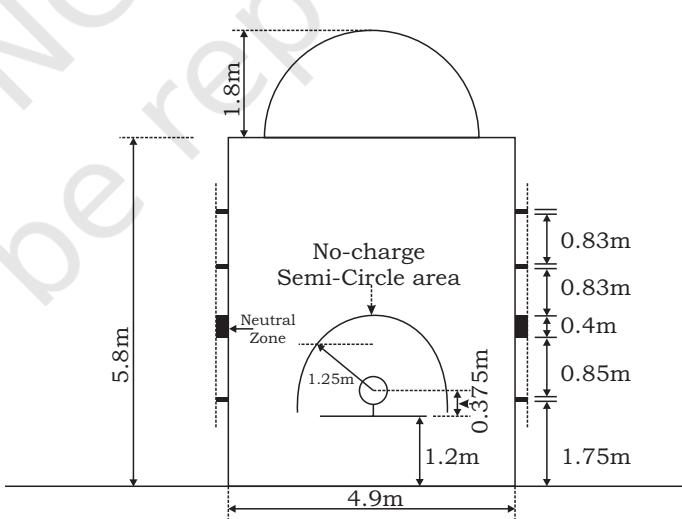
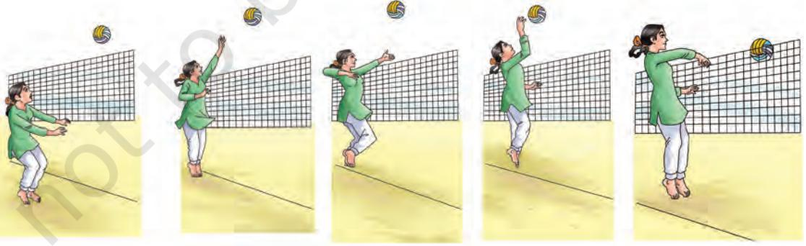
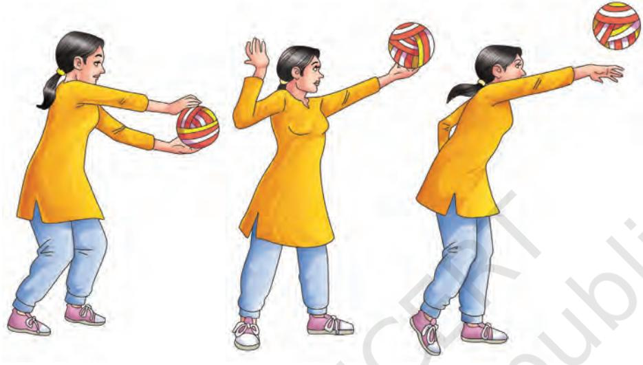

**5**

# **Team Games**

Any game which provides opportunities to two or more players working together towards a shared objective is called a team game. A team game is an activity in which individuals are organised in a team to compete with the opposing team, in accordance with a set of laws/rules to win. Games like Basketball, Cricket, Football, Handball, Hockey, Volleyball, etc., are some of the classic examples of major team games.

However, over a period of time, the popularity of team games has grown continuously. These games have positively influenced not just the players, but also their fans, local and national economies. All over the world, the impact of team games can be seen resulting in professional players to live out their dreams. Star players have become role models to youth. Young athletes/players develop life skills which are followed as footsteps of their role models.

In this chapter, some of the team games like Basketball, Cricket, Football, Handball, Hockey, Kabaddi, Kho-Kho, and Volleyball are explained.

# **Basketball**

Basketball is a team game played between two teams of five players each, on the court. Very high amount of energy (calories) expenditure is there in this game. It also helps in building bone and muscle strength and boosts the immune system. This game also develops self-discipline and concentration among young players.

# **History**

Basketball originated in the United States of America and was invented by Dr. James Naismith in December, 1891, who was a Physical Educator at the International Young Men's Christian Association Training School (YMCA) (now known

Chap-5.indd 129 31-07-2020 15:27:24

as Springfield College of Physical Education) in Springfield, Massachusetts.

#### **Do You Know?**

On January 15 1892, the first set of rules of the Basketball game were published by Dr. James Naismith in the college magazine, "*Triangle*", under the title "A New Game".

*Fig. 5.1: Dr. James Naismith*

Naismith sought a vigorous indoor game to keep his students occupied and at proper levels of fitness. But after rejecting many ideas, he obtained a soccer ball and two wooden peach baskets. He hung the baskets on the railing of the balcony at the height of 10 ft above the floor at the opposite ends of the gym hall. The objective of the game was to toss the soccer ball into the peach baskets. The first basketball game was played among physical education students with nine players on each side, of Springfield secretarial training class of Physical Education (PE) College in December, 1891.

The International Basketball Federation FIBA (French acronym: Federation Internationale de Basketball) association was founded in Geneva in 1932. Basketball was featured in the St. Louis, Missouri, United States, III Olympic Games in 1904. It was officially recognised as an Olympic game in 1936 in Berlin. Due to the wide popularity, Basketball was played in the first Asian Games in 1951 held at New Delhi.

#### *History of basketball in India*

Basketball was introduced in India by American missionaries towards the end of the first decade of 20th century. It was presumed that in the year 1905, the game of basketball was started at the YMCA Calcutta by H. Peterson and J.N. Guaj. The credit of starting and popularising this game goes to YMCA College of Physical Education, Madras in the year 1920. The first National Basketball Championship was organised in 1934 by the Indian Olympic Association and later after the

Chap-5.indd 130 31-07-2020 15:27:24

constitution of Basketball Federation of India (BFI) in 1950 at Mumbai, the First National Basketball Championship under the banner of BFI was held at Ludhiana (Punjab) in 1951.

# **Measurement of playgrounds, and field and specifications of equipment**

# *Playing court*

The playing court shall have a hard and flat surface, free from obstructions with dimensions of 28 m in length and 15 m in width measured from the inner edge of the boundary lines and free space atleast 2 m on all sides.

### *Boundary lines*

These lines are not part of the playing court. The centre line is marked parallel to the endlines from the mid-point of the sidelines. The extended centreline at sidelines (5 cm) divides the court in two halves. It consists of a Back court (team's own basket area) and a Front court (consists of the opponents' basket). All lines are drawn 5 cm in width and in clearly visible white colour. The centre circle shall be marked in the centre of the playing court and have a radius of 1.80 m measured to the outer edge of the circumference. If the inside of the centre circle is painted, it must be the same colour as of the restricted areas.

# **Do You Know?**

- **•** Late C.C. Abraham, professional Physical Education Leader, from Y.M.C.A. College of Physical Education, Chennai and Meher Singh of Rajasthan were the founder, president and secretary of Basketball Federation of India (BFI).
Team Games 131

- **•** Wheelchair Basketball was developed in USA by a badly injured army person after the Second World War around 1946. The rules are approximately similar to Basketball.

*Fig. 5.2: Basketball court*

Chap-5.indd 131 20-08-2020 15:06:18

#### **Do You Know?**

- **•** Side line and end line of Basketball court is 28m in length and 15m in width respectively.
- **•** Back support poles are 2 m away from the end lines.
- **•** The height of the ring from floor is same as it was when Basketball was originated.

#### *Free-throw lines, restricted areas and free-throw*

The free-throw lines are drawn parallel to each end line. It shall have its farthest edge 5.80 m from the inner edge of the end line and shall be 3.60 m long. Its mid-point lies on the imaginary line joining the mid-point of the two end lines.

The restricted areas are the rectangular areas marked on the playing court limited by the end lines, the extended freethrow lines and the lines which originate at the end lines. Their outer edges being 2.45 m from the mid-point of the end lines, terminate at the outer edge of the extended free-throw lines. These lines, excluding the endlines, are part of the restricted area. The inner side of the restricted areas must be painted in one colour. The freethrow semi-circles marked on the playing court with a radius of 1.80 m measured to the outer edge of the circumference and with their centres at the mid-point of the free-throw lines.

- **•** 3 points can be scored by shooting the ball into the opponents' basket from the entire court but from outside of the 3 point line.
- **•** 2 points can be scored by shooting the ball into the opponents' basket, if the shot is taken from inside the 3 point line.
- **•** Only 1 point can be scored by single free shots.

#### *Equipment*

The following equipment will be required—Backstop units (backboards, comprising rings and nets, backboard support structures including padding), basketballs, game clock, scoreboard, shot clock, stopwatch or suitable (visible) device (not the game clock) for timing and time-outs, two separate

Chap-5.indd 132 31-07-2020 15:27:24

distinctly different and loud signals, one each for the shot clock operator and scorer/timer, scoresheet, player foul markers, and team foul markers.

# *Backboard*

The backboards (1.80 m horizontally and 1.05 m vertically) shall be made of a suitable transparent material, made in one (1) piece, non-reflective, with a flat front surface. All lines on the backboards shall be white, 50 mm in width. The rings shall be made of solid steel and shall have an inside diameter of a minimum of 450 mm and a maximum of 459 mm. The nets (400 mm to 450 mm in length) shall be made of white cord with 12 loops to attach it to the ring.

*Fig. 5.5: Basketball backboard and rim dimensions*

# *Basketball*

The ball shall be spherical, with black seams not exceeding 6.35 mm in width and, either of a single shade of orange or of

Chap-5.indd 133 31-07-2020 15:27:25

International Basketball Federation (FIBA) approved colour combination and made of leather/artificial/composite/ synthetic leather/rubber. For all men's and women's competitions, the basketball specifications are given in the following table and diagram.

#### **Do You Know?** First time Indian women's team participated in Bangkok Asian Game in 1978.

#### **Table 1: Basketball dimensions according to category**

| Category | Size | Circumference | Weight |
| --- | --- | --- | --- |
| Men | 7 | 749–780mm | 567–650g |
| Women | 6 | 724–737mm | 510–567g |

# **Functional Rules of Basketball**

Basketball is governed by FIBA official rules. The aim of each team is to score in the opponent's basket and to prevent the other team from scoring. The team that has scored the greater number of points at the end of playing time is declared as the winner.

#### *Team*

In a match, two teams compete with each other. Each team shall consist of not more than 12 team members entitled to play, including a captain who represents his team on the playing court. During playing time, five players from each team shall be on the playing court, without this a game cannot begin. Teams may use as many substitutions as. A maximum of five team support staff members who may sit on the team bench and have special responsibilities, e.g., manager, doctor, physiotherapist, trainer, statistician, interpreter, etc., besides a coach and, if a team wishes, it can have an assistant coach also. Player's positions are given in the diagram below.

*Fig. 5.7: Players, position (right), attack, defence (left)*

Chap-5.indd 134 31-07-2020 15:27:25

#### *Opponents' Own Basket*

The basket that is attacked by a team is the opponents' basket and the basket which is defended by a team is one's own basket.

### *Uniforms*

The 'All-in-ones' uniform of the team members shall consist of—Jersey of the same dominant colour on the front and back and numbered on the front and back atleast 10 cm high in front and 20 cm high in back with atleast 2 cm width. All players must tuck their Jersey into their playing shorts. Shorts end above the knee, of the same dominant colour at front and back, but not necessarily of the same colour as the jersey. Socks of the same dominant colour for all players of the team. Teams must have a minimum of two sets of jersey (light/dark). Chest number will be from 0 to 99 or 00.

### *Officials, table officials and commissioner*

The officials shall be a referee and 1 or 2 umpire(s). They shall be assisted by the table officials and by a commissioner, if present. The table officials shall be a scorer, an assistant scorer, a timer and a shot clock operator. Different signals are used to run the game by officials. Each foul and goal shall be mentioned in the scoresheet.

#### *Playing time, tied score and extra periods*

The game shall consist of 4 periods of 10 minutes each. There shall be intervals of 2 minutes between the first and second quarter (first half), between the third and fourth period (second half) and before each extra period. There shall be a half-time interval of play of 15 minutes. If the score is tied at the end of playing time for the fourth period, the game shall continue with as many extra periods of 5 minutes as is necessary to break the tie.

#### *Beginning and end of a period or the game*

The first period begins when the ball leaves the hand(s) of the referee on the toss for the jump ball and followed. All the other periods start when the ball is disposed to the players by the officials for the throw in.

#### *How the ball is played*

A game of basketball is played with hand(s) only and may be passed, thrown, tapped, rolled or dribbled in any direction, subject to the restrictions of the rules.

Chap-5.indd 135 31-07-2020 15:27:25

### *Goal*

A basket scored from inside the three-point area (also called 2 point field goal area) is worth of 2 points. A basket scored from beyond the three-point area (3 point field goal area) is awarded 3 points. A basket scored for the free-throw is worth of one point for each successful attempt.

# *Time-out*

Each time-out shall last 1 minute. Each team may be granted two time-outs during the first half, three time-outs during the second half with a maximum of two of these time-outs in the last 2 minutes of the second half. One time-out during each extra period is also given.

#### *Substitution*

A team may substitute a player(s) during a substitution opportunity when the game clock is stopped and the ball becomes dead.

# *Game Lost by Forfeit and default*

The game is lost by a team if the team is absent or unable to present with five players on the court, or by their action to prevent the game in scheduled time, or if they refuse to play. In this situation, the opponent team is declared winner by 20–0.

The game may be lost by default when a team has fewer then two players during the running game at the playing court. The opponent team is declared winner by 2–0.

# *Violations*

A violation is an infraction of the rules. There are different types of violation that occurs during the game.

- **1. Player out-of-bounds and ball out-of-bounds:** A player is out-of-bounds when any part of his body is in contact with the sideline or endline.
- **2. Dribbling:** A dribble starts when a player, having gained control of a live ball on the playing court, throws, taps, rolls, dribbles it on the floor or deliberately throws it against the backboard and touches it again before it touches another player. A dribble ends when the player touches the ball with both hands simultaneously or permits the ball to come to rest in one or both hands.
- **3. Time Rule:** Three seconds—A player shall not hold the ball in the opponents' restricted area with live ball for more than continuous 3 seconds.

Chap-5.indd 136 31-07-2020 15:27:25

- **•** Five seconds—A player may not hold the ball for more than 5 seconds.
- **•** Eight seconds— A team has to go into the opponents' court within 8 seconds.
- **•** Twenty four seconds—When a team gains possession of the ball, they have to attempt the shot within maximum of 24 seconds.
- **4. Back court:** A team which is in control of live ball in its front court may not cause the ball to be illegally return to its back court.

#### *Fouls*

A foul is an infraction of the rules concerning illegal personal contact with an opponent and/or unsportsmanlike behaviour. A number of fouls may be called against a team. Once a team has made four fouls in a period, each next foul will award two free throws to the opponent team. Fouls categorised as personal foul, technical foul, unsportsmanlike foul, disqualifying foul and noted as individual player foul or team fouls.

*Fig. 5.8: An offensive foul*

- **1. Personal foul:** A personal foul occurs when there is illegal contact between two opponents. A player shall not hold, block, push, charge, trip or impede the progress of an opponent by extending the body part, neither in an 'abnormal' position nor shall the player indulge in any rough or violent play. A player who commits more than five personal fouls is excluded from the game.
	- (a) Charging: An offensive foul that is committed when a player pushes or runs over a defensive player. The ball is given to the team upon which the foul was committed.

# **Activity 5.1**

Find out the information about Wheelchair Basketball and share it with classmates.

Chap-5.indd 137 31-07-2020 15:27:26

- (b) Blocking: It is an illegal personal contact, which impedes the progress of an opponent with or without the ball.
- **2. Technical Foul:** It is a non-contact foul of a behavioural nature (disregarding warning, disrespectful, foul language, delay, etc.).
- **3. Unsportsmanlike foul:** It is a foul where spirit of the game or the hard contact is made.
- **4. Disqualification Foul:** It is any unsportsmanlike (violence) action by players, coaches or delegation members.

Irrespective of the penalty, each foul shall be charged, entered on the score sheet against the offender and penalised accordingly. All the possible foul penalties against players on the playing court involved in fighting or any situation which leads to a fight shall be dealt with in accordance of rules.

#### **Basic Skills of Basketball**

Basketball is played with the help of different skills and techniques like stance, footwork, ball holding and handling, dribbling, passing-receiving, shooting and rebounding. Few are mentioned here.

# *Dribbling*

It is important to move the ball across the court, get away from defensive players, make or find a good passing line, make use of faking action, 1 on 1 and of course to penetrate the ball to score the goal. There are different types of dribbling which may be learnt and developed with the help of different drills in stationary and moving positions with or without the defensive player.

*Fig. 5.9: Dribbling*

- **•** Stationary dribble
- **•** Low dribble
- **•** High dribble

Chap-5.indd 138 31-07-2020 15:27:26

- **•** Change of pace dribble
- **•** Crossover dribble
- **•** Behind the back dribble
- **•** Between the legs dribble
- **•** Speed dribble
- **•** Reverse spin dribble

# *Passing and Receiving*

A good offensive attack requires accurate passing and receiving. It helps to speed the ball, find an open man, to find a good shooter or to get away the ball from the defender. Fake and feint are used to increase the quality of passing. There are different types of passing using one or both hands during different stationary and moving group and team drills.

- **•** Chest pass
- **•** Overhead pass
- **•** Push pass
- **•** Bounce pass
- **•** Shoulder pass
- **•** Hook pass
- **•** Off the dribble pass
- **•** Baseball pass

*Fig. 5.10: Passing and receiving*

# *Shooting*

The objective of the game is to win by scoring maximum points. Therefore, improving the team's shooting is important to win a game. Shooting by either one or both hands may be done in the following ways:

- **•** Jump Shot
- **•** Dunk Shot
- **•** Free Throw
- **•** Layup
- **•** Three point shot

Chap-5.indd 139 31-07-2020 15:27:27

*Fig. 5.11: Shooting*

# *Rebounding*

The objective of rebounding is to successfully gain possession of the basketball after a missed field goal or free throw, as it rebounds from the ring or backboard. This plays a major role in the game, as most possessions end when a team misses a shot. There are two categories of rebound—offensive rebound, in which the ball is recovered by the offensive side and does not change possession, and defensive rebound, in which the defending team gains possession of the loose ball. The majority of rebound is defensive, as the team on defence tend to be better positioned to recover the missed shots.

*Fig. 5.12: Rebounding*

#### *Defence*

The game of basketball allows a variety of defences to be deployed in an effort to disrupt and combat the offensive plays. Here are examples of the three basic categories of team defence. In addition, each category consists of an assortment of different variations.

Chap-5.indd 140 31-07-2020 15:27:28

- **1. Man to man defence:** Man to man defence is usually assigned to be matched up with the defenders against specific offensive players. Defenders are usually assigned to be matched up with the offensive players by size and ability.
- **2. Zone Defence:** In zone defence, defenders are assigned to guard specific areas on the court. Zones are named or designated by their player alignments.

#### *Fig. 5.13: Zone defence*

- **3. Combined Defence:** The third type of defence that can be deployed is the combination defence. With combination defence, some of the players are assigned to play man to man while the rest of the defenders play zone defence. Combination defences are usually deployed in an effort to stop or neutralise great individual offensive players.
# **Awards in Basketball**

To motivate the extraordinary achievements of the player and coaches, the Government of India honours players with different awards along with cash prizes and certificates.

Prasanthi Singh was honoured with Arjuna Award in 2017 and she is the first basketball player who received the prestigious civilian award Padma Shri in 2018.

# **Famous Indian Basketball Players**

Paramjeet Singh, Sarabjit Singh, Vishesh Bhriguwanshi, Tridep Rai, Suman Sharma, Divya Singh, Anitha, I.V. Chairian, Satnaam Singh, Jagdeep Singh, Gurvinder Singh, and Shri Khusi Ram.

# **Do You Know?**

Basketball is also played by three players on each side.

#### **Activity 5.2**

- **•** What is the air pressure of a Basketball?
- **•** When and where was the first Basketball match in Olymic Games played?
- **•** Who invented Basketball?
- **•** Why is the colour of basketball orange?
- **•** What is the size and weight of a basketball?

Chap-5.indd 141 31-07-2020 15:27:28

# **Cricket**

Playing any game need strength and vice versa helps in building strength. Cricket also, through the constant running across the field, helps in increasing the stamina, balance, hand-eye coordination, flexibility and ball-handling skills. Cricket includes a lot of throwing and sprinting across the field, which is a good cardiovascular activity.

# **History**

A reference of a game resembling to cricket is there in the records of King Edward I, in 1300 being played at Kent. Cricket as a game was first recorded in 16th century in England. Researches show that the game evolved from a very old, widespread game to pass time in which one player served a small piece like a ball made up of wood or any other material and another player hit it with a suitable item. The first recorded cricket match took place in Kent in 1646. Cricket was popular and widely documented in England during the 1700s. After 1760, the game saw the evolution of over arm bowling by replacing under arm bowling. The Marylebone Cricket Club (MCC) was formed on 31st May, 1787. After a year, it laid down a code of laws regarding the game. Its laws were adopted throughout the game. MCC today remains the custodian and arbiter of laws relating to cricket around the world. Thereafter, cricket recognisably became the game that is played today. In the 1800, cricket had reached the West Indies and India and in the 19th century cricket was played in South Africa and New Zealand. The first international cricket game was played between the USA and Canada in 1844. The match was played at the grounds of St George's Cricket Club in New York. In 1877, an England touring team in Australia played two matches against full Australian XIs that are now regarded as the inaugural test matches.

# *History of Cricket in India*

Cricket is undoubtedly one of the most popular games in India since its inception. The first Indian Cricket club, named the Parsee Oriental Cricket Club, was founded in the year 1848 and they played their first match in Bombay (Mumbai). From this point, the journey of Indian cricket began. The first international exposure in the history of Indian Cricket came in the year 1926. In the same year, a team from the Marylebone Cricket Club (MCC) toured India. Though it was an unofficial tour, Indian people were quite interested and enthusiastic about the matches that MCC played during the tour.

Chap-5.indd 142 31-07-2020 15:27:29

The legendary Indian cricket player, C.K. Naidu played brilliantly during that tour and he also scored a century against the MCC in Bombay. Imperial Cricket Conference (ICC), now International Cricket Council, was formed on 30 November, 1907. At present there are 105 countries as members of ICC. The Board of Control for Cricket in India (BCCI) was established in the year 1928. India played its first test match against England in 1932. Now cricket is played to cover all the three formats, ranging from 5 Day tests, to the exciting one-day 50 over format, and the 20 over format which is called as T20.

*Fig. 5.14: Cricket in the early ages*

# **Functional Rules**

Cricket has many laws, more than any other game. Cricket is played with a bat and ball on a large field, known as ground. It is played between two teams having 11 players each. There is also a reserved player called a 'twelfth player', who is used if any player is injured during the play. The twelfth player is not allowed to bowl, bat, or to act as wicketkeeper or captain of the team. The twelfth player is only to act as a substitute fielder.

The objective of the game is to score runs with the bat by the batsman, or dismiss the opposing batsman when in the field by the bowlers. The cricket laws are for the traditional form of cricket which is called 'Test Cricket'. However, there are separate rules for one day and T20 format game also.

# **Do You Know?**

India won the 60 over World Cup beating West Indies in 1983, 50 over World Cup defeating Sri Lanka in 2011 and 20 over World Cup beating Pakistan in 2007.

#### **Activity 5.3**

Gather and share information about the first Indian team of test match, one day match and T20 match in male and female categories.

Chap-5.indd 143 31-07-2020 15:27:29

Chap-5.indd 144 31-07-2020 15:27:29

| Number of Players in a team | 11 (Playing) + 05 (Extras) = 16 |
| --- | --- |
| Number of Officials | 03 Umpires, 01 Match Referee, 02 Scorers |
| Length of the Bat | 38 inches (965 mm) |
| Width of the Bat | 4.25 inches (108 mm) |
| Weight of a Cricket Ball | 155.9 gms – 163 gms |
| Circumference of a Ball | 22.4 cm – 22.9 cm |
| Colour of a Ball | Red (Day Matches and Test Matches) |
|  | White (Day Night Matches) |
| Length of the Pitch | 22 yds or 20.12 mts or 66 feet |
| Width of the Pitch | 3.05 mts or 10 feet |
| Height of the Stumps | 28 inches (With bails 28.5 inches) |
| Width of the Stumps | 9 inches (22.9 cm) |

*Fig. 5.17: Cricket pitch measurements*

There are two ground umpires and a third umpire. Their role is to ensure in the ground that the game is played as per the preambles and laws. The third umpire is in charge of the video decisions.

**Game Structure:** Test cricket is a game that spans for two or more innings. This means that one team needs to bowl and the other would do batting. If a team is out twice or scores less runs in two innings, than that team is the losing team.

Before the game begins, an umpire tosses a coin. The captain who guesses the correct side of the coin will then choose whether to bat or field first.

# **How to play Cricket**

- **•** One team will bat while the other team will field.
- **•** If the bowler bowls the ball from the wrong place or the ball is either dangerous or bounces more than twice or rolls before reaching the batsman or if fielders are standing at illegal positions, it is called 'No Ball'.

Chap-5.indd 145 31-07-2020 15:27:29

*Fig. 5.18: (a) No ball (b) Wide ball*

The batsman can hit a no ball and score runs and also cannot be declared out from a no ball except if the player is run out or hit the ball twice, or obstruct the field. A no ball will add one run to the batting team.

- **•** A 'Wide Ball' is declared if the batsman did not have a reasonable opportunity to score off the delivery. As if the delivery is bowled over the batsmen's reach. A wide delivery will add one run to the batting team.
- **•** A 'Bye' run is scored when a batsman is trying to hit the ball but could not hit it and is miss-field by the fielder or wicket keeper.
- **•** A 'Leg Bye' run is scored if while hitting, the batsman misses to hit the ball by bat and is deflected by striker's body or protective gear.

*Fig. 5.19: (a) Bye (b) Leg bye (c) Out (d) Short run (e) Six (f) Four (g) Decision change (h) Dead ball*

#### *When is a Batsman declared 'out' as per cricket rules?*

There are 11 ways through which a batsman can be given "out" in the game of cricket.

- **• Bowled:** If the ball is bowled and hits the striking batsman's wickets, the batsman is given out (as long as at least one bail or stump is dislodged by the ball).
Chap-5.indd 146 31-07-2020 15:27:32

It does not matter whether the ball has touched the batsman's bat, gloves, body or any other part of the batsman.

- **• Caught:** If a batsman hits the ball or touches the ball at all with the bat or hand holding the bat and the fielders, or wicket keeper or bowler catches the ball, it is called as caught out.
- **• Stumped:** A batsman can be given out when the wicketkeeper puts down the wicket while the player is out of the crease and not attempting a run (while attempting a run it would be a run out) but trying to play the ball and misses it.

#### **Activity 5.5**

- **•** Draw and discuss the different positions of the fielders in cricket.
#### **Do You Know?**

There is no fix measurement for cricket's outer bounderies.

*Fig. 5.20: (a) Bowled (b) Caught (c) Stumped*

- **• Leg Before Wicket (LBW):** If the ball is bowled (not a No Ball) and it hits the batsman first without touching and the bat and umpire thinks and decide that the ball would have hit the wickets if the batsman was not there, then the LBW decision is possible. However, if the ball hits the batsman outside the line of off stump while the player was attempting to play a stroke then the player is not out.
- **• Run Out:** A batsman is out if no part of the bat or body is grounded behind the popping crease while the ball is in play and the wicket is fairly put down by the fielding side.
- **• Hit Wicket:** If a batsman hits the wicket down with the bat or body after the bowler has entered the delivery stride and the ball is in play, then the player is out.
- **• Handled the Ball:** If the batsman willingly handles the ball with the hand that is not touching the bat without the consent of the opposition, then the player is declared out.

Chap-5.indd 147 31-07-2020 15:27:33

*Fig. 5.21: (a) Hit wicket (b) Run out*

**Do You Know?** After Jim Leker of England, only Anil Kumble from India in 1999 took all 10 wickets in one inning (74/10 in 26.3 overs).

- **• Obstructing the Field:** A batsman is out if he willingly obstructs the opposition by word or action.

(a) *Fig. 5.22: (a) Handled the ball (b) Obstructing the field* (b)

- **• Timed Out:** The time for an incoming batsman to face a ball or be at the non-strikers end within three minutes of the outgoing batsman being dismissed. If this is not done, the incoming batsman can be given out.
- **• Hit the Ball Twice:** If a batsman hits a ball twice other than for the purpose of protecting his wicket, he is out.
- **• Retired:** If a batsman retires without the umpire's consent and also doesn't have the consent of the opposition captain to resume his innings, then technically he is out.

There are many other cricket laws. Many of the more advanced rules and laws can be learned along the way and are not vital to general play.

- Chap-5.indd 148 31-07-2020 15:27:35
# **Awards in Cricket**

To motivate the extraordinary achievements of the players and coaches, the Government of India honours players with different awards along with cash prizes and certificates.

### *In the year 2018*

Virat Kohli received Rajiv Gandhi Khel Ratna Award in 2018. Smriti Mandhana was honoured with Arjuna Award. Tarak Sinha has been honoured with Dronacharya Award for an excellent contribution as a Coach.

# **Football**

The history of football is over more than 1000 years old. Today, football is world's most favourite sport played in almost every country. Studies reveal about various games similar to the modern football being introduced in different parts of the world by different cultures for different purposes. Oldest version of football game is believed to be played in the villages of Chinese dynasty.

# **History of the Game**

Both rugby and football have a common root. There were many who instead of kicking believed in running with the ball in their hands. Kicking the ball included tripping the legs without any legislation or rules to govern. On the contrary, many people stood for football with kicking as it involved greater mastery of ball. In football, high level of skill precision was required to control and manoeuvre the ball with foot. The rules of play were subsequently smoothed down and smartened to create organised sports at Britain and Scotland. It was at this point that the people spoke out against rough customs as tripping, shin-kicking and so on. As it happened, the majority also expressed disapproval at carrying the ball with hand. It was in 1863 in England that the Rugby football group withdrew and formed a separate branch. This further led to the development modern-day sports of 'Association Football', 'Rugby Football' and 'Gaelic Football' in Ireland. Later the Football Association in England was formed becoming the sports' first governing body. In 1904, 'Federation International de Football Association' (FIFA) was founded in Paris as an international governing body of football. The game of football in today's scenario is called 'Soccer'.

# **Do You Know?**

- **•** Football was essentially rugby until 1882.
- **•** Football is the most watched and most played sport on earth.

Chap-5.indd 149 31-07-2020 15:27:35

#### **Do You Know?**

Durand Cup started in the year 1888 in Shimla and it is the second oldest tournament in the world. Presently, this tournament is being organised in New Delhi every year with the help of Indian Defence Services.

#### **Activity 5.6**

Collect information about the various types of free kicks in football.

## **Modern football**

Britain is regarded as the home to modern association football. Within Britain and Scotland, the game was popular from eight century and again played with different variations. In medieval times, towns and villages played against the rival towns and villages— and kicking, punching, biting and gouge were allowed. Hundreds of people took part and the games could last all day. It was same until the game started being promoted in schools in England as an integral part of the school curriculum. The need for uniform standards and rules acceptable to everyone was the need of the hour. This led to the role of Cambridge University in unifying the schools and the clubs to a meeting in 1863 for establishing common acceptable rules. Football Association Challenge Cup was started in 1872, which is regarded as the world's oldest football championship. In the year 1888, 'Durand Cup' was started in Shimla (India) and in modern time Durand cup for football is regarded as second oldest football tournament in the world. Later in 1904, FIFA (Federation International de Football Association) was formed with France, Netherlands, Belgium, Denmark, Sweden, Switzerland, Spain and Germany as the founder members.

# **History of Football in India**

Football in India has been a popular sport introduced in nineteenth century by the British army, from the capital at Calcutta. Durand Cup started in 1888, founded by the then India's Foreign Secretary, Mortimer Durand at Shimla. Durand Cup is the third oldest football tournament after Football Association (FA) Cup and Scottish Cup. Clubs like Mohan Bagan, which is the oldest current team, was formed in 1889. Indian Football Association (IFA) Shield is the fourth oldest tournament in the world which was founded in 1893 and is still being played. Durand Cup was shifted to Delhi. Since 1950, every year it is organised under the supervision of Indian Army.

Before the birth of the All India Football Federation (AIFF) in 1937, India was lacking a constituted national organisation for football. Since, football gained immense popularity year after year, a need for the proper administration of the game was considered. The association that governed football in West Bengal, Indian Football Association (IFA), was given the status of the de-facto governing body of football. That time all the foreign tours of Indian football team were organised by IFA. AIFF was affiliated to FIFA (international governing body of football) in 1948 and to Asian Football Confederation (AFC) in 1954. AIFF has played a key role in promoting

Chap-5.indd 150 31-07-2020 15:27:35

football in India. To serve the purpose, it has taken the responsibility of Indian national football team. National Football League (I-League), Federation Cup and National Football Championship for Santosh Trophy are some of the prominent football tournaments being organised by the AIFF.

# **Activity 5.7**

Find out the measurements of the football ground in your school or nearby school in your vicinity.

*Fig. 5.23: A football ground*

# **Laws of football**

In the game of football, rules are called Laws and there are 17 Laws of football that govern the game. FIFA is the governing body of football around the world. It governs the rules for playing the sport. The referees are being trained for consistent interpretation and quality enforcement of the 17 laws of the game. There are 17 laws of the game which are the codified rules of help define association football.

# *Law 1*

**The Field of Play:** It mentions about the field surface along with the dimensions for field marking. The field of play should be rectangular in shape and the width should not exceed the length of the field.

**Table 2: Dimensions**

| Length (Touch | Minimum | 90 mt | 100 yds |
| --- | --- | --- | --- |
| Line) | Maximum | 120 mt | 130 yds |
| Width (Goal Line) | Minimum | 45 mt | 50 yds |
|  | Maximum | 90 mt | 100 yds |

# **Do You Know?**

Neil Armstrong wanted to take a football to the moon, but NASA refused it as nothing extra was allowed.

Chap-5.indd 151 31-07-2020 15:27:36

Shin guards

Football boots or Studs

*Fig. 5.24: Football equipment*

FIFA defines minimum dimensions of 45m × 90m and maximum dimensions of 90m × 120m for a standard football ground. FIFA has also set measurements for minimum football ground for the official matches or international competitions as 64m × 100m and maximum to 75m × 110m.

**Table 3: International Matches**

### *Law 2*

**Ball:** The football must meet the following criteria as per the FIFA laws—

- (a) The ball shall be spherical in shape.
- (b) It should be made of leather or any other suitable material approved by the governing body.
- (c) Ball circumference shall be 68 to 70 cm which is equal to 27 to 28 inches.
- (d) The weight of the ball shall be between 410 to 450g which is equal to 14 to 16 oz at the start of the match.
- (e) Air pressure should be equal to 0.6–1.1 atmosphere (600–1,100 g/cm2) at sea level.

# *Law 3*

**Number of Players:** A match is played by two teams. Each team shall consist of not more than 11 players during the match, one of whom shall act as goalkeeper. A match may not start if either team consists of fewer than seven players.

**Substitutions:** Up to a maximum of three substitutes may be used in any match played in an official competition organised under the auspices of FIFA or the member associations. For all other competitions, the rules of the competition must state how many substitutes may be nominated, it can vary from three up to a maximum of twelve, before the tournament begins.

# *Law 4*

**Players' Equipment:** The basic compulsory equipment of a player comprises the following items:

- (a) *A jersey or shirt with sleeves:* If undergarments are worn, the colour of the undergarments must be of same colour as the sleeve of the jersey or shirt.
- (b) *Shorts*: If undershorts or tights are worn, these must be of same colour as the shorts.

Chap-5.indd 152 31-07-2020 15:27:36

- (c) *Stockings:* If tape or similar material is applied externally, it must be of same colour as that part of the stocking to which it is applied.
- (d) Shin guards
- (e) Shoes

#### *Law 5*

**Referee:** Each match is controlled by a referee, who shall enforce the Laws of the Game. Duties of a Referee:

- (a) Enforces the Laws of the Game.
- (b) Controls the match in cooperation with the assistant referees (Line Judges) and, wherever applicable, with the fourth official (Table Official).
- (c) Ensures that the ball used meets the requirements of Law number 2.
- (d) Ensures that the player's equipment meet the requirements according to Law number 4.
- (e) Acts as timekeeper and keeps a record of the match.
- (f) Stops, suspends or abandons the match, for any infringements of the Laws.
- (g) Stops, suspends or abandons the match because of outside interference of any kind.
- (h) Stops the match if, in his opinion, a player is seriously injured and ensures that player is removed from the field of play. An injured player may only return to the field of play after the match has restarted.
- (i) Allows the play to continue until the ball is out of play if a player is, in his opinion, only slightly injured.

#### *Law 6*

**Assistant Referees:** The decision of the assistant referee is always subject to the decision of the referee. However, two assistant referees are appointed, whose duties, are to indicate:

- (a) when the entire ball leaves the field of play.
- (b) which team is entitled to a corner kick, goal kick or throw-in.
- (c) when a player may be penalised for being in an offside position.
- (d) when a substitution is requested.
- (e) when misconduct or any other incident occurs out of the view of the referee.
- (f) when offences have been committed whenever the assistant referees have a better view than the referee (this includes, in certain circumstances, offences committed in the penalty area).

**Do You Know?**

Soccer is the universal name of the Footbal game. It is governed by the rules formed by FIFA.

Chap-5.indd 153 31-07-2020 15:27:36

**Activity 5.8**

Collect information about the kick off in football.

- (g) Whether, at penalty kicks, the goalkeeper moves off the goal line before the ball is kicked and if the ball crosses the line.
#### *Law 7*

**Duration of the Match:** The match lasts two equal periods of 45 minutes, unless otherwise mutually agreed between the referee and the two teams. Any agreement to alter the duration of the periods of play (e.g., to reduce each half to 40 minutes because of insufficient light) must be made before the start of play and must comply with competition rules. The half-time interval must not exceed 15 minutes.

#### *Law 8*

**Start and Restart of Play:** A kick-off is a way of starting or restarting play—

- (a) At the start of the match.
- (b) After a goal has been scored.
- (c) At the start of the second half of the match.
- (d) At the start of each period of extra time, wherever applicable.

A goal may be scored directly from the kick-off. The procedure for the kick-off is by pushing the ball in any direction by one of the team mates but all the team members must be in their own half before the kick-off. The team winning the toss chooses the side to attack while the losing team gets the kick-off. In the second half, the team that won the toss gets the kick-off.

# *Law 9*

**Ball In and Out of Play:** The ball is out of play when:

- (a) It has wholly crossed the goal line or touch line whether on the ground or in the air.
- (b) Play has been stopped by the referee.

The ball is in play at all other times. Ball will also be in play when:

- (c) It rebounds off a goalpost, crossbar or corner flag post and remains in the field of play.
- (c) It rebounds off either the referee or an assistant referee when they are on the field of play.

# *Law 10*

**Method of Scoring:** A goal is scored when the whole of the ball passes over the goal line between the goalposts and under the crossbar, provided that no infringement of the

Chap-5.indd 154 31-07-2020 15:27:36

Laws of the game has been committed previously by the team scoring the goal.

### *Law 11*

**Offside:** It is not an offence in itself to be in an offside position. However, players in offside position cannot make themselves on-side until the course of the ball changes.

A player is in an offside position if—

- (a) The player is nearer to the opponents' goal line than both the ball and the second-last opponent.
A player is not in an offside position when:

- (i) The player is in their own half of the field of play, or
- (ii) The player is level with the second-last opponent, or
- (iii) The player is level with the last two opponents.
- (b) There is no offside offence if a player receives the ball directly from—
	- (i) a goal kick
	- (ii) a throw-in
	- (iii) a corner kick

#### *Law 12*

**Fouls and Misconduct:** For not following the Laws of the game, the referee can penalise the team members through a—

- (a) Direct Free Kick
- (b) Penalty Kick
- (c) Indirect Free Kick

The referee may caution the player, substitutes or substituted players with a 'Yellow Card'. The referee may suspend the team members with a Red Card leading to suspension from the current match along with a second match suspension.

- (a) *A direct free kick:* It is awarded to the opposing team if a player commits any of the following seven offences in a manner considered by the referee to be careless, reckless or using excessive force.
	- (i) Kicks or attempts to kick an opponent
	- (ii) Trips or attempts to trip an opponent
	- (iii) Jumps at an opponent
	- (iv) Charges an opponent
	- (v) Strikes or attempts to strike an opponent
	- (vi) Pushes an opponent
	- (vii) Tackles an opponent

Chap-5.indd 155 31-07-2020 15:27:36

A direct free kick is also awarded to the opposing team if a player commits any of the following three offences.

- (i) Holds an opponent
- (ii) Spits at an opponent
- (iii) Handles the ball deliberately (except for the goalkeeper within the player's own penalty area)
- (b) A penalty kick: A penalty kick is awarded if any of the above ten offences is committed by a player inside their own penalty area, irrespective of the position of the ball, provided it is in play.
- (c) An Indirect Free Kick: An indirect free kick is awarded to the opposing team if a goalkeeper, inside their own penalty area, commits any of the following four offences:
	- (i) Controls the ball with hands for more than six seconds before releasing it.
	- (ii) Touches the ball again with hands after the ball is released from his possession and before it has been touched by another player.
	- (iii) Touches the ball with hands after it has been deliberately kicked to the player by a team-mate.
	- (iv) Touches the ball with hands after receiving it directly from a throw-in taken by a team-mate.

An indirect free kick is also awarded to the opposing team if, in the opinion of the referee, a player—

- (i) Plays in a dangerous manner
- (ii) Impedes the progress of an opponent
- (iii) Prevents the goalkeeper from releasing the ball from the player's hands
- (iv) Commits any other offence, not previously mentioned in Law 12, for which the play is stopped to caution or send off a player.

The indirect free kick is taken from the place where the offence occurred.

**Cautionable offences (Yellow Card):** A player is cautioned and shown the yellow card if he commits any of the following seven offences:

- (i) Unsporting behaviour
- (ii) Dissent by word or action
- (iii) Persistent infringement of the Laws of the game
- (iv) Delaying the restart of play
- (v) Failure to respect the required distance i.e., 10 yards away from the ball, when play is restarted with a corner kick, free kick or throw-in

Chap-5.indd 156 31-07-2020 15:27:36

- (vi) Entering or re-entering the field of play without the referee's permission
- (vii) Deliberately leaving the field of play without the permission of referee.

A substitute or substituted player is cautioned with a Yellow Card if commits any of the following three offences:

- (i) Unsporting behaviour
- (ii) Dissent by word or action
- (iii) Delaying the restart of play

**Sending-off offences (Red card):** A player, substitute or substituted player is sent off by showing a 'Red Card' if they commit any of the following seven offences:

- (i) Serious foul play
- (ii) Violent conduct
- (iii) Spitting at an opponent or any other person
- (iv) Denying the opposing team a goal or an obvious goal scoring opportunity by deliberately handling the ball (this does not apply to a goalkeeper within their own penalty area)
- (v) Denying an obvious goal scoring opportunity to an opponent moving towards the player's goal by an offence punishable by a free kick or a penalty kick
- (vi) Using offensive, insulting or abusive language and gestures
- (vii) Receiving a second caution (yellow card) in the same match

A player, substitute or substituted player who has been sent off, must leave the vicinity of the field of play and the technical area.

# *Law 13*

**Free Kicks:** Free kicks are of two types.

- (a) Direct free kick
- (b) Indirect free kick

Direct free kick: If a direct free kick is taken and it enters the goal:

- (a) If a direct free kick is kicked directly into the opponents' goal, a goal is awarded
- (b) If a direct free kick is kicked directly into the team's own goal, a corner kick is awarded to the opposing team.

A score cannot be made through an indirect free kick if taken straight way into the goal without touching any other player.

Chap-5.indd 157 31-07-2020 15:27:36

#### **Do You Know?**

A direct free kick, if kicked directly into the team's own goal, a corner kick is awarded to the opposing team.

*Fig. 5.25: Free kick*

#### *Law 14*

**Penalty Kick:** A penalty kick is given against a team that commits one of the ten offences inside its own penalty area while the ball is in play. A goal may be scored directly from a penalty kick.

During the penalty kick, all the players other than the kicker are located—

- (a) inside the field of play.
(b) outside the penalty area.

- (c) behind the penalty mark.
- (d) at least 9.15 m (10 yds) away from the penalty mark.

*Fig. 5.26: Penalty kick*

#### *Law 15*

**Throw-in:** It is a method of restarting play. A throw-in is awarded to the opponents of the player who last touched the

Chap-5.indd 158 31-07-2020 15:27:37

ball when the whole of the ball crosses the touch line, either on the ground or in the air. A goal cannot be scored directly from a throw-in.

# *Law 16*

**Goal Kick:** A goal kick is a method of restarting play. A goal kick is awarded when the whole of the ball passes over the goal line, either on the ground or in the air, having last touched a player of the attacking team. A goal may be scored directly from a goal kick, but only against the opposing team. If the goal kick is kicked into the team's own goal, a corner is awarded to the opposing team.

# *Law 17*

**Corner Kick:** It is a method of restarting play. A corner kick is given when the whole of the ball passes over the goal line, either on the ground or in the air, having last touched a player of the defending team. A goal may be scored against the opposing team directly from a corner kick.

Measurements of playgrounds and specifications of equipment:

All lines in the playground must be of the same width and must not be more than 12 cm (5 inch).

**Goal area:** Two lines are drawn at right angles to the goal line, 5.5 m (6 yds) from inside of each goalpost. These lines extend into the field of play for a distance of 5.5 m (6 yds). These extended lines are joined by a line drawn parallel with the goal line. The area bounded by these lines and the goal line is the goal area. A goal kick is taken from the goal area only.

### **Penalty area**

- **•** Two lines are drawn at right angles to the goal line, 16.5 m (18 yds) from inside of each goalpost. These lines extend into the field of play for a distance of 16.5 m (18 yds). These extended lines are joined by a line drawn parallel with the goal line. The area bounded by these lines and the goal line is called the penalty area.
- **•** Within each penalty area, a mark is made at a distance of 11 m (12 yds) from the midpoint between the goalposts or equidistant to them. This is called penalty mark.
- **•** An arc with a radius of 9.15 m (10 yds) from the centre of each penalty mark is drawn outside the penalty area known as penalty arc.

**Flag posts:** A flag post, not less than 1.5 m (5 ft) high, with a non-pointed top and a flag must be placed at each corner. Flag posts may also be placed at each end of the halfway line, not less than 1 m (1 yd) outside the touch line.

Chap-5.indd 159 31-07-2020 15:27:38

**Goals:** A goal must be placed on the centre of each goal line. A goal consists of two upright posts equidistant from the corner flag posts and joined at the top by a horizontal crossbar. The goalposts and crossbar must be made of wood, metal or other approved material.

They must be square, rectangular, round or elliptical in shape and must not be dangerous to players. The distance between the posts is 7.32 m (8 yds) and the distance from the lower edge of the crossbar to the ground is 2.44 m (8 ft).

Both goalposts and the crossbar have the same width and depth, which do not exceed 12 cm (5 inches). The goal lines must be of the same width as the goalposts and the crossbar. Nets may be attached to the goals and the ground behind the goal. These are properly supported and do not interfere with the goalkeeper. No part of the goalpost shall be projected towards or inside the playing area. The goalposts and crossbars must be white in colour.

*Fig. 5.28: Goalpost*

# **Famous Indian Football Players**

P.K. Banerjee, Chuni Goswami, Sunil Chhetri, I.M. Vijayan, Baichung Bhutia, V.P. Sathyan, Sandesh Jhingan, Sasmita Mallick, Aditi Chauhan, etc.

# **Handball**

#### **History**

At the end of the nineteenth century, somewhere in Northern Europe, it became necessary to unify the rules, which was

Chap-5.indd 160 31-07-2020 15:27:38

done by Karl Schelenz. The new game rules came in force in Berlin, in 1917. The sports international governing body was first formed in 1928 as the Federation International Handball Amateur. It took its current name in Copenhagen, Denmark in 1946 as the International Handball Federation (IHF). The first president of IHF was Avery Brundage—an American who went on to become president of the International Olympic Committee (IOC). The first Field Handball World Championships were played in Germany in 1938, following its appearance at the 1936 Berlin Olympic Games and then it made a comeback into the games in the 1972 Munich Olympic games. The women's version of the game was added in the 1976 Montreal Olympic games. Indoor Handball was invented in the 1940s in Denmark. The International Handball Federation which was established in 1946, oversees the game, and at present it has 175 member countries associated with it. The first International Handball Federation (IHF) World Men's Handball Championship commenced in 1954. The IHF World Women's Handball Championship commenced in 1957.

The Asian Handball Federation (AHF) is the governing body of handball in Asia. The Asian Handball Federation had begun when the Martyr Sheikh Fahad Al-Ahmad Al-Sabah of the Kuwait initiated a motion to the Executive Committee of the Asian Games requesting recognition of the handball game and also formation of the Asian Handball Federation during seventh Asian Games, Tehran, Iran in 1974. Accordingly, the Asian Games Federation during its meeting on 26th of August 1974, had recognised Handball as an official game. The headquarters is located in Kuwait City, Kuwait.

The Handball federation of India was established in 1972. The first senior National Handball Championship was held at Rohtak (Haryana) in 1972. Haryana won the gold medal and Vidharbha got the silver medal. First time in India, Handball Team participated in Asian Games held in India in 1982.

# **Functional Rules**

#### *Playing Area*

The handball court measures 40 meters in length and 20 meters in width which is divided by the centre line. The goal area line, or 6-meter line, is the most important line. No one except the goalkeeper is allowed to stand in the goal area. Opponent players may not jump or enter into the goal area without releasing the ball for goal.

#### **Do You Know?**

In India, Handball was founded by Jagat Singh Chauhan who was Physical Education teacher and hailed from Haryana. He was the first secretary of Handball Federation of India.

#### **Activity 5.9**

Make a list of the famous handball players in male and female section.

Chap-5.indd 161 31-07-2020 15:27:38

**Handball Tournaments and Championships**

World Championship, Olympic Games, Summer Olympics, Asian Olympics, Commonwealth Games are the tournaments organised by international sports organisations. Whereas, Handball Federation of India organises Federation Cup, National games and Indian Handball Super League, etc.

*Fig. 5.29: Playing area and players, position in handball*

*Fig. 5.30: Specifications and rules regarding handball*

Chap-5.indd 162 31-07-2020 15:27:39

### *Number of Players*

A team consists of 16 players and substitutes in each team. There are seven playing members on each team (six court players and one goalkeeper). Substitute team member may enter the game at any time repeatedly through the team's own substitution area as long as the player they are replacing has left the court. Player positions and nomenclature are given in the diagram.

*Fig. 5.31: Players' attacking and defensive positions in handball court*

# *Uniform of the Players*

Player chest numbers range from 1 to 99. Uniform shirts and shorts are of the same colour. The goalkeeper must wear a different coloured shirt from the teammates and opponents. No jewellery is allowed.

#### *Referees*

There are two referees, a court referee and a goal line referee. Referees have complete authority and their decisions are final. The referees are assisted by a timekeeper and a scorer.

#### *Duration of the Game*

The duration of the match for different age groups is allotted as mentioned in the following table:

Chap-5.indd 163 31-07-2020 15:27:40

| Age Group | Playing time with 10 minutes of interval |
| --- | --- |
| 8–12 years | Two halves of 20 minutes |
| 12–16 years | Two halves of 25 minutes |
| 16 and above | Two halves of 30 minutes |

**Table 4: Duration of the game**

This is running time except for injury or one team timeout. The teams have to change bench/side after half-time. Overtime consists of two halves of 5 minute/period with 1 minute half-time break. If the game is still tied, the winner will be determined in accordance with the rules of the particular competition.

# *Team Time-out*

One minute time-out can be taken by each team in every half.

# *Throw-off*

A throw-off is given to the team that wins the toss. Both the teams must be in their own side of the court with the defense 3 meters away from the ball. On a whistle, the ball is passed from centre court to a teammate and the play begins. Throwoff is repeated after every goal scored and after half-time.

# *Throw-in*

When the ball goes out of bounds on the sideline or when the ball is last touched by a defensive player (not goalkeeper), a throw-in is awarded and goes out of bounds over the endline. The throw-in is taken from the nearest spot where the ball crossed out. The thrower must put either foot on the sideline to perform the throw-in. All opponents must stand 3 meters away from the ball.

# *Scoring*

A goal is scored when the entire ball crosses the goal line inside the goal. A goal may be scored from any type of throw, i.e., free-throw, throw-in, throw-off, and goal-throw.

# *Playing the Ball*

A player is permitted to throw, push, stop, catch, or hit the ball, by using hands (open or closed), head, arms, torso, thighs, and knees.

- (a) A player is allowed:
	- (i) to run with the ball for 3 steps.
	- (ii) to hold the ball for 3 seconds.

Chap-5.indd 164 31-07-2020 15:27:40

- (iii) unlimited dribble with 3 steps allowed before and after dribbling (no double-dribble).
- (iv) to take a maximum of 3 steps with the ball.

# *Defending the Opponent*

A player may use the torso of the body to defend an opponent with or without the ball. However, using the outstretched arms or legs to obstruct, push, hold, trip or hit is not allowed. The attacking player is not allowed to charge into a defensive player.

# *Passive Play*

A ball possession team cannot delay the game without making a recognisable attempt to attack and to shoot or goal. Referee Throw: A referee throw is awarded simultaneous infringement of the rules after simultaneous possession of the ball. The referee throws the ball vertically between two opposing players at centre court. The jumping players may tap the ball to a teammate or grab the ball. During this, other players must be 3 meters away from the ball.

### *Free-throw*

Free-throw is awarded to the opponent against a minor foul or violation at the exact spot of the foul. If the foul or violation occurs between the goal area line and the 9 meter line, the throw is taken from the nearest post outside the 9 meter line. The thrower must keep one foot in contact with the floor.

# **A Player is NOT allowed to**

- **•** endanger an opponent with the ball.
- **•** pull, hit or punch the ball out of the hands of an opponent.
- **•** contact the ball below the knee.
- **•** dive on the floor for a rolling or stationary ball.

# *7 Meter Throw*

The 7 meter throw is awarded when:

- **•** Illegally demolish a clear chance to goal
- **•** The goalkeeper carries the ball back into his/her team's own goal area
- **•** A court player intentionally plays the ball to his or her own goalkeeper in the goal area and the goalkeeper touches the ball
- **•** A defensive player enters his or her goal area to gain an advantage over an attacking player in possession of the ball.

Chap-5.indd 165 31-07-2020 15:27:40

#### **Activity 5.10**

- **•** Differentiate the yellow and red card penalties.
- **•** What is the name of broken line as displayed in the figure?
- **•** All players must be outside the free-throw line when the throw is taken. The player taking the throw has 3 seconds to shoot after referee's whistle.
- **•** Any player may take the 7 meter throw.

#### *Goal-throw*

When the ball rebounds off the goalkeeper over the end line, a goal-throw is given. The player of the attacking team throws over the ball from the end line. The goalkeeper takes the throw inside the goal area and is not limited by the 3-step/3-second rule.

Progressive Punishments: These pertain to the fouls that require more punishment than just a free-throw. 'Actions' directed mainly at the opponent and not the ball (such as reaching around, holding, pushing, hitting, tripping and jumping into an opponent) are to be punished progressively.

#### *Warnings (Yellow Card)*

The referee gives only one warning to a player for rule violations and a total of three warnings to a team. Exceeding these limits results in 2 minute suspension thereafter. Warning is not required prior to giving 2 minute suspension. 2 minute suspension is awarded to a player for serious or repeated rule violations, like non-sportsmanship conduct, illegal substitution, etc.

## *Disqualification and Exclusion (Red Card)*

A disqualification is equivalent to three 2 minute suspensions. A disqualified player must leave the competition arena. The team has to continue play for rest of the time with one player short due to player's disqualification.

# **Measurement of Playground and Specifications of Equipment**

# *Playing Court*

The playing court in Handball is a 40 meter long and 20 meter wide rectangle, consisting of two goalposts. The longer boundary lines are called side lines, and the shorter ones are called goal lines (between the goalposts) or outer goal lines (on either side of the goal). There should be a safety zone surrounding the playing court, with a width of at least 1 meter along the side lines and 2 meters behind the goal lines.

- All lines on the court are fully part of the playing area that they enclose. The goal lines shall be 8 cm wide at the goalposts (see diagram), whereas all the other

Chap-5.indd 166 31-07-2020 15:27:40

lines shall be 5 cm wide. Lines between two adjacent areas may be replaced with a difference in colours between the adjacent areas of the floor.

- In front of each goal, there is a goal area. The goal area is defined by the goal area line (6 meter line), which is drawn with the following dimensions.
	- (a) A 3 meter long line directly in front of the goal; this line is parallel to the goal line and 6 metres away from it (measured from the rear edge of the goal line to the front edge of the goal area line).
	- (b) Two quarter circles, each with a radius of 6 metres (measured from the rear inner corner of the goalposts), connecting the 3 meter long line with the outer goal line.

The free throw line (9 metre line) is a broken line, drawn 3 metres outside the goal area line. Both the segments of the line and the spaces between them measure 15cm (see diagram).

The 7 meter line is a 1 meter long line, directly in front of the goal. It is parallel to the goal line and 7 meters away from it (measured from the rear edge of the goal line to the front edge of the 7 meter line) see diagram.

The goalkeeper's restraining line (the 4 meter line) is a 15cm long line, directly in front of the goal. It is parallel to the goal line and 4 metres away from it (measured from the rear edge of the goal line to the front edge of the 4 meter line). The center line connects the midpoints of the two side lines.

The substitution line (a segment of the side line) for each team extends from the center line to a point at a distance of 4.5 meters from the center line. This end point of the substitution line is enhanced by a line which is parallel to the center line, extending 15cm inside the side line and 15cm outside the side line (see diagrams).

# **Specifications of equipment**

A goal (see diagrams) is placed in the center of each outer goal line. The goals must be firmly attached to the floor or the walls behind them. They have an interior height of 2 metres and a width of 3 metres.

The goalposts are joined by a horizontal crossbar. The rear side of the goalposts shall be in line with the rear edge of the goal line. The goalposts and the crossbar must have an 8cm square cross section. On the three sides which are visible from the court, they must be painted in bands of two contrasting colors, which also contrast clearly with the background. The goals must have a net, that should be attached in such a way that a ball thrown into the goal normally remains in the goal.

Chap-5.indd 167 31-07-2020 15:27:40

*Fig. 5.32: Specifications of goalpost in handball (all dimensions indicated in cm)*

# *The Ball*

**Activity 5.11** What is substitution area and why is it used? Handball is played with a 32 panel leather ball. The ball sizes, to be used by different categories of teams are as follows:

# **Table 5: Ball Sizes According to Age Group**

| Ball Size | Age Group |
| --- | --- |
| 58–60cm and 425–475g | Men and Male youth of over |
| (IHF Size 3) | age 16 |
| 54–56cm and 325–375g | Women, Female youth (over |
| (IHF Size 2) | age 14), and Male Youth (12– |
|  | 16 years) |
| 50–52cm and 290–330g | Female youth (8–14 years) and |
| (IHF Size 1) | Male youth of age (8–12 years) |

#### **Table 6: Measurement Specifications**

| Terms | Units |
| --- | --- |
| Size of Playfield | 40m × 20m |
| Shooting Circle | 6m Goal Area Line and 9m free throw |
|  | line/outer circle |

Chap-5.indd 168 31-07-2020 15:27:41

| Penalty Point | 7m |
| --- | --- |
| Goalpost | 2m × 3m |
| Ball | Weight: 425–475g (M), 325g–400g (W) Circumference: 58–60cm (M), 54cm– 56cm (W) |
| No. of players | 12 (7 court players and 5 substitutes) |
| Duration of game | 2 Halves of 30 minutes (10 min break in each half) |
| Time Out in game | 1 time out/half/team |
| Extra Time | 2 halves of 5 minute each |

# **Activity 5.12**

- **•** What is the air pressure of a handball?
- **•** What is the size and weight of a handball?
- **•** Who invented Handball?
- **•** Which two countries played the first handball match in Olympic Games?

# **Hockey**

#### **History**

Historical records indicate that the crude form of hockey was played in Egypt around 4,000 years ago. Evidence also shows that a form of this game was played by Romans and Greeks. The modern game of hockey evolved in England in the mid-eighteenth century, primarily around the schools.

The first Olympic Hockey Competition for men was held in London in 1908. Ireland and Scotland competed separately. After having made its first appearance in 1908 games, hockey was subsequently dropped from the 1912 Stockholm Olympic Games. It reappeared in 1920 at Antwerp (Belgium) before being omitted again in Paris in 1924. The Paris organisers refused to include hockey in the Olympics, stating that the sport had no International Federation.

Hockey had made its first step towards an International Federation in 1909 when the Hockey Association in England and the Belgium Hockey Association agreed to recognise each other to regulate international hockey relations. The French Association followed soon after, but this was not considered sufficient to recognise this game at the international level.

#### *Federation International de Hockey (FIH)*

The International Hockey Federation, the world governing body was founded in Paris in 1924, initiated by Paul Leautey, a Frenchman. Paul Leautey became the first President of the FIH.

In many ways, the FIH serves as the 'guardian' of the sport. It works in co-operation with both the national and

Chap-5.indd 169 31-07-2020 15:27:41

continental organisations to ensure consistency and unity in hockey around the world.

The Federation International Hockey (FIH) not only regulates the sport, but is also responsible for its development and promotion so as to guarantee a secure future for hockey.

FIH comprises a network of five continental federations (CHFS), 12 National associations (NHAS), an executive board and 7 expert advisory committees, with a Head Office in Brussels. The FIH retains overall responsibility for hockey worldwide, including the rules of hockey, umpiring and coaching.

# **Measurement of Playground and Specifications of Equipment**

# *Field and field equipment*

The field of play is rectangular, 91.40 metres long, bounded by sidelines and 55 metres wide, bounded by backlines.

#### **1. Markings**

- (a) The lines are 75 mm wide and must be clearly marked along their entire length.
- (b) All the marks must be made in white.

#### **2. Lines and other marks**

- (a) Side-lines: 91.40 metres long perimeter lines
- (b) Back-lines: 55.00 metres long perimeter lines
- (c) Goal-lines: the parts of the back-lines between the goal-posts
- (d) Centre-line: across the middle of the field
- (e) 22.90 metre lines across the field 22.90 metres from each backline as measured between the furthest edges of each line.
- (f) 300 mm long lines marked outside the field on each sideline with the further edge of the lines 14.63 metres from and parallel to the outer edge of the backlines.
- (g) 300 mm long lines marked outside the field on each backline on both sides of the goal at 5 metres.
- (h) 10 metres from the outer edge of the nearer goalpost, as measured between the furthest edges of each line.

Chap-5.indd 170 31-07-2020 15:27:41

*Fig. 5.33: Hockey playground*

# **3. Goals**

- (a) Two vertical goalposts joined by a horizontal crossbar are placed at the centre of each backline on the external marks.
- (b) The goalposts and crossbar are white, rectangular in cross section, 50 mm wide and between 50 mm to 75 mm deep.
- (c) The goal posts must not extend vertically beyond the crossbar and the crossbar must not extend horizontally beyond the goalposts.
- (d) The distance between the inner edges of the goalposts is 3.66 metres and the distance from the lower edge of the crossbar to the ground is 2.14 metres.
- (e) The space outside the field, behind the goalposts should be enclosed by the net, side-boards and backboard is a minimum of 0.90 metres deep at the crossbar and a minimum of 1.20 metres deep at ground-level.

# **4. Sideboards and backboards**

- (a) Sideboards are 460 mm high and a minimum of 1.20 metres long.
- (b) Backboards are 460 mm high and 3.66 metres long.
- (c) Sideboards are positioned on the ground at right angles to the back line and are fixed to the back of the goalposts without increasing their width.

Chap-5.indd 171 31-07-2020 15:27:42

- (d) Backboards are positioned on the ground at right angles to the side boards and parallel to the backline, and are fixed to the end of the sideboards.
- (e) Sideboards and backboards are of dark colour on the inside.

<i>Fig. 5.34: Specifications of net

### **5. Nets**

- (a) The maximum mesh size is 45 mm.
- (b) Attachment to the back of the goalposts and crossbar is at intervals of not more than 150 mm.
- (c) The nets are hanged outside the sideboards and backboard.
- (d) The nets are secured so as to prevent the ball from passing between the net and the goalposts, cross bar, sideboards and back-boards.
- (e) The nets are fitted loosely to prevent the ball from rebounding.

#### **6. Flagposts**

- (a) Flagposts are between 1.20 and 1.50 metres in height.
- (b) Flagposts are placed at each corner of the field.
- (c) Flagposts must not be dangerous.
- (d) If unbreakable, flagposts must be attached to a spring base.
- (e) Flagposts carry flags, not exceeding 300 mm in width or length.

#### **7. Stick**

- (a) The head must be a 'J' or 'U' shape.
- (b) The head must be flat on the left hand side only.

Chap-5.indd 172 31-07-2020 15:27:43

- (c) Any curvature along the length of the stick (the bow or rake) must have a continuous smooth profile along the whole length, and must occur along the playing side or the back of the stick but not both and is limited to a depth of 25 mm.
# **8. Ball**

- (a) is spherical.
- (b) has a circumference between 224 mm and 235 mm.
- (c) weighs between 156 grams and 163 grams.
- (d) is made of any material and coloured white (or an agreed colour which contrasts with the playing surface).
- (e) is hard with a smooth surface but indentations are permitted.

*Fig. 5.35: Goalkeepers equipment*

# *Goalkeeper's equipment*

# **1. Hand protectors**

- (a) each has a maximum width of 228 mm and length of 355 mm when laid flat, with palm upwards
- (b) must not have any addition to retain the stick when the stick is not held in the hand.

# **2. Leg guards**

- (a) each has a maximum width of 300 mm when worn on the leg of the goalkeeper.
- (b) The dimensions of the goalkeeper's hand protectors and leg guards are measured using gauges with the relevant internal dimensions.

Chap-5.indd 173 31-07-2020 15:27:43

#### **Do You Know?**

In Hockey, rolling substitution is allowed and any number of times a player can be substituted.

# **Functional rules of Hockey**

The rules of the hockey game are developed and modified time to time only by International Hockey Federation to add glamour and excitement in the match. These rules can be understood as given below.

#### *Teams*

Each team consists of 16 players, out of which 11 players play on the field at a time, which includes ten regular players and one goal keeper. Five substitution players remain on the sideline. In rare circumstances, a team will choose to pull its goal keeper off the field in exchange for an extra field player. The players on the sideline can be used as substitutes for any of the players on the field at any given time.

### *Coin Toss*

Before the start of the match, the umpire tosses a coin. The home team gets to choose whether it wants heads or tails. The team that wins the toss gets its choice of either possession of the ball at the start or the side of the field to defend.

### *Positions*

Positions in field hockey are not absolute. Generally, teams arrange players for defence, midfield, and attack. Many teams include a single player as the last defender called sweeper. Sweeper acts as a last line of defense in front of the goal keeper. The minimum number of players needed for a game is nine, including the goal keeper.

# *Goal Keeper*

Goal keeper is the last defender of a team and shall have distinguished jersey colour than that of teammates. A full protected goal keeper cannot leave the side's defensive 25 yards (23m) line during play, unless the goal keeper is defending a penalty stroke.

The player who is substituted as a goalkeeper must wear a helmet, a thigh pad and sometimes a shoe protector. If the team wants an additional player in the place of a goal keeper, then the goalkeeper designated player must wear different coloured jersey and cannot use their feet or hands outside the 23 meter mark.

# *Handling Hockey Stick*

The head part of a hockey stick is hooked. The right-hand side of the stick is rounded, while the left-hand side is flat. The ball can be played only with the flat, left-handed side

Chap-5.indd 174 31-07-2020 15:27:43

of the stick, or with its edge. The ball cannot be played with the rounded side of stick. This is natural for right-handed players and unnatural for left-handed players. Left-handed sticks are not allowed to be used in games.

### *Hitting the Ball*

To make a legal hit to the right without using the rounding side of the stick, a player must turn the stick over the ball and use the flat side. Taking a hit by reversing the stick head, turning the handle approximately 180 degrees over the ball and striking the ball with a left-to-right swing with the flat side of the stick is called reverse hit.

#### *Dribbling*

Keeping the ball under close control is called dribbling. Dribbling is used while running with possession of the ball. It helps a player to move away from the opposing players for a chance to pass or to hit on goal. Other essential skills for playing field hockey are the ability to control, pass, push, stop, and shoot the ball with the stick.

#### *Foot Foul*

Field Hockey players are not allowed to use their feet, or any other body part, to control the ball. If the ball hits a player's foot, the umpire will either award the other team a free hit or let the game continue if the other team gains an advantage. Only the goalkeeper is allowed to use hands, feet, and body to stop or strike the ball.

#### *Air Ball*

The ball is allowed to be lifted in the air as long as the referee does not consider the play to be 'dangerous.' The umpire will make a call if the ball could potentially hit or injure another player. The general rule is that the ball should not be lifted above the knee within five meters of another player. An exception to this rule is when the ball is raised by using a scooping or long-pushing action of the stick, or when there are no players in the same proximity as the ball. The ball cannot be hit into the air unless it is a direct shot on goal.

#### *Scoring*

There are three different ways to score a goal in field hockey.

**1. Field goal:** A goal can only be scored if the shot is taken within the 'shooting circle', a semi-circular area in front of the opponent's goal. The shooting circle is also known as the 'D' for the defensive team. The ball must be touched by a player of either team inside the circle for it to count as a goal.

#### **Activity 5.13**

Collect information about the world governing body for hockey.

Chap-5.indd 175 31-07-2020 15:27:43

**2. Penalty Corner:** A penalty corner is awarded when the defensive team breaks certain rules inside the 'D', or when a defender commits an intentional offense outside the circle but within the 25 yards (23 metres) area. Teams generally have a set play for short corner. A short corner is the best opportunity to score a goal in field hockey, because the offensive team attacks with more number of players than the defensive team.

The following procedure should be applied to execute a penalty corner during the match.

- **•** Play is stopped for a penalty corner to allow time for both teams to set up its respective attack and defense positions.
- **•** Defensive team is allowed to put five defenders including the goal keeper on the end line.
- **•** The rest of the defensive team must stay behind the center line until the ball is pushed out by the offensive player.
- **•** One of the attackers will stand on the end line 11 yards (10 meters) away from the goal called 'pusher', and who pushes the ball out to the attackers on top of the shooting circle.
- **•** The ball is stopped by one of the waiting attacking team players called 'stopper', standing on the 16 yards circle. The stopper will stop the ball for the team mate to either hit or to drag the ball into goal.
- **•** In order to count a goal during a penalty corner, the ball must travel outside the shooting circle before hitting the ball into the goal. The receiver will then push the ball back into the circle for a shot to be taken. The shot has to be taken from inside the marked circle for the goal to count.
- **•** Fouls during penalty corner
	- **•** If the first shot into the goal during penalty corner is a hard hit and the ball is lifted in the air above the backboard, the goal will not be counted.
	- **•** To avoid the foul during penalty corner, the attacker must take push or scoop or flick shots in the goal. Even if the ball is lifted in the air due to push or scoop or flick shots, a goal is scored. On the international level, the 'drag flick' is the most popular type of lifted shot during the penalty corner.

**3. Penalty Stroke:** A penalty stroke is a single shot taken on goal by an offensive player chosen by the team. The goalkeeper is the only opposing player that can defend this shot. A stroke may be awarded for a number of reasons. The most common reason for a stroke to be taken is when a defender commits a foul that directly prevents a goal from being scored.

Chap-5.indd 176 31-07-2020 15:27:43

The shot is taken from a spot referred to as the penalty stroke mark. It is located 7 yards (6.4 meters) directly in front and center of the goal. Game play is stopped during the penalty stroke and all players must stand away and outside of 25 yards (23 metres) line. The player taking penalty stroke must push, flick or scoop the ball towards the goal and is permitted to raise the ball to any height.

**Fouls during penalty Stroke:** When the stick makes contact with the ball, it should make no distinct hitting noise; otherwise the umpire can disallow the penalty stroke.

#### *Free Hits*

Free hits are awarded throughout the main part of the field for general offences by either team. The most common fouls that lead to free hits are:

- **•** Obstructing an opponent from playing the ball.
- **•** Interfering with the stick or body when tackling.
- **•** Kicking the ball with leg.
- **•** Playing the ball dangerously (including lifting the ball).

# **Procedure to take a free hit**

- **•** In a free hit, the ball possession is given to the opponent team where the offence took place.
- **•** The ball is placed on the ground and a player will restart the action by passing it to a teammate, hitting the ball forward or backward, or through a self-pass (either by dribbling the ball or hitting it into space). All the opposing players must stand at least 5 yards from this player until the ball is put into play.
- **•** If the ball is within the 25 yards area of a goal, the ball cannot be directly hit into the circle. The ball must travel 5 yards by dribbling or passing before it can be hit into the circle and shot at the goal.

# *Obstruction*

In most general terms, obstruction is called when the ball is shielded from an opposing player who is trying to get the ball. Players often use their own bodies or sticks to block the ball, but third party obstruction can also be called. Third party obstruction is called when an attacking player runs to block an opponent's path (who is trying to get the ball) between a teammate who has possession of the ball.

# *Match Time*

An international match time is 60 minutes with four 15-minutequarter (first quarter 15m and 2m for rest, second quarter 15m and 10m for rest third quarter 15m and 2m for rest and fourth quarter 15m) for rest. The additional time out for

# **Activity 5.14**

Collect the names of players who have received Arjuna Award in the last two years.

### **Do You Know?**

The National Championship in Hockey is known as Rangaswamy Cup.

Chap-5.indd 177 31-07-2020 15:27:44

### **Do You Know?**

The Indian Men's Hockey team remained unbeaten in the Olympics, winning six gold medals in a row. The Indian team has won a total of eight gold medals till date.

penalty corners and after goals ensure that the new 60 minutes format is primarily the actual playing time and eliminates the dead time associated with penalty corner set up while allowing the teams to enjoy their goal celebration.

#### *Penalty Shootout*

The team that scores the most goals within the match time is the winner. According to the International Hockey Federation, if no goals are scored during regulation time, the game will end in a tie or draw. In the Knock Out Tournament, the winner is decided on the basis of penalty shootout.

#### **The New Match Time Format**

- **•** Match duration: 60 minutes equally divided in four quarters
- **•** 40 seconds time out: After penalty corner awarded and after a goal scored
- **•** Two minutes break after the first and the third quarters and 10 minutes break for half time.

The penalty shootout will be taken under the following conditions—

- 1. The defending goalkeeper will stand behind his own goal line, between the goal post.
- 2. The ball is placed on the nearest 23 m line in a position opposite the center of the goal.
- 3. The umpire blows his whistle to signal the start of the shootout. The attacker and the goalkeeper may then move in any direction.
- 4. An attacker will start from behind the 23 m line near the ball.
- 5. The shootout is completed when any one of the following occur—
	- (a) 8 seconds has elapsed
	- (b) The attacker scores a goal
	- (c) The attacker commits an offence
	- (d) The goalkeeper commits an offence a goal shall be awarded
	- (e) The ball goes out-of-play over the back line, this include the goalkeeper who may intentionally play the ball over the back line to end the shootout.

#### *Umpires*

There are two umpires (or 'referees') in each game. Each umpire controls half of the field, although general play in the midfield can be called by either umpire.

Chap-5.indd 178 31-07-2020 15:27:44

An umpire can give a card to any player who has committed a repeated offence. There are three types of cards:

**Green card:** Temporarily suspends the player for a minimum of two minutes of playing time.

**Yellow card:** Temporarily suspends the player for a minimum of five minutes of playing time.

**Red card:** Permanently suspends the player from the match.

If a player is suspended temporarily or permanently, then the team plays with the remaining players.

## *Umpire Calls*

The whistle is the umpire's tool to enforce the rules of the game. The umpire blows the whistle to:

- **•** start the first and second half of the game
- **•** start a bully
- **•** call a foul
- **•** start and end a penalty stroke
- **•** indicate a goal
- **•** restart a match after it has been stopped
- **•** stop a match to substitute players into the game
- **•** stop the match for an injury

The umpire uses the whistle to keep the game moving smoothly. The umpire will also use hand signals to indicate the specifics of the call.

**Outstanding Hockey Players:** Some of the outstanding hockey players in India are Prithpal, Ajit Pal Singh, M.P. Ganesh, Roopa Saini, Vasudeven Bhaskaran, Zafar Iqbal, Pargat Singh, Jagbir Singh, Dhanraj Pillai, Rajendra Singh, Dilip Trikey, Mamta Kharab, Deepak Thakur, Sandeep Singh, Ritu Rani, Sardar Singh, etc.

# **Kabaddi**

# **History**

Kabaddi is an indigenous game of India which has originated and developed since the epic age of Mahabharata. The word 'Kabaddi' has been derived from the term *Kaunbada* which means 'to challenge an opponent'. The game, known as *Hu-Tu-Tu* in Western India, *Ha-Do-Do* in Eastern India and Bangladesh, *Chedugudu* in Southern India and *Kaunbada* in Northern India. Kabaddi attained national status in the year 1918. Maharashtra was the pioneer state to bring the game to the national platform and popularity. Standard rules and regulations were formulated in 1918 but were brought out in print in the year 1923 and in this very year, an All India Tournament was organised at Baroda with these rules.

Chap-5.indd 179 31-07-2020 15:27:44

# **Activity 5.15**

Collect information on the years in which Indian Men's Hockey team won Olympic gold medals.

*Fig. 5.36: Specifications of net*

#### **Table 7: Measurement of Kabaddi Ground**

#### **Do You Know?**

Kabaddi received international exposure during the 1936 Berlin Olympics, demonstrated by Hanuman Vyayam Prasarak Mandal, Amaravati, Maharashtra.

Modern Kabaddi is a synthesis of the game which is played in various forms under different names. The game was introduced in the Indian Olympic Games at Calcutta in 1938. In 1950, the All India Kabaddi Federation came into existence and compiled standard rules.

The Amateur Kabaddi Federation of India (AKFI) was founded in 1973. After the formation of Amateur Kabaddi Federation of India, the first men's nationals were held in Madras (renamed as Chennai), while the women's nationals were held in Calcutta (renamed as Kolkata) in 1955 (1955 does not come after 1973). The AKFI has given shape to the new rules and has the right to modify them. The Asian Kabaddi Federation was founded under the chairmanship of Janardan Singh Gehlot.

Chap-5.indd 180 31-07-2020 15:27:44

# **Rules of Kabaddi**

#### *Team*

Each team shall consist of minimum 10 and maximum 12 Players. Seven players shall play at a time and the remaining players are substitutes.

## *Duration of the match*

The duration of the match shall be of two halves, i.e., 20 minutes of each half. In case of men and junior boys there is an internal of 5 minutes. In the case of women, junior girls, sub-junior boys and girls, there are two halves of 15 minutes with 5 minutes interval. The side that wins the toss shall have the choice of the court or the raid. The teams shall change the court after first interval. The number of players for each team at the start of second half shall remain the same as it was at the end of first half. The last raid of each half of the match shall be allowed to be completed even after completion of the scheduled time as mentioned above.

# *Rules for Raider*

- **•** Raider shall continue to chant "Kabaddi". Raider must start the chant before the player touches the opponent's court.
- **•** If a raider goes out of turn, the Umpire or Referee shall order the raider to go back and a technical point will be given to the opponent team.
- **•** Not more than one raider shall enter the opponent's court at a time; otherwise a technical point will be awarded to the opponent and a chance to raid.
- **•** When a raider is out the raid is over, the opponent should send their raider within 5 seconds. Otherwise their team loses its turn of raiding.
- **•** If a raider, who is caught by the catcher, escapes from their attempt to hold and reaches his court safely, he shall not be pursued further.
- **•** When a raid is held, the cather shall not try deliberately stifle the raiders chant by shutting his mouth, using violent tackling leading to injuries, any type of scissoring or any unfair means. If such incident happens, the Umpire or Referee shall declare the raider 'Not Out'.

#### *Rules and regulations*

- **•** No catcher shall willfully push the raider out of the boundary by any part of his body, nor shall any raider willfully push or pull catcher's body out of the boundary. If the raider is pushed outside the boundary or the
# **Do You Know?**

Kabaddi is now played indoor on mats after wearing mat shoes.

Chap-5.indd 181 31-07-2020 15:27:44

#### **Do You Know?**

After all the members of a team are declared out, the opponent team will be awarded two extra points known as 'Lona'.

catcher is pushed or pulled outside the boundary, the Umpire or Referee shall declare the raider or the catcher, as the case may be, as 'Not Out', and the catcher or the raider who pushes or pulls the opponents outside the boundary shall be declared out.

- **•** During the course of raid, none of the catcher shall touch the raider's court until completion of the raid. In case any catcher touches the raider's court before completion of the raid, they will be declared out and the opponent team will be given that many points.
- **•** When a team manages to put out the entire opponent team and none of the opponents are entitled to be revived, then that team scores a lona and two extra points for lona shall be awarded in addition to the points scored by the team putting out all the players of the opponent. The play continues and all the players who are out shall enter in their court within 10 seconds. Otherwise the referee or umpire shall award one technical point to the opponent. If the team fails to enter within one minute, the team shall be scratched from the match and the match shall be awarded to the opponent.
- **•** If a raider is warned or in any way instructed by one player of his own side, the Umpire or Referee shall award one technical point to the opponent.
- **•** A raider or catcher is not to be held by any part of his cloth deliberately other than his limb or trunk. The one who violates the rule shall be declared out. If the raider is held deliberately other than his limb or trunk, the Umpire or Referee shall declare such raider as not out.

*Note:* If a raider is intentionally caught by clothes or hair, the raider shall be declared 'not out' and the catcher who has violated the rule shall be declared out.

- **•** When one or two players of a team are left during the game and the Captain of the team declares them out in order to bring in the full team, the opponent shall score as many points as the players that existed in the court at the time of declaration as well as two extra points for 'lona'.
- **•** A player or players who are out shall be revived in the same order as they were out when one or more opponents are out.

#### *System of Scoring*

Each team shall score one point for every opponent out or put out. The side, which scores a 'lona', shall score two extra points.

Chap-5.indd 182 31-07-2020 15:27:44

#### *Time Out*

Each team shall be allowed to take two 'Time Outs' of 30 seconds each in each half; such 'time out' shall be called for by the Captain, Coach or any playing member of the team with the permission of referee. The 'time out' time shall be added to the match time.

#### *Substitution*

Five reserve players can be substituted with the permission of the Referee during 'time out' or interval.

#### *Bonus Point*

For crossing the bonus line, when catcher team have minimum six players, bonus point is awarded to the raider.

#### *Result*

The team, which scores the highest number of points at the end of the match, shall be declared the winner.

#### *Tie in Knockout*

If there is a tie in the Knockout match, the match will be played of 5-5 raids where both the teams should field 7 players in the Court and baulk line is treated as bonus line but point remains the same. Listed players will perform the raid alternatively; no one will be out, only score points will be given to their respective team. At last the team which scored more points is declared the winner.

#### *Golden Raid*

- **•** Even after 5–5 raids, if there is a tie, a fresh toss will be taken and the team that wins the toss shall have the chance to raid, i.e., 'Golden Raid'.
- **•** If there is a tie even after the Golden Raid, then a chance will be given to the opponent team for the Golden Raid.
- **•** In the Golden Raid, the team which scores the leading point shall be declared as winner.

Green Card is flashed for warning, Yellow Card for temporary suspension for 2 minutes, and Red Card for suspension from the match or to debar from the tournament.

#### *Fundamental skills in Kabaddi*

The main objective of the defence players or catcher is to catch the raider and prevent him from escaping to his home court. To achieve this objective, the catcher can use any of the six fundamental defence skills, i.e., ankle hold, thigh hold, knee hold, waist hold, wrist hold and arm hold.

#### **Activity 5.16**

Ask your teacher to conduct inter house Kabaddi Matches in your school.

Chap-5.indd 183 31-07-2020 15:27:44

#### **Activity 5.17**

- **•** Is there a weight categorisation for Kabaddi?
- **•** Find out the age and weight categories of Kabaddi in SGFI.

#### *Ankle hold*

Ankle hold is one of the commonly used defensive skills. In this technique, the defending player (catcher) holds the ankle of the raider with both hands.

*Fig. 5.37: Ankle hold*

#### *Thigh hold*

It is also a defensive technique in which the defender throws his body on the raider to hold both thighs with the arms around the thighs of raider.

*Fig. 5.38: Thigh hold*

Chap-5.indd 184 31-07-2020 15:27:45

# *Knee hold*

This is not a common skill in kabaddi but when used by the defender, it works like a jaw to catch the raider.

*Fig. 5.39: Knee hold*

# *Waist hold*

Waist hold is used during the struggle when the raider moves back to one's own court after the raid.

*Fig. 5.40: Waist hold*

# *Wrist hold*

Wrist holding technique is best used during one to one situation and not advised during the usual course of game.

Chap-5.indd 185 31-07-2020 15:27:46

*Fig. 5.41: Wrist hold*

### *Arm hold*

During struggle, arms of the raider are held to stabilise the raider but this is not a very common practice as the arm hold is natural action occurs during competition.

*Fig. 5.42: Arm hold*

Chap-5.indd 186 31-07-2020 15:27:47

# **Offensive skills**

# *Toe touch*

Toe touch is executed by the raider to touch the opponent by toe during raid for scoring a point.

*Fig. 5.43: Toe touch*

# *Side kick*

The raider tries to touch the opponent by side kicking, keeping in mind that the opponent should not hold the leg.

# *Front kick*

In front kick, the raider tries to kick from front, in a deceiving action, keeping in mind that the opponent should not grab the leg.

*Fig. 5.44: Front kick*

# *Mule or Back kick*

It is a deceiving kick, performed by standing in front of the opponent and facing in the same direction.

Chap-5.indd 187 31-07-2020 15:27:48

#### **Activity 5.18**

- **•** How many gold medals did India win in Asian games, Jakarta-Palembang (Indonesia) 2018?
- **•** Collect the information of teams and their occupied owners in Professional Kabaddi League in India.

#### **Do You Know?**

- **•** India is the first country to introduce Professional Kabaddi League.
- **•** Asian Kabaddi circuit is dominated by Indian coaches and players to develop the game of Kabaddi in Asia.

*Fig. 5.45: Mule or back kick*

# **Awards in Kabaddi**

To motivate the extraordinary achievements of the players and Coaches, the Government of India honours players with different awards along with cash prizes and certificates.

In the year 2018, G. Pranav Sai Reddy of received Arjuna Award. E. Prasad Rao has been awarded with Dronacharya Award for an excellent contribution as a Coach.

# **Kho-Kho**

The game Kho-Kho is based upon the natural principles of physical development and develops all of the motor qualities of an individual. It involves and cultivates a healthy combative spirit among the youth. It is not merely a game of running with speed but also to chase at natural instinct to overtake.

*Fig. 5.46: Players in kho-kho playground*

2024-25

Chap-5.indd 188 31-07-2020 15:27:49

# **History of Kho-Kho**

The origin of Kho-Kho is not easy to mark out, but many historians believe that it is a modified form of 'Run and Chase', which in its simplest form involves chasing and touching a person. The popularity and development of this game has been associated with the development of 'Akharas' and 'Vyayamshalas' in Maharashtra. Probably, the game Kho-Kho has originated from Pune, Maharashtra and slowly spread within the country and also gained popularity in the neighbouring countries, i.e., Nepal, Bangladesh, Sri Lanka and Pakistan. The rules of this game were framed in 1914 by a committee of veteran players. Initially two players were made to stand at the two ends instead of the posts. The game is controlled and governed by the rules formed by Kho-Kho Federation of India which was established in 1956. It is believed that the first championship of Kho-Kho was held in 1959 at Vijaywada. 'Hanuman Vyayam Prasarak Mandal' Amravati, has given the modern form to this game. Kho-Kho game was first introduced in the National Games in 1985, held in Delhi. First Asian Kho-Kho championship was held in 1996 in Calcutta, where Nepal, Bangladesh, Sri Lanka and India participated. It was also introduced as a demonstration game in the Berlin Olympics in 1936.

# **Measurements of Kho-Kho Playground**

Kho-Kho ground is rectangular in shape and can be constructed either outdoor or indoor. In outdoor spaces, it should be made on a levelled clay surface and synthetic or wooden surface should be used when playing indoors.

**Table 8: Basics of Kho-Kho**

# **Do You Know?**

Practice of Kho-Kho helps to develop coordinative abilities more than other games.

| Terms | Units |
| --- | --- |
| Shape of the playfield | Rectangular |
| Total area including lobbies | 32m × 21m |
| Dimensions of the playfield | 27m × 16m (Men/Women and Junior Boys/ |
|  | Girls) |
|  | 23m × 14m (Sub Junior Boys/Girls) |
| Free Zone | 1.5m × 16m (Men/Women and Junior |
|  | Boys/Girls) |
|  | 1.5m × 14m (Sub Junior Boys/Girls) |
| Centre Lane | 24m (Men/Women and Junior Boys/Girls) |
|  | 20m (Sub Junior Boys/Girls) |

Chap-5.indd 189 31-07-2020 15:27:49

| Terms | Units |
| --- | --- |
| Cross Lane | 35cm × 30cm (Men/Women and Junior Boys/Girls) |
|  | 30cm × 30cm (Sub Junior Boys/Girls) |
| Distance: Pole to first Cross | 2.55m (Men/Women and Junior Boys/ |
| lane | Girls) |
|  | 2.15m (Sub Junior Boys/Girls) |
| Distance between two | 2.30m (Men/Women and Junior Boys/ |
|  | Girls) |
| chasters block | 1.90m (Sub Junior Boys/Girls) |
| Number of innings in Kho | 02 for each team (total 4 turns of 9 minutes |
| Kho | each) |
| Duration of the interval | 6 minutes (after first inning for both teams) |
| Time interval between team | 3 minutes (9 + 3 + 9 + 6 + 9 + 3 + 9) = 48 |
| turns including interval | minutes |
| time |  |
| Dimensions of the pole | 1.20m to 1.25m |
| (Height) |  |
| Diameter of the pole | 9cm to 10cm |
| Number of players | 9 playing members and 3 extra players |
| Officials | 2 Umpires, 1 Referee, 1 Time Keeper, 1 |
|  | Scorer |

*Fig. 5.47: Specifications of kho-kho playground (men/women)*

Chap-5.indd 190 31-07-2020 15:27:50

2024-25

# **Equipment**

For the construction and playing Kho-Kho, the following equipment are required—

- 1. Posts (Two Wooden Poles)
- 2. Cord (for field marking only)
- 3. Steel measuring tape (for field marking)
- 4. Lime powder (for field marking)
- 5. Stopwatch
- 6. Score sheet
- 7. Large score board (score indicator)
- 8. Time indicating Plates (30 mm × 20 cm)

# **General rules and regulations**

- 1. Each team consists of 12 players. Nine players play the game.
- 2. On the basis of the toss, the captain chooses running (defending) or chasing (attacking).
- 3. Nine players of the chasing team participate during the attack, out of which eight players sit on the boxes of the central lane. The players sit in the boxes alternately in such a way so as to face in opposite direction.
- 4. An active chaser gives a vocal signal 'kho' to the team's own sitting player with a simple tap by palm on his/ her back and sits in their box. It is a violation if the sitting player moves before the kho is completed. This violation of the sitting player is termed as 'early kho'.
- 5. A chaser while chasing is not allowed to change the direction, but they can change the direction in rectangles known as free zones which are outside the poles.
- 6. If a chaser touches the runner, the runner is given out.
- 7. The match consists of two innings. Each team is given nine minutes for chasing (attack) and nine minutes for running (defend).
- 8. The running team is divided into three groups consisting of three players in each group. First group enters with the starting whistle and the second group enters when the players of first group are out and the game continues.
- 9. A runner is also declared out if any part of his body touches outside the playing area or moves out of the playing area while defending himself.

Chap-5.indd 191 31-07-2020 15:27:50

- 10. A substitution can be made:
	- a) for the runners team before giving the order of the runners to officials.
	- b) chasers can be substituted during the game any time.
- 11. After getting out, the runner should sit in the lobby accorded to his group.
- 12. In a match, there are two umpires, one referee, one time keeper and one scorer.

#### **Specific exercises of warm-up and conditioning**

- 1. Jogging, and running
- 2. Breath control exercises
- 3. Dodging and Zig-Zag running
- 4. Bending and stretching exercises
- 5. Frog jump

#### **Fundamental skills of kho-kho**

- 1. Types of giving Kho
	- a) Simple Kho
	- b) Beginners Kho
	- c) Late Kho
- 2. Method of chasing
	- a) Left hand chase
	- b) Right hand chase
- 3. Method of sitting
	- a) Bullet/Bunch method
	- b) Parallel method
- 4. Method of getting up
	- a) Monkey style
	- b) Standing up style
	- c) Combined style
- 5. Making the chain
	- a) Single chain
	- b) Double chain
	- c) Making a ring
- 6. Dodging
- 7. Diving
	- a) straight dive (front dive)
	- b) Sideward dive

Chap-5.indd 192 31-07-2020 15:27:50

2024-25

*Fig. 5.48: Straight dive in kho-kho*

# **Do You Know?**

Kho-Kho is now played indoor on mats also.

### **Activity 5.19**

Ask your teacher to organise an inter-class/inter-group Kho-Kho competition in the school.

*Fig. 5.49: Side dive in kho-kho*

# **Important tournaments**

# *International*

- 1. Asian Championship—started in 1996 at Calcutta
- 2. Netaji Subhash International Tournament—first held in 1998

# *National*

- 1. Federation Cup
- 2. Nehru Gold Cup
- 3. National Kho-Kho Championship
- 4. Inter University Championship

Chap-5.indd 193 31-07-2020 15:27:51

**Activity 5.20** Mark a Volleyball court on the playfield in your school.

# **Volleyball**

# **History of Volleyball**

Volleyball is played by two teams on a playing court divided by a net. It is one of the most successful, popular, competitive and recreational sports in the world. The game of volleyball originally called Mintonette was invented in 1895 by William G. Morgon. The Volleyball Federation of India (VFI) was formed in the year 1951. The Federation Internationale de Volleyball (FIVB) was founded in 1947. Volleyball was introduced in the Asian Games in 1958 for Men and in 1962 for Women. The FIVB Volleyball Men's World Championship started in 1949 and for women in 1952. Volleyball made its Olympic debut at the 1964 Tokyo Games.

# **Court Dimensions**

- **•** The playing court is rectangular in shape measuring 18 × 9 m. It is surrounded by a free zone of 5 m from the side lines and 6.5 m from the endlines.
- **•** The height of the free playing space, above the playing area, from the playing surface, shall be 12.5 m.
- **•** Attack line is 3 m from the axis of the centre line, which marks the front zone.
- **•** The service zone is 9 m wide and is behind each end line. It is laterally limited by two short lines, each 15 cm long, drawn 20 cm behind the endline as an extension of the side lines.

Chap-5.indd 194 31-07-2020 15:27:52

- **•** All lines of the court are white and 5 cm wide.
- **•** Full Court diagonal = 20.125 m
- **•** Half Court diagonal = 12.728 m

# **Equipment**

**Activity 5.21**

Draw a Volleyball court as per International Standards of FIVB giving all its specifications.

*Fig. 5.51: Court and net specifications in volleyball*

# *Ball*

- **•** The ball shall be spherical, made of a flexible leather or synthetic leather case with a bladder inside, made of rubber.
- **•** The colour may be a uniform light colour or a combination of colours.
- **•** The circumference is 65–67 cm and its weight is 260–280 g.
- **•** Its inside pressure shall be 0.30 to 0.325 kg/cm2.
- **•** The height of net is 2.43 m for men and 2.24 m for women measured from the centre of the playing court.
- **•** The net is 1 m wide and 9.50 to 10 m long, made of 10 cm square black mesh.

Preferably adjustable posts that are 2.55 m high are placed 1m outside the side lines.

*Fig. 5.52: Volleyball*

Chap-5.indd 195 31-07-2020 15:27:53

*Fig. 5.53: Antenna and side bands*

#### *Antenna and Side Bands*

- **•** An antenna is a flexible, 1.80 m long and 10 mm in diameter, made of fibreglass or similar material.
- **•** The top 80 cm of each antenna extends above the net and is marked with 10 cm stripes of red and white colour.
- **•** Two white bands 5 cm wide are fastened vertically to the net and placed directly above each side line.

### **How to play volleyball**

- **•** A team consists of 12 players of which one of the players other than the Libero, is the team captain.
- **•** Before the match, the referee carries out a toss in the presence of the two team captains to decide upon the first service and the sides of the court in the first set. If a deciding set is to be played, a new toss will be carried out.
- **•** Before the start of each set, the coach has to present the starting line-up of six players of the team on a line-up sheet. The team's starting line-up indicates the rotational order of the players on the court. This order must be maintained throughout the set.

Court positions and rotation direction

*Fig. 5.54: Player positions and rotation direction of players*

- **•** At the moment the ball is hit by the server, each team must be positioned within its own court, in the rotational order (except the server). The three players along the net are front-row players and occupy positions as— 4 (front-left), 3 (front-centre) and 2 (front-right); the other three are back-row players occupying positions 5 (back-left), 6 (back-centre) and 1 (back-right).
- **•** Rotational order is determined by the team's starting line-up and controlled with the service order and players' positions throughout the set. When the receiving team gains the right to serve, its players rotate one position clockwise—the player in position 2 rotates to position 1 to serve, the player in position 1 rotates to position 6, etc.

2024-25

Chap-5.indd 196 31-07-2020 15:27:53

- **•** Each team is entitled to a maximum of three hits (in addition to blocking), for returning the ball.
- **•** A player cannot hit the ball two times consecutively.
- **•** A team scores a point by successfully landing the ball on the opponent's court or when the opponent team commits a fault or receives a penalty.
- **•** A rally is the sequence of playing actions from the moment of the service hit by the server until the ball is out of play.
- **•** If the serving team wins a rally, it scores a point and continues to serve.
- **•** If the receiving team wins a rally, it scores a point and it must serve next.
- **•** Each team may request a maximum of two time outs of 30 seconds each and six substitutions per set.
- **•** A player of the starting line-up may leave the game, but only once in a set. The player may re-enter, but only once in a set, and only to the previous position in the line-up.
- **•** All intervals between the sets are of three minutes.
- **• To win a set:** A set (except the deciding 5th set) is won by the team which first scores 25 points with a minimum lead of two points.
- **•** In the case of a 24-24 tie, play is continued until a twopoint lead is achieved (26-24; 27-25; etc.).
- **• To win the match:** The match is won by the team that wins three sets.
- **•** In the case of a 2-2 tie, the deciding 5th set is played to 15 points with a minimum lead of 2 points.
- **•** Each team has the right to designate from the list of players up to two specialist defensive players—liberos.
- **•** The libero on court is the Acting Libero. If there is another libero, than that person is the second Libero for the team. Only one libero may be on court at any time.
- **•** The libero player(s) must wear a uniform which has a different dominant colour from the colour of the rest of the team.
- **•** The libero is allowed to replace any player in a back row position. The player is restricted to perform as a back row player and is not allowed to complete an attack hit from anywhere (including playing court and free zone), if at the moment of the contact, the ball is entirely higher than the top of the net.
- **•** They may not serve, block or attempt to block.
- **•** Libero replacements are not counted as substitutions.
- **•** They are unlimited but there must be a completed rally between two libero replacements.

Chap-5.indd 197 31-07-2020 15:27:53

*Fig. 5.55: Under arm pass*

*Fig. 5.57: Overhead pass or volley pass*

### **Fundamental Skills**

*Fig. 5.56: Over hand serves or tennis service*

- 1. The Service
	- (a) Tennis Service
	- (b) Jump and Serve
	- (c) Floating service
- 2. The Pass
	- (a) Under arm pass
	- (b) Over head pass
	- (c) Forward dive and pass
	- (d) One arm pass with side rolling
- 3. The Set-up
- (a) Overhead or Volley Pass
- 4. The Attack
	- (a) Smash or Spike

*Fig. 5.58: The attack*

- 5. The Block
	- (a) Single block
	- (b) Double block

Chap-5.indd 198 31-07-2020 15:27:55

*Fig. 5.59: The block*

- 6. Tennis Service
	- (a) The ball is tossed with fingers, left foot forward with weight transferred simultaneously.
	- (b) The Arm is stretched in order to accelerate the ball.
	- (c) The Wrist is kept rigid with flat hand keeping the forearm and shoulder relaxed.
	- (d) Hip is rotated to move back, shoulder, elbow and hand.
	- (e) Arm is quickly accelerated towards the ball, to hit it with base of the palm.
	- (f) The hitting arm and the body moves forward stepping with the rear foot.

*Fig. 5.60: Jump serve*

Practice Tennis Service in Volleyball and the Physical Education Teacher will rectifies your mistakes.

Chap-5.indd 199 31-07-2020 15:27:56

*Fig. 5.61: Under arm pass*

- 7. The pass
	- (a) **Under arm pass:** This skill is used when the ball is below your forehead to receive a striking ball or dropped ball, etc.
	- (b) **Overhead pass:** This skill is used when the ball is high, above the player's shoulders/head and generally used to receive the service to set a ball or receiving a loose crossed ball.
	- (c) **The set-up:** Set-up skill is generally a second contact with the ball in order to set up a spike for another player. This skill is used to spike a ball or drop the ball into the opponent's court.

*Fig. 5.62: Overhead pass (Left), set-up (Right)*

Chap-5.indd 200 31-07-2020 15:27:57

- (d) **The Serve:** It is used to put the ball into play, to start the volley and this skill is solely executed by one player. It is further classified into mainly three parts.
	- (i) Tennis Service
	- (ii) Jump Service
	- (iii) Floating Service

# **Activity 5.23**

Play a Volleyball match between two teams of your class. Use libero, substitutions and time outs as per rules.

*Fig. 5.63: Floating service*

- (e) **The Attack:** In this skill, a player attempts to hit the ball from over the net towards the opponent court with the aim to score a point. It is executed from the front zone as well as the back zone.
- (f) **The Block:** In this skill, a player attempts to stop the opposite team from hitting the ball into his or her court. By using block technique, a player stops the opposite team from scoring a point.

# **Awards in Volleyball**

To motivate the extraordinary achievements of the players and Coaches, the Government of India honours players with different awards along with cash prizes and certificates.

Tom Joseph was the recipient of Arjuna Award in 2014.

G.E. Sridharan was honoured with Dronacharya Award for his excellent contribution as a Coach in the year 2007.

Chap-5.indd 201 31-07-2020 15:27:58

# **Assessment**

# **Basketball**

#### **I. Long Answer Questions**

- 1. Explain the reason behind invention of Basketball by Dr. Neismith.
- 2. What are the reasons of basketball's development at such a fast pace?
- 3. Discuss the functional rules of basketball.
- 4. Explain the four fouls in basketball.

#### **II. Short Answer Questions**

- 1. What is the full form of FIBA?
- 2. Who is known as the father of basketball?
- 3. What is the full form of BFI?
- 4. When was the first set of basketball rules framed?
- 5. What is the height of basketball ring from the floor?
- 6. What is the weight of the basketball?

#### **III. Fill in the Blanks**

- 1. The first national basketball championship was held in _______________________ under IOC.
- 2. Basketball become a regular part of Olympics officially in the year of ________________________.
- 3. Basketball game is divided into _____________ quarters.
- 4. Circumference of a basketball is ___________________.

#### **IV. State whether True or False**

- 1. The first national championship under BFI was conducted in 1951.
- 2. Three seconds rule is related to violation.
- 3. The boundary lines are a part of playing area in Basketball.

# **Cricket**

#### **I. Long Answer Questions**

- 1. Write down the international and Indian history of cricket.
- 2. Explain the 11 ways through which a batsman can be given 'out' in the game of cricket.

Chap-5.indd 202 31-07-2020 15:27:58

- 3. Elaborate the different types of bowling in cricket.
- 4. Explain the different types of batting in cricket.

#### **II. Short Answer Questions**

- 1. When and where was the BCCI framed?
- 2. What is the old and new full form of ICC?
- 3. What is T20?
- 4. What is a Wide Ball?
- 5. Who was the recipient of Rajiv Gandhi Khel Ratna Award in 2018?

#### **III. Fill in the Blanks**

__________.

_________.

- 1. Cricket is a game played with a ________ and __________ on a large field, known as a ___________.
- 2. First Indian batsman who scored century in Test Match was
- 3. First Indian batsman who scored century in One day match is
- 4. The colour of cricket ball should be _________ in night test matches.

#### **IV. State whether True or False**

- 1. There are two types of crease.
- 2. The height of stumps is 28 inches.
- 3. A 'Bye' run is scored when a batsman is trying to hit the ball but could not hit it and is miss-field by the fielder or wicket keeper.
- 4. A batsman is not out if he willingly obstructs the opposition by word or action.

# **Football**

#### **I. Long Answer Questions**

- 1. Explain the world history of Football.
- 2. Draw a labelled football ground.
- 3. Explain any five laws of football.
- 4. What are the players' equipment in football?
- 5. List the types of kicks in football and explain any two.

Chap-5.indd 203 31-07-2020 15:27:58

#### **II. Short Answer Questions**

- 1. When was the first Football Association formed?
- 2. Tsu-Chu was played in which country?
- 3. What is FIFA?
- 4. When was AIFF formed?
- 5. What are the dimensions of a football field for international competitions?
- 6. List the criteria as per FIFA for the football to be used.
- 7. What is the difference between free kick, indirect free kick and penalty kick?

#### **III. Fill in the Blanks**

- 1. The game of football is also known as ___________ in the world.
- 2. The first known/oldest football tournament is _____________.
- 3. India holds the record of organising _________ cup as second oldest tournament in the world.
- 4. Less than ___________ players cannot be allowed for a team to play in tournament.
- 5. Two yellow cards are equal to ____________ which means sending off offence.

#### **IV. State whether True or False**

- 1. The Throw-In is a method of restarting play.
- 2. The measurement of a goal area is 5.5m × 19m.
- 3. A goal can be scored directly from the indirect free kick.
- 4. A direct free kick, kicked in own goal is awarded as corner to opponent.
- 5. Unsporting behaviour is a questionable offence.
- 6. A direct goal can be scored from the corner kick but only against the opposing team.
- 7. A flag post should not be less than 1.5m (5 feet).

# **Handball**

#### **I. Long Answer Questions**

- 1. Write down the History of Handball.
- 2. Draw a labelled handball playfield.

Chap-5.indd 204 31-07-2020 15:27:58

- 3. Explain the functional rules of Handball.
- 4. Differentiate between the 6 m Goal Area Line and 9 m free throw line.

#### **II. Short Answer Questions**

- 1. What is the full form of IHF?
- 2. When and where was the IHF framed?
- 3. How many players and substitutes are there in a Handball team?
- 4. Write down the names of the current Indian Handball team members?

#### **III. Fill in the Blanks**

- 1. The first national handball championship was held in
- 2. Handball became a regular part of Olympics officially in the year of ______________ .
- 3. Time out is related to _____________ quarters of playing time.
- 4. Panalty line is _________________ away from the Goal Post.

#### **IV. State whether True or False**

_______________.

- 1. The first World Championship under IHF was conducted in 1954.
- 2. 3 seconds rule is related to violation.
- 3. The length of a Handball ground is 42 m.

# **Hockey**

#### **I. Long Answer Questions**

- 1. Who founded the International Hockey Federation and in which year?
- 2. In which year was hockey introduced in the Olympic Games.
- 3. Draw a labelled diagram of hockey field playground.
- 4. Explain in detail the new match time format in field hockey.
- 5. Explain the new format of shootout in field hockey.

Chap-5.indd 205 31-07-2020 15:27:58

#### **II. Short Answer Questions**

- 1. What is the full form of FIH?
- 2. What is the weight of a field hockey ball?
- 3. What should be the shape of the head of a hockey stick?
- 4. How many umpires are there in field hockey?
- 5. How many types of cards can be issued by the umpire in field hockey? What is the effect of yellow card on a player?

#### **III. Fill in the Blanks**

- 1. The height of the goal post in field hockey is ____________.
- 2. The player is suspended for ____________ minutes if he gets a green card.
- 3. National championship for field hockey is ____________.
- 4. The duration of a field hockey match is ____________.
- 5. The international field hockey match played is ____________ quarters of ____________ minutes.
- 6. Indian men's Hockey team won _______________ gold medals in Olympic Games.

#### **IV. State whether True or False**

- 1. A player is suspended for 5 minutes when the umpire shows yellow card to the player.
- 2. The height of the backboard in goal post is 480 mm.
- 3. The height of the flag post is 2.00 m.
- 4. Field hockey was first introduced in 1900 Olympic Games.

# **Kabaddi**

#### **I. Long Answer Questions**

- 1. Briefly explain the origin of Kabaddi as a game in India.
- 2. Describe any three rules of giving raid.
- 3. What are the situations in which the raider can be given 'out'?
- 4. How does an anti-raider team get points?
- 5. How can a bonus point be scored?

Chap-5.indd 206 31-07-2020 15:27:58

#### **II. Short Answer Questions**

- 1. Name the place from where Kabaddi has originated?
- 2. When did Kabaddi receive international exposure?
- 3. How many players play in a Kabaddi match?
- 4. What is 'lona'?
- 5. What is the duration of time out in a Kabaddi match?
- 6. Enlist some defensive fundamental techniques mostly used in Kabaddi.
- 7. What does green card indicate in Kabaddi?

#### **III. Fill in the Blanks**

- 1. The game of Kabaddi has been developed and played since the epic age of ____________.
- 2. The surface for playing Kabaddi game in present day is
- 3. A raider is allowed to chant only____________.
- 4. A raider cannot be held by his ____________ or ____________.
- 5. When all the members of a team are made out by the opponents, it is called ____________.

#### **IV. State whether True or False**

____________.

- 1. To warn a player, the umpire shows green card.
- 2. Temporary suspension of 4 minutes is given by yellow card.
- 3. Red card is given to a player for suspension from the match.
- 4. A raider gets 1 point for crossing the bonus line only when there are minimum 6 defending players.
- 5. In the case of tie match in knock-out tournament, five raids are allowed from both the teams.

# **Kho-Kho**

#### **I. Long Answer Questions**

- 1. Explain the history of Kho-Kho.
- 2. Draw a Kho-Kho court according to the specifications.
- 3. Describe some fundamental skills of Kho-Kho.
- 4. Write about the important national and international tournaments organised in Kho-Kho.

Chap-5.indd 207 31-07-2020 15:27:58

- 5. Explain the general rules and regulations of Kho-Kho.
- 6. Explain the dimensions of the Kho-Kho ground for women.

#### **II. Short Answer Questions**

- 1. Define 'chasers'.
- 2. State the height of the pole in Kho-Kho.
- 3. Can a runner touch the sitting chaser?
- 4. Is a player considered out, if his both feet are outside the playing court?
- 5. Name the basic techniques of Kho-Kho.
- 6. Who was the first Kho-Kho player to get the Arjuna Award?
- 7. Can the chasers finish their turn before the allotted time?
- 8. Will the defenders have to come again, if they are all out before the time?
- 9. What are the dimensions of each square for men's playfield?
- 10. How many points are awarded if a runner is out?
- 11. How many officials are required in a Kho-Kho match?
- 12. Name some of the famous players of Kho-Kho.
- 13. How many players are there in a Kho-Kho team?
- 14. How many innings are there in a Kho-Kho match?
- 15. What is the total duration of a Kho-Kho match?
- 16. Who had given the modern form to Kho-Kho?

## **III. Fill in the Blanks**

- 1. For the first time, the rules of Kho-Kho were framed in the year
- 2. The modern frame of the game is credited to ______________.
- 3. The governing body of Kho-Kho in India is ______________.
- 4. Asian championship started in ______________.
- 5. Chaser in Kho-Kho is also called ______________.

#### **IV. State whether True or False**

______________.

- 1. Hanuman Vyayam Prasarak Mandal has given the modern form of Kho-Kho.
- 2. Kho-Kho federation of India was established in 1940.
- 3. Eleven players play in a Kho-Kho game.

Chap-5.indd 208 31-07-2020 15:27:58

- 4. Running team is divided into three groups consisting three players each.
- 5. The Kho-Kho game develops agility.

# **Volleyball**

## **I. Long Answer Questions**

- 1. Explain the international and Indian history of Volleyball game.
- 2. Explain about 'libero' in Volleyball.
- 3. Write down the scoring system in Volleyball.
- 4. Explain about the fundamental skills of Volleyball.

#### **II. Short Answer Questions**

- 1. When was the Volleyball Federation of India (VFI) formed?
- 2. When was the Federation Internationale de Volleyball (FIVB) founded?
- 3. List the equipment used in Volleyball.
- 4. Write down the fundamental skills of Volleyball.
- 5. Name the types of services in Volleyball.
- 6. What is 'attack' in Volleyball?
- 7. Who was the recipient of the Arjuna award in 2014 in Volleyball?

#### **III. Fill in the Blanks**

- 1. In Volleyball, the height of the free space above the playing area from the playing surface shall be _______ m.
- 2. Diagonal measurement of full Volleyball court shall be ______ m.
- 3. A team may request a maximum of ________ substitutions per set.

### **IV. State whether True or False**

- 1. Volleyball was introduced in 1964, Tokyo Olympic Games.
- 2. Federation Internationale de Volleyball (FIVB) was formed in 1949.
- 3. Libero cannot serve, block or attempt to block.

Chap-5.indd 209 31-07-2020 15:27:58

