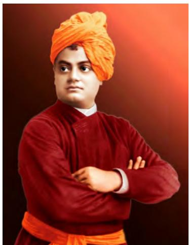
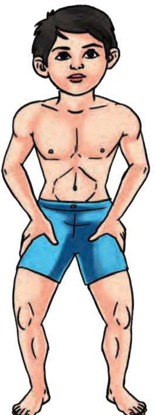
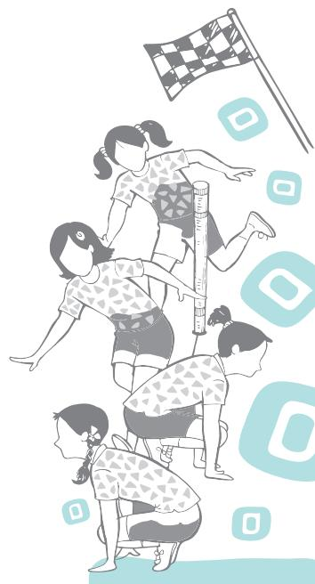
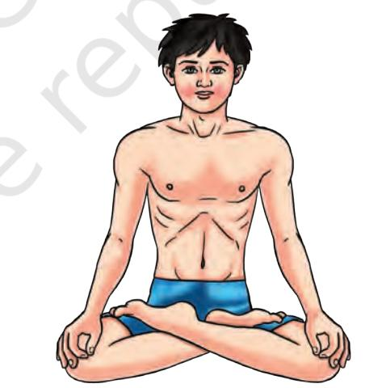

*Fig. 6.1: Yoga mudra*

Yoga is a science of living. It needs to be incorporated in daily life. It works on physical, mental, emotional, social and spiritual levels of human beings. Yoga helps in improving the quality of life. For example, yoga teaches us how to think, behave and grow to become a fully mature person. Yoga brings harmony between body and mind. It is an art and science for healthy living.

The word 'yoga' is derived from the Sanskrit word 'yuj' meaning to join, to yoke, and to unite. It is an ancient system of self-development and natural process of evolution of human beings.

Now a days, the word yoga has a strong impact on human life. The ultimate purpose of yoga is the attainment of human growth. Yoga has been established as a new field in education system. It helps in achieving higher state of consciousness on the evolution of an individual's development. It is the discipline of body and mind.

Children face too much stress in their surroundings, such as, school, home, playground, etc. Due to this stress they have many problems such as physical, mental and emotional. When these health hazards create problems for long, they lead to psychosomatic diseases and social unrest. All these problems originate due to imbalance between our physical, mental and spiritual levels. They are closely related to materialistic way of life. Attachment and endless ambitions are the two primary causes of our sufferings.

According to the Upanishads, yoga is a higher state of consciousness and a process to ease the mind and manifest the wisdom. Yoga establishes the activities of a healthy state of body, mind and harmonious interpersonal relationships. Due to unhealthy lifestyle, the overall growth of child gets ceased and it leads to ill health. Yoga works on various

Chap-6.indd 210 31-07-2020 15:28:38

aspects of human body and mind and helps to improve selfawareness, self-control, relaxation, concentration, flexibility and coordination.

# **History and Development of Yoga**

Yoga has a very long history and in terms of legacy it is as old as human civilisation. Its history is also linked with the *vedas*  and *upanishads*.

Yoga had a special place during the Indus Valley Civilisation (2000 B.C). The stone seals restored from the sites of the Indus Valley Civilisation depict the practice of Yoga during old days.

The word yoga is frequently referred in all the four *Vedas Rigveda, Yujurveda, Samveda* and *Atharvaveda*.

*Moksha* is the ultimate goal of yoga, which is well explained in the *Upanishads*. The teaching of Buddha (*Arya Asthangic Marga*) and Jainism (five great vows) are the two pillars of yoga tradition. These two had greatly contributed to the development of yoga.

**The epics:** *Ramayana* and *Mahabharata* have numerous references about yoga. The *Bhagavad Gita* is considered as a classical treatise on yoga.

There is also description of Yoga in *Shad Darshans.*

*Maharishi* Sage Patanjali had codified the comprehensive system of Yoga around second century B.C. Patanjali gave the concept of eight limbs of yoga called as *Ashtang Yoga*.

Nath culture also played an important role in the development of the *Hatha* Yoga Tradition. *Hatha* Yoga deals with day-to-day health related problems and emphasised on the human body and mind. The famous scriptures of *Hatha*  Yoga are *Hatha Yoga Pradeepika*, *Gheranda Samhita*, *Hatha Ratnavali*, *Shiva Samhita*, *Siddha Siddhanta Paddhati,* etc. Nineteenth century gurus, such as, Ramakrishna Parmahansa, Swami Vivekananda, Maharishi Aurobindo and Ramana Maharishi preached yoga to the masses.

# **Schools of Yoga**

The basic goal of yoga is thus to attain bliss and also to provide true knowledge about human beings. In order to attain the above goals, various thoughts, ideas and opinions were given by seers which are known as the schools of yoga. These are—

## *Karma* **Yoga (Path of Action)**

*Karma* Yoga is one of the main streams of yoga. *Karma*  literally means action. The aim of *Karma* Yoga is attaining union with the higher-self by harmonising the actions.

*Fig. 6.2: Vedas*

Chap-6.indd 211 31-07-2020 15:28:39

*Fig. 6.3: Swami Vivekanand*

Karma Yoga inspires the person to perform the work to the best of their abilities without any attachment or expectation of the results. The concept of *Karma* Yoga and its practice are mentioned in the *Bhagavad Gita*. This stream of yoga emphasises the following.

- **•** *Karma* **as duty:** Karma Yoga lays emphasis on doing karma or action as duty. When an act is performed dutifully with total involvement, it leads to joy and happiness.
- **•** *Karma Sukaushalam***:** *Karma* Yoga states that yoga means a skilled action. Actions should be done efficiently. Actions performed with full concentration and detachment brings efficiency.
- **•** *Nishkama Karma***:** *Nishkama Karma* means action which is free from personal motives and is performed as a duty. This attribute emphasises that actions should be performed without any expectations of the results.

## *Jnana* **Yoga (Path of Knowledge)**

- **•** *Jnana* Yoga is related to the knowledge of 'self', the world and realisation of ultimate reality or truth. *Jnana* Yoga, thus is a path of philosophy that uses intellect and helps to gain knowledge and keeps the person away from *avidya*.
- **•** *Avidya* (ignorance) is the main cause of pain, misery and sufferings in life. A person because of *avidya*  (ignorance) identifies himself with various names, and forms such as body, mind, race and nationality, etc., and remains in pursuit of worldly possessions. This knowledge develops discriminating knowledge (*Viveka*) that will help to remove the veil of *avidya*, enables the one to discriminate between reality and unreality (appearance) and guides towards the path of real happiness and bliss.
- **•** The main aim of the *Jnana* Yoga, thus is to overcome the *avidya* (ignorance) so that one can understand and distinguish between the real and unreal. The three important stages of *Jnana* Yoga are *shravan*  (adequate hearing), *Manana* (constant remembrance) and *Nidhidhyasana* (contemplation or meditation).

## *Raja* **Yoga (Path of Psychic Control)**

- **•** The science of *Raja* Yoga proposes a practical and scientific method of reaching the truth. *Raja* Yoga, the path of psychic control is a systematic process of culturing the mind.
Chap-6.indd 212 13-08-2020 15:42:11

- **•** It is aimed to develop dormant potential of the personality.
- **•** *Raja* Yoga discusses the way of controlling and modification of mind (*chittavrittis*).
- **•** *Abhyasa* (continuous practice) and *viaragya*  (detachment) are also emphasised in *Raja* Yoga for the control of *chittavrittis* and spiritual practices.
- **•** *Raja* Yoga is based on *Ashtanga* Yoga (eight limbed Yoga) as propounded by Maharishi Patanjali.
- **•** All the eight limbs of yoga work on various levels of human personality.

## *Bhakti* **yoga (Path of Devotion)**

- **•** *Bhakti* Yoga (path of devotion) is a systematic method of engaging the mind in the practice of divine love. *Bhakti* means selfless and unconditional love to god. This mode of worship consists of unending and loving remembrance of God. The person merges himself/ herself with the God.
- **•** The attitude of love and devotion has the softening effect on emotions and calms down the mind. There are nine forms of *Bhakti* Yoga mentioned in ancient text. These are *Shravan, Kirtan, Smaran, Padsevan, Archana, Vandana, Dasya, Sakhya, Atmanivedan*.

# **Guidelines for Yoga Practice**

The guiding principles given below should be followed by the *Sadhakas* performing the yogic practices.

## **Before the yogic practice**

- **•** *Shauch* means cleanliness, an important pre-requisite for Yogic practice.
- **•** It includes the cleanliness of surroundings, body and mind.
- **•** Yogic practices should be performed in a calm and quite atmosphere with a relaxed body and mind.
- **•** Yogic practices should be performed on an empty stomach.
- **•** Bladder and bowels should be emptied and evacuated before starting yogic practice.
- **•** Yogic practice should not be performed on uneven surface.
- **•** A mattress, *durry* or folded blanket should be used.
- **•** Light and comfortable cotton clothes are preferred to facilitate easy movements of the body.
- **•** These practices should not be performed in a state of exhaustion, illness or in a hurry.

Chap-6.indd 213 13-08-2020 15:41:14

## **During the practice**

- **•** Practice session should start with prayer as it creates conducive environment and thereby relaxes the mind.
- **•** Perform the practice slowly with body, breathe awareness along with relaxation.
- **•** Breathing should always be done through nostrils unless instructed otherwise.
- **•** Observe your body movements, do not strain too much. Practice as per your own capacity.
- **•** Regular practice is very essential for good results.
- **•** There are contra-indications/limitations for each *Asana, Pranayama, Kriya* and *Bandha*. Such contraindications should always be kept in mind. In case of chronic diseases or cardiac problems, doctor and yoga therapist should be consulted prior to the performance of yogic exercises.
- **•** During pregnancy and menstruation, yoga expert should be consulted prior to yogic practice.

## **After the practice**

- **•** Bath may be taken only after 15 to 30 minutes of the yoga practice.
- **•** Light food may be taken only after 15 to 30 minutes of the yoga practice.
- **•** After each practice session, *shavasana* should be practised as per need.
- **•** Yoga session should end with meditation followed by deep silence and then *Shanti Path*.

# **Yogic Principles and Practices For Wellness**

- **•** Wellness is a state of being healthy. Yoga promotes wellness by bringing harmony between various dimensions of wellnesss namely physical, emotional (neutral), intellectual, social, environmental and spiritual health.
- **•** Yoga is an art and science of healthy living. It is a spiritual discipline based on an extremely subtle science, which focuses on bringing harmony between body and mind.
- **•** For wellness, we have to maintain balance among various aspects of life like physical, mental, social and spiritual.
- **•** Adolescence is the time when an individual undergoes tremendous physical, emotional and psychological changes. This brings stress.

Chap-6.indd 214 31-07-2020 15:28:39

- **•** Yoga is the proven remedy for all the causes of stress and strain among the adolescence.
- **•** Regular practice of yoga amongst the students leads to improved concentration, reduced blood pressure, better grades in the academics, improved interpersonal relationships, more confidence, better sleep, calmness, sharper brains, relief from headache if any and decreased absenteeism and aridness.
- **•** The following are few of the mechanisms through which yoga works for wellness.
	- **▪** *Shodhana Kriyas* cleanse the accumulated toxins through various *shuddikriyas* and *sukshmavyayama*  (simple movements for all body parts).
	- **▪** Adoption of a yogic lifestyle with proper nourishing diet creates positive antioxidant enhancement thus, neutralising the free radicals.
	- **▪** *Yogasana* steadies the entire body through different physical postures. Physical balance and a sense of ease with oneself enhance mental/emotional balance and enable all the physiological processes to occur in a healthy manner.
	- **▪** *Pranayama* helps to improve control over autonomic respiratory mechanisms, through breathing patterns that generate energy and enhance emotional stability.
	- **▪** *Dharana* helps to focus the mind positively on the activities being done, enhances energy flow and results in healthy blood circulation to the different body parts and internal organs.
	- **▪** *Dhyana* creates a calm internal environment through contemplative practices. Mental balance produces physical balance and vice versa too.

# **Yoga for Wellness**

## **Shodhanakriya**

It is practiced for internal purification. These are followed in *Hatha* Yoga. It helps to clean the accumulated toxins and generates a sense of relaxed lightness.

## *Neti*

*Neti* is a *Hathayogic Kriya*, which is concerned with the cleaning of nasal passage. This practice involves cleaning up the throat as well. Neti is a pre-requisite for cleaning up the respiratory passages for the proper practice of *Pranayama*. There are two types of *Neti*.

Chap-6.indd 215 31-07-2020 15:28:39

*Fig. 6.4: Jala neti*

#### **Do You Know?**

An expert can perform Sutra Neti together with both nostrils.

# *Jala neti* **(nasal cleansing with water)**

In *Jala Neti*, water is used for cleansing the nasal passage. Steps for practising Nasal *Neti* are—

- **•** Sit in *Kagasana*. Keep 1.5 to 2 inches distance between the feet.
- **•** Lean forward from the lower back.
- **•** Tilt the head to the opposite side of the nostril whichever is more active in breathing at the moment.
- **•** Insert the nozzle of the pot into the nostril whichever is active in breathing at that moment.
- **•** Slightly open the mouth and breathe through it.
- **•** Keep the body relaxed.
- **•** Let the water flow in through one nostril and out through the other nostril.
- **•** During the process, eyes should focus on the water stream flowing out of the nostril.
- **•** After finishing half of the water, the put down the pot and clear the nose. Repeat with the other nostril.
- **•** Clear the nose.
- **•** Clean the nose through the practice of *Mukha Dhauti*  (forceful exhalation from nose and passive inhalation from mouth).

## *Dos and Don'ts*

- **•** During the practice of *Jala Neti,* breathing should be done from mouth.
- **•** Ideal time to perform is before sunrise, lukewarm salted water is to be used for this *kriya*.
- **•** Head should not be tilted much during the practice of *Jala Neti*.
- **•** Do not blow the nose too hard after the practice as the remaining water may be pushed to the ears.

## *Benefits*

- **•** This exercise is excellent for the cases of chronic headache, insomnia, drowsiness and improves eyesight.
- **•** The diseases peculiar to the nose, and also coughs are effectively cured.
- **•** Effective for stress and anxiety.

## **Sutra neti (nasal cleansing with thread)**

According to yogic text, insert a soft thread through the nose to the length of one hand span so that it comes out of the mouth. This is called *Sutra Neti*.

2024-25

Chap-6.indd 216 31-07-2020 15:28:40

## *Stages for Practice*

- **•** Sit in *Kagasana*.
- **•** Tilt the head slightly back and insert the *sutra* (thread or rubber catheter) into one of the nostrils, whichever is more active in breathing at the moment. Gently push it through the nostril using both hands.
- **•** When the thread (*sutra*) has come through to the back of the throat, put the index and middle fingers into the mouth; catch hold of the sūtra; and draw it out carefully through the mouth. Leave a few inches of the thread hanging out of the nose.
- **•** Now, slowly and gently pull the thread forward and backward 4–5 times.
- **•** Slowly take the thread out through mouth and repeat the practice through the other nostril.

## *Dos and Don'ts*

- **•** Insert the thread slowly and breathe continuously. The thread should be clean.
- **•** This practice should be performed under guidance.
- **•** Do not try *Sutra Neti* unless *Jala Neti* is perfected.
- **•** Do not apply force while inserting the thread.
- **•** Do not rub the *Sutra* too fast during practice.

## *Benefits*

- **•** *Sutra Neti* stimulates the nerves and improves the function of eyes, tear ducts and olfactory zone in the brain (nasal zone).
- **•** It massages the membranes and sinus glands and strengthens them.
- **•** It increases resistance to invasion by viruses.
- **•** It is very effective in ENT problems.

# *Kapalbhati*

*Kapala* means skull (head) and *Bhati* means to shine. Because this practice makes the skull (head) shine, therefore it is called *Kapalbhati*.

In other words, it rejuvenates the skull (head) and the mental functions.

## *Stages for Practice*

- **•** Sit in a meditative posture, eyes closed and the whole body relaxed.
- **•** Inhale deeply through both nostrils expanding the abdomen and exhale with a forceful contraction of the abdominal muscles.

## **Do You Know?**

An expert can perform 300 strokes of *Kapalbhati*.

Chap-6.indd 217 31-07-2020 15:28:41

#### **Do You Know?**

An expert practitioner can perform more than 20 movements in one time.

*Fig. 6.7: Agnisara*

- **•** The breathing must be of the 'bellows' type and perform 30–40 strokes in one round. Start from 10 strokes.
- **•** At the end of practice, deep exhale and relax.

#### *Dos and Don'ts*

- **•** Stroke should be in rhythmic manner.
- **•** Active exhalation and passive inhalation.
- **•** Don't strain the facial muscles during the practice.
- **•** Avoid performing the practice in the case of high blood pressure, heart diseases and gastric ulcers.

#### *Benefits*

- **•** It purifies the frontal air sinuses and stimulates the brain.
- **•** Massages abdominal organs; and improves digestion.
- **•** It increases the capacity of lungs.
- **•** It is useful in treating cold, rhinitis (inflammation of the mucus membrane of the nose), sinusitis and bronchial infections.

#### *Agnisara*

*Agnisāra* is also known as *Vahnisara*. *Vahni* and *Agni* are synonymous words meaning fire and '*Sāra*' means essence. According to Hatha yogic tradition, the essence of fire is located in the navel region. During this *kriya*, there is a movement in navel region. It can be performed in sitting or standing position.

#### *Stages for Practice*

- **•** Stand erect with the feet apart at shoulder level.
- **•** Bend the knee and body at an angle of 60o . Place the hands on thighs above the knees.
- **•** Exhale completely then contract and expand the abdominal muscles rapidly for as long as comfortable while retaining the breath outside.
- **•** Then slowly breathe in. Repeat the practice 2–3 times.

#### *Dos and Don'ts*

- **•** Stomach should be empty while performing *Agnisara*.
- **•** The movement should be in rhythmic manner.
- **•** Don't hold the breath beyond capacity.
- **•** Avoid performing this practice in case of high blood pressure.

#### *Benefits*

- **•** It gives gentle massages to abdominal organs, and improves digestion.
- **•** It reduces fat and strengthens the abdominal muscles.

Chap-6.indd 218 31-07-2020 15:28:42

- **•** It stimulates the relevant nerves and harmonises all the abdominal conditions of the bowel, liver, kidney, spleen, pancreas and digestion, allowing optimum assimilation of nutrients.
# *Surya Namaskara* **or Sun Salutation**

*Surya* or the sun is the primal cause of everything. It gives energy to all the living beings on the earth. *Surya namaskara*  is the set of seven asanas in twelve steps. Every morning performing it with breathing techniques, energises the whole body and mind.

# **Technique**

Starting position—stand erect with feet together and arms by the side of the thighs; balance the body equally on both the feet (*samasthiti*).

**Do You Know?** *Surya namaskara* can be performed with *mantra*.

#### **Activity 6.1**

- **•** Prepare a model of *Surya Namaskara*.
- **•** Conduct competition between class.

*Fig. 6.8: 1. Namaskarasana 2. Hastottanasana 3. Padhastasana 4. Ashwasanchalanasana*

- **1.** *Namaskarasana***:** Inhale, bring the arms up and with exhalation join the palm together in *Namaskara mudra* in front of the chest.
- **2.** *Hastottanasana***:** Inhale, raise both the arms up; stretch the body as much as possible and bend backwards without bending the knees.
- **3.** *Padhastasana***:** Exhale, bend forward from the lower back keeping the spine straight. Place the hands on the ground by side of the feet. Try to touch the forehead to the leg without bending the knees.
- **4.** *Ashwasanchalanasana***:** Inhale, place the right leg back as far as possible and touch the knee of right foot on the ground. Bend the left leg from the knee and keep the knee and foot at right angle; arching the spine back and look up between the eyebrows centre.

Chap-6.indd 219 31-07-2020 15:28:42

- **5.** *Parvatasana***:** Stretch the left foot backward by the side of right foot, lower your head and move the buttocks upwards. Keep the arms and legs straight and heels on the floor.
- **6.** *Ashtanga Namaskarasana***:** Lower the knees, chest and chain to the floor. Keep the hips slightly up. The toes, knees, chest, hands and chin should be touching the floor.

*Fig. 6.9: 5. Parvatasana, 6. Ashtanga namaskarasana*

- **7.** *Bhujangasana***:** Lower the hips, inhale, then raise the head and push the chest up. Raise the upper body upto the navel. Keep the palms on the ground.
- **8.** *Parvatasana***:** Exhale, lift the hips up and lower the head and chest downwards in an inverted 'V' posture. Keep the head between the arms and feet on the ground.

*Fig. 6.10: 7. Bhujangasana, 8. Parvatasana*

- **9.** *Ashwasanchalanasana***:** Inhale, bend the right leg and bring it forward. Keep the right foot on the ground between the arms and left leg backward with the knee touching the ground. Arch the spine back, look up between the eyebrows centre.
Chap-6.indd 220 31-07-2020 15:28:43

- **10.** *Padhastasana***:** Exhale, bring the left leg forward and place the left foot beside the right foot. Place the hands on the ground by side of the feet. Try to touch the forehead to the knees without bending the knees.
- **11.** *Hastottanasana***:** Inhale, raise both the arms up; stretch the body as much as possible and bend backwards without bending the knees.
- **12.** *Namaskarasana***:** Exhale, come back to the original position. Slowly bring the arms down and join the palms together in front of the chest in *namaskara mudra*.

*Fig. 6.11: 9. Ashwasanchalanasana, 10. Padhastasana, 11. Hastottanasana, 12. Namaskarasana*

This is one round of *Surya namaskara*. Repeat the same process of twelve steps by using the other leg in fourth position (*Ashwasanchalanasana*).

#### *Dos and Don'ts*

- **•** Perform while maintaining good physical balance.
- **•** Perform every step with breathing pattern.
- **•** Avoid this in case of high blood pressure, fever, slipped disc and hernia.
- **•** Do not practise beyond one's capacity.

#### *Benefits*

- **•** Stimulates and balances all the systems of the body.
- **•** Increases concentration and calmness.
- **•** Helps in curing constipation.
- **•** Improves blood circulation all over the body, and reduces fat.
- **•** Helps in removing carbon dioxide from the lungs replacing with fresh oxygen and improves brain function by bringing oxygenated air by blood to the brain.

Chap-6.indd 221 31-07-2020 15:28:44

#### **Activity 6.2**

Teacher can conduct a competition between students in classroom and measure the holding time of *yogasana*.

# **Yogasana**

We all know that *asanas* are beneficial for our physical and mental development. Some of the asanas are explained here:

## *Tadasana*

Tadasana is named after the *Tada* (Palm tree) as in the final posture, the body remains erect in standing position like a palm tree.

#### *Stages for Practice*

- **•** Stand with your feet 2 inches apart.
- **•** Inhale and raise your arms up to shoulder level, interlock your fingers and turn the wrist outwards.
- **•** Raise the heels off the floor.
- **•** Try to balance on the toes.
- **•** While exhaling, slowly bring arms down along with the heels.
- **•** Remove the interlock.
- **•** Relax for a while in the standing position.

#### *Dos and Don'ts*

- **•** Breath becomes slow and deep.
- **•** Raise the legs slowly without any jerk.
- **•** Avoid this practice in case of knee pain and ankle injuries.

#### *Benefits*

- **•** This *āsana* stretches the muscles and nerves, thereby improves functioning of various systems of the body.
- **•** The muscles become strong. It gives strength to the toes.
- **•** It is helpful in increasing the height of young growing children. It is helpful for the patients of sciatica.

## *Vrikshasana*

*Vriksha* means tree. The final position of this *asana* is a stand- still position which resembles the shape of a tree, hence the name.

#### *Stages for Practice*

- **•** Stand with feet 2 inches apart. Focus on a point in front.
- **•** Exhale, bend the right leg and place the foot inside the left thigh. The heel should be touched to the perineum.
- **•** Inhale and extend the arms up and join the palms in *namaskara mudra*.
- **•** Stay in the position for 10 to 30 seconds and breathe normally.

*Fig. 6.13: Vrikshasana*

Chap-6.indd 222 31-07-2020 15:28:45

- **•** Exhale and bring the arms and the right foot down. Relax and repeat the asana by bending the left leg.
## *Dos and Don'ts*

- **•** Normal breathing should be continued in the final posture.
- **•** Avoid this practice in case of knee pain and ankle injuries.

## *Benefits*

- **•** It increases the flexibility of joints of knees and ankles and strengthens them.
- **•** It tones up the leg muscles and rejuvenates the ligaments also.
- **•** It helps to cure rheumatic pain and the problem of numbness.
- **•** it improves concentration.

## *Padahastasana*

*Pāda* means feet, and *hasta* means hands. Therefore, Pādahastāsana means taking the palms down towards the feet.

## *Stages for Practice*

- **•** Stand straight with feet 2 inches apart.
- **•** Inhale slowly and raise the arms up.
- **•** Stretch up the body from the waist.
- **•** Exhale and bend forward until the trunk is parallel to the ground.
- **•** Exhale, and bend forward until the entire palm rests on the ground near to feet.
- **•** Maintain this final posture for 10–30 seconds.
- **•** Now inhale, come up slowly to the vertical position and stretch the arms above the head.
- **•** Exhale and slowly return to the starting position in reverse order.
- **•** Relax in the standing posture.

#### *Dos and Don'ts*

- **•** Bend from the lower back while performing *Padahastasana*.
- **•** Bending should be according to their capacity.
- **•** In the final stage, avoid hunch in the back.
- **•** Avoid performing this asana in case of severe back pain.

#### *Benefits*

- **•** It makes the spine flexible, improves digestion, and prevents constipation and menstrual problems.

*Fig. 6.14: Padahastasana*

Chap-6.indd 223 31-07-2020 15:28:45

## **Do You Know?**

Bending should always be followed by counter-bending. Example: Performing back bending after a forward bending and vice-versa.

*Fig. 6.15: Ardhachakrasana*

#### **Activity 6.3**

Students prepare a record book and write their physical and mental experiences of asanas.

- **•** It helps to improve blood circulation in the head and heart region.
- **•** It helps to stimulate the glands, i.e., thyroid, endocrine and pituitary gland.

## *Ardha Chakrasana*

In Sanskrit language, *Ardha* means half and *Chakra* means wheel. In this posture, the shape of the body takes the shape of half wheel, therefore it is called *Ardha-chakrasana*.

#### *Stages for Practice*

- **•** Stand erect on the ground with feet together.
- **•** Keep your hands by the side. Keep your elbows parallel to each other.
- **•** Now slowly inhale and bend backwards as much as possible.
- **•** Try to maintain the posture with normal breathing and without losing the balance.
- **•** Inhale and slowly come up to the original position. Relax in standing position.

#### *Dos and Don'ts*

- **•** While bending backward, eyes should be kept open.
- **•** Maintain the final position with the normal breath.
- **•** Avoid this practice in case of vertigo and high BP.
- **•** Do not bend knees in the final position.

#### *Benefits*

- **•** This asana gives relaxation to the neck and back muscles, especially of lower back.
- **•** It improves flexibility of the spine.
- **•** It helps to remove fat from the waist.
- **•** It also removes stiffness from the hip joints.
- **•** It improves the breathing and lung capacity.

#### *Trikonasana*

*Trikona* means triangle. *Tri* means three and *kona* is an angle. As the *asana* resembles three arms triangle made by the trunk and the limbs, it has been named as *Trikonasana*.

*Fig. 6.16: Trikonasana*

Chap-6.indd 224 31-07-2020 15:28:46

#### *Stages for Practice*

- **•** Stand on your legs 3–4 feet apart.
- **•** Slowly raise both the arms sideways up to shoulder level.
- **•** Turn your right foot towards the right side. Exhale, slowly bend to the right side and place the right hand just behind the right foot.
- **•** The left arm is straight up, in line with the right arm. Turn your head and gaze at the tip of the left hand middle finger.
- **•** Remain in the posture for 10–30 seconds with normal breathing.
- **•** As you inhale, slowly come up. Repeat it from the left side.

#### *Dos and Don'ts*

- **•** Bend from the waist.
- **•** Keep the knees straight in the final position.
- **•** Avoid bending forward while bending sideways.
- **•** Avoid this practice in case of severe back pain.

#### *Benefits*

- **•** Strengthens calf, thigh and waist muscles.
- **•** Makes the spine flexible, and improves lung capacity.
- **•** Prevents flat foot, and reduce fat.
- **•** Kyphosis and Scoliosis patients can also do this practice.

#### *Parshvakonasana*

*Parsva* means side or flank and *Kona* means angle. In the final pose of this *asana*, the body forms a lateral angle, hence it is called *Parsvakonasana*.

#### *Stages for Practice*

- **•** Stand erect.
- **•** Inhale and spread feet approximately 3–4 feet apart. Raise the arms sideways at the shoulder level.
- **•** Turn right foot to the right side and bend the knee, form a right angle with the thigh and calf.
- **•** Exhale and bend from the waist to the right side and bring the right arm down, place the right palm on the floor by the inner

#### **Activity 6.4**

Practice asanas daily for 15 days. Write your holding time in final position and analyse the improvement.

Chap-6.indd 225 31-07-2020 15:28:46

- **•** In the final posture, spine must be kept straight and the left foot flat on the floor. Hold the posture for 30 seconds, and breathe normally.
- **•** Inhale and come back to the starting position.
- **•** Repeat it from the other side.

#### *Dos and Don'ts*

- **•** In the final position, the knee of the bend leg should be in line with the heel.
- **•** Avoid forward bend in the final posture.
- **•** Avoid in case of severe back pain.

#### *Benefits*

- **•** It strengthens the heart muscles.
- **•** It improves digestion.
- **•** It helps to reduce fat from waist and hips.
- **•** It increases harmony between the body and mind.

## *Padmasana*

In Sanskrit language, *Padma* means lotus. This *asana* is a traditional posture. In this *asana*, the feet look like the shape of lotus petals. That is why, it is called as *Padmasana*.

*Fig. 6.18: Padmasana*

#### *Stages for Practice*

- **•** Sit on the ground.
- **•** Fold the right leg and place the right foot above the left thigh.
- **•** Fold the left leg and place it above the right thigh.
- **•** Place hands on the knees in *Jnanamudra*.
- **•** Keep the spine straight. Breathe normally.

Chap-6.indd 226 31-07-2020 15:28:47

#### *Dos and Don'ts*

- **•** Place the foot on the opposite thigh.
- **•** Both the knees should ideally touch the ground in the final pose.
- **•** Avoid leaning forward.
- **•** Avoid this practice in case of knee pain and ankle injuries.

#### *Benefits*

- **•** Padmāsana induces mental calmness and tranquillity.
- **•** It tones up the nerves of coccyx and sacral region by supplying them with more blood.
- **•** It improves the digestive process and helps to relieve constipation.
- **•** It improves the concentration and memory.
- **•** It is helpful for people suffering from shortness of breath.

## *Vajrasana*

*Vajra* means adamantine. It is believed that the body becomes like adamantine by practising it. This can be considered as a meditative posture. While practising it for meditative purposes, students should close their eyes at the final stage. This is the only posture that can be practised just after having meal.

#### *Stages for Practice*

- **•** Sit with legs extended together, hands by the side of the body, palm resting on the ground, and fingers pointing forward. This is *dandasana*.
- **•** Fold the right leg at the knee and place the foot under the right buttock.
- **•** Similarly folding the left leg, place left foot under the left buttock.
- **•** Place both the heels apart and the big toe touch and overlap each other.
- **•** Position the buttocks in the space between the heels.
- **•** Keep the hands on respective knees. Keep the spine erect.
- **•** While returning to the original position, bend a little towards right side, take out your left leg and extend it.
- **•** Similarly extend your right leg and return to the original position.

#### *Dos and Don'ts*

- **•** Keep the knees and thighs together while sitting in *Vajrasana*.
#### **Activity 6.5**

Students should practise *Vajrasana* after dinner, daily for 15 days and write their experiences in the record book. The teacher will check it.

*Fig. 6.19: Vajrasana*

Chap-6.indd 227 31-07-2020 15:28:48

- **•** Heels should be outside.
- **•** Avoid excessive arching of the spine.
- **•** Avoid this practice in case of ankle injury and knee pain.

## *Benefits*

- **•** This āsana strengthens thigh muscles and calf muscles.
- **•** This āsana is good for digestion.
- **•** It provides firm base to the spine and keeps the spine erect.
- **•** It helps to improve concentration.

## *Bhadrasana*

In Sanskrit language, *Bhadra* means noble. Which is the grace in the form of awakening that takes place.

*Fig. 6.20: Bhadrasana*

#### *Stages for Practice*

- **•** Sit on the ground stretching both the legs together in front.
- **•** Place your hands by the side, with palms resting on the ground.
- **•** Fingers should remain together pointing forward. This is *dandasana*.
- **•** Fold the legs slowly at knees; and join both the soles with each other.
- **•** Hold the ankles.
- **•** Slowly bring the heels towards perineum.
- **•** The knees should touch the ground. Head, neck and back should be straight.
- **•** Maintain the final position for 20–30 seconds.
- **•** Come back in *dandasana* and relax.

Chap-6.indd 228 31-07-2020 15:28:48

## *Dos and Don'ts*

- **•** Spine should be kept straight.
- **•** Knees should be touched to the ground.
- **•** Avoid excessive arching of the spine.
- **•** One should avoid pushing the foot inside beyond one's capacity.

#### *Benefits*

- **•** This asana is good for lumber region and keeps it healthy.
- **•** It is beneficial in women's physical problems and facilitates easy child birth.
- **•** It helps in improving concentration.
- **•** It calms down the mind.

## *Ushtrasana*

*Ushtra* means camel. The body in this posture resembles the posture of a camel, hence the name.

*Fig. 6.21: Ushtrasana*

#### *Stages for Practice*

- **•** Sit in *Vajrasana*.
- **•** Kneel down on the floor. Keep your thighs and feet 2–3 inches apart, toes pointing back and resting on the floor.
- **•** While inhaling bend backward. Be careful not to jerk the body while bending backwards.
- **•** With exhalation place the right palm on the right heel and left palm on the left heel.

Chap-6.indd 229 31-07-2020 15:28:49

- **•** In final position, thighs will be vertical to the floor and the head tilted backwards.
- **•** Weight of the body should be evenly supported by the arms and legs.
- **•** Inhale, slowly come back to normal position and relax in *Vajrasana*.

#### *Dos and Don'ts*

- **•** Keep the thighs vertical to the ground.
- **•** Avoid jerking the body while bending backward.
- **•** Avoid in case of hernia, vertigo, and frozen shoulder.
- **•** Proceeding to the final stage of asana should be gradual.

## *Benefits*

- **•** This is useful in back pain and neck pain.
- **•** It helps to reduce fat over the abdomen and hips.
- **•** It helps to strengthen the back muscles and leg muscles.
- **•** It is beneficial in respiratory disorders.

## *Shashankasana*

*Shashanka* means rabbit. The body in this posture takes the shape of a rabbit, hence the name.

*Fig. 6.22: Shashankasana*

#### *Stages for Practice*

- **•** Sit in *Vajrasana*. Keep the spine erect.
- **•** Spread both the knees wide apart with the toes remaining together.
- **•** Place the palms between the knees.
- **•** Exhaling, bend forward from the waist with the arms straight.

Chap-6.indd 230 31-07-2020 15:28:49

- **•** Chin and chest should be resting on the floor.
- **•** Look in front and maintain the position.
- **•** Inhale and come back in *Vajrasana*.

## *Dos and Don'ts*

- **•** Keep the back straight in the final pose.
- **•** Don't raise hips while practising this asana.

## *Benefits*

- **•** It tones up the reproductive organs.
- **•** It strengthens the abdominal and pelvic region.
- **•** This āsana relieves sciatica nerve.
- **•** It helps to reduce stress, anger, etc.

## *Uttanamandukasana*

*Uttana* means upright and *Manduka* means frog. The final position of *Uttanamandukasana* resembles an upright frog, hence the name. In the final posture, the head is held by the elbows.

*Fig. 6.23: Uttanamandukasana*

#### *Stages for Practice*

- **•** Sit in *Vajrasana*.
- **•** Spread both the knees wide apart with the toes remaining together.
- **•** Raise your right arm, fold it and take it backward from above the right shoulder and place the palm below the left shoulder.
- **•** Now fold the left arm similarly and place the palm below the right shoulder.

## **Activity 6.6**

Teacher should check the interest of students in this *asana*. The teacher can check the perfection of students and motivate them.

Chap-6.indd 231 31-07-2020 15:28:49

- **•** Maintain the position.
- **•** While coming back, slowly remove the left arm and then right arm, bring the knees together as in the initial position.
- **•** Relax in *Vajrasana*.

#### *Dos and Don'ts*

- **•** Spread the knees well.
- **•** Keep the back and neck straight in the final position.
- **•** Avoid the gap between thighs and ground.

#### *Benefits*

- **•** This asana is helpful in back ache and neck pain.
- **•** It helps in improving the diaphragmatic movements.
- **•** It improves the lung capacity.

#### *Paschimottanasana*

*Paśchima* means back and Uttān means stretch out. In this āsana, the back side of the body including the spinal column gets stretched, hence the name.

*Fig. 6.24: Paschimottanasana*

#### *Stages for Practice*

- **•** Sit in *Dandasana*. Inhale and raise your arms up. Stretch your back and bend forward as much as possible.
- **•** Hold the toes and place the elbows by the side, on the ground.
- **•** Maintain the posture as per the capacity. Come back by raising hands and head in the initial position.

#### *Dos and Don'ts*

- **•** Keep the knees straight. Normal breathing should continue.
- **•** Avoid hunch in the back.
- **•** Avoid the practice in case of severe back pain.

Chap-6.indd 232 31-07-2020 15:28:50

## *Benefits*

- **•** It stimulates the function of abdominal organs, and improves digestion.
- **•** It is helpful in removing constipation, obesity, dyspepsia and seminal weakness.
- **•** It helps to improve blood circulation and regulates blood pressure and reduce fat.
- **•** It improves the flexibility of spine.

## *Suptavajrasana*

*Suptavajrasana* is further development of *Vajrasana*. *Suptavajrasana* means lying in *Vajrasana*; hence, it is named *Suptavajrasana*.

## *Stages for Practice*

- **•** Sit in *Vajrasana*. Slowly bend backwards taking the support of the hand; and place elbows on the ground.
- **•** Slowly straighten the hands and completely lie on the back with shoulders resting on the ground and knees remaining together.
- **•** Beginners may keep their hands on respective thighs.
- **•** After practising this position well, stretch the arms behind and hold the elbow/arm with the hand of another arm.
- **•** While returning to the original position, first take out your hands and place them by the sides of your body.
- **•** Now, with the help of elbows come back to the initial position.

*Fig. 6.25: Suptavajrasana*

#### *Dos and Don'ts*

- **•** With the support of hand, come in supine position.
- **•** Keep the knees together in final position.
- **•** Do not strain in knees and thigh muscles.
- **•** Avoid the practice in case of knee pain.

## **Do You Know?**

This asana is also performed with another state, where hands are kept upright with elbows resting on ground and face rests in between both palms while looking forward.

Chap-6.indd 233 31-07-2020 15:28:51

#### *Benefits*

- **•** This asana strengthens the abdominal muscles.
- **•** It is useful in the management of high blood pressure and sciatica.
- **•** It is a good remedy for constipation and backache.
- **•** It improves blood circulation and calmness.

#### *Vakrasana*

*Vakra* means twisted. In this āsana, the spine is twisted; due to this reason, this asana is called *Vakrasana*.

#### *Stages for Practice*

- **•** Sit in *dandasana*.
- **•** Bend the right leg, and place the right foot beside the left knee.
- **•** As you exhale, twist the body to the right.
- **•** Bring the left arm around the right knee and clasp the right big toe or place the palm beside the right foot.
- **•** Take the right arm back and keep the palm on the ground with the back straight.
- **•** Remain in the posture for 10–30 seconds with normal breathing and relax.
- **•** Take out your hands with exhalation and relax.
- **•** Repeat the same procedure on the other side.

*Fig. 6.26: Vakrasana*

#### *Dos and Don'ts*

- **•** Perform within physical limits. Do not strain the body unnecessarily.
- **•** Avoid the practice in case of knee pain, hernia and organ displacement.

Chap-6.indd 234 31-07-2020 15:28:51

## *Benefits*

- **•** This asana massage abdominal muscles.
- **•** It is useful in the management of high blood pressure and sciatica.
- **•** It is a good remedy for constipation, diabetics, back ache and improves blood circulation.
- **•** It helps in calmness of mind.
- **•** Enhances lung capacity.

## *Ardhamatsyendrasana*

*Ardhamatsyendrasana* is named after the great yogi Matsyendranātha. Full version of this asana is very difficult for a beginner to master it. Therefore, it has been modified. This modified version is called *Ardhamatsyendrasana*. Matsyendra is the name of a *Hatha* yogi it is said that he attained *siddhi* in this asana, so the full version of this asana is known as *Matsyendrasana*.

#### *Stages for Practice*

- **•** Sit on the ground in *dandasana*. Bend the left leg, then place the left heel on the side of the right hip.
- **•** Place right foot near the left knee, on the ground.
- **•** Place left arm over the right knee and grasp the toes of right foot with the left hand.
- **•** Take right arm behind the back around the waist.
- **•** Turn your head towards the right side and try to look behind.
- **•** Repeat it from the opposite side.

#### *Dos and Don'ts*

- **•** Keep the balance of body on the hips.
- **•** Place the bend knee behind the armpit of the opposite arm.
- **•** Avoid the practice in case of severe back pain, vertebral and disc disorders.
- **•** Avoid the jerking movement in the twisting of back.
- **•** Do not lean forward or backward.

#### *Benefits*

- **•** This āsana is good for the stimulation of pancreas, adrenal glands, kidneys, liver and spleen.
- **•** It helps to relieve constipation, asthma, indigestion, diabetics and obesity.
- **•** It strengthens muscles of the spine and back and makes them flexible.
- **•** It corrects stooping shoulders, a bent back and the defective posture.

*Fig. 6.27: Ardhamatsyendrasana*

#### **Activity 6.7**

Teacher conducts class competition and appreciates the better students.

Chap-6.indd 235 31-07-2020 15:28:52

*Fig. 6.28: Gomukhasana*

- **•** It stretches and strengthens the shoulders, hips and neck.
- **•** It is good for diabetic patients.

## *Gomukhasana*

In Sanskrit language, '*Gomukha*' means 'cow's face'. In this āsana, the leg's position takes the shape of *Gomukha*, hence the name *Gomukhāsana*.

## *Stages for Practice*

- **•** Sit in *Dandasana*.
- **•** Fold left leg from the knee and place it on the ground by the side of right buttock.
- **•** Similarly fold right leg from the knee, bring it over left leg and place right heel by the left buttock.
- **•** Raise the left arm, bend it at the elbow and take it below the shoulders towards the back.
- **•** Raise the right arm, bend it at elbow and take it upward and behind the back.
- **•** Interlock the fingers of both the hands behind the back.
- **•** Keep the head straight.
- **•** Gaze in front and maintain normal breathing.
- **•** Stay in this position for as long as comfortable and then return to the original position, step by step.
- **•** Repeat the same by changing the position of the legs and hands.

## *Dos and Don'ts*

- **•** Avoid sitting on the heels.
- **•** Avoid the practice in case of shoulder, neck and knee pain.
- **•** Keep the neck straight in the final position.
- **•** The above elbow should be closed to the ear.

## *Expected Learning Outcomes*

- **•** The practice of this asana strengthens muscles of the back and biceps.
- **•** It removes the pain in hip and lower extremities.
- **•** It helps in making the spine straight.
- **•** This āsana is very useful in arthritis and dry piles.
- **•** It is useful in frozen shoulders, neck pain and cervical spondylitis.
- **•** It gives good exercise to the lungs and helps in respiratory diseases.

Chap-6.indd 236 31-07-2020 15:28:52

## *Makrasana*

In Sanskrit *Makara* means crocodile. In this āsana, the body resembles a crocodile, hence the name.

*Fig. 6.29: Makrasana*

## **Activity 6.8**

Prepare a list of asanas useful for relaxing the body.

## *Stages for Practice*

- **•** Lie on the abdomen (prone lying position), with arms beside your body.
- **•** Spread the legs little apart (1–2 feet) and place them comfortably on the ground in such a position that the heels face each other and toes point outwards.
- **•** Fold the arms at elbows. Place palm on the palm with the head/face relaxing on the palms.
- **•** Slowly close eyes and relax. Do normal breathing and remain in this position as long as comfortable.

#### *Dos and Don'ts*

- **•** Place both feet apart and keep the heels towards each other.
- **•** Avoid this practice in case of heart problems.

#### *Benefits*

- **•** It is good for asthma, dyspepsia and *vata* diseases.
- **•** It is helpful in relaxing.
- **•** Removes mental and physical fatigue.
- **•** It reduces anxiety.

## *Bhujangasana*

'*Bhujanga*' means cobra. The final position of this āsana resembles the shape of a cobra. Hence it is named as *Bhujangasana*.

*Fig. 6.30: Bhujangasana*

Chap-6.indd 237 31-07-2020 15:28:53

#### *Stages for Practice*

- **•** Lie down in the prone position.
- **•** Join the feet and bend the arms at the elbow, place the palms near the chest on the floor.
- **•** Slowly raise the head, neck and shoulders. Raise the trunk up to the navel.
- **•** Maintain the posture for as long as comfortable. Then slowly bring the body down on the ground.
- **•** Relax in *makrasana*.

#### *Dos and Don'ts*

- **•** Keep the elbows parallel to each other and pointed upward.
- **•** Normal breathing should be continued.
- **•** Avoid this practice in case of hernia and abdominal injuries.
- **•** Do not raise body below the navel.
- **•** Do not straighten your elbows and move slowly.

## *Benefits*

- **•** This is good for stress management.
- **•** It is beneficial for relieving flatulence after meals.
- **•** It can relocate the slipped disc, removes backache and keeps the spine supple and healthy.
- **•** It tones the ovaries and uterus, and helps alleviate menstrual and other gynaecological disorders.
- **•** It improves the lung capacity.

#### *Shalabhasana*

The meaning of *salabha* is locust. In the final position of this āsana, body resembles the shape of a locust, hence the name.

*Fig. 6.31: Shalabhasana*

#### *Stages for Practice*

- **•** Lie down in prone position, place the palms below the thighs, press them downward and join the heels.
- **•** Chin should be placed on the ground.

#### **Activity 6.9**

Students practice *Shalabhasana*  daily and maintain in the record book. Teacher will check the improvement in holding time.

Chap-6.indd 238 31-07-2020 15:28:54

- **•** Lift the legs as high as possible while inhaling.
- **•** Bring down the legs while exhaling.
- **•** Release the hands.
- **•** Relax in *makrasana*.

## *Dos and Don'ts*

- **•** Raise the legs slowly without jerks.
- **•** Take the support of the hand to raise the legs.
- **•** Place the chin on the ground.
- **•** Keep the knees straight in the final position.
- **•** Avoid bending the knees.
- **•** Avoid keeping distance between the knees.
- **•** Avoid bending at the elbows.
- **•** Do not practice it beyond one's physical limits/capacity.

#### *Benefits*

- **•** *Shalabhasana* stimulates the autonomous nervous system particularly the parasympathetic one.
- **•** It massages abdominal organs.
- **•** It is good for lower back ache and slipdisk.
- **•** It relieves constipation and improves digestion.
- **•** It improves blood circulation and directs blood circulation upwards.

## *Pawanmuktasana*

'*Pawana*' means wind and '*mukta*' means released. As the name suggests, the practice of this *asana* helps in releasing excessive gas from the body. This *asana* when performed with one leg, is called *Ekapada Pawanamuktasana*.

## *Stages for Practice*

- **•** Lift both legs, bend them at the knees and encircle the knees with both arms. Press the knees and bring them towards the chest.
- **•** Raise the head with the chin touching the knees. This is *Pawanamuktasana*.

#### *Dos and Don'ts*

- **•** Press the knees to the chest.
- **•** Toes should be relaxed.
- **•** Avoid raising beyond the mid-torso.
- **•** Perform within physical limits.
- **•** Avoid this practice in case of Cervical Spondylitis.

*Fig. 6.32: Pawanmuktasana*

Chap-6.indd 239 31-07-2020 15:28:54

#### *Benefits*

- **•** The practice of this āsana helps in eliminating toxic gases from the abdomen.
- **•** This āsana relieves constipation and the feeling of heaviness in the stomach.
- **•** Extra fat in the abdominal area gets dissolved. It also reduces abdominal fat.
- **•** The spine becomes flexible.
- **•** Improves blood circulation.

## *Setubandhasana*

*Setubandha* means formation of bridge. The body in this posture is positioned like a bridge. *Setu* means bridge, and *bandha* means to bind. In this *asana*, body imitates a bridge structure.

*Fig. 6.33: Setubandhasana*

## *Stages for Practice*

- **•** Bend both the legs at the knees and bring the heels near the buttocks.
- **•** While holding both the ankles, firmly keep the knees and feet in one straight line. Separation between legs should be same as the distance between shoulders.
- **•** Inhale, slowly raise your buttocks and trunk up as much as you can to form a bridge.
- **•** Remain in this position for 10–30 seconds, with normal breathing.
- **•** Exhale, slowly return to the original position and relax in *Shavasana*.

#### *Dos and Don'ts*

- **•** Keep the feet near the buttocks.
- **•** Keep the knees vertical to the ground.
- **•** Avoid giving any jerk to the body in the final position.
- **•** Avoid this practice in case of Cervical Spondylitis.

Chap-6.indd 240 31-07-2020 15:28:55

## *Benefits*

- **•** It removes strain on the back.
- **•** It stretches and massages the colon and other abdominal organs.
- **•** It helps to improve lung capacity.
- **•** It provides strength to the back muscles.
- **•** Brings flexibility to the spine.

## *Viparitkarani*

According to Sanskrit, *Viparita* means 'opposite' and *Karani*  means 'doing', 'by which'. In this āsana, the state of body is opposite (head downwards and legs upwards) to the normal. That's how the asana derived its name as *Vipritasana*.

## *Stages for Practice*

- **•** Lie in relaxed supine position with the legs together.
- **•** Raise the legs up, keeping them straight.
- **•** Push down on the arms and hands and raise the buttock.
- **•** Support the lower back with hands, keeping elbows on the floor.
- **•** Remain steady for a while with normal breathing.
- **•** Release the position and relax on the back.

## *Dos and Don'ts*

- **•** Keep the balance of the body on elbows.
- **•** Keep the knees straight.
- **•** Avoid practising this posture immediately after any violent exercise.
- **•** Avoid this practice in case of heart problems.

## *Benefits*

- **•** Its regular practice improves digestion, stimulates appetite and helps in relieving constipation.
- **•** This practice improves blood circulation to the brain.
- **•** It brings the luster to the skin.
- **•** It balances functioning of the thyroid, parathyroid, and thymus glands.
- **•** It also helps in the management of insomnia, varicose veins, and hernia.

## *Shavasana*

In Sanskrit, *Shava* means dead body. The posture is called *Savasana* as the body in this *asana* resembles a dead body.

## **Activity 6.10**

- **•** Students will share their own experiences with their friends and make a comparative report.
- **•** Teacher can conduct competition between yoga practitioner and non yoga practitioner students and motivate them for doing better.

*Fig. 6.34: Viparitkarani*

Chap-6.indd 241 31-07-2020 15:28:56

*Fig. 6.35: Shavasana*

#### *Stages for Practice*

- **•** Lie down on the back with the hands comfortably away from the body.
- **•** Make a distance of one to two feet between the feet with toes pointing outward.
- **•** Place both the hands on the ground, 10 inches away from the body with fingers in a semi-flexed position and palms facing upwards.
- **•** Keep the head in the most convenient position.
- **•** Gently close the eyes, breathe normally or practise moderately deep abdominal breathing.
- **•** Attend to the flow of the breath without moving the body.
- **•** Become aware of the natural breath and allow it to become rhythmic and slow.
- **•** Try to relax all parts of the body by diffusing tension in each part of the body.

## *Dos and Don'ts*

- **•** Relax the whole body.
- **•** Back should be relaxed.
- **•** Avoid the tightness in any part of the body.

## *Benefits*

- **•** It helps to reduce stress and removes physical and mental fatigue.
- **•** It relaxes all muscles and nerves of the body.
- **•** It is helpful to overcome the psychological disorders.
- **•** It is very beneficial for managing high blood pressure, cardiac diseases, and stress and anxiety disorders.

# *Pranayama*

*Prana* refers to the 'vital force' and *ayama* means to restraint. *Prana* is the vital energy without which the body would not survive. *Pranayama* is a breathing technique by which breath regulates and controls the *prana*. It helps to improve

Chap-6.indd 242 31-07-2020 15:28:56

the control over autonomic respiratory mechanisms through breathing patterns that generate energy and enhance emotional stability. Some of the breathing practices are mentioned here.

# **Phases of** *Pranayama***:** *Puraka, Rechaka* **and**  *Kumbhaka*

- **•** *Puraka***:** In *puraka*, inhalation is very gentle and deep with full awareness. This helps the chest to expand more in its clavicular (upper) region, coastal (middle and lower) region, from front to back and also sideways. This expansion creates more inner space allowing more inflow of air into lungs. At the same time, diaphragm contracts more and moves down towards abdominal cavity to the maximum. In this process, muscles of the front wall in abdominal cavity and the perineal region are under pressure to move outwards and downwards respectively.
- **•** *Kumbhaka* means retention of breath inside or outside. *Kumbhaka* performed along with bandhas (*Mulabandha, Uddiyanabandha* and *Jalandharbandha*) helps in the process of metabolism and assists in more efficient exchange of oxygen and carbon dioxide. Through regulated breathing, *Kumbhaka* ensures sufficient supply of oxygen and thus helps the brain to work efficiently.
- **•** *Rechaka***:** *Rechaka* assists in more efficient releasing of carbon dioxide. The duration of *rechaka* is supposed to be double of *puraka*. The process of *rechaka* starts at the end of *kumbhaka*, when *bandhas* are released. In the process of *rechaka*, diaphragm is pushed upwards towards the cavity of chest making the chest to contract. Slow and prolonged exhalation prescribed for *rechaka*  helps in completely pushing the carbon dioxide out of lungs.

## **Yogic Deep Breathing**

There are three types of breathing:

- **•** Abdominal
- **•** Thoracic
- **•** Clavicular

Combination of all three types of breathing becomes yogic deep breathing.

## *Technique*

1. Sit in a comfortable posture.

## **Activity 6.11**

Students can check their breath holding time and maintain a record book (mentioning the time of hold) to collect one month data with of their physical and mental experiences.

Chap-6.indd 243 31-07-2020 15:28:56

- 2. **Inhale:** Deep, slow and long intake of oxygen with the combination of three types of breathing. (During inhalation, first the abdomen comes out and diaphragm has tened moves the chest cavity outward and upward and in the last air fills clavicular region (collar bone) and it moves upward.
- 3. **Exhale:** Repeat the whole procedure in reverse manner.
- 4. Repeat the same practice four to five times.

## *Nadishodhana Pranayama*

*Nadishodhana* means to purify the *nadis*. *Nadishodhana pranayama* is also known as *anuloma-viloma*. *Viloma* means produced in the reverse order. This variety gets its name from the fact that the nostrils are alternatively used during each inhalation and exhalation in this *pranayama*.

#### *Stages for Practice*

- **•** Sit in any comfortable meditative posture.
- **•** Keep the head and spine erect.
- **•** Close the eyes.
- **•** Pay attention to the breath.
- **•** Place the hands on their respective knees.
- **•** Adopt *nasagran mudra* of the right hand and *jnana mudra* of the left hand.
- **•** Close the right nostril with the thumb.
- **•** Inhale through the left nostril and exhale through the right nostril, keeping the respiration rate slow, deep and silent.
- **•** Inhale through the right nostril again.
- **•** Exhale through the left nostril, keeping the respiration rate slow, deep and silent.

*Fig. 6.36: Nadishodhana pranayama*

2024-25

Chap-6.indd 244 31-07-2020 15:28:57

## *Dos and Don'ts*

- **•** Keep the ratio of 1:1 between inhalation and exhalation.
- **•** Avoid producing any sound from the nose.
- **•** Avoid pressing hard on the nostrils.

## *Benefits*

- **•** Calms and steadies the mind, improves focus and concentration.
- **•** Improves blood supply to the brain.
- **•** Balances the left and right hemispheres and promotes clear thinking.
- **•** Benefits in following conditions—asthma, allergies, high or low blood pressure, stress-related heart conditions, hyperactivity, insomnia, chronic pain, endocrine imbalances and psychological conditions as anxiety, stress, etc.

## *Ujjayi Pranayama*

## *Stages for Practice*

- **•** Sit in *padmasana* or *siddhasana*.
- **•** Close the mouth. Contract the region at the back of the throat, inhale slowly through both the nostrils in smooth and uniform manner till the breath fills the space from the throat to the heart.
- **•** During inhalation, a peculiar sound is produced owing to the partial closing of glottis.
- **•** This sound should be of mild and uniform pitch.
- **•** It should be continuous also.
- **•** Expand the chest while inhaling.
- **•** Slowly exhale through the left nostril.

*Fig. 6.37: Ujjayi pranayama*

Chap-6.indd 245 31-07-2020 15:28:58

#### *Dos and Don'ts*

- **•** Breathing should be deep, slow and long.
- **•** Do not make harsh sound during inhalation.

#### *Benefits*

- **•** *Ujjayi pranayama* removes heat from the head and keeps it cool.
- **•** It removes phlegm in the throat and prevents all sorts of pulmonary diseases.
- **•** It prevents diseases caused by deficient inhalation of oxygen and cardiac diseases.
- **•** Regular practice of this *pranayama* defends the practitioner from diseases of phlegm, degeneration, dyspepsia, dysentery, enlarged spleen, cough or fever.

# *Bandhas*

*Bandhas* means to hold or lock. *Bandhas* may be introduced during the practice of *mudra* and *pranayama*.

## *Jalandhara Bandha*

*Jalandhara bandha* is performed by contracting the throat and bringing the chin to the chest while retaining the breath.

*Fig. 6.38: Jalandhara bandha*

#### *Stages for Practice*

- **•** Sit comfortably in *Padmasana* or *Siddhasana*.
- **•** Place both the hands (palms) on the knees in *jnana mudra*.
- **•** Allow the whole body to relax.
- **•** Inhale slowly and deeply and retain the breath.

2024-25

Chap-6.indd 246 31-07-2020 15:28:58

- **•** Lower the chin down in front and set it against the jugular notch or the sternum notch and close the eyes.
- **•** Hold the breath according to capability.
- **•** Raise the head slowly and release the *bandha*.
- **•** Exhale deeply.

#### *Dos and Don'ts*

- **•** Keep the back straight
- **•** Avoid jerky movement of the neck.
- **•** Avoid this practice in case of heart diseases and cervical spondylitis.

#### *Benefits*

- **•** This practice improves the functioning of thyroid gland and helps in curing the ailments of throat.
- **•** It enhances the process of exchange of gases during the retention of breath.

## *Uddiyana Bandha*

The word '*Uddiyana*' comes from '*ud*' and '*di*', which means to fly up or to rise up. Through this *bandha*, *prana* like a bird flies up incessantly, hence it is called *uddiyanabandha*.

## *Stages for Practice*

- **•** Sit comfortably in *Siddhasana* or *Padmasana*.
- **•** Place both the hands (palms) on the knees firmly.
- **•** Exhale completely through mouth and hold the breath out.
- **•** Pull abdominal muscles up and inside towards the spine. This is *Uddiyana Bandha*.
- **•** Retain the breath outside as long as one feels comfortable.
- **•** Raise the head, inhale slowly and release the abdominal muscles.
- **•** Return to the normal position.

## *Dos and Don'ts*

- **•** Pull the abdominal muscles after exhalation.
- **•** Avoid holding the breath beyond limit.
- **•** Avoid in case of heart diseases.

#### *Benefits*

- **•** *Uddiyana Bandha* improves blood circulation and strengthens all the internal organs.
- **•** All the abdominal organs get toned, massaged and strengthened.

Chap-6.indd 247 31-07-2020 15:28:58

#### **Do You Know?**

*Dhyana* can activate our sixth sense.

#### **Activity 6.12**

Practice meditation for five to ten minutes daily and prepare an experience report on the changes that you feel after 15 days.

*Fig. 6.39: Dhyana*

- **•** It helps in improving the digestion process.
- **•** It enhances the lung capacity.

# **Dhyana**

Dhyana is a part of *Astanga* yoga. It is related to the practice of mind and is the gateway to inner world. One can enter and into *dhyana* stage after the practice of *shatkarma, asana, pranayama*. They involve controlling the mind to finally transcend the mind. It helps to improve the concentration and emotional stability and improves the functioning of mental activities.

There are several methods to practice *dhyana*. All the practices of *dhyana* are to be focussed on a single point either a *mantra* or an object.

#### **Process of** *Dhyana*

- **•** Sit in any meditative posture.
- **•** Place hands in *Jnana mudra* on the knees.
- **•** Spine should be straight and relaxed with closed eyes.
- **•** Now focus on breathing.
- **•** Observe inhalation and exhalation.
- **•** Maintain the process for 5–7 minutes.
- **•** Slowly bring awareness back to the surroundings.
- **•** Gently rub the palms together and place them on eyes.
- **•** After few seconds remove palms and open eyes.

This is the practice of breath awareness. One can practice it by focussing on different things, i.e., any object in between eyebrow center, any sound, etc.

Meditation or *Dhyana* activates the parasympathetic nervous system which provides the relaxation of body and mind.

- **•** It helps in controlling the blood pressure.
- **•** It normalises the heart rate.
- **•** It helps to calm down all the mental activities.
- **•** It reduces anxiety.

Chap-6.indd 248 31-07-2020 15:28:59

# **Assessment**

#### **I. Long Answer Questions**

- 1. Write the meaning of yoga and its relevance in day-to-day life.
Yoga and Its Relevance in Modern Time 249

- 2. Write about the history and development of yoga.
- 3. Mention the guiding principles of yoga.
- 4. Write the role of *asana* in wellness.
- 5. Write the role of *pranayama* in wellness.
- 6. Write the role of *shodhana a kriyas* in wellness.
- 7. What is *kapalbhati*? Write its technique and benefits.
- 8. Explain the concept of *puraka, rechaka, and kumbhaka*.
- 9. Write the benefits of *dhyana*.

#### **II. Short Answer Questions**

- 1. What is *Karma* yoga?
- 2. What is *Jnana* yoga?
- 3. What is *Raja* yoga?
- 4. Write the types of *neti*.
- 5. Write the name of yogic practices.
- 6. Write the root word of yoga.
- 7. How many poses are present in *surya namaskara*?
- 8. *Nath* culture is related to which school of yoga?
- 9. *Ashtanga* yoga is related to which school of yoga?
- 10. What is *Nishkam karma*?
- 11. What is *Navdabhakti*?
- 12. What is *Vihara*?
- 13. Which system is related to *pranayama*?
- 14. Name the practice which cleanse our nasal passage.

#### **III. Fill in the Blanks**

- 1. *Vedas* have __________ types.
- 2. *Uddiyana bandha* is related to __________ region.
- 3. *Jalandhara bandha* is related to __________ region.
- 4. In *Kapalbhati*, the meaning of *kapal* is __________.

Chap-6.indd 249 31-07-2020 15:28:59

#### **IV. State whether True or False**

- 1. *Ujjayi* is a practice of *asana*.
- 2. *Surya Namaskar* is a process of 12 asanas.
- 3. *Agnisar* is related to water element of body.
- 4. *Jnana* Yoga is a path of devotion.
- 5. *Kapalbhati* is a *pranayama*.

Chap-6.indd 250 31-07-2020 15:28:59

