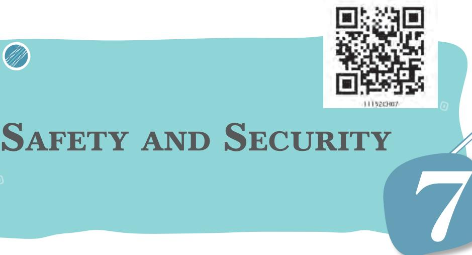

Games and sports are important for the development of physical, emotional, mental and social health. While playing any games and sports, safety and security of children is very important. It is also necessary to take steps to prevent injuries in sports field during competitions or sports training. In this chapter, we are discussing safety issues regarding the sports facilities and also dealing with the health hazards related to alcohol and substance abuse, including common medicines.

## **Safety Measures in Playgrounds, Gymnasium and Swimming Pool**

In the present scenario of competition in games and sports, coaches and athletes are mostly concerned with the winning spirit and hard but systematic sports training. During sports training and competitions of various games, safety measures and security of players need to be kept in mind. Injuries during sports training lead to fearful emotional or psychological phobia. To save the players from such phobia, simple safety rules and measures should be applied. These safety rules are to be observed by the physical education teachers, sports trainers, coaches, school administrators as well as sports equipment manufacturers. Besides these, students who are taking part in technical sports such as gymnastics and swimming, and self-defense activities shall also be taught to avoid injuries and observe safety measures during sports training. These safety measures may be applied in the following steps:

## **Safety regarding Sports Facilities**

One of the most important safety measures which shall be kept in mind is regarding the sports ground, sports instruments and sports uniform.

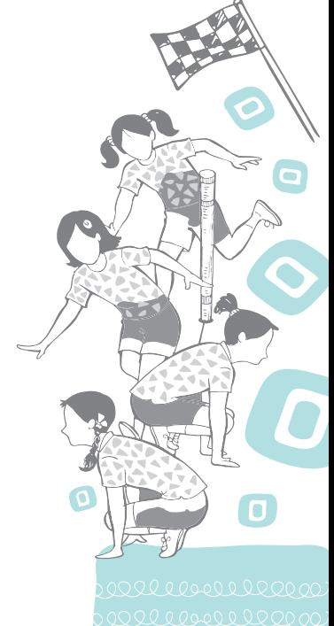

Chap-7.indd 251 31-07-2020 15:43:21

**Do You Know?** Due to decreasing land and forest ratio, cutting or eliminating trees is not permissible.

#### *Sports ground*

While preparing sports ground, the construction company should try to remove all the possible hazards such as nearby high tension electric line, barbed wire, bushes or wild grass bushes, close wall with hard surface and shifting of trees. The surface of the ground should be safe and clean, free from hazardous material like stone, broken bricks, etc. Wherever possible, the construction of hard surfaces for games like basketball, badminton and tennis should be built up properly with proper space. The chain link fencing or stairs for accommodating trainers, coaches and players or spectators should be away from the playing area, probably 6 meters away from the end lines of the play field.

#### *Field*

Proper and separate sitting area for extra players of the participating teams shall also be provided to avoid the mixing of players. Playing area of sports should be sufficient enough to prevent accidental injuries. Sitting area for spectators should be away from the actual playing area to avoid any untoward incident during competitions. Playing area should be clean and away from the hazardous materials/objects. Trees and bushes should be shifted from the play field to avoid collision. Sufficient warming up area away from the competition arena may be provided. Dangerous broken glass material or sharp edged stones should also be removed from the playing area to avoid potential injury.

#### *Safety regarding sports instruments*

Due to sports engineering and technological advancement, modern sports are played with sports equipment which are performance friendly and add technical support during movements. During planning and organising of sports equipment, the manufactures shall add the 'concept of safety to sportsperson' as priority. The material used for manufacturing the instrument/equipment shall be of high standard as the sportsperson is highly dependent on them for performing their skills. Players are also advised not to use the damaged equipment/instruments to avoid accidents. Efforts should be made that the playing surface of different games and sports should be constructed separately as advised by the respective officials, federations or associations, if space is available.

#### *Safety regarding uniforms*

Sports uniform adds glamour and advantage to the performance in games and sports but poor fabric and non-

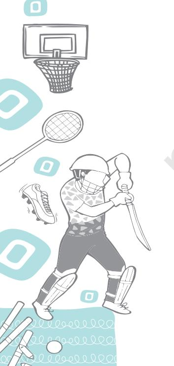

Chap-7.indd 252 31-07-2020 15:43:21

suitable shoes may be painful to the players. Sports uniforms play an important role to prepare the mood of sportspersons, as it helps the players to feel better. Preparation of sportspersons for competition includes selection of—

- a) Types of shoes
- b) Fabric of the T-shirt and its colour
- c) Selection of the shoe Most of the novice players do not know how to select the shoe for sports training, as they are not aware of the injuries caused by the poorly manufactured shoes. Generally the defect is either in the material or the arch of the sole. The defection arch may not provide support to the foot resulting in unbalanced body weight. In some cases, it has been noticed that the lack of proper arch support in the shoes may cause stress in the legs that leads to muscles stiffness. Ultimately the sportsperson gets tired and may rupture leg muscles if the activity is not done with proper shoes. The objective of wearing properly manufactured shoes are:
	- (i) comfortable feeling
	- (ii) proper ankle support
	- (iii) proper balance
	- (iv) avoiding leg injury due to uncomfortable shoes
- d. Fabric of the T-shirt: T-shirt and its colour are important for the players, especially for the novice. Due to weather variations in India, a light colored fabric which does not absorb sweat is considered better. Fabric which consumes sweat may cause allergy and skin problem if it remains in contact with the body for longer duration.

## **Safety measures in relation to Gymnasium**

Gymnasium in any institution is used for sports training for multiple sports. It is considered as an asset to the institute, and students often visit the gymnasium for the purpose of building their body, rehabilitation after injury as well as to get into proper shape. Injury in gymnasium may take place due to the following:

- a) Unsafe method of keeping equipment
- b) Lack of proper place for exercises
- c) Lack of warm-up area
- d) Old equipment
- e) Unsafe fitting of electrical gadgets

#### **Do You Know?**

The game of Kabaddi and Kho-Kho in modern time is played on synthetic surface. Usually indoor synthetic surfaces are less vulnerable to injuries.

#### **Activity 7.1**

- **•** Collect information about the safety measures taken in your school building play field/indoor hall and equipment.
- **•** Discuss with teacher.

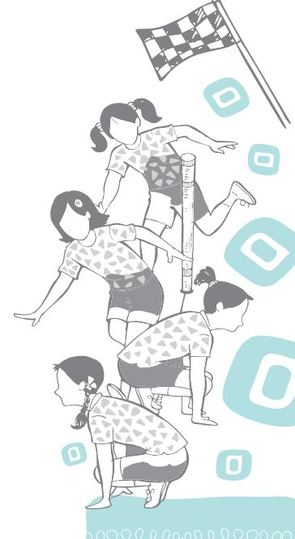

Chap-7.indd 253 31-07-2020 15:43:21

- f) Uncleaned surface
- g) Slippery gymnasium surface
- h) Poor lighting conditions
- i) Poor sanitation and lack of water supply
- j) Not observing safety measures during lifting and keeping the weight barbells
- k) Lack of proper knowledge of using equipment

### **Safety measures in relation to swimming pool**

The schools or institutions having swimming pool need to operate it with proper safety measures. To observe safety rules in swimming pool, there shall be instructors, assistant coaches, life guards, gatekeeper and sweepers. Availability of human power, water quality and cleanliness of the swimming pool are very important aspects of safety measures. The following steps should be taken for safe and hygienic pool conditions:

- a) There should be separate swimming pool for the beginners and the advance swimmers.
- b) Students should avoid going into the deeper side of the swimming pool without proper safety measures.
- c) Life guards should be well trained and careful during the pool activity. Special attention should be paid for the swimming and diving activities towards the deep end of the pool.
- d) Swimming pool instructors/coaches and life guards should be well equipped with life saving devices such as, long stick, rope, whistle, lifesaving jackets, swimming pads and kicking boards, etc.
- e) Students should follow proper instructions and guidelines of swimming pool for safety measures as well as to avoid injuries.
- f) Proper swimming uniform like costume, cap and eye protector must be used regularly during swimming in the pool.
- g) Water treatment plant must be operational during the swimming activities of the students.
- h) Chlorination of water through proper amount of chlorine will be helpful in removing accumulated algae from the water.
- i) Surface of the swimming pool should be cleaned regularly with the help of suction head brushing machine.
- j) Swimming activities should be allowed only in the presence of life guards.

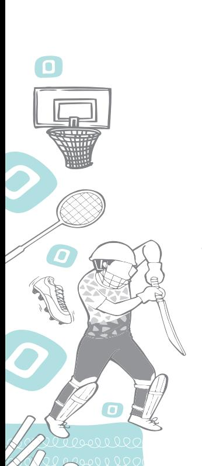

Chap-7.indd 254 31-07-2020 15:43:22

- k) While constructing the surface of pool, smooth finishing and use of standard chemicals may be ensured.
- l) Safety stairs and hangers in the pool will help swimmers to enter in the pool.
- m) Showers at pool side with fresh water taps should also be facilitated for pre and post swim showers.
	- n) The surface of washrooms in swimming pool site should be supported through matting to avoid injury from the slippery surface.
	- o) Proper lighting in the pool is always useful particularly in the evening for supervising swimmers inside the pool.

## **Safety Measures to Prevent Injuries**

It is always said that 'prevention is better than cure'. Many accidents during sports can be prevented by taking appropriate preventive measures. Students who participate in games and sports activities should be given safe and secure environment and facilities for enhancing the confidence of parents as well as students. Injuries can be prevented by knowing the reasons due to which injuries occur and observing the safety measures during playing. While constructing play arena and sports facilities, the needs of differently abled students should also be kept in mind.

## **Why do sports injuries occur?**

Injuries during sports take place due to many factors, which includes careless attitude of the player towards fitness and training. Some of the important factors that are responsible for the sports injuries are—

- a) poor equipment, surface and floor.
- b) lacking in the knowledge of rules of the game.
- c) lack of technical and tactical knowledge.
- d) lack of fitness and conditioning.
- e) not observing safety rules while playing technically difficult sports like gymnastics, diving, judo and wrestling, etc.
- f) lifting of heavy weights without helpers may lead to accident and cause severe injury.

## **How to prevent sports injuries?**

Sports injuries can be prevented in sports arenas, during competition and in technical sports. Supervision by coach and instructor will always help to avoid sports injuries during playing, training and competition.

#### **Do You Know?**

Developing physical fitness may help a player to prevent injuries up to 60 per cent in that particular game, it is scientifically proven that good physical fitness helps in better reaction ability, decision making ability and enhances self-confidence of the player.

#### **Activity 7.2**

Gather information regarding the sports injuries that occur in swimming pool and gymnasium.

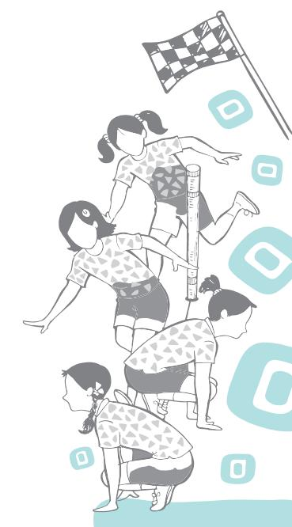

Chap-7.indd 255 31-07-2020 15:43:22

## **Activity 7.3**

- **•** Collect more information about the preventive measures to be taken while developing sports facilities.
- **•** Compare and analyse it with the steps taken by your school.
- **•** Discuss with your classmates.
- **•** Suggest ways.

#### *Prevention of injury related to sports facilities*

There are various ways to amend sports infrastructure in order to curb accidents during competition and during training of sports.

### *Prevention of injury related to competition*

Preventive measures to prevent sports injury should also be taken before competition.

- a) Proper warming up should be done before going for any games or sports. Warming up helps to enhance body's reflex actions and reduce the chances of injury.
- b) Proper safety measures should be adopted for competition such as safety gears and clothing for sports.
- c) Players should follow rules and regulations of the competition to prevent injuries.
- d) All the equipment related to the sports should be checked thoroughly and any equipment which may not be in good shape or broken should be replaced or get repaired.
- e) Officials of the competition should also evaluate the playing arena before the start of game.

### *Technical measures for prevention of injuries*

Besides the above preventive measures to avoid sports injuries, some important technical measures should also be observed to prevent injuries.

- a) Players should work on their fitness and conditioning to avoid tiredness during sports competition. Tiredness hampers the reaction and negatively influences the speed of players. A tired player is most likely to get injury during performing or playing, which can be prevented only by enhancing the physical fitness level.
- b) All the sports where difficulty level of movements is high, possibility of occurring injury are likely to be higher. It is suggested to the players to practise difficult technical movements of sports before taking active participation.
- c) Coaches and trainers should guide students regarding the safety rules at regular intervals and observe the safety measures taken by them.

Chap-7.indd 256 31-07-2020 15:43:22

- d) Proper nutrition also helps to avoid sports injuries occurring due to stress or overload training. Nutrition helps to repair and build the ruptured muscle fibers.
- e) Selection of the right kind of shoe and sports uniform also helps in preventing injuries like bruises, blisters, broken nails, sprain, strain and shin pain, etc. Every sport requires different kind of sports movements and speed. Thus, it is suggested to select the shoe and sports uniform according to suitability to a given sports condition to avoid injury.

## **Dealing with Alcohol, Substance Abuse including Common Medicines during Adolescence**

Adolescence is particularly a vulnerable time in a person's life. Navigating this stage of life can be challenging even for the most 'normal' or well-adjusted adolescents. Substance abuse is a menace, especially during the adolescence as it affects their physical, social and emotional growth. Of all the substances, alcohol and tobacco (including *pan masala, gutkha, khaini*, cigarette, *beedi*, etc.) are two of the substances most commonly misused and abused by adolescents. Being easily available, many children are exposed to these in their homes at a very early age. Parents are role models, whether good or bad, and children of such parents who misuse these substances are at a greater risk of getting into the addiction. However, with proper treatment and support of loved ones, the youngsters can surely overcome their addiction habit and live successful and happy lives.

## **Why is tobacco use unhealthy?**

Tobacco is used in various forms such as smoking (cigarettes/ *beedi/hookah*); smokeless (*pan masala* with tobacco, *gutkha*/ *khaini*).

You know that cigarette smoking is injurious to health. Most people believe that beedi is safer than cigarette. But smoking beedi is also equally dangerous.

As you know that the nicotine present in the tobacco leaves is highly addictive. It raises the blood pressure. There are about 4000 chemicals found in the smoke from the cigarettes which become a cause for different kind of cancers.

Carbon monoxide gas exhaled by the smoker, is highly poisonous. Tar, a substance resulting from the burning of tobacco leaves, is similar to coal tar used for building the roads. So just imagine the harm it causes to the lungs!

### **Do You Know?**

Do you know that half of the users who started the use of tobacco in their youth will be losing their lives by their middle age?

## **Do You Know?**

You would be surprised to know that nicotine is used as insecticides and pesticides in agriculture.

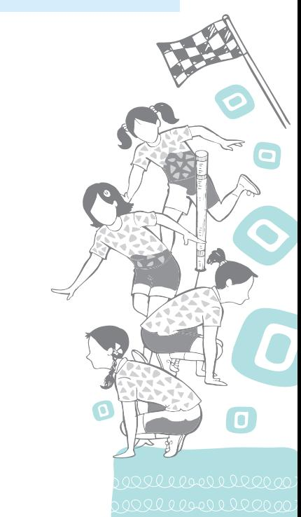

Chap-7.indd 257 31-07-2020 15:43:22

*Say "NO" to tobacco. Remember, one moment of wise decision is the foundation for future happy life for you and your family.*

| Constituents | Cancer causing | Toxic metals |
| --- | --- | --- |
|  | chemicals |  |
| Toluene | Vinyl chloride | Arsenic |
| Carbon monoxide | Benzene | Chromium |

Butane Polonium 210 Cadmium

**Table 1: Some of the Constituents of cigarette smoke**

#### *Smokeless tobacco*

You have heard and seen the advertisements of *pan masala*  and wondered what it is made up of. *Pan masala* contains *supari*, that is arecanut or betel nut, which is a traditional item and a part of many religious ceremonies in our country. Most of us believe that *pan masala* is not harmful as it is just a mixture of areca nut cuttings, commonly known as *supari*, food flavours and sweeteners. Actually it is a specialised, ingenious mix of traditional items and chemical products developed to cause addiction. New formulations of *pan masala* are constantly developed and introduced in the market to encourage initiation and sustained use of these and other similar products with an objective to deliver higher "highs" to the addicts.

A dangerous fact which is not known is that continuous use of tobacco causes oral cancer. Its use by the pregnant mothers is nearly as dangerous as alcohol drinking. If taken during pregnancy, even the unborn babies are harmed by the chemicals present in *gutkha* and *pan masala*.

#### *Health hazards of tobacco and substance misuse*

Substance misuse affects all the aspects of life of the user. Smoking causes different types of cancers, the most common being lung cancer. Research has established that *pan masala*, *gutkha*, and *khaini* all cause oral cancer. All types of tobacco products that mention 'low tar or additive-free' are harmful. Substance misuse in any form leads to dependence and addiction. It affects the personality and makes one angrier, volatile, depressed and tense. The day-to-day activities along with thinking and memory are affected, resulting in a negative impact upon the work in school/college/job.

#### *Effect of tobacco abuse among women*

Have you noticed attractive advertisements of lighted cigarettes? Though we mostly see men smoking, the young women are one of the biggest targets of the tobacco industry. The tobacco industry organises richly-funded

#### **Case Study**

*You must have seen the short film on Mukesh shown in theatres before any film, who dies at a very young age due to eating Gutkha. Discuss the case of Mukesh in the class and the effects of smoking.*

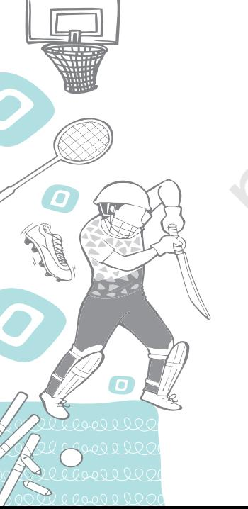

Chap-7.indd 258 31-07-2020 15:43:22

marketing campaigns targetting young children through advertisements highlighting and falsely linking the tobacco use with behaviour aspects such as freedom and liberty, or beauty, slim figure and prestige.

Marketing strategies lure consumers especially the youth, with misleading categories, such as 'light' or 'low tar'. More young children smoke 'light' cigarettes, often in the mistaken belief that 'light' means 'safer'. In fact, 'light' smokers often engage in inhaling more deeply and more frequently to absorb the desired amount of nicotine. Women who smoke are more likely to experience infertility and delays in conceiving than those who do not. Smoking during pregnancy increases the risks of premature delivery, still birth and death. Smoking increases women's risk for cancer of the cervix as well.

#### **Activity 7.4**

Look at the pictures given below. They look scary. You may have seen such pictures on cigarette packets. It is mandatory to display pictorial warnings on tobacco products in India and many other countries.

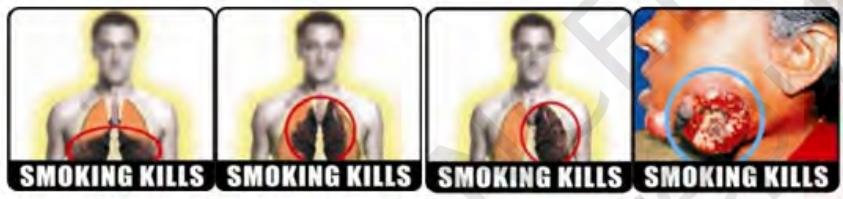

- **•** Find out which countries have very gory and scary pictures on the cigarette packets. Make a collage and display with a message.
- **•** Form a chain of five students and share the benefits of not smoking with them
- **•** Plan and stage a role play on "Say No to Tobacco".

## *How can we identify the symptoms of alcohol or substance abuse among children during adolescence?*

#### **Symptoms to observe for alcohol/tobacco abuse**

- **•** Feeling depressed, hopeless, rundown or even suicidal
- **•** Being selfish and not caring for others
- **•** Frequent absent-mindedness
- **•** Money or valuables disappear from home
- **•** Irritability and aggressiveness, violent behaviour
- **•** Declining grades
- **•** Important routine activities such as homework, and sports getting affected

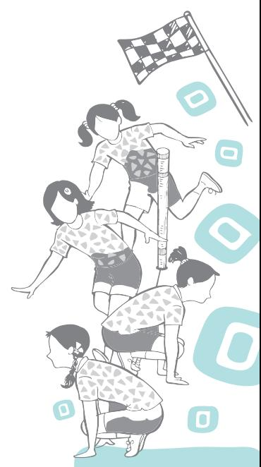

Chap-7.indd 259 31-07-2020 15:43:22

- **•** Having a new friend circle, often not disclosing to family
- **•** An urge to drink on a daily basis
- **•** Avoiding family and friends, spending more time alone in order to consume drugs or alcohol
- **•** Taking risks, including driving rashly as well as having risky behaviour.

#### *Reasons for Alcohol Consumption and Substance Abuse*

Many teenagers believe that drinking alcohol is a way of gaining acceptance and admiration of their peers, fitting in the friend circles and a way to show off that they have grown up. Studies have shown that many adolescents started substance abuse because of the pressure from their friends.

Some children indulge in substance abuse to show their anger or a way of rebelling against their parental or societal norms. For many, it is due to curiosity. Sometimes it is done to explore the unknown behaviour. No matter whatever the reasons are, substance misuse is not very healthy and is dangerous.

Some of the adverse effects could be:

- a) Greater difficulty in focussing and paying attention.
- b) Poor school performance.
- c) Depression and anxiety.
- d) Unnatural deaths, for example from motor vehicle accidents, due to drunken driving.
- e) Tendency to indulge in crimes like stealing, fighting, etc.
- f) Suicidal tendencies are much higher in children of adolescence age who drink or engage in substance misuse.

Given below are some of the most common myths and facts related to substance abuse:

| Myth |  |  |  | Facts |
| --- | --- | --- | --- | --- |
| There is | no | harm | in | Almost all drug addicts start by trying |
| trying a drug just once, |  |  |  | just once. Once the drug is taken, the |
| because one can stop |  |  |  | user is always amenable to further |
| after that. |  |  |  | drug intake, which becomes a part of |
|  |  |  |  | their habit. |
| Drugs increase creativity |  |  |  | Drug addict loses clarity and may |
| and make the user more |  |  |  | become incoherent over a period of |
| imaginative |  |  |  | time. |

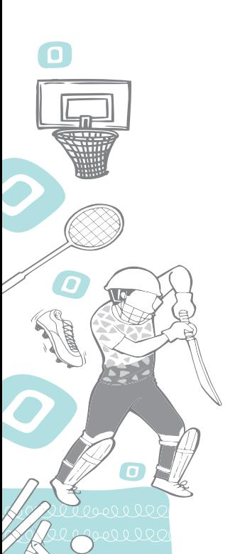

Chap-7.indd 260 31-07-2020 15:43:22

| Drugs | can | sharpen |  | Drugs induce dullness and adversely |  |
| --- | --- | --- | --- | --- | --- |
| thinking lead | and |  | to | affect the normal functioning of body |  |
| greater concentration. |  |  |  | and mind. |  |
| Will power alone can help |  |  |  | Besides strong will power, love and |  |
| a drug addict to stop |  |  |  | support of family and friends, medical |  |
| taking drugs. |  |  |  | and psychiatric treatment may be |  |
|  |  |  |  | needed to come out of drug addiction. |  |
| Alcohol | helps | people |  | Very often the opposite is found to |  |
| forget their problems. |  |  |  | be true. People bring up forgotten |  |
|  |  |  |  | problems under intoxication. Alcohol |  |
|  |  |  |  | only adds up to the existing problems. |  |
| Drug use makes one cool |  |  |  | In the beginning, it may be seen that |  |
| and better accepted by |  |  |  | the use of drugs helps in winning |  |
| peers and classmates. |  |  |  | more friends but this is a myth as |  |
|  |  |  |  | these peers are not true friends or |  |
|  |  |  |  | well-wishers. Furthermore, over a |  |
|  |  |  | period | of time, drug dependence |  |
|  |  |  |  | makes one asocial and isolated. |  |
| Inhalants are basically |  |  |  | Using inhalants such as thinners, |  |
| harmless | even | though | glue, | cleaning fluids can | cause |
| people make a big deal |  |  |  | permanent damage to organs like the |  |
| about them. |  |  |  | liver, brain and nerves. They are also |  |
|  |  |  |  | extremely flammable and can cause |  |
|  |  |  |  | burns if matches are lit nearby. |  |

#### **Case Study**

*Three friends — Mani, Adil and Ronny met at a marriage party. Mani and Ronny wanted to drink in celebration and compelled Adil, (who has never had a drink before) to join them. They insisted him that he should join them for the sake of friendship. Adil is in a dilemma. On the one hand, he doesn't want to lose his friendship but on the other he is conscious that nobody in his family drinks alcohol. He has also learnt from his parents that alcohol is harmful for health.*

#### **Questions for discussion**

- 1. What are the choices that Adil has?
- 2. What would you have done if you were in Adil's place?
- 3. How else could Adil's friends have celebrated?

#### *Common medicines*

There has been a growing trend of taking medicines by the people not only for the treatment of certain diseases against proper prescription but also for other reasons such as cosmetics, weight loss or weight gain, etc. Often these are purchased through sales over the counter, without any proper prescription. This trend is seen more among children of adolescence age and younger generations.

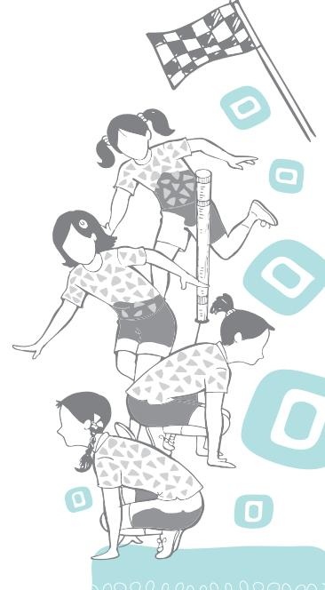

Chap-7.indd 261 31-07-2020 15:43:22

It is always advisable to seek the advice of a doctor and consume only those medicines that have been prescribed. One should never decide one's own medicines (without prescription from a doctor) whatever the ailment be. One should not fall prey to false advertisements asserting that certain drugs or medicines will help in reducing or gaining weight or enhance the stamina or cosmetic beauty.

## *How to use medicines?*

A medicine can be both beneficial and harmful, depending upon how it is taken. When a medicine is taken in the manner as prescribed by the doctor, it can be beneficial but when a medicine is not taken in a manner prescribed by the doctor (overdose) or it is taken with some other substances that it should not be combined with, it may lead to adverse effects on the body.

Medicines should always be stored in a cool dry place and away from direct sunlight. Some of the medicines may also need to be stored in the refrigerator. So follow the directions on label.

- **•** A medicine is anything that is used to diagnose, prevent or treat illness in humans.
- **•** The basic function of medicine is to aid the healing process of the body. The medicine acts as a catalyst in stimulating the natural healing process of the body.
- **•** Medicines should be used to assist the body's mechanism to heal itself.
- **•** We should not be too dependent on medicines. It is rather important to work towards achieving a physical state in which we can regain and recover without or with least possible aid of medicines.
- **•** Prescription drugs and over the counter medicine are the ones prescribed by the doctor upon examining the patient for treatment of their illness. While over the counter medicines are the ones that a patient may buy without consulting a doctor.
- **•** All medications which are sold without a prescription have the potential to cause harm to the body. These drugs and medicines may be sold as advertisements to help reduce or gain weight, enhance cosmetic beauty, etc.

## *What precautions should we take before taking medicines?*

Always follow the dosage of medicine as prescribed by the doctor and the time intervals. Follow other instructions carefully before consuming any medicine, such as taking medicines before or after meals, etc. Medicines should be taken with water rather than with tea, milk or juice, etc.

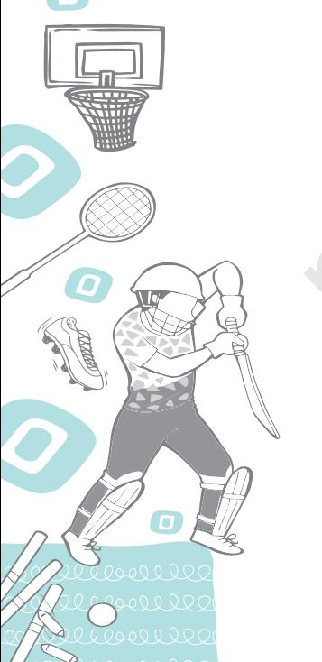

Chap-7.indd 262 31-07-2020 15:43:22

## **Doping**

## **Concept of Doping**

Doping is not a new trend brought on by the advent of modern pharmaceutical agents. History shows that athletes in the ancient Olympic Games were willing to take plant extracts in a bid to perform better than their competitors. Performance enhancing drugs and dietary supplements have been around since the ancient Olympic Games. Because of the ethical considerations relating to unfair advantage during competition and the potential for the adverse effect, most athletic governing bodies have generated a list of substances that are banned from national and international competitions. Doping, is a term used for performance enhancing drugs in sports and often understood as the use of such drugs which are considered helpful to improve athletic performance. Many drugs have been banned in sports as they are deemed to provide an unfair advantage, pose a health risk, or are seen to violate the 'spirit of sport'. The use of banned drugs by athletes is referred to as 'doping'.

Doping is defined by the International Olympics Committee (IOC) as, 'the use of any method or substance that might harm the athlete, in a quest to gain an unfair advantage, over his or her fellow competitors'. Hence, training at altitude to increase the blood's ability to carry oxygen is allowed, but the use of drugs, to achieve the same result is considered unethical and prohibited by the authorities.

Rigorous testing procedures have shown many notable athletes to be trying to 'beat the system' by taking such drugs. Most notably, Ben Johnson, in 1988, who won the 100 m sprint in a new world record time of 9.79s, was tested positive for steroids, and lost his gold medal and world record. The reasons to ban doping in sports are mainly the health risks of performance-enhancing drugs, the equality of opportunity for athletes, and the exemplary effect of drugfree sport for the public. Anti-doping authorities state that using performance-enhancing drugs goes against the 'spirit of sport'.

## **Why Doping?**

Most athletes take drugs—

- **•** to enhance their physical performance in an attempt to prevent them falling behind other competitors even at the cost of damaging their health and risking their sports career.
- **•** to help them wind down and relax,

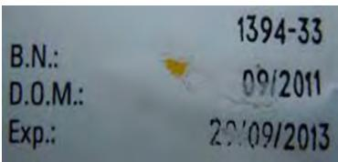

*Fig. 7.1: Medicine label showing date of manufacturing and expiry date*

## **Activity 7.4**

Find out when was the doping case first recorded in an International Competition.

**Do You Know?** EPO-Erythroproietin, is a peptide hormone, i.e., produced naturally by the human body.

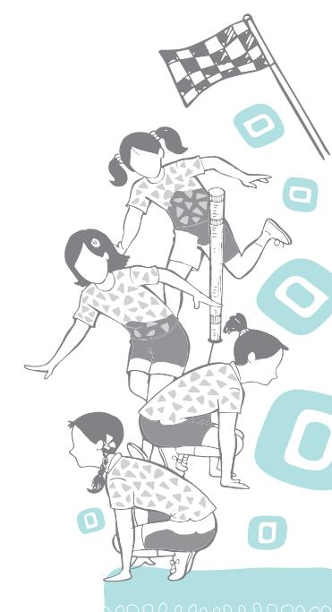

Chap-7.indd 263 31-07-2020 15:43:22

## **Do You Know?**

- **•** Players are selected for doping control either via a random draw conducted by the Doping Control Officer (DCO), witnessed by the team or representatives.
- **•** The World Anti Doping Agency (WADA) is a foundation created through a collective initiative led by the International Olympic Committee (IOC).
- **•** to cope with the pressure and stress associated with constant battle to win all the time
- **•** to boost their own self-esteem and confidence,
- **•** to mask the pain of certain sports injuries,
- **•** to control and reduce weight,
- **•** to hide the use of any other banned substances.

## **Doping in Sports**

In competitive sports, doping refers to the use of banned performance-enhancing drugs by competitors, where the term doping is widely used by organisations that regulate sporting competitions. The use of drugs to enhance performance is considered unethical by most international sports organisations, including the International Olympic Committee. Although, ethicists (World Health Organisation) have argued that it is not different from the use of new materials in the construction of apparels and sporting equipment, which can also aid performance and give competitors an unfair advantage.

## **Classifications of Doping**

The technology in our world today is truly amazing. People are discovering new and exciting ways everyday to make our lives easier and more enjoyable. Doctors and scientists are also discovering ways to help us live longer and finding ways to cure our bodies from many different illnesses. Medicine today is without a doubt much better than in past years. Doctors and scientists continue to discover ways to help create the ideal athlete in the world. They find ways to use drugs that were originally set out for some other function and use it to improve the performances of athletes today. Besides the other unethical practices used by athletes, the two principal categories of performance-enhancing substances considered as the main source are:

- 1. Dietary supplements
- 2. Injectable supplements—Hormones and Drugs

## **Dietary Supplements**

Dietary supplements are highly refined products that should not be confused with food. They may not have any positive nutritional value; hence, not referred to as nutritional supplements.

## **Hormones**

A variety of endogenously produced hormones are used to enhance athletic performance. The most commonly used

Chap-7.indd 264 31-07-2020 15:43:22

hormone is 'testosterone'. This hormone is known to produce strength and stimulate the function of skeleton muscles with higher level of energy. Hormone produced and secreted by different organs of the body are stored and employed by athlete as 'Ergogenic aids'.

## **Drugs**

A drug encompasses substance that changes the body's function. A drug is a chemical substance that, when absorbed into the body, can alter normal bodily function. This includes the substances that stimulate hormone secretion. If a substance looks like a medicine or is administered differently from the way in which foods would be consumed, it may be classified as a drug.

## **Basic Doping Drugs used in Sports**

The basic drugs which are used for doping purposes in different sports are described below for better understanding about the drugs.

## *Narcotics*

Narcotics are used as doping in sports. They are injected into a human's blood stream, or muscles, or under skin. Narcotics can also be swallowed. Consumption of narcotics reduces, eliminate, and hide pain. Examples of narcotics are morphine and methadone. They are also used for moderate inflammation. This drug is commonly used in sports with less recovery time in between games. Athletes from football and hockey games commonly use narcotics.

**Side Effects:** Narcotics decrease heart rate, causes nausea, and vomiting.

## *Steroids*

The well-known doping drugs called anabolic-androgenic steroids are a group of powerful chemical compound, related to the male sex hormone 'testosterone'. The original purpose of steroids was to help with different diseases. It was developed in the 1930's. Consumption helps to produce more hormones in the body.

**Side Effects:** Consumption can lead to early heart attacks, strokes, liver, tumours, kidney failure, and serious psychiatric problems. Steroids can be injected with needles, which cause risks of infections, such as HIV/AIDS and Hepatitis B and C. Physical symptoms include developing a very large head, acne flare ups, aggressive behaviour and mood swings.

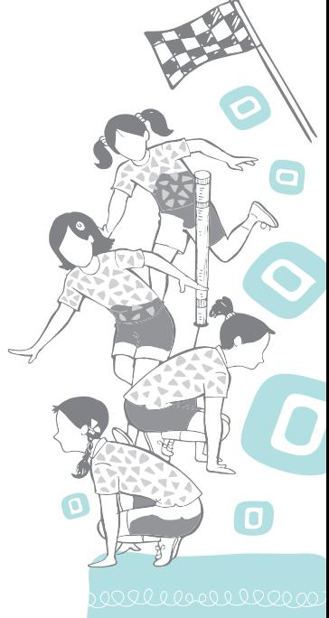

Chap-7.indd 265 31-07-2020 15:43:22

### *Gene Doping*

Gene doping probably began in the year 2001, when the International Olympic Committee Medical Commission came together to discuss the adverse effects of gene therapy in sports. World Anti Doping Agency in 2002 took the action immediately and banned gene doping. Genes can be injected into muscles to prevent muscle-wasting disorder and this camouflages with the other human genes thus making gene doping almost impossible to detect.

**Side Effects:** Gene doping is very dangerous for the human body as it leads to abnormal growth, extra muscles in the body which needs more blood circulation during contraction hence, may lead to lack of blood for other systems and may cause serious problems for the user. Gene doping is susceptive to extra growth of unwanted hair, heart related problems, nervous breakdown and suspecting to cancer at an early age.

#### *Blood doping*

Blood doping is a very high intense type of doping. It increases red blood cell mass and thereby, delivering more oxygen to the muscles. Athletes use this unethical practice with the help of pathologist and medical practioners, usually in the sports like cross-country, cycling, and swimming, etc. Blood doping vastly increases an athlete's endurance. The red blood cells are then separated and stored in a cold area. The blood is then fused back into the body about a week prior to the athletes' high endurance event. Blood doping increases the capacity of cardiovascular system and helps delaying the fatigue. This is all unethical.

**Side Effects:** EPO is a peptide hormone that is produced naturally by the human body. EPO is released from the kidneys and acts on the bone marrow to stimulate red blood cell production. It is well known that EPO, by thickening the blood, leads to an increased risk of several deadly diseases such as, heart disease, stroke, and cerebral or pulmonary embolism. The misuse of recombinant human EPO may also lead to autoimmune diseases with serious health consequences. In blood doping, one to four units of blood is taken out from the athlete's body.

## **Harms of Prohibited Substances**

- 1. Taking doping drugs can have terrible effects on your body. The well known doping drug, steroids has a number of negative effects on the body. Steroids interrupt the normal development of hormones
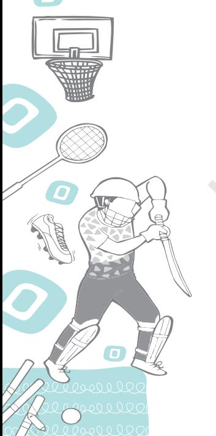

Chap-7.indd 266 31-07-2020 15:43:22

throughout your body. When this happens, human body experiences changes that are irreversible. Changes such as reduced sperm production, baldness, breast development in men, breast reduction and voice deepening for women. The risk of high blood pressure and the risk of heart attacks is very high. If a person takes a large amount of steroids, it increases irritability and aggression.

- 2. The blood doping causes much stress on the heart. The reason for this is that the red blood count increases which causes the blood in blood stream to become thick. The human heart is not used to pumping such thick blood. This leads to different kinds of heart diseases.
- 3. Narcotics are a street drug and people share the needles to inject it. This gives the risk of passing different diseases from one person to another. Overdosing of narcotics can cause death. Withdrawal effects include limited vision, reduced sex drive, menstrual problems, chronic constipation, mood swings, and muscle twitches.
- 4. Lean mass builders such as anabolic steroids can cause dangerous increase in the levels of cholesterol, heart attack, hypertension, stroke, liver and kidney damage, jaundice, depression, aggression, mood swings, acne and skin disease, reduced sperm count and impotence in males, and amenorrhea in females.
- 5. Beta-2 antagonists can cause nausea, headaches, dizziness, muscle cramps and heart flutters, whilst other lean mass builders such as the human growth hormone may be associated with liver problems, heart disease and irregularities in the processing of insulin.
- 6. Side effects of stimulants such as amphetamines include increased heart rate, blood pressure and body temperature, stroke, hypertension, agitation, anxiety and sudden cardiac death. Strong prescription painkillers such as narcotics are also highly addictive and can impair the mental abilities.
- 7. Relaxants such as alcohol and marijuana cause impaired judgement, balance, co-ordination and memory, hallucinations and drowsiness.
- 8. Side effects of diuretics include dehydration, dizziness, cramps, and kidney failure.
- 9. Those masking drugs used to prevent the detection of other banned substances can cause severe allergic reactions, nausea and vomiting.

#### **Activity 7.5**

Make a list of the banned substances used by some athletes to control body weight for a combat sports.

Chap-7.indd 267 31-07-2020 15:43:22

## **Testing In-competition and**

## **Out-of-competition**

Drug testing has become an increasingly large part of both professional and amateur sports. An athlete can be called for drug testing at any time, in or out of competition. During competition, some sports carry out drug testing only on the winning team or top three competitors. Others will be tested by random selection amongst all the competitors. There are two types of doping control tests:

- 1. In-Competition and
- 2. Out-of-Competition (OOC) Testing

In-Competition Testing is conducted at a competition venue, while Out of Competition Testing occurs with no advance notice and can occur at any location and at any time.

## **Doping Control Procedure**

The main purpose of the technical procedures for doping control is—

- 1. to plan for effective testing.
- 2. to maintain the integrity and identity of the samples collected, from the point when the athlete is notified of the test to the point when the samples are transported to the laboratory for analysis.

Chap-7.indd 268 31-07-2020 15:43:23

# **Assessment**

## **I. Long Answer Questions**

- 1. How can we prevent the injuries by preparing good sports facilities?
Safety and Security 269

- 2. What are the safety rules one can observe when buying a sports shoe?
- 3. What is meant by safety through sports instruments?
- 4. How does sports uniform help in safety of the sportspersons?
- 5. What precaution can be taken to prevent injuries in the gymnasium?
- 6. How can you curb the accidents in swimming pool?
- 7. Physical fitness may be used as a tool to prevent sports injuries. Elaborate.
- 8. Write down the myths and facts about substance abuse.
- 9. What is doping and what are the side effects of blood doping?
- 10. Why do athletes dope? Explain the side effects of prohibited substances.

## **II. Short Answer Questions**

- 1. What is meant by safety measures?
- 2. Why is the fabric of T-shirt important for athletes?
- 3. Write two safety measures in relation to swimming pool.
- 4. Write two ways to prevent sports injury.
- 5. Does cigarette smoking raise your status? If no, why?
- 6. Why tobacco use is deadly?
- 7. What three things should you focus on when buying medicines?
- 8. What are the categories of doping?

## **III. Multiple Choice Questions**

- 1. Medicine should be purchased_______________.
- (a) as per prescription of the doctor
- (b) as advised by the chemist on the basis of our health problem
	- (c) after observing the date of manufacture and the date of expiry
- (d) (a) and (c) both

2. Medicines should be consumed by the patient ______________.

- (a) as advised by the doctor
- (b) always after the meals

Chap-7.indd 269 31-07-2020 15:43:23

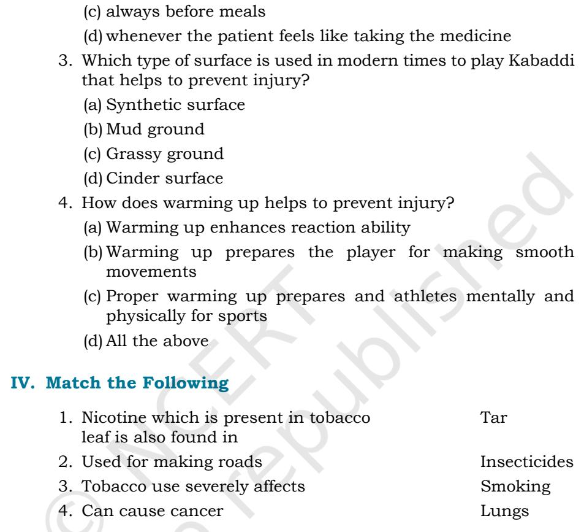

#### **V. Projects**

- 1. Make a table of the various medicines being taken by a sick family member.

| Dose | Timings | Expiry date | Remarks |
| --- | --- | --- | --- |
| Medicine Prescribed |  | on the label of package |  |
| Name of |  |  |  |

- 2. You would have seen many women smoking beedi or cigarette. Some may even be pregnant. Discuss with two such women the harmful effects of tobacco use among women, especially the pregnant women.
Chap-7.indd 270 31-07-2020 15:43:23

- 3. You would have seen many small shops, including *pan* shops which sell cigarettes and *pan masala* products to the children. Do you know that sale of any tobacco products to children and sale of these items within 100 yards of any educational institution is banned? It is sometimes very difficult to remove these shops. Hold discussion with the Residents Welfare Association and Parent-Teacher forum to stop the sale of any tobacco product near your school.
- 4. Discuss with your class teacher and students' committee as to what actions can be taken to make your school a tobacco-free zone.

Chap-7.indd 271 31-07-2020 15:43:23

