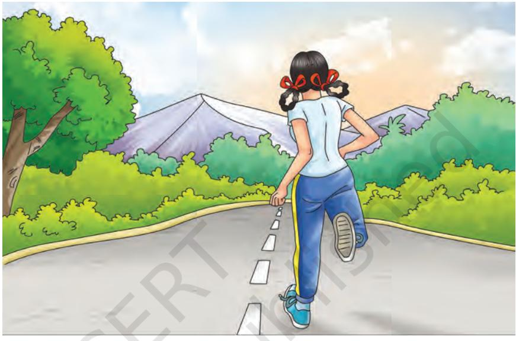

Physical fitness directly influences the health of an individual. So to keep ourself healthy, fitness sessions should be incorporated in our daily routine.

'Physical fitness is a state of health and well-being. It develops your capacity to perform better in sports, your job and day-to-day routine work. This is achieved through moderate/vigorous physical activities, balanced diet and proper recovery.'

Regular planned fitness activities like walking, jogging, cycling, swimming and yoga improve health and physical fitness of an individual. It also reduces the risk of heart diseases, diabetes, hypertension and depression. So, we can say that physical fitness is related to — 'well-being' and 'wholesome development' - of an individual.

There are five components of health related physical fitness—

- 1. Muscular Strength
- 2. Endurance
- 3. Flexibility
- 4. Body Composition
- 5. Cardiovascular Endurance

# **Muscular Strength**

Muscular strength is directly related to force production. Not only in sports but it is related to our each and every movement. Movement of our body parts is possible due to strength be it flexing a finger or getting up from the bed.

Paralysed people cannot move their body parts because they have lost the capacity to produce strength.

Chap-8.indd 272 31-07-2020 15:43:52

A new born baby cannot stand up and walk because they has less strength. So, we can say that for every movement of body part or for moving body from one position to another position, strength is required.

Whenever we think about sports performance, the first thing which comes into our mind is the muscular strength. Normally we use the term strength instead of muscular strength. If we ask someone a question, do you have the strength to do this physical work? He or she will knowingly or unknowingly flex his or her muscle and say I have the strength to do this. This shows in itself that somewhere strength is associated with muscles.

Strength is normally understood as the ability of the muscle or group of muscles of an individual to exert force against the resistance. If we are talking about exerting force then the question which comes in our mind is, why do we want to exert force? For this we have to look into the nature of the sports activities. We try to act against the resistance. Now the resistance can be of two types. It can be internal resistance like your own body weight or it can be external resistance like opponent's body weight. In some of the cases we act against the resistance which we cannot conquer and in some of the cases we act to overcome that resistance. In both the cases we exert force with the help of our muscles.

Muscular strength is thus, 'the ability of the muscle or muscle groups of an individual to exert force on the resistance to overcome it or to act against it as per the demand of the sports activity'.

Moving further, we look at how the muscular strength ability is used according to the nature of sports. We find that sometimes we need to apply force against the maximum resistance, but it is for shorter duration and sometimes we need to apply the force for longer duration. Taking into account the nature of sports as far as strength abilities are concerned, we can divide the strength abilities into three parts—

- **(a) Maximum Strength:** The name itself reflects that we are talking about something to its maximum limit. So, we can say that when our muscle or muscles group is able to generate the force with 100 per cent effort by which we are able to tackle the maximum resistance in a single contraction, it is called maximum strength of an individual. It is the ability which is of great use in the sports like weight lifting, throw events in athletics, etc.
# **Activity 8.1**

Compare the strength of your classmates with an Arm Wrestling competitor.

#### **Do You Know?**

- **•** Aerobic capacity is the capacity to work in the presence of maximum amount of O2 and the nature of the work is of longer duration.
- **•** Anaerobic capacity is capacity to work in less amount of O2 and nature of work is of short duration.

Chap-8.indd 273 31-07-2020 15:43:53

- **(b) Explosive Strength:** In some of the books, you may find this with the name of elastic strength. This is the ability where both strength and speed comes into play. When the muscle or group of muscles contract with high speed to overcome or to act against the resistance with 70 per cent to 80 per cent effort, then it is called the explosive strength. There are several examples where the explosive strength is required such as jumping, sprinting in athletics, boxing, etc.
- **(c) Strength Endurance:** As it reflects from the name itself that it is related to the work which is done for longer duration. It is both strength as well as endurance which comes into play. In simple words, we can say that when our muscle or a group of muscles act against the resistance with 50 per cent to 60 per cent effort or try to overcome the resistance for longer duration in spite of having fatigue, then it is called that the individual is having strength endurance. There are many sports where we can easily see the use of this ability such as hill running in cross country race, cycling, swimming, etc.

As we know that strength depends upon the contraction of muscles and several other factors. So let us have a look on the factors which play major role in the liberation of force by the muscles. These are as follows—

- 1. Neural Control: How much force the muscle will generate largely depends upon three major factors.
	- Number of motor units involved in the contraction — If the greater number of motor units are recruited then more amount of force will be generated.
	- Size of the motor units involved in the contraction — If the size of the motor units is greater, then also, the amount of force generated will be higher.
	- Intensity of nerve impulse If the intensity of nerve impulse is faster, then also, the force generated by the muscle will be higher.
- 2. Muscle Cross-section: It is well known to everyone that liberation of force largely depends upon the size of the muscles. The more the size, the more force it will generate.
- 3. Muscle fibre: Muscles are made up of two types of fibres, one is fast twitch fibre (white) and another

Chap-8.indd 274 31-07-2020 15:43:53

is called slow twitch fibre (red). Both the fibres are present in the muscles. The quality of the muscle depends upon the proportion of the fibres in the particular muscle. If the fast twitch fibres are more in ratio, then the muscle will contract faster and generate more force. This type of muscle has anaerobic capacity. Whereas, the muscle having slow twitch fibre will generate less force in comparison to the muscle with fast twitch fibres.

- 4. Energy supply: Muscles get their energy by the breakdown of ATP (Adenosine Triphosphate) and CP (Creatine Phosphate) which is stored in the body. The amount of ATP and CP store is very essential for the muscular activities as it provides the energy to the muscles.
- 5. Psychological factors: In many of the situations, the psychological factors contribute a lot in getting more forceful muscular contraction. The factors such as anger, aggression, motivation, etc., play a very crucial role in pushing their mind to develop very strong nerve impulse which can lead to activate more number of motor units.

#### *Methods of Strength Improvement*

Strength is regarded as a very essential part of sports performance. It is a conditional ability and can be improved to a greater extent by the training. There are various methods by which one can achieve the level of strength one wants. Whenever we think about improving the strength ability of an individual, the first thing which comes to our mind is the structure of our activity where we are going to use this strength. In some of the activities, our own body weight acts as a resistance and in some cases, external resistance plays the maximum role. For example, in cross country races while running on the hill, our own body weight acts as a resistance and in weight lifting, external weight acts as the resistance. So, when we design resistance training for developing strength ability of an individual, we keep both the conditions in our mind. We know that countering the resistance again and again will help us to improve our strength ability. For improving the strength ability, the following methods are used.

# **Activity 8.2**

Perform push-ups, pull-ups, situps along with your classmates and find who scores highest in these activities.

Chap-8.indd 275 31-07-2020 15:43:53

- 1. Using our own body weight as a resistance: In this method, we design our strength training in such a way that our own body weight acts as a resistance, for example, rope climbing, hill running, etc. In this, the pull of gravity plays a very vital role. We try to carry our own body against the gravity which helps us to improve our muscular strength. This method is very effective for the young athletes.

*Fig. 8.1: Exercise with own body weight*

- 2. Using external weight as a resistance: In this type of training, the athlete uses external weight as a resistance. This is a more effective method of improving the strength abilities. For example, weight training where weight plates, medicine ball, weight belts, etc., are used to develop strength ability. The resistance is increased or decreased according to the need. Along with weight training, several other methods are also used for improving the strength where external resistance is used. For example, swimming against the flow of water in the river, drag running, etc.
Chap-8.indd 276 31-07-2020 15:43:54

*Fig. 8.2: Excercise with external weight as resistance*

# **Endurance**

When an individual continues doing physical activity for a longer period of time, then he or she is said to have good endurance for doing that particular work. By nature, it looks like both physiological as well as psychological abilities of an individual play a crucial role in determining the endurance ability.

As an individual continues doing any work for longer duration, after some time he or she may feel physical as well as mental fatigue. But in spite of this, if he or she is able to continue the work for longer duration then this shows that he or she is having good endurance.

Endurance is normally understood as the ability to do any work for longer duration. It is task specific in nature. We come across many such examples in our daily life which shows that this ability is task specific such as we see a teacher who stands and continues taking his classes for hours together. If the same teacher is asked to run for an hour or more, he or she will not be able to do so. At the same time, if you ask a long distance runner to run for an hour, he or she will do it easily, but you ask the same runner to sit and work in the office for long hours, he or she may not be able do it. Mental toughness, interest for the task and physiological qualities all have a very important role to play when we talk about endurance.

Chap-8.indd 277 31-07-2020 15:43:57

So considering all such things we can say that 'endurance is the physiological as well as psychological ability of an individual to do some specific type of work for longer duration with the desired quality under the condition of fatigue'.

Endurance can be divided into three types, as far as nature of the activity is concerned.

- 1. Basic endurance: This type of endurance ability makes an individual capable to carry out any type of work for longer duration. It is not task specific. This type of endurance largely depends upon aerobic capacity of an individual. In this type of endurance, the pace of the activity is slow.
- 2. General endurance: This type of endurance ability makes an individual capable to carry out any type of work for longer duration with various movement patterns and pace. The nature of the pace may change according to the demand of the activity.
- 3. Specific endurance: This type of endurance ability makes an individual capable to carry out a specific type of work for longer duration with a set type of movement patterns and pace. This involves aerobic as well as anaerobic qualities of an individual and is highly trainable in nature.

#### *Factors determining endurance*

Various physiological and psychological factors are involved in determining the endurance of an individual. These factors are muscle fibre type, aerobic capacity, anaerobic capacity, movement pattern and psychological factors.

- 1. Muscle fibre type: Muscles are made up of two types of fibres, namely fast twitch and slow twitch fibre. Both types are present in the muscle of an individual. If the ratio of slow twitch fibres is more, then an individual will possess the aerobic capacity which will enable him/her to have endurance ability. In the same manner, if there is higher ratio of fast twitch fibres, then an individual will possess the anaerobic capacity and will dominate in strength and speed activities.
- 2. Aerobic Capacity: It is the ability of muscle to utilise more amount of oxygen while working. This type of capacity largely depends upon the oxygen uptake, its transportation from atmosphere to the working muscles and oxygen consumption. Oxygen intake is the amount of oxygen which is

Chap-8.indd 278 31-07-2020 15:43:57

taken from the atmosphere with the help of nose and mouth and is sent to the lungs and from where it is transferred to the blood. Transportation of oxygen from lungs to the target muscle is very important. How much oxygen will be transported depends upon the amount of oxygen absorbed by the blood and the capacity of the heart which will pump the blood into circulation. The amount of oxygen absorbed in blood depends upon the amount of haemoglobin present in the blood which carries oxygen to the target muscles. The capacity of the heart and vascular system of the body will determine how fast the blood will reach to the target muscle. If the heart is strong and has larger chamber size, it will pump more blood in circulation which will help the oxygen to reach the target muscle in less time. Further, when the oxygen reaches the target muscle, it has to be taken up by the muscle and then consumed.

- 3. Anaerobic capacity: It is the ability of the muscle to work in the presence of inadequate amount of oxygen. During such conditions, two types of energy systems work, i.e., splitting of phosphogens and glycolysis of glycogens. The phosphogens, i.e., Adenosine Triphosphate and Creatine Phosphate (ATP and CP) last for 8 to 10 seconds only. The amount of phosphogens can be increased by training. The increased ratio of lactic acid in the muscle decreases the capacity of working muscle, so it is quickly pushed into the blood which makes changes in the pH value of the blood and makes the blood acidic. To avoid this, alkali reserves present in the blood neutralise the lactic acid effect. This system is called buffer system and it is very helpful for endurance performance. Further, an individual's capacity to tolerate lactic acid also plays an important role in deciding the endurance capacity.
- 4. Movement pattern: Economical movement pattern is of great help for saving energy, which in turn helps in improving endurance capacity of an individual. A good technique can save the wastage of energy.
- 5. Psychological factors: This has a big role to play when it comes to endurance performance. Mental toughness to tolerate pain, pushing oneself, etc., has a great impact on continuing the long duration activities.

Chap-8.indd 279 31-07-2020 15:43:57

#### *Improvement of endurance*

There are various methods by which one can improve his or her endurance. This is highly trainable ability. The methods by which we can improve our endurance capacity are mentioned below.

*Fig. 8.3: Improvement of endurance with fast pace*

- 1. Continuous method: The method in which we go for long duration activity without any rest or break in between. This method can be practiced in various forms.

*Fig. 8.4: Improvement of endurance through cross country*

Chap-8.indd 280 31-07-2020 15:43:59

- a) With slow pace: This method is normally used for very long duration activity in which the pace is slow and helps in developing the aerobic capacity of an athlete. This method has a great effect on muscles. The major changes which take place are — increase in muscle glycogen level, increase of capillaries in muscle and increase in the quantity of oxidative enzymes. Number and size of mitochondria increases, thermo-regulation capacity of the body improves and due to long practice, the movement pattern also becomes economic.
- b) With fast pace: In this method, the pace is faster. The duration of practice depends upon the fitness of the athlete. This method is very much effective to improve the anaerobic capacity of the athlete.
- c) With changing pace: In this type of method, the athlete is trained with change in pace. This is very much effective in improving the aerobic as well as anaerobic capacity of the athlete.
- d) Fartlek method: This method is also called 'speed play'. In this method, the change of pace is not planned prior to the start of the practice. This method is very effective for mature athletes. The athlete himself decides the pace and duration as per the capacity. This method helps in developing both aerobic and anaerobic capacity.
- 2. Interval Method: In this type of method, the athlete is trained with sub-maximum intensity and with a short break in between with incomplete recovery. This type of method is very effective and helps in improving endurance capacity. In this type of method, the training load is decided by monitoring the heart rate of the athlete. The interval given in between the exercise is also decided by monitoring the heart rate.
- 3. Repetition Method: In this method, the pace is near to or more than the pace of real completion. The distance can be decided as per the need. The interval in between will be given for complete recovery. This method is very much useful for improving the pace judgement and anaerobic capacity.
- 4. Competition method: This method is very much effective for learning the tactic of long distance running. This method develops specific endurance and also helps in improving certain psychological factors which play a vital role in carrying out long distance activities. Competition method can be of

Chap-8.indd 281 31-07-2020 15:43:59

great help in checking the performance and deciding the future training programme. Participating in the matches of respective game/sports is a simple example of competition method.

| System | Increases | Decreases |
| --- | --- | --- |
| Cardio | 1. Heart size and volume | 1. Resting heart-rate |
| respiratory | 2. Blood volume and slight increase in | 2. Sub-maximal exercise heart rate |
| System | haemoglobin | 3. Blood pressure (if high) |
|  | 3. Stroke volume |  |
|  | 4. Cardiac output |  |
|  | 5. VO2 max |  |
|  | 6. Oxygen interaction with cells |  |
|  | 7. Lung volume |  |
| Muscular | 1. Mitochondria — number and size | 1. Chances of injuries |
| Skeletal System | 2. Myoglobin storage |  |
|  | 3. Triglyceride storage |  |
|  | 4. Oxidative Phosphorylation |  |
| Other System | 1. Strength of connective tissues | 1. Body weight (if overweight) |
|  | 2. Heat acclimatisation | 2. Body fat |
|  | 3. High-density lipoprotein Cholesterol | 3. Total Cholesterol |
|  | (HDL) | 4. Low Density Lipoprotein |
|  |  | Cholesterol (LDL) |

#### **Table 1: Benefits of Endurance Training**

# **Flexibility**

It may be termed as the ability of an individual to move his body parts to its maximum range around the related joint. It is measured in degrees, radians or centimetres. This is a motor ability which is of great importance for sports performance as well as for leading a normal healthy life. It can be passive or active in nature.

*Fig. 8.5: Passive (Left), Active (Right)*

Chap-8.indd 282 31-07-2020 15:43:59

- 1. Passive flexibility: When the movement around the joint is done with external help, then this type of flexibility is termed as passive flexibility. Help may be taken from another person.
- 2. Active flexibility: When the movement around the joints is done without the external help, then this type of flexibility is termed as active flexibility. Further, active flexibility is sub divided into two parts — static and dynamic flexibility.

# **Activity 8.4**

Try to stretch your muscles with and without help and see the difference.

*Fig. 8.6: Static flexibility*

- a) Static: When the individual is executing movement around his joints in sitting or standing position, then it is called static flexibility.
- b) Dynamic: When the individual is executing movement around his joints while moving, then it is called dynamic flexibility.

*Fig. 8.7: Dynamic flexibility*

Chap-8.indd 283 31-07-2020 15:44:00

#### **Do You Know?**

The range of motion will be greater in passive stretching in comparison to active stretching.

#### *Factors determining flexibility*

The range of movement around a joint depends on various factors which are as follows:

- 1. Anatomical structure of joint: The range of movement around joints largely depends on the anatomical structure of the joint. For example, ball and socket type of joint has the maximum range of motion in comparison to other type of joints.
- 2. Ligaments and muscles stretchability: The bones are attached to each other by ligaments. These ligaments have a great role to keep the two bones attached to each other. Their stretchability has a great impact on the movement possible around that joint. The stretching ability of muscles around a particular joint also plays a major role in their movement.
- 3. Coordination: Coordination between the agonist and antagonist muscles around the joint plays a very crucial role in determining the flexibility around the joint.
- 4. Strength of the muscle: For any movement, the muscle should have the basic strength to move the associated part or bone. If the muscle is weak, then it will not be able to move the bone to its maximum limits.

# *Improvement of flexibility*

There are a few methods by which we can improve our flexibility, these are:

*Fig. 8.8: Ballistic method to improve flexibility*

- 1. Ballistic method: When the flexibility exercises are done with rhythmic movements, then it is called

Chap-8.indd 284 31-07-2020 15:44:01

ballistic method. In this method, the movements around the joints are done with a swing. This type of method is very much effective in improving the range of motion around the joints, e.g., gymnastic movements.

- 2. Stretch and hold: In this type of method, the athlete is asked to stretch to his or her maximum limit and hold the position for few seconds, then regain the previous position. This type of method is very useful for the improvement of flexibility. This can be done individually or with the help of another person.

*Fig. 8.9: Stretching exercise* Gastrocnemius Stretch Quadriceps Stretch Cross-thigh Hug

- 3. Post-Isometric Stretch: In this, the muscle is isometrically contracted for around 8–10 seconds and as it returns to normal condition, muscle is stretched to its limit gradually. It is also called as
proprioceptive neuromuscular facilitation (PNF). It requires supervision of a trained person and advanced methods to practice.

Physical fitness is not only required for players but also for everyone. One must do various fitness activities to keep oneself physically, emotionally and mentally healthy.

*Fig. 8.10: Stretching exercise with the help of another person and equipment*

# **Body Composition**

It is the classification of human body into fat weight and lean body weight. It can be assessed using both direct and indirect methods. Direct method for evaluating the body composition is hydrostatic weighing or under water weighing, and assessing body composition by a skin-fold caliper is called indirect method.

# **Cardio-vascular Endurance**

It is the ability of heart, lungs and blood vessels to supply sufficient amount of oxygen and nutrients to the cells to meet the demands of the activity characterised by moderate contractions of large muscle groups over prolonged period of time. Twelve minutes run/walk test can be used to evaluate cardio-vascular endurance.

Chap-8.indd 286 31-07-2020 15:44:06

# **Assessment**

# **I. Long Answer Questions**

- 1. What do you understand by health?
- 2. List and explain the components of health related fitness.
- 3. Explain muscular strength.
- 4. Explain the benefits of endurance training.
- 5. Explain flexibility and its types.
- 6. Explain the various factors affecting flexibility.

#### **II. Short Answer Questions**

- 1. Define endurance.
- 2. What is physical fitness?
- 3. What is interval method?
- 4. What is Post-Isometric Stretch?
- 5. List down the four motion factors responsible for range of motion.
- 6. What is the full form of PNF?

## **III. Fill in the Blanks**

- 1. Force is produced ______________________.
- 2. _____________ component helps in improving the number and size of mitochondria.
- 3. ________________ is a swedish method to develop the endurance.
- 4. ______________ method has incomplete recovery in endurance.
- 5. Body weight _________________ with endurance traning.
- 6. _____________________ is responsible for great range of motion.
- 7. Flexibility movements done with rhythmic movements are called as ___________.
- 8. Universally practised stretching method is ______________.

# **IV. State whether True or False**

- 1. Passive flexibility training is done with internal help.
- 2. The bones are attached to each other by ligaments.
- 3. Muscles are made up of two types of fibres namely, fast twitch and slow twitch fibre.
- 4. Physical fitness indirectly influences the health of an individual.
- 5. The ability of muscles to consume oxygen while working is known as aerobic capacity.

Chap-8.indd 287 31-07-2020 15:44:06

