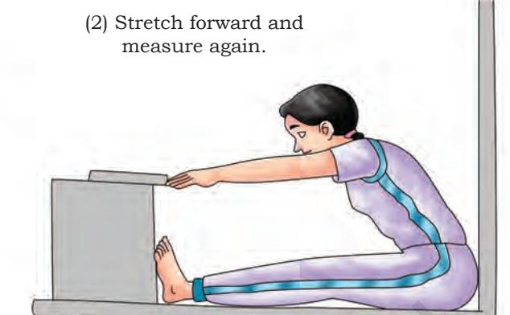
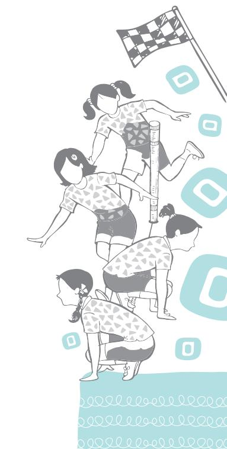

**9**

## **Activity 9.1**

Discuss with your classmates about the need of test, measurement and evaluation programme.

**Do You Know?** Measurement is a score generally known as data.

Everybody is interested in knowing about what, how and why the things and activities near their surroundings are happening. Because, our day-to-day life is largely associated with all these terms to know the status or level, attitude or skill, cause or effect of someone's effort. To know the answer of any query or assumption, we use test, measurement and evaluation.

### **What are Test, Measurement**

## **and Evaluation?**

Any idea or thought cannot take constructive shape without evaluation and it is based on measurement which cannot start without using an appropriate test. Basically test, measurement and evaluation are interrelated, interdependent and follow a continuous process.

#### **Test**

Test is a tool to obtain information to determine the specific characteristics or qualities of an individual regarding knowledge, physical abilities, skill abilities, etc. For example, unit test, annual examinations, physical fitness or body measurement (height, weight).

#### **Measurement**

Measurement can be quantitative, qualitative or both. It is a score or data in numerical/grading values, indicating the capacity or ability of an individual, which is obtained on the basis of applied test. Students score in their test and examination either on the field or in the classroom is called measurement.

Chap-9.indd 288 31-07-2020 15:44:38

#### **Evaluation**

It is the process of interpreting the collected data to measure and make the professional judgement of value or worth. After giving the test, everyone wants to know the feedback or effectiveness of the measures, which can be gathered through evaluation. Evaluation may be formative or summative evaluative process used three steps- process education, objectives, learning experiences and change of behaviour. These steps are performed in sequence.

Measurement and Evaluation programme is very useful for teachers, students and parents in the field of health and physical education, either to check academics as well as the level of fitness. TME process is useful for achievement, diagnosis, prescription, improvement, classification, grading, motivational purpose and also helpful for the prediction of performance.

## **Measurement and Evaluation of Selected Physical Fitness Components**

Here we will discuss about measurement and evaluation of the major components of physical fitness:

- (i) Muscular Strength: Push-ups, Abdominal Curls and Squat Thrust
- (ii) Muscular Endurance: 1000 meter run/walk test
- (iii) Flexibility: Sit and Reach Test
- (iv) Assessment of Body Mass Index (BMI)
- (v) The Waist-Hip Ratio or Waist-to-Hip Ratio (WHR)

#### **Muscular Strength**

As discussed in the previous chapter, muscular strength refers to the ability of the muscle or group of muscles of an individual to overcome or to act against the resistance. It largely depends upon a few things such as physiological factors like cross-section of the muscle, ratio of slow and fast twitch fibers in muscle, coordination between muscles (agonist and antagonist), ATP and CP store, which plays an important role in providing energy to the active muscle or group of muscles. The psychic factors or the present state of mind such as anger, aggression, motivation, emotional state, etc., have positive as well as negative correlation in muscular strength.

For measuring the strength of the muscle or group of muscles, we must have the knowledge of muscles and also of the particular exercise for particular muscle and supportive muscles. For example, while performing the pull ups,

#### **Activity 9.2**

Make a list of Physical Fitness Components and discuss it with classmates.

Chap-9.indd 289 31-07-2020 15:44:38

#### **Activity 9.3**

Discuss the types of tests to measure leg strength.

an individual lifts his body, the deltoid, latissimus dorsi, trapezius and biceps contract and produce power whereas the triceps stretch and play the supportive role.

Now if we want to measure the strength of upper limb (arms), then pull-ups can be one of the test items, but if we want to measure the strength of lower limbs (legs), then we have to think of other exercises.

Muscular strength can be measured with the help of one's own body weight or with the help of equipment such as dynamometer, tensiometer, weight plates and barbell, etc.

#### *Tests related to Muscular Strength*

There are different types of tests to measure muscular strength.

#### *Push-up*

The push-up or press up fitness test measures the upper limb muscular strength and muscular endurance.

There are many variations of the push-up test, such as different placement of the hands, how far to dip, the duration of the test and the method of counting the number of completed push-ups.

*Fig. 9.1: Good push-ups (above), bad push-ups (below)*

This helps in identifying and assessing muscular strength and endurance of the upper body.

Depending on which protocol is to be used, you may need a floor mat, metronome, beat drum, audio tape, clapping or stopwatch.

Chap-9.indd 290 31-07-2020 15:44:39

#### *Procedure*

A standard push-up begins with the hands and toes touching the floor, the upper body and legs should be in a straight line, feet slightly apart, the arms at shoulder width apart extended and at a right angle to the body. Push-ups can be started from a plank position. Align your body with your hands on the floor. Keeping the back and knees straight, lower the body to a predetermined point, to touch some other object, or until there is a 90 degree angle at the elbows, then return back to the starting position with the arms extended. This action is repeated, and the test continues until the exhaustion or until individual is unable to perform it in rhythm or have reached the target number of push-ups. Body should be in straight line from head to ankles.

As you are going down, elbows should come to 90 degrees. Hold this position and go up, hold the upward position.

#### *Scoring*

Maximum number of correct push-ups done by the participants at a specific given rate or time will be the score.

#### *Abdominal Curl*

Abdominal curl test helps to identify and assess muscular strength and endurance of abdominal muscles. For this test, floor mat and stopwatch are required.

#### *Procedure*

The individual has to lie in a supine position with flexed knees and elbows. Fingers of both the hands are clubbed with each other and are kept behind the head. Individual is asked to raise his or her upper body and then come back to his initial position repeatedly till the given set of time duration ends.

#### *Score*

Number of curl ups done by the participants at a specified rate or in specific time will be their score.

*Fig. 9.2: Abdominal curl test*

#### **Activity 9.4**

- **•** Perform and count the push-ups with your classmates and compare who can do more accurately.
- **•** Make a list of different type of tests to measure abdominal strength and endurance.

Chap-9.indd 291 31-07-2020 15:44:39

#### *Squat thrust*

This test enables an individual to identify and assess muscular strength and endurance of the lower body.

#### *Procedure*

For this test, follow the given steps—

- (a) Start from a standing position.
- (b) Go down achieving low squat position and place both palms on the floor.
- (c) Take both legs back quickly as shown in the figure and achieve plank position. Quickly come back to the original standing position.

#### *Score*

Maximum number of successive squat thrusts performed by an individual in 1 minute will be the score.

*Fig. 9.3: Steps of squat thrust*

#### **Muscular Endurance**

Muscular endurance is the ability of your muscles to perform muscular activity over a period of time or it is the duration upto which you can apply your muscular strength. Muscular endurance is related with the time and duration of the activity. Slow twitch fiber in muscles is responsible for the activities of muscular endurance. Sometimes, the term stamina is also used in place of endurance.

#### *Tests related to Muscular Endurance*

There are many tests to measure muscular endurance. 1000 metre run or walk test is the most common test, which is discussed below.

#### *1000 Metre Run or Walk Test*

Chap-9.indd 292 31-07-2020 15:44:40

Through this test, one can identify and assess cardiovascular endurance.

For this test, one needs running track and a stopwatch.

#### *Procedure*

Participants or students should start running from the starting line on the command of teacher. They have to cover the distance of 1000 metre in shortest possible time. Walking is also allowed.

#### *Scoring*

The score of this test will be given on the basis of recorded time to cover 1000 meters (in a minute and second).

*Fig. 9.4: 1000 metre run or walk test*

#### **Flexibility**

As discussed in the previous chapter, flexibility is the range of motion around the various joints. Flexibility is the ability of our joints and muscles to perform movements with greater range. Good flexibility helps to execute the movement with less muscle tension.

#### *Test related to flexibility*

**Sit and Reach Test:** Sit and reach test helps in the measurement of flexibility of the lower back muscles and hamstring muscle group. For this test, a sit and reach box, and mat are required.

#### *Procedure*

The person is asked to sit in a long sitting position placing both feet against the box with sole touching the box. The knees should be straight, legs should be grounded and palm facing downward on top of each other at same level above the box (Fig. 9.5).

The person is asked to bend forward sliding the hand on the scale without any jerky movement.

#### *Scoring*

Score is recorded in centimeters.

Chap-9.indd 293 31-07-2020 15:44:40

14 in (35 cm)

16 in (40 cm)

*Fig. 9.5: Sit and reach test*

10 in (25 cm)

*Fig. 9.6: Measurement of body weight*

#### **Activity 9.5**

If there is no Anthropometer or Stadiometer, how can you measure the height? Discuss it in class.

This assessment gives the information of an individual's level of obesity. BMI is calculated by dividing the weight of a person by the square of his/her height.

**Difference between measurements** Poor Fair Good Very Good Excellent

> 12 in (30 cm)

#### *Measurement of Body Weight*

It can be done with the help of a weighing machine.

#### *Procedure*

6 in (15 cm)

The individual is asked to stand on the weighing machine. The readings of the machine should be noted. While taking the weight, the individual should wear minimum garments. Reading of the weight should be noted down in Kilograms.

#### *Measurement of Height*

It can be done with the help of an Anthropometer or Stadiometer.

#### *Procedure*

The subject is asked to stand straight against the wall, with the back and head touching the wall, looking in forward direction. The measuring bar of anthropometric rod should be touched at the highest point of the subject's head (vertex point). The reading should be noted down in centimeters.

**BMI Formula Calculator:** Weight in Kg

(Height in meters)2

Chap-9.indd 294 31-07-2020 15:44:41

#### *BMI Calculation*

BMI is a simple mathematical calculation which helps us to find out if an individual is normal weighted, over weighted or obese. BMI is calculated by dividing the weight of an individual by the square of the height which is expressed in kg/metre². World Health Organization (WHO) has recommended norms for categorising an individual as normal weighted, under weighted or over weighted.

#### **Activity 9.6**

Check in which BMI category do you fall. For reference check the textbook of Class IX.

| Category | BMI (kg/m2) |  |
| --- | --- | --- |
|  | From | To |
| Very severely underweight | - | 15 |
| Severely underweight | 15 | 16 |
| Underweight | 16 | 18.5 |
| Normal (healthy weight) | 18.5 | 24 |
| Overweight | 25.0 | 29.9 |
| Obesity | 30 and above |  |

#### **Table 1: BMI Calculation**

BMI for children aged between 2 to 20 years is calculated in same way and with the same formula, but not judged on the basis of norms mentioned in the above table. Whatever the result comes after calculating the BMI is compared after preparing the percentile table of all the children falling under the same sex and age category.

Less then 5 percentile is under-weight, 5 to 85 percentile is normal, 85 to 95 percentile is over-weight and above 95 percentile is obese.

#### **Waist-to-hip ratio (WHR)**

The waist-to-hip ratio (WHR) helps us to find out the fat distribution by which we can help in evaluating the overall health of an individual. One who carries more weight around the middle than the hip may have higher risk of developing several health issues.

This is the ratio of the circumference of the waist and the circumference of the hip of an individual. This is calculated by dividing waist measurement with the hip measurement of an individual (W ÷ H). For example, if the measurement of the persons waist and hip is 76 cm and 97 cm respectively then his waist-hip ratio will be 0.78.

World Health Organisation (WHO) has recommended the given norms for WHR:

*Fig. 9.7: Measurement of body height*

Chap-9.indd 295 31-07-2020 15:44:41

| Men | Women | Health risk level |
| --- | --- | --- |
| .95 or less | .80 or less | Low risk |
| .96 to 1.0 | .81 to .85 | Moderate risk |
| 1.0 or higher | .85 or higher | High risk |

#### *Measurement procedure*

While taking the measurement of an individual's waist, he/ she should be asked to stand straight and breathe out. Then place the tape around the waist just above his or her belly button and take the measurement in centimetres. In the same manner, place the tape around the hip of an individual, where his or her hip is widest then take the measurement.

## **Somato Types (Endomorphy, Mesomorphy and Ectomorphy)**

In the 1940s, American Psychologist William Herbert Sheldon developed a theory that there are three body types, or somato types—Endomorph, Mesomorph and Ectomorph. The names were given after the three germ layers of embryonic development; the endoderm (develops into the digestive tract), the mesoderm (becomes muscle, heart and blood vessels), and the ectoderm (forms the skin and nervous system). Each somato type has its own distinct physical characteristics and supposedly distinet personality as well. The unique physical characteristics of each body type are still widely used as an important factor while designing workout routines for the individual.

Endomorph Mesomorph Ectomorph *Fig. 9.8: Three body types*

Chap-9.indd 296 31-07-2020 15:44:42

- 1. Endomorph: An endomorphic individual typically has short arms and legs and a large amount of mass on their frame. Their mass hampers their ability to compete in sports requiring high levels of agility or speed and perform sustained weight bearing aerobic activities such as running. Sports of pure strength, like power lifting, are perfect for an endomorph. They can gain weight easily and lose condition quickly if the training stops. Such individuals have:
	- (i) a pear shaped body
	- (ii) a rounded head
	- (iii) wide hips and shoulders
	- (iv) wider front to back rather than side to side
	- (v) a lot of fat on the body, upper arms and thighs
	- (vi) Such individuals are good for sports such as rugby where bulk is useful, provided it can be moved powerfully. They tend to have large lung capacity which can make them suited to sports such as rowing. They can increase muscle mass much more easily than ectomorphs.
- 2. Mesomorph: A mesomorphic individual excels in strength, agility, and speed related games/sports. Their medium structure and height, along with their tendency to gain muscle and strength easily makes them a strong candidate for a top athlete in any sport. They can sustain low body fat levels and find it easy to lose and gain weight. They have:
	- (i) a wedge shaped body
	- (ii) a cubical head
	- (iii) wide broad shoulders
	- (iv) muscled arms and legs
	- (v) narrow hips
	- (vi) narrow from front to back rather than side to side
	- (vii) minimum amount of fat
	- (viii) Such individuals have sport benefits. They can respond well to cardiovascular and resistance training and can sustain low body fat levels. All the muscle groups can be used by them to derive positive training adoption.
		- (ix) Depending on the sport's needs, they can easily gain or lose weight
- 3. Ectomorph: A predominantly ectomorphic individual is long, slender and thin, and therefore power and

Chap-9.indd 297 31-07-2020 15:44:42

strength sports are perhaps not suitable as they are more susceptible to injuries. While they can easily get lean and hard, their lack of musculature, severely limits their chances in sports requiring mass. Ectomorphs dominate endurance sports and gymnastics. They can archive low levels of body fat which can be detrimental to health and for females in endurance sports, it can result in a cessation of periods and iron deficiency. Such individuals have:

- (i) a high forehead
- (ii) receding chin
- (iii) narrow shoulders and hips
- (iv) a narrow chest and abdomen
- (v) thin arms and legs
- (vi) little muscle and fat

 One can conclude that every individual should try to find out by using these tests to see what types of activities should be done to remain healthy and fit.

Chap-9.indd 298 31-07-2020 15:44:42

## **Assessment**

#### **I. Long Answer Questions**

- 1. List and explain the tests related to muscular strength.
- 2. List and explain the tests related to muscular endurance.
- 3. Write down the procedure of Abdominal Curl-up test.
- 4. Explain the waist-hip ratio in detail.
- 5. Explain the three somato types in detail.

#### **II. Short Answer Questions**

- 1. What is test?
- 2. What is measurement?
- 3. What is evaluation?
- 4. What is flexibility?
- 5. Write down two characteristics of each somato type.

#### **III. Fill in the Blanks**

- 1. _____________ is calculated by dividing weight by the square of height.
- 2. _____________ is a tool.
- 3. Measurement can be ___________ or __________ both.
- 4. Two types of flexibility are ___________ flexibility and _________ flexibility.

#### **IV. State whether True or False**

- 1. BMI stands for body measurement index.
- 2. Flexibility is range of motion around the various joints.
- 3. Anthropometer or stadiometer is used for measuring weight.
- 4. The objective of squat thrust is to identify and assess muscular strength and endurance of the lower body.
- 5. The objective of abdominal curl-up test is to identify and assess the muscular strength and endurance of back muscles.
- 6. The objective of push-up test is to identify and assess muscular strength and endurance of the upper body.

Chap-9.indd 299 31-07-2020 15:44:42

