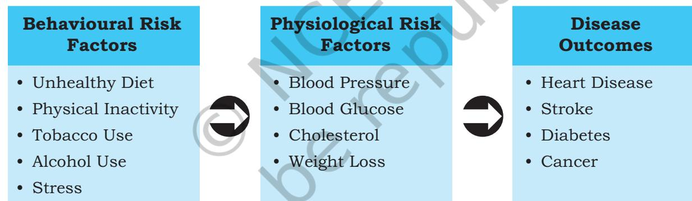
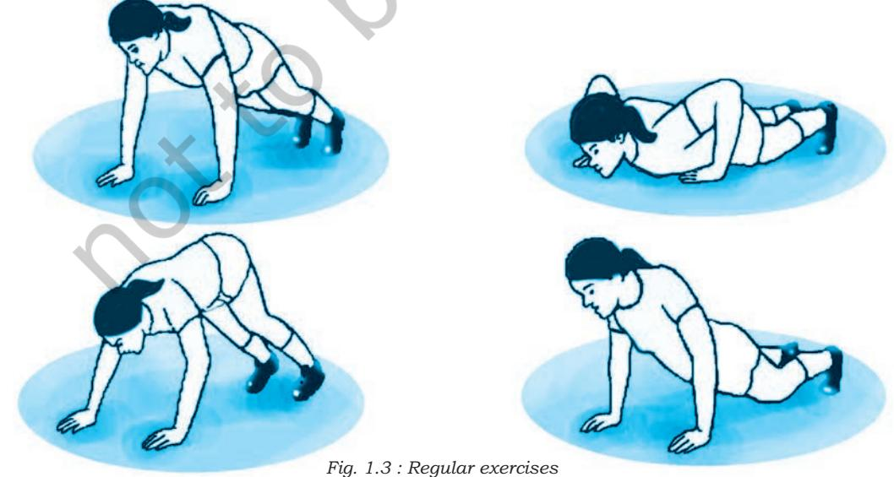
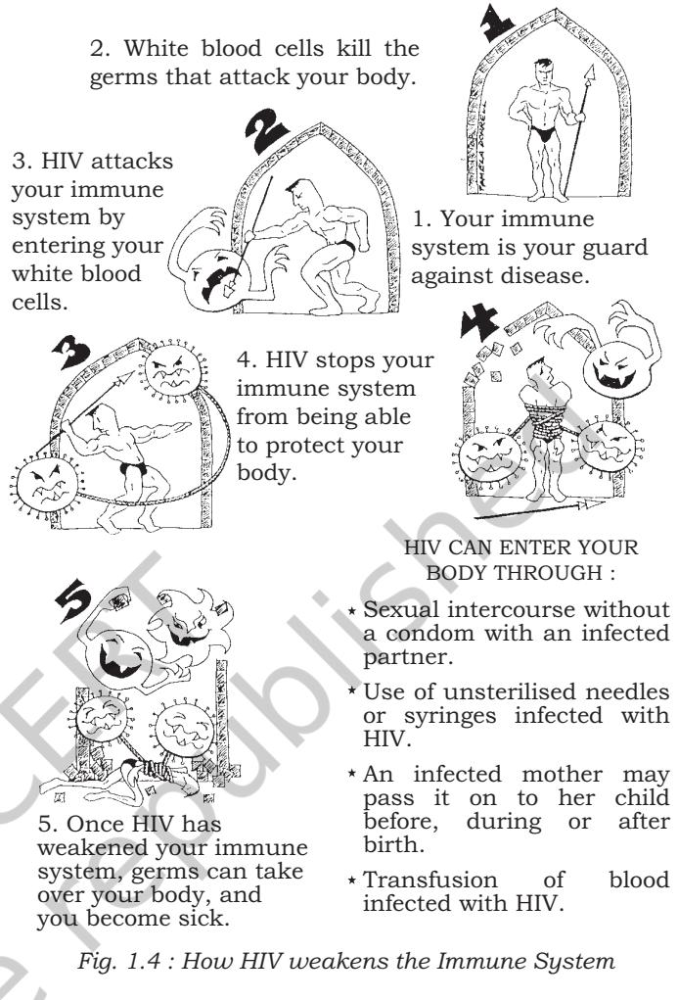

# **1.1 Introduction**

We normally relate the terms diseases and illness interchangeably in relation to health, even though these words do not mean the same. Health is the general condition of a person in respect to all aspects of life. It is also a level of functional and/or metabolic efficiency of an organism. The word metabolic is the adjective of the term metabolism which means the whole range of big chemical processes that occur within us or any living organism to produce energy and basic materials needed for important life processes. Diseases and illness adversely affect these processes. And thus health, diseases and illness are inter-related. However, health is not just being free from diseases, illness or injury. As defined by World Health Organisation (WHO), health is *"a state of complete physical, mental and social well-being and not merely an absence of disease or infirmity"*.

# **1.2 What is Illness?**

Let's now see how is illness different from that of disease? While illness and disease are at times used interchangeably, these in fact, are different from each other. Disease refers to a biomedically defined deviation from norms of body function or structure, whereas, illness is the experience of this deviation. It is a state of experience by the body when one or more of the control systems of the body are not functioning normally. Illness refers to a subjective distress feeling of a person, when one is sick or suffering from some disease. However, it is not appropriate to conclude that any one being merely free from illness or disease is healthy.

You might have seen people suffering from various types of diseases. Some of the diseases, like high blood pressure affect only a particular person who is suffering from it. On the other hand, some diseases like common cold, spread rapidly and affect a number of people in a very short period. You must have often wondered as to how does this happen. In one of the chapters of your textbook on Science, you would have studied about 'Why We Fall Ill'. In that chapter, it is mentioned how diseases are caused and how some of these affect only the persons who suffer from them are called non-communicable, whereas, there are those diseases that are transmitted from one person to another are known as communicable. The chapter also mentions how communicable and non-communicable diseases can be prevented and controlled.

# **1.3 Communicable Diseases**

Let us understand how communicable diseases are spread. These diseases are caused by certain infectious agents which may be bacteria or viruses. These are capable of being transmitted from person to person or from the environment to person.

#### **1.3.1 Classification**

Communicable diseases can be classified on the basis of the causative organisms. These are as follow:

- • Bacterial: Typhoid, Cholera, Tuberculosis
- • Viral: Common cold, Influenza, HIV infection, Dengue
- • Protozoal: Malaria, Kala azar
- • Fungal: Fungal infections of nails, groins, skin, hair
- • Parasitic: Infestations of intestinal worms, like round worm, or lice.

**Modes of transmission:** The modes of transmission can be classified as direct and indirect transmission.

## *(a) Direct transmission*

As we have studied in our earlier classes, direct transmission of diseases takes place as follows:

**Direct contact or touching:** When we touch a person or come in direct contact with the skin or mucous membrane of the diseased person, it transmits infections like skin and eye infection.

**Droplet infection:** Spray of droplets of saliva or secretion of a diseased person spreads common cold, tuberculosis, meningitis.

**Contact with soil:** Can cause acquiring the disease agent directly and may spread diseases like: hookworm infestation and tetanus.

**Inoculation into skin or mucosa:** Certain diseases spread in other ways. For example, Rabies is spread to humans from animal. It is generally known that it occurs due to a dog or a monkey bite. Hepatitis occurs owing to virus, transmitted through contaminated needles. The HIV (Human Immunodeficiency Virus) can be transmitted by sexual contact or through transmission of infected blood from an infected person. HIV can be transmitted by the HIV infected mother to baby and can cause AIDS (Acquired Immune Deficiency Syndrome).

# **Activity 1.1**

Discuss with your classmates, why we should not go to public places when suffering from cold, cough or fever?

Chapter-1 Health & diseases.indd 2 08-11-2016 11:04:47 AM

#### *(b) Indirect transmission*

Communicable diseases are also transmitted indirectly in the following ways that are popularly known as '5Fs'— flies, fingers, fomites (material capable of carrying infections, like towels, handkarchiefs etc.), food and fluid.

Some diseases are spread through water, food, ice, blood and body tissues and organs. For example, typhoid, diarrhoea, polio, intestinal parasites and infective hepatitis. Flies contaminate food and other eatables.

A living carrier (also known as a vector) is a disease agent that lives on or inside the body of the carrier causing diseases like malaria and plague. Airborne infectious materials transmitted through droplet infection or dust cause diseases like respiratory infections and itch mites. Fomites are objects like towels, handkerchiefs, toys, glass, spoons, etc. which we use daily. Eye and skin infections and dysentery (diarrhoea with blood) are spread through these fomites. Our unclean hands and fingers act as disease causing agents and transfer infection to food through skin, nose, and causes diseases, such as intestinal parasites, dysentery, typhoid.

Healthy people can also spread disease if they are "carriers". These are the people who themselves may be immune to the organisms they harbour, but can be a source of transmission to others as happens in the case of typhoid.

#### **1.3.2 Prevention and Control of Communicable Diseases**

The following measures help in prevention and control the spread of communicable diseases:

## *Personal hygiene*

- • Bathing everyday and clean clothes keep our body free from harmful microbes.
- • Cutting nails and washing hair regularly.
- • Brushing teeth twice a day (morning and night) particularly after meals.
- • Ensuring that your ears are clean.
- • Do not share articles that are of personal use, that is, towels, soaps, tooth brushes, combs, razors and other toiletries.
- • Wash hands before touching food or water and before eating or drinking.
- • Wash hands with soap and water before touching your face, eyes and mouth and also before and after using the toilet.
- • Many microbes like virus, bacteria and fungi are transmitted by touching surfaces with hands and

# **Activity 1.2**

- • List how many things you follow for food and water hygiene
- • Discuss the list with your friend.
- • What would you like to do to improve your personal hygiene.

Chapter-1 Health & diseases.indd 3 08-11-2016 11:04:47 AM

become potential carriers. Hence by washing hands, we can prevent diseases like diarrhoea, flu, skin and eye infections.

# **Activity 1.3**

Have a round of your school. Find out the environmetnal sanitation.

Discuss with your classmates. If it is not good what will you do? Prepare a plan and implement.

# **Activity 1.4**

Prepare an Immunisation chart. Put it in your classroom. Discuss with your classmates whether everyone has been vaccinated? If not, request them to consult a nearby health centre.

• Drink potable water. If it does not appear clean, boil or filter and then consume it.

- • Eat only freshly prepared food or consume it within four hours of preparation.
- • Do not purchase and consume fruits and vegetables which have been cut and kept in the open for a long time.
- • Keep all food articles covered to prevent contamination by flies.

#### *Environmental sanitation*

*Food and water hygiene*

- • Use sanitary latrines; avoid open air defecation.
- • Throw waste in dustbins to avoid breeding of flies.
- • Clean the drains regularly.
- • Regularly check the places where water is collected and has the possibilities of mosquito breeding. Spray insecticide to prevent breeding of mosquitoes.
- • Try to prevent contamination of drinking water (source of water should be away from source of garbage collection/ waste disposal site). The container of drinking water must be kept at a clean and safe place.

#### *Vaccines*

Vaccines boost immunity and thus helps the body fight diseases. A large number of infectious diseases can be prevented by taking vaccines at an appropriate time, such as, diphtheria, pertussis, polio, tetanus, rabies, measles, chickenpox, typhoid, etc.

## *Treatment of diseases using medicines*

Medicines kill microbes and /or slow their growth. These are classified as anti-virals, anti-fungals, anti-protozoals and antibiotics according to the group of microbes they act upon. However, these medicines should be taken in the recommended dose and duration as advised by the doctor. One should avoid self-medication.

## *Isolation of patients with communicable diseases*

Patients suffering from such diseases that are communicable should be kept in a clean environment isolated from others.

#### *Education and awareness*

It is important to make people aware about communicable diseases, their causes and modes of spread. People should

Chapter-1 Health & diseases.indd 4 08-11-2016 11:04:47 AM

also be made aware of their responsibilities towards control of communicable diseases, e.g. ensuring use of safe water, healthy food and proper management of garbage and waste disposal.

# **1.4 Non–communicable Diseases**

The non–communicable diseases may occur due to genetic and lifestyle factors. When these are caused by an unhealthy lifestyle, these diseases are also called lifestyle diseases. Risk factors of non–communicable diseases include lack of physical exercises, poor dietary habits, inadequate sleep, stress and habits like smoking, taking alcohol and tobacco chewing.

An arbitrary classification of non–communicable diseases can be:

*Lifestyle diseases*, such as diabetes, hypertension, heart diseases, stroke and cancer.

*Mental health* diseases like depression; and trauma.

Given below are the behavioural risk factors which can give way to manifestation of the physiological risk factors and ultimately lead to the diseases.

## **1.4.1 High Blood Pressure or Hypertension**

# **Box 1.1**

- • If one is obese one has a high chance of getting diabetes and hypertension.
- • Hypertension increases risk of getting heart attacks and strokes.
- • Diabetes mellitus affects all parts of the body like brain, eyes, heart, kidneys, blood vessels, muscles and nerves if precaution is not taken.

*Source: National Programme for Prevention and Control of Cancer, Diabetes Cardiovascular Diseases and Stroke, A Guide for Health Workers, Ministry of Health and Family Welfare, GOI, New Delhi. For details on BMI, refer to chapter IV Activity 4.2*

*Fig. 1.1 : Risk Factors*

# *Dietary factors*

All packaged and canned food items contain a very high level of sodium because of the presence of salt that is used as a preservative. If you are in the habit of adding table salt to your food you are consuming excess salt. Use of excess salt is linked with hypertension. Hence, consumption of excessive salt in daily food, packaged and canned foods need to be avoided.

# *Sedentary lifestyle and lack of exercise*

You can put on excess weight, if you do not exercise daily. This excess weight and lack of exercise can lead to hypertension.

Chapter-1 Health & diseases.indd 5 08-11-2016 11:04:47 AM

In addition to taking the prescribed medication, doing regular exercises and taking high fibre diet can help one to control hypertension.

# **Activity 1.5**

- • Interact with your group and note the causes that lead to hypertension on a chart.
- • Make a list of processed foods that contain of high level of sodium by reading the label.

*Mental stress and chronic anxiety* 

People who cannot manage stress and constantly worry about things, are prone to hypertension. Hence, one needs to learn to cope with stress in a healthy way by doing meditation and yoga and diverting attention by observing healthy mental habits like listening to music, reading, writing poems, pursuing a hobby, etc.

# *Tobacco use*

Intake of nicotine either through smoking or chewing tobacco may lead to hypertension and should be avoided. Consistent use of tobacco, *gutkha*, *khaini*, etc. has been linked to various types of cancer. The consumption of tabacco, therefore, must be avoided.

# *Endocrine Diseases*

Diabetes mellitus is one of the endocrine diseases. It is caused due to inadequate secretion of the hormone insulin from pancreas. Insulin regulates the level of sugar in our body. Lack of insulin causes increase of sugar in our body leading to the condition called diabetes mellitus. Common symptoms of this are increase in hunger, frequency of urination, and growing thirst.

Until recently, most children and adolescents with diabetes were thought to have Type 1 (insulin dependent) diabetes. However, Type 2 diabetes mellitus (DM Type 2) among children is now being increasingly reported from several parts of the world. Adolescents who are obese are more likely to get Type 2 diabetes which is manifested as high blood sugar. If untreated, it leads to complications in kidneys, eyes and other organs systems in the body. Diabetes can be managed primarily by bringing about changes in lifestyle and physical exercises and medication.

# *Hereditary Disorders*

Genetic disorders such as hemophilia, thallasemia, muscular dystrophy are hereditary diseases which run through generations in a family. Constant care and support may help the concerned individual manage these disorders.

# **1.4.2 Prevention and Cure**

In India, non–communicable diseases cause major health problems. These diseases cause disability, loss of income, disruptions in family environment and poor quality of life in the most productive years. We are going to have the highest incidence of diabetes in the world by 2020. You may have heard

Chapter-1 Health & diseases.indd 6 08-11-2016 11:04:47 AM

about young people having heart attacks and requiring bypass surgery. We need medical help for treatment. However, efforts should be made to prevent them. We can prevent these, if we adopt a healthy lifestyle right from childhood and continue it throughout life. Non–communicable diseases can be prevented in the following ways:

#### *Healthy diet*

Eating a balanced diet helps in the prevention of obesity and other lifestyle diseases. The balanced diet includes fruits and vegetables, preferably locally available and seasonal, wholegrain products (including pulses), milk and milk products.

#### *Adequate sleep*

We all require daily 6–8 hours of sound sleep. Inadequate sleep leads to changes in blood pressure, increase in stress level and disturbance of what is called the biological clock.

#### *Regular exercise*

People who undertake physical exercise and yoga activites daily keep themselves physically fit, feel happy and do not put on excess weight.

One must do 20–30 minutes of physical activity daily to keep fit. This can be done by taking part in sports. Exercising or spot jogging can be done at home. Simple walking, climbing stairs, not using the lift and skipping have the same effect. Gym is another dedicated place for workouts.

*Fig. 1.2 : Healthy Diet*

Chapter-1 Health & diseases.indd 7 08-11-2016 11:04:48 AM

# **Activity 1.6**

- • Recall the physical activities done by you in the last week and prepare a brief note on the following.
	- ± Do you play any game regularly?
	- ± If yes, for how long?
	- ± How often does your school organise physical activities/Yoga during the week?

# **Box 1.2**

#### **Do You Know?**

- • There should be no tobacco shop within 100 yards of an educational Institution.
- • Sale and purchase of tobacco related items like *cigarette*, *gutakha* by minors and to any one (below the age of 18) is prohibited.

# **Activity 1.7**

Is there a shop which sells tobacco products near your school? Have you observed any student purchasing *pan masala*, *gutkha*, *khaini* or *cigarettes*? Discuss with your teacher what steps can be taken to address this issue.

#### *Mental relaxation*

If a person is not able to handle stress, he/she experiences anxiety and depression. This weakens the immune system and one falls sick very often. One can also experience psychosomatic symptoms like headache, bodyache, stomachache, fatigue, inability to concentrate and loss of interest in all activities. Meditation, relaxation, exercises and other yoga actvities help reduce stress. You can also engage in hobbies like drawing, painting, listening to music and so on as relaxation techniques when under any type of stress. All these have positive impact that reduce anxiety and depression and prevent diabetes, hypertension and heart attacks in the long run.

# *Avoiding the use of tobacco, alcohol and drugs*

Use of tobacco, both by way of smoking and consuming chewable tobacco in any form directly contributes to heart disease, stroke, chronic lung disease and common cancers. Even the non–smokers inhale the smoke released by smokers around them. Therefore, prohibition of smoking in public places is an example of a public health regulation that decreases the risk for non–smokers. You should *request the smokers not to smoke in public places*. You may avoid company of smokers.

Alcohol use contributes to chronic liver disease, depression and injuries, especially motor vehicular injuries. Both alcohol and drugs can have long term effects not only on the physical health but also on the mental health.

Excess stimulants like caffeine in tea, coffee and cola drinks also have a harmful effect on our body as they cause rapid increase in heart-beat rate, lack of sleep and elevated blood pressure. These may also cause acidity and stomach ulcers.

Addictive drugs impair social and occupational functioning and are associated with impaired mental health.

## *Antioxidants*

Antioxidants help in prevention of the damage, repair of cellular functions and delay in the ageing process. Fresh vegetables, fruits and dry fruits are rich sources of antioxidants.

Use of Ayurvedic, Homeopathy and Unani medicine also help in the cures of Non-communicable Diseases.

Ayurveda is the science of life and health, developed in India since ages. It lays emphasis on prevention and promotion of health in addition to curing the diseases. The treatment under Ayurveda can be successfully used in early stages of diabetes, liver-disorders, skin diseases, stress, insomnia (sleeplessness) and anorectal-diseases. Some specialised Ayurvedic treatments can be helpful in diseases like joint-pains, neuromuscular diseases and paralysis.

Chapter-1 Health & diseases.indd 8 08-11-2016 11:04:48 AM

Both Homeopathy and Unani systems of medicine are also used in the treatment of non–communicable diseases.

Homeopathy is that system of medicine which is based on the nature's law of cure. It is a safe and effective method of treatment. It helps in increasing the immunity of the body and offers in many cases a long lasting cure.

Unani system of medicine is also the natural way of treatment with the help of herbal medicines. According to this system, the health of a person depends on the balance of four elements in the body. These are *Dam* (blood), *Balgham*  (phlegm), *Safra* (yellow bile), and *Sanda* (black bile). The Unani medicines are given to the person suffering from a disease to promote an equilibrium of these elements in the body.

# **1.5 Reproductive Health**

You have read in your previous classes that cell is the structural and functional unit of our body. To perform various specialised functions, nature has divided our body into many functional units or systems comprising different organs. One such system is the 'reproductive system'. It is made up of reproductive and genital organs. You will study more about the structure and functions of the reproductive system in your science classes. In this chapter you will learn about the need to keep it healthy. In fact, reproductive health refers to healthy reproductive organs performing normal functions. But there are diseases that adversely affect this system. These are as follows:

# **1.5.1 Reproductive Tract Infections (RTIs) and Sexually Transmitted Infections (STIs)**

Reproductive Tract Infections (RTIs) and Sexually Transmitted Infections (STIs) are non-communicable diseases which affect the quality of life and have important bearing on the reproductive functions. RTIs are infections involving reproductive organs. These can be caused by various microbes like bacteria, viruses or protozoa. Improper maintenance of hygiene of the genital organs or through infected instruments used in medical procedures for treating genital organs also result in reproductive tract infections.

STIs are infections which are transmitted through close physical and sexual contact between individuals. However, STIs like infections through Human Immunodeficiency Virus (HIV) and hepatitis B and C can also spread by non-sexual modes like sharing of needles, transfusion of infected blood and using infected equipment for surgery.

# **Box 1.3**

#### **Do You Know?**

- • One should not administer self medication.
- • We must always consult the doctor before taking any medication.

Chapter-1 Health & diseases.indd 9 08-11-2016 11:04:48 AM

*Signs and symptoms of RTIs and STIs* 

- • Itching or burning sensation in the genital organs
- • Foul smelling discharge from vagina or penis
- • Blisters, sores or swelling on or near genitals, anus or its mouth
- • Pain, burning sensation and increased frequency of urine.

There may be one or more of the above symptoms.

#### *Prevention and control of RTIs and STIs*

RTIs and STIs not only lead to poor quality of life. These can also lead to complications.

Proper genital hygiene should be maintained to prevent RTIs. In girls and women, during menstruation there are more chances of getting infection because of the flow of blood. Hence, adequate precautions with regard to hygiene need to be followed: one should have daily bath and clean the genital area with soap and water and stay away from casual sexual relationships and have responsible sexual behaviour. If sexual relation can not be avoided, a condom must be used.

In case of problem, treatment from a qualified doctor should be taken and one should avoid going to quacks for treatment. One should not feel shy to discuss the problem with the doctor. Complete and proper treatment of both the partners is necessary in the case of RTIs and STIs.

# *Menstrual Hygiene*

The following steps must be taken by women and girls for maintaining menstrual hygiene:

- • use clean home made or disposable pads/napkins during menstruation;
- • change the sanitary pads at frequent intervals, at least twice a day;
- • if home made cloth napkins are reused, they should be washed daily with soap and water and dried in a sunny and dry place to prevent infection.

# **1.6 HIV and AIDS**

HIV stands for 'Human Immunodeficiency Virus'. It is a virus which is found only in human beings and affects the immune system in humans. When the HIV remains in the body for a long time, it destroys the immune system.

Many diseases like tuberculosis, fungal infections and cancer begin affecting the body and the person is said to be having AIDS (Acquired Immune Deficiency Syndrome). However any person suffering from T.B., cancer or fungal infection should not be considered suffering from HIV and AIDS.

Chapter-1 Health & diseases.indd 10 08-11-2016 11:04:48 AM

Acquired means it is not genetically inherited. Immune deficiency means that the defence mechanism of the body, the immune system becomes weak, and Syndrome means that when the individual has AIDS, it is not just the signs and symptoms of one disease, but a group of diseases, that appear in him/her.

When a person is said to be HIV positive, it simply means that HIV is present in his/her body. The interval between acquiring HIV infection and AIDS may be up to 10–15 years. It depends upon many factors like the status of the immune system at the time of entry of HIV in the body, regular treatment of illnesses, good diet and healthy lifestyle that the individual has.

# **1.6.1 HIV Transmission**

HIV is transmitted through:

- (a) having unsafe sexual contact with an HIV infected person. This is the most common route of transmission;
- (b) HIV infected mother to her new born child;
- (c) Transfusion of HIV infected blood; and
- (d) Sharing of needles and syringes with a person infected with HIV. This is most common in people who are habituated to intravenous drug use.

HIV does not spread through air, water or food. Transmission of HIV also does not occur through mosquito or animal bites because the virus does not survive or reproduce outside the human body. When the mosquito bites, it sucks blood from human body and does not inject into it. Therefore, even if a mosquito bites a person immediately after biting an HIV infected person, it does not inject the infected blood into his/ her body.

Because of these myths and misconceptions, a lot of HIV infected persons, especially women, are abandoned and rejected by their respective families and are discriminated by the society.

# **Box 1.4**

The first case of AIDS was reported in 1981. Since then it has killed more than 25 million people. India is having the second largest number of HIV infected persons and around half of all the new cases are occurring in young people. Prevention is the best strategy to protect oneself from HIV and AIDS.

Chapter-1 Health & diseases.indd 11 08-11-2016 11:04:49 AM

# **Activity 1.8**

Prepare a list of myths and misconceptions regarding HIV and AIDS and discuss with other students.

These myths and misconceptions have no scientific basis and need to be removed by discussing these with the people and spreading awareness about HIV and AIDS. This will prevent discrimination against HIV positive people and help them live longer.

# **1.6.2 Detection of HIV and AIDS**

HIV infection can only be diagnosed by a specific blood test done at the Integrated Counselling and Testing Centres in

# **Activity 1.9**

# **Read the following two case studies and discuss with your classmates the questions given at the end of each case study.**

# **Situation 1**

Mahesh and Ratan, both 15 years old, have been friends with a group of boys in their neighbourhood for the last five years. Their friends pressurise them into taking drugs including drugs through injection. Both refuse but when their friends begin to make fun of them, Mahesh, out of peer pressure and fear, experiments with injectable drugs. He does not want to be the odd one in his group. He uses the same needle that the other boys use. Soon, he is addicted to injectable drugs. Ratan, on the other hand, decides to leave the company of the friends. He even advises and pesters them to go to the doctor for help in giving up drug abuse.

- 1. What was the role of Mahesh's so-called friends in influencing his decision?
- 2. Could Mahesh have behaved differently? If yes, explain what could he have done?
- Do you know any drug de-addiction centre near your locality?

Take the help of your teacher and make a list of de-addiction centres. Put these on the Notice Board of your school. Enact this case study. Think what would have you done, if you were Ratan?

# **Situation 2**

A daughter of a very senior company personnel was expelled from the school because her parents were detected HIV positive. The school Principal felt that the parents did not observe moral behaviour which led them to be HIV positive. The administration believed that the incident would have a negative impact on the school environment and therefore, their child should not be allowed to study in the school. However, as per the medical reports of the mother, blood transfusion during an operation was the cause of acquisition of HIV by the mother.

- 1. Is the action taken by the Principal of the school justified?
	- • Have a discussion in the class with your classmates regarding possible ways of acquiring HIV and AIDS.
	- • In this case, what would you like to do, so that the girl should continue to study in the school.
- 2. Even if the HIV infection would have taken place otherwise and even the daughter would have been HIV positive, was the action justified?

Chapter-1 Health & diseases.indd 12 08-11-2016 11:04:49 AM

government run hospitals. These centres maintain complete privacy and confidentiality. The test detects antibodies produced in the body against HIV. As the HIV antibodies appear only after six weeks to six months after acquisition of infection, the test will be negative if it is done during this period. This period of time is referred to as the "window period". Thus, one should wait for the window period to be over to get the test done.

Although there is no definite one set of symptoms of AIDS, when an HIV positive person develops AIDS, he/she has one or more of the following symptoms like weight loss greater than 10 per cent of body weight, fever and/or diarrhoea for a period longer than one month and persistent severe fatigue. However, one should also understand that these signs and symptoms can be of any other disease. Once a person is diagnosed with HIV infection, he/she needs to be treated urgently in a well equipped hospital.

#### **1.6.3 Risk Factors for Acquiring HIV**

The activities which are of high risk for acquiring HIV infection are:

- (a) having unprotected sex (i.e. without using condom) even if one know the person well.
- (b) having many sexual partners.
- (c) sharing syringes or needles while injecting drugs.
- (d) blood transfusion with blood that is not certified as HIV free.
- (e) ear piercing, acupuncture, etc. The instruments used for these procedures must be sterilised before use.

# **1.6.4 Responsible Sexual Behaviour to Prevent HIV and AIDS**

While sexual route is the most common in transmitting HIV as stated earlier, it is very alarming to note that more than 50 per cent new cases are occurring in India among the adolescents and youth. During the process of growing up, important physical, physiological, psychological and social developments take place among adolescents. They are attracted towards opposite sex or same sex, do experiments and are curious about many such feelings. They act under peer pressure very often, which sometimes is the driving force behind unsafe experiments like drug abuse or unsafe sex.

We must always remember that along with rights we also have certain responsibilities. Irresponsible sexual behaviour causes harm to self and others. A knowledge–based choice and decision towards sexual behaviour can prevent many future complications including emotional turmoil, unwanted

Chapter-1 Health & diseases.indd 13 08-11-2016 11:04:49 AM

pregnancy and diseases like STIs, HIV and AIDS. Thus, adopting a responsible sexual behaviour go a long way in protecting oneself from the menace of HIV and facilitate to live a healthy, happy and a productive life. It is equally important to avoid drug abuse specially through needle–sharing.

# **Assessment**

#### **Answer the following questions**

- 1. How can we prevent indirect transmission of communicable diseases?
- 2. What steps are required at the individual and society level to prevent communicable diseases?
- 3. List major risk factors for non-communicable diseases.
	- (a) ............................................................................... (b) ...............................................................................
	- (c) ...............................................................................
	- (d) ............................................................................... (e) ...............................................................................
- 4. Why are young people suffering from heart diseases now-a-days? Give reasons. Can you suggest some ways to prevent these?
- 5. The obesity among children and adolescents is becoming a major cause of concern for the parents and health personnel. What can be done to prevent overweight and obesity?
- 6. Why are adolescents more vulnerable to HIV infection? Give reasons.
- 7. List some ways in which you can manage your anxiety and stress.
- 8. Why do you need to make exercises an integral part of your life style? How can you do it?

Chapter-1 Health & diseases.indd 14 08-11-2016 11:04:49 AM

- 9. Prepare a table as shown below showing communicable diseases, ways of it is transmission and its prevention and control.

| Sr. | Name of the | Ways of | Prevention |
| --- | --- | --- | --- |
| No. | Communicable | transmission | and Control |
|  | Disease |  |  |

- 10. Prepare two slogans each for generating awareness about prevention of HIV among your peer group and community.
Chapter-1 Health & diseases.indd 15 08-11-2016 11:04:49 AM

