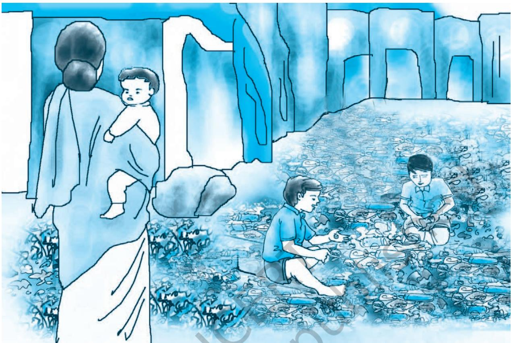

## **10.1 Introduction**

We all observe how waste is generated in our homes and neighbourhood and how it is disposed of. The disposal of waste has been done in a haphazard manner since ages, be it in villages, towns or cities. But today waste generation and disposal has become a matter of concern owing to the enormous increase in population, the changes in our lifestyles and consumption patterns, huge expansion of industries, transport, communication and commercial infrastructures and unrestrained use of modern technology. In fact, waste management has emerged as a serious challenge having major implications not only for human health and social life but also for the environment.

It is in this context that this chapter deals with different dimensions of waste management. The focus in this chapter, is on solid waste disposal.

## **10.2 Solid Waste**

What do we mean by solid waste? Almost everything that we use degenerates and loses its utility over a period of time. Many things become unusable after we use them only once. We then throw them away. Everything that we discard after it loses its usability is known as solid waste or garbage. There are different sources from where solid waste or garbage is generated everyday from individual households (domestic waste), and from industries and commercial establishments. However, all such wastes are not uniform in nature. Broadly speaking, solid wastes can be divided into two distinct categories **biodegradable**  and **non-biodegradable** waste.

## **Activity 10.1**

Bring some waste materials from home. This can be kitchen waste (for example, vegetable peels, used tea leaves, some food leftovers) and discarded articles of use, such as empty jars of plastic or/and glass, used paper, torn cloth etc.

- • Bury those items in the school garden, or in a bucket or flower pot, and cover them with sufficient soil.
- • Leave the items buried for about three weeks after which take those items out for review.
- • You will find that certain materials have changed their form, i.e. they have decayed, decomposed or are in the process of decomposition. On the other hand, some other materials are almost in the same form.
- • Those materials that have decayed or decomposed are biodegradable materials, whereas, those in which there was no change are non-biodegradable materials.
- • Think about the reasons of this variation and write.

## **Box 10.1**

In your history textbook you must have studied how archaeologists record the lives of ancient societies through the material remains left behind by them. These materials give us a glimpse of how people lived, what they ate and other aspects of their lives. Why do you think these materials have still retained their form?

## **Box 10.2**

As a reference, you can look into the Science textbook (Class VII), for the decomposition period of both biodegradable and non-biodegradable materials.

#### **10.2.1 Biodegradable and Non-biodegradable Waste**

Let us understand how biodegradable wastes are different from non-biodegradable wastes by conducting the following activity.

We define biodegradable materials as those substances made of organic matter, such as plant and animal matter, that can be easily broken down by nature. For example, vegetable peels and other kitchen waste, vegetables, fruits, tea leaves, paper, wood, etc.

Non-biodegradable materials are those materials, which cannot be broken down easily, and retain their form for a long period of time. For example, metals, tin, glass, plastics etc.

## **10.3 Solid Waste Disposal**

The garbage that we generate every day has not only increased in volume phenomenally, but has also changed its composition due to changes in our lifestyles and consumption patterns. For instance, there is now an increasing use of non-biodegradable materials such as plastics, metals and glass, specifically in urban areas.

Technological advancement has further brought in an increasing use of electronic items and gadgets. These are useful for us, but when discarded (known as E-Waste) they can be harmful to the environment and human health, particularly for the workers associated with this occupation.

In addition, we seem to have lost our aesthetic and civic sense, and carelessly litter garbage around on the roads, in the market-place, in open drains, ponds, rivers, seas, and so on. In fact, we keep throwing a lot of garbage everyday. Have you ever thought what will happen if the garbage is not removed from our homes and surroundings? Where does this garbage ultimately go and what is done with it? If proper measures for disposal and sanitation are not followed, how will garbage affect our environment and health?

#### **10.3.1 Consequences of Solid Waste Disposal**

In the cities and towns, collection of garbage is the responsibility of the respective municipalities. The garbage then goes through a process of segregation, treatment and final disposal in the landfills. This process of segregation in our country is still done manually by rag pickers. (See Fig. 10.1). In this process, materials that can be recycled are separated, while toxic wastes are sorted out and kept separately. This process of segregation ensures that the amount of solid waste, which is ultimately disposed of in the landfills, is reduced substantially.

Chapter-10 Waste Managementindd.indd 152 08-11-2016 11:44:57 AM

*Fig. 10.1 : A rag picker segregating materials from garbage dump*

However, with the enormous volume of waste that is being generated now-a-days, the concerned authorities are finding it difficult to deal with this problem. Most often we find that all sorts of solid wastes are dumped together in the landfills, which in many places, have already overreached its accumulation level. Moreover, groundwater in the immediate vicinity of such landfill sites is prone to contamination through continuous contact with the deposited waste. (Details of the structure of landfills have already been given in the Science textbook of Class VI).

In most of the rural areas, people have to deal with the disposal of household wastes themselves. A common method is the burning of solid wastes. This may be a convenient method, but is not conducive either to the environment or to our health, as it causes air pollution. Many of the villages do practise composting which is the desirable method.

#### **10.3.2 Effects of Undisposed or Unattended Garbage**

Open and unattended garbage is a common sight in the market, streets or in the vicinity of our homes. Most often, it

Chapter-10 Waste Managementindd.indd 153 08-11-2016 11:44:57 AM

*Fig. 10.2 : Discarded plastic bottles in an open drain*

emits such a foul smell that we have to cover our noses with a cloth. Have you ever stopped to think how unattended garbage can affect our health and our environment? If you observe carefully, you will notice that when garbage is allowed to collect in the open for a long time, it attracts flies, cockroaches and other insects. It also attracts rats and stray dogs. In fact, moist or fermenting garbage, particularly when organic waste such as kitchen waste is thrown, becomes a perfect breeding place for flies. When we eat the food, which has been contaminated by these flies, we are likely to fall ill. Water and food borne diseases such as dysentery, cholera and gastroenteritis are some of the diseases that can be transmitted by flies. Moreover, since accumulated garbage emits foul smell, it also causes air pollution.

| Toxic Waste | E-Waste | Hospital Waste or |
| --- | --- | --- |
|  |  | Soiled Waste |
| Toxic waste | E-waste consists of | Consists of various |
| causes | dismantled parts of | components |
| serious | computers, electronic | containing infected |
| problem to | appliances, mobile | human tissues or |
| our health | phones, TV, floppy | body fluids and are |
| and to the | discs, pen drives. In | called bio-hazardous. |
| environment. | India E-wastes are | The needles, surgical |
| Examples: | dumped into unsafe | knives, and other |
| dried paint, | and unauthorised | surgical instruments |
| old bulbs, old | dumping yards | called 'sharps' have |
| batteries. | where they are | to be disposed of |
|  | dismantled manually | carefully, but many a |
|  | and unscientifically, | time we find this does |
|  | causing great | not happen. Being |
|  | environmental and | pricked with infected |
|  | health risks as they | needles can transmit |
|  | contain dangerous | diseases like HIV, |
|  | contaminants. | Hepatitis B and C. |

**Table 10.1 Types of waste**

Indiscriminate use and disposal of plastic can clog the drains (Fig 10.2). Moreover, during the rainy season, the waste may flow along with the rainwater to nearby rivers and other

Chapter-10 Waste Managementindd.indd 154 08-11-2016 11:44:58 AM

## **Activity 10.2**

You may collect information on the following points.

- • What method of garbage disposal is practised in your community?
- • Who collects the garbage from your home?
- • Do you ever lift the garbage at the community site?
- • How far is this site from your home?
- • Have you ever observed flies, mosquitoes, insects and stray animals around the garbage disposal site?
- • What are the methods utilised by the community for final disposal of garbage?
- • On the basis of the information collected, answer the following questions.
- • Do you think the method of garbage disposal in your community is appropriate?
- • If yes, explain how?
- • If not, what would you suggest to ensure sanitary conditions for garbage disposal from your community?

surface water bodies, thereby, polluting them and affecting aquatic life. When we drink the polluted and untreated water, we succumb to water borne diseases.

Carelessly disposed off hospital of waste and e-waste may also pose health problems. This is also called hazardous waste.

## **10.4 Waste Management and Segregation**

You must have heard the slogan, "Reuse, Recycle, Reduce and Refuse." This slogan is associated with the practice of waste segregation and management. Waste segregation and management is a process by which we categorise waste products

and garbage, on the basis of what we can reduce, reuse and recycle. We have discussed earlier that the volume of solid waste that is generated by us, has reached such an alarming proportion, that government alone cannot deal with it. We also have to be aware of the environmental and health hazards associated with it. As it is a problem that has emanated from us, we must make efforts to resolve it. By practising waste segregation and management we can reduce the volume of solid waste.

## **Activity 10.3**

- • Make a record of all the items that were disposed of from your home last week.
- • Make a rough estimate of each item of solid waste. This estimate can be presented in the Table 10.2.
- • Quantity of waste generated at home in a month.
- • Based on your estimates, give some suggestions on how you can reduce the volume of kitchen waste to almost zero.
- • Are there any items in your waste, which can be reused or recycled? Make a list of these items.
- • Make a list of items that cannot be reused or recycled. If there are hazardous wastes in these items how will you dispose them of?
- • You may compare your observations and suggestions with your classmates.

Chapter-10 Waste Managementindd.indd 155 08-11-2016 11:44:58 AM

*Fig. 10.3 : Children playing with waste material*

Through this activity you will be surprised to find that many of the items that have been discarded by you, still have utility. On the other hand, there are certain wastes, such as wet waste (kitchen waste), which can be reduced to almost 'zero waste'. Let us now discuss how we can reduce the volume of solid waste and garbage, by practising waste management and segregation through the principles of "reuse, recycle, reduce and refuse."

|  | Table 10.2 |
| --- | --- |
| Items | Quantity (%) of total home waste |
| Kitchen waste | 50 |
| Glass |  |
| Paper |  |
| Plastics |  |
| Old cloth |  |
| Metals |  |
| Old medicines |  |
| Others |  |

Chapter-10 Waste Managementindd.indd 156 08-11-2016 11:44:58 AM

#### **10.4.1 Practising Waste Management and Segregation**

#### *1. Segregation at Source*

The first and most important principle for waste management is segregation at source. Segregation of garbage at source should be practised at home, at school, office and markets. Garbage can be disposed of in separate bins (Fig 10.4). Blue bins may be used for non-biodegradable and green bins for biodegradable waste.

At home, you may segregate waste into the following categories.

(a) Wet waste, (b) dry waste, (c) hazardous waste.

*Fig. 10.4 : Blue and Green Bins*

In the cities we find these bins in some places, where people can dispose of biodegradable and non-biodegradable garbage separately. Where do you think we should dispose of hazardous waste? Should there be a separate bin for it? Why?

#### *2. Reduce, Reuse, Recycle and Refuse*

We should segregate waste products with a view to **reduce, reuse, recycle and refuse**. In Activity 10.3 you have seen that there are different types of waste that are generated in our homes. For most of us, kitchen wastes (fruit peels, vegetables, leftover food, tea leaves) forms a large percentage of the total waste at home. Composting is a common method to **reduce** the volume of kitchen waste to 'zero waste.' It is also an effective way through which kitchen waste can be recycled back into nature.

There are certain items in our garbage that can be reused. Reusing discarded items means that instead of dumping them and increasing the load of waste, we can **reuse** these items. Some examples are given here.

Chapter-10 Waste Managementindd.indd 157 08-11-2016 11:44:59 AM

- • Items such as plastic containers and pickle bottles can be reused to store other things.
- • We can reuse wrapping papers, cardboard boxes and chocolate boxes.
- • We can give away old clothes to the needy.
- • It is better to use cloth bags instead of plastic bags for shopping.
- • Buy products which can be **reused** such as rechargeable batteries.

## **Box 10.3**

#### **How to Prepare a Compost Pit**

- • Pits can be dug in the house compound. In case we don't have space at home, we can use flower pots at home, or we can put them at the community sites collectively.
- • Kitchen waste can be disposed of in the pits/flower pots/community sites and covered with soil everyday.
- • When the pit is filled, it can be completely covered with soil and closed for a period of approximately five to six months. After that period the waste will decompose into brown mass called compost due to bacterial action and can be used as manure for plants.

Often you may have come across persons (the *Kabariwalas*) who visit our home, and to whom we sell old newspapers, magazines, bottles, tins, etc. Maybe, you have never thought where these products go, and what happens to them. These products are utilised as raw materials for manufacturing other products. In other words, these products are **recycled**. This is actually an important effort, as in this process, we not only reduce the load of garbage, but also conserve natural resources. Some of the common items that can be recycled are

*Fig. 10.5 Compost Pit prepared by Bethany Society, Shillong, Meghalaya*

Chapter-10 Waste Managementindd.indd 158 08-11-2016 11:44:59 AM

glass, metals, paper, plastics, cardboard, batteries, cans made of steel and aluminium, rubber, wooden furniture.

While segregating wastes, you will find that there are also a large number of items that cannot be reused or recycled. In Activity 10.3 you have made a list of these items. You must have also noticed that some of these items are nonbiodegradable in nature. So what we can do is to **reduce**  unnecessary consumption and purchases. We may also **refuse**  to accept items that are damaging to the environment and human health. Some examples are given below.

- • Look for products that do not have elaborate packing.
- • Use things judiciously.
- • Do not waste food.
- • Refuse offer of plastic bags.
- • Develop eco-friendly habits.

You must have now understood the importance and necessity of practising waste segregation and management. Each of us should develop awareness towards this issue. By practising waste segregation and management we will not only safeguard ourselves from numerous health hazards, but also save our environment from pollution.

## **Activity 10.4**

Visit a recycling unit along with your classmates and record the following observations.

- (a) What are the items of solid waste that are brought to the recycling unit?
- (b) Who brings these materials?
- (c) What is the sanitary condition of the godown where solid wastes to be recycled are kept?
- (d) Are any safety measures adopted for the workers involved in the recycling unit?
- (e) What are the products made from recycled material? Can you suggest any other products that could have been made?
- (f) Is there any impact of the recycling process on the environment and to human health?

## **Box 10.4**

#### Did you know?

- • For every tonne of paper that is recycled, about 2 trees are saved.
- • Our newspapers are printed on recycled paper.

## **Box 10.5**

We should also cultivate the habit of practising the 4 R's of waste management, i.e. Reuse, Reduce, Recycle and Refuse in our day-to-day life.

Chapter-10 Waste Managementindd.indd 159 08-11-2016 11:44:59 AM

Chapter-10 Waste Managementindd.indd 160 08-11-2016 11:44:59 AM

