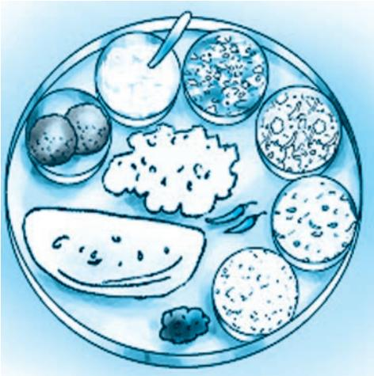
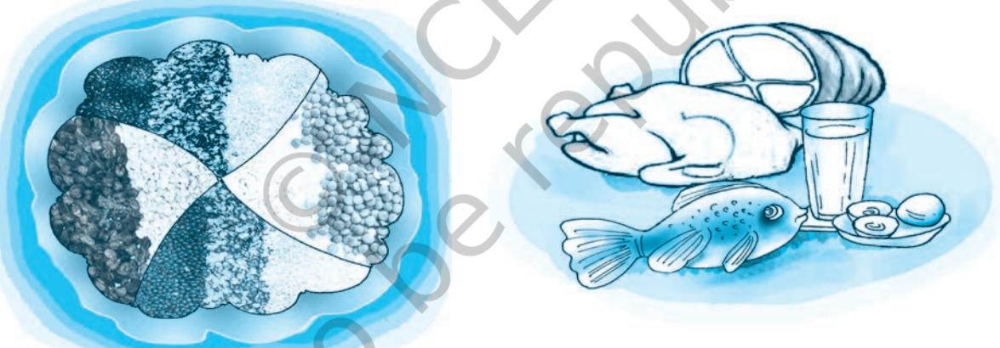
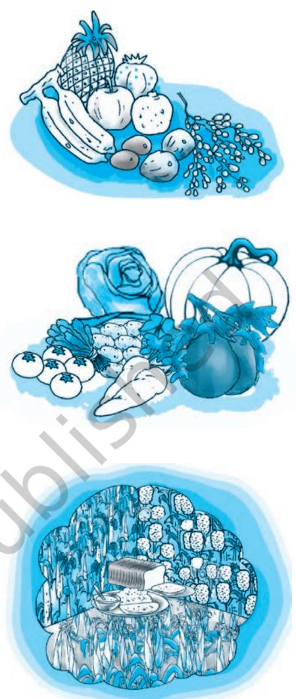
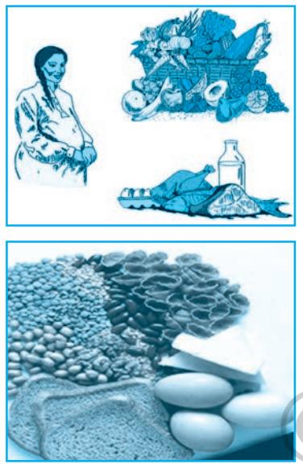
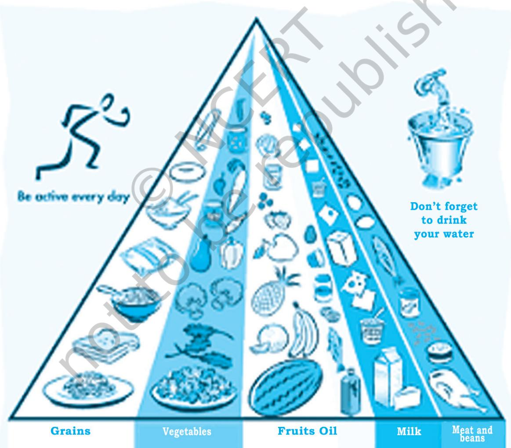
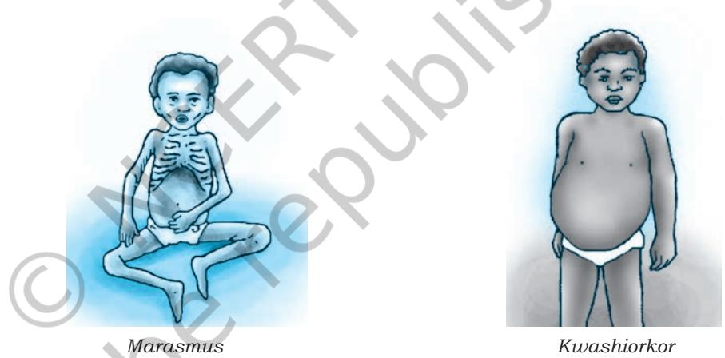
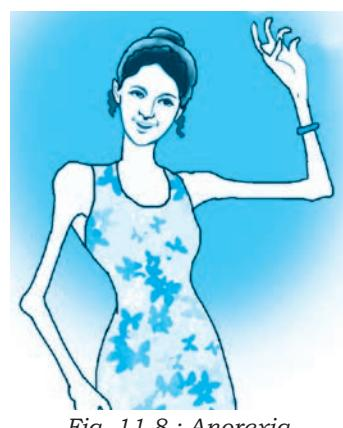

Food is our basic need. It nourishes our body and maintains our health. It gives us energy that is required for every action of ours including our participation in games and sports. The various food items that we consume constitute our diet. Diet may be defined as the total amount of different variety of food items consumed by a person during a day.

**11**

## **Activity 11.1**

Recall yourself and also ask your friends about the food items consumed by you and your friends yesterday. Based on the information, try to do the following.

- • List the number servings of each of the following consumed by you and your friends yesterday.

| Fruits | Vegetables | Pulses | Breads/ | Milk/milk | Non-veg. |
| --- | --- | --- | --- | --- | --- |
|  |  |  | chapatis/ | products |  |
|  |  |  | rice |  |  |

- • Do you think the amount, variety and quality of food taken by you and your friends is adequate to meet the nutritional requirements? Let us discuss about a healthy diet.
A healthy diet should consist of simple, natural and/or well-cooked foods which promote health and protect us from diseases. It should keep our organ systems well functioning. The diet that we consume is decided by our socio-cultural norms, life style pattern and the type of activities we are engaged in. There is a delicate relationship amongst what we eat, how much we eat and what will happen to our health if we overeat or do not eat properly. In the present chapter, we shall discuss important dimensions of diet for healthy living, which include nutrition, nutrients, food groups, balanced diet, special dietary requirements, malnutrition and eating disorders.

## **11.2 Dietary Requirements of Human Body**

Our diet contains many food items which are obtained from different sources. The food may be obtained from animal or vegetable sources. We already know that food comprises

*Fig 11.1 : A Vegetarian Thali*

constituents like proteins, carbohydrates, fats and supplementary substances such as minerals, vitamins and water that are vital for life. These constituents are known as nutrients. For proper functioning of our body we need to consume body building foods (e.g. milk, meat, poultry, fish, eggs, pulses, groundnuts); energy giving foods (e.g. cereals, sugar, roots, fats and oils); and protective foods (e.g. vegetables, fruits).

#### **11.2.1 Nutrients**

The food we consume breaks down to simpler products before it is absorbed and utilised by the body. These simpler substances are called nutrients. Our body utilises nutrients for building and repairing, obtaining energy and for protection from diseases. What is nutrition? The term nutrition is related to our food intake and dietary patterns and utilisation of

protein, carbohydrate, fat, vitamins and minerals to maintain our health. Most of the natural food items contain more than one nutrient. Let us understand various nutrients contained in different food items.

*Fig 11.2 : Protein rich food items*

## **Activity 11.2**

Find out from your parents/ grandparents, the locally available fruits and their value to the health of the body.

## *11.2.1.1 Proteins*

Proteins are called building blocks of our body. About 20 per cent of our body weight comes from proteins. Proteins are essential for growth and repair of muscle and other body tissues. Proteins are made of amino acids that contain the elements carbon, hydrogen, oxygen and nitrogen. We obtain proteins from animal as well as vegetable sources. Proteins of animal origin are found in milk, eggs, cheese, fish and meat. Proteins from these sources contain all the essential amino acids (EAA) in adequate amounts. Vegetable proteins are found

Chapter-11 diet for health living .indd 162 08-11-2016 11:46:37 AM

in pulses (legumes), cereals, beans, nuts, oilseeds, etc. Those who take vegetarian food need to consume more and a wide variety of these foods to meet their protein needs.

#### *11.2.1.2 Carbohydrates*

Carbohydrates are the main source of energy for our body. There are three major categories of carbohydrates, viz. starch, sugar and cellulose. Our body breaks down sugar and starch into glucose to provide energy. Cellulose does not have any nutritive value per se, but is a major contributor of dietary fibres. Excess carbohydrates are converted into fat by the liver and stored in the adipose tissues in our body.

Carbohydrates are of two types – simple and complex. Simple carbohydrates are quick energy foods, e.g. sugar. Sources of simple carbohydrates are natural fruits, milk and milk products, and vegetables including potatoes and carrots. Complex carbohydrates are better sources of energy than sugar since these are released slowly. Sources of complex carbohydrates are breads, cereals (rice, wheat, bajra, corn, barley, ragi, etc.). We should consume starch and natural sugar and eat whole grains, rice, bread, cereals and fruits to obtain adequate amount of carbohydrates. Fast food items such as pizza, pasta, noodles, etc. are rich in carbohydrates only and cannot replace a balanced meal.

#### *11.2.1.3 Fats*

Fats and oils are concentrated sources of energy. Fats are substances that our body stores for future use. These are classified as simple lipids (e.g. triglycerides), compound lipids (e.g. phospholipids), and derived

lipids (e.g. cholesterol). Fats may be obtained from animal or vegetable sources. The major sources of animal fats are ghee, butter, milk, cheese, eggs, fish and meat. The sources of vegetable oils are groundnut, mustard, sesame, coconut, etc. Excess carbohydrates are converted into fats. Fast food items like *pizza*, *samosas*, *burgers* are rich sources of fat. Therefore, children who consume only fast food items tend to become obese.

#### *11.2.1.4 Vitamins*

Vitamins are organic substances that we require in adequate quantities for good health. Our body, however, cannot synthesise them. Therefore, we need to consume their natural sources such as fruits and vegetables. Vitamins are divided

*Fig 11.3 : Carbohydrates and Vitamins*

Chapter-11 diet for health living .indd 163 08-11-2016 11:46:39 AM

into two groups–fat soluble vitamins (Vitamins A, D, E, and K) and water soluble vitamins (Vitamins of B group and Vitamin C). Each vitamin has a specific function and its deficiency leads to a particular deficiency disease.

#### *11.2.1.5 Minerals*

Minerals are the nutrients that are very essential for proper growth and functioning of our body and are required in small amounts. Calcium, Chlorine, Copper, Fluoride, Iodine, Iron, Magnesium, Manganese, Phosphorus, Potassium, Sodium and Zinc are essential mineral nutrients. Some of them are explained below.

| Name of | Sources | Need | Deficiency |
| --- | --- | --- | --- |
| Vitamin |  |  | Diseases |
| Fat soluble Vitamins |  |  |  |
| Vitamin A | Milk, butter, egg, | Normal | Night |
| carrots, cod liver |  | growth and | blindness, |
| oil, tomatoes, |  | to keep eyes | Irregular |
| pumpkin, green |  | and skin | growth of |
| leafy vegetables |  | healthy | teeth |
| Vitamin D | Cheese, butter, | Formation of | Rickets |
| milk, green |  | strong bones |  |
| vegetables, fish |  | and teeth |  |
| liver oil, sunlight |  |  |  |
| Vitamin E | vegetable oils, | Protection | Not yet |
| spinach, lettuce, |  | of cell | confirmed |
| turnip leaves, |  | membrane, |  |
| butter, milk, whole |  | formation |  |
| grains, nuts, seeds, |  | of red blood |  |
| leafy vegetables |  | cells (RBC) |  |
| Vitamin K | Cabbage, | Clotting of | Excessive |
| cauliflower, |  | blood | bleeding |
| spinach and |  |  | from |
| other green leafy |  |  | wounds |
| vegetables, cereals, |  |  |  |
| soyabeans |  |  |  |
| Water soluble Vitamins |  |  |  |
| Vitamin B1 | Seafood, milk, | Growth and | Beri beri |
| (Thiamin) | meat, peas, cereals, | development, |  |
| green vegetables |  | releasing |  |
| energy from |  |  |  |
| carbohydrates |  |  |  |

**Table 11.1 : Vitamins — Sources, Need and Deficiency Disease**

Chapter-11 diet for health living .indd 164 08-11-2016 11:46:39 AM

| Vitamin B2 | Yeast, egg, meat, | Body growth | Skin |
| --- | --- | --- | --- |
| (Riboflavin) | peas | and red cell | diseases, |
|  |  | production, | retarded |
|  |  | releasing | growth |
|  |  | energy from |  |
|  |  | carbohydrates |  |
| Vitamin B3 | Whole cereals, | Healthy skin, | Pellagra |
| (Niacin) | tomatoes, potatoes, | digestion | (affects |
|  | meat and fish | and nervous | skin, |
|  |  | system | alimentary |
|  |  |  | canal and |
|  |  |  | nervous |
|  |  |  | system) |
| Vitamin | Liver, milk, eggs, | Forming RBC | Anaemia |
| B12 | fish |  |  |
| Vitamin C | Indian gooseberry | Maintenance | Scurvy |
|  | (amla), lemons, | of ligaments, | (gums |
|  | lime, pineapple, | tendons, | swell and |
|  | oranges, | other | bleed) |
|  | watermelon, green | supportive |  |
|  | peppers, tomatoes, | tissues and |  |
|  | cabbage, turnip, | blood vessels |  |
|  | carrots, green |  |  |
|  | mint, guava |  |  |

#### *11.2.1.6 Water*

Water is a nutrient and it makes up almost 70 per cent of our body weight. We need water to break down complex food molecules, and transport food, chemicals and gases throughout the body. It acts as the medium for biochemical reactions and is also required to eliminate the wastes as urine and sweat. We should take 8 – 10 glasses of potable water per day. Inadequate water intake leads to dehydration. Therefore, intake of water in proper proportion is important. We should never substitute water with coffee, tea or soft drinks.

| Table 11.2 : Important Minerals — Sources and Functions |
| --- |

| Name of Mineral | Sources | Need |
| --- | --- | --- |
| Iron | Meat, fish, liver, | Formation of haemoglobin |
|  | eggs, green |  |
|  | vegetables, turnip, |  |
|  | germinating wheat |  |
|  | grains and yeast |  |

Chapter-11 diet for health living .indd 165 08-11-2016 11:46:39 AM

| Calcium | Milk and milk | Formation of strong |
| --- | --- | --- |
|  | products, green | bones, teeth; clotting of |
|  | leafy vegetables. | blood; muscle contraction |
| Phosphorus | Meat, egg, fish, | Development of strong |
|  | whole grains | bones, teeth; making |
|  |  | energy-rich compounds in |
|  |  | cells |
| Potassium | Green and yellow | For growth; keeping cells |
|  | vegetables | and blood healthy |
| Sodium | Common salt, also | Proper functioning of |
|  | in meat and milk | nervous system |
|  | products |  |
| Iodine | Iodised salt, | Proper functioning of |
|  | seafood and water | thyroid – deficiency |
|  |  | causes goitre |
| Fluoride | Coffee, spinach, | Makes enamel of teeth |
|  | onion and tea | hard and prevents dental |
|  |  | caries |
| Copper | Grains, nuts and | Helps in formation and |
|  | chocolate | functioning of RBC, |
|  |  | connective tissue and |
|  |  | nerve fibres |
| Zinc | Meat, eggs and | For insulin production, |
|  | fish | digestion, metabolism; |
|  |  | functioning of male |
|  |  | prostate |
| Chloride | Meat, milk | Functions of muscles and |
|  | products and fish | nerves and digestion |

## **Activity 11.3**

Prepare a list of food items you consumed last week at breakfast, lunch and dinner, and record the nutrients contained in by them.

## **11.3 Balanced Diet**

You have already learnt in earlier classes that a diet which contains all the essential nutrients like proteins, carbohydrates, fats, minerals and vitamins in the proportion required for the normal growth and development of the body, is called balanced diet. The quantity of nutrients in a balanced diet will always vary with age, sex and physical activities undertaken by an individual. The important components of a balanced diet are given in table 11.3 below.

## **Table 11.3 : Food Required for a Normal Person**

| Food Group | Quantity per portion/serving |
| --- | --- |
| Cereals | 1 roti ( 25 gm wheat flour), bread, 1 katori rice, |
|  | 25 gm raw dalia/cornflakes/sooji or rawa |

## **Activity 11.4**

Find out the number of glasses of water each of your ten classmates consume in a day.

Chapter-11 diet for health living .indd 166 08-11-2016 11:46:39 AM

| Pulses | 25 gm raw dal |
| --- | --- |
| Milk | 1 glass or 250 ml milk (low fat) |
| Fruits and vegetables | 100 gm fruit,100–125 (gm) raw vegetables |
| Fats and oil | 1 teaspoon (5 gm) |

Source: Health Awareness for Parliament, MOHFW; GOI: 2002

To understand which kind of food will give us the right balance of nutrients, food items are divided into six major groups given in the table below. Food items in one group cannot replace those in another.

A nutritionally balanced diet should contain items from all the above major food groups.

| Food | Food Items | Nutrients |
| --- | --- | --- |
| Groups |  |  |
| Cereals, | Rice, wheat, bajra, | Carbohydrates, proteins |
| Millets | maize, jowar, ragi |  |
| Pulses | Lentil, grams, soya, | Carbohydrates, proteins |
|  | peas |  |
| Milk and | Milk, yogurt, cheese, | Fats, proteins, minerals, |
| milk | paneer, ice-cream | water, carbohydrates, |
| product |  | vitamins |
| Meat, fish | Meat, fish, chicken, | Proteins, fats |
| and fowls | nuts |  |
| Vegetables | Green leafy | Carbohydrates, |
|  | vegetables, roots | vitamins |
|  | minerals, water |  |
| Fruits | Orange, banana, | Carbohydrates, |
|  | apple etc. | vitamins |

**Table 11.4 : Major Food Groups**

## **11.4 Special Dietary Requirements**

The amount of food or nutrients required by a person in a day depends upon the need for energy and specific demands of a person. These needs are directly related to age and physical activity. During the rapid growing years, i.e. 12 – 22 years for boys and 12 – 18 years for girls, there is a gradual increase in daily food requirements. But as we grow old, our daily need for energy decreases. The amount of energy required by people engaged in low, moderate or high level of physical activity differs.

A sportsperson always needs to consume more calories than a non-sportsperson. Similarly, the dietary needs of a woman during pregnancy and lactation are higher. Let us discuss the dietary requirements of different individuals.

Chapter-11 diet for health living .indd 167 08-11-2016 11:46:39 AM

## **Box 11.1**

Food habits such as eating fast food regularly, skipping meals, etc. contribute to nutritional deficiency among adolescents, especially girls.

*Fig. 11.4 : Calcium rich Diet and Iron rich Diet*

## **Activity 11.5**

- 1. List the myths in respect of diet for adolescent girls, pregnant and lactating women, prevalent in your locality.
- 2. Express your opinion regarding these myths.
- 3. Discuss these myths with your friends and teacher.

#### **11.4.1 Diet for Adolescents**

We know that during adolescence, changes take place in the body composition of boys and girls; and as a result their nutritional requirements increase. Girls need more minerals like calcium and iron. Adolescent girls and boys need to take calcium rich food to keep their bones, teeth and muscles healthy; and iron rich food to keep them strong. Therefore, it is essential for them to consume more dairy products, beans and green leafy vegetables in their diet. Young girls taking inadequate diet may suffer from nutritional problems like irondeficiency anaemia and obesity. This may be due to refusal to eat food to maintain weight or binge eating habit. Furthermore, an under nourished adolescent girl is at a risk of developing complication during pregnancy and child birth.

## **11.4.2 Diet for Pregnant Women and Lactating Mothers**

Women always require more iron than men. Pregnant and lactating mothers have special dietary needs. In our country, it is seen that pregnant and lactating women do not take healthy diet because of lack of availability and lack of important nutritional information. A pregnant and a lactating mother requires additional energy over and above her normal requirements. There is also an increased need for protein, calcium and iron. Inadequate intake of nutrients causes harm to the foetus and the child. Mothers should follow the guidelines for intake of nutrients available from the nearby health centre and gather knowledge regarding weight gain and supplementation. Besides food, normal physical activities and light exercises like walking should be performed by pregnant women in consultation with the doctor or health worker.

Good nutrition during pregnancy promotes healthy weight of the newborn. Low birth-weight children are prone to various diseases during adulthood. Therefore, pregnant women and mothers should keep the following in mind.

- • Include all food groups in daily diet. Care should be taken to include cereals, pulses, ghee-oil, sugar, jaggery, vegetables, fruits, milk and its products in the daily diet.
## **Table 11.5 : Additional Calorie Requirment during Pregnancy and Lactation**

| Food Item | During Pregnancy |  | During Lactation |  |
| --- | --- | --- | --- | --- |
|  | Quantity | Calories | Quantity | Calories |
|  |  | (kcal) |  | (kcal |
| Cereals | 35g. | 118 | 60g. | 203 |
| Pulses | 15g. | 52 | 30g. | 105 |

Chapter-11 diet for health living .indd 168 08-11-2016 11:46:39 AM

| Milk | 100 | 83 | 100 | 83 |
| --- | --- | --- | --- | --- |
| Fat | NA | NA | 10g. | 90 |
| Sugar | 10g. | 40 | 10g. | 40 |

Source: ICMR (1990) Recommended Dietary Intakes for Indians, New Delhi

- • Consume more foods containing iron like green leafy vegetables, black sesame seeds (til), raisins, jaggery, *poha*.
- • Consume more foods like milk and its products (viz. curd, *paneer, kheer*), white sesame seeds (til), *ragi*, guava and *bajra*, which provide all the calcium and protein needed.
- • Do not restrict diet. Have a balanced diet.
- • Table 11.5 presents the additional calorie requirement during pregnancy and lactation.

#### **11.4.3 Diet for Sportspersons**

All kinds of physical activities burn a lot of energy. Sportspersons undergo physical training which involves regular strenuous exercises for a long period for developing physical fitness and improving performance. They, therefore, need more calories for energy. Even persons who do not participate in competitive sports but undertake exercise programmes for physical fitness need extra energy. Accordingly, they are required to plan their diet.

Let us have a look at the table given below to understand the energy expenditure of a person of age between 20 to 39 years, with a body weight of approximately 60 kg by various activities.

These additional requirement of nutrients for training load can be achieved with a balanced diet. In the past, athletes were advised to take large amount of protein from eggs, meat and milk, but it is now generally accepted that carbohydrate and not protein, is the best source of energy. One should also remember that extra protein intake does not increase muscles.

| Table 11.6 : Energy Expenditure of a Person by Various |
| --- |
| Physical Activities (kcal/hr) |

| Activity | kcal/hr | Activity | kcal/hr |
| --- | --- | --- | --- |
| Cleaning/mopping | 210 | Walking 4 km/hr | 160 |
| Gardening | 300 | Running 6 km/hr | 353 |
| Cycling 15 km/hr | 360 | Running 10 km/hr | 655 |
| Volleyball | 180 | Running 12 km/hr | 750 |
| Badminton | 348 | Dancing | 372 |
| Tennis | 392 | Standing | 132 |

Chapter-11 diet for health living .indd 169 08-11-2016 11:46:40 AM

Diet containing complex carbohydrates is always preferred over that containing simple sugar. In case of sportspersons, a dietary carbohydrate intake of 500-600 gm/day is necessary to ensure adequate glycogen synthesis. Carbohydrates break into sugars that give energy. Extra sugar is converted into glycogen and stored as adipose tissue by the liver. It is broken down to simple sugar whenever energy is required. An athlete needs to choose foodstuffs from all groups displayed in the food pyramid and pay attention to the intake of adequate water.

In planning one's diet, care must be taken to follow good eating habits that we discussed earlier. Physical activities may be performed after at least three hours of taking a principal meal and after half an hour of taking light food. A sportsperson's diet is very important not only during the training period, but before and after the competitions too.

*Fig. 11.5 : Food Pyramid for Balanced Diet*

Chapter-11 diet for health living .indd 170 08-11-2016 11:46:40 AM

#### *11.4.3.1 Diet before Competition*

The pre-competition meal needs to be high in carbohydrates, low in fat, low in protein, low in fibre, enjoyable and familiar to the participant. Food may include breakfast cereals, bread, *roti*, fruits, fruit juice, boiled rice, potatoes, sweet potatoes, biscuits and carbohydrate drinks.

#### *11.4.3.2 Diet on Competition Day*

On the day of competition, the most important thing to remember is never to try anything new. An athlete must follow a simple and sound nutritional routine. If the competition is held in the morning, just eat a light carbohydrate-rich breakfast with plenty of fluids, cereal with milk, bread or *roti*. Large quantities of sugar, confectionery or honey should be avoided. Food that may upset the stomach and make feel heavy may be avoided.

#### *11.4.3.3 Eating just before Competition*

Small amount of food containing carbohydrates just before competition helps to delay fatigue and improve endurance.

#### *11.4.3.4 Drinking during Competition*

Have your last drink 15 – 20 minutes before actual competition. It is essential to drink water at regular intervals to avoid dehydration. Right kind of sports-drinks hydrate our body and also supply energy.

## **11.5 Yogic Diet**

Ayurveda advise a *sattvic,* which is a vegetarian diet, consisting of natural food items. According to yogic dietetics, natural food items are easy to digest and assimilate. Yogic diet is a combination of raw food and proper fasting routine. Good raw food, such as cucumber, radish, carrots, tomatoes, sprouts, together with spices like ginger, cayenne, cinnamon and basil provide energy to the mind and the body. Taking regular yogic diet and performing *asanas*, *pranayama* and meditation contribute to the well-being of our body and mind. For preparation of yogic foods, steaming is considered to be the best method.

## **11.6 Malnutrition**

It is now clear that a balanced diet is very important for a healthy life. An imbalance between the body's nutritional needs and the intake of nutrients leads to malnutrition. Commonly malnutrition is considered in terms of hunger, whereas, both under-nutrition and over-nutrition are forms of malnutrition.

## **Box 11.2**

Ayurveda suggests the following items in a wholesome diet

- • Rice
- • Millet
- • Wheat
- • Green gram
- • Coriander
- • Vegetable
- • Grapes, mangoes, Dates
- • Cow's milk
- • Turmeric (*haldi*)
- • Cumin (*jeera*)
- • Do not fill your stomach with extra food.
- • Eat food at regular intervals.

Chapter-11 diet for health living .indd 171 08-11-2016 11:46:40 AM

(a) Under-nutrition: specific deficiency

(b) Over-nutrition: overweight and obesity

Nutritional imbalance resulting from inadequate intake of nutrients is referred to as undernutrition.

## **11.6.1 Types of Malnutrition**

#### *11.6.1.1 Under-nutrition*

Malnutrition

It does not occur in a single day's food intake. Deficiency caused by under-nutrition affects us after long term of negligence. An under-nourished child cannot grow fully, physically and mentally. In most of the developing countries, under-nutrition is a threat to public health as it leads to illness and even death. In addition to inadequate intake of nutrients, under-nutrition

*Fig. 11.6 : Under-nutrition children*

is also the result of malabsorption of food, addiction to drugs or loss of nutrients from body due to various medical reasons. Under-nutrition may lead to deficiency diseases, like protein deficiency diseases which include kwashiorkor, marusmus, mineral deficiency diseases like goitre, anaemia; and vitamin deficiency diseases like scurvy, beriberi and rickets.

Ignorance, lack of education and poverty led by relatively high food prices, natural disasters causing insufficient agricultural productivity and unhealthy dietary practices are some important common causes of under-nutrition. Undernutrition continues to be a significant health problem for children and adults in India. The National Family Health Survey 3 (NFHS) reported that in our country the prevalence of

Chapter-11 diet for health living .indd 172 08-11-2016 11:46:40 AM

under-nutrition is high among children. At present, 40 per cent children of less than five years of age in our country are underweight.

For the management of under-nutrition, improvement in nutritional status is required. The Government of India provides mid-day meals to the students of up to elementary stage during school hours.

Many myths and taboos about diet are also responsible for under-nutrition in our country. Due to ignorance and illiteracy, locally available nutritious food is not eaten. In case of new born

babies, inadequate breastfeeding is a major cause of undernutrition. In fact, exclusive breast feeding during the first six months of life is very important.

#### *11.6.1.2 Over-nutrition*

Over-nutrition is also a form of malnutrition that results from overeating and excessive intake of specific nutrients like carbohydrate and fat. Inadequate exercise and overeating are the major causes of overweight. Due to intake of excessive food, adipose tissue increases abnormally in the body that enlarges or the number of fat cells increase leading to obesity. We find obese persons bulky and overweight because of the accumulation of fat in the body. People who eat more need to burn more calories, otherwise surplus calories are stored as fat.

In modern societies obesity has become an epidemic. It occurs in both developed and developing countries and affects children as well as adults. In addition to overeating and inactivity, the major reasons of overweight and obesity are sedentary life style, emotional problems and physiological disturbances including genetic factors. Metabolic and

digestive disorders take place due to overconsumption of fats, fast foods, soft drinks and refined white flour carbohydrates, combined with low fibre intake.

Overweight and obese children and adolescents frequently grow to become obese adults. Obesity tends to run in families, suggesting a genetic link too, as families share common dietary and physical activity patterns, attitude, lifestyle and habits which contribute to obesity. Planning for balanced diet and regular exercise is of utmost importance to prevent overweight and obesity.

## **Activity 11.6**

- Conduct a survey in your family and the neighbourhood to find out facts regarding the following:
- 1. How many malnourished children are there?
- 2. What are the reasons of malnourishment of those children?

*Fig. 11.7 : Over-nutrition*

## **Box 11.4**

**Obesity:** Overweight and obesity are not the same. Obesity is a health condition in which excess body fat accumulates to the extent that it may have an adverse effect on health and reduce life expectancy. When body fat content exceeds 25 per cent for men or 30 per cent for women of the total body weight, a person is called obese. Calculating BMI is given in Chapter 4?

Chapter-11 diet for health living .indd 173 08-11-2016 11:46:41 AM

#### **11.6.2 Assessing the BMI**

Body Mass Index (BMI) is an index of weight-for-height that is commonly used to classify adults as underweight, overweight and obese. It is obtained by dividing the weight in kilograms by the square of the height in metres (kg/m2). For example, an adult who weighs 70kg and whose height is 1.75m will have a BMI of 22.9.

| BMI | Category |
| --- | --- |
| <18 Kg/m2 | Underweight |
| 18-23 Kg/m2 | Ideal body weight |
| 23-25 Kg/m2 | Overweight |
| >25 Kg/m2 | Obese |

**Table 11.7 : BMI Chart**

## **11.7 Eating Disorders**

Eating disorders are severe disturbances in eating behaviour commonly seen among adolescents between ages 14 to 18 years. Disordered eating patterns are either characterised by refusal of food to maintain the body weight or recurring binge eating followed by vomiting. The former restrictive type disorder is known as Anorexia Nervosa and the later, Bulimia Nervosa. Most people do not seek help for eating disorders; some may not even be aware that they have a problem.

#### **11.7.1 Anorexia Nervosa (AN) (Refusal to eat food)**

Anorexia Nervosa is a psychological disorder caused by undernutrition. People with such disorder become thin and lose a lot of weight. An obsessive fear of gaining weight occurs in such cases. Anorexia nervosa is an attempt to use food and weight to deal with emotional problems, physical changes, peer pressure and stress. It is a serious mental illness with a high incidence of morbidity and mortality.

Extreme fasting, indulging in over exercise, dieting may result in anorexia nervosa. Teenage girls and young women are more likely to develop this disorder. However, this disorder can occur during adulthood too.

#### **11.7.2 Bulimia Nervosa (Recurrent binge eating)**

Bulimia Nervosa is an eating disorder characterised by recurrent binge eating, followed by compensatory behaviour. The most commonly observed behaviours include defensive vomiting, sometimes called purging, fasting, using laxatives and over- exercising.

*Fig. 11.8 : Anorexia Nervosa*

## **Box 11.5**

Anorexia Nervosa results from refusal to eat or lack of appetite or disliking food leading to starvation to maintain a body image.

Chapter-11 diet for health living .indd 174 08-11-2016 11:46:41 AM

The onset of bulimia nervosa is generally observed during mid to late adolescence. It is 20 times more common in females. Bulimia nervosa is rarely seen in those under 14 years. It has also been observed that there is higher incidence of major depressive disorder in close relatives of patients with bulimia nervosa.

The common causes of the disorder are family problems, inability to adjust in society, lack of self-identity, conflict, problem with body image, depression and other psychological problems. The person tries to express emotions that are otherwise difficult, becomes extremely engaged with emotions and is so tied up with a relationship with food and weight that it becomes difficult for him/her to deal with it.

Health problems caused by both the above conditions include:

- (a) tooth decay, toothaches, swollen gums, gum disease (gingivitis), and erosion of tooth enamel, which are caused by acid in the mouth due to vomiting.
- (b) osteoporosis.
- (c) abnormal heart beat.
- (d) dehydration, which can lead to weakness, fainting.
- (e) fainting due to low blood pressure.
- (f) low body temperature.
- (g) suicide risks when a person feels discouraged due to presence of one of the conditions or has ongoing body image issues.

Anorexia and bulimia can lead to delay in the onset of menstruation in girls.

There is a need to focus on fitness rather than on weight reduction. Sitting in front of TV or computer for long hours, eating junk food, or having high calorie drinks add to obesity. It is seen not only in the affluent section but also in urban poor. Since obesity is more a lifestyle disease, it needs intervention at the level of the person himself/herself and at the level of the entire family, school and the community. Proper eating habits, diet and exercise are the essential requirements for physical fitness and management of weight.

Chapter-11 diet for health living .indd 175 08-11-2016 11:46:41 AM

## **Assessment**

#### **Answer the following questions**

- 1. Define the terms nutrition and nutrients.
- 2. List the various constituents of food and mention their function in the body.
- 3. Why is it important to recommend special diet for pregnant and lactating women and sportpersons.
- 4. Why is water considered a necessary constituent of the diet?
- 5. List the nutritional disorders and state one characteristic of each.

#### **Fill in the blanks**

- (i) Vitamin A is a …………….soluble Vitamin.
- (ii) Vitamin C is a …………….soluble Vitamin.
- (iii) ……….................. diet contains adequate proportions of carbohydrates, proteins, fats, minerals and vitamins.
- (iv) Yogic diet consists of natural ……..items.
- (v) BMI can be assessed by........................

#### **Tick (**P**) mark either Yes/No.**

- (i) Water is a nutrient which makes up almost 70 per cent body weight. (Yes/No)
- (ii) One should consume 6 8 glasses of water every day. (Yes/No)
	- (iii) Over-nutrition leads to obesity. (Yes/No)
- (iv) Wheat and vegetables are the source of vitamin E.

(Yes/No)

- (v) Milk and milk products are the source of calcium.
(Yes/No)

## **Project**

- • How do bulimia nervosa and anorexia nervosa pose serious health issues for adolescents?
- • Prepare a chart on the benefits of locally available food/ balanced diet.
- • How do you think media influences the eating habits of young people?
- • Create an advertisement for selling healthy food and suggest how you can build awareness on healthy eating habits among your peers.

Chapter-11 diet for health living .indd 176 08-11-2016 11:46:41 AM

