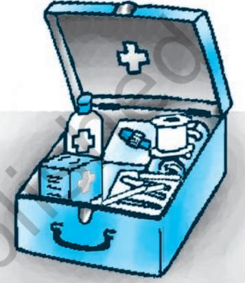
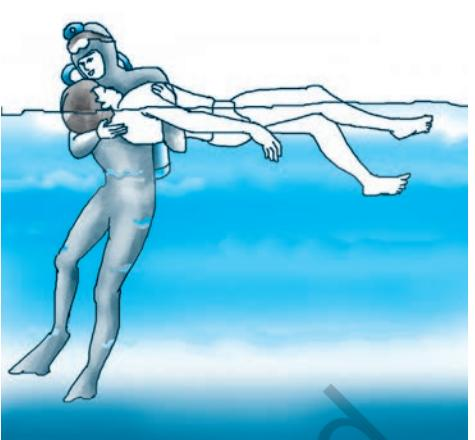
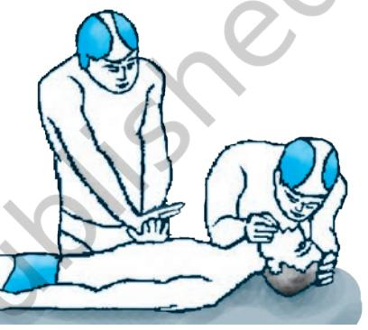
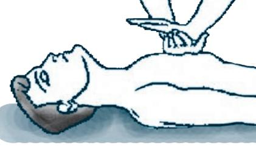

# **12.1 Introduction**

We all observe that when individuals fall ill or are injured, they are taken to hospitals or doctors for treatment. But it takes time to reach them, during which if some initial care is taken, it helps treatment of such individuals and in many cases saves their lives. We also observe that some of the minor illnesses or injuries are cured by taking such initial care. However, this care cannot be taken unless we are aware and trained in first-aid. In the present lesson we shall discuss various aspects of first aid and safety.

# **12.2 What Does First Aid Mean?**

First aid is the provision of initial care for an illness or injury. It is usually performed by a non-expert person to a sick or injured person until appropriate medical treatment can be accessed in a hospital or by going to a doctor. Certain selflimiting illnesses or minor injuries may not require further medical care after the first aid intervention. It generally consists of a series of simple and in some cases, potentially life-saving techniques that an individual can be trained to perform with minimal equipment.

The First aid training, therefore, is of value in both preventing and treating sudden illness or accidental injury and in caring for large number of persons caught in a natural disaster. It is a measure both for self help as well as for the help of others.

## **12.2.1 Self-help**

If you, as a first-aider, are prepared to help others, you are better able to care for yourself in case of injury or sudden illness. Even if your own condition keeps you from caring for yourself, you can direct others in carrying out correct procedures to follow on your behalf.

# **12.2.2 Help for Others**

Having studied first-aid, you are prepared to give others some instruction in first-aid, to promote among them a reasonable safety attitude and to assist them wisely if they are stricken. There is always an obligation on a humanitarian basis to assist the sick and the helpless. There is no greater satisfaction than that resulting from relieving suffering or saving a life.

*Fig. 12.1 : First Aid Box*

# **Activity 12.1**

- • Make a first aid box and keep in your classroom.
- • Make one student incharge so that all students know whom to reach in an emergency.

# **Activity 12.2**

- • Do you know how to apply bandage?
- • Do you know what treatments are applied for bruises and cuts?
- • Discuss the above in your class and demonstrate.

## **12.3 Why First Aid?**

# **Box 12.1**

The basic objectives of First Aid are:

- • to give immediate care.
- • to protect the casualty from further harm.
- • to relieve pain.
- • to promote recovery.

The recovery is promoted as the heart rate goes down, which in turn prevents blood loss from the victim's body.

The main objective of first aid is not to cure, but to ensure safety until the patient or affected person accesses specialised treatment. It is the initial assistance or care of a suddenly sick or injured person. It is the care administered by a person as soon as possible after an illness or accident. It is this prompt care and attention prior to the arrival of the ambulance that sometimes creates the difference between life and death, or between a full or partial recovery. As shown in Box 12.1, the major objectives of first aid are: (i) to ensure that the victim

reaches the place of specialised treatment safely and life is not lost in-between; (ii) to prevent further harm, i.e., the injury that has taken place, does not deteriorate further; (iii) to prevent the danger of further injury; and (iv) to promote recovery, i.e., necessary intervening care is taken in a way that promotes recovery and relieves the victim of pain and uneasiness.

# **12.4 First Aid in Different Cases**

It is essential to know and be trained in the art of providing first aid. Though it is done by non-expert persons, it cannot and should not be administered without acquiring adequate knowledge and appropriate skill. There are different ways of providing first aid in different cases of accidents and illnesses. Let us take some specific cases and know how first aid is provided.

## **12.4.1 First aid for Drowning**

Many deaths occur because of drowning. Death by drowning occurs when air cannot get into the lungs because of the entrance of a small amount of water into the lungs. This may cause the contraction of the throat. In such cases efforts are made to remove water from the stomach of the drowned person. Attempting to forcefully remove water from the victim's stomach should be avoided as this may make the victim vomit and there are chances of casualty. A casualty from drowning needs to be treated by a medical doctor, even if he/she seems to recover, because, as explained in Box 12.2, a secondary drowning may occur in him/her at a later stage.

In this particular situation, the aim of the first aid is to restore breathing, to keep the person warm and to arrange for taking him/her to hospital. The following steps may be taken:

# **Box 12.2**

Water entering the lungs causes them to be irritated, and the air passages to swell several hours later—a condition known as secondary drowning.

Chapter-12 First Aid & safety indd.indd 178 08-11-2016 11:48:16 AM

- **Step 1:** Rescue the person and get him/her to the dry land. Keep the person's head lower than the rest of the body to reduce the risk of inhaling water.
- **Step 2:** Lay down the person on his/her back. Open the airway and check breathing. If required, give CPR (Cardio Pulmonary Resuscitation) with chest compression.
- **Step 3:** Treat the person for Hypothermia (low body temperature). Remove wet clothes and cover him/her with dry blanket. If the person regains full consciousness, give him/her a warm drink.
- **Step 4:** Call for a doctor or ambulance to transport the person to the nearest hospital as soon as possible, even if she/he appears to have recovered fully.

#### **12.4.2 First aid for Fire Injuries**

When the skin comes in direct contact with fire, it gets damaged. This is known as dry burn. The burn exposes the under lying part of the skin, which increases the chances of infection. While assessing the burn, it is necessary to:

- • consider the circumstances in which the burn has occurred;
- • establish the cause of the burn;
- • observe the condition of the victim; does she/he need immediate medical attention?
- • assess the extent of burn or the depth of the burn; and
- • determine the degree of risk for infection.

Based on the depth of the skin damage, the burns are categorised into three types.

*Fig. 12.2 : Steps for CPR in the case of drowning*

# **Activity 12.3**

The students should be encouraged to ask questions if they have any doubt on the procedure of the first aid in swimming. If the swimming facility is available then the life saving technique of drowning can best be practised by doing. In the classroom or physical education laboratory the students may make use of dummies.

# **Box 12.3**

**Warning –** Water in the lungs can increase the resistance to rescue breathes and chest compressions, so these have to be done at a slower rate. **Hypothermia** develops when the body temperature falls bellow 35° Celsius. The effects vary depending on the speed of onset and the level to which the body temperature falls.

Chapter-12 First Aid & safety indd.indd 179 08-11-2016 11:48:18 AM

- • **A superficial burn** involves only burns on the outer most layer of the skin, called the epidermis.
- • **A partial thickness** burn is generally very painful, this destroys the epidermis. If such wounds are on more than 20 per cent of the body, then it may be fatal.
- • **A full thickness** burn is not painful in most of the cases, so it may mislead the first-aider and the casualty about the severity of the injury. This needs immediate medical attention.

As, the kind of the burns vary, so does the kind of first aid needed for various kind of burns.

#### **(a) First Aid for Severe Burns**

In this case, the first aid is given to :

- • stop burning and relieve pain;
- • treat the associate injuries;
- • minimise the risk of infection;

In case of severe burn the following steps need to be taken.

- **Step 1:** Help the casualty to lie down. Do not allow the injury area to come into direct contact with the ground.
- **Step 2:** Pour cold water on the burn for a minimum of 10 minutes, but at the same time, arrangement of transport for taking the casualty to hospital should be made. Continue cooling the affected area until the pain is relieved.
- **Step 3:** Gently remove any ring, watch, belt and shoes before the tissues begin to swell. Carefully remove burnt clothing, if it is not sticking to the skin.
- **Step 4:** Cover the injured area with a sterile dressing to protect it from infection.
- **Step 5:** Gather and record details of the injury. Record the level of response, pulse and breathing carefully.
- **Step 6:** While waiting for the help to arrive, keep reassuring the casualty. In case of burn of the face, do not cover the injury because it may cause discomfort to the victim. Keep cooling the area till the doctor arrives.

#### **(b) First Aid for Mild Burn**

In case of mild burns, first aid is given to :

- • stop burning.
- • relieve pain and swelling.
- • minimise the risk of infection.

In case of mild burns, one should :

- **Step 1:** Pour cold water on the injured part for minimum 10 minutes, to relieve pain. If water is not available, then any harmless cold liquid (for example, milk) may be used.
## **Activity 12.4**

Find out from a health worker, parents or neighbour about any person who was given first aid for burn injuries. Share the experience in the class.

# **Box 12.4**

#### **Do Not**

- • Break blisters.
- • Interfere with the injury.
- • Apply adhesive dressing.
- • Apply ointments or fats, as they may damage the tissue and increase the chances of infection.

Chapter-12 First Aid & safety indd.indd 180 08-11-2016 11:48:18 AM

- **Step 2:** Remove gently any ring, watch, belt and shoes before the tissues begin to swell. Carefully remove burnt clothing, if it is not sticking to the skin.
- **Step 3:** Cover the area with a sterile dressing and bandage loosely on the affected area.
- **Step 4:** If a blister is caused by the burn, apply a nonadhesive dressing that extends well beyond the edges of the blister and keep it in place until it subsides. One should be aware of two significant facts given in boxes 12.5 and 12.6.

## **(c) First Aid for Injuries on the Play Field**

Injuries which occur as a result of participation in the sports activity are known as sports injuries or athletic injuries. There are various types of sports injuries. These are mentioned in the following table 12.1.

| Injuries Types |  |
| --- | --- |
| Skin injuries | Abrasion (falling on rough or firm surface) |
| Laceration (tears in the skin) |  |
| Incision (cut by a sharp edge of an object) |  |
| Puncture wound (pierced by a sharp and |  |
| pointed object) |  |
| Avulsion (tearing away of a part of the skin) |  |
| Soft tissue | Contusion (Bruise caused by the direct |
| injuries (e.g. | blow to some part of the body. For example: |
| muscles, | Knee of a player is knocked against thigh of |
| the person). ligaments) |  |
| Sprain (Injury of ligament of joints, caused |  |
| by the violent overstretching of ligament |  |
| in a joint or the movement of the joint in |  |
| abnormal directions. It is characterised by |  |
| pain, tenderness, swelling at the joint. |  |
| Strain (Injury of muscle or tendon, three |  |
| types– | mild, moderate, severe). |
| Joint injuries | Joint injuries are very common in sports |
| they are known as joint dislocation. |  |
| "Dislocation | is the displacement of |
| contiguous surfaces of two or more bones |  |
| which are in a joint." Causes: An external |  |
| force which forces the joint to move beyond |  |
| the limits of a joint. If the joint is forced |  |
| to move in an abnormal direction, this |  |
| dislocation can be a complete or a partial |  |
| displacement of the bones. |  |

**Table 12.1**

## **Box 12.5**

### **CALLUSES**

These are thickening of the epidermis. It usually occurs in the palm of the hands or on the sole of the foot due to constant friction or pressure. If the calluses crack then it will cause a very painful condition. Sometimes a blister may develop under the callus. When it becomes very hard, to prevent cracking, soak the body part in the water for some time and then scrub it off. If it gets infected then consult a doctor.

# **Box 12.6**

## **BLISTERS**

These are caused by the deposition of a type of colourless fluid in between the dermis and epidermis. Sometimes this fluid may be blood stained; this is due to the damage of the blood vessels caused by the continuous frictional force. It is normally seen on the hand or palm or on big toe. Blisters should not be cut, rather the fluid inside can be removed by a sterile syringe, but only by a doctor.

Chapter-12 First Aid & safety indd.indd 181 08-11-2016 11:48:18 AM

| Bone injuries | Fractures (Fracture is a break in the |
| --- | --- |
|  | continuity of the bone. The fractures can be |
|  | open/compound fracture or a closed/simple |
|  | fracture. Severity of the fracture varies from |
|  | the mild crack in the bone to the severe |
|  | shattering of the bone into many pieces. |

#### **Prevention**

Since prevention is better than cure, it then becomes essential to take appropriate precautions. Make the area in and around the play field hazard free. In order to prevent injuries proper warm up is required prior to executing vigorous movements. Similarly, use of appropriate physical conditioning is essential to avoid injury.

First aid for strains, sprains, contusions is packaged in the abbreviation RICE which is Rest, Icing, Compression and Elevation as shown in Box 12.5.

#### **Rest**

- • Stop using injured part or discontinue activity. It could cause further injury, delay healing, increase pain and stimulate bleeding.
- • Use crutches to avoid bearing weight on injuries of the leg, knee, ankle and foot.
- • Use splint for injuries of the arm, elbow, wrist and hand.

#### **Ice**

- • Ice application contracts blood vessels.
- • Helps stop internal bleeding from injured capillaries and blood vessels.
- • Hastens healing time by reducing swelling around injury.
- • Keep damp or dry cloth between skin and ice pack.
- • Do not apply ice for longer than 15 to 20 minutes at a time.
- • Apply every hour for 10 to 20 minutes.
- • Apply ice as long as pain or inflammation persists.

#### **Compression**

- • Hastens healing time by reducing swelling around injury.
- • Decreases seeping of fluid into injured area from adjacent tissues.
- • Use elasticised bandage, compression sleeve, or cloth.
- • Wrap injured part firmly.
- • Do not impair blood supply.
- • Too tight bandage may cause more swelling.
- • Wrap over ice.
- • Loosen the bandage if it gets too tight.

# **Box 12.7**

| RICE |
| --- |

- R Rest I - Ice
- C Compression
- E Elevation
- 

Chapter-12 First Aid & safety indd.indd 182 08-11-2016 11:48:18 AM

#### **Elevation**

- • Elevate injured part above the level of heart.
- • Decreases swelling and pain.
- • Use objects and pillows.

# **12.5 Transporting the Person for Medical Help After Giving First Aid**

Medical evacuation of the sick and wounded (with medical care) is the responsibility of the medical personnel who have been provided special training and equipment. Therefore, unless there is an emergency, wait for some means of medical evacuation to be provided. When the situation is urgent and you are unable to obtain medical assistance or know that no medical evacuation facility may be available, you yourself will have to transport the casualty. For this reason, you must know how to transport without increasing the seriousness of his/her condition.

## **Activity 12.5**

The school authorities must provide practical exposure to students by organising a First Aid training programme in the campus.

Chapter-12 First Aid & safety indd.indd 183 08-11-2016 11:48:18 AM

#### **Answer the following questions**

- 1. What is first aid?
- 2. What are the various kinds of injuries caused sometimes, due to participation in sports?
- 3. What is a burn injury? How many kinds of burn injuries are there?
- 4. If someone gets a burn injury what will you do first?
- 5. Mark the statements as True/False.
	- (i) A first-aider must not panic, so that she/he can help in early transportation of the victim to the hospital.
	- (ii) When an injury occurs in sports, then the activity causing injury must be stopped immediately.
	- (iii) First aid is meant for sportspersons only.
	- (iv) The primary aim of the first aid is to save the life of an individual.
	- (v) First aid is provided by a medical doctor only.

## **Project**

- 1. List the items which should be kept in the first aid box.
- 2. Prepare a first aid kit in consultation with the teacher concerned. Keep it in the classroom. (Activity 12.1)
- 3. Discuss with students how you will ensure that all items are always present in the first-aid box.

Chapter-12 First Aid & safety indd.indd 184 08-11-2016 11:48:18 AM

