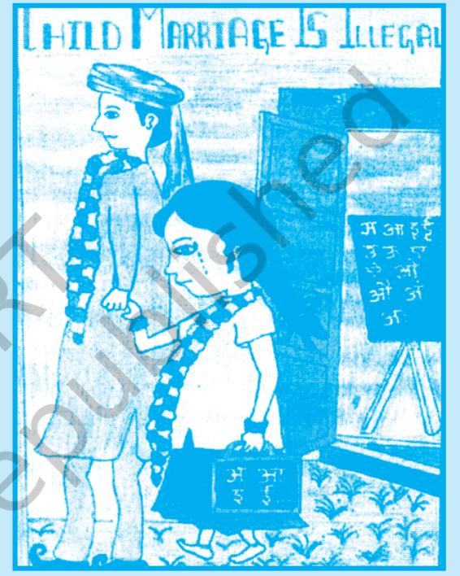

# **13.1 Introduction**

We have discussed health in previous chapters. By now you must have realised that health does not only mean freedom from diseases. It is much more. Health is the state of physical, mental and social well-being. It should be viewed in a holistic way. An individual may be physically and mentally healthy, but if her/his social condition is problematic, she/he cannot achieve holistic health. In the present chapter, we shall focus on various aspects of social health.

# **13.2 What is Social Health?**

Let us first understand the meaning of social health. We know that social health is one of the three major components of health, the other two being physical and mental. Social health can be defined in two ways. In one sense, it refers to the health of a person with reference to her/his ability to interact with others. It also refers to the health of a society in general. It focuses on how the members of a society treat each other and behave with each other. What kind of social environment prevails and how the prevailing customs and traditions guide the behaviour of individuals towards self, each other and towards the society as a whole also form social health. Social Health also includes how individual's natural environment around them is. The role of the community as a whole acquires great importance for enhancing and maintaining the quality of the health of individuals. Although there are many dimensions of social health, we shall discuss below the impact of social customs on our health, the need to protect natural resources and the empowerment of community for healthy living.

# **13.3 Impact of Social Customs**

Customs and traditions prevalent in a society influence all aspects of the lives of individuals, including their health and welfare. What people eat, how they eat, how they live and care for their own health as well as the health of their near and dear ones are influenced by the prevailing customs and traditions. Let us first understand the meaning of the term custom.

# **13.3.1 What is a Custom?**

Customs generally refer to beliefs, habits or actions performed in the past and transmitted through time from one generation

# **Activity 13.1**

Make a list of customs having a positive and negative impact on the health of individual and society prevailing in your neighbourhood. Share with your classmates their implications on health?

to the next. These are derived from social norms which are rules or standards that guide, control or regulate proper and acceptable behaviour of a group. These norms define the shared expectations of a group and enable people to anticipate how others will interpret and respond to their words and actions if there is a deviation from these norms. For example, there are customs and traditions related to marriage ceremonies. These are observed by not only those who are getting married but also by the other members of the family and community. Many of the customs have positive impact on the relationships in a family and community. However, many of the customs have negative impact as well. For example, there are customs prevalent in many communities, like early marriage or discriminating against female child, or choice of spouse, which adversely affect the health and well-being not only of the female child but of the society as a whole.

# **Activity 13.2**

Seema studies in Class IX in a small town. She has two elder brothers. Both the brothers get a lot of attention from the parents. Parents believe that both their sons should get larger portion of milk, cheese and eggs. They tell Seema that her brothers need to be strong as they will grow up to head their families in future. On the other hand, parents tell Seema that she should eat less, otherwise she will look too grown up and big for her age. One day, while in class, Seema told her teacher that she was feeling dizzy. Before the teacher could do anything, she fainted. The teacher took her to a nearby hospital and then went home with her. The teacher told Seema's parents that the doctor had said that it was because of anaemia that she had fainted and that it was very important to ensure that Seema gets good nutrition to remain healthy.

#### **Think**

- 1. Do you think the reasons given by Seema's parents for ensuring that their sons get good nutrition while neglecting Seema's nutritional needs are justified? Give reasons.
- 2. What are the customs related to diet for girls in your family and community?

#### **13.3.2 Customs and Health**

In every society, the individuals, families and communities observe many customs that have direct bearing on health. From the moment of birth of a child, customs begin to shape experiences and behaviour of the child. In reality, by the time children can think independently, the health-related customs of the family have already become an intimate part of their personalities. They do not question these customs, as they are deeply held and protected by the society. It becomes extremely difficult to change them. Let us understand this by considering what happened to Seema.

The experiences of Seema shows the negative impact of social customs on health.

Let us consider the influence of customs on the thinking and behaviour of individuals in respect of early marriage, breastfeeding practices, family size, preference for male child and substance abuse. All these affect family and community health.

Chapter-13 Social Health.indd 186 08-11-2016 11:49:40 AM

#### **Early Marriage**

Although efforts have been made since long to ensure that marriages take place at proper age, the problem of early marriage and even child marriage is still continuing in many communities in India. The Child Marriage Restraint Act, 1978 stipulates legal age of marriage as 18 for girls and 21 for boys, but social customs encourage early marriage even now. You may

have heard the word *kanyadan*. Influenced by prevailing customs, many parents consider it good to marry their daughters even before she attains puberty. The tradition of dowry is another factor for early marriage in India. It is believed that dowry will be lower if the bride is younger in age.

The early marriage custom puts pressure on young married women to prove their fertility resulting in high rates of adolescent pregnancy. Adolescent pregnancy leads to greater health risks for the teenage mother and her child. Biologically, she is yet to attain reproductive maturity. There are chances of prolonged labour that can result in severe damage to the reproductive tract. The available evidence suggests that maternal deaths are considerably higher among adolescent mothers than among mature mothers. The babies born to adolescent mothers generally have low birth-weight. Such babies are more likely to die at birth or in infancy. Early pregnancy increases the risk of maternal and child morbidity and mortality. Early pregnancy also has serious psychological,

social and economic consequences. It continues to affect adversely the educational, economic and social status of women and is likely to have negative impact on the quality of life of the family.

In many cases, young girls are married to older men. Such girls do not have the courage to take decisions related to family needs, lack power and are more likely to experience partner violence. National Family Health Survey (NFHS-3, 2005, 2006) reveals that 27 per cent young women and

*Fig. 13.1 : Child Marriage is Illegal This poster has been designed by Shivani Sharma from Class X, KP ISP Nasik, Maharasthra*

# **Activity 13.3**

#### **Read the case study given below and reflect on the question.**

I am Munni. I was born in a very poor family. I am 17 years old now and have two children of age 5 and 3. My parents never thought of educating me. They thought that education is not meant for girls and more so for poor people.

#### **Questions for reflection**

- 1. Why was Munni married so early?
- 2. How early marriage impacted Munni?
- 3. If you were in Munni's place what would you have done?

Chapter-13 Social Health.indd 187 08-11-2016 11:49:41 AM

# **Activity 13.4**

Find answers to the following questions

- • In which of the Indian States do we find a large number of girls being married before they attain the legal age of marriage?
- • Have you ever thought how early marriage affects both boys and girls, more particularly the girls? Describe.
- • Why early marriages in large number continue ingnoring the legal provision.
- • How it affects the health of mother and child?
- • Discuss with your classmates how to convince parents not to marry their children at an early age.

# **Activity 13.5**

#### **Read the case study given below and answer the questions given at the end.**

Sangeeta was studying in Class IX when her marriage was fixed with a person twice her age. Although she wanted to study further, she was pulled out of school because she was the eldest in the family and there were three more sisters to be married off. Soon after marriage, her husband and in-laws started pressurising her to become pregnant as they wanted an heir to their family. Sangeeta was unhappy but she did not have a choice. Within three months of her marriage, she got pregnant. Despite not keeping well during the pregnancy, she was made to do most of the household work. In the fifth month of her pregnancy, she had a miscarriage (abortion). Rather than supporting her through this difficult experience, her in-laws blamed Sangeeta for not giving them an heir.

#### **Questions for reflection**

- 1. Who all are responsible for Sangeeta's condition?
- 2. If you were in Sangeeta's situation, What would you have done?
- 3. If Sangeeta was a boy, would things have been different? In what ways?
- 4. What would you do to convice the parents to avoid age related mismatch in the marriage of boys and girls of your locality.

3 per cent young men in the age-group of 15-19 years were married.

#### **Breastfeeding**

We have seen above the adverse effects of social customs promoting early marriage in our society. But some customs do have positive impact, for example, consider the issue related to breastfeeding. We are aware that traditionally mothers breastfeed their infants for a year or two and sometimes even longer. This has been an accepted norm. But nowa-days, due to paucity of time and as a matter of convenience, some mothers do not breastfeed their infants. Life style concern also comes in the way of breast feeding. They choose to shift to powdered or bottled milk as a substitute for breast milk. Today an increasing number of women are working outside their homes and bottle feeding seems to be considered a more convenient option for them. Those who choose to breastfeed are looked down upon. Breastfeeding in public is also not an acceptable option.

However, there are two significant needs, which make breastfeeding important both for the mother as well as the child. One is nutritional while the other is psychological. While the nutritional benefit of breastfeeding is no doubt very important, the psychological bonding which develops between the child and the mother due to breastfeeding is unparalleled and has a positive impact on the health of both.

Chapter-13 Social Health.indd 188 08-11-2016 11:49:41 AM

There are many reasons why breast milk is healthier. Breast milk contains more than hundred nutrients that cannot be prepared in the laboratory. These nutrients are essential for the healthy growth and development of the child. In fact, the caloric density, protein, carbohydrate and fat in breast milk are very important for the growth of the child. Breast milk is free from contamination by bacteria and is easier for the infant's stomach to digest. Infants who are breastfed for at least eight months have reduced incidence of many diseases. The first secretion from the mother's breast after the birth of the infant is known as colostrum. Scientific studies have shown that it is extremely good for the new born. But in some communities the mother is asked not to feed this fluid to the child, as they ignorantly think it to be impure. Such customs with a negative impact should be discouraged by creating awareness.

#### **Family Size, Preference for Male Child**

Another set of customs and tradition that have adverse impact on social health is related to family size. Many people believe that child birth is a gift of God and individuals should not interfere with this divine process. People also have preference for male child. Many a time parents go on giving birth to children, and the size of the family continues to grow, until a male child is born. This belief contributes to increasing number of children in the family. Some parents want to have at least two male children. The preference for male child has been the main cause of discrimination against girls. Girls are considered inferior to boys. Owing to discrimination, nutritional needs of girls are not met adequatly. All food items that are served to boys are not given to girls or are given in very less quantity. The girls are also discriminated in availing education facilities. In the process, girls are married off very early.

The discrimination against females has been a grave problem in our society. You must have read about the inverse sex ratio being a problem in our country as discused earlier. Parents get the pregnancy test done in a clinic and if they find it to be a female foetus, they get it aborted. Many girl children are killed just after their birth.

#### **Substance Abuse**

You have already studied in detail about substance abuse in Chapter 2. It is also known as drug abuse which has become a serious problem in our society.

It is important to note that social customs have been closely related with the drug or substance abuse related behaviour of individuals since ages. Indian society, which enjoys cultural diversity, has a history of use of plant products such as,

# **Activity 13.6**

- • Examine the breast feeding publicity material (points, video, posters).
- • Which one do you think is more appealing to women and elderly to accept the message of breast feeding.

# **Box 13.1**

Findout sex ratio of your and neighbouring states and analyse the facts.

Chapter-13 Social Health.indd 189 08-11-2016 11:49:41 AM

cannabis, opium, and home brewed alcoholic beverages in celebrating festivals. There are certain social groups which are more vulnerable to substance abuse. On the contrary social customs prescribe that intoxicants should not be taken by children up to a certain age.

Developments of industrialisation, urbanisation with consequent migration have resulted in loosening of the

# **Activity 13.7**

Observe at least five families in your neighbourhood and find out the following

- 1. How many members are there in each family and how many of them are males and how many females?
- 2. Are all boys and girls of every family studying? If not, what is the ratio of both? Are both boys and girls in the family studying in the same school of equal standard?
- 3. How many females of the family are working outside their homes?

Based on the collected facts try to understand the following

- i. Major reasons why certain families are large, while some others are small in size.
- ii. The overall quality of life in large and small families; and
- iii. The status of girls and women in both types of families.

traditional social control on an individual. Stresses and strains of modern life, the fast changing social milieu, among other factors making people vulnerable to drug abuse. Moreover, the breaking of the joint family system, with limited parental attention and care in modern families where both parents are working, peer pressure, influence of films, and fashion and values have led to a considerable rise in the consumption of drugs, specially among adolescents.

Substance abuse has a negative impact on the family and society. It increases conflicts and causes untold emotional pain for every member of the family. Most of the domestic violence is directed towards women and occurs in the context of demands for money to buy drugs. With

most drug users being in the formative young age, the loss in terms of human potential is incalculable. Substance abuse

# **Box 13.2**

#### **Facts about Substance Abuse by Young People in India**

- • Substance (drug) abuse is fast emerging as a problem. Twenty-four per cent of the drug users were in the age group of 12-18 years. The subjects in treatment centres reported that about 11 per cent of them were introduced to cannabis before the age of 15 years, and about 26 per cent between the age of 16 and 20 years (United Nations Office on Drugs and Crimes (UNODC) and Ministry of Social Justice and Empowerment, GOI 2004).
- • Incidences of vagrancy, delinquency, alcoholism, drug addiction, truancy and crimes amongst adolescents have been sharply increasing. Boys outnumber girls and most of them are illiterates or have schooling of a few years ( 41 per cent primary education and 29 per cent illiterate) A large number of them are school dropouts (National Crime Records Bureau (NCRB) 2003)

Chapter-13 Social Health.indd 190 08-11-2016 11:49:41 AM

is also associated with declining grades, absenteeism from school and dropping out of school. Drug abuse in adolescents has led to increase in the crime rate. Addicts resort to crime to pay for their drugs. Substance abuse can adversely affect an adolescent's psychological and social development.

# **13.4 Protection of Natural Resources**

The environment is a key determinant of social and individual health. You may be aware that many of our health problems are caused by environmental degradation. Exposure to air, water and soil pollution, chemicals in the environment, or noise, can cause cancer, respiratory, cardiovascular and communicable diseases, as well as some other serious health disorders. Although environmental degradation can affect the health of the whole population, some groups are particularly vulnerable, including children, pregnant women, the elderly and persons with pre-existing family history of certain diseases. Recall what you have learnt in the chapter on water management.

As you are aware that number of factors contribute to environmental degradation, but the most important factor is the misuse and over use of natural resources. All that the nature has provided to us such as soil, air, water, minerals, sunshine (sunlight), animals and plants, etc., are known as natural resources. Human beings use these directly or indirectly for their survival and welfare. The problem lies in how these natural resources are distributed and used. If at any time one person or a group of people uses more than their fair share of resources, an imbalance is created. This leads to environmental health problems for others.

It is, therefore, essential for every individual to ensure that natural resources are protected and are not misused or over used, so that social and individual health is not affected adversely. In India, we have had a great tradition of environmental conservation. We have been taught since ages to respect nature and to recognise that all forms of life — human, animal and plant are closely interrelated. Disturbance in one gives rise to an imbalance in others. Our Constitution also has provisions for protection of environment.

#### **13.4.1 Clean Water and Food Resources**

In view of the above, all the natural resources need to be protected. It can be done in two ways. Efforts are needed to ensure that natural resources are used judiciously according to the needs of the present generation, and of future generations. Secondly, care needs to be taken so that natural resources are properly maintained and sustained. We may take the examples of water and food resources.

# **Activity 13.8**

# Design an

advertisement for community members to say no to drug abuse. Discuss with classmates to make the message catching to more community members.

- • Design parent– parent campaign for discouraging drug share.
# **Activity 13.9**

- i. Survey the community around your school and prepare a report on what it is doing to healthy environment.
- ii. Prepare a chart on 17 sustainable development goals.

# **Activity 13.10**

Find out about a community which has a tradition of environment conservation. Write a brief report about their accomplishment. Share this with your classmates.

Chapter-13 Social Health.indd 191 08-11-2016 11:49:41 AM

# **Box 13.3**

There is a provision under Directive Principles of State Policy (article 48) that the "State shall endeavour to protect and improve the environment and to safeguard the forests and wildlife in the country". Moreover, one of the Fundamental Duties provided in article 51 A(g) is "to protect and improve the natural environment including forests, lakes and rivers and wildlife and to have compassion for the living creatures".

# **Box 13.4**

In India, the green revolution has helped in growing food for a fast growing population. Over-exploitation of land and water resources and extensive use of fertilisers and pesticides became a major source of contamination of these natural resources.

With a view to protecting and conserving clean water the following steps are needed:

- • growing vegetation in the catchment areas. This will hold water in the soil. It allows sea water to percolate into deeper layers and contribute to pool ground water;
- • constructing dams and reservoirs to regulate supply of water to the fields as well as to enable generation of hydroelectricity.
- • treated clear water of the sewage should be released into the rivers.
- • industrial wastes (effluents) should not be released in rivers.
- • judicious use of water in our day-to-day life. Rain water harvesting should be done by storing rain water to recharge ground water.
- • fertilisers, pesticides and insecticides should be used only after getting the soil tested in nearby laboratory.
- • community be made aware of proper use of fertilisers and pesticides.
- • restriction needs to be imposed on the use of prime agricultural land for other purposes. The decision for land use should be based upon land capability and land productivity.
- • there should be incentives for cultivation of crops with high nutritive value and those with lesser demands on water and energy inputs.
- • local bodies like Zilla Parishads, Gram Panchayats and Samitis need to be strengthened to ensure effective decentralisation and optimal resource management.

# **13.5 Education of Community**

The discussion on various aspects of social health leads us to realise that health is a complex issue which cannot be fully managed only by educating individuals. Community as a whole has a very important role to play in ensuring health of all individuals and for healthy living. In fact, education and promotion of healthy living and sustainable practices in the community enhance the quality of life for all. The community should be educated about living sustainable and healthy life styles. The one most common denominator in this regard may be what all we eat and what nutrition we all need to keep us healthy. It is the one common sustainable practice that applies to every single one of us, regardless of age, ethnicity, or economic situation. It is also most important to educate the community about sustainable and healthy living in a learning environment.

Chapter-13 Social Health.indd 192 08-11-2016 11:49:41 AM

#### **Answer the following questions**

- 1. What is the meaning of social health? How do social customs influence social health?
- 2. Examine the social customs in respect of early marriage, breastfeeding practices, family size and preference for male child.
- 3. What is substance abuse? How does it affect the social and individual health?
- 4. Why is the protection of natural resources important for social and individual health?
- 5. What do you mean by community education? Why is it important to educate the community for a healthy life?

Chapter-13 Social Health.indd 193 08-11-2016 11:49:41 AM

