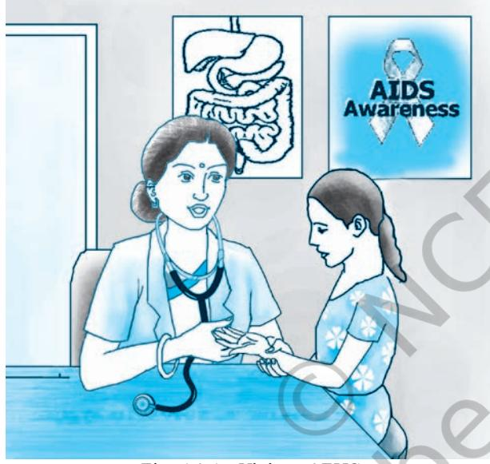

## **14.1 Introduction**

India is the second most populous country in the world with a total population of over 1.21 billion according to the 2011 Census. Adolescents (10–19 years) constitute over one-fifth of the total population, and their number is estimated to be about 243 million. They represent a resource for the future whose

*Fig. 14.1 : Visit to AFHS*

potential needs to be nurtured in a positive manner. The adolescents are considered to be healthy as a group; however, they do have a range of health problems that cause a lot of morbidity as well as mortality. In spite of specific health problems, it is a common observation that the existing health services do not cater to the specific problems of adolescents. Moreover, it is a challenge for the health sector to respond to their needs adequately by offering services in a friendly manner in a non-threatening environment. In this chapter, an attempt has been made to discuss the health needs of adolescents, the status of existing adolescent friendly health services and the manner in which these services can be made available to adolescents so that these can be adequately utilised by them.

## **14.2 Health Needs of Adolescents**

As you have realised while going through the chapters 'Growing up with Confidence' and 'Diet for Healthy Living', adolescence is the most significant period in the life of human beings. It is imperative, therefore, that the needs of adolescents be recognised and met adequately. Their health needs are mentioned below.

- **(i) Nutritional Needs:** as discussed in the previous chapters, many boys and girls enter adolescence undernourished, making them more vulnerable to diseases. The findings of the National Family Health Survey 3 (NFHS 3) indicate high percentage of anaemia (56 per cent of females and 25 per cent of males in 15–24 age group were anaemic). Anaemia affects physical
growth, cognitive development and performance in school and at work in later years. Anaemic women are more prone to give birth to malnourished children, with significant morbidity and mortality associated with both mother and child. Adequate nutrition and healthy eating habits and physical exercise at this age are foundations for good health in adulthood.

- **(ii) Reproductive and Sexual Health Needs:** the adolescents confront a number of reproductive and sexual health problems. They hesitate to seek information from authentic sources as such issues are considered taboo in our society. There is always a possibility of their practising risky behaviour, thereby acquiring HIV and other sexually transmitted infections. According to National AIDS Control Organisation, almost 50 per cent of new HIV infections are taking place in 15–24 years age group (NACO 2005). The adolescent girls suffer due to a number of myths related to menstruation. Early marriage is still a serious problem in many parts of the country. A substantial number of adolescent girls, mostly married girls, become pregnant and give birth to children below the legal age of marriage which is 18 years. According to NFHS 3, twelve per cent of married young women aged 15–19 have become mothers and 4 per cent of women ages 15–19 are currently pregnant with their first child. This means that one in six women in the age group. 15–19 years begun child bearing. This phenomenon of early pregnancy adversely affects the health of both mothers and children and is the cause of mortality and morbidity among them.
 Sexual harassment in public places, institutions of education, in and around neighbourhood and at the workplace is a well established fact. Child abuse, bullying and ragging are also common, more so among boys.

- **(iii) Mental Health Concerns:** it is estimated that at least 20 per cent of youth experience some form of mental problems such as depression, mood disturbances, substance abuse, suicidal behaviour, eating disorders, aggression, violence. Among 15–19 year olds, suicide is the second leading cause of death, followed by violence in the family and community. In fact, effective and sensitive care of adolescent victims of violence is needed as one of the priority measures.
- **(iv) Substance Abuse:** tobacco and alcohol use among young people is emerging as a matter of concern. The projected number of drug abusers in India is about three

Chapter-14 Adolscent friendly health service.indd 195 08-11-2016 11:50:35 AM

million, and most are in the age group of 16–35 years (UNODC, 2003). Nearly 11 per cent were introduced to cannabis before the age of 15 years and about 26 per cent between the age of 16-20 years (UNODC and Ministry of Social Justice and Empowerment, 2004). Findings of NFHS 3 show that in the age group of 15– 19 years, 3.5 per cent women and 28.6 per cent men were using some kind of tabacco. Similarly, in this age group 1 per cent of women and 11 per cent of men were consuming alcohol. Further, 6.8 per cent women and 18.3 per cent men were drinking about once a week.

- **(v) Accidental Injuries:** accidental injuries are a leading cause of death and disability in adolescents, of which road traffic injuries, drowning and burns are the most
## **Activity 14.1**

Talk to your friends or classmates and make a report.

- if they are aware of adolescent friendly health services and if they have ever visited the place where such services are available.
- if they have visited, what has been their experience, and if they have not visited any, what are the reasons for not doing so.

common. Injury rates among adolescents are the highest. Public education targeted at young people on how to avoid accidental injuries during driving and using road, drowning, burns and falls can reduce injuries.

In order to address the above needs, adolescent friendly health services have been developed. These adolescent friendly health services have been designed specifically to attract them, meet their needs conveniently and retain them for continuing care. We have to take note of an important fact that adolescents are not a homogeneous group. Their situation varies

with respect to age, sex, marital status, class, region and cultural context. This calls for interventions that are flexible and responsive to their needs.

## **14.3 Adolescent Friendly Health Services (AFHS): What does this mean?**

As we have seen, the health needs of young people are special in many respects. Therefore, there is a need to establish special services for them. These services are called "Adolescent Friendly Health Services" (AFHS). They have a specialised approach for giving adolescents preventive, promotive and curative health care. These services are mostly run by the government and in them diagnostic, treatment, counselling and other facilities related to health are offered for free or at a very minimal charge.

## **14.4 Need for AFHS**

Specialised services are needed for adolescents because they are still in the developmental stage. They have a lot of concerns,

Chapter-14 Adolscent friendly health service.indd 196 08-11-2016 11:50:35 AM

apprehensions and lack of understanding regarding their own needs. The adolescents feel shy, embarrassed and hesitant in talking to adults, especially regarding matters that are personal. Most adolescents avoid seeking care and guidance. They feel more comfortable in discussing their problems and concerns with their peers who also do not have scientific knowledge. In view of this, separate adolescent friendly health services need to be provided. Such special clinics can take care of all the concerns of the adolescents in an ambience in which they can utilise services without any hesitation.

## **14.5 Why do Adolescents Hesitate in Utilising Health Services?**

In additon to some of the reasons cited above, think of the reasons as to why the adolescents do not avail the health services. In fact, they face constraints in seeking services due to barriers such as:

- (i) Myths and misconceptions related to the development of sexual and reproductive organs.
- (ii) Lack of knowledge of the location of the health services or the kinds of services offered by them.
- (iii) Adolescents are not able to go to clinics as their timings do not match their schedule. They cannot miss school and college classes to visit these clinics.
- (iv) Lack of privacy and confidentiality in health clinics.
- (v) Long waiting period in the public health clinics.
- (vi) Cannot afford the fees of the private set up.
- (vii) No transport or means to go to these clinics, specially in rural areas. Moreover, they are unable to afford the cost of visiting these clinics.
- (viii) Negative attitudes or judgemental behaviour of nurse/ doctor.
- (ix) The routine hospitals do not entertain adolescents coming alone, especially when they have issues regarding sexual and reproductive health. Most hospitals require the parent to accompany them and/ or to give permission for any procedure or testing as per the legal requirement.

## **14.6 Where are AFHS Located?**

Adolescent Friendly Health Services are located at various places, in hospitals and health centres or at other places. There are three major models of the location of such services:

#### **Fixed Site Models**

- 1. Hospitals, both public and private in urban areas.
- 2. Clinics and Health centres in cities.

## **Activity 14.2**

Visit an Adolescent Friendly Health Service Centre. Discuss with the nurse/doctor the myths and misconceptions usually experienced by adolescents.

Chapter-14 Adolscent friendly health service.indd 197 08-11-2016 11:50:35 AM

- 3. Primary Health Centres and other Rural Health Centres, specially under NRHM (National Rural Health Mission) by the Ministry of Health and Family Welfare, Government of India.
#### **Outreach Models**

- 1. School based or linked clinics
- 2. Workplace clinics
- 3. Satellite clinics
- 4. Mobile clinics
- 5. Departments associated with Ministry of Health and Family Welfare like National AIDs Control Organisation (NACO) and Ministry of Youth Affair and Sports like Nehru Yuva Kendra (NYK).

#### **Adolescent services can also be delivered by**

- 1. Telephone helplines which have toll free (no charge) numbers
- 2. Call-in radio talks
- 3. Websites that answer questions by email and
- 4. Partnering with existing agencies that serve youth, like National Scout Association, (NSS) National Service Scheme, etc.

## **14.7 Characteristics of AFHS**

#### **14.7.1 Role of the staff working in the AFHS**

The Ministry of Health and Family Welfare (MoHFW), GOI, is making efforts to train the staff at health care centres to deal with adolescents. In case you or any of your friends has any problem or is concerned about any issue, you should visit the AFHS centre and discuss the same with the nurse or doctor available. The staff has now been adequately trained to handle adolescence issues through discussion and counselling. The staff of adolescent friendly health centres is expected to:

- **Show respect for adolescents:** the staff need to be nonjudgmental and non-critical of the issues an adolescent comes to the clinic with, including issues regarding sexual and reproductive health.
- **• Know importance of privacy and confidentiality:** the trained staff should provide privacy in physical examination without any embarrassment. The doctors, nurses and other staff should not divulge information about the adolescent patient to the parents or acquaintances, about what they came to the clinic for. They will need to tell parents only after informing the adolescent about the legal need or in view of protecting life and health of the adolescent.

## **Activity 14.3**

Find out the AFHS centres that are located near your school or home or in the district. Make a list of their addresses and contact numbers which can be useful to yourself and to your friends. Display this list on the board for the benefit of all.

## **Box 14.1**

Visit a website aeparc.org for information related to adolescence.

Chapter-14 Adolscent friendly health service.indd 198 08-11-2016 11:50:35 AM

- **Spend adequate time and show lot of patience:** The staff needs to be trained to give adequate time to make the adolescent feel comfortable to discuss all issues related to puberty such as body image, relationships and sexuality.
- **• Introduce adolescent to local peer educators:** Most young people prefer talking with their peers about their personal and sensitive issues. Hence, peer educators are also introduced to the adolescents.

## **14.8 Special Services Rendered to Adolescents in the AFHS**

Special services provided by the AFHS to adolescents are:

- monitoring growth and development of adolescent and providing the required information about changes;
- promoting healthy diet to prevent malnutrition and obesity;
- encouraging adolescents to take missed vaccine doses for immunisation;
- counsel them about the prevention of intentional injuries;
- advise them against substance abuse;
- counsel them on life skills related to sexual and reproductive health; and
- tell them about prevention of lifestyle dieseases and other common diseases like STIs, AIDS, heart disease, diabetes and so on.

## **14.9 Adolescents other than Students who may Need AFHS**

Being in school you will be able to get information about AFHS. But there are certain sections of adolescents in the society who are at a higher risk, need special care and are difficult to reach as they are not in schools.

#### **These special categories of adolescents include:**

- 1. Street youth
- 2. Adolescents working in shops and other establishments
- 3. Domestic help
- 4. Youth in foster care
- 5. Institutional inmates (in juvenile homes)
- 6. Youth with special needs.

Having understood the importance of AFHS, you should make efforts to make these adolescents aware of AFHS, and help them access these services.

AFHS are set up to meet the special needs of adolescents. You can go to the AFHS alone and receive services. Services are provided for you to understand all issues regarding

## **Activity 14.4**

One of your friends is showing signs of depression. she/he comes to you for help. You ask if she/he would like to go to AFHS for help. She/he is not willing to go to AFHS. How will you convince her/him to go to AFHS. Write three arguments or counselling points that help you to convince your freind to go to AHFS.

Chapter-14 Adolscent friendly health service.indd 199 08-11-2016 11:50:35 AM

## **Activity 14.5**

- 1. Visit the nearby AFHS with your teachers. Discuss with the Nurse/ Doctor the most common problems with which the adolescent boys and girls come to the centre.
- 2. Does the staff ensure that privacy and confidentiality of adolescents is maintainted? Write your findings in your diary.
- 3. Talk with some of the youth attending the AFHS and find out how useful these services are ?

puberty, maturity growth and development, relationships, nutrition and matters related to reproductive health. You will be given all the necessary advice and treatment. The doctor will always respect your privacy and confidentiality. In certain situations where the parents need to be informed as per the requirement of the law or for your personal safety, the doctor will first inform you the need to tell the parents and then only, with your cooperation, inform your parents. One should not stigmatise a person going to an AFHS. In fact, he or she should be admired for awareness. Adolescents with special needs may seek guidance from a specialised centre which may not necessarily be only on sexual issues.

#### **Answer the following questions**

- 1. Why are special health services needed for adolescents? Give four reasons.
	- i. …………………………………………………….
	- ii. …………………………………………………….
	- iii. …………………………………………………….
- iv. ………….………………………………………… 2. What are the common barriers which prevent adolescents
	- from using the health facilities?
- 3. Explain the various health needs of Adolescents.
- 4. "Reproductive and sexual health problems are the most difficult to share with the AFHS doctor." Why? Give at least three reasons.
	- i. ……………………………………………………. ii. ……………………………………………………. iii. …………………………………………………….

#### **From Questions 4 to 7 tick (**P**) the options which you feel are correct. You may tick more than one option.**

- 1. The adolescents do not go to hospital due to:
	- (a) lack of privacy.
	- (b) not sure of confidentiality.
	- (c) cannot afford fees.
	- (d) timings not suitable.
	- (e) don't feel comfortable.

Chapter-14 Adolscent friendly health service.indd 200 08-11-2016 11:50:35 AM

- 2. An Ideal facility for AFHS should
	- (a) be away from the city.
	- (b) have convenient timings.
	- (c) maintain privacy and confidentiality.
	- (d) be near the villages.
- 3. The staff in AFHS should:
	- (a) be specially trained staff who are able to understand the adolescent issues.
	- (b) be non-judgmental.
	- (c) respect adolescents.
	- (d) have a lot of patience and time to understand the adolescent problems.
- 4. Special services delivered in AFHS are:
	- (a) sexual and reproductive health issues.
	- (b) nutrition counselling.
	- (c) treatment of cancer and acute diseases.
	- (d) prevention of substance abuse.
	- (e) eye operation.
	- (f) immunisation.
	- (g) specially challenged youth.
- 5. List the services which you would like to be addressed in the AFHS.
	- (a) ..............................................................................
	- (b) ..............................................................................
	- (c) ..............................................................................

Chapter-14 Adolscent friendly health service.indd 201 08-11-2016 11:50:35 AM

# **Feedback Questionnaire**

(Textbook on Health and Physical Education Guide for Class IX)

Please give your comments on the textbook by filling this feedback questionnaire. Please send the duly filled questionnaire to the undersigned, Department of Education in Social Sciences, NCERT, Sri Aurobindo Marg, New Delhi-110016.

While answering a question if you find the space inadequate, please attach a separate sheet. All questions are meant both for teachers and students. You can provide your feedback in English or Hindi. Even parents if desire can respond.

| Teacher/Student/Parent |
| --- |

Name ______________________________________________________

School Address _____________________________________________

- ____________________________________________________________ 1. Do you find the Textbook easy to understand? Yes/No
___________ ___________ __________ ___________ ___________ __________ ___________ ___________ __________

- 2. Point out chapters/pages where the language is difficult to understand.
____________________________________________________________

Chapter No. Page No. Lines

- 3. Do you think the content of the book is adequate to meet the requirements of the syllabus? Yes/No
 _______________________________________________________ _______________________________________________________ _______________________________________________________

- 4. (i) Point out chapters which are lengthy
(ii) Point out chapters which are too sketchy

- 5. Point out illustrations which are not helpful in understanding the content.
___________ ___________ __________ ___________ ___________ __________ ___________ ___________ __________

 ________________________________________________________ ________________________________________________________ ________________________________________________________

Page No. Illustration Caption

Chapter-14 Adolscent friendly health service.indd 202 08-11-2016 11:50:35 AM

- 6. (i) Certain practical activities and games have been suggested. How many activities and games have you undertaken in your class? Mention them.
 ________________________________________________________ ________________________________________________________

 ________________________________________________________ ________________________________________________________ ________________________________________________________

- (ii) What difficulties did you face in organising these activities and games?
- (iii) Would you like to suggest any activity(ies). Mention these.

________________________________________________________ ________________________________________________________ ________________________________________________________

- 7. Certain questions have been given in boxes in the text of chapters.
	- (i) Do you try to find out their answers? Yes/No
	- (ii) Are these helpful in understanding the text of the chapter? Yes/No
	- (iii) Do you find these questions interesting? Yes/No
- 8. (i) Do you find the exercises given at the end of each chapter In the textbook interesting? Yes/No
	- (ii) Point out the exercises which according to you should be modified.
		-

Page No. Exercise No.

- 9. Point out the printing errors, if any. Page/Para. No. Error
 __________________ ___________________ __________________ ___________________

> ________________________________________________________ ________________________________________________________ ________________________________________________________

- 10.Any specific comments / suggestions for overall improvement of the textbook.
__________________ ___________________

__________________ ___________________ __________________ ___________________ __________________ ___________________

Chapter-14 Adolscent friendly health service.indd 203 08-11-2016 11:50:35 AM

Chapter-14 Adolscent friendly health service.indd 204 08-11-2016 11:50:35 AM

