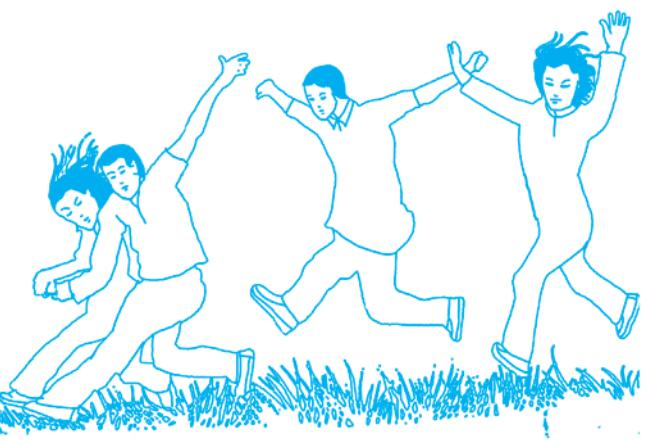

## **Box 2.1**

Adolescence is the period of transition between childhood and adulthood in human lifespan. It is generally been between 10-19 years of age. It is a period of rapid physical, cognitive, socio-emotional and behavioural changes. WHO states that- "there are certain attributes that mark adolescence which include appearance of secondary sex characteristics (puberty), attainment of reproductive maturity, development of adult mental processes and adult identity and transition from total socio-economic dependence to relate independence".

## **2.1 Introduction**

You have already learnt about growing up as adolescents in Class VIII through your science textbook. Growth is a natural phenomenon. Growth is a characteristic feature of all living beings. You must have seen seeds growing into seedlings, which then grow and develop into plants, or pups growing into dogs, kitten into cats and so on. Similarly an infant passes through different phases of growth from childhood to adolescence to adulthood. Although all the stages of growth and development are significant, it has been universally recognised that the stage of adolescence is the most critical one.

This chapter deals with the pattern of human growth with special emphasis on the growth spurt that takes place during adolescence which means by rapid changes in the body, psyche and behaviour. An adolescent, well aware of pubertal changes, must be able to understand and accept the changes with confidence, and not fall into the trap of escapist strategies such as drug abuse. *Growing up with confidence* needs proper understanding of various issues and concerns related to adolescence such as growth and development, self-concept and self-esteem, anxiety and depression, nutritional needs and sexual desires or any kind of harassment. Understanding these issues and concerns will help develop a positive attitude towards gender concerns and building healthy relationships.

## **2.2 Growth: A Natural Phenomenon**

Recognition of adolescence as a distinct stage in the development of human beings began during the early part of the 20th century. Growth during adolescence is mostly portrayed as an exclusive characteristic of this period, making one believe that growth during other stages — childhood, adulthood and old age is hardly significant. But you would have observed that we have all been growing up since we were born without consciously realising it. We can appreciate the phenomenon of growth during all stages of human life by undertaking the following activities.

## **2.2.1 What is Growth?**

Let us understand what is growth? Growth may be defined as the quantitative increase in size or mass. When weight is measured in kilograms and height in centimetres from time to

## **Activity 2.1**

- 1. You may collect pictures from old magazines or newspapers and paste them on a sheet of paper to exhibit the life history of a plant or an animal or stages of human lifecycle beginning from infancy to old age. You may even draw them.
- 2. In your diary, list the changes that you have undergone from the time you were nine years old, till now. Mention physical, emotional as well as psychological changes which you experienced. Prepare a write-up on those changes particularly focusing on whether the changes that made you feel surprised or stressed till you realised that these changes are normal and natural. You may discuss these changes with your friends. You will realise that these changes during adolescence do not begin at the same age in all the growing children.

time, we can know how much growth has occurred in a child. When the organs of the body grow, the number, the size and the weight of their cells increase. Growth can be measured in terms of the change in length, width, depth and volume in a specific time period. Although growth is a characteristic of living beings, in all living beings, the rate of growth also depends on nutrition and living conditions, including the environment at home.

#### **2.2.2 Growth, Development and Maturation**

Growth, development and maturation occur side by side. Growth is a quantitative increase in size through increase in number of cells or elongation of cells. Development may be defined as the progression of changes, both qualitative and quantitative, which lead to an undifferentiated mass of cells to a highly organised state. Maturation is a measure of functional capacity. For example, a child begins to speak by making unintelligible sounds. Then, slowly it acquires the capacity for speaking in a manner, which is easily understood by others. Another example of maturation is when a child begins to crawl and then matures to a state of walking on two legs. Similarly, organs of reproduction reach maturity at the end of puberty.

## **2.3 Determinants of Growth and Development**

Although age related events of growth, development and maturation in human beings are mostly the same in all cultures, however, some variations do exist. This is because growth is affected by both genetic and the environmental factors. Growth is also influenced by the socio–cultural context. For example, in the economically backward families, the growth of family members gets stunted due to undernourishment. But even in economically sound households, the members may not be taking a nutritious diet. Many children who eat junk food all the time become obese. In fact, growth and development of a human being is a result of a combination of heredity and environment.

Chapter-2 Growing up with confidence.indd 17 08-11-2016 11:05:38 AM

#### **2.3.1 Role of Heredity**

Parents contribute genes to their biological offspring, so the children tend to resemble their parents in stature, body proportions, body composition, and pace of growth and development. Individual genes, however, are not solely responsible for growth, nor do they directly cause growth. Several genes jointly control growth. The hormonal and nervous systems also have an important role to play. Hormones from endocrine glands provide the requisite environment for gene action throughout life. For example, growth spurt during adolescence requires the secretion of adequate amounts of growth hormones into blood so that the genes regulating growth of skeleton, muscles and fat become active to the required extent. Because of inheritance, children of tall parents are likely to be tall and children of short parents tend to be short. One needs to understand the role of heredity in the context of development of body physique. Therefore, one should not develop a negative or positive image of oneself on the basis of one's physique. Also, some individuals have a constitution which makes them look tall (ectomorphic), some medium sized (mesomorphic) and some have a small but rounded built (endomorphic). Thus, a normally growing adolescent should not base self-image on these factors as they are beyond one's control.

#### **2.3.2 Role of Environment**

Growth and development are also influenced by environmental factors. The role of nutrition, child rearing practices and the psycho-social environment provided by the family is very critical. **Nutrition:** A nutritious diet favours growth. Growth requires multiplication of cells or enlargement of cells, which depends on an adequate supply of nutrients. In fact, at every stage, the body needs a basic level of nutrients for its sustenance. Nutrition is, therefore, the most important external factor for growth. You have learnt in earlier classes in your science lessons that essential nutrients in a human diet are:

- 1. Proteins and amino acids
- 2. Carbohydrates and sugar
- 3. Lipids fats and oils
- 4. Minerals Macronutrients: Calcium, Phosphorus, Sodium, Potassium, Sulphur, Chlorine, Magnesium. Micronutrients: Iron, Zinc, Manganese, Iodine, Cobalt, Copper, Molybdenum, Nickel.
- 5. Vitamins Vitamins are of two kinds Fat soluble: Vitamins A, D, E, K Water soluble: Thiamin, Riboflavin, Niacin, Folic Acid.
- 6. Water

## **Box 2.2**

Deficiency of iodine in food causes retardation of mental and physical growth. Can you now explain the importance of consuming iodised salt?

Chapter-2 Growing up with confidence.indd 18 08-11-2016 11:05:38 AM

Nutrients are obtained from food. Both quality and quantity of food are important. Food provides energy, and energy (in kilo calories) is required not only for growth but also for maintenance of the body, its working as well as reproduction.

A balanced diet contains all the nutrients in appropriate quantities. Undernutrition during childhood results in slow growth and delayed maturation. If continued into adolescence, it leads to short stature adulthood. Nutritional needs during adolescence are more than that during childhood. Dietary deficiencies retard the growth. The nutrient requirement however varies among adolescents since rate of physical growth is not the same in all. In populations with food shortage, growth of children is delayed. They may be shorter or of less weight due to malnutrition or undernutrition.

## **Activity 2.2**

#### **Read the following case studies carefully and reflect on the question asked at the end of each case study.**

**Case 1:** Fourteen years old Suleman and George were very good friends who also shared their birth date. Suleman's parents were quite tall. While Suleman was 5 feet 6 inches tall, George was only 4 feet 9 inches. George wanted to be of the same height as Suleman and would hold on to a rod and hang from it but to no avail. Then they approached the counsellor in school.

Guess what counselling was given by the counsellor?

**Case 2:** Suresh was a small-built boy studying in Class IX. Not only was he short and skinny but also had a tired look on his face. After a medical examination by the school doctor, parents took good care of Suresh. By the time Suresh got into Class XI, he was as grown up as his classmates. The doctor gave no medicines to Suresh.

How do you think Suresh attained normal growth?

#### **2.3.3 The Psycho-social environment**

The quality of emotional and psychological environment in which a child lives and grows do influence the hormonal balance of the body, thereby affecting growth. Growth gets retarded as a result of emotionally stressful environment.

Physical and psychological stress together have been found to influence growth and development in girls with respect to menarche and menstruation. The age of attaining puberty among boys and girls varies. Some adolescents show signs of early maturation, while others mature late. Highly competitive track athletes who enter training before puberty have been found to show delayed menarche. It is possible to explain the delay due to the elevated levels of certain hormones in blood during severe physical exercise. These hormones delay

Chapter-2 Growing up with confidence.indd 19 08-11-2016 11:05:38 AM

#### **Read the following case study carefully and reflect-**

#### **Case 3:**

Neeta and Sheena have been friends since they were five years old. They sit together in class. They come to school together as they are also neighbours. When they were 12, Neeta began to menstruate. Sheena showed breast development but no signs of menarche even when she was 14. Both friends spoke to the teacher about their worry regarding Sheena.

What do you think the teacher said which rid them of their anxiety?

the onset of menstruation. The timing of menarche is possibly the best researched adolescent event known to be affected by factors like heredity, nutrition, illness, socio-economic status and psychological condition.

#### **2.3.4 Socio-economic Status**

Socio-economic status also affects growth. Poverty and low socio-economic status lowers the rate of growth in youngsters. Such retarded growth in socially weaker sections of the society is linked to heavy physical

labour and the stress associated with it. Malnutrition and an unhygienic environment is also not congenial for growth.

## **Activity 2.3**

#### **Read the conversation between Srinivas and his friend Ali**

Srinivas of Class IX (age 13) who is short and skinny is teased by his classmates, who call him 'dwarfy'/'*bauna*'/'*gittha*'. Srinivas stops going to school. One day his class friend Ali meets him in the market and enquires about his absence from school.

**Ali:** A lot has been done in the class and exams are approaching. Why are you not coming to school? Even the teacher was commenting on your absence.

I am your friend. Tell me what is wrong. I shall try and help you.

**Srinivas:** He breaks down. We are six siblings living with our parents in a small shanty (*jhuggi)*. My father is alcoholic. My mother works harder than her body can allow, for earning some money for the family. There is never enough to eat. We are always fighting. On top of that the bullies of the class tease me. In any case, I need to supplement family income by taking up a job.

Analyse the situation, which led to slower growth and natural development in Srinivas.

What are the factors affecting the growth of Srinivas?

If you are Ali, what will you do.

## **2.4 Self-concept and Self-esteem**

Growth and development during adolescence do affect selfconcept and self-esteem. The concept of 'self' becomes evident in boys and girls as they enter their 'teen' age. Several changes begin to occur in their body and psyche. As a result, the attention is focused towards 'self'. As the concept of 'self' develops, it makes the teenager develop less dependence on parents. Self-image becomes important not only for oneself

Chapter-2 Growing up with confidence.indd 20 08-11-2016 11:05:38 AM

but also in the eyes of others. There is a tendency for looking into the mirror and admiring oneself. Grooming oneself to look beautiful or handsome to others is always at the back of the mind of young boys and girls.

Support and guidance from parents and teachers and friendship with peers help in developing 'positive self-esteem'. Self-esteem is also a kind of self-recognition. It is important for growing up with confidence.

The consequences of low self-esteem and self-image are detrimental to efficiency. Try to have high self-esteem and a positive self-image.

Peer group is important because friends and peers may help to sort out confusions regarding rapidly occurring changes in the body. Similar changes in friends of the same age reassure that all is normal. As adolescents grow, they emotionally move further from parents to become independent adults. Acceptance among peers becomes important. Company of wrong peers or adults becomes risky during early adolescence.

## **2.5 Psychological Security**

For developing self-confidence and self-esteem, it is essential to have a stress-free environment. Adolescence is a period of losses—loss of childhood, loss of sexual innocence, loss of freedom from responsibility. Adolescents need parental support to cope with these losses.

Psychological security depends a lot on how a boy or girl was valued by the family as a child. You may have seen that teenagers who have experienced encouragement from others with respect to values and parental expectations tend to be psychologically more secure than those who are subjected as children to shame and punishment.

A psychologically secure teenager is able to concentrate on studies, have respect for parents, spend time judiciously on hobbies and establish healthy relationships. Adolescence has to be viewed as a period of gains too— the adolescent attains a beautiful physique, figure and face. Another gain is the maturity of brain, which leads to rational thinking and better understanding of subjects and issues. But to ignore the losses and carry the gains forward, support from parents/guardians, teachers, and peers goes a long way in helping the youngsters cope with changes occurring during adolescence.

## **Box 2.3**

#### Did you know?

- Awareness of positive qualities makes one feel good and enhance self-esteem.
- When we feel good, we respond to every situation more positively.
- Appreciating others makes us feel good.

## **Activity 2.4**

Write ten sentences on 'Me — in my own eyes', in your diary. Analyse your writing. Do you feel that you have desirable selfesteem and selfconfidence? Express your feeling in three sentences.

*Source: Poster designed by Laxmi Narayan Mochi from Class XII JNV, Mandaphia, Chittorgarh, Rajasthan Fig. 2.1 : Peer Group*

Chapter-2 Growing up with confidence.indd 21 08-11-2016 11:05:39 AM

## **Box 2.4**

#### **Read carefully the following situations and try to respond to the given questions.**

**Situation 1:** Shalini and her friends in Class IX were preparing for the school's annual function. All of them were very excited. Anita, one of Shalini's classmates, mocked at her, "You are so dark. We will need additional light to be able to see you on the stage."

Shalini's good friend, Madhu, felt bad for Shalini and advised her to use a cream to make her complexion lighter. "You already dance so well. Can you imagine how nice you will look on the stage if you had a lighter complexion?"

Shalini smiled and said, "Thank you, Madhu. I appreciate your concern but I am happy with my complexion. My teacher and I am working hard on my dance practice and I am confident that our efforts and your good wishes will lead to a good performance."

- 1. What do you think of Anita's remark about Shalini?
- 2. Do you think that having a light complexion is important for being beautiful?
- 3. Do you think that Madhu is trying to perpetuate the stereotype that having a light complexion is an important component of being beautiful?
- 4. What do you think of Shalini's response?

**Situation:** Raja has an overbearing father who also becomes cruel if he is angry at Raja. Raja hates to go home. He roams around with his friends till dinner time. He feels he is good for nothing.

- 1. How can Raja's plight be improved?
- 2. Who can help and how. Substantiate your answer with reasons.
- (a) Teacher (b) Counsellor (c) Classmates (d) Parents (e) All

*Fig. 2.2 : Parent-child Communication*

#### **2.5.1 Psychological Insecurity and Mental Illness**

Psychological insecurity expresses as anxiety and depression and in severe cases may result in psychosis, which is a mental disorder. Psychologically insecure individuals may even attempt suicide.

## **2.6 Anxiety and Depression**

During growing up, adolescents also become victims of anxiety and depression.

#### **2.6.1 Anxiety**

Anxiety is not abnormal. Everyone gets the feeling of anxiety sometime or the other. Anxiety is an apprehension of something unpleasant or some danger. It causes mental discomfort and pain. It may sometimes prove to be useful, for example, before an examination or competition. But an abnormally high level of anxiety is counter productive as it distracts and lowers the span of attention. Adolescents sometimes panic out of anxiety without knowing the reason. They may even feel a fear of failure in future. This makes them tense and tired. Anxiety may

Chapter-2 Growing up with confidence.indd 22 08-11-2016 11:05:40 AM

manifest as a need to get medical treatment for an imaginary sleep disorder or some other physical complaint. It may also manifest as over breathing (hyperventilation syndrome). Anxiety may even be due to separation from parents or even for having to attend school out of compulsion or due to sex drive. Adolescents may try to get out of anxiety by self-help. The right treatment for anxiety lies in seeking help from parents, teachers, counsellors and even friends.

#### **2.6.2 Depression**

Feeling 'sad' or low is common among the adolescents. If the feeling is short-lived there is no problem. But sometimes symptoms of depression show up as social withdrawal, need to weep, eating and sleeping problems, and feeling of dejection and hopelessness. Depression at times leads to hostility towards parents, society and peers. 'Anger' is sometimes a psychological reaction for fighting depression. If an individual faces pressure, he/she should be empowered to access or seek information, advice, support through appropriate communication from significant adults such as the parents, teachers, elders, relatives, peers, counsellors and health professionals. The best way to get out of depression is to engage oneself in various types of physical activities and hobbies.

#### **2.6.3 Psychosis**

Psychosis is a medical term for a serious illness in which the patient loses contact with reality. The perception in the patient's mind has no connection with reality of the outside world. The quality of relationships declines progressively and contact with others lessens with time in a psychotic person. A psychotic may also suffer delusions and hallucinations in which the patient imagines voices and happenings which are far from real. Psychosis may result from abuse of alcohol and drugs, injury and traumatic events.

#### **2.6.4 Suicidal Tendency**

Depression and suicidal tendencies often go together. It is unfortunate that often a trivial problem drives a person to commit suicide. The person feels that it is difficult to run away from unhappiness and death can be the only solution. Suicide in adolescents is mostly due to a sense of guilt or failure. Suicidal behaviour is usually impulsive. It is attempted to punish the self or a loved one. Often suicide is followed by a quarrel with a loved one. It springs from loss of reasoning, which is usually temporary. For teenagers, or for that matter for everyone, it is important, therefore, to think about the consequences

Chapter-2 Growing up with confidence.indd 23 08-11-2016 11:05:40 AM

before taking any extreme step. The need is to take care of such adolescents and help them overcome depression. It is the responsibility of the parents to take to the child or consult a counsellor if they see any symptoms of depression before it is too late.

## **2.7 Drug or Substance Abuse**

Young people are more vulnerable to drug or substance misuse and abuse due to peer pressure, poor self-esteem, low achievement at school or family history of drug or substance abuse. Drugs are chemicals. Some are used for treatment and help in recovery from an ailment. But when drugs are used for purposes other than treatment, their consumption becomes 'drug abuse' rather than 'drug use'. Many a time drugs given for medical treatment are also abused as in the case study given below.

Certain drugs serve no useful purpose; instead have adverse effects on the body. Drugs such as Marijuana, hallucinogens and tranquilisers which have an effect on the brain and drive the user into a make believe world of fantasy and provide false feelings of being free from problems. These are not only addictive but also have an adverse effect on the brain.

## **Activity 2.5**

#### **Read the following case and give your opinion.**

Raman, Robin and Rina, students of Class XII, are good friends. Robin lives in a hostel nearby. He once got a bad cold and cough. The doctor prescribed a cough syrup. Robin was soon cured. When Robin was ill, Raman and Rina used to visit his room regularly to know about his health and extend their help to him. Once, during such a visit, while Robin was taking his medicine he mentioned its good taste. Later, whenever Rina and Raman came to Robin's room, Raman would taste the cough syrup. He soon acquired such a strong taste that he went and bought the cough syrup for himself from the chemist. Now he has started consuming the syrup everyday and does not feel comfortable if he misses it even on one day.

#### **Answer the following questions by giving reasons.**

- 1. Whether taking cough syrup by Robin is 'use'? Why?
- 2. Whether taking cough syrup by Raman is 'abuse'? Why?
- 3. Think about some other substances which are also abused by adolescents?

Chapter-2 Growing up with confidence.indd 24 08-11-2016 11:05:40 AM

The table 2.1 gives the names and groups of drugs and their affects.

| Group | Drugs/Substances | Effect the user feels |
| --- | --- | --- |
| Stimulants | Amphetamines (eg. | • Temporarily accelerate functioning |
|  | Benzedrine, Dexedrine | of the brain (central nervous system) |
|  | and Methedrine, cocaine, | and the user may temporarily feel |
|  | nicotine, tobacco | alert and full of energy. |
|  |  | • In higher doses, stimulants may |
|  |  | lead to anxiety or panic. |
|  |  | • Mental health problems can occur |
|  |  | with increasing use. In cases of |
|  |  | serious overdose, death may occur. |
| Depressants | Alcohol, barbiturates, e.g. | Slow down activity of the brain and |
|  | Gardenal, tranquilisers like | may also have hypnotic effects. |
|  | Valium. |  |
| Sedatives | Hypnotics like Mandrax, | • Produce opium like effects and |
|  | Doriden | stupor. This group in short span |
| Narcotics/ | Opium, morphine, codeine, | may produce relaxing, but in higher |
| analgesics | heroin, brown sugar, | doses, these may lead to drowsiness, |
|  | synthetic drugs like | decreased concentration, nausea, |
|  | Methadone, Pethidine, | vomiting and sweating. |
|  |  | • Further increase in the dose may lead |
|  | Mephradine | to deep sleep, loss of consciousness |
|  |  | and even death. |
| Cannabis | Bhang (marijuana), ganja, | Distort the way in which individuals |
| Hallucinogens | charas, LSD (Lysergic | normally see, hear and feel. |
|  | acid Diethylamide) PCP |  |
|  | (Phencyclidine), Mescaline, |  |
|  | Psilocybin |  |

| Table 2.1 |
| --- |

Following symptoms of drug abuse are noteworthy.

#### **Physical Symptoms**

- Reddening and puffiness of eyes, unclear vision
- Running nose, congestion, coughing, pale face and dark circles under eyes
- Slurring of speech
- Nausea, vomiting and body pain
- Messy appearance, lack of cleanliness
- Drowsiness or sleeplessness, lethargy and passivity
- Loss of appetite, significant weight loss or gain
- Numerous fresh injection marks on body, blood stains on clothes, profuse sweating

Chapter-2 Growing up with confidence.indd 25 08-11-2016 11:05:40 AM

#### **Behavioural Symptoms**

- Changing mood, temper tantrums, hostility
- Acute anxiety, depression
- Blaming, lying, making excuses, emotional detachment
- Loss of interest in studies, sports and in daily routine
- Impaired memory and lack of concentration
- Secrecy in respect of possessions and actions
- Loss of valuables or money from home

#### **Performance Symptoms**

- Withdrawal from family environment and nonparticipation in family work
- Sudden lowering of grades in school, non-completion of home work, absenteeism
- Presence of needles, syringes and strange packets at home
- More time spent in personal room, in the bathroom or away from home

Drug abuse in itself is not a cause of HIV and AIDS or other STIs, but under the influence of drugs, people may engage in risky behaviour that makes them more susceptible to these infections. Furthermore, substance abuse influences not only the individual but also the family and even the community. The person who gets addicted often loses interest in other activities be it school, job or any other responsibility. As a result, the addicts are not able to undertake their responsibilities and become a liability for their families. Furthermore, it is expensive to buy substances/drugs on a regular basis. Hence, in desperation, addicted individuals may be forced to engage in petty crimes.

There can never be any need for drugs if one leads a meaningful life with nutritious food, physical exercise, yoga, satisfying occupation and healthy relationships.

## **2.8 Sexual Harassment or Sexual Abuse**

Sexual harassment is described as any unwelcome sexual gesture or behaviour, whether directly or indirectly–physical contact or advance, showing pornography, a demand or quest for sexual favour, or any other unwelcome physical, verbal/ nonverbal conduct. It also includes molestation and rape. It is a criminal act and a punishable offence. Young girls and boys often become target of sexual harassment/abuse by older and powerful people. As per the research, a person who is engaged in sexual abuse of young girls and/or boys is often known to them. Boys are equally vulnerable to sexual abuse. The black mailers usually threat the youngsters of serious consequences if they tell anyone. In such cases, the girl/boy being abused must immediately inform parents/or any trusted member for protection.

## **Box 2.5**

Saying 'No' with confidence is the only way to protect oneself from sexual harassment.

Read about Protection of Children from Sexual Offence (POCSO) Act 2012 and Discuss with your classmates

Chapter-2 Growing up with confidence.indd 26 08-11-2016 11:05:40 AM

## **Activity 2.6**

## **Read the following case studies and discuss the questions with your friends.**

**Case Study 1:** Mohit is ten years old. His uncle often comes over to Mohit's house and stays over. He brings lots of toffees and biscuits for him. He always insists on sleeping in Mohit's room. At times he tries to touch Mohit in ways that Mohit does not like. Mohit's parents notice that Mohit has become very quiet and withdrawn but does not share anything with them.

## **Questions for discussion**

- 1. Why do you think Mohit is uncomfortable with his uncle's behaviour?
- 2. What should Mohit's parents do when they notice that he has become very quiet and withdrawn?
- 3. Why do you think Mohit does not say anything to his parents?
- 4. Was Mohit's uncle abusing him? Explain your answer.

**Case Study 2:** Sabina and Monica study in Class XI and are friends. They go out to see a film. On the way out of the hall, they are teased and harassed by a man who passes obscene comments. Sabina wants to make noise about the incident and seek support from others around to confront the man and warn him. She also wants to complain to the cinema manager and insist that they act to make the hall safe for women. However, Monica is not sure of taking this stand. She feels that perhaps they should not go to cinema halls on their own to see films and should be accompanied by their parents or brothers who could protect them.

#### **Questions for discussion**

- 1. What do you think Sabina and Monica finally did? Why?
- 2. What would you have done if you were in Sabina's or Monica's place? Why?
- 3. Have you noticed, or heard of sexual harassment in cinema halls, roads, buses or other public places?
- 4. What can possibly be done to make public places safer for girls and women? Who all can make this happen? For example, cinema hall managers, police, sensitisation/ awareness campaigns by schools, girls like Sabina and Monica themselves by supporting one another, etc.

**Case Study 3:** Reena is a 16 year old girl and she studies in Class X. A boy Hemant in her class has been stalking her for some time now. He has even proposed to her and she has refused his 'proposal'. However, the boy went on troubling her, saying that " When a girl says no, she means yes". Reena is very angry. She wants to tell her teacher, but is scared the teacher may not understand.

#### **Questions for discussion**

- 1. Why do you think Hemant makes the comment "When a girl says no, she means yes"? What do you think of the comment?
- 2. What advice would you give Hemant if he was a friend of yours?
- 3. What advice would you give Reena if she was a friend of yours?
- 4. Do you think the teacher could play a positive role, if told about the situation? If yes, how?

*Source : NCERT, 2012 Training and Resource Materials : Adolescence Education Programme, New Delhi*

Chapter-2 Growing up with confidence.indd 27 08-11-2016 11:05:40 AM

## **Assessment**

## **Answer the following questions**

- 1. Give at least one difference between
	- (a) Growth and development ..............................................
	- (b) Development and maturation .......................................
- 2. Given below are nine statements. Categorise them into events of Growth (G), Development (D) and Maturation (M).
	- (a) A baby on seeing his mother begins to utter the word "MA".
	- (b) The testis begins to produce sperms.
	- (c) The fetal heart begins to beat.
	- (d) A plant observed in the garden a few months ago is now a shrub.
	- (e) The baby starts walking without support.
	- (f) Aruna has reached menarche.
- (g) Mary can no longer fit into her shoes that were bought for her last year.
	- (h) Haneef needs to shave everyday this year before going to school.
	- (i) In 2007, Dhruv was only 5 feet tall. On his 14th birthday, his height is 5 feet 10 inches.
- 3. List factors that affect growth.
- 4. The teenager should take nutritious diet, because............
- 5. Arun is worried because he is not as tall as others in his
- class. How will you dispel such unnecessary anxiety?
- 6. Prepare a worksheet writing the response in following things.
	- (a) Who all would you include as a support system in case of any problem to be sexual harassment? Think of both people and institutions.
	- (b) Why have you included them people/institutions as a safety net?

Chapter-2 Growing up with confidence.indd 28 08-11-2016 11:05:40 AM

- 7. Why is psychological security necessary for a growing adolescent?
- 8. "Communication between parent and the adolescent child is critical for his/her health." Why? ..............................................................................

..............................................................................

- 9. Give at least two reasons of substance abuse by adolescents.
	- (a) ..............................................................................
	- (b) ..............................................................................
- 10. Why is it necessary to discard the myth that 'women are the weaker sex'? Give three reasons.
	- (a) ..............................................................................
	- (b) ..............................................................................
	- (c) ..............................................................................
- 11. In dealing with the following challenging situations whom should adolescents approach and why?
	- (a) bullying
	- (b) discrimination by grandmother
	- (c) sexual abuse
- 12. "Growing up with confidence is not a myth." Explain"
- 13. Write a paragraph in your own words why "growth" is necessary for all living beings including humans.
- 14. What is depression. Give three symptoms.
- 15. Explain the difference between drug abuse and use with the help of examples.

## **Project**

- 1. Organise a debate in the class on the topic "Growth is natural so all teenagers grow and behave in the same way". 2. Conduct a survey in your neighbourhood picking up 20 boys and 20 girls and prepare a report on their height and weight. How many are overweight? How many are under weight? 3. Why do you think that both boys and girls should be given equal opportunities in life? Give three arguments in favour. (a) ........................................................................................................... (b) ........................................................................................................... (c) ............................................................................................................ 4. When heredity defines limits of growth and development, why bother about the environment? Give three arguments against this statetement. (a) .......................................................................................................... (b) .......................................................................................................... (c) ..........................................................................................................
Chapter-2 Growing up with confidence.indd 29 08-11-2016 11:05:40 AM

2024-25

