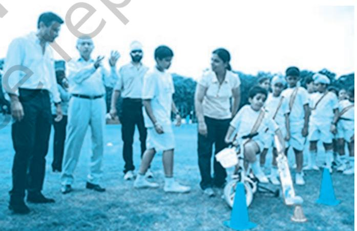
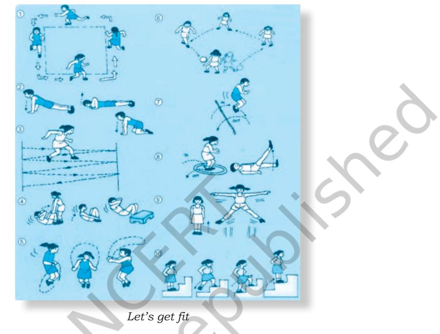
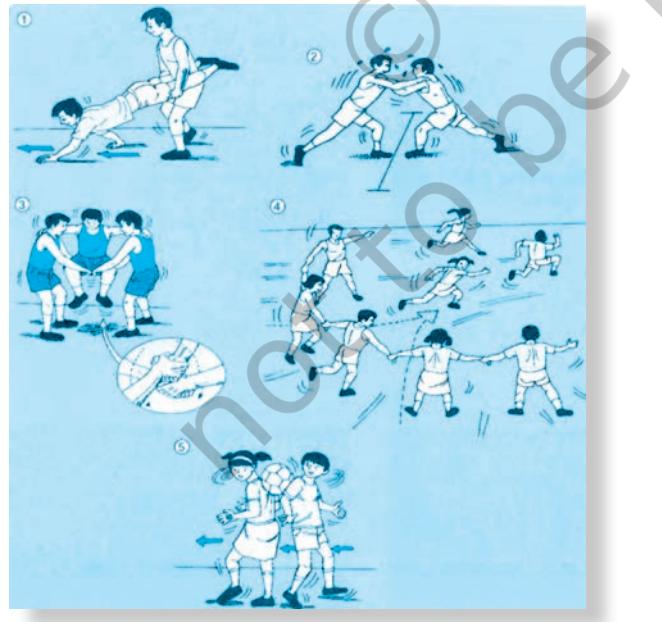

# **3.1 Introduction**

The concept of physical education is generally understood as organisation of some games, sports or physical education activities in schools. There are schools where specific periods are allocated for this subject in the time table. It has been noticed that during such periods, most of the students are either left on their own to play the games in a way they like or they are taken to the field where they engage themselves in different sports without the guidance or supervision of teachers. In some schools, selected students play games like football, cricket, volleyball, hockey, basketball, and so on. Annual sports are organised, but again in such activities only

# **Box 3.1**

## **Definitions**

## **1. According to Webster's Dictionary**

Physical education is a integral part of education which gives instructions in the development and care of the body ranging from simple calisthenic exercises to a course of study providing training in hygiene, gymnastics and the performance and management of athletics games.

## **2. Columbia Encyclopaedia**

Physical education and training, is an organised instruction in motor activities that contribute to the physical growth, health and body image of the individual.

- **3. Central Advisory Board of Physical Education and Recreation** defines Physical education as an education through physical activities for the development of total personality of the child to its fullness and perfection in body, mind and spirit.
a few selected students participate. All these experiences taken together provide a basic understanding of the physical education as a concept. However, when we go into details of the aims, objectives and concepts of physical education, we learn that they go beyond these traditional beliefs.

**3**

# **3.2 Physical Education**

As we know, education, particularly school education, aims at the holistic development of children. It provides students with opportunities to grow and develop as adults to be useful for the society. It is important for us to know that one of the most important requirements for growing into healthy adulthood is the physical growth which supports cognitive development. It is, therefore, necessary that all children get adequate opportunity to participate in free play, informal and formal games, sports and yoga activities. It is in this context that health has been made a significant component of the subject of Physical Education in the school education system of the country. The subject "Health and Physical Education" adopts a holistic definition of health within which physical education and yoga contribute to the physical, social, emotional and mental development of a child.

In view of the above, the meaning of physical education becomes a little different from what is commonly understood. Physical education comprises holistic education for the development of personality of the child to its fullest and perfection in body, mind and spirit through engaging in regular physical activities. Physical education through the medium of physical activities helps individuals to attain and maintain physical fitness. It contributes to physical efficiency, mental alertness and the development of qualities like perseverance, team spirit, leadership and obedience to rules. It develops personal and social skills among the learners and makes a positive impact on their physical, social, emotional and mental development. It also contributes to the total health of learners and the community. Physical education thus, can be defined as a subject that is not only focused on physical fitness but is also concerned with development of a number of skills, abilities and attitudes for leading a healthy lifestyle. It inculcates values like cooperation, respect to others, loyalty, self-confidence, winning with grace and losing with hope.

## **3.3 Objectives of Physical Education**

As discussed above, by now it may be clear to you that the aim of physical education is not only physical development but also to equip learners with knowledge, skills, capacities, values, and the enthusiasm to maintain and carry on a healthy lifestyle. It promotes physical fitness, develops motor skills and the understanding of rules, concepts and strategies of playing games and sports. Students learn to either work as part of a team, or as individuals in a wide variety of competitive activities. The main objectives of physical education are to:

- • develop motor abilities like strength, speed, endurance, coordination, flexibility, agility and balance, as they are important aspects for good performance in different games and sports.
- • develop techniques and tactics involved in organised physical activities, games and sports.
- • acquire knowledge about human body as its functioning is influenced by physical activities.
- • understand the process of growth and development as participation in physical activities has positive relationship with it.
- • develop socio-psychological aspects like control of emotions, balanced behaviour, development of leadership and followership qualities and team spirit through participation in games and sports.

Chapter-3 Physical Education.indd 31 08-11-2016 11:08:01 AM

- • develop positive health related fitness habits which can be practised lifelong so as to prevent degenerative diseases.
# **Activity 3.1**

- 1. Find out the following facts about your school and prepare a write-up.
	- • Periods allocated for physical education in your school?
	- • What do students do during physical education periods? How many students of a class actually participate in activities during such periods?
	- • What type of knowledge is provided by the teachers about the concerned games and sports related skills?
	- • What do the students do during these classes when they are left free?
- 2. Compare your write-up with the above objectives.
- 3. What will you do, if some of the objectives are not covered?

# **3.4 Scope of Physical Education**

Physical education has evolved as a multi-disciplinary subject over time and its scope is not confined to physical fitness and knowing the rules of games and sports. It includes many topics which belong to other subjects like science, biology, genetics, psychology and sociology. It is possible that all the contents that constitute the scope of physical education may not find a place in the syllabus meant for school education. However, it contains all the content areas as stated below.

### **3.4.1 Games and Sports as a Cultural Heritage**

The games and sport activities that you play today have a strong linkage to our culture. Sport activities which dominate any region is embedded in the cultural milieu. Some of the sports that reflect the culture of a region of our country are *Kho-Kho*, *Kabbadi*, Archery, Lezim, Wrestling and so on. Our

## **Box 3.2**

#### **Physical education consists of:**

- • games and sports as a cultural heritage
- • mechanical aspects in physical education
- • biological contents
- • health education and wellness contents
- • psycho-social content
- • talent identification and training contents.

ancestors survived on hunting with the use of throwing stones as well as bow and arrows, running, jumping etc. were used for survival and recreation. Later when man became more civilised, it took the shape of competitive sports like athletics, wrestling, archery and so on. So, we can see a strong bonding of our culture in the present evolution of games and sports.

#### **3.4.2 Mechanical Aspects in Physical Education**

Physical education takes into consideration the mechanical aspects of various physical activities being performed. You are aware that the concepts regarding laws of motion, lever, force and its generation, maintenance of equilibrium, centre of gravity and its impact on movements, law of acceleration, speed and

Chapter-3 Physical Education.indd 32 08-11-2016 11:08:01 AM

its development form important content areas of physical education. You will also study these aspects in your science textbook.

#### **3.4.3 Biological Contents in Physical Education**

The contents drawn from the biological sciences take into consideration the areas of heredity and environment, growth and development, organs and systems, understanding of joints classification, and possible movements around these joints. In addition, muscles and their properties, effect of exercise on various systems of the body (like circulatory, respiratory, muscular, digestive and skeletal systems) are also linked to physical activities.

## **3.4.4 Health Education and Wellness Contents in Physical Education**

Physical education includes contents related to the area of health education through understanding the concept of hygiene, knowledge about various communicable and noncommunicable diseases, problems relating to health and their prevention, proper nutrition and balanced diet. Community health, school health service programme, assessment of health status, prevention, safety and first aid for common injuries are also included in the scope of physical education.

### **3.4.5 Psycho-social Content of Physical Education**

Psycho-social aspect of physical education extends to the study of areas regarding individual differences, personality development, learning of various skills, motivation and its techniques, anxiety management, ethical and social values, group dynamics, cooperation, cohesiveness and learning. It also focuses on emotional development, relationships with peer/parents and others, self concept and self esteem.

### **3.4.6 Talent Identification and Training Content in Physical Education**

Physical education includes contents with regard to talent identification, development of components in relation to specific sport, understanding of various types of activities like aerobic, anaerobic, rhythmic and calisthenics. Training programmes, learning and perfection of various movements, sport skills, techniques and tactical patterns, warming up, load adaptation, recovery and cooling down are also a part of physical education.

## **3.5 Teaching-Learning Approach**

We have, so far, discussed the importance of physical education as a subject area in the school curriculum. It is an integral part of Health and Physical Education which is prescribed as

Chapter-3 Physical Education.indd 33 08-11-2016 11:08:01 AM

a compulsory subject at the Primary (Classes/Grades I-V), Upper Primary (Classes/Grades VI-VIII) and Secondary stages (Classes/Grades IX-X) and as an optional subject at Higher Secondary stage (Classes/Grades XI-XII). But as you may be experiencing in actual practices, this subject has not been treated at par with other core subjects. It is not transacted satisfactorily in majority of schools. And wherever it is transacted, either some knowledge about games and sports is imparted or only a selected group of students are engaged in games and sports as extra-curricular activities.

Arguments like lack of the needed infrastructure and equipments, absence of trained teachers and paucity of time in schools are given as reasons for indifferent transaction of physical education. In fact most significant reason is the lack of appreciation of the relevance of this area for the holistic development of children by school authorities, teachers and parents.

#### **3.5.1 Methodology of Teaching-learning**

It is generally believed that the methodology of teaching learning is the concern of teachers only. Learners have little or nothing to do with it. But this is not true. The teachinglearning methods are concerns of learners as well. Knowing and understanding that how different subjects are taught are important for the learners of all subjects, but it has more relevance for the learners of physical education. When we

# **Box 3.3**

- (i) Why do you feel that it is important for students to know how physical education activities are organised in school?
- (ii) Should the focus of physical education be only on selected students or for all? You can also discuss with your classmates.
- (iii) Seema is a differently abled girl and is on a wheelchair in the playground. What will you do to involve her in the game you are playing?

talk about you as learners of physical education, we mean that you have actually participated in the subject area, rather than merely studied it. It needs a suitable learning environment and a positive will for participation. As you now know, physical education does not mean organisation of a few sports and games activities, involving only a selected number of students, and that too occasionally. The following points are significant for the appreciation of this subject and the need for adopting appropriate teaching – learning methodology:

• Physical education is necessary to ensure participation of all children in free play, informal and formal games and sports activities. All students must be involved in health and physical education activities. Those who choose to excel in games and sports need to be provided adequate opportunity.

• Involvement of all learners means that even those students need to be involved, who are at the risk of marginalisation, for instance, who are differently abled. Such involvement will empower them to overcome the

Chapter-3 Physical Education.indd 34 08-11-2016 11:08:01 AM

sense of helplessness, inferiority and stigma. Differences between students must be viewed as resource for supporting learning rather than as a problem. Inclusion in education is one of the components of inclusion in society.

#### **3.5.2 Physical Education Cards (PEC) Methodology**

Various methodologies are being employed and efforts are on to develop innovative teaching-learning methodologies, one such methodology known as PEC-India Methodology has been developed. It is the outcome of a joint initiative of the British Council and the Ministry of Human Resource Development, Government of India. Other international organisations, United Nations International Children Emergency Fund (UNICEF) and U.K. Sports were also involved. To begin with, this was developed for the primary stage and it was scientifically tried out in schools. The tryout has proved its effectiveness. Based on this experience, the Physical Education Cards (PEC) and Teachers' Manual have been developed for the upper primary and secondary stages as well. Moreover, this methodology has also taken care of the needs of differently abled children. They should also be involved in physical education. The notable features of this methodology are as follow:

- (i) It ensures that every student
	- participates in physical education activities equally. Each card provides essential information needed for engaging all students of a class in the selected game or activity, even though the class has larger number of students;
- (ii) Teachers as well as students have material in the form of cards that can be conveniently handled and used for a longer time and in a better way.

## **Activity 3.2**

You must have observed some students not participating in physical education activities including sports in your school. Discuss with them and your peers how to ensure their participation in physical activities, individual and sports.

*Fig.1 : Special child playing with bat*

(iii) The cards will not only

facilitate the organisation of activities but also make it more convenient for the teacher as well as students to comprehend the concerned vocabulary as well as pedagogical tools to organise games, sports and activities and provide equal opportunity to every student to participate in these; and

Chapter-3 Physical Education.indd 35 08-11-2016 11:08:02 AM

## **Activity 3.3**

Prepare one Physical Education Card for any sport of choice in group.

- (iv) Each card mentions how the impact of activities conducted according to the proccess explained in it will attain the objectives of Health and Physical Education and how the achievements of students may be evaluated.

*Lead up games for Kabaddi Track and field events*

Chapter-3 Physical Education.indd 36 08-11-2016 11:08:03 AM

#### **Answer the following questions**

- 1. Define physical education and discuss its main objectives.
- 2. What is the scope of physical education?
- 3. Describe a process that can ensure equal participation of all students of a class in a game of your choice.
- 4. Prepare a report on the actual implementation of health and physical education in your school.
- 5. How the community and its sources can be used for promoting health and fitness of children?
- 6. A teacher is regulary training 11 students for playing cricket. Do you think, the teacher is working towards the attainment of physical education objectives? Give adequate reasons for your thinking.

#### **Fill in the blanks**

- (i) Physical education has evolved as a multi…………… subject.
- (ii) All children should get ………..to participate in games.
- (iii) Through physical education activities ………..of a child is developed.
- (iv) Physical education subject is at…….with other subjects.

#### **Tick (**P**) mark either Yes or No**

- (i) Agility, balance and coordination are fundamental movement skills that are developed through participation in games and sports. (Yes/No)
- (ii) PEC means Physical Education Codes (Yes/No)
- (iii) Physical Education has been made a compulsory subject from Class I-X. (Yes/No)
- (iv) Yoga is an integral part of Health and Physical Education Subject. (Yes/No)
- (v) PEC ensures that every child finds equal opportunity to play game and sports. (Yes/No)

Chapter-3 Physical Education.indd 37 08-11-2016 11:08:03 AM

