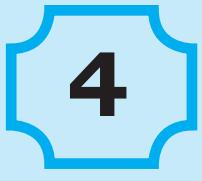
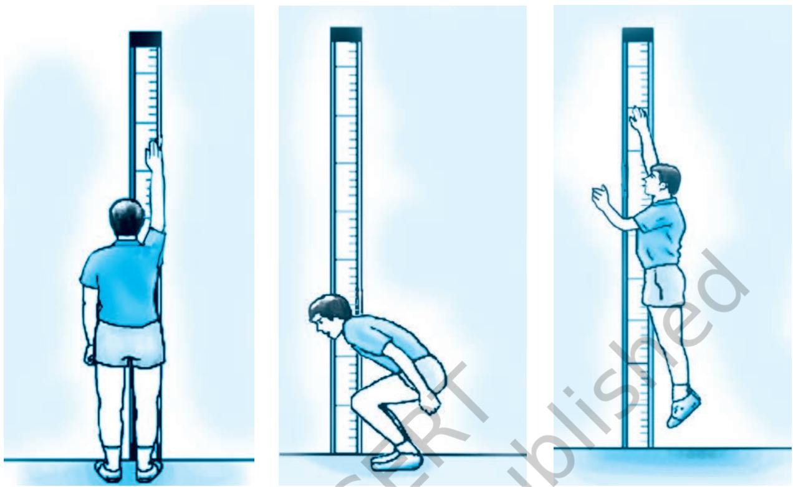
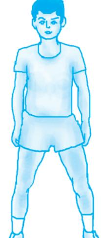
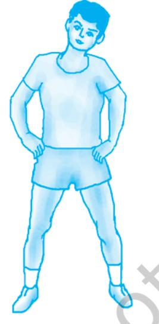

## **Box 4.1**

Physical fitness is the body's ability to function efficiently and effectively in work and leisure activities. Optimum efficiency is the key to physical fitness.

## **4.1 Introduction**

Physical fitness is one of the core preconditions of health. We cannot imagine a person to be healthy without being physically fit. Physical fitness, therefore needs to be appreciated in full measure. The common perception of physical fitness is the absence of ailment. If individual is not suffering from any perceptible disease, then he is considered physically fit. Is it true? Another significant issue is whether there is a universal condition of physical fitness which is uniformly applicable to all. It is not so. Physical fitness of young people is different from that of the aged. The physical fitness of a sports person is different from that of the persons working in army factory or a layman. In fact, physical fitness means different things to different people. In this lesson, let us discuss various aspects of physical fitness.

## **4.2 Physical Fitness and its Importance**

In earlier classes, physical fitness has been defined as the capacity of a person to carry out the daily activities without undue fatigue. Physical fitness is considered as a measure of the body's ability to function efficiently and effectively during work and leisure activities. In order to remain physically fit and healthy, we need to engage ourselves in physical activities and take measures for physically fit.

Physical fitness is an important area of discussion as the number of childrens becoming obese. The normal physical activities, which were done in earlier times both at home and outside as part of day-to-day routine have reduced due to development of science and technology. The work that was done manually is now being carried out by machines. The use of automated equipment such as automatic machines, remotes, mobiles and changes in lifestyles affect health and physical fitness. It has become a matter of deep thinking for all of us.

Now a days we find increased marketing of packaged food and diet for physical fitness. Many such health products now are advertised on TV and radio, and in newspapers, booklets and magazine. It is important for all of us to understand that physical fitness cannot be achieved without doing physical exercise regularly. We should not resort to any shortcut that

is frequently advertised in the media these days to achieve fitness or maintain balance in life style. Moreover, these products may have side effects in our daily life. **Activity 4.1**

## **4.3 Need of Physical Fitness and Well-being**

As discussed in the first chapter on Health and Diseases, the benefits of being physically fit for the individual are manifold. The quality of life of an individual improves when he/she consciously adopts healthy lifestyle which promotes physical fitness as follows:

Collect information from people of different age groups living in your home and neighbourhood about their physical activities that they performed regularly.

Inquiry and record from them, what do they understand by physical fitness.

Analyse their relationship of physical activities and physical fitness.

#### **4.3.1 Physical fitness**

- • improves the functioning of heart and lungs by increasing the availability of oxygen to all tissues and organs in the body system;
- • improves muscle tone;
- • promotes the development of good posture, proportionate figure, and thereby positive body image and physical appearance;
- • ensures quick recovery after injury and illness;
- • decreases the risk of cardio-vascular disease; (like Heart attact, Asthma etc.)
- • reduces and controls undesirable body fat. When the individual does excercise, takes proper diet that also fulfils nutritional requirement, it helps maintain ideal body weight;
- • increases energy level of a person;
- • improves the mood by reducing depression and anxiety;
- • postpones fatigue and reduces recovery time after vigorous activity; and
- • helps people to meet challenges of life, makes them selfconfident and delays the ageing process.

Being physically fit is important for all the age groups. To live better life to the fullest and enjoy all the opportunities, one try to be physically fit.

Physical fitness is essential for each and every individual at all stages of life. To achieve fitness, various modes and methods are available. Before adopting such methods, warming up before activities and cooling down after activities are essential to minimise any risk of injuries of an every individual.

## **4.4 Components of Physical Fitness**

Physical fitness can be classified into health realted fitness and skill-related fitness. The health-related components are:

Chapter-4 Physical Fitnessindd.indd 39 08-11-2016 11:12:08 AM

(i) Cardiovascular Fitness, (ii) Muscular Strength, (iii) Muscular Endurance, (iv) Body Composition and (v) Flexibility. The skill-Related Fitness Components are: (i) Agility, (ii) Balance, (iii) Neuro Muscular Adaptations and Coordinative abilities, (iv) Speed, (v) Strength, and (vi) Reaction Time.

#### **4.4.1 Components of Health Related Fitness**

**Cardio-respiratory Endurance:** cardio-respiratory endurance reflects the ability of the body's circulatory and respiratory systems to supply fuel during sustained physical activity. To improve your cardio-respiratory endurance, try activities that keep your heart rate elevated at a safe level for a sustained length of time such as walking, running, jogging, swimming, bicycling etc. The activity you choose need not be strenuous enough to improve your cardio-respiratory endurance. Start slowly with an activity you enjoy, and gradually work up increase to a more intense pace.

**Muscular Strength** is the amount of force applied on muscle or muscle groups, is able to exert for one maximal effort (contraction).The key to making your muscles stronger is working them against resistance, whether that be from weights or gravity. If you want to gain muscle strength, try excercises such as lifting weights (under proper supervision).

**Muscular Endurance** is the ability of a muscle or muscle group to exert force against a submaximal load for a given length of time (or number of repetition) before fatiguing to the point of failure.

**Body Composition** refers to the proportion of team body mass to body fat, it includes amount of muscle, fat, bone, and other vital parts of the body. Body composition is important to be considered for health and managing the body fat.

**Flexibility** is the range of motion around a joint. Good flexibility in the joints can help prevent injuries through all stages of life. If you want to improve your flexibility, try yoga, gymnastics and basic stretching exercise programme.

#### **4.4.2 Components of Skill-related Fitness**

**Agility** is the ability to change and control the direction and position of the body while maintaining a constant, rapid motion. For example changing directions to hit a tennis ball.

**Balance** is the ability to control or stabilise the body when a person is standing still or moving. For example, handstand in gymnastics.

**Coordination** is the ability to use the senses together with body parts during movement. For example, dribbling a basketball. Using hands and eyes together is called hand-eye coordination.

## **Box 4.2**

#### **Body Mass Index (BMI)**

It is an estimate of an individual's relative body fat. It is calculated by measuring his/her height and weight using the formula; body weight in kgs/ height in metre squared (m)2.

Chapter-4 Physical Fitnessindd.indd 40 08-11-2016 11:12:08 AM

## **Activity 4.2**

Find out your BMI

Take your body weight in kgs and height in metres. Divide your weight by the square of height to obtain your BMI.

Using the following norms, ascertain where you stand.

 weight in kgs —————————— Height in metres2

Below 18.5 kg/m2 - Underweight

Between 18.6 kg/m2 and 23 kg./m2 - Normal

Between 23.1 kg/m2 and 30 kg./m2 - Overweight

30 kg/m2 - obese

Also select randomly five students of your class and calculate their BMI.

**Source:** *www.360living.in/article/body-mass-index-bmi.*

*The Indian health ministry has set new diagnostic cut-off for the body mass index as 23 as opposed to 25 globally, makes healths norms tighter.*

**Speed** is the ability to move your body or parts of your body swiftly. Many sports rely on speed to gain advantage over opponents. For example, a Basketball player making a fast break to perform a lay-up, a tennis player moving forward to get to a drop shot, a football player running the defense to receive a pass.

**Power** is the ability to move the body parts swiftly while applying the maximum force of the muscles. Power is a combination of both speed and muscular strength. For example, volleyball players lifting up to the net and lifting their bodies high into the air.

**Reaction Time** is the ability to reach or respond quickly to what you hear, see or feel. For example, an athlete quickly coming off the blocks early in a swimming or track event, or stealing a base in baseball.

## **4.5 Activities for Developing Physical Fitness**

The type of activities that may be useful to different aspects of fitness are aerobic and anaerobic. These are as follow:

#### **(a) Aerobic Activity**

**Aerobic Exercise:** any physical activity that requires increased oxygen is an Aerobic exercise. Aerobic activity or exercise is therefore the same as cardiovascular exercise as it

- • increases cardiac capacity
- • strengthens the heart and lungs

Aerobic fitness is the capacity of an individual to sustain exercise for a prolonged period of time, for example jogging for more than 15 minutes, cycling and calisthenics etc.

Chapter-4 Physical Fitnessindd.indd 41 08-11-2016 11:12:08 AM

*Fig. 4.1 : Vertical Jump Test to Measure Power*

## **Activity 4.3**

#### **Vertical Jump Test to Measure Power**

- • Stand facing a wall and reach up with your hand closest to the wall.
- • Keep your feet flat on the ground and mark the point of the fingertips that may be recorded. This is called the standing reach height as shown in Fig. 4.1.
- • Stand away from the wall and leap vertically as high as possible using both arms and legs to assist in projecting the body upwards.
- • Attempt to touch the wall at the highest point of the jump.
- • Find your score. The difference in distance between the standing reach height and the jump height is the score.
- • Do it three times. The best of three attempts is your final score.

Aerobic activities develop the cardio-respiratory endurance of an individual. The different types of aerobic activities are aerobic dance, skipping, walking, long distance running, swimming, etc.

## **(b) Anaerobic Activity**

The term Anaerobic means "without oxygen". Anaerobic exercise is a high intensity activity for a short period of time. It relies on energy sources that are stored in the muscles of individuals.

Chapter-4 Physical Fitnessindd.indd 42 08-11-2016 11:12:09 AM

## **Activity 4.4**

**Case:** The football coach assesses the fitness of players of his team by making each of them run five lengths of the football field. One length of the field is 144m. He then makes a chart with the following parameters to assess the speed of each of his players.

Average speed=Distance/Time

| Players | Time in seconds to cover 5 lengths of the field | Distance in metres | Average Speed= Distance/Time |
| --- | --- | --- | --- |
| Player 1 | 5 min 20 sec (60 sec × 5) +20=320 sec | 144 × 5=720 m | 720/320=2.25 m/s |
| Player 2 | 4 min 10 sec | 720 |  |
| Player 3 | 6 min 10 sec | 720 |  |
| Player 4 | 6 min 10 sec | 720 |  |

Work out the average speed of players 2,3 and 4. Speed of player 1 is already calculated for you.

- • You and your friends may try to find out your speed in the same way by running known lengths of an open field in your neighbourhood.
Repeat the activity for seven days and work out your average speed. Before starting this activity, measure one length of the field.

Anaerobic exercise develops stronger muscles. With vigorous workouts, there is temporary shortage of oxygen being delivered to the working muscles, for example sprinting or body building.

However the early stage of all exercise is anaerobic.

This kind of activity is responsible for developing speed. This form of activity benefits the bones, i.e. their thickness increases. The different types of anaerobic activities are weight lifting, sprint races, jumping, mountain climbing, rafting etc.

#### **(c) All Team Games and Individual Sports**

All major games and individual sports require a certain level of fitness components like strength, speed, agility, flexibility and endurance for successful participation.

#### **4.5.1 Warming Up and Cooling Down**

Warming up is usually performed before participating in any games and sports and physical activities. It is important to keep oneself free from injury, pain and how to avoid fatigue. While warming up prepares your body for intense exercise, whereas cooling down helps bring it back to near normal after rigorous activity.

Chapter-4 Physical Fitnessindd.indd 43 08-11-2016 11:12:09 AM

## **Box 4.3**

Aim of warm-up is to prepare the mentally and physically fit student.

*1. Head tilt (side to side)*

**Warming Up:** Muscle stiffness is thought to be directly related to muscle injury and therefore, the warming up should be aimed at reducing muscle stiffness.

Warming up should consist of a gradual increase in physical activity for individuals for increasing joint mobility, stretching and various ways of sports related activities.

- • One should warm-up aproximate 8-12 minutes or per specific requirements which include running, stretching of wrists, elbows, shoulders, neck, trunk, hip, knees, ankles joints.
**Cooling Down:** Once you are through with the workout and you reach the end of the game, it is equally important to ensure that the body cools down.

Cooling down should ideally consist of:

- • five to ten minute walk or light jog as it cools down the body temperature and relaxes the muscles.
- • about ten minutes of static stretching exercises that include chest stretch, biceps stretch, hamstring stretch, calf stretch, hip and thigh stretch, front of trunk stretch and quadriceps stretch. Each stretch should not take more than 10 to 30 seconds.

Intensity and duration of warming up and cooling down should vary according to the nature of workout or game. The more rigorous the workout or game, the more rigorous should be the warm up and cool down.

#### **Benefits warming up and cooling down**

| Warming Up |  |  | Cooling Down |  |  |
| --- | --- | --- | --- | --- | --- |
| Warming up | is | a low | Cool down exercise used |  |  |
| intensity dynamic exercise |  |  | to prevent drop in |  | rapid |
| and static stretch performed |  |  | arterial blood pressure. |  |  |
| to gradually prepare the body |  |  | After completion of vigorous |  |  |
| for further exercises and to |  |  | exercise, the person should |  |  |
| present damage to skeletal |  |  | move for few minutes untill |  |  |
| muscles commutive tissue |  |  | his/her breathing come down |  |  |
| and heart. |  |  |  | to near normal. |  |

Chapter-4 Physical Fitnessindd.indd 44 08-11-2016 11:12:09 AM

## **Assessment**

#### **Answer the following questions**

- 1. What is meant by physical fitness?
- 2. What are the major components of physical fitness?
- 3. What is the difference between speed and strength?
- 4. Why well-being cannot be achieved without physical fitness?
	- (a) ............................................................................
- (b) ............................................................................ 5. What happens if an individual ignores warming up and cooling down for the workout? ..................................................................................

.................................................................................. ..................................................................................

#### **Fill in the blanks**

- (i) Ability to exert maximum force of contraction in minimum possible time..................
- (ii) Greatest amount of force a muscle or muscle group can exert in a single effort.......................
- (iii) Performance of repeated movements with a submaximal force for an extended period of time…..........

#### **Tick (**P**) mark either Yes or No**

- (i) Health and physical fitness are synonymous.(Yes/No)
- (ii) A physically fit person can carry out physical tasks for longer duration without fatigue. (Yes/No)
- (iii) Body composition is a health related physical fitness component. (Yes/No)
- (iv) Agility and coordination are skills related to physical fitness components. (Yes/No)
- (v) Vertical jump helps to measure flexibility. (Yes/No)

## **Activity 4.5**

- 1. List the activities which are generally done by you and your peers for physical fitness.

| Aerobic |  |  |  |
| --- | --- | --- | --- |
|  |  |  |  |
| Anaerobic |  |  |  |
|  |  |  |  |

- 2. Write how often do you engage yourself in the above mentioned activities and their effect on your total health.
Chapter-4 Physical Fitnessindd.indd 45 08-11-2016 11:12:09 AM

