## **6.1 Introduction**

Games and sports in some form or the other have been a part of human life either for survival or for pleasure. Gradually human beings started organising events including games and sports as community events. Consequently, the need was felt to acquire specific skills and advancement in many sports. Each sport has its specific skills which need to be developed for playing correctly. In this chapter we are going to discuss how some individual sports have evolved and how to develop proficiency in playing these sports. Rules and regulations of these sports are revised from time to time by there federations.

## **Box 6.1**

It is important to note that playing any sport:

- • strengthens heart muscles;
- • reduces hypertension;
- • helps in keeping optimal weight as per height; and
- • helps in preventing of bone related disorders.

If played at least for 30 minutes a day after adequate warming up it keeps you feeling strong, motivated, stress-free, having high self-esteem and induces better sleep at night.

## **6.2 Badminton**

Badminton is a game which is played by men, women (Singles/Doubles) and both men and women ( Mixed Doubles) together. It can be played by persons of all ages. The first set of rules were formulated in Pune, in India in 1901. These rules were gradually adopted by other nations. Due to this reason, it is believed that badminton originated in India. However, the game became an international sport after the first All England Championship. In 1934, the International Badminton Federation (IBF) was formed and the rules of the game were standardised. World Badminton Federation (WBF) regulates the game. Badminton Association of India came into existence in 1934 and various State

Badminton Associations are affiliated to it.

## **6.2.1 Types of Events**

- • Singles (boys, girls),
- • Doubles (boys, girls),
- • Mixed Doubles (Combination of a boy and a girl)

## **6.2.2 Facilities and Equipment**

- • For playing badminton, a racket, net and shuttle cock are required.
- • **Court measurements:** The length and width of the doubles court shall be of 13.40m × 6.10m. The height of the net is 1.55m at the sides and 1.52m at the centre.

## **Activity 6.1**

Collect information about your favourite Badminton player national/international and which aspects of his/her game do you like?

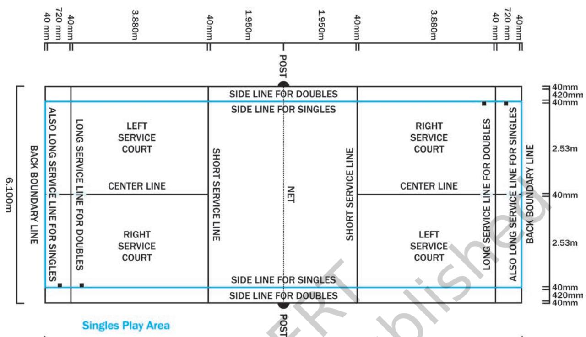

*Fig. 6.1 : Badminton Court*

## **6.2.3 How to Play Badminton**

In singles, there is one player on each side and in doubles, there are two players on each side.

- • The game begins with a toss and winner of the toss has the choice either to serve or to receive to serve or opt any side of the court to start the game.
- • Each player has to serve from alternate sides of the court and winner of each rally will get one point.
- • A standard game consists of 21 points with a two point difference.
- • The side winning a game, serves first in the next game.
- • Server and receiver stand in diagonally opposite service courts and the shuttle must be hit below the waist.
- • The shaft of the racket must be pointing in the downward direction with both feet in contact with the surface of the court until service is delivered.
- • A 'let' is called when a rally is stopped without any point. A let may be given, if:
- – there is an accidental interference during play,
- the shuttle gets caught in the net after passing over the net (except during service).

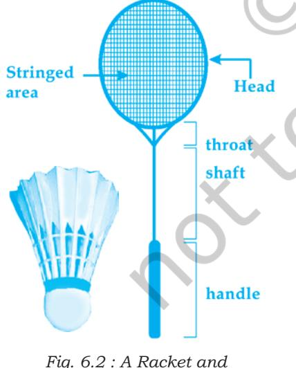

*Fig. 6.2 : A Racket and a Shuttle*

Chapter-6 Individuals Sports.indd 54 08-11-2016 11:36:27 AM

- the server serves before the receiver is ready.
- umpire is unable to make a decision.
- both sides commit a service court error.
- any other situation as deemed fit.
- • A player will lose the rally if service is not correct or server misses the service or shuttle lands outside the prescribed area, shuttle passes through the net, shuttle does not cross the net, shuttle touches the walls/ceiling or shuttle hits twice on the player's racket and any part of her/his body touches the net.
- • Three types of cards are used in Badminton, i.e. yellow card for first warning due to misconduct, red card for those who have been previously warned and black card for disqualifying a player for persistent misbehaviour, this shall render a player disqualified for the entire tournament.

#### **6.2.4 Fundamental Skills of Badminton**

#### *The Forehand Grip*

The grip is very important for a player. The racket is held with a shake hand grip. The 'v' between the thumb and fore fingers runs down the middle of the side of the handle as shown in Fig. 6.3.

#### *Backhand Grip*

In this, the player holds the racquet in the forehand grip. She/he then relaxes the grip and moves her/his hand over the top edge of the handle until the thumb lies flat along the back edge. The strength is directly behind the backhand face of the racket.

#### *Footwork*

Footwork is an essential skill for Badminton. Being agile and flexible, enables a badminton player move all over the court efficiently in accordance with a Forehand, Backhand, Drop, Drive shot etc. and these are given below:

#### *Strokes*

- **• Forehand stroke** The stroke which is hit from the right side of the body by the right handed player.
- • **Backhand stroke** The stroke which is hit from the left side of a right handed player.
- • **Smash** The player will jump upwards, sideways and backwards and the shuttle is hit (smashed) quickly and forcefully downwards.

## **Activity 6.2**

Is badminton played in your school? If yes, is it played in a specially prepared court? Observe the court and find out the measurements. Compare it with the Fig. 6.1 given in your book.

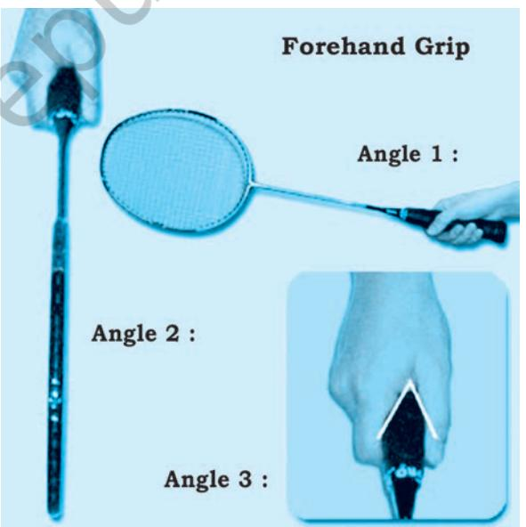

*Fig. 6.3 : Forehand Grip*

Chapter-6 Individuals Sports.indd 55 08-11-2016 11:36:27 AM

- • **Drop** This shot is slow and is hit gently but firmly and after clearing the net the shuttle falls close to the net.
- • **Drives** These are shots hit flat into the side zones with impact of the racquet hand.
- • **Toss and clear** The shuttle is hit high and deep towards the baseline of the opponent.

#### *The Service*

The service is one of the most important strokes. There are two basic badminton serves:

- • Long/High service
- • Short/Low service
- • The player should be centrally located on the court standing halfway between the net and the backline and near the centre service line.

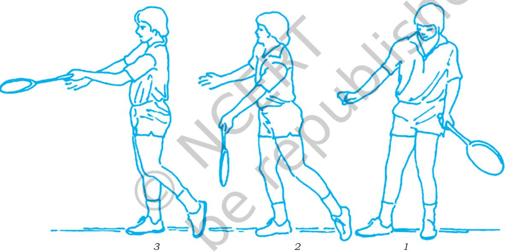

- *Fig. 6.4 : Badminton service*
- • keep the body sideways to the receiver's service court.
- • using forehand grip the server takes the service position with both hands between the chest and shoulder.
- • drop the shuttle and hitting hand is brought down and forward, forearm rotates upward at the point of contact.

#### **6.2.5 Scoring**

If a serve lands in the court of the opponent without volleyed back or the opponent returns a volley outside the play area, the server scores a point. In case of boys, it is best of five games of 21 points with two points lead, e.g. 21-19, 19-21, 22-20 and 21-17 and in case of girls, best of three games with same lead of two points.

Chapter-6 Individuals Sports.indd 56 08-11-2016 11:36:28 AM

## **6.3 Gymnastics**

The word gymnastics has been derived from the Greek word 'Gymnos' meaning "naked art". In ancient Greek, the word "Gymnastics" was used to denote the exercise done with the naked body. Guts Muths, is known as the Grand Father of Modern Gymnastics and Friedrich Ludwig Jahn is known as the Father of Gymnastics. Modern gymnastics is regulated by the Federation International de Gymnastique (FIG) which was founded in 1881. Gymnastics was included in the Modern Olympic Games in 1896 and women gymnastics was introduced in Olympic Games in 1928. The first gymnastics world cup was organised in 1975. At present, gymnastics as an event can be seen in almost all the known multi sports meets.

#### **6.3.1 Types of Gymnastics**

Broadly gymnastics has been classified in three types, i.e. Basic Gymnastics, Sportive Gymnastics, and Auxiliary Gymnastics.

Sportive gymnastics is further categorised as artistic (men and women), rhythmic, aerobics, acrobatics, and trampoline gymnastics. This chapter deals with artistic gymnastics which is a popular discipline of gymnastics. Artistic gymnastics apparatus for men are: floor exercise, pommel horse, roman rings, vaulting table, parallel bars, and horizontal bar. For women, the apparatus are: vaulting table, uneven bars, balancing beam and floor exercises.

#### **6.3.2 Basic Skills of Artistic Gymnastics**

As you know now, gymnastics is performed on various apparatus and for all the apparatus some skills are identified as the basic skills of the game. Some basic skills, apparatus wise are listed below:

#### *1. Floor Exercises*

Floor exercises are done on floor carpet. Measurement of floor mat is given in (Fig. 6.5)

- **• Handstand** is an inverted gymnastics controlled skill performed by supporting the body on both hands, with the arms straight and the body vertical. (Fig. 6.5.1)
- **• Cartwheel** is a common gymnastics skill where a gymnast

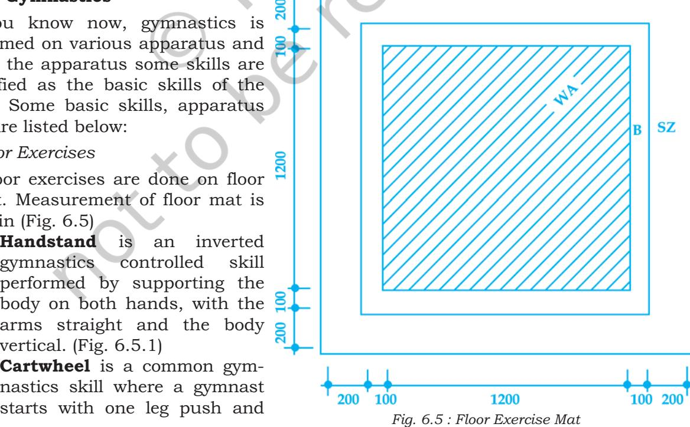

Chapter-6 Individuals Sports.indd 57 08-11-2016 11:36:28 AM

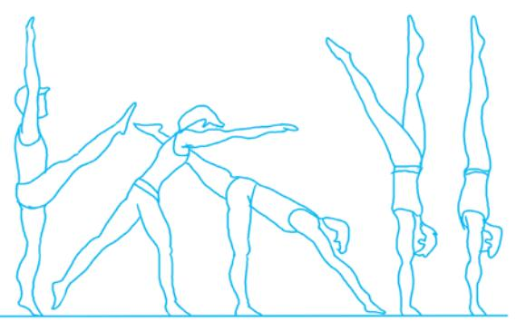

*Fig. 6.5.1 : Handstand Fig. 6.6 : Cartwheel*

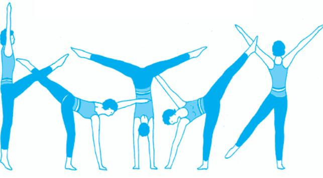

## **Activity 6.3**

The student must learn to perform five floor exercises. As per availability of the apparatus.

places her/his hands on the ground in the same line while kicking with other leg up into a side handstand. The gymnast then lands with one leg on the other side followed by the other leg. (Fig. 6.6)

- **• Front Handspring** is a forward tumbling skill that starts with a step or a hurdle. The body then bounces on to the hands and rotates through a handstand before landing on the feet. (Fig. 6.7)
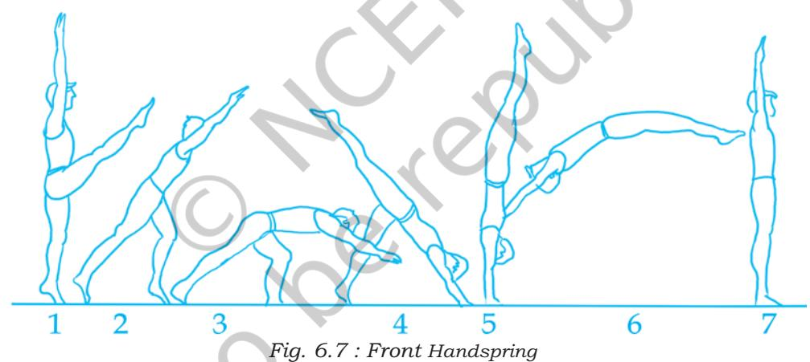

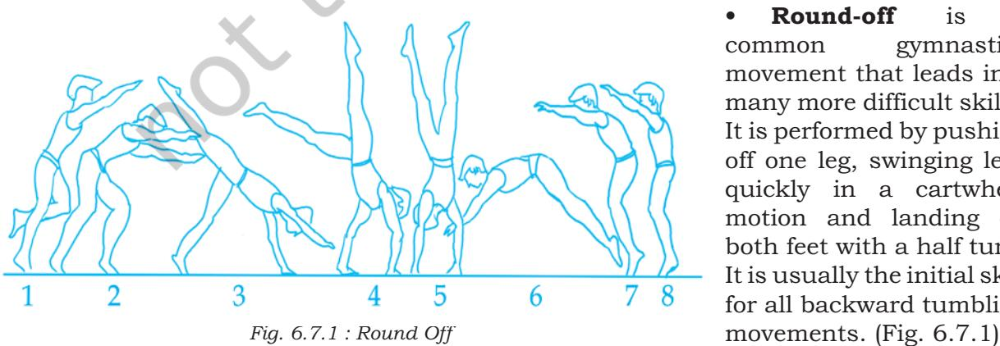

**• Round-off** is a common gymnastics movement that leads into many more difficult skills. It is performed by pushing off one leg, swinging legs quickly in a cartwheel motion and landing on both feet with a half turn. It is usually the initial skill for all backward tumbling

Chapter-6 Individuals Sports.indd 58 08-11-2016 11:36:32 AM

- *2. Pommel Horse (Fig. 6.8)*
	- **• Leg swings** are considered as one of the basic swings on pommel horse. These are sideways swings which are performed with legs apart. Leg swings are the basis for scissors, leg cuts and undercuts and one leg circle. (Fig. 6.8.1)
	- **• One Leg Circle** can be done with right as well as left leg. The procedure and technique of leg circle is given in Fig. 6.8.2.

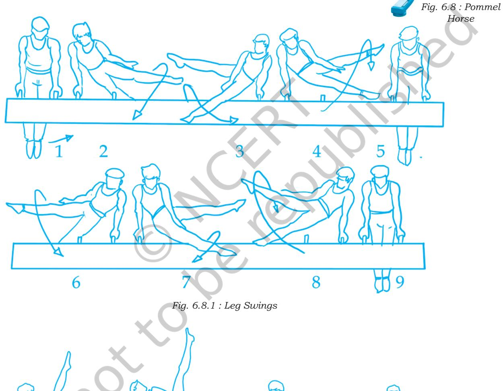

Chapter-6 Individuals Sports.indd 59 08-11-2016 11:36:33 AM

*Fig. 6.8.2 : One Leg Circle*

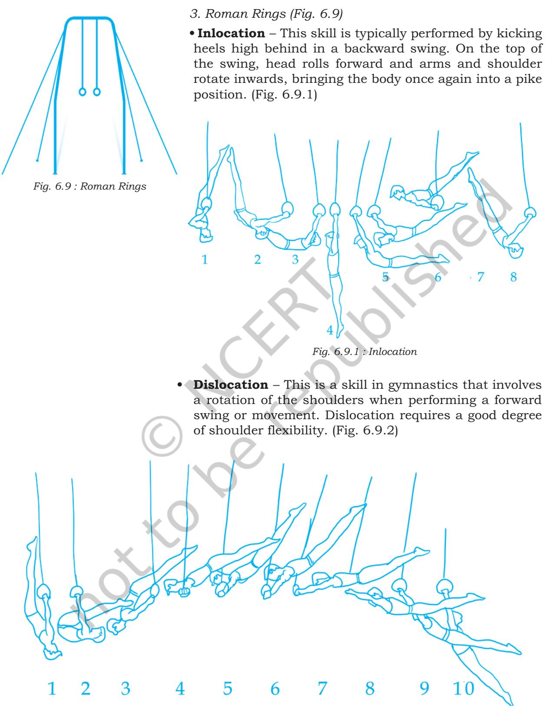

*Fig. 6.9.2 : Dislocation*

Chapter-6 Individuals Sports.indd 60 08-11-2016 11:36:35 AM

- *4. Vaulting Table*
	- **• Squat vault**  In this skill a gymnast crosses over the vaulting table with knees bent and body bent from the hips. (Fig. 6.10)
	- **• Split vault**  In this skill the body bends forward from the hips as the feet pass over the table with split (legs apart) legs. (Fig. 6.10.1)

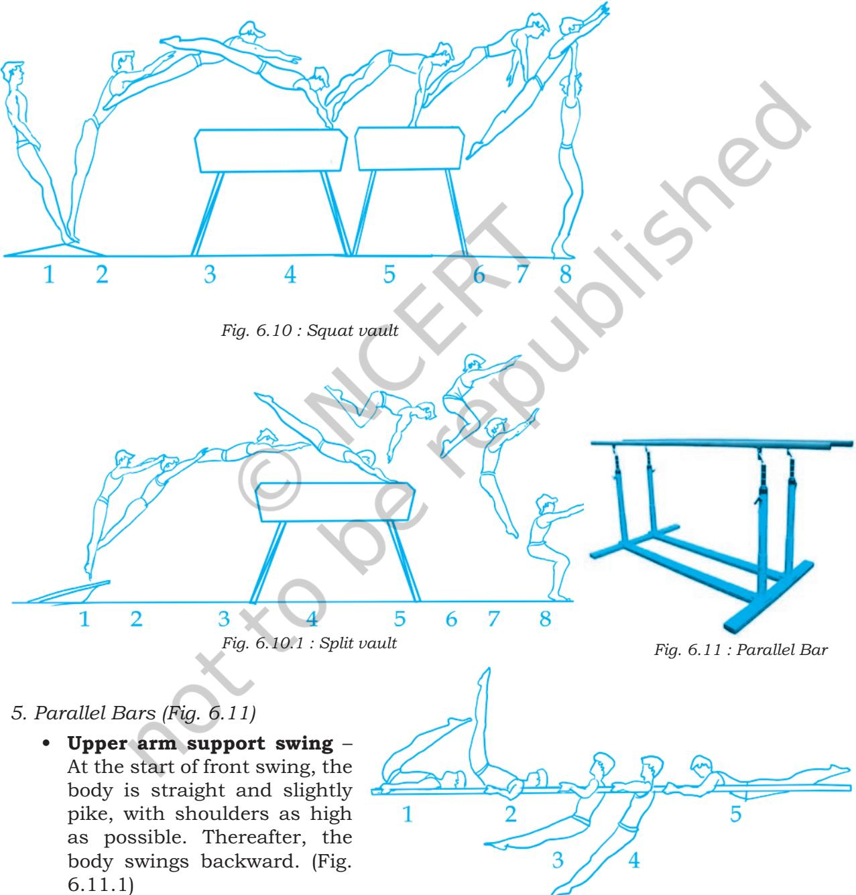

*Fig. 6.11.1 : Upper arm support swing*

Chapter-6 Individuals Sports.indd 61 08-11-2016 11:36:38 AM

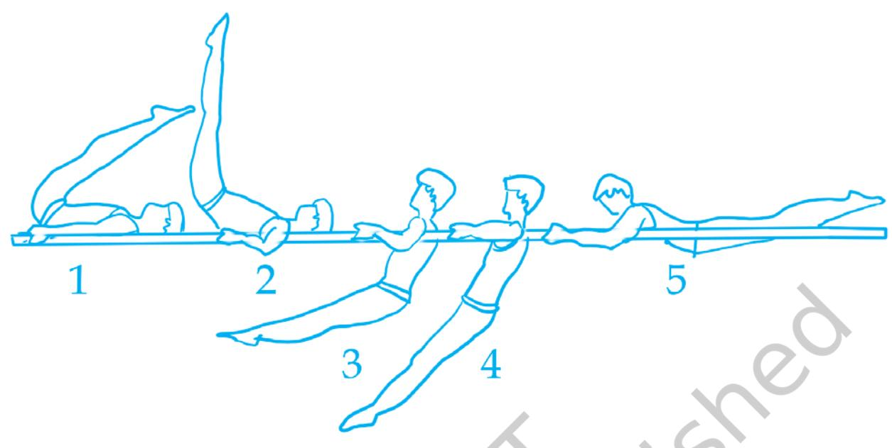

*Fig. 6.11.2 : L-Hold position*

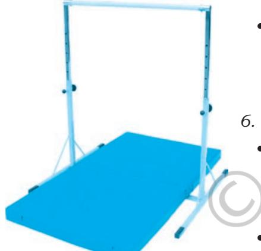

*Fig. 6.12 : Horizontal Bar*

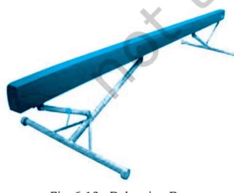

*Fig. 6.13 : Balancing Beam*

**• L–hold position** – In this position the gymnast's arms, legs and body are held straight over the parallel bars while legs are brought at an angle of 90 degrees at the hips in support position. (Fig. 6.11.2)

*6. Horizontal Bar (Fig. 6.12)*

- **• Front hip circle**  In this skill, the body acquires a forward movement around the bar while touching upper part of thigh to the bar and body rotates forward and downward around the bar in a circle.
- **• Back hip circle**  In this skill, the body acquires a backward movement around the bar with the hips resting on the bar and the body rotating backward and downward around the bar in a circle.

*7. Balancing Beam (Fig. 6.13)*

**• Balance on one leg ('T' Balance)** – In this skill a gymnast stands on one leg, with other leg backward above horizontal level keeping arms side ways and holds the position for 2 seconds.

**• Walking on the beam -** In this skill, the gymnast rocks the knees with feet pointing on each step and performs walk, with variations in arms movements. Eventually the arms position can be combined during the walk on each step changing from straight arms out to crown up and vice-versa.

Chapter-6 Individuals Sports.indd 62 08-11-2016 11:36:40 AM

#### *8. Uneven Bars (Fig. 6.14)*

- **• Front hip circle**  The gymnast initiates the skill from support position. The gymnast falls forward with a tight body touching upper thigh or stomach, leaning well forward to initiate momentum and to complete the forward circle.
- **• Back hip circle**  In this skill, from support position, a gymnast takes back swing, brings body forward and by touching the upper thigh with the bar takes shoulders backward and rotates around the bar.
- **• Evaluation Procedure for the above elements (Movements)** – There are four elements on floor exercises and two elements each, on all other apparatuses given in this chapter. The evaluation of these elements will be done as per the following procedure.
- (a) Value of each element is =5.00 points (each element will be evlauated out of 5.00 points)
- (b) Value of four elements on floor exercises =20.00 points (Four elements × 5.00 points each =20.00)
- (c) Value of two elements on pommel horse =10.00 (Two elements × 5.00 points each =10.00)
- (d) Value of two elements on rings =10.00 points
- (e) Value of two elements on vaulting table =10.00 points
- (f) Value of two elements on parallel bars =10.00 points
- (g) Value of two elements on horizontal bars =10.00 points
- (h) Value of two elements on balancing beam =10.00 points
- (i) Value of two elements on uneven bars =10.00 points The total value for the boy's section comes to 70.00 points
- (i.e. 20.00 for floor and 50.00 for rest of the five apparatuses) The total value for the girl's section comes to 50.00 points

(i.e. 20.00 for floor and 30.00 for rest of the three apparatuses)

## **6.4 Judo**

Judo had its origin in the ancient Japanese art of Ju-jitsu (Gentle art), a system of hand-to-hand combat. It is a sport of Asian origin which was included in Tokyo Olympic Games in 1964. The first school of Judo was started by Professor Jigoro Kano in 1882 at Eishoji (a Buddhist temple) in Tokyo, Japan. As a player progresses through the ranks (Grading reflected by the belt of the Judo player) and the very nature of the grading system ensures that the next goal is always realistic and achievable with effort.

## **Activity 6.4**

Join a Judo class in your school or in your locality and share your experience with your friends.

*Fig. 6.14 : Uneven Bar*

Chapter-6 Individuals Sports.indd 63 08-11-2016 11:36:40 AM

#### **6.4.1 Competition Area (Square)**

The Judo platform is 18m long,18m wide and 50cm in height.

| Total area for competition | : 14m x 14m |
| --- | --- |
| Contest area including danger zone | : 10m x 10m |
| Danger zone in red colour | : 1m in width |
| Safety area outside danger zone | : 3m in width |
| Distance between the tapes |  |
| (red and white) at the centre area | : 4m |
| Length of tapes | : 25m |
| Width of tapes | : 6cm |
| Duration of Bouts (boy/girl) | : 5min/4min |

The Judo bouts are played in different weight categories for equality and to avoid injuries because body weight has direct relation with body inertia, mass and strength (force) of an individual. There are following categories of Judo competitions in india:

- 1. Sub-junior girls having different weight categories.
- 2. Sub-junior boys having different weight categories.
- 3. Junior girls having different weight categories.
- 4. Junior boys having different weight categories.
- 5. Women (senior) having different weight categories.
- 6. Men (senior) having different weight categories.

**Note:** The weight categories keep on changing. For latest weight categories kindly contact the game website www.onlinejbi.org.rulesdis.php)

#### **6.4.2 Judo Grades**

Judo grades are divided into *"Kyu"* (pupil) *"Dan"* (master or teacher) grade.

- • 10th *Kyu* will wear white belt
- • 9th *Kyu* will wear yellow belt
- • 7th and 8th *Kyu* will wear orange belt
- • 5th and 6th *Kyu* will wear green belt
- • 3rd and 4th *Kyu* will wear blue belt

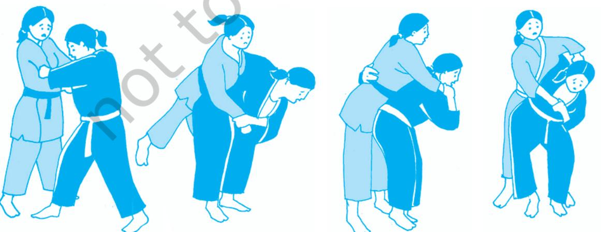

*Fig. 6.15 : Judo steps*

Chapter-6 Individuals Sports.indd 64 08-11-2016 11:36:41 AM

- • 1st and 2nd *Kyu* will wear brown belt
- • 1st, 2nd, 3rd, 4th and 5th *Dans* will wear black belt
- • 6th and 7th *Dans* will wear red and white striped belt
- • 8th, 9th and 10th *Dans* will wear red belt.

## **6.4.3 Scoring**

| Scoring | Throwing | Holding |
| --- | --- | --- |
| Ippon | Throwing the opponent | Maintaing a |
|  | with considerable speed, | recognised hold for |
|  | force and squarely on | 20 seconds |
|  | his/her back (control) |  |
| Waza-ari | Throwing the opponent | Maintain a |
|  | with speed and force | recognised hold for |
|  | and squarely to his back | 15 seconds to less |
|  | (control) but any one of | than 20 seconds |
|  | the above component |  |
|  | is lacking partly. (Note: |  |
|  | two waza-ari become an |  |
|  | Ippon) |  |
| Yuko | Throwing the opponent | Maintain a |
|  | with speed and force | recognised hold for |
|  | and squarely to his/ | 10 seconds to less |
|  | her back (control) but | than 15 seconds. |
|  | any two of the above |  |
|  | components is lacking |  |
|  | partly. |  |

**Special decision –** When not fit to continue because of injuries, winner is she/he, who is injured due to errors of his/ her opponent and loser is she/he who is injured because of his/her own mistakes/faults.

## **6.4.4 End of Contest**

The contest will end as under :

- • scoring of *Ippon*.
- • scoring of *Waza-Ari* Awasete Ippon.
- • because of *Sogo-Gachi* (compound win).
- • because of *Fusen-Gachi* (default).
- • because of Hansoku-Make (disqalified).
- • because of injury.
- • because of expiry of allotted time.

## **6.4.5 Fundamental Skills**

*Rei* (salutation) - *Rei* is of two types, i.e. *Ritsu-Rei*  (standing salutation), *Za-Rei* (sitting salutation) *Kumikata* (gripping) How to hold the judogi

- • *Migi kumikata* (right side grip)
- • *Hidari kumikata* (left side grip)

Chapter-6 Individuals Sports.indd 65 08-11-2016 11:36:41 AM

*Shintai* (walking movements)

- • *Tsugi ashi* (following foot movements)
- • *Ayumi ashi* (advance foot movements)
- *Shizentai* (posture)
	- • *Shizen-hontai* (natural posture)
	- • *Shizen-jigotai* (defensive posture)

*Ukemi* (break fall or method or art of falling)

- • *Ushiro ukemi* (back break fall)
- • *Yoko ukemi* (side break fall)
- • *Mae ukemi* (front break fall)
- • *Mae mawari ukemi* (forward rolling break fall

*Tai-sabaki* turning movements or management of body movements

- *Kuzushi* breaking the balance of the defender (UKE) or off balancing the UKE for applying Judo technique. *Tsukuri* Fitting the body of attacker (tori) against the UKE for applying a technique against UKE.
is execution of the throw technique.

- *Kake* Actual or final action of throw technique that
## **Activity 6.5**

You or your friend might have the experiences of swimming. Share your views about different strokes.

## **6.5 Swimming**

Swimming is a sport where a person propels his/her body through the water with his/her arms, called strokes, and legs kick and move progressively through water. Swimming is sometimes used for physical rehabilitation of people recovering from injuries because it is a non-weight bearing exercise. It is also a good recreational activity.

Swimming was included in the first modern Olympic Games at Athens in 1896. The first Olympic Champion was Alfred Hajos from Hungary. Diving events were added in 1904. The women's competitions were recognised in 1912. Federation Internationale de Natations Aquatics (FINA) was formed at London Olympic Games in 1908.

## **6.5.1 Facilities and Equipment**

- • Swimming Pool : The standard dimensions of a swimming pool are: length 50m, width 25m and depth 1.80m.
- • Eight lanes of 2.5 m width each (10 lanes for international competitions).
- • The height of the starting platform shall range between 50-75 cm above the water surface; the top surface shall be 50 cm × 50 cm (Length × Breadth).
- • Water temperature should be 24o C.
- • Swimming costume is made of nylon or lycra. Other items needed are towel, swimming cap and swimming goggles.

Chapter-6 Individuals Sports.indd 66 08-11-2016 11:36:41 AM

#### **6.5.2 Types of Strokes**

There are four recognised strokes for a swimming competition :

- • Front Stroke/ Free Style
- • Back Stroke
- • Breast Stroke and
- • Butterfly Stroke

#### *Front Stroke or Free Style*

In freestyle events, a swimmer can swim in any manner. It is also called crawl because the swimmer uses alternate stroking of the arms over the water surface with up and down kick action of legs. In turning after finishing one length, some body part of the swimmer should touch the wall.

The swimmer lies flat on his/her stomach with both arms stretched out in front, passing by the side of ears and the water level is at hair line. Both legs are extended to the back with toes pointed. The arms are pulled alternately from front to back inside the water and recovered from outside the water. While one arm is pulling and pushing, the other arm is recovering.

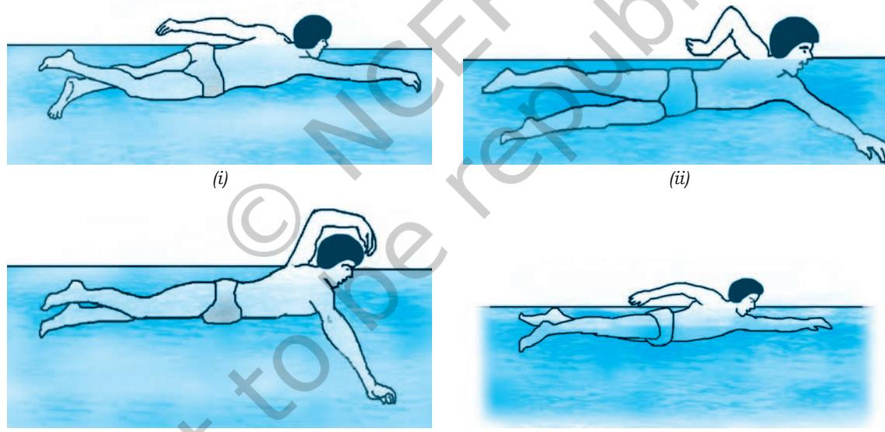

*(iii) Fig. 6.16 : Sequence of Free Style Stroke (iv)*

The legs move alternately up and down. While one leg kicks downward, the other leg recovers upward. The knees are flexed with toes pointed during the down beat and are kept straight with toes relaxed during the up beat.

The swimmer takes the breath through the mouth by turning the head to the side of the pushing arm at the beginning of recovery. Soon the face goes back into the water and the swimmer breathes out more through the mouth and only a small portion through the nose.

Chapter-6 Individuals Sports.indd 67 08-11-2016 11:36:42 AM

#### *Back Stroke*

The back stroke consists of alternate action of arms with up and down kicking of legs while the swimmer is on the back. During a turn, the swimmer should bend from the stomach and take flip turn. Some body part of the swimmer should touch the wall and he/she should finish in the back position only.

The basic body position for the back stroke is the supine position. The swimmer lies flat on his/her back with both arms stretched out back over head, passing by the side of ears. Face is out of the water and both legs are extended forward with toes pointed. Hips are just below the water surface.

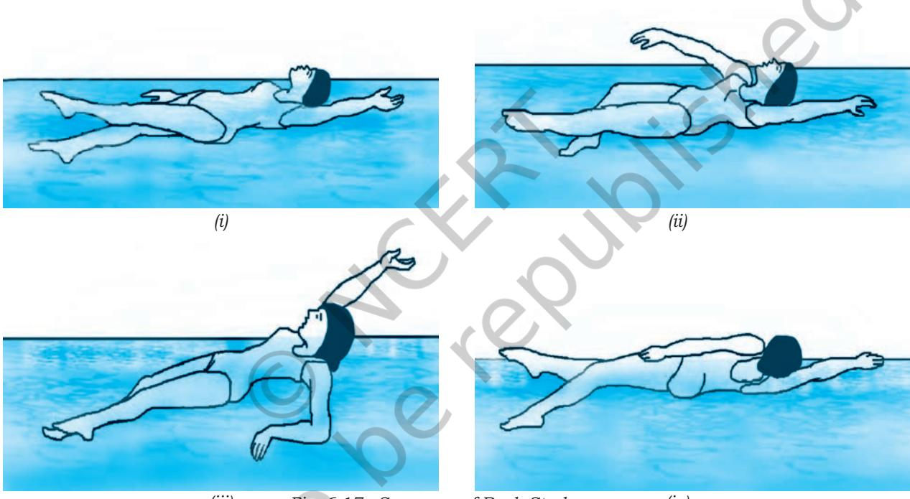

*(iii) Fig. 6.17 : Sequence of Back Stroke (iv)*

The arms are pulled alternately from back to front inside the water and recovered from outside the water with straight arm over the body. While one arm is pulling and pushing, the other arm is recovering.

The legs move alternately up and down. The leg movement originates from the hip joint. While one leg kicks downward, the other leg recovers upward. The knees are flexed with toes pointed during the up beat and are kept straight with toes relaxed during the down beat. Breathing in back stroke is very easy, as the mouth and nose are usually over the water. The swimmer breathes once in every arm cycle.

Chapter-6 Individuals Sports.indd 68 08-11-2016 11:36:42 AM

#### *Breast Stroke*

The breast stroke involves simultaneous horizontal movements of the arms in heart shape to propel the body forward by pushing the water. The kicking action is in circular motion similar to that of frog. During turn and finish, swimmer must touch the wall with both hands.

Breast stroke involves lying on the chest, with the arms only breaking the surface of the water and legs always underwater, while the head is underwater for the second half of the stroke.

Both hands, thumbs together, reach forward, fully extending the arm at the elbow. The arms will stay in this position until the kick is completed by the feet. Arms continue to flex at the elbow. Leg kick starts to push back to continue the forward movement. The legs flex at the knee and hips to prepare for the kick. Breathing is usually done in the beginning of the insweep phase of the arms, and the swimmer breathes through the mouth.

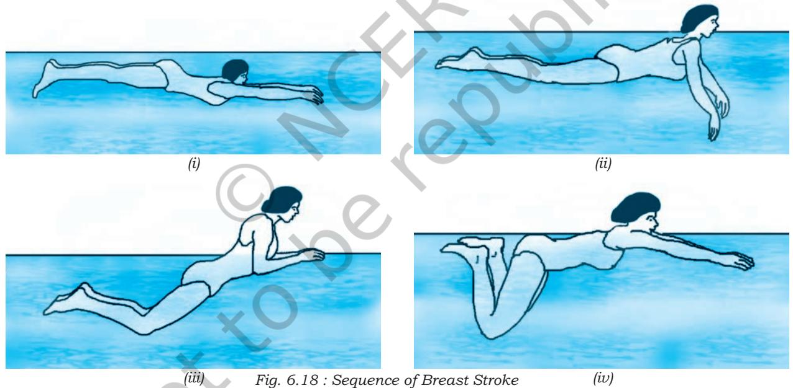

#### *Butterfly Stroke*

In this stroke, the swimmer must keep both the legs together and she/he should not use breast stroke. During a "turn" and "finish" both hands must touch the wall simultaneously.

The butterfly technique with the dolphin kick consists of arm movement with a leg kick. Both arms break the water simultaneously, hands and forearms first, the arms swing outwards, elbows slightly flexed as they both continue to

Chapter-6 Individuals Sports.indd 69 08-11-2016 11:36:43 AM

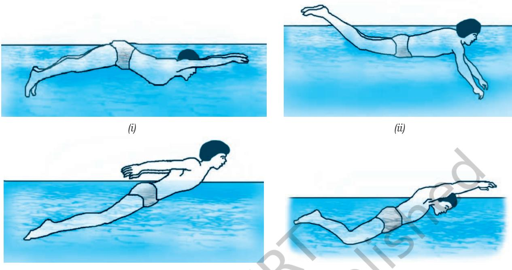

*(iii) Fig. 6.19 : Sequence of Butterfly Stroke (iv)*

swing, take a round and meet in front of the head, thumb and fingers entering the water first. As the hands come close to the body, they then press towards the feet, fully extending the arms at the elbow in preparation for the quick "flick" out of the water for recovery.

The shoulders are brought above the water surface by a strong up and medium down kick.

The breathing process begins when the swimmer presses both hands downward, and the swimmer breathes in through the mouth.

## **6.5.3 Before and after swimming the following care should be taken**

- • Take bath before and after swim.
- • Wipe the body after shower with a clean towel.
- • Swim under the presence of a lifeguard.
- • Do not go into deep water if you are not confident.
- • Warm up before swimming.
- • Stretching and mobility exercises should be done before and after swimming.

## **6.6 Table Tennis**

International Table Tennis Federation (ITTF) was founded in 1926. Since 1988, Table Tennis has been an Olympic sport. Other historical names of table tennis were gossima, whiffwhaff and ping-pong.

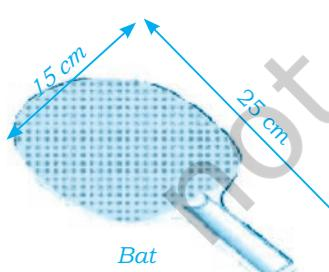

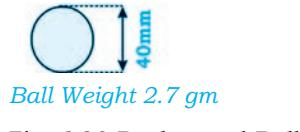

*Fig. 6.20 Racket and Ball*

Chapter-6 Individuals Sports.indd 70 08-11-2016 11:36:43 AM

#### **6.6.1 Facilities**

- • The upper surface of the table, known as the playing surface is rectangular, with a dimension of 274 cm long and 152.5 cm wide. The height of the table is 76 cm above the floor.
- • The playing surface shall be uniformly dark coloured and matt, but with a white border line, 2 cm (3/4inch.) wide, along each 2.74m (9 feet.) edge and a white end line as shown below in Fig. 6.21.

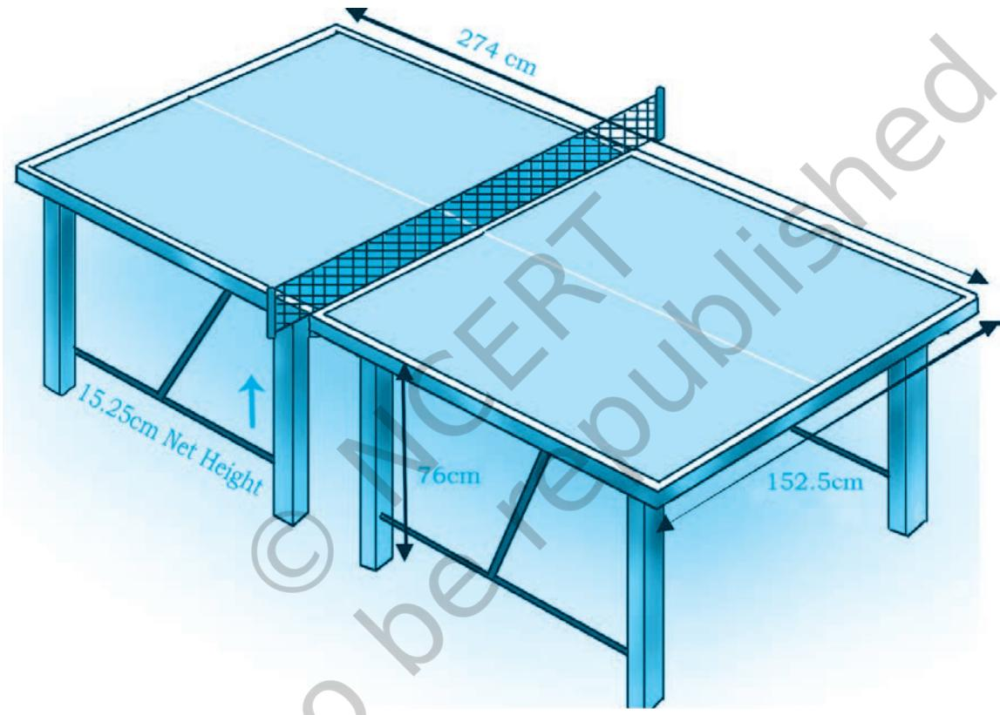

*Fig. 6.21 : Dimensions of a Table Tennis Table*

#### **6.6.2 Equipment**

- • *Net Assembly* : which consists of upright post, height adjuster, horizontal part of the net post and attaching system (clamp). The net is suspended by a cord attached at each end to an upright post 15.25 cm high. The colour of net assembly should be of dark green, dark blue or black and have a white top not more than 15 mm wide.
- • *Ball:* the ball is spherical, orange or white in colour made of celluloid or similar plastic material with a diameter of 40 mm, weight 2.7g. (Fig. 6.20)

## **Activity 6.6**

- Find any three rules of ITTF related to the game of Table Tenis.
Chapter-6 Individuals Sports.indd 71 08-11-2016 11:36:44 AM

- • *Bat:* The bat is also known as a paddle, or racket. The blade shall be flat and made up of wood of dark matte colour, one side black and other side bright red. But majority of rackets are of similar size about 15cm across and 25cm long including the handle. (see fig. 6.20)
- • *Scoreboard:* The board, used for scoring is called Table Tennis Scoreboard.
- *• Net Gauge* is used to measure the height of the net and also to measure the thickness of the racket and tension of the bat rubber which should be as per International Table Tennis Federation regulations.

|  | Dimensions |  |  |
| --- | --- | --- | --- |
|  | Table Tennis Table | Net | Ball |
| Shape |  |  |  |
| Length |  |  | N.A. |
| Width |  |  | N.A. |
| Height |  |  | N.A. |
| Weight | N.A. | N.A. |  |
| Diameter | N.A. | N.A. |  |

## **Activity 6.7**

From the Table Tenis table available in your school, fill the given columns on the right side, and compare the standard norms given above.

#### **6.6.3 Events**

- • Singles (Boys, Girls),
- • Doubles (Boys, Girls),
- • Mixed Doubles (Combination of boys and girls)

#### **6.6.4 How to play Table Tennis**

- • A player/team who wins the toss shall have a choice of service or receiving or side of the table to begin.
- • The server shall project the ball resting freely on the palm, toss the ball and strike the ball with the bat. The ball must first touch down on the half of the table then it should pass over the net and land in the opponent's half without touching the net.
- • The ball, having been served or returned, shall be struck so that it passes over the net assembly and touches the opponent's half of the table, either directly or after touching the net assembly.
- • In singles, the server shall first make a service, the receiver shall then make a return. Thereafter, each server and receiver shall alternately make a return.
- • In doubles, the server shall first make a service, the receiver shall then make a return. The partner of the server shall then make a return, and the partner of the receiver shall then make a return and thereafter each player in turn, in that sequence, shall make a return.

Chapter-6 Individuals Sports.indd 72 08-11-2016 11:36:44 AM

- • The service shall be a "LET" if the ball touches the net and goes to the opponent half of the table or if a ball is served when receiver is not ready.
- • If a player fails to serve or receive the ball, point shall be awarded accordingly.
- • A game is won by the player who first scores 11 points. If both players score 10 points, then the player who get 2 point lead is declared the winner.

#### **6.6.5 Basic skills of the Game**

#### *The Grip*

There are two types of grips— the shake hand grip and the pen hold grip.

- (a) Shake hand grip (fig 6.22) The paddle (a part of the tennis bat) is held as if one is shaking someone's hand, with the index finger extending over the bottom part of the rubber on the back hand side and the thumb slightly touching the rubber on the forehand.
- (b) Pen hold grip (fig 6.23)— The paddle is held just like a pen, only grasping the paddle at the top of the handle.

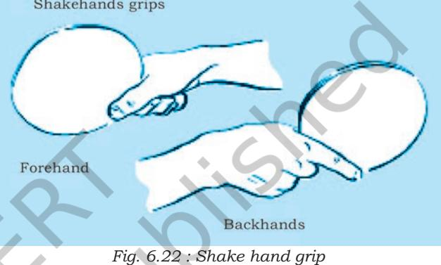

#### *Spin*

- (a) There are three spins most commonly used top spin, back spin and side spin. To hit a top spin the bat has to be angled in such a way so that the forehand - side faces downward 40 degrees (closed face).
- (b) To hit a back spin, angle of the bat should be upward so that the forehand side faces the ceiling, facing upward 45 degrees (open face). Swing through the ball, but much speed should not be used as in topspin.
- (c) A side spin is used in service. It is a combination of topspin and sidespin, or backspin and sidespin in the service.

#### *Strokes*

- (a) Strokes are generally offensive and defensive: while performing a stroke the player should stand close to the table and take a stance facing the line of play. Now using a short stroke the racket arm should move from the elbow in a horizontal plane while the free arm should move upward. The strokes can be played with a backhand push and forehand push.
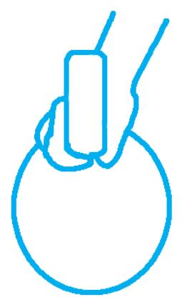

*Fig. 6.23 : Pen Hold Grip*

Chapter-6 Individuals Sports.indd 73 08-11-2016 11:36:44 AM

## **6.7 Wrestling**

There are two Olympic styles of wrestling, Freestyle and Greco-Roman. With one key exception, the rules of the two styles are identical.

In Greco-Roman, a wrestler may not attack his opponent's legs, nor use his own legs to trip, lift or execute other moves. In freestyle, both the arms and legs may be used to execute holds or to defend against attack. This style was introduced in 1904 at St. Louis Olympic Games. After a century, women free style wrestling was introduced in Athens Olympics in 2004.

In addition to the above one more style of wrestling is played in India which is called the Indian style of wrestling or otherwise known as *Pehlwani* or *Kushti.* This kind of wrestling takes place in a clay or a mud pit. Traditional Indian wrestling isn't just a sport, it's an ancient sub-culture where wrestlers live and train together.

#### **6.7.1 Equipment and Facilities for indoor (Fig. 6.24)**

- • Wrestling is an indoor sport played on a mat.
- • The wresting area can be circle or square in shape (12 metre ×12 metre).
- • The thickness of the mat should be between 5 to 7 centimetres.
- • The mats are covered with a non-abrasive vinyl material which prevents slipping, injuries and is easy to clean.
- • The bout is played on a yellow colour area with a diameter of seven metres.

• The centre circle in the middle of the playing area is of one metre diameter, generally of red and white colour.

#### **6.7.2 How to Wrestle**

- • The sport of wrestling is played in different weight categories for both boys and girls. The weight categories are provided to minimise the chance of injuries and also to provide an equal platform for applying strength and force for all the wrestlers. The weight categories are different for junior level, senior level, open championships, world championships, Olympic championships and so on. The changes in weight categories are done by the Federations from time to time. As an example, weight categories for men and women are given below.

Visit an *Akhada*  and write your observations.

Chapter-6 Individuals Sports.indd 74 08-11-2016 11:36:45 AM

*Fig. 6.24 : Wrestling Ring*

| Gender | Age | Weight Categories (kg.) |  |  |  |  |  |  |  |  |
| --- | --- | --- | --- | --- | --- | --- | --- | --- | --- | --- |
| Men | 29-32 | 35 | 38 | 42 | 47 | 53 | 59 | 66 | 73 | 85 |
| Women | 28-30 | 32 | 34 | 37 | 40 | 44 | 48 | 52 | 57 | 65 |

Note: International Wrestling Federation (FILA), rules July 2014, traditional wrestling Greco-Roman and Freestyle.

- • A wrestler can participate in only one weight category in a wrestling competition.
- • Wrestler(s) must appear on the mat wearing red or blue colour uniform as assigned to them. Both wrestlers shake hands in the centre of the mat and referee blows the whistle to start.
- • There are three rounds of two minutes each. In case two rounds are in favour of any wrestler, she/he is declared the winner. Bout can also be won by fall.
- • One point is earned when one wrestler takes the other to the mat and establishes control. However, if an attacking wrestler exposes the opponent's back to the mat in the process of the takedown, two more points are awarded. A maximum of five points can be awarded for throwing an opponent over one's head.
- • If a wrestler is pushed out of bounds or attempts to escape a hold by stepping into the protection zone with at least one foot, the offensive wrestler is awarded a point.
- *• Par terre* is when the action of the match is on the mat, with one wrestler in the top position and the other in the bottom position. The top wrestler is allowed to lock his hands anywhere on the body in order to turn his opponent to his back. Turning an opponent to the back, the attacking wrestler earns two points. If the wrestler holds the opponent on his back for five seconds or more, this will earn him an extra point.
- • If there are no points scored in the *par terre* position by either wrestler after about ten seconds, the official stops the action on the ground and restarts the bout in the neutral position. This is done to keep the action going and allow both wrestlers more opportunities to score.
- • If the score is tied at the end of a round, there is a specific tie-breaking criterion that must be followed to determine the winner. The criteria must be applied in the following order, moving on to the next rule when one rule does not apply:
	- The wrestler with the least amount of cautions or penalty points against him wins the bout.

## **Activity 6.9**

Prepare a scrap book on Indian famous personality of wrestling and discuss with your classmates.

## **Activity 6.10**

Identify famous Indian wrestlers. Take their photographs and make a collage.

Chapter-6 Individuals Sports.indd 75 08-11-2016 11:36:45 AM

- The wrestler who scored the highest number of technical points with one offensive manoeuvre wins the period.
- The wrestler that scores the last point before the end of the round wins.
- • The clinch rule, or "ordered position," is used to force action and decide the winner of a scoreless period. This position starts with one wrestler standing in the centre of the mat, and the other wrestler squatting and taking control of one of his/her opponent's legs. The defensive wrestler (standing) is allowed to put his/her hands on his opponent's back, but may not block or defend in any other way before wrestling starts. These offensive and defensive positions are chosen at random.
- • Once the offensive wrestler has taken a leg, this is when wrestling starts. If the offensive wrestler scores in this position, wrestling is stopped and this wrestler wins the period. If the attacking wrestler does not score in this position at the end of this 30-second-period, the defending wrestler is awarded one point and wins that round of wrestling.

## **6.7.3 Skills**

The seven basic skills are:

- • stance
- • motion
- • level change
- • penetration
- • lifting
- • back step
- • back arch

*Stance*

While in the neutral (standing) position, some wrestlers prefer a square stance (Fig. 6.25) and others prefer a staggered stance (Fig 6.26). Either stance can work equally well. The wrestler

should not stand straight up or leave herself/ himself open to a takedown from the opponent. An effective stance always prepares the wrestler for a quick attack and proper defence.

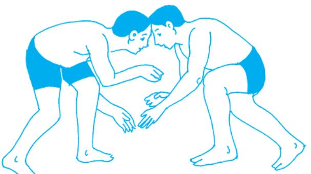

*Fig. 6.26 : Wrestling Stance (Staggered)*

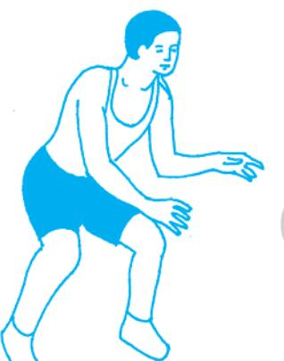

*Fig. 6.25 : Square Stance*

Chapter-6 Individuals Sports.indd 76 08-11-2016 11:36:46 AM

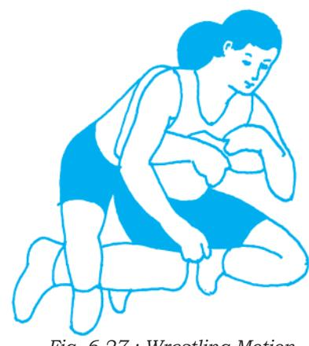

*Fig. 6.27 : Wrestling Motion*

#### *Motion*

Wrestling involves a tremendous amount of motion. Wrestler may circle their opponent. The wrestler may attack their opponent with a take down attempt. They may also snap the opponent to the mat and spin around behind him/her. The wrestler may also sprawl to defend against a take down and need to learn to move fluidly and quickly. All the movements need to be explosive and crisp.

#### *Level Change*

Before a wrestler shoots a take down, he/she must lower his/her level. This is accomplished by lowering his/her hips. When a wrestler sprawls to counter a take down he/she is also using level change. In addition, a wrestler may lower and raise his/her level to force a reaction from his/her opponent. A wrestler needs to be able to maintain good posture while changing levels. For instance, a wrestler sometime overextends when shooting a take down because he/she forgot to lower his/her level first. A wrestler should always bend at the knees, not at the waist.

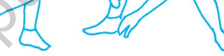

*Fig. 6.28 : Wrestling Level Change*

#### *Penetration*

When a wrestler shoots for a take down on his/her opponent, he/she does not merely reach for the opponent's legs or dive wildly for the opponent's legs. He/she makes sure to be close enough to the opponent and then takes a deep penetration

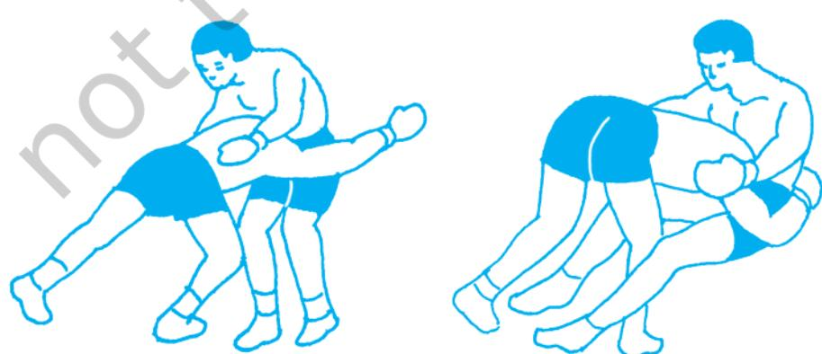

*Fig. 6.29 : Wrestling Penetration*

Chapter-6 Individuals Sports.indd 77 08-11-2016 11:36:46 AM

step, keeping the back straight and head up. Lower the level and penetrate deeply. Always make it sure to keep the hips forward and lower the shoulders, while driving through the opponent.

#### *Lifting*

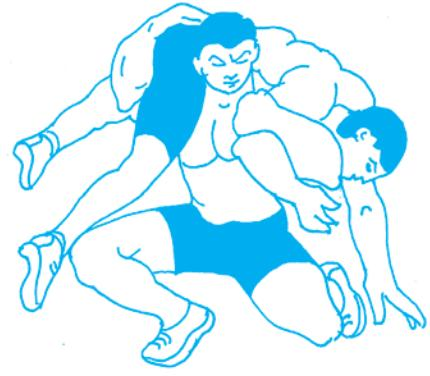

A wrestler often lifts his opponent off the mat when executing a take down as shown in fig. 6.30. He/she may also lift an opponent who has performed a stand up from the bottom position. The wrestler lifts his/ her opponent and returns to the mat. The legs and the hips are most important when lifting. For instance, when a wrestler shoots a double leg, he/she does not lift with the back. He/she gets the hips squarely down and then uses the leg and hip strength to lift the opponent off the mat. When a wrestler has been lifted off the mat, he/she is in a very vulnerable position, lacking support and balance. *Fig. 6.30 : Wrestling Lifting*

## **Assessment**

#### **Answer the following questions**

- 1. Write down the history of badminton game.
- 2. Write any five rules of badminton game.
- 3. Write down the dimensions of the badminton court.
- 4. How do games and sports help to improve health fitness?
- 5. List down the Gymnastic events for men.
- 6. List down the Gymnastic events for women.
- 7. Which motor abilities can be developed through Gymnastics?
- 8. Write a short history of Judo.
- 9. Draw a diagram of Judo competition area with all specifications?
- 10. What is Judogi?
- 11. What is the name of the apex body which controls the Judo all over the world?
- 12. List down the names of swimming strokes.
- 13. Explain the technique of any stroke of your choice.
- 14. How does swimming help to improve the physical fitness of an individual?
- 15. Which motor abilities improve swimming performance?
- 16. Write any five important rules of the Table Tennis game.
- 17. How can playing Table Tennis help us in the improvement of our health?
- 18. Which fundamental skill did you enjoy the most in Table Tennis game and why?

Chapter-6 Individuals Sports.indd 78 08-11-2016 11:36:47 AM

- 19. Explain any one fundamental skill of Table Tennis.
- 20. Briefly describe the history of wrestling.
- 21. What is *Par terre*?
- 22. What is the duration of a wrestling bout?
- 23. What is the ordered position in wrestling?
- 24. Collect information about national and international Gymnasts with their photographs and write about them.
- 25. If you are a swimmer write down about how you enjoy it. If not, ask any of your friends who has a swimming experience of pond, river or pool about his/her experience.

#### **Fill in the blanks**

- (i) Measurement of badminton court for singles is .....…….
- (ii) Measurement of badminton court for doubles is ....…….
- (iii) Height of the net from the floor is ………………….......
- (iv) Rhythmic Gymnastics was included in Olympic games in …........... at…..…......
- (v) Measurement of floor for floor exercises in gymnastics is ……….. metre.
- (vi) Judo was included in Olympic Games in………….....
- (vii) The Judo platform is of 18 m × …….............................
- (viii) The meaning of *Ritsu Rei* ...........................................
- (ix) The meaning of *Za Rei* ...............................................
- (x) The meaning of *Migi Kumikata* ...................................
- (xi) The meaning of *Hidari Kumikata* ................................
- (xii) The meaning of *Shintai* ..............................................
- (xiii) The meaning of *Tsugiashi* ..........................................
- (xiv) The meaning of *Ayumiashi* .........................................
- (xv) Standard swimming pool should be of ....……….m length and …..……m width.
- (xvi) There are …….....….. lanes in standard swimming pool.
- (xvii) Width of a swimming lane is ...............…….................
- (xviii) Height of the starting platform of a swimming pool should be ......................
- (xix) Temperature of water in a swimming pool should be ideally ........................
- (xx) Measurement of a Table Tennis table is ……...............… length…............….breadth.
- (xxi) Height of the Table Tennis table from floor is ....……. .
- (xxii) Height of the net from surface of the table in TT is …. .
- (xxiii) Length of the net TT is ……………….....…. .
- (xiv) Circumference of the TT ball is.....…and weight is…...…
- (xxv) Measurement of wrestling mat is …….........…………. .
- (xxvi) The measurement of the mat area in wrestling is ...............in length and ..............in width.
- (xxvii) The diameter of the central circle in wrestling is …… .
- (xxviii) The diameter of the yellow circle in a wrestling area... .

Chapter-6 Individuals Sports.indd 79 08-11-2016 11:36:47 AM

#### **Tick (**P**) mark either Yes / No**

| (i) | Four players are required to start a game in Badminton. |
| --- | --- |
|  | (Yes/No) |
| (ii) | International Badminton Federation (IBF) was founded |
| in 1934. | (Yes/No) |
| (iii) | Player can leave the court in Badminton at any time. |
|  | (Yes/No) |
| (iv) | Breadth of badminton net is 2'6". (Yes/No) |
| (v) | Height of the badminton net from floor is 5 feet.(Yes/No) |
| (vi) | Uneven bar is a men's event. (Yes/No) |
| (vii) | Balancing beam is a women's event. (Yes/No) |
| (viii) | Pommel horse is a men's event. (Yes/No) |
| (ix) | Parallel bars is a men's event. (Yes/No) |
| (x) | International Gymnastic Federation was founded in |
| the year 1881. | (Yes/No) |
| (xi) | The first school of Judo was started in 1882.(Yes/No) |
| (xii) | Judo was included in the Olympic Games in 1968. |
|  | (Yes/No) |
| (xiii) | Professor Jigoro Kano started the first school of Judo. |
|  | (Yes/No) |
| (xiv) | Judo is a sport of European origin. (Yes/No) |
| (xv) | Shizentai means posture. (Yes/No) |
| (xvi) Ukeme means breakfall. | (Yes/No) |
| (xvii) Ushiro means back. | (Yes/No) |
| (xviii) Mae means front. | (Yes/No) |
| (xix) Kake means execution. | (Yes/No) |
| (xx) Kuzushi means breaking the balance. | (Yes/No) |
| (xxi) Can a swimmer change the lane after a start? (Yes/No) |  |
| (xxii) There are four strokes in swimming. | (Yes/No) |
| (xxiii) A free style swimmer has to perform a similar type of |  |
| movement. | (Yes/No) |
| (xxiv) A back stroke swimmer is not allowed to take rollover |  |
| turn. | (Yes/No) |
| (xxv) Table Tennis game was invented in 1979. | (Yes/No) |
| (xxvi) Player in Table Tennis can be substituted at any |  |
| time. | (Yes/No) |
| (xxvii) Player in Table Tenis can leave the game at any time. |  |
|  | (Yes/No) |
| (xxviii) | Every player in Table Tenis has to change ends after |
| each game. | (Yes/No) |
| (xxix) Wrestling is an outdoor sport, which is played on the |  |
| ground. | (Yes/No) |
| (xxx) The wrestlers come to shake hands in the centre of the |  |
| mat in red and blue colour. | (Yes/No) |
| (xxxi) | The women free style wresting was introduced in |
| 2004 | (Yes/No) |
| (xxxii) Every bout contains 3 round of 2 minute each.(Yes/No) |  |

Chapter-6 Individuals Sports.indd 80 08-11-2016 11:36:48 AM

