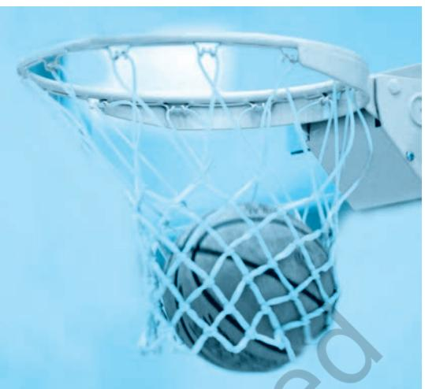
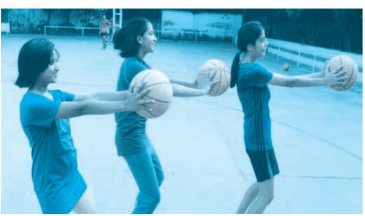
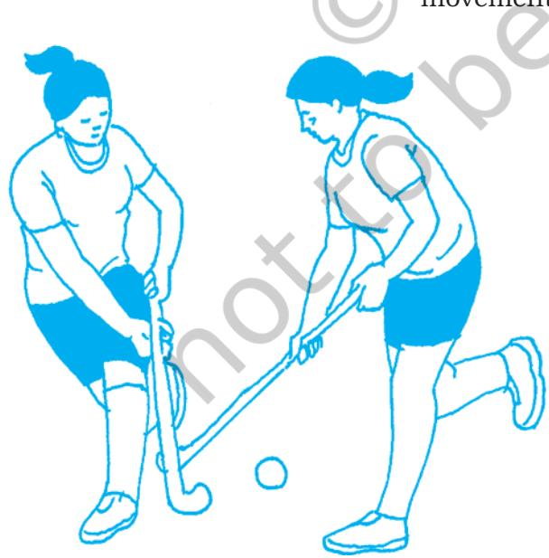

# **7.1 Introduction**

A team game is an activity in which players of the same team work together to achieve the goal. Team games help us to work together for winning vis-a-vis respect for each other. Team games are also good for new learners as these games can help in building self -esteem and team cohesion. For a good team in any game, the players have to stay together for progress and work together for success. Below are mentioned some of the team games.

# **7.2 Basketball**

You may have played basketball or have seen this game being played. Basketball is one of the world's most popular game. It is a fast, free-flowing, high-scoring team game. The players throw a ball in a basket horizontally positioned to score points while following a set of rules. Two teams play on a marked rectangular court with a basket at each end. The rules allow all players to move freely around the court and occupy any position on the court. All players get an equal opportunity to score basket. The way in which the game is re-started after a point is scored or a rule infringement makes it a fast game with few breaks in between regulation timing. To play this game, students should learn and practise the basic skills of ball dribbling, passing, receiving and shooting. Game of basketball involves neuromuscular coordination and often tall players are preferred.

# **7.2.1 History**

The game of basketball was originated at the Springfield College of Physical Education Massachusetts, USA in 1891 by Dr James Naismith. In 1894 Naismith drew up the first 13 rules, which still form the basis of modern basketball rules. In India, the YMCA at Kolkata introduced basketball some 80 years ago. Later the YMCA established at Chennai in 1920 played an important role in the development of this game. Now-a-days basketball is one of the most favourite games in many schools and colleges. The game is played by both men and women of all ages and abilities. In order to promote the sport nationally and internationally and organise sports events related to basketball, Basketball Federation of India (BFI) was set up in

*Source: Official Basketball rules 2012, as approved by FIBA Central Board, 29th April 2012, valid as of October 2012* 

#### *Fig.7.1 : Basketball Court*

# **Activity 7.1**

Is it possible to play basket ball with different dimensions of court and with different ball size? Please write your comments. Also findout how playing any team game helps in improving physical and mental health?

1950. At the same time every state in India had formed a State Basketball Association. The first National Basketball event was held in Delhi in 1934, every two years till 1951 and there after it became an annual feature.

#### **7.2.2 How to Play Basketball**

- • Basketball is played on a rectangular court, which could be an indoor wooden court or an outdoor concrete court. Basketball court dimensions are 28× 15 metres. The court is divided into two sections, called half-courts, by the mid-court line, where the game starts with a jumpball. A jumpball is when a referee throws the ball up at centre circle to determine which team gets possession. Two players from opposing teams jump up to tip the ball, in the hope that one of them will secure the ball.
- • The duration of the game of each quarter is ten minutes with 2 minute rest between first and second quarters and third and fourth quarters. Between second and third quarters the rest is 15 minutes. The duration of extra time is five minutes. Teams exchange courts in each quarter. The clock is stopped while the play is not active.

Chapter-7 Team Games indd.indd 82 18-11-2016 4:39:17 PM

A team may consist of not more than twelve members, including a captain. But only five players from each team are on the court at one time. Substitutions are unlimited but can only be done when play is stopped.

The team with the ball, attempting to score is called 'on offense'. The team defending from scoring is called 'on defense'. The ball is moved in two ways: dribbling and passing to teammates. If the ball goes out of bounds, due to the offensive player/team, the possession is given back to the defensive team. This is a form of penalty, which results in the loss of a possession of ball.

Both men and women wear, a standard uniform consists of a pair of shorts and a jersey vest with a clearly visible number, printed on both the front and back. Players wear high top sneakers that provide extra ankle support.

The game is monitored by the officials consisting of the referee, one or two umpires and five table officials. The table officials are responsible for keeping track of each team scoring, timekeeping, and individual and team fouls, player substitutions, alternating possession arrow, and stop–and-goclock.

**Equipments –** Essential equipments in a basketball game are: the ball, clocks, score sheets, scoreboard(s), alternating possession arrows, whistle and clock systems.

**Fouls –** An attempt to unfairly disadvantage an opponent through physical contact is illegal and is called a foul. Players who are fouled either get ball possession or are awarded one or more free throws, which is attempted from a line 15 feet (4.6 m) from the basket. Each player is allowed five fouls before they are rejected from the game and cannot come back.

#### **7.2.3 Fundamental Skills**

We are well aware that to play any game one has to learn some skills, To play basketball game one need to learn the following fundamental skills:

- **• Player's stance**  Hold the ball with both hand fingers open, pointing forward, thumbs upward, feet apart and the knees slightly bent as shown in Fig 7.3

*Fig.7.3 : Player Stance*

*Fig.7.2 : Ring, Net and the ball*

Chapter-7 Team Games indd.indd 83 18-11-2016 4:39:19 PM

- • **Ball Handling Exercises**  Ball handling exercises are given below.
- (i) Rotate the ball around the knees
- (ii) Rotate the ball around waist.
- (iii) Rotate the ball around neck.
- (iv) Throw the ball front to back.

*Fig. 7.4 : Two-hand Passing*

*Fig. 7.5 : Shooting*

# **Activity 7.2**

Observe a basketball match and identify different forms of shooting.

# **Activity 7.3**

Set shot illustration is given in Fig.7.5 Collect photographs of other forms of shooting from various sources books, magazines etc. and discuss with your classmates.

**• Dribbling** – If you have seen any basketball game you might have observed that players bounce the ball between the dribbling hand and playing surface. This action of continuous bouncing is called dribbling. If dribbling is done on the spot, it is called stationary dribbling. You might have also noticed that players perform varied actions while dribbling. The variations are cross over dribbling that is changing of dribbling hand at the front side, reverse dribbling that is taking 180 degree turn from rear side and changing the direction, behind the back dribbling that is taking the ball from back side and bounce it on another side.

**• Passing and receiving** (Fig. 7.4) – While playing a basketball game, you need to transfer the ball from one player to another. Transfer of possession of the ball is called passing and a player who receives the ball is known as receiver. There are different types of passing namely–chest pass, overhead pass, bounce pass, baseball pass, hook pass and behind the back pass etc.

**• Shooting** (Fig. 7.5) – You might have observed that a player has to throw the ball into basket of the opponent team to win the game. Therefore, each team should make an attempt to score by throwing the ball in different forms of shooting such as two-hand set shot, one-hand set shot, lay up shot, jump shot and hook shot etc.

- **• Rebounding** (Fig. 7.6) Whenever a player makes an attempt to score the basket and if it is missed then the ball will rebound from over the ring or board.
- **• Individual Defence** (Fig. 7.7) While playing basketball if a team loses the possession of the ball, immediately player has to turn to individual defence. For a good defence, following factors are important (i) location of the player (ii) guarding distance (iii) movement (iv) vision and (v) footwork.

Chapter-7 Team Games indd.indd 84 18-11-2016 4:39:20 PM

*Fig. 7.6 : Rebounding Fig. 7.7 : Individual Defence*

# **7.3 Cricket**

You might have seen a cricket match being played in your school or on the television. Also you might have yourself played this game with your friends. This is a bat and ball game played between two teams on a field. In the centre of the field is a rectangular pitch. One team bats, trying to defend the wicket and scoring as many runs as possible. The other team bowls and fields, trying to dismiss the batsmen and thus limiting the runs scored by the batting team. Run can be scored by the striking batsman hitting the ball with the bat, running to the opposite end of the pitch and touching the crease there without being dismissed. The teams switch between batting and fielding at the end of an inning. In general this game is very popular.

#### **7.3.1 History**

The origin of the game of Cricket was gradual. The Hambeldon Club which was founded in about 1750

had played a significant part in the evolution of the game. It was superseded by the Marylebone Cricket Club (M.C.C) with its headquarters at Lords, London. Cricket became an international game with the formation of the Imperial Cricket Conference (I.C.C) in 1909. The name of Imperial Cricket Conference was changed to International Cricket Conference (later, Council) to enable countries outside the Commonwealth to become its members. Earlier only test matches were played where each team played two innings in five or lesser days. First One day International match was played in 1971 with limitations of overs per inning. The governing International Cricket Council (ICC) saw its potential and staged the first

*Fig. 7.8 : Cricket*

Chapter-7 Team Games indd.indd 85 18-11-2016 4:39:21 PM

2024-25

# **Activity 7.4**

- • What is the full form of IPL?
- • Write about your observation of any cricket match.
- • Discuss with your friends, any cricket match you have seen.
- • Write health related advantage of playing cricket.

# **Activity 7.5**

How do you think that cricket can be played in other recreational form(s)? explain.

*Fig. 7.9 : Out*

limited over Cricket World Cup in 1975. In the 21st century, a new limited over form, Twenty20 and more recently IPL (Indian Premier League), has made an immediate impact.

Cricket was brought to India by the British. An England team toured India in 1902-03. An All-India team went on a tour of England in 1911 under Maharaja Bhupinder Singh of Patiala. The Indian Cricket Control Board came into being towards the end of 1928. India entered the international arena and played its first official Test against England in 1932. Meanwhile Prince Ranjit Singh of Nawanagar who had gone to England for further studies, made a remarkable name for himself in the game of cricket. He is generally acknowledged as the Father of Indian Cricket although he played only in England. He will always be remembered through the National Cricket Championship known as Ranji Trophy.

#### **7.3.2 How to play Cricket**

- • A cricket match is played between two teams of eleven players each.
- • The match is divided into periods called Innings. During an Inning, one team fields and the other bats. The two teams switch between fielding and batting after each Inning.
- • All eleven members of the fielding team take the field, but only two members of the batting team are on the field at any given time. The fielding team's eleven members stand outside the pitch, spread out across the field.
- • Behind each batsman is a target called a wicket. One designated member of the fielding team, called the bowler, is given a ball, and he attempts to deliver (bowl) the ball. If the bowler succeeds in hitting the wicket (Fig. 7.9), or if the ball, after being struck by the batsman, is caught by the fielding team before it touches the ground, the batsman is out.
- • If the batsman is successful in striking the ball and the ball is not caught before it hits the ground, the two batsmen may then try to score runs for their team by running across the pitch. Each crossing and grounding by both batsmen is worth one run. The batsmen may attempt multiple runs or select not to run at all.
- • If the batsman hits the bowled ball over the field boundary without the ball touching the field, the batting team scores six runs. If the ball touches the ground and then reaches the boundary, the batting team scores four runs.

Chapter-7 Team Games indd.indd 86 18-11-2016 4:39:22 PM

- • The inning is complete when 10 of the 11 members of the batting team have been dismissed, one always remaining "not out", or when a set number of "overs" has been played.
- • Field with positions in cricket are shown in Fig. 7.10

#### **7.3.3 Field and Equipments**

- • The pitch is at the centre of the field. It is the area of the ground between the bowling creases one on both sides and it is 3.05m in width and 20.12m in length. The pitch shall not be changed during a match unless it becomes unfit for play.
- • The ball will be leather skinned and its weight must not be less than 155.9 gms and not more than 163 gms. The circumference of the ball must be in between 22.4cm and 22.9 cm.
- • A wooden bat should be 10.8 cm in width and 96.5 cm in length including the handle.

# **Activity 7.6**

Collect all the cricket standardised equipments and take them to the class. Have a discussion on measurement of different equipments and check whether these are of correct specifications.

*source: www.dsr.wa.gov.au/assets/images/Diagrams/cricket-field Fig. 7.10 : Cricket Field*

Chapter-7 Team Games indd.indd 87 18-11-2016 4:39:22 PM

# **Activity 7.7**

On a chart paper/ blackboard draw the cricket field along with pitch. Show all the fielding positions and discuss with classmates.

- • Each wicket is 22.80 cm in width and consists of three wooden stumps with two wooden bails on the top. The wickets should be pitched opposite and parallel to each other at a distance of 20.12 m between the centre of the two middle stumps. The stumps stand 70 cm tall and each bail is 11.1cm in length.
- • The bowling crease is marked in line with the stumps at each end and is 2.64 m in length.
- • The bowler bowls the ball in sets of six deliveries (or "balls") and each set of six balls is called an "over". When six balls have been bowled, another bowler is deployed at the other end, and the fielding side changes ends while the batsmen do not. A bowler cannot bowl two successive overs, although a bowler can bowl unchanged at the same end for several overs.

- • Two umpires are appointed one on each end (bowlers end and strikers end) to monitor the game. There is also a third umpire for play review. The umpire's decision during a game is final in all matters.
# **7.4 Football**

With your friends you might have played football. Do you know the history of the game? Let us study some important information about football. Football was played in many countries in some form or the other. Federation Internationale de Football Association (FIFA), the world body to govern football was founded in Paris in 1904. In India, this game is governed by the All India Football Federation (AIFF). According to FIFA (Federation Internationale de Football Association), the very earliest form of the game for which there is scientific evidence was an exercise, a military manual dating back to the second

Chapter-7 Team Games indd.indd 88 18-11-2016 4:39:22 PM

and third centuries BC in China. In India, football began its journey during the British rulers and in no time it became popular among the masses. The first recorded game took place between the 'Calcutta Club of Civilians' and the 'Gentlemen of Barrackpore' in 1854. The first football association, "The Indian Football Association" (IFA) was established in Kolkata in 1893. It was later on replaced by All India Football Federation (AIFF). The decade of 1951 to 1962 is known as the golden era in the history of Indian football, as the country put up commendable performances in a number of international competitions. India won gold medals in 1951 and 1962 Asian Games, held at New Delhi and Jakarta respectively. India became the first Asian nation to reach the Olympic football semi finals in the 1956 Melbourne Olympics. The AIFF had joined the Federation Internationale de Football Association (FIFA) in 1948.

#### **7.4.1 Field and Equipment**

- • The ball is made of leather, spherical in shape and the circumference of the ball is 68 to 70 cm whereas, the weight is 410 g to 450 g.
#### **7.4.2 How to play football**

- • The duration of the match of football is of 90 minutes divided into two equal halves of 45 minutes each with an interval of 10 – 15 minutes.
- • In each team there are eleven players one of whom is the goalkeeper and six substitute players. To start a game, a team requires at least seven players.
- • A coin is tossed and the team that wins the toss has the option to decide either of two goals they decide to attack in the first half of the game or to opt "KICK OFF" to start the match from center line. The option unchosen by the toss winner has to be opted by the toss loser. Team which has not started with kick off, starts in second half with changed ends with a kick off.
- • A goal is scored when the ball fully crosses over the goal line. The ball has also to go between the goal posts and under the crossbar. Without any rule violation or break or without committing foul.
- • Penalty of direct kick is given to the team for acts or attempt to act like kicks, trips and jumps during scoring.
- • An indirect free kick is given to the opposing team in case a goalkeeper inside his/her own penalty area control the ball more than six seconds with his/her hands or touches the ball again with hands after release.
- • For direct or indirect free kicks, the ball must be stationary when the kick is taken and the kicker does

# **Activity 7.8**

Write any five rules of football games and discuss with your classmates.

# **Activity 7.9**

Draw the sketch of the football field with all specifications on a chart paper/ blackboard and discuss with your classmates.

Chapter-7 Team Games indd.indd 89 18-11-2016 4:39:22 PM

• 

not touch the ball a second time, until it has been played by another player.

- • A penalty kick is given against a team that commits one of the ten offences. A goal may be scored directly from a penalty kick.
- • A goal cannot be scored directly from a Throw-in. A throw is given when the ball passes over the touchline, either on the ground or in the air. The throw will be taken from the point where it has crossed the touchline, by the opponents who last touched the ball.
- • A corner kick is awarded when the whole of the ball, passes over the goal line under the cross bar, either on the ground or in the air, having last touched a player of the defending team, and a goal is not scored in accordance with the relevant law.

*Fig. 7.12 : Dimensions of the football field*

Chapter-7 Team Games indd.indd 90 18-11-2016 4:39:23 PM

**Card system** – In football, there are two types of cards. *Yellow Card* which is used to communicate that a player, substitute, substituted player has been cautioned.

- **•** *Red Card* is used to communicate that a player, substitute or substituted player has been sent off.

*Fig. 7.13 : Dribbling*

#### **7.4.3 Fundamental Skills**

- • **Dribbling** (Fig. 7.13) This is the most important skill in the game. The ball is dribbled on the ground with gentle strokes of the feet and moving in a specific direction with control. In dribbling, the player can use either the inside or the outside of the feet.
- • **Heading** (Fig. 7.14) Player should have made contact with the forehead in general otherwise any part of the head can be used. Sometimes the player may use the top of his head on a long pass or throw in. It is important for the player to keep eyes open and fixed on the ball and the body be positioned in line.
- **• Kicking** (Fig. 7.15) The ball is kicked by keeping the toe pointed out and ankle locked, strike the ball with laces part (in step) of the foot. Knees should be kept slightly bent and the ball should be kicked straight up into the air. The kicking leg should keep on swinging forward and upward direction in the direction of kicking.

# **Activity 7.10**

Practise dribbling heading, kicking, tackling and passing skills with your classmates.

*Fig. 7.14 : Heading Fig. 7.15 : Kicking*

Chapter-7 Team Games indd.indd 91 18-11-2016 4:39:23 PM

*Fig. 7.16 : Tackling Fig. 7.17 : Passing*

- **• Tackling** (Fig. 7.16) This is gaining the ball possession or knocking it out from the opposing footballer
- **• Passing** (Fig. 7.17) The instep or the push pass is a common pass used in football. In this, the passing foot turns outward, locking the ankle, keeping the knee slightly flexed. It is a push type of action.

# **7.5 Hockey**

You might have seen a Hockey match either in your school or on the television. Let us know more about this game by getting familiar with its history. Hockey as a game had been brought into India by the British servicemen and the first Hockey club was formed in Kolkata in 1885. The Hockey Association was founded in 1886. The first international tournament took place in 1895 and the International Rules Board was founded in 1900. The International Hockey Federation is the global governing body of field hockey founded on 7th January 1924

> in Paris. India won all five Olympic Games from 1928 until 1956 and then again won in 1964 and 1980. In 1976 Montreal Olympics, artificial turf was used for the first time and that resulted in development of new tactics and techniques and also modification in rules.

#### **7.5.1 Equipment and Facilities**

• Hockey sticks are made of wood or composite material and it should pass through two inch ring. (Fig.7.18)

- • The weight of the ball is between 156 gms to 163 gms with circumference of between 224 mm to 235 mm.(Fig.7.18)
- • A goalkeeper must wear a helmet, leg guards and kickers. Usually she/he wears extensive additional protective equipment including chest guard, padded shorts, heavily padded hand protectors, groin protector, neck guard and arm guards. *Fig. 7.18 : Hockey stick and ball*

Chapter-7 Team Games indd.indd 92 18-11-2016 4:39:24 PM

*Fig. 7.19 : Hockey Field Dimensions*

- • The goal post is 2.14 m (7ft) in height and 3.66 m (12 ft) in width. Distance of shooting circle is 14.63 m from centre of goal line and dotted circle is 5 m away from shooting circle.
- • The lines across the field are 22.9 m from each back-line and touching one side line to others.

#### **7.5.2 How to Play Hockey**

- • A match is played between two teams of 11 players each, including a goalkeeper.
- • The duration of the game is two halves, 35 minutes, each in collegiate and international play. The rest is of 10 minutes.
- • The ball must be passed or dribbled down the field with the flat side of the stick.
- • A goal is scored when an attacker strikes the ball into the goal from within the striking circle, even if the ball touches the defender and goes into the goal (Own Goal).
- • If the score is tied after the stipulated time, extra time of two 7½-minute periods is played during which the golden goal rule applies. Even then if the score remains a tie then each team selects five players to decide the winner by tie breaker rule.
- • A foul is called when any player shields, obstructs, plays the ball with rounded side of the stick, interferes in the game, charges, hits or trips an opponent, uses the foot or leg, raises the stick, stops the ball in the air, hits, etc.
- • If a defensive player commits foul within the shooting circle, the attacking team is awarded a penalty corner.
- • A penalty corner takes place, at least 10 m from the nearest goal post. The attacking player pushes or hits

# **Activity 7.11**

Draw a sketch of the Hockey field on the chart paper/ blackboard and through a discussion with your classmates indicate all the measurements.

# **Golden goal rule**

When the goal is scored during extra time, the match stops and the team scoring goal is declared as the winner.

Chapter-7 Team Games indd.indd 93 18-11-2016 4:39:25 PM

the ball to his/her teammate standing just outside the striking circle line. One player pushes the ball into the striking circle and the teammate hits into the goal post. During the hit only five defensive players will remain on self back line and rest of the players will remain on the centre line.

- • A penalty stroke is awarded for any intentional violation by the defensive player in the circle for preventing a sure goal by foul means.
- • During the penalty stroke, the goalkeeper must stand with both feet on the goal line and may not move either foot until the ball has been played. The offensive player may push, flick or scoop the ball from the penalty spot.
- • When the attacking team plays the ball over the goal line, apart within goal post, the defense receives a 16 yard hit. The free hit is taken 16 yards from the spot where the ball crossed the backline.
- • A push-in or hit-in is awarded to the opponents if a player hits the ball wholly over the sideline. All other opponents and their sticks must be at least 5 m away from the spot where the ball is put into play.

#### **7.5.3 Fundamental Skills**

- **• Hitting**  The stick should be held with the left hand on the top and right hand should be just below it. Ball is positioned outside the right foot. The player strikes the ball with the centre of the stick by using swinging movement of the stick towards the ball.
**• Stopping** – The left hand should be kept on top of the handle of the hockey stick and the right hand near the middle of the stick. The body should face the direction of the ball, knees slightly bent and body also slightly bent forward.

When the ball is coming towards the player, the stick should be brought forward in line of the ball and gradually withdrawn and placed on the ground, slightly inclining it forward from top.

**• Dribbling** – A 'V' shape is formed by the index finger and thumb of the left hand which is placed on the inner edge of the top of the handle of the hockey stick and the right hand holds the stick loosely in the middle portion.

*Fig. 7.20 : Playing Hockey*

Chapter-7 Team Games indd.indd 94 18-11-2016 4:39:25 PM

# **Activity 7.12**

- • Hold the stick with both hands and keep it parallel to the ground. Tap the ball with stick for a minute.
- • Stand in front of the wall and with a stick in hand and ball in front, push the ball to the wall and stop.
- • Once you reach perfection in stopping and pushing, increase the distance between yourself and the ball and also between yourself and the wall.

The knees are flexed, upper body bending forward and feet shoulder width apart. The ball is placed in front of the right leg 8–12 inches away. The ball is tapped from the plain surface of the middle of the blade towards the left and then tapping the ball from the reverse stick in front of the left foot towards the right. This tapping movement continues from right to left and left to right.

- **• The scoop**  This skill is also called the "aerial pass" or the "overhead pass". The ball is raised in the air over the heads of the opponents.
- **• The overhead flick**  The ball is kept in a stationary position and then raised over the heads of the opponents.
- **• The push**  The grip is the same as for dribbling. A 'V' shape is formed by the index finger and the thumb of the right hand which shall be on the inner edge

this skill.

*Fig. 7.22 : Player pushing the ball*

*Fig. 7.21 : Players dribbling with ball*

Chapter-7 Team Games indd.indd 95 18-11-2016 4:39:26 PM

the stick forward.

pointing downwards. The index finger of the right hand points downwards for better control.

A sideward stance is taken where the left shoulder faces the target and the ball is placed in front of the left foot in line with the right shoulder. Knees are slightly bent while executing

The stick is placed just behind the ball and it is pushed along the ground towards the target wherein the left hand is pushing the stick backwards and the right hand is pushing

*Fig. 7.23 : Kabaddi Catch*

# **Activity 7.13**

Draw the sketch of the Kabaddi court with all specifications on a chart paper or blackboard and discuss with your class mates.

# **7.6 Kabaddi**

You may be familiar with Kabaddi game. Kabaddi is one of the Indian games that demands agility, power and neuro muscular coordination. It also needs breath-holding capacity, quick response and a great deal of presence of mind. The game can be played on a plain and soft surface.

The first known framework of the rules of Kabaddi as an indigenous sport of India was prepared in Maharashtra in the year 1921. The modern Kabaddi game was played all over India and some parts of South Asia from 1930. The All India Kabaddi Federation was formed in the year 1950. The new body, Amateur Kabaddi Federation

of India (AKFI) came into existence from the year 1972.

The 1st Asian Kabaddi Championship was held in the year 1980 and was included as a demonstration game in the 9th Asian Games, New Delhi in the year 1982. The game was included in the South Asian Federation (SAF) games from the year 1984 at Dhaka, Bangladesh. Kabaddi was included as a discipline in the 11th Asian Games Beijing 1990 and India won the lone Gold Medal of Kabaddi in the 11th Asian Games Beijing 1990.

#### **7.6.1 Kabaddi Court**

Lenght - 13 m.

Width - 10 m.

For playing Kabaddi, it is essential to have levelled ground with soft surface.

#### **7.6.2 How to Play Kabaddi**

- • There are two teams in Kabaddi. Each team consists of 12 players, out of which seven players play and remaining five are substitutes.
- • A coin is tossed and the team that wins the toss shall have the choice of the court or the raid.
- • The duration of the match has two halves of 20 minutes each, with an interval of five minutes.
- • The player who enters the court of opposite team is known as raider and utters the word "Kabaddi" continuously and repeatedly in one breath.
- • The raider has to repeat the word Kabaddi without break, clearly, aloud sounding within the course of one respiration, it is called **'Cant'**.
- • A player/raider must begin **Cant** before he/she enters into the opponent's court.

Chapter-7 Team Games indd.indd 96 18-11-2016 4:39:26 PM

- • If a raider touches an opponent player during cant or if any part of the body of an opponent touches the raider and raider touches his court with the cant, the opponent is said to be out.
- • If opponent (s) hold the raider without breaking rules and do not allow him to reach her/his court until she/ he loses the cant is known as holding the raider.
- • If any player goes out of the boundary during the course of play, she/he shall be out and opponent will get one point.
- • Once the raider reaches his/her court, opponent shall raid within five seconds.
- • If one/two players are left in a team, the captain of the team may declare team out.
- • Each team shall be allowed to take two "time outs" of 30 seconds in each half. However, during time out the teams shall not leave the ground.
- • Players can be substituted with the permission of referee during time out or interval.
- • Team which scores the highest number of points at the end of the match shall be declared the winners.
- • If a raider does not touch the "bauck line", he is declared out.

# **7.6.3 Fundamental Skills**

#### *Raiding Skills*

The raider uses the following skills to make a successful raid.

- **• Feint or fake –** A movement the raider uses to confuse the defender about his next move.
- **• Leading leg raid –** The raider assumes a boxer's shuffle stance throughout the raid.
- **• Shuffling raid –** The raider shuffles his/her feet throughout the raid and suddenly changes the direction.
- **• Reverse step raid –** The raider keeps changing his/her attacking front foot and back foot throughout the raid.
- **• Hand touch** (Fig. 7.24) **–** The raider extends his/her arm towards the defenders and tries to create a struggling action to make one opponent out.
- **• Hand swings** These are used by the raider to touch his/her opponents or to touch one of the opponents.
- **• Toe touch –** Here the raider extends his/her toes forward to touch the defender to touch out one of the opponents.
- **• Foot touch** (Fig. 7.25)- In this skill, the raider tries to touch the defender with his/her foot to touch out one of the opponents.
- **• Kicking –** The raider does a back kick, side kick or roll kick in order to touch the defenders.

# **Activity 7.14**

Form two kabaddi teams from your class and play the game following the rules explained in the text.

Also prepare a Kabaddi Court in the field

# **Activity 7.15**

Observe a Kabaddi match and identify the type of raiding skills and prepare a checklist. Finally, compare the same with your classmates.

Chapter-7 Team Games indd.indd 97 18-11-2016 4:39:26 PM

- **• Safe raid –** Here the raider during a struggle can use the following tactics: jumping over a player, diving towards the centre line or rolling tactics.
#### **Defensive skills**

The antis use various techniques to save themselves and/or score point.

- (a) **Catch or hold** while catching a defender should keep feet apart, knees bent and body weight on the toes. The different types of holds are wrist catch, ankle catch, dive and catch as well as trunk catch.
- (b) **Blocking** Defenders block the path of the raider by creating wall of obstruction like full circle and half circle.

# **7.7 Kho-Kho**

Kho-Kho is one of the popular indigenous games of India and is an inexpensive sport like kabaddi because it does not require much equipment. Many historians are of the view that the game of Kho-Kho is a modified version of 'Run and Chase'. In ancient era, a version of the Kho-Kho game was played on *raths* or chariots in Maharashtra. This was known as Rathera.

First sets of Kho-Kho rules were framed in the earlier part of 1900. A committee was constituted by the Gymkhana, Pune in 1914 for framing the Kho-Kho rules and the first Kho-Kho rule book was published in 1924 by Gymkhana, Baroda.

#### **7.7.1 Kho-Kho Play Field – Equipment and facilities**

The playground of Kho-Kho is rectangular. The dimensions are as follows

- • Length= 29 m
- • Width = 16 m
- • Free Zone 2.75 m
- • First line from the post = 2.50 m

Chapter-7 Team Games indd.indd 98 18-11-2016 4:39:27 PM

- • First square to second square = 2.30 m
- • Height of the post = 120–125 cm

# **7.7.2 How to Play Kho-Kho**

- • There are two teams. Each team consists of 12 players, out of which nine players shall take the field in the beginning of the game.
- • The team that wins the toss shall have the option of chasing or running.
- • Any eight chasers shall occupy the squares facing the side lines in such a way that no two adjacent chasers face the same side line. The ninth chaser shall start the chase.
- • The first batch of three runners shall be inside, in the play field and the remaining runners shall sit outside in the area marked for them.

# **Activity 7.16**

Keep all equipment together and make a Kho-Kho court in your school.

Chapter-7 Team Games indd.indd 99 18-11-2016 4:39:30 PM

# **Activity 7.17**

- • Practise all fundamental skills.
- • Play a match against other sections.
- • After a runner is out, he/she shall sit outside in the marked area.
- • Chaser shall not leave the square without getting kho.
- • Attacker shall not cross the central lane if she/he does so, it will be a foul.
- • Kho is to be given from behind a chaser.
- • After giving a kho, a raider shall sit down immediately in the square of the sitting chaser.
- • After getting a kho, the sitting chaser shall become an active chaser and move in the half that she/he was facing.
- • A chaser shall move in the direction she/he turns the shoulder first. If she/he twists the shoulder more than a right angle in the opposite direction, it shall be a foul.

*Fig. 7.27 : Kho pole tackle*

*Fig. 7.29 : Kho chase*

• During a turn, an attacker may go out of court but she/he shall observe all the rules about taking the direction.

• Match shall consist of two innings of 36 minutes, each innings has two turns of nine minutes with an interval of five minutes.

# **7.7.3 Fundamental Skills**

These can be classified into two types — chasing and running skills.

*Chasing Skills*

• Giving Kho – a member of the team which is chasing gives kho by lightly touching his teammate on the back and says "Kho". (Fig. 7.28)

• After receiving kho a chaser should take the first step in the direction in which she/he wants to go.

• The chaser after reaching the pole holds the post with one hand and with strongly holding the feet on the ground. She/he moves body forward as far as possible to touch a runner with the other hand. This skill is also called pole dive (See Fig. 7.29).

• When an active runner touches by extending an arm, it is called trapping.

• Chaser can bounce or dive to touch a runner if she/he feels that she/he can do so. A dive can be of the following types — sitting dive, turning dive, running dive, pole dive and side dive.

Chapter-7 Team Games indd.indd 100 18-11-2016 4:39:31 PM

#### *Techniques of Getting up*

- • These techniques can be monkey crawl, standing or both.
- • In monkey crawl, both hands should touch the ground without the body weight falling on them. Torso should be parallel to the ground. Eyes should watch the runner's feet but the head should not be lifted up. In this, the chaser can use any method to touch the runner.
- • In the standing style, the chaser gets up slowly while turning the shoulder and then decides the direction to be taken to chase the runner.

#### *Techniques of sitting in a square*

There are two techniques namely the toe method and the paralled toe method.

- • In toe method, the players sit in the square keeping feet apart with one foot ahead of the other. The player shall sit with the support of the hands spread out.
- • In parallel toe method, the chaser sits in the square and the feet are kept parallel to each other. Hands are placed outside the centre lane and fingers form a bridge. The knees are kept bent and parallel to each other.

#### *Running Skills*

- • The runners come in batches of three and take up scattered positions on the court.
- • In chain, the runner runs in a zig-zag manner from one post to the other. When the player runs around two chasers in a zig-zag manner from one post to the other, it is called a double chain.

# **7.8 Volleyball**

Some of you are already enjoying playing Volleyball. Do you know how this game was originated, let us discuss.

Volleyball was invented by William G. Morgan in the year 1895. This game was invented as a recreational game. At first Volleyball was played without a net, throwing the ball from one group to the other. Then a net was used at a seven feet height. Thereafter Volleyball became one of the popular sports in the world. Volleyball can be played indoor or outdoor. Volleyball was introduced in 1964 Tokyo Olympics.

# **Activity 7.18**

Draw a Volleyball court on a chart paper or blackboard with all specifications and discuss with your classmates.

Chapter-7 Team Games indd.indd 101 18-11-2016 4:39:31 PM

# **Activity 7.19**

- • Prepare Volleyball court and measure its dimensions correctly on field.
- • Practise all fundamental skills.

# **Activity 7.20**

Draw a diagram of volleyball court with all the measurements.

#### **7.8.1 Court Dimensions**

Court = 18 x 9m Diagonal = 20.12m Attack line = 3m from centre

#### **7.8.2 Equipments Required**

- • An antenna is a flexible rod, 1.80 m long with a diameter of 10 mm, made of fibreglass or similar material.
- • The posts supporting the net are placed at a distance of 0.50–1.00 m outside the sidelines. The posts mounted on the ground are 2.55 m high and preferably adjustable and rounded.
- • **Ball**  The ball is spherical, made of flexible leather or synthetic leather case with a bladder inside made of rubber or a similar material. Its circumference is 65–67 cm and its weight is 260–280 grams.

# **7.8.3 How to Play Volleyball**

There are two teams comprising 12 players each.

The referee does the toss to decide upon who chooses to serve first or select the side. If a deciding set is to be played, a new toss will be carried out. After the toss only six players from each team including the **Libero** start playing the game.

- • Free Zone is five metres from the side lines and eight metres from the end lines.
- • All lines are five cm wide, light in colour and different from the colour of the floor.
- • Attack line is three metres away from the centre line, marks the front zone. Attack line is extended by the addition of broken lines from sidelines.
- • Front Zone is limited by the axis of the centre line and the rear edge of the attack line. The front zone is considered to extend beyond the sidelines to the end of the free zone.
- • Service zone is a nine metre wide area behind each end line. It is laterally limited by two short lines, each 15 cm long, drawn 20 cm behind the end line as an extension of the sidelines.
- • Net top is set at the height of 2.43 m for men and 2.24 m for women. Height is measured at the centre of the court.
- **• To Score a Point, To Win a Set and the Match Point –** A team scores a point by successfully grounding the ball on the opponent's court.
- **• Fault –** A team also scores a point if their opponent touches the ball more than three times or any opponent touches the ball twice continuously. Block will not be counted as a touch. A point will also be awarded if fault is committed.

Chapter-7 Team Games indd.indd 102 18-11-2016 4:39:31 PM

*Fig. 7.30 : Volleyball Court*

- • **Consequences of winning a rally –** A rally is the sequence of playing actions from the moment of the service hit by the server until the ball is out of play. If the serving team wins a rally, it scores a point and continues to serve; if the receiving team wins a rally, it scores a point and gets right to serve.
- • **To win a set –** A set (except the deciding fifth set) is won by the team which first scores 25 points with a minimum lead of two points. In the case of a tie, i.e. 24 each, play is continued until a two-point lead is achieved (e.g., 26–24; 27–25).
- • **To win the match –** The team that wins three sets wins match. In the case of a 2-2 tie, the deciding set (the 5th) is played to 15 points with a minimum lead of 2 points.
- • **Default and Incomplete Team –** If a team refuses to play after being instructed to do so, it will be declared as a default and match shall be forfeited in favour of the opponent with a result of 0–3 for the match and 0–25 for each set.
- • **Rotation –** Rotation order is determined by the team's starting line-up and controlled with the service order,

# **Activity 7.21**

Make two teams and play a Volleyball match with points.

Chapter-7 Team Games indd.indd 103 18-11-2016 4:39:35 PM

# **Activity 7.22**

Discuss the position of players on a volley court and then draw there on chart/ blackboard.

and players' positions, throughout the set. When the receiving team has gained the right to serve, its players rotate one position clock-wise: the player in position 2 rotates to position 1 to serve, the player in position 1 rotates to position 6, etc.

- • **Rotational Fault –** A rotational fault is committed when the service is not made according to the rotation order. As a result the team loses rally and a point.
#### **7.8.4 Fundamental Skills**

#### **Service**

#### *(a) Underhand service*

**Position –** The ball is held in the left hand (for right hander), body facing the court, left leg is kept a little ahead of the right.

**Execution –** Toss the ball with the left hand and hit the ball with the right hand using the palm which is facing upwards.

**Follow through –** The hitting hand and the right leg also should follow the direction of the ball.

*(b) Overhead service*

**Position –** Ball is held with the left hand and the feet are kept with one foot slightly ahead of the other.

**Execution –** Ball is tossed with the left hand and the right hand goes backward with the body bent slightly backward, eyes on the ball. The ball is now hit with the right hand using the palm which is facing forward and downwards.

Chapter-7 Team Games indd.indd 104 18-11-2016 4:39:36 PM

**Follow through –** Hitting arm and the body, move forward stepping with the rear foot.

#### **Passing**

#### *(a) Underhand pass*

**Position –** The player bends downwards from his knees, hands inter-locked, Both arms are kept straight without bending the elbows and one foot is slightly ahead of the other.

**Execution –** When the ball comes close to the player the movement starts from the legs (knee extension) to the arms which are fully stretched with the help of the shoulder joints Simultaneously the ball is hit from the front of fore-arms upwards.

**Follow through –** The hands follow the direction of the ball and the player comes on his/her toes.

#### *(b) Overhead pass*

**Position –** Move and take ready position under the ball with one foot slightly ahead of the other, knees bent and palm cup shaped, fingers kept facing upwards.

**Execution –** When the ball comes, push the ball upwards and straighten the whole body from feet to arms.

Follow through towards where you want to send the ball. The arm action should be fully tight so that the ball doesn't slip from the hands and is directed to the correct place.

#### **Spike or Smash** (Fig. 7.32)

**Position –** In this the player takes a step forward with left foot and both the hands swinging backwards. Now the right foot joins the left foot with the forward movement of both the arms and the left hand is dropped and the right hand goes behind the body for smash.

**Execution –** The player hit the ball on the top with full hand either left or right to ground on the opponent's court with force, speed and accuracy.

**Follow through –** Land on both the feet by flexing your ankle, knees, hip, trunk etc. *Fig. 7.32 : Volleyball spiking*

Chapter-7 Team Games indd.indd 105 18-11-2016 4:39:36 PM

# **Assessment**

#### **Answer the following questions**

- 1. Where did the game of basketball originated?
- 2. Who was Dr. James Naismith?
- 3. What are the dimensions of the basketball court?
- 4. Name any three fundamental skills of basketball.
- 5. List any two fouls in Basketball.
- 6. Why there is provision for substitution of players during a basketball match?
- 7. What is the role of the table officials in a basketball match?
- 8. When was the first one-day International cricket match played?
- 9. What is the dimensions of a cricket pitch?
- 10. What is an inning of cricket?
- 11. How a batsman gets "out" in cricket?
- 12. List any five rules of the football game.
- 13. How can playing football help us in the improvement of our health?
- 14. Which fundamental skills did you enjoy the most in football and why?
- 15. What is the name of the top most body which controls the game of football all over the world and where is its headquarter situated?
- 16. List the equipments required to play the game of Hockey.
- 17. What is the protective gear that the goalkeeper should wear?
	- 18. What is the penalty for a player playing with the rounded side of the Hockey stick?
- 19. When is penalty stroke given in Hockey?
- 20. Write any five important rules of the Kabaddi.
- 21. What are the dimensions of the kabaddi court?
- 22. Which fundamental skills were you able to develop the best in kabaddi and why?
- 23. List down the factors required to improve a player's performance in the game of kabaddi?
- 24. List and explain any two important rules of play Khokho?
- 25. List the chasing skills in Kho-Kho.
- 26. Which fundamental skill did you enjoy the most in Khokho and why?

Chapter-7 Team Games indd.indd 106 18-11-2016 4:39:36 PM

- 27. Explain any one fundamental skill of the kho-kho game.
- 28. What is the name of the apex body which controls the game of Kho-kho in India?
- 29. How and where did the game of Volleyball originated?
- 30. What is a rally in Volleyball?
- 31. In Volleyball what is rotation and how is it determined?
- 32. What is an antenna in Volleyball?
- 33. Explain the bonus line in Kabaddi.
- 34. When is Lona given in Kabaddi?
- 35. How many players are in Kabaddi Team.

#### **Fill in the blanks**

- (i) Free throws are attempted from a line ………… from the basket.
- (ii) In India, YMCA at Kolkata introduced basketball some ....…………years ago.
- (iii) Basketball originated in the year …………………......….. The Imperial Cricket Conference (ICC) was formed in the year ....……........................…… .
- (iv) The name Imperial Cricket Conference was changed to ....……........................…… .
- (v) An England team toured India for the first time in the year …………………......….. .
- (vi) Measurement of a football field is …......……………. .
- (vii) Diameter of the football is ………….............……….. .
- (viii) Duration of one half in football is ……….................. .
- (ix) Duration of time out in football is …………………..... .
- (x) Measurement of hockey field is ………………. .
- (xi) Height of the lower edge of the hockey goalpost from ground is ………… .
- (xii) Weight of the hockey ball is …………………….. .
- (xiii) Duration of one quarter of the hockey game is ………. .
- (xiv) Length of the Hockey stick is …………………............….. Length of kabaddi court is ………………. .
- (xv) Width of kabaddi court is ……..…………. .
- (xvi) Duration of one half in Kabaddi is ……………….....…. .
- (xvii) Duration of time out in Kabaddi is …………………….. .
- (xviii) Length of Kho-kho court is ………………. .
- (xix) Width of Kho-kho court is ………………. .
- (xx) Duration of one inning in Kho-Kho is …………………. .
- (xxi) Measurement of Volleyball court is ………………. .
- (xxii) Height of the upper edge of the Volleyball net from floor is ………………… .
- (xxiii) Circumference of the Volleyball is ………………....... .
- (xiv) Length of the antenna in Volleyball is ...........……… .

Chapter-7 Team Games indd.indd 107 18-11-2016 4:39:36 PM

#### **Tick (**P**) mark either Yes / No**

| (i) | In 1894, Naismith drew up the first 13 rules in Basketball |
| --- | --- |
|  | (Yes/No) |
| (ii) | A jump ball in Basketball is when a referee throws the |
|  | ball up at the centre circle. (Yes/No) |
| (iii) | A basketball team consist of five players in total. |
|  | (Yes/No) |
| (iv) | The cricket pitch is 22 yard (20.12m) in length. |
|  | (Yes/No) |
| (v) | The weight of the cricket ball is 150gms. (Yes/No) |
| (vi) | The cricket bat is 10.8cm. in width and 96.5cm. in |
|  | length including the handle. (Yes/No) |
| (vii) | Three umpires are appointed to conduct an international |
|  | cricket match. (Yes/No) |
| (viii) | Ten players in football are required to start a game. |
|  | (Yes/No) |
| (ix) | Football game was invented in 1871. (Yes/No) |
| (x) | A player in football is to be substituted within 20 |
|  | seconds. (Yes/No) |
| (xi) | A player in football can leave the ground at any time. |
|  | (Yes/No) |
| (xii) | After getting a red card in football a player has to leave |
|  | the ground. (Yes/No) |
| (xiii) | Eleven players are required to start a game in hockey. |
|  | (Yes/No) |
| (xiv) | Hockey game was invented in 1828. (Yes/No) |
| (xv) | India first participated in hockey in the Olympics in 1924. |
|  | (Yes/No) |
| (xvi) | Kho-Kho was included in Indian Olympics in 1938. |
|  | (Yes/No) |
| (xvii) | Monkey crawl is a technique of sitting in a square. |
|  | (Yes/No) |
| (xviii) | Trapping in kho-kho means touching an active runner |
|  | by extending an arm. (Yes/No) |
| (xix) | A Kho-Kho match consists of three innings. (Yes/No) |
| (xx) | Six players are required to start a game in Volleyball. |
|  | (Yes/No) |
| (xxi) | Volleyball game was invented in 1895. (Yes/No) |
| (xxii) | Player is to be substituted within 10 seconds in |
|  | Volleyball. (Yes/No) |
| (xxiii) | Player can leave the court at any time. (Yes/No |

Chapter-7 Team Games indd.indd 108 18-11-2016 4:39:36 PM

